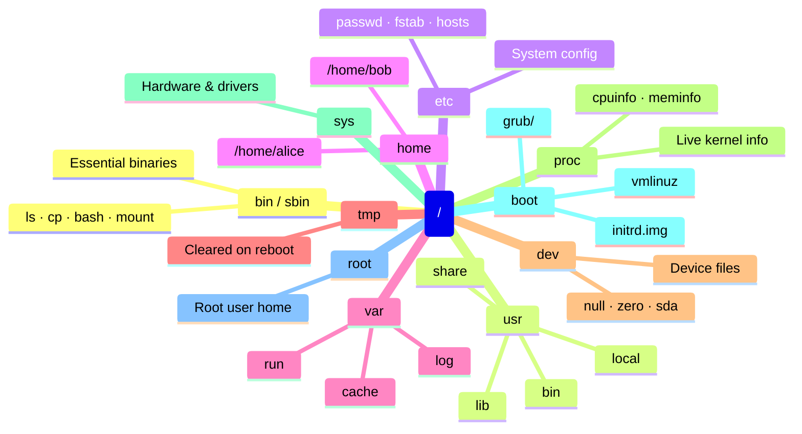
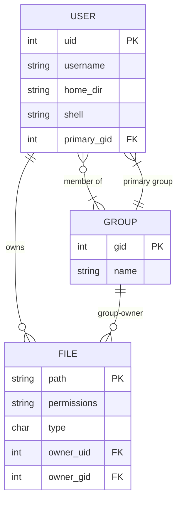
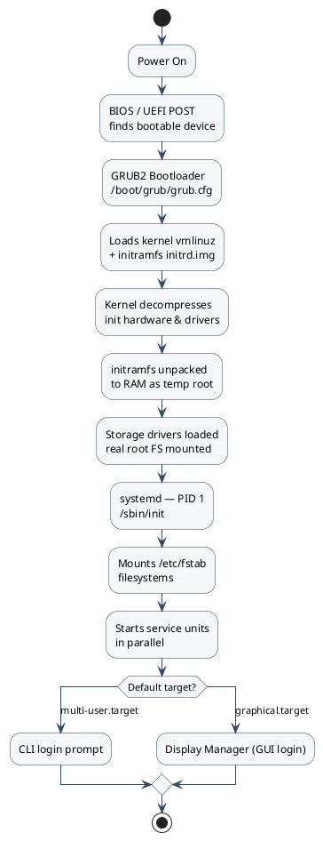
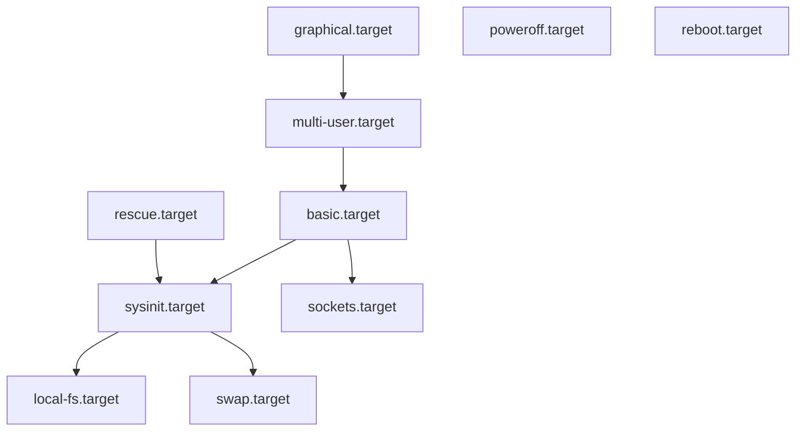

# Filesystem, Permissions & Boot — Quick Reference

---

## Linux Filesystem Hierarchy (FHS)

The entire Linux filesystem is a single tree rooted at `/`. Everything — disks, devices, network mounts — hangs off this tree.

```
/
├── bin       → essential user binaries (ls, cp, bash) — symlink to /usr/bin on modern systems
├── sbin      → system binaries (fdisk, mount) — symlink to /usr/sbin on modern systems
├── usr       → user programs and libraries
│   ├── bin       → most installed programs live here
│   ├── lib       → shared libraries for /usr/bin
│   ├── local/    → software compiled/installed outside the package manager
│   └── share/    → architecture-independent data (docs, icons)
├── etc       → system-wide configuration files
├── home      → user home directories (/home/alice, /home/bob)
├── root      → home directory of the root user (not inside /home)
├── var       → variable data: logs, databases, mail, pid files
│   ├── log/      → system and service logs
│   ├── cache/    → cached application data
│   └── run/      → runtime data (pid files, sockets)
├── tmp       → temporary files, cleared on reboot
├── dev       → device files (disks, ttys, null, random)
├── proc      → virtual filesystem: live kernel and process info
├── sys       → virtual filesystem: hardware and driver info
├── run       → runtime data since last boot (replaces /var/run on modern systems)
├── lib       → shared libraries for /bin and /sbin
├── mnt       → manual mount point for temporary mounts
├── media     → auto-mount point for removable media (USB, CD)
├── opt       → optional/third-party self-contained software
└── boot      → kernel, initrd, bootloader files
```



### Key directories to know

| Path | What it holds |
|------|--------------|
| `/etc/passwd` | User accounts (username, UID, home, shell) |
| `/etc/shadow` | Hashed passwords (root-readable only) |
| `/etc/group` | Group definitions |
| `/etc/fstab` | Filesystems to mount at boot |
| `/etc/hostname` | Machine hostname |
| `/etc/hosts` | Local DNS override |
| `/var/log/syslog` or `/var/log/messages` | General system log |
| `/proc/cpuinfo` | CPU info (live) |
| `/proc/meminfo` | RAM info (live) |
| `/proc/<PID>/` | Everything about a running process |

---

## File Permissions

Every file and directory has three permission sets: **owner**, **group**, and **others**.

```
-rwxr-xr--  1  alice  developers  4096  Jul 10 12:00  script.sh
│└──┴──┴──     └───┘  └────────┘
│  │  │  └─ others: r-- (read only)
│  │  └──── group:  r-x (read + execute)
│  └─────── owner:  rwx (read + write + execute)
└────────── file type: - = file, d = directory, l = symlink
```

The 9 permission bits as a bit field — orange = owner, blue = group, yellow = others; `attr` row shows octal value of each bit:

```wavedrom
{ "reg": [
  {"bits": 1, "name": "x", "type": 3, "attr": "1"},
  {"bits": 1, "name": "w", "type": 3, "attr": "2"},
  {"bits": 1, "name": "r", "type": 3, "attr": "4"},
  {"bits": 1, "name": "x", "type": 2, "attr": "1"},
  {"bits": 1, "name": "w", "type": 2, "attr": "2"},
  {"bits": 1, "name": "r", "type": 2, "attr": "4"},
  {"bits": 1, "name": "x", "type": 4, "attr": "1"},
  {"bits": 1, "name": "w", "type": 4, "attr": "2"},
  {"bits": 1, "name": "r", "type": 4, "attr": "4"}
], "options": {"hspace": 800, "vspace": 80, "fontsize": 15} }
```

### Permission bits

| Symbol | Octal | File meaning | Directory meaning |
|--------|-------|--------------|-------------------|
| `r` | 4 | Read file contents | List directory contents |
| `w` | 2 | Write / modify file | Create, delete, rename files inside |
| `x` | 1 | Execute as program | Enter directory (`cd`) |
| `-` | 0 | Permission denied | Permission denied |

### Octal quick reference

| Octal | Binary | Symbolic | Meaning |
|-------|--------|----------|---------|
| `7` | 111 | `rwx` | Full access |
| `6` | 110 | `rw-` | Read + write |
| `5` | 101 | `r-x` | Read + execute |
| `4` | 100 | `r--` | Read only |
| `0` | 000 | `---` | No access |

### Common permission patterns

| Mode | Symbolic | Typical use |
|------|----------|-------------|
| `644` | `rw-r--r--` | Regular files, configs |
| `755` | `rwxr-xr-x` | Directories, executables |
| `600` | `rw-------` | Private keys, sensitive files |
| `700` | `rwx------` | Private scripts/directories |
| `777` | `rwxrwxrwx` | World-writable — avoid in production |

### Special permission bits

| Bit | Name | Octal | Effect |
|-----|------|-------|--------|
| `s` on owner execute | SetUID (SUID) | `4xxx` | File runs as its owner (e.g. `sudo`, `passwd`) |
| `s` on group execute | SetGID (SGID) | `2xxx` | File runs as its group; new files in dir inherit group |
| `t` on others execute | Sticky bit | `1xxx` | Only owner can delete their own files (e.g. `/tmp`) |

```bash
chmod 4755 file     # set SUID
chmod 2755 dir      # set SGID on directory
chmod 1777 /tmp     # sticky bit (classic /tmp setup)
ls -l /tmp          # shows 'drwxrwxrwt' — t = sticky
```

---

## chmod — Change Permissions

```bash
# Octal (absolute — sets permissions exactly)
chmod 644 file.txt            # rw-r--r--
chmod 755 script.sh           # rwxr-xr-x
chmod 600 ~/.ssh/id_rsa       # private key

# Symbolic (relative — adds/removes specific bits)
chmod +x script.sh            # add execute for all
chmod -w file.txt             # remove write for all
chmod u+x script.sh           # add execute for owner only
chmod g-w file.txt            # remove write from group
chmod o-rwx file.txt          # remove all from others
chmod u=rwx,g=rx,o= file.txt  # set each class explicitly

# Recursive
chmod -R 755 ./public/        # apply to dir and all contents
```

:::caution
`chmod -R 777` on a directory is a security risk. Avoid on anything web-accessible or containing sensitive data.
:::

---

## chown — Change Ownership

```bash
chown alice file.txt           # change owner to alice
chown alice:developers file    # change owner + group
chown :developers file         # change group only
chown -R alice:alice ./dir     # recursive (all files inside)
```

:::tip
You need `sudo` to give a file to another user. You can change your own file's group to any group you belong to without sudo.
:::

---

## chgrp — Change Group

```bash
chgrp developers file.txt      # change group to 'developers'
chgrp -R www-data ./public/    # recursive
```

`chgrp` is equivalent to `chown :group` — use whichever is clearer.

---

## Users & Groups

### View users and groups

```bash
id                             # current user's UID, GID, and groups
id alice                       # another user's IDs
whoami                         # just the username
groups                         # groups the current user belongs to
cat /etc/passwd                # all users (username:x:UID:GID:comment:home:shell)
cat /etc/group                 # all groups (groupname:x:GID:members)
getent passwd alice            # look up a user via NSS (works with LDAP too)
```

### Manage users

```bash
sudo useradd -m -s /bin/bash alice    # create user with home dir and bash shell
sudo useradd -m -G sudo,docker alice  # add to groups at creation
sudo passwd alice                     # set password
sudo usermod -aG docker alice         # add alice to docker group (-a = append)
sudo usermod -s /bin/zsh alice        # change shell
sudo userdel alice                    # delete user (keep home dir)
sudo userdel -r alice                 # delete user + home dir
```

### Manage groups

```bash
sudo groupadd developers       # create a group
sudo groupdel developers       # delete a group
sudo gpasswd -a alice developers   # add alice to group
sudo gpasswd -d alice developers   # remove alice from group
```

:::note
After adding a user to a group with `usermod -aG`, they must log out and back in (or run `newgrp groupname`) for the change to take effect in the current session.
:::

### /etc/passwd format

```
alice:x:1001:1001:Alice Smith:/home/alice:/bin/bash
  │    │  │    │      │           │           └── login shell
  │    │  │    │      │           └── home directory
  │    │  │    │      └── comment / full name (GECOS)
  │    │  │    └── primary GID
  │    │  └── UID
  │    └── password placeholder (actual hash in /etc/shadow)
  └── username
```

Relationship between users, groups, and files:



### sudo — Run as root

```bash
sudo command                   # run as root
sudo -u alice command          # run as another user
sudo -i                        # open interactive root shell
sudo !!                        # re-run last command with sudo
visudo                         # safely edit /etc/sudoers
```

**`/etc/sudoers` entry format:**

```
alice   ALL=(ALL:ALL) ALL       # full sudo access
bob     ALL=(ALL) NOPASSWD: /bin/systemctl restart nginx   # specific command, no password
%developers ALL=(ALL) ALL      # grant to entire group
```

---

## umask — Default Permission Mask

`umask` subtracts permissions from newly created files and directories.

```bash
umask                          # show current mask (e.g. 0022)
umask 027                      # set new mask for this session
```

| umask | New file (666 base) | New dir (777 base) |
|-------|--------------------|--------------------|
| `022` | `644` (rw-r--r--) | `755` (rwxr-xr-x) |
| `027` | `640` (rw-r-----) | `750` (rwxr-x---) |
| `077` | `600` (rw-------) | `700` (rwx------) |

Files default to `666 - umask`, directories to `777 - umask` (execute is not set on new files).

---

## Boot Sequence

### Overview

```
Power on
    │
    ▼
┌─────────────────────────────┐
│  BIOS / UEFI                │  Hardware init, POST (Power-On Self Test)
│  Finds bootable device      │  Reads boot order from firmware settings
└────────────┬────────────────┘
             │
             ▼
┌─────────────────────────────┐
│  Bootloader (GRUB2)         │  Loads kernel + initrd from /boot
│  /boot/grub/grub.cfg        │  Shows OS selection menu
└────────────┬────────────────┘
             │
             ▼
┌─────────────────────────────┐
│  Kernel (vmlinuz)           │  Decompresses, initializes hardware
│  + initrd / initramfs       │  Temporary root FS with drivers needed to mount real root
└────────────┬────────────────┘
             │
             ▼
┌─────────────────────────────┐
│  init / systemd (PID 1)     │  First process started by the kernel
│  /sbin/init or systemd      │  Mounts real root FS, starts services
└────────────┬────────────────┘
             │
             ▼
┌─────────────────────────────┐
│  systemd targets            │  multi-user.target, graphical.target
│  (replaces SysV runlevels)  │  Starts all enabled services in parallel
└────────────┬────────────────┘
             │
             ▼
        Login prompt
```



### Stage 1 — BIOS vs UEFI

| | BIOS | UEFI |
|-|------|------|
| Partition table | MBR (max 2 TB, 4 partitions) | GPT (9.4 ZB, 128 partitions) |
| Boot files | MBR sector on disk | EFI partition (`/boot/efi`) |
| Secure Boot | No | Yes (can be disabled) |
| Speed | Slower | Faster |
| 64-bit | No | Yes |

### Stage 2 — GRUB2 Bootloader

```bash
cat /boot/grub/grub.cfg        # GRUB config (auto-generated, don't edit directly)
cat /etc/default/grub           # editable GRUB settings
sudo update-grub                # regenerate grub.cfg after editing /etc/default/grub

# Useful /etc/default/grub settings
GRUB_TIMEOUT=5                  # seconds to show menu
GRUB_DEFAULT=0                  # boot first entry by default
GRUB_CMDLINE_LINUX="quiet splash"  # kernel parameters
```

**GRUB rescue** — if grub drops to a rescue prompt:

```bash
# At grub rescue> prompt:
ls                              # list detected drives: (hd0), (hd0,gpt1), etc.
ls (hd0,gpt2)/                  # list files on a partition
set root=(hd0,gpt2)
set prefix=(hd0,gpt2)/boot/grub
insmod normal
normal                          # boot normally
```

### Stage 3 — Kernel + initramfs

```bash
ls /boot/                       # vmlinuz (kernel), initrd.img (initramfs), System.map
uname -r                        # running kernel version
ls /boot/vmlinuz-*              # all installed kernels
```

The **initramfs** (`initrd.img`) is a minimal temporary root filesystem built into a cpio archive. The kernel unpacks it into memory, uses it to load storage drivers and mount the real root partition, then switches to the real root via `pivot_root`.

```bash
lsinitramfs /boot/initrd.img-$(uname -r) | head -30   # inspect initramfs contents
```

### Stage 4 — systemd (PID 1)

```bash
systemctl list-units --type=service       # running services
systemctl list-units --state=failed       # failed units
systemctl start|stop|restart nginx        # manage a service
systemctl enable|disable nginx            # start/stop at boot
systemctl status nginx                    # service status + recent logs
journalctl -b                             # all logs from current boot
journalctl -b -1                          # logs from previous boot
journalctl -u nginx                       # logs for a specific unit
journalctl -f                             # follow live logs (like tail -f)

# Boot performance
systemd-analyze                           # total boot time
systemd-analyze blame                     # time each unit took
systemd-analyze critical-chain            # the slowest path through boot
```

### systemd targets (vs SysV runlevels)

| SysV Runlevel | systemd Target | Meaning |
|---------------|---------------|---------|
| 0 | `poweroff.target` | Shutdown |
| 1 | `rescue.target` | Single-user / recovery |
| 3 | `multi-user.target` | CLI, no GUI |
| 5 | `graphical.target` | Full desktop |
| 6 | `reboot.target` | Reboot |



```bash
systemctl get-default                     # current default target
sudo systemctl set-default multi-user.target   # boot to CLI by default
sudo systemctl isolate rescue.target      # switch to rescue mode now
```

### /etc/fstab — Persistent Mounts

```
# device         mountpoint    fstype  options         dump  pass
UUID=abc123...   /             ext4    defaults        0     1
UUID=def456...   /boot/efi     vfat    umask=0077      0     1
UUID=789...      /home         ext4    defaults        0     2
tmpfs            /tmp          tmpfs   size=1G,noexec  0     0
```

```bash
cat /etc/fstab                 # view current mounts config
sudo mount -a                  # mount all entries in fstab (test it)
blkid                          # list UUIDs and labels of all block devices
lsblk                          # block device tree
```

---

## Tips

- `ls -la` shows the full permission string — read it as `[type][owner][group][others]`.
- `stat file` shows octal permissions, owner, group, size, and timestamps in one shot.
- Prefer `chown user:group` over running `chown` and `chgrp` separately.
- `sudo !!` re-runs the last command with sudo — saves retyping long commands.
- `systemd-analyze blame` is your first stop when boot feels slow.
- Never set `777` permissions on files served by a web server — `644` for files, `755` for directories.
- The sticky bit on `/tmp` (`1777`) means any user can write there but cannot delete others' files.
- SUID on an executable (`chmod 4755`) makes it always run as its owner — review carefully before setting.

---

[← Linux](/coding/linux/)
