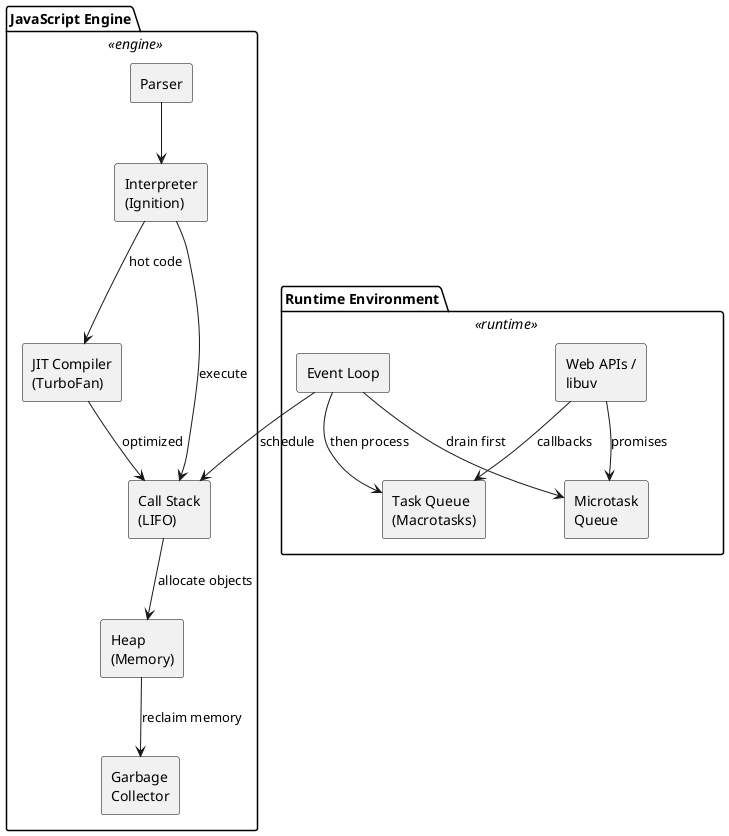
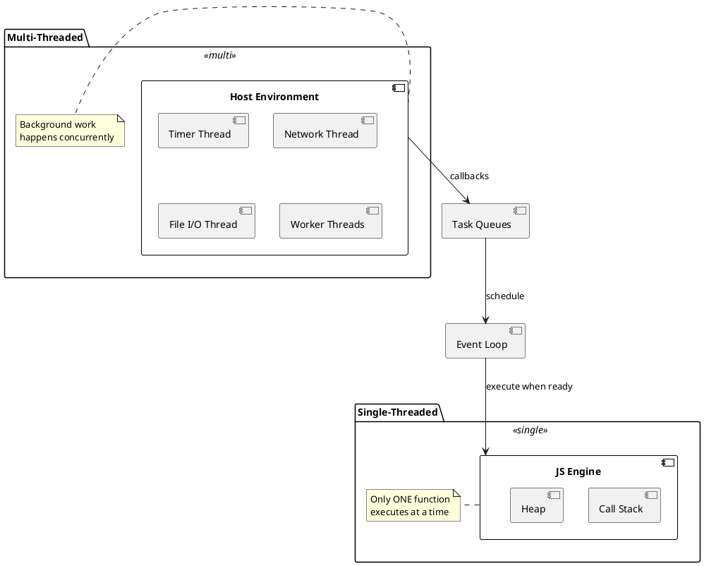
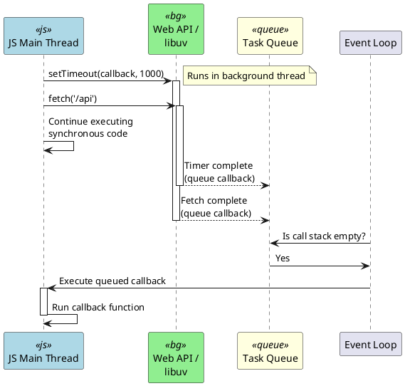
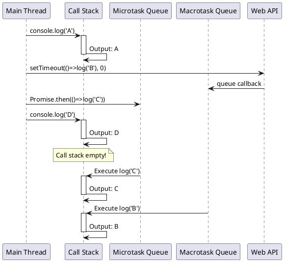

# JavaScript Engine & Runtime — interview‑ready guide

## 1) What is a JavaScript engine?

**Strong opening:**

> “A JavaScript engine is the program that parses, compiles, and executes JavaScript code.”

**Examples**

- V8 → Chrome, Node.js
- SpiderMonkey → Firefox
- JavaScriptCore → Safari

**Senior phrasing**

> “The JS engine consists of a parser, interpreter, JIT compiler, call stack, heap, and a garbage collector.”

---

## 2) Is JavaScript really single‑threaded?

**Yes — JavaScript execution itself is single‑threaded.**

That means:

- Only one function runs at a time
- No true parallel execution of JS code
- No shared memory race conditions in JS execution

**Why this design?**

> “JavaScript was designed to be single‑threaded to avoid race conditions and complexity when manipulating the DOM, since the DOM is not thread‑safe.”

If JS were multi‑threaded, two threads could mutate the DOM simultaneously, causing inconsistent UI or crashes.

---

## 3) Then how is JS “asynchronous”?

**Key distinction:**

- 🔴 The JS engine is **single‑threaded**
- 🔵 The runtime environment is **multi‑threaded**

**Browser runtime includes**

- JS engine (single thread)
- Web APIs (timers, fetch, DOM events)
- Task queue + microtask queue
- Event loop

**Node runtime includes**

- JS engine
- libuv thread pool
- Event loop

So JS runs on one thread, but async work runs elsewhere and schedules callbacks back later.



---

## 4) Core components of the JS runtime (interview gold)

1. **Heap** → memory allocation
2. **Call Stack** → where functions execute (single thread)
3. **Web APIs / libuv** → background work
4. **Task Queues** → callback waiting areas
5. **Event Loop** → coordinator

---

## 5) Call stack — the heart of single‑threaded JS

The call stack is a **LIFO** stack of function calls. Only one stack frame runs at a time.

```js
function a() {
	b()
}

function b() {
	c()
}

function c() {
	console.log('hi')
}

a()
```

**Stack flow:**

```
push a
	push b
		push c
			log
		pop c
	pop b
pop a
```

**Senior phrasing**

> “Because there is only one call stack, JavaScript can only execute one function at a time.”
```plantuml
@startuml
!define STACKCOLOR #E8F4F8

skinparam sequenceMessageAlign center

participant "Code" as code
participant "Call Stack" as stack

code -> stack : push a()
activate stack #STACKCOLOR
note right: Stack: [a]

code -> stack : push b()
activate stack #STACKCOLOR
note right: Stack: [a, b]

code -> stack : push c()
activate stack #STACKCOLOR
note right: Stack: [a, b, c]

stack -> stack : console.log('hi')
note right: Execute & pop c
deactivate stack

note right: Stack: [a, b]
deactivate stack

note right: Stack: [a]
deactivate stack

note right: Stack: []

@enduml
```
---

## 6) Heap — where objects live

The heap stores:

- Objects
- Closures
- Arrays
- Functions

Memory is allocated on the heap and reclaimed by the garbage collector.

**Interview line**

> “The heap is where dynamically allocated objects are stored, and the garbage collector reclaims unused memory.”

---

## 7) Web APIs / background threads — where async work happens

These do **not** run inside the JS engine:

```js
setTimeout(fn, 1000)
fetch('/api')
addEventListener('click', fn)
```

They run in:

- Browser Web APIs
- Node’s libuv thread pool

**Senior phrasing**

> “Asynchronous operations are handled by the host environment — timers, network, and I/O run outside the JS engine and notify it when they complete.”

---

## 8) Task queues — where callbacks wait

When async work finishes, callbacks are queued until the engine is ready to run them.

**Two main queues**

**Macrotask queue** (task queue)

- `setTimeout`, `setInterval`
- DOM events
- `postMessage` / message events
- I/O callbacks (Node)

**Microtask queue** (higher priority 🔥)

- `Promise.then` / `catch` / `finally`
- `queueMicrotask`
- `MutationObserver`

**Rule:** microtasks always run before macrotasks, and the microtask queue is fully drained each time it runs.

---

## 9) Event loop — the orchestrator (detailed)

The event loop coordinates **when** queued work runs. A practical mental model:

1) **Run the current call stack** (synchronous JS)
2) **Drain microtasks** (all of them)
3) **Run one macrotask**
4) **Render if needed** (browser only)
5) Repeat

```js
while (true) {
  runCallStack()
  runAllMicrotasks()
  runOneMacrotask()
  renderIfNeeded() // browser: style → layout → paint → composite
}
```

```plantuml
@startuml
skinparam activityBackgroundColor #E8F4F8
skinparam activityBorderColor #333

start

:Execute Current\nCall Stack;
note right: Run synchronous code

:Drain ALL\nMicrotasks;
note right
    - Promise.then()
    - queueMicrotask()
    - MutationObserver
    (runs until empty)
end note

:Run ONE\nMacrotask;
note right
    - setTimeout
    - setInterval
    - DOM events
    - I/O callbacks
end note

if (Browser?) then (yes)
    :Render UI\n(if needed);
    note right
        - Style calculation
        - Layout
        - Paint
        - Composite
    end note
else (no)
endif

backward:Next Loop;

@enduml
```

**Why microtasks are special**

- They run **immediately after** the current stack finishes.
- They can **starve** rendering if you keep queueing more microtasks.

**Browser rendering note**

Browsers typically render **between** macrotasks (after microtasks drain). That’s why long tasks or endless microtasks cause visible jank.

**Senior phrasing**

> “The event loop keeps the UI responsive by executing sync code, draining microtasks, then running one macrotask and letting the browser render before repeating.”

---

## 10) Classic interview example (you will be asked)

```js
console.log('A')

setTimeout(() => console.log('B'), 0)

Promise.resolve().then(() => console.log('C'))

console.log('D')
```

**Execution order**

1. A (sync)
2. D (sync)
3. C (microtask)
4. B (macrotask)

**Output**

```
A
D
C
B
```



**Senior explanation**

> “Promises run in the microtask queue, which is drained before macrotasks like `setTimeout`.”

---

## 11) Blocking the main thread (performance impact)

Because JS is single‑threaded, a long synchronous task blocks everything:

```js
while (true) {}
```

This will:

- Block the call stack
- Freeze the UI
- Stop the event loop
- Prevent clicks, rendering, and async callbacks

**Senior phrasing**

> “Any long‑running synchronous computation blocks the main thread, freezing rendering and preventing the event loop from processing other tasks.”

---

## 12) Handling heavy work

**Web Workers**

- Run JS on separate threads
- No DOM access
- Communicate by message passing

```js
const worker = new Worker('worker.js')
worker.postMessage(data)
```

**Chunking**

Break long tasks into small pieces using:

- `setTimeout`
- `requestIdleCallback`
- `requestAnimationFrame`

---

## 13) JIT compilation (advanced but impressive)

Modern engines don’t interpret line‑by‑line. They use:

1) Parser → AST
2) Interpreter (baseline)
3) JIT compiler (optimizes hot code)

**V8 pipeline**

- Ignition (interpreter)
- TurboFan (optimizing compiler)

**Senior phrasing**

> “Modern JS engines use JIT compilation, profiling hot code paths and recompiling them with aggressive optimizations for performance.”

---

## 14) Node.js specifics (optional but strong)

Node runs JS on a single thread but uses libuv’s thread pool for I/O:

- File I/O
- DNS
- Crypto

**Senior phrasing**

> “Node is single‑threaded for JS execution, but uses a background thread pool via libuv for I/O, allowing high concurrency with an event‑driven model.”

---

## 15) A perfect interview‑ready answer (high impact)

> “JavaScript execution is single‑threaded, meaning there is only one call stack and only one piece of JS runs at a time. This design avoids race conditions and makes DOM manipulation safe, since the DOM is not thread‑safe.
>
> However, the JavaScript runtime is multi‑threaded. Asynchronous operations like timers, network requests, and I/O are handled by the host environment in background threads, and their callbacks are queued back to the main thread.
>
> The runtime consists of a call stack, heap, Web APIs, task queues, and an event loop. When the call stack is empty, the event loop first drains the microtask queue, then processes one macrotask, and repeats. This is why Promise callbacks run before setTimeout callbacks.
>
> Because everything runs on one main thread, long synchronous tasks can block rendering and freeze the UI, so for heavy computations we use techniques like chunking or Web Workers to keep the main thread responsive.”

---

## 16) Final mental model (very senior)

JS engine → single thread → one call stack  
Async work → background threads  
Callbacks → queued  
Event loop → schedules execution

Or:

- 🔴 One thread executes JS
- 🔵 Many threads do async work
- 🟡 Event loop coordinates everything