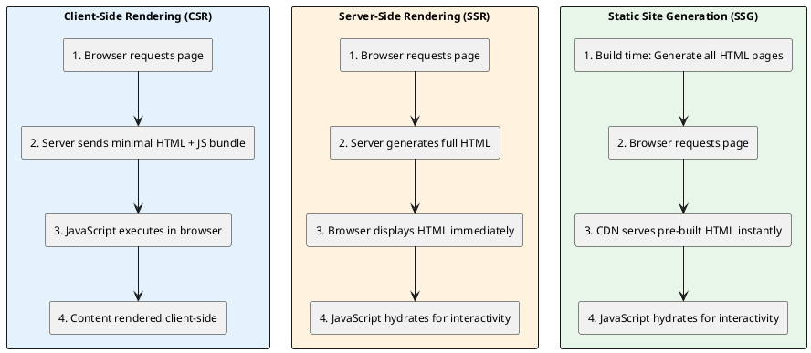
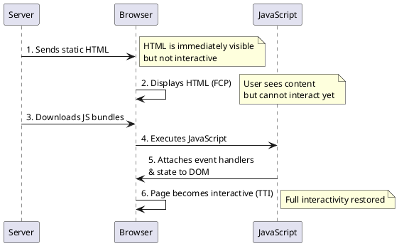
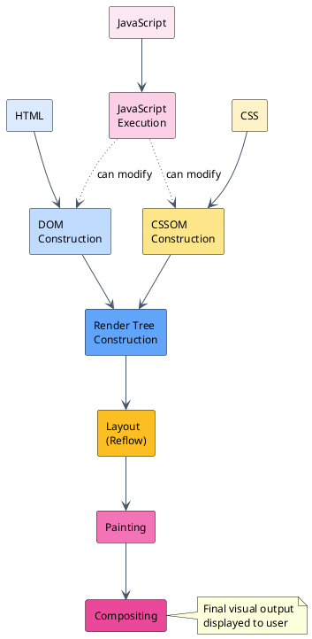
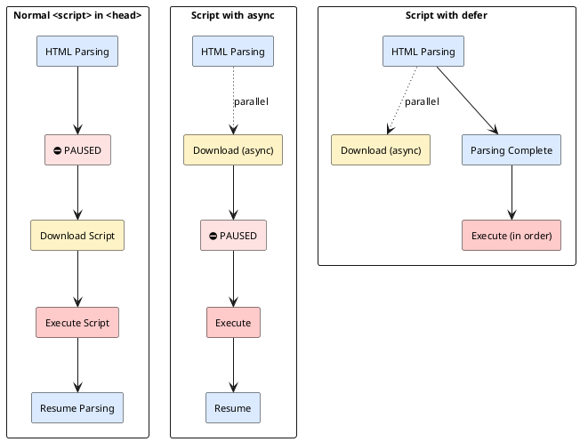
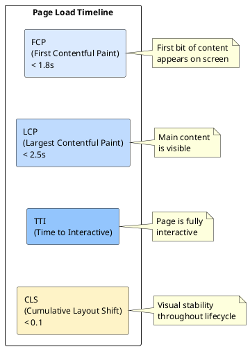
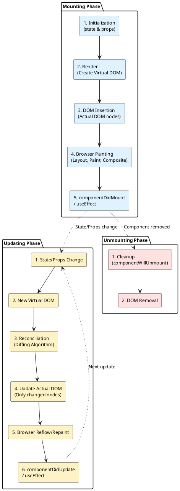
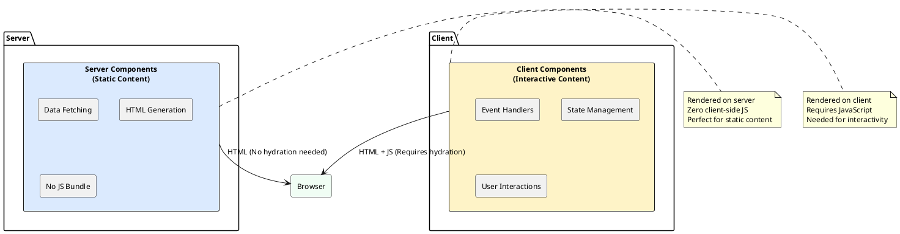

This guide covers the complete lifecycle of React components from initial load to screen painting, including rendering strategies, browser rendering mechanisms, hydration concepts, and performance measurement techniques.

## Rendering Strategies

:::note[Core Rendering Strategies]
Modern web applications use different rendering strategies to optimize for performance, SEO, and user experience. Understanding these strategies helps you choose the right approach for your application.
:::

### Comparison of Rendering Strategies

|Strategy|Where/When Rendered|Best For|Pros|Cons|
|---|---|---|---|---|
|**Client-Side Rendering (CSR)**|In the user's browser using JavaScript after the initial page load|Highly interactive applications, dashboards, or internal tools where SEO is not a priority|Rich, app-like interactivity; fast in-app navigation; reduced server load|Slower initial load time (blank page visible initially); can be detrimental to SEO; heavily reliant on JavaScript|
|**Server-Side Rendering (SSR)**|On the server for every individual request|Content-heavy sites, e-commerce, news portals, or any site where SEO and fast initial load are crucial|Faster initial page load (fully-formed HTML sent); excellent for SEO; content is available even if JavaScript is disabled|Increased server load and processing cost; slower per-request latency; more complex architecture|
|**Static Site Generation (SSG)**|At build time, generating static HTML files|Content that does not change frequently, such as blogs, documentation, and marketing pages|Ultra-fast performance (pages served from a CDN); best possible SEO; high scalability and security|Requires a full rebuild and redeployment to update content; not suitable for dynamic or user-specific content|
|**Incremental Static Regeneration (ISR)**|Static pages built at build time, with the ability to regenerate them periodically or on-demand after deployment|Large e-commerce catalogs or news sites that need speed but also require content updates without a full rebuild|Balances static performance with dynamic updates; good for SEO and scalability|Can be more complex to set up; a user might briefly see stale content before regeneration|

### Rendering Strategy Flow

### Advanced and Hybrid Techniques

:::tip[Modern Optimization Strategies]
Modern development often uses combinations or advanced strategies to optimize performance:
:::

- **Hybrid Rendering** - Using different strategies for different pages or even parts of a page (e.g., SSG for a blog index and CSR for the comment section)
- **Edge-Side Rendering (ESR)** - Renders content on servers at the "edge" of the network (closer to the user) to reduce latency
- **Partial Hydration / Islands Architecture** - Only loads and executes JavaScript for specific interactive components, reducing the overall JavaScript payload and improving performance
- **Streaming SSR** - Sends HTML in chunks to the browser as it is generated on the server, allowing the user to see content sooner (faster FCP)

:::note[Choosing the Right Strategy]
The best strategy depends on your project's specific needs regarding content freshness, user interactivity, SEO requirements, and performance goals.
:::

---

## Hydration

:::tip[What is Hydration?]
Hydration is the process of attaching JavaScript event handlers and state to server-rendered HTML, transforming static content into an interactive application.
:::

### The Hydration Process

The process typically follows these steps:

1. **Server Renders HTML** - The server processes the page content and sends a static HTML string to the client's browser
2. **Browser Displays HTML** - The browser receives the HTML and immediately begins painting the pixels to the screen. The user can see the content but cannot interact with it yet
3. **JavaScript Loads** - The browser downloads the necessary JavaScript bundles (which were also generated during the build or server process)
4. **JavaScript Executes** - Once downloaded, the JavaScript executes. The client-side framework (e.g., React, Vue, Angular) effectively "wakes up" on top of the existing HTML
5. **Event Handlers Attached** - The JavaScript code traverses the static DOM (Document Object Model) and attaches event listeners and application state to the relevant elements. For example, it might add a `click` handler to a button that was just static HTML
6. **Page Becomes Interactive** - The page is now fully "hydrated" and behaves like a regular client-side rendered application, with full interactivity and dynamic capabilities

### Benefits

:::tip[Key Advantages]
- **Fast First Contentful Paint** - The server generates the full HTML content of the page and sends it to the browser, allowing the user to see the content quickly
- **Improved SEO** - Search engine crawlers can easily index the fully-formed HTML content
- **Seamless Interactivity** - The transition from a static page to a dynamic, interactive application is smooth and flicker-free if implemented correctly
:::

### Challenges

:::caution[Common Issues]
- **Time to Interactivity** - There can be a delay between the content being visible and the page becoming interactive (a period where the page appears loaded but user clicks do nothing)
- **Hydration Mismatches** - If the client-side rendered structure or data does not exactly match the server-rendered HTML, it can lead to errors, visual glitches, or the client having to discard and re-render the entire DOM
- **Blocking Main Thread** - The process of executing the large JavaScript bundle and attaching event handlers can temporarily block the browser's main thread, leading to a delay in TTI (Time to Interactive)
- **Performance Overhead** - Sending duplicate data (HTML structure and then the JavaScript to rebuild that structure) can increase page weight
:::

### Optimization Techniques

To address these challenges, modern frameworks employ optimization techniques:

- **Partial Hydration / Progressive Hydration** - Hydrating only specific components that need interactivity, rather than the entire page
- **Lazy Hydration** - Only hydrating components when the user interacts with them or as they come into the viewport
- **Streaming Hydration** - Hydrating parts of the document as they arrive from the server, rather than waiting for the entire page to load

---

## Browser Rendering Process

:::note[Critical Rendering Path]
The browser rendering process, often referred to as the **critical rendering path**, is the sequence of steps a web browser takes to convert HTML, CSS, and JavaScript code into the visual, interactive page displayed on a user's screen.
:::

### Critical Rendering Path Overview

### 1. DOM Construction (Parsing HTML)

The browser's HTML parser processes the raw bytes of HTML code and converts them into a tree structure called the **Document Object Model (DOM)**. The DOM represents the structure of the page, where each HTML tag becomes a "node" in the tree.

**Parsing Steps:**

- **HTML & Bytes** - Raw HTML code is received
- **Characters** - Bytes are converted into individual characters based on file encoding
- **Tokens** - Characters are converted into "tokens" (e.g., `<html>`, `<body>`)
- **Nodes** - Tokens are converted into "nodes"
- **DOM** - Nodes are linked together in a tree structure

### 2. CSSOM Construction (Parsing CSS)

The browser also parses CSS files, inline styles, and `<style>` blocks. Like the DOM, this is converted into a tree structure called the **CSS Object Model (CSSOM)**. The CSSOM represents the styling information for the DOM nodes, including cascading rules and inherited styles.

:::caution[Render-Blocking Resource]
Unlike the DOM, the CSSOM cannot be built incrementally because later styles can override earlier ones due to the "cascade" principle. Therefore, CSS is generally a **render-blocking resource**, meaning the browser waits for the entire CSSOM to be built before proceeding with the render tree.
:::

### 3. Render Tree Construction

The browser merges the DOM and the CSSOM into a single **Render Tree** (also sometimes called the layout tree). This tree contains only the nodes that will actually be visible on the page, with all their calculated styles applied.

:::tip[Render Tree Optimization]
Nodes that are hidden (e.g., elements with `display: none;` or `<head>` tags) are not included in the Render Tree.
:::

### 4. Layout (Reflow)

Once the browser has the Render Tree, it needs to figure out the exact geometric position and size of every visible element on the screen. This process is called **Layout** or **Reflow**.

It calculates the coordinates and dimensions for each node in the Render Tree, determining how much space each element takes up and where it sits relative to other elements.

### 5. Painting

The **Painting** stage is where the browser converts the Render Tree's calculated information into actual pixels on the screen. It draws the visual components of the elements, including colors, borders, shadows, text, and images, often onto different layers.

### 6. Compositing

Finally, the browser combines these different painted layers in the correct order to create the final, visible webpage that the user sees in the viewport. This stage is called **Compositing**. This process often leverages the computer's graphics processing unit (GPU) for smoother and faster results, especially during animations or scrolling.

### JavaScript's Impact on Rendering

:::caution[Script Blocking]
When the browser encounters a `<script>` tag, it pauses the DOM construction process (unless `async` or `defer` attributes are used) to download and execute the JavaScript. This is because JavaScript can read from or modify both the DOM and CSSOM, so the browser must execute it to ensure the correct structure and styles are used for rendering.
:::

---

## Script Loading Strategies

:::tip[Script Placement Matters]
The browser handles scripts differently depending on whether they are in the `<head>` or the `<body>` (or at the bottom of the `<body>`), and if the `async` or `defer` attributes are used.
:::

### Script Loading Behavior

### 1. Scripts in the `<head>` (Default, Synchronous)

When a browser encounters a standard `<script>` tag within the `<head>` section:

- **HTML Parsing Paused** - The browser **stops** parsing the HTML content immediately
- **Download & Execute** - It downloads the external script file (if any) and executes the code
- **Rendering Blocked** - The DOM construction and the rest of the rendering process are paused until the script finishes execution
- **Impact** - This results in a "render-blocking" behavior, making the page appear blank for longer. If the script is large or slow to download, it significantly delays the user seeing the page content
- **Use Case** - Only necessary for scripts that must run _before_ any content is rendered or the page structure is available (e.g., polyfills or certain tracking scripts that need to be defined at the absolute beginning)

### 2. Scripts at the End of the `<body>` (Recommended Default)

:::tip[Best Practice]
Placing the `<script>` tag just before the closing `</body>` tag is a widely recommended best practice.
:::

- **HTML Parsing Finishes First** - The browser fully parses and displays the entire HTML and CSS before encountering the script
- **DOM Available** - When the script executes, the full DOM is available for manipulation
- **Rendering Not Blocked Initially** - The user can see the content faster, improving perceived performance
- **Impact** - This prevents the script from blocking the initial page display

### 3. Async and Defer Attributes

|Attribute|Behavior|Execution Time|Use Case|
|---|---|---|---|
|`async`|Downloads the script **asynchronously** in parallel with HTML parsing. The parser pauses and executes the script immediately upon download completion, regardless of order.|As soon as it's downloaded (unpredictable)|Independent, third-party scripts like analytics or ads where execution order doesn't matter|
|`defer`|Downloads the script **asynchronously** in parallel with HTML parsing. The execution is deferred until after the browser has finished parsing all of the HTML.|After the entire HTML document is parsed, in the order they appear|Scripts that depend on the DOM being ready and/or other deferred scripts in a specific order|

---

## Performance Metrics

:::note[Measuring User Experience]
Performance metrics are used to quantify the user experience during a page load, specifically focusing on rendering speed, responsiveness, and visual stability.
:::

### Core Web Vitals

#### 1. First Contentful Paint (FCP)

- **What it measures** - FCP measures when the very first bit of content (text, image, or non-white canvas/SVG) is painted to the screen
- **User Perception** - This indicates the start of the page load experience. A low FCP makes the user feel something is happening quickly
- **Goal** - A good FCP score is under **1.8 seconds**

#### 2. Largest Contentful Paint (LCP)

- **What it measures** - LCP measures when the largest visible content element (e.g., a large image or a main headline block) is rendered on the screen
- **User Perception** - This signifies when the main content of the page has likely loaded. It is a key indicator of the page's perceived load speed
- **Goal** - A good LCP score is under **2.5 seconds**

#### 3. Cumulative Layout Shift (CLS)

- **What it measures** - CLS measures the amount of unexpected visual instability during the page's lifecycle. It quantifies how much visible elements shift around on the screen as assets (like images or ads) load in dynamically
- **User Perception** - High CLS is frustrating; it causes users to click the wrong links or lose their place while reading
- **Goal** - A good CLS score is under **0.1**

### Additional Performance Metrics

#### Loading Metrics

- **Time to First Byte (TTFB)** - Measures the time to receive the first byte of data from the server
- **Time to Interactive (TTI)** - Measures the time until a page is fully interactive—meaning the FCP has occurred, event handlers are registered, and the main thread is idle enough to handle user input reliably

#### Interactivity Metrics

These metrics gauge how quickly a page responds to user input:

- **Interaction to Next Paint (INP)** - Measures the time from user interaction to the next visual update, reflecting responsiveness throughout the page's lifespan
- **Total Blocking Time (TBT)** - A lab metric for quantifying blocked main thread time during loading, impacting responsiveness

---

## React Component Lifecycle

:::note[Three Phases]
The lifecycle of a React component from initial loading to painting involves distinct phases: **Mounting**, **Updating**, and **Unmounting**.
:::

React uses a sophisticated system involving a **Virtual DOM** and a **Reconciliation** algorithm to manage changes efficiently before involving the actual browser rendering process.

### React Rendering Flow

### Phase 1: Mounting (Initial Load and Paint)

This phase covers the first time a component is created and inserted into the actual browser DOM.

1. **Initialization** - The component's state and props are initialized (e.g., using a class constructor or `useState` in functional components)
2. **Render (Virtual DOM creation)** - React's `render()` method is called. It does not touch the actual browser DOM yet. Instead, it creates a lightweight representation of the component's UI in memory, known as the **Virtual DOM** (a React element tree)
3. **DOM Insertion** - React takes the Virtual DOM tree and inserts the corresponding actual DOM nodes into the browser
4. **Browser Painting** - The browser's critical rendering path (layout, paint, compositing) executes, and the component becomes visible on the screen
5. **Component Mounted** - This is a side effect phase. Once the component is physically present in the DOM, React executes code here (e.g., `componentDidMount` / `useEffect` for fetching data from an API, setting up subscriptions, or direct DOM manipulation)

### Phase 2: Updating (DOM Updates Triggered by React)

:::tip[React's Efficiency]
This phase occurs when a component's state or props change, triggering a re-render. This is where React efficiently updates the screen.
:::

1. **Trigger Update** - A change in state (`setState`, `useState` hook setter) or props occurs
2. **Render (New Virtual DOM creation)** - The component's `render()` method is called again, generating a _new_ Virtual DOM tree that reflects the latest state/props
3. **Reconciliation (The Diffing Algorithm)** - This is the core of React's efficiency. React compares the _new_ Virtual DOM tree with the _previous_ Virtual DOM tree (the "diffing" process). It identifies exactly what has changed (e.g., "only this one `div`'s text content needs to change")
4. **Actual DOM Update** - Based on the reconciliation results, React calculates the minimum necessary changes and performs direct updates _only_ to those specific nodes in the actual browser DOM. This avoids costly full-page re-renders
5. **Browser Reflow/Repaint** - Only the affected parts of the browser DOM trigger a browser layout calculation or repaint process, leading to fast and smooth updates
6. **Component Updated** - Side effects related to the update are executed here (e.g., `componentDidUpdate` / `useEffect`)

### Phase 3: Unmounting

This final phase occurs when a component is removed from the DOM (e.g., a user navigates away or a conditional render hides it).

1. **Cleanup** - This phase is used to tear down any resources set up during mounting or updating (e.g., `componentWillUnmount` / `useEffect` cleanup function for clearing timers, cancelling network requests, or removing event listeners)
2. **DOM Removal** - React removes the component's nodes from the actual browser DOM

---

## React Server Components

:::note[Modern Approach]
Server Components (specifically React Server Components, or RSC) are a modern approach introduced by React that allows developers to render components on the server _at build time_ or _at request time_, before the page is sent to the client's browser.
:::

### Server vs Client Components

### Hybrid Rendering Strategy

:::tip[Key Benefit]
The key benefit of Server Components is enabling hybrid rendering where static and dynamic content coexist seamlessly.
:::

**Benefits:**

- **Mixing Server and Client** - A single page can contain both Server Components (for static content or data fetching) and Client Components (for interactive elements like form inputs, click handlers, or stateful logic)
- **Efficient Hydration** - Only the _Client Components_ need to be hydrated with JavaScript on the client side, significantly reducing the amount of JavaScript processed by the user's browser and improving the "Time to Interactive" (TTI) metric
- **Streaming SSR** - Server components enable the streaming of HTML and other data formats (like the React-specific RSC payload) to the client, allowing parts of the UI to render as they become available rather than waiting for the entire page to finish on the server
- **Zero Client-Side JS for Server Components** - Server Components don't add to the JavaScript bundle, reducing the overall payload sent to the client

### When to Use Each Type

|Component Type|Use When|Examples|
|---|---|---|
|**Server Components**|Content is static, data needs to be fetched from a database, no user interaction required|Blog post content, product listings, user profiles, static headers/footers|
|**Client Components**|User interaction is required, browser APIs are needed, state management is necessary|Forms, modals, interactive charts, search bars, shopping carts|

---

## Summary

:::tip[Key Takeaways]
1. **Choose the right rendering strategy** based on your application's needs (CSR, SSR, SSG, or ISR)
2. **Understand hydration** to optimize the transition from server-rendered to interactive content
3. **Know the browser's critical rendering path** to identify and fix performance bottlenecks
4. **Optimize script loading** using async, defer, or proper placement strategies
5. **Monitor Core Web Vitals** (FCP, LCP, CLS) to ensure good user experience
6. **Leverage React's Virtual DOM** for efficient updates and minimal browser reflows
7. **Use Server Components** for static content and Client Components for interactive features
:::

