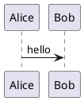

Download an Agent Skill so Claude, Cursor, Codex, Gemini, or Copilot writes pages the same way this site renders them. The canonical instructions are the `SKILL.md` files below; the live syntax playground is [Example Guide](/guides/example/).

## Download

Copy the `write-docs-page` folder into your project (keep that folder name).

| Agent | Skill file | Install path |
|-------|------------|--------------|
| Claude Code | [SKILL.md](/ai-skills/claude/write-docs-page/SKILL.md) | `.claude/skills/write-docs-page/` |
| Cursor | [SKILL.md](/ai-skills/cursor/write-docs-page/SKILL.md) | `.cursor/skills/write-docs-page/` |
| OpenAI Codex | [SKILL.md](/ai-skills/codex/write-docs-page/SKILL.md) | `.agents/skills/write-docs-page/` |
| Gemini CLI | [SKILL.md](/ai-skills/gemini/write-docs-page/SKILL.md) | `.gemini/skills/write-docs-page/` |
| GitHub Copilot | [SKILL.md](/ai-skills/copilot/write-docs-page/SKILL.md) | `.github/skills/write-docs-page/` |

Shared copies (same body):

- [Canonical SKILL.md](/ai-skills/write-docs-page/SKILL.md)
- [Kroki diagram types](/ai-skills/write-docs-page/references/diagrams.md)
- [Install README](/ai-skills/README.md)

:::tip
Codex looks in `.agents/skills/` in the repo (and `~/.agents/skills/` for user skills). Gemini also accepts `.agents/skills/` as an alias of `.gemini/skills/`.
:::

## Conventions the skill enforces

1. Files go in `src/content/docs/<section>/<slug>.md` with a **lowercase** path.
2. Frontmatter needs `title` (and usually `description`). Optional `sidebar.order` / `sidebar.label`.
3. Public URLs drop `.md` and use a trailing slash. Internal links must match (`/guides/example/`, not `.md`).
4. Asides: `:::tip`, `:::note[Title]`, `:::caution`, plus site blocks `:::success`, `:::warn`, `:::info`.
5. Diagrams: Kroki fences (`plantuml`, `mermaid`, `c4`, `structurizr`, `diagramsnet`, `vega` / `vegalite`, …). Rendered HTML/SVG uses `` ```renderhtml ``, not `` ```html ``.
6. Tabbed markdown: `:::::group-container` + `::::group-item[Title]{active}` (outer fences use more colons).
7. Tabbed code: `:::group` around fences with `title="…"`.
8. Tables: wrap GFM tables in `:::data-table` (optional `{perPage=50}`, `searchable=false`, …).
9. Code meta: Expressive Code (`showLineNumbers`, `{2-3}`, `ins` / `del`, `collapse`, `wrap`, `frame="terminal"`).
10. Math: KaTeX `$inline$` and `$$block$$`.
11. A new top-level docs folder also needs a sidebar `autogenerate` entry in `astro.config.mjs`.

## Supported diagrams

Fence with the language. Full mapping: [diagram types](/ai-skills/write-docs-page/references/diagrams.md).

:::::group-container

::::group-item[UML]{active}

- Block → `blockdiag`
- Sequence → `plantuml`, `mermaid`, `seqdiag`
- Activity → `plantuml`, `mermaid`, `actdiag`
- Network → `nwdiag`
- Use case / class / state / object / deployment → `plantuml` (class and state also `mermaid`)
- Timing → `plantuml`, `wavedrom`
- Entity relationship → `erd`, `plantuml`, `mermaid`

::::

::::group-item[C4]

- C4 context / container / component → `c4` or `c4plantuml`
- Structurizr DSL (landscape, context, container, component, dynamic, deployment) → `structurizr`

::::

::::group-item[Other]

- OO graph → `graphviz` / `dot`, `d2`
- WBS / mind map / Gantt → `plantuml` and/or `mermaid`
- Ditaa, packet, rack, BPMN, bytefield → `ditaa`, `packetdiag`, `rackdiag`, `bpmn`, `bytefield`
- Waveform → `wavedrom`
- HDL → `symbolator`
- Excalidraw, diagrams.net, WireViz, GoAT → `excalidraw`, `diagramsnet`, `wireviz`, `goat`

::::

::::group-item[Charts]

Bar, line, area, circular, scatter, distributions, maps, trees, networks, heatmaps, word clouds, and beeswarm plots → `vegalite` or `vega`.

::::

:::::

Show the language on the opening fence (these are **source** examples; they are not rendered here):

````md


```c4
@startuml
!include <C4/C4_Context>
Person(user, "User")
System(app, "App")
Rel(user, app, "Uses")
@enduml
```
````