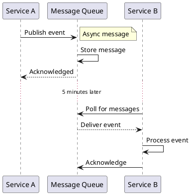

Guides lead a user through a specific task they want to accomplish, often with a sequence of steps.
Writing a good guide requires thinking about what your users are trying to do.

[fundamentals](/high-level-design/fundamentals)

[system-design](/high-level-design/system-design)

```d2
direction: right
installation -> configuration

```


Text can be **bold**, _italic_, or ~~strikethrough~~.



```java
// example.java
System.out.println();
```


```
Text can be **bold**, _italic_, or ~~strikethrough~~.
```
## Further reading

- Read [about how-to guides](https://diataxis.fr/how-to-guides/) in the Diátaxis framework
