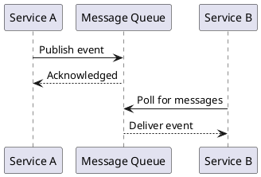

This page is a quick reference for writing content on this site: markdown, Kroki diagrams, and code blocks (highlighting, line marks, diffs, collapse, and more).

## Markdown basics

Text can be **bold**, _italic_, or ~~strikethrough~~.

:::tip
Use Starlight asides for tips, notes, and cautions.
:::

:::note[Named note]
You can give asides a custom title.
:::

Custom blocks configured on this site:

:::success
Advantage callout (`:::success`).
:::

:::warn
Disadvantage callout (`:::warn`).
:::

:::info
Info callout (`:::info`).
:::

## Diagrams (Kroki)

Fence with the diagram language (or `kroki type=…`). These render at build time.

```d2
direction: right
installation -> configuration
```


```plantuml
@startuml
participant "Service A" as A
participant "Message Queue" as MQ
participant "Service B" as B

A -> MQ: Publish event
MQ --> A: Acknowledged
B -> MQ: Poll for messages
MQ --> B: Deliver event
@enduml
```

Also works: `mermaid`, `graphviz`, `excalidraw`, `structurizr`, and other [Kroki](https://kroki.io) types.

## Code snippets (Expressive Code)

Code fences use [Expressive Code](https://expressive-code.com/). Meta options go after the language on the opening fence.

### Title and frame

```ts title="src/lib/greet.ts"
export function greet(name: string) {
  return `Hello, ${name}!`;
}
```

```bash frame="terminal" title="Install deps"
bun install
bun run build
```

### Line numbers

Line numbers are **on by default** for `js`, `ts`, `html`, `java`, and `python`. Toggle per block:

```js showLineNumbers
console.log("line 1");
console.log("line 2");
console.log("line 3");
```

```js showLineNumbers=false
// No gutter numbers on this block
console.log("still highlighted");
```

```js showLineNumbers startLineNumber=40
// Continues as if this file started at line 40
export const PORT = 4321;
```

### Highlight lines (`mark`)

Neutral highlight — draw attention without implying add/remove.

````md
```js {2-3} showLineNumbers
````

```js {2-3} showLineNumbers
function add(a, b) {
  const sum = a + b;
  return sum;
}
```

Explicit form:

```js mark={2} showLineNumbers
const answer = 42;
console.log(answer);
```

### Insert / delete lines (`ins` / `del`)

Green = inserted, red = deleted — useful for before/after diffs.

```js showLineNumbers del={3} ins={4}
function total(items) {
  let sum = 0;
  for (const item of items) sum += item.price;
  for (const item of items) sum += item.price * item.qty;
  return sum;
}
```

Labeled markers:

```ts showLineNumbers ins={"new":4-5} del={"old":3}
type User = {
  id: string;
  name: string;
  email: string;
  role: "admin" | "member";
};
```

### Diff language

Or use a classic `diff` fence:

```diff
  export function createUser(input) {
-   return db.insert(input);
+   const user = validate(input);
+   return db.insert(user);
  }
```

### Highlight text (inline markers)

Mark words or phrases inside lines:

```js showLineNumbers mark="TODO" ins="fixed" del="bug"
// TODO: handle empty list
const bug = list[0];
const fixed = list.at(0);
```

Regular expressions also work: `mark=/handle\w+/`.

### Collapsible sections

Hide boilerplate; readers expand when needed.

```js showLineNumbers collapse={1-4, 11-13}
import { createServer } from "node:http";
import { readFile } from "node:fs/promises";
import path from "node:path";
import { fileURLToPath } from "node:url";

export async function handler(req, res) {
  res.writeHead(200, { "Content-Type": "text/plain" });
  res.end("ok");
}

createServer(handler).listen(3000);
console.log("listening on :3000");
process.on("SIGTERM", () => process.exit(0));
```

### Word wrap and long lines

```js wrap showLineNumbers
const url = "https://api.example.com/v1/users?include=profile,settings&sort=createdAt&order=desc&limit=50";
```

### Combining options

Most meta flags can be combined on one fence:

````md
```ts title="cache.ts" showLineNumbers mark={5-7} collapse={1-2}
````

```ts title="cache.ts" showLineNumbers mark={5-7} collapse={1-2}
import type { Cache } from "./types";
import { redis } from "./client";

export async function getCachedUser(id: string): Promise<Cache | null> {
  const key = `user:${id}`;
  const raw = await redis.get(key);
  return raw ? JSON.parse(raw) : null;
}
```

### Quick meta cheat sheet

| Meta | Effect |
|------|--------|
| `title="file.ts"` | Filename / tab title |
| `frame="terminal"` | Terminal-style frame |
| `showLineNumbers` / `=false` | Toggle line numbers |
| `startLineNumber=N` | Start numbering at N |
| `{2,4-6}` or `mark={…}` | Neutral line highlight |
| `ins={…}` / `del={…}` | Added / removed lines |
| `ins={"label":3-4}` | Labeled insert/delete |
| `"phrase"` / `mark="phrase"` | Inline text highlight |
| `collapse={1-5,10-12}` | Collapsible ranges |
| `wrap` | Soft-wrap long lines |
| Language `diff` | `+` / `-` line prefixes |

## Further reading

- [Expressive Code — text & line markers](https://expressive-code.com/key-features/text-markers/)
- [Expressive Code — line numbers](https://expressive-code.com/plugins/line-numbers/)
- [Expressive Code — collapsible sections](https://expressive-code.com/plugins/collapsible-sections/)
- [Diátaxis — how-to guides](https://diataxis.fr/how-to-guides/)
