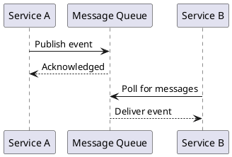

This page is a quick reference for writing content on this site: markdown, Kroki diagrams, tabbed blocks, interactive tables, and code snippets.

## Markdown basics

Text can be **bold**, _italic_, or ~~strikethrough~~.

:::tip
Use Starlight asides for tips, notes, and cautions.
:::

:::note[Named note]
You can give asides a custom title.
:::

Custom blocks configured on this site:

:::success
Advantage callout (`:::success`).
:::

:::warn
Disadvantage callout (`:::warn`).
:::

:::info
Info callout (`:::info`).
:::

## Diagrams (Kroki)

Fence with the diagram language (or `kroki type=…`). These render at build time.

```d2
direction: right
installation -> configuration
```


```plantuml
@startuml
participant "Service A" as A
participant "Message Queue" as MQ
participant "Service B" as B

A -> MQ: Publish event
MQ --> A: Acknowledged
B -> MQ: Poll for messages
MQ --> B: Deliver event
@enduml
```

### Diagrams.net (Draw.io)

For architecture diagrams authored in Draw.io, paste the uncompressed XML into a `diagramsnet` block.

```diagramsnet
<mxfile>
  <diagram id="arch-diagram" name="Architecture">
    <mxGraphModel dx="1000" dy="1000" grid="1" gridSize="10" guides="1" tooltips="1" connect="1" arrows="1" fold="1" page="1" pageScale="1" pageWidth="827" pageHeight="1169" math="0" shadow="0">
      <root>
        <mxCell id="0" />
        <mxCell id="1" parent="0" />
        <mxCell id="2" value="Web Client" style="rounded=1;whiteSpace=wrap;html=1;fillColor=#dae8fc;strokeColor=#6c8ebf;" vertex="1" parent="1">
          <mxGeometry x="120" y="120" width="120" height="60" as="geometry" />
        </mxCell>
        <mxCell id="3" value="API Gateway" style="rounded=1;whiteSpace=wrap;html=1;fillColor=#d5e8d4;strokeColor=#82b366;" vertex="1" parent="1">
          <mxGeometry x="320" y="120" width="120" height="60" as="geometry" />
        </mxCell>
        <mxCell id="4" value="Database" style="shape=cylinder3;whiteSpace=wrap;html=1;boundedLbl=1;backgroundOutline=1;size=15;fillColor=#ffe6cc;strokeColor=#d79b00;" vertex="1" parent="1">
          <mxGeometry x="520" y="110" width="80" height="80" as="geometry" />
        </mxCell>
        <mxCell id="5" value="HTTPS" style="endArrow=classic;html=1;exitX=1;exitY=0.5;entryX=0;entryY=0.5;" edge="1" parent="1" source="2" target="3">
          <mxGeometry width="50" height="50" relative="1" as="geometry" />
        </mxCell>
        <mxCell id="6" value="Query" style="endArrow=classic;html=1;exitX=1;exitY=0.5;entryX=0;entryY=0.5;" edge="1" parent="1" source="3" target="4">
          <mxGeometry width="50" height="50" relative="1" as="geometry" />
        </mxCell>
      </root>
    </mxGraphModel>
  </diagram>
</mxfile>
```

Also works: `mermaid`, `graphviz`, `excalidraw`, `structurizr`, `diagramsnet`, and other [Kroki](https://kroki.io) types. Point `PUBLIC_KROKI_SERVER_URL` at a core that has the diagramsnet companion enabled.

### HTML diagrams (`renderhtml`)

Use a `renderhtml` fence when the diagram is authored as HTML/CSS/SVG and must be **rendered**, not shown as source. A normal `html` fence stays a highlighted code block.

```renderhtml
<div style="display:flex;flex-wrap:wrap;gap:0.75rem;align-items:center;font-family:sans-serif;font-size:0.9rem;">
  <div style="padding:0.7rem 1rem;border:2px solid #6c8ebf;border-radius:8px;background:#dae8fc;">Client</div>
  <span aria-hidden="true">→</span>
  <div style="padding:0.7rem 1rem;border:2px solid #82b366;border-radius:8px;background:#d5e8d4;">API</div>
  <span aria-hidden="true">→</span>
  <div style="padding:0.7rem 1rem;border:2px solid #d79b00;border-radius:8px;background:#ffe6cc;">Database</div>
</div>
```

```renderhtml
<svg viewBox="0 0 200 80" width="200" xmlns="http://www.w3.org/2000/svg">
  <rect width="200" height="80" rx="8" fill="#dae8fc" stroke="#6c8ebf"/>
  <text x="100" y="46" text-anchor="middle" font-size="16">SVG diagram</text>
</svg>
```

Starlight content styles are skipped inside the block (`not-content`), so inner layout, lists, and headings keep the diagram’s own CSS.

## Tabbed content (`group-container`)

Use this for **any** markdown — tables, lists, prose — not just code. Outer fences need **more colons** than inner ones so nesting parses correctly.

| Directive | Role |
|-----------|------|
| `:::::group-container` … `:::::` | Outer tab group |
| `::::group-item[Title]` … `::::` | One tab (+ body) |
| `{active}` on an item | Default selected tab (first if omitted) |

Example (outer `:::::`, items `::::`):

:::::group-container

::::group-item[Alpha]{active}

Short note for the **Alpha** tab.

- One
- Two

::::

::::group-item[Beta]

Content for **Beta**. Nested code or tables go here.

::::

:::::

See [Company Apply](/guides/company-apply/) for a real page: level tabs (SDE 1/2/3) each holding a large table.

### Nesting rule

Container directives close at the first matching fence of the same length. Nesting pattern:

```md
:::::outer
::::mid
:::inner
…
:::
::::
:::::
```

**Rule:** outer fences use more colons than inner ones.

## Interactive tables (`data-table`)

Wrap a normal markdown table in `:::data-table` to add:

- **Search** across all columns
- **Sort** any column (click the header; chevrons show direction)
- **Pagination** (rows per page control)

Links inside cells (e.g. company names) are preserved.

:::data-table

| Company | Category | Locations | Est. Comp (LPA) |
|---------|----------|-----------|-----------------|
| [Acme](https://example.com) | Product | Remote | 40–60L |
| [Globex](https://example.com) | HFT | Bengaluru | 55–80L |
| [Initech](https://example.com) | Fintech | Mumbai | 30–45L |
| [Umbrella](https://example.com) | Services | Pan-India | 18–28L |

:::

### Options

Attributes on the opening fence:

| Attribute | Default | Effect |
|-----------|---------|--------|
| `searchable` | on | Set `searchable=false` to hide search |
| `sortable` | on | Set `sortable=false` to disable column sort |
| `paging` | on | Set `paging=false` for a full list |
| `perPage` | `25` | Rows per page (e.g. `perPage=50`) |

```md
:::data-table{perPage=50}

| Name | Score |
|------|-------|
| A    | 10    |

:::
```

Numeric-looking columns (headers matching *comp*, *salary*, *ctc*, *lpa*, *package*) sort by the lower bound of ranges like `140–220L`.

### Nested with content tabs

Put `data-table` **inside** `group-item` with enough colons:

```md
:::::group-container
::::group-item[SDE 3]{active}
:::data-table
| Company | …
| …
:::
::::
:::::
```

## Code snippets (Expressive Code)

Code fences use [Expressive Code](https://expressive-code.com/). Meta options go after the language on the opening fence.

### Tabbed code groups

Wrap multiple fences in `:::group` (alias `:::code-group`) to show them as tabs instead of a long scroll. Tab labels use each fence’s `title="…"`, or the language name.

:::group
```js title="abc.js" showLineNumbers
export function greet(name) {
  return `Hello, ${name}!`;
}
```

```java title="xyz.java" showLineNumbers
public class Greeter {
  public static String greet(String name) {
    return "Hello, " + name + "!";
  }
}
```

```ts title="greet.ts" showLineNumbers
export function greet(name: string): string {
  return `Hello, ${name}!`;
}
```
:::

You can also label tabs with bracket meta: `` ```js [abc.js] ``.

### Title and frame

```ts title="src/lib/greet.ts"
export function greet(name: string) {
  return `Hello, ${name}!`;
}
```

```bash frame="terminal" title="Install deps"
bun install
bun run build
```

### Line numbers

Line numbers are **on by default** for `js`, `ts`, `html`, `java`, and `python`. Toggle per block:

```js showLineNumbers
console.log("line 1");
console.log("line 2");
console.log("line 3");
```

```js showLineNumbers=false
// No gutter numbers on this block
console.log("still highlighted");
```

```js showLineNumbers startLineNumber=40
// Continues as if this file started at line 40
export const PORT = 4321;
```

### Highlight lines (`mark`)

Neutral highlight — draw attention without implying add/remove.

````md
```js {2-3} showLineNumbers
````

```js {2-3} showLineNumbers
function add(a, b) {
  const sum = a + b;
  return sum;
}
```

Explicit form:

```js mark={2} showLineNumbers
const answer = 42;
console.log(answer);
```

### Insert / delete lines (`ins` / `del`)

Green = inserted, red = deleted — useful for before/after diffs.

```js showLineNumbers del={3} ins={4}
function total(items) {
  let sum = 0;
  for (const item of items) sum += item.price;
  for (const item of items) sum += item.price * item.qty;
  return sum;
}
```

Labeled markers:

```ts showLineNumbers ins={"new":4-5} del={"old":3}
type User = {
  id: string;
  name: string;
  email: string;
  role: "admin" | "member";
};
```

### Diff language

Or use a classic `diff` fence:

```diff
  export function createUser(input) {
-   return db.insert(input);
+   const user = validate(input);
+   return db.insert(user);
  }
```

### Highlight text (inline markers)

Mark words or phrases inside lines:

```js showLineNumbers mark="TODO" ins="fixed" del="bug"
// TODO: handle empty list
const bug = list[0];
const fixed = list.at(0);
```

Regular expressions also work: `mark=/handle\w+/`.

### Collapsible sections

Hide boilerplate; readers expand when needed.

```js showLineNumbers collapse={1-4, 11-13}
import { createServer } from "node:http";
import { readFile } from "node:fs/promises";
import path from "node:path";
import { fileURLToPath } from "node:url";

export async function handler(req, res) {
  res.writeHead(200, { "Content-Type": "text/plain" });
  res.end("ok");
}

createServer(handler).listen(3000);
console.log("listening on :3000");
process.on("SIGTERM", () => process.exit(0));
```

### Word wrap and long lines

```js wrap showLineNumbers
const url = "https://api.example.com/v1/users?include=profile,settings&sort=createdAt&order=desc&limit=50";
```

### Combining options

Most meta flags can be combined on one fence:

````md
```ts title="cache.ts" showLineNumbers mark={5-7} collapse={1-2}
````

```ts title="cache.ts" showLineNumbers mark={5-7} collapse={1-2}
import type { Cache } from "./types";
import { redis } from "./client";

export async function getCachedUser(id: string): Promise<Cache | null> {
  const key = `user:${id}`;
  const raw = await redis.get(key);
  return raw ? JSON.parse(raw) : null;
}
```

### Quick meta cheat sheet

| Meta | Effect |
|------|--------|
| `:::group` … `:::` | Tabbed **code** fences |
| `:::code-group` | Same as `:::group` |
| `:::::group-container` + `::::group-item[Title]` | Tabbed **content** (markdown body) |
| `group-item[…]{active}` | Default open content tab |
| `:::data-table` … `:::` | Sortable / searchable / paged table |
| `:::data-table{perPage=50}` | Rows per page (and other flags above) |
| Language `renderhtml` | Render HTML/SVG (not a code block) |
| Language `html` | Highlighted HTML **source** |
| `title="file.ts"` | Filename / code-tab title |
| `frame="terminal"` | Terminal-style frame |
| `showLineNumbers` / `=false` | Toggle line numbers |
| `startLineNumber=N` | Start numbering at N |
| `{2,4-6}` or `mark={…}` | Neutral line highlight |
| `ins={…}` / `del={…}` | Added / removed lines |
| `ins={"label":3-4}` | Labeled insert/delete |
| `"phrase"` / `mark="phrase"` | Inline text highlight |
| `collapse={1-5,10-12}` | Collapsible ranges |
| `wrap` | Soft-wrap long lines |
| Language `diff` | `+` / `-` line prefixes |

## Further reading

- [Company Apply](/guides/company-apply/) — content tabs + data tables in production usage
- [Expressive Code — text & line markers](https://expressive-code.com/key-features/text-markers/)
- [Expressive Code — line numbers](https://expressive-code.com/plugins/line-numbers/)
- [Expressive Code — collapsible sections](https://expressive-code.com/plugins/collapsible-sections/)
- [Diátaxis — how-to guides](https://diataxis.fr/how-to-guides/)
