# API design concepts

This page collects **principles** and **checklists** for designing **HTTP** (Hypertext Transfer Protocol) **APIs** (Application Programming Interfaces) your clients can rely on. The **Fundamentals** section below is written to stand alone; later sections stay as topic maps for deeper pages (caching, rate limits, and so on).

> **Abbreviations:** On first use in prose, terms appear as **Full form (ABBR)**. A short reference: **JSON** (JavaScript Object Notation), **JWT** (JSON Web Token), **OAuth** (Open Authorization), **OIDC** (OpenID Connect), **PKCE** (Proof Key for Code Exchange), **JWKS** (JSON Web Key Set), **IdP** (Identity Provider), **BFF** (Backend for Frontend), **TLS** / **mTLS** (Transport Layer Security / mutual TLS), **RBAC** (Role-Based Access Control), **ABAC** (Attribute-Based Access Control), **ACL** (Access Control List), **CSRF** (Cross-Site Request Forgery), **XSS** (Cross-Site Scripting), **HMAC** (Hash-based Message Authentication Code), **SPA** (Single-Page Application), **REST** (Representational State Transfer), **SSO** (Single Sign-On), **SAML** (Security Assertion Markup Language), **CDN** (Content Delivery Network), **WAF** (Web Application Firewall), **CSP** (Content Security Policy), **PWA** (Progressive Web App), **RLS** (Row-Level Security), **gRPC** (gRPC Remote Procedure Call), **SaaS** (Software as a Service), **B2B** (Business-to-Business), **CI** (Continuous Integration), **DX** (Developer Experience).

## Fundamentals

### 1. API (Application Programming Interface) contracts and schema design

A **contract** is the shared truth between **producer** and **consumer**: URLs, methods, headers, request/response bodies, error shapes, and evolution rules. Prefer **contract-first** (**OpenAPI** (Open API Specification) or **JSON** (JavaScript Object Notation) **Schema** authored and reviewed before coding) for public and partner **APIs**; **code-first** can work for internal services if the generated spec is treated as a publishable artifact.

**Principles**

- **Schemas are contracts** — document every field’s type, nullability, allowed enums, and defaults. “Obvious in the code” is not obvious to integrators.
- **Prefer additive changes** — new optional fields and new endpoints are safer than renaming or repurposing fields.
- **Breaking vs non-breaking** — treat narrowing types, removing fields, adding required fields without defaults, and changing URL shapes as **breaking**; version or dual-publish during migration.
- **Consistency** — one style for naming (`snake_case` vs `camelCase`), dates (always **RFC** (Request for Comments) 3339 / **ISO** (International Organization for Standardization)-8601 in **UTC** (Coordinated Universal Time)), money (integer minor units or decimal + currency), and error objects across resources.

**Practices**

| Practice | Why |
| --- | --- |
| Publish **OpenAPI 3** (or **AsyncAPI** (Asynchronous API Specification) for events) | Machine-readable docs, mocks, contract tests, client codegen. |
| Use **JSON Schema** for payloads | Reuse in validators, **CI** (Continuous Integration), and documentation. |
| Version **default** response shape carefully | Unknown fields in requests: ignore or reject—pick one and document. |

**Avoid**

- Undocumented “flags” and magic integers without an enum or `x-` extension in the spec.
- Overloading one field for multiple meanings depending on another field without an explicit `discriminator` or union style in the schema.

#### Example: OpenAPI 3.0 document shape (YAML)

**YAML** (YAML Ain't Markup Language) example. OpenAPI bundles **paths** (operations), **parameters**, **request bodies**, **responses**, and reusable **`components/schemas`**. Tools (Swagger **UI** (User Interface), Redoc, codegen, Dredd, Spectral) all read the same file.

```yaml
openapi: 3.0.3
info:
  title: Example Orders API
  version: 1.0.0
servers:
  - url: https://api.example.com/v1
paths:
  /orders:
    post:
      operationId: createOrder
      requestBody:
        required: true
        content:
          application/json:
            schema:
              $ref: "#/components/schemas/CreateOrderInput"
      responses:
        "201":
          description: Created
          headers:
            Location:
              schema:
                type: string
                example: https://api.example.com/v1/orders/550e8400-e29b-41d4-a716-446655440000
          content:
            application/json:
              schema:
                $ref: "#/components/schemas/Order"
        "422":
          description: Business validation failed
          content:
            application/json:
              schema:
                $ref: "#/components/schemas/ApiError"
  /orders/{orderId}:
    get:
      operationId: getOrder
      parameters:
        - name: orderId
          in: path
          required: true
          schema:
            type: string
            format: uuid
      responses:
        "200":
          description: OK
          content:
            application/json:
              schema:
                $ref: "#/components/schemas/Order"
        "404":
          description: Not found for this caller
          content:
            application/json:
              schema:
                $ref: "#/components/schemas/ApiError"
components:
  schemas:
    CreateOrderInput:
      type: object
      required: [currency, line_items]
      properties:
        currency:
          type: string
          description: ISO 4217 alphabetic code
          pattern: "^[A-Z]{3}$"
          example: USD
        line_items:
          type: array
          minItems: 1
          items:
            $ref: "#/components/schemas/LineItem"
        customer_note:
          type: string
          nullable: true
    LineItem:
      type: object
      required: [sku_id, quantity]
      properties:
        sku_id:
          type: string
        quantity:
          type: integer
          minimum: 1
    Order:
      type: object
      required: [id, status, created_at, currency, total_minor_units]
      properties:
        id:
          type: string
          format: uuid
        status:
          type: string
          enum: [DRAFT, PAID, SHIPPED, CANCELLED]
        created_at:
          type: string
          format: date-time
        currency:
          type: string
          pattern: "^[A-Z]{3}$"
        total_minor_units:
          type: integer
          format: int64
          minimum: 0
        line_items:
          type: array
          items:
            $ref: "#/components/schemas/LineItem"
    ApiError:
      type: object
      required: [code, message, trace_id]
      properties:
        code:
          type: string
          example: VALIDATION_FAILED
        message:
          type: string
        trace_id:
          type: string
          format: uuid
        details:
          type: array
          items:
            type: object
            properties:
              field:
                type: string
              issue:
                type: string
```

**Reading the contract**

- **`$ref`** ties operations to canonical types in `components/schemas` so you do not duplicate the same object in every path.
- **`required` + `nullable: true`** documents “key present, value may be null” vs “key omitted” (pick one convention per field and stick to it).
- **`enum`**, **`pattern`**, **`format`**, **`minimum`** give integrators and validators the same rules your server enforces.

OpenAPI **3.1** uses JSON Schema closer to modern drafts; **3.0.x** is still the most common in enterprise pipelines—same ideas apply.

#### Example: same payload as standalone JSON Schema

When you validate in app code or CI without loading full OpenAPI, you often keep a **JSON Schema** file per resource or embed schema under `components/schemas` (OpenAPI 3.0’s schema objects are very close to JSON Schema).

```json
{
  "$schema": "https://json-schema.org/draft/2020-12/schema",
  "$id": "https://schemas.example.com/order.json",
  "title": "Order",
  "type": "object",
  "required": ["id", "status", "created_at", "currency", "total_minor_units"],
  "additionalProperties": false,
  "properties": {
    "id": { "type": "string", "format": "uuid" },
    "status": {
      "type": "string",
      "enum": ["DRAFT", "PAID", "SHIPPED", "CANCELLED"]
    },
    "created_at": { "type": "string", "format": "date-time" },
    "currency": { "type": "string", "pattern": "^[A-Z]{3}$" },
    "total_minor_units": { "type": "integer", "minimum": 0 },
    "line_items": {
      "type": "array",
      "items": {
        "type": "object",
        "required": ["sku_id", "quantity"],
        "properties": {
          "sku_id": { "type": "string" },
          "quantity": { "type": "integer", "minimum": 1 }
        }
      }
    }
  }
}
```

`additionalProperties: false` is strict: unknown fields fail validation—good for **inbound** partner payloads when you want to reject surprises early (for **responses**, many public APIs allow unknown fields and rely on clients ignoring extras).

#### Contract evolution (schema view)

| Change in OpenAPI / JSON Schema | Usually |
| --- | --- |
| Add **optional** property with a default or clearly optional semantics | **Non-breaking** for responses; safe for requests if server ignores unknowns. |
| Add **`required`** field on request body with no default | **Breaking** for existing clients. |
| Narrow `enum`, tighten `pattern`, add `maximum` smaller than before | **Breaking** if clients or data could violate the new rule. |
| Rename property | **Breaking** unless you dual-publish old + new names for a deprecation window. |

---

### 2. Authentication and authorization

**Authentication (authn)** answers **who** is calling (identity). **Authorization (authz)** answers **what** they may do (scopes, roles, tenant, row-level checks). (Abbreviated as **authn** / **authz** below.) Keep the distinction visible in docs and in code (authenticate early, authorize at the resource or policy layer). **TLS** (Transport Layer Security) and **mTLS** (mutual TLS) are covered below; **OAuth** (Open Authorization) / **OIDC** (OpenID Connect) are the usual user-login path for **APIs**.

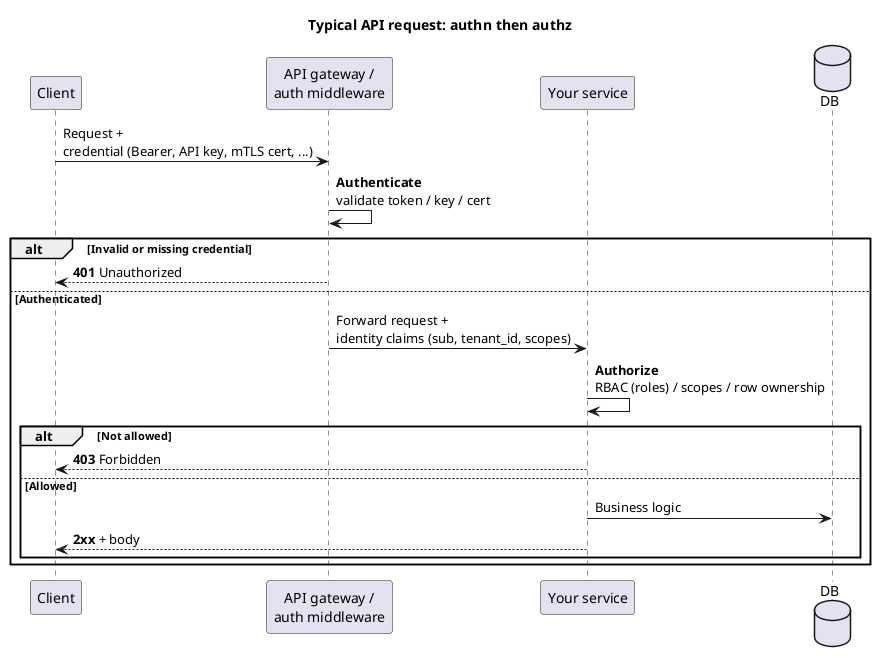

#### TLS vs mTLS (transport vs application identity)

**TLS** (Transport Layer Security; what you get with normal **HTTPS** (HTTP Secure)) encrypts traffic and lets the **client verify the server** using the server’s certificate (**CA** (Certificate Authority)-signed). The client stays anonymous at the TLS layer; you prove **who the client is** later with **HTTP** credentials (**API** key, Bearer token, cookie).

**mTLS** (mutual TLS) is still TLS, but the **client also presents a certificate** during the handshake. The **server verifies the client cert** (against a CA or trust store) before accepting the connection. Identity is bound to the **certificate subject** (e.g. `CN=payments-service`)—often used for **service-to-service** calls where there is no human and no **OAuth** login.

**When to use which at the transport layer**

- **TLS (HTTPS) only** — Default for almost every public API, browser, and mobile app. Encrypts traffic and authenticates the **server**. You still choose an **application** credential (API key, Bearer, cookie) for **who the client is**.
- **mTLS** — Use when both ends are **servers you control** (or contractual partners) and you want **machine identity at connect time** before HTTP runs—common in meshes and regulated **B2B**. Not for end users (they do not install client certs).

| | **TLS (HTTPS)** | **mTLS** |
| --- | --- | --- |
| Who proves identity to whom | Server → client (server cert) | **Both ways** (server cert + client cert) |
| Where API “user” is established | HTTP layer (Bearer, API key, cookie) | TLS handshake **and** optionally HTTP again |
| Typical clients | Browsers, mobile apps, partners | Microservices, mesh sidecars, regulated B2B |
| Revocation | Cert expiry + **OCSP** (Online Certificate Status Protocol) for server cert | Client cert rotation, **CRL** (Certificate Revocation List)/OCSP, short-lived certs |

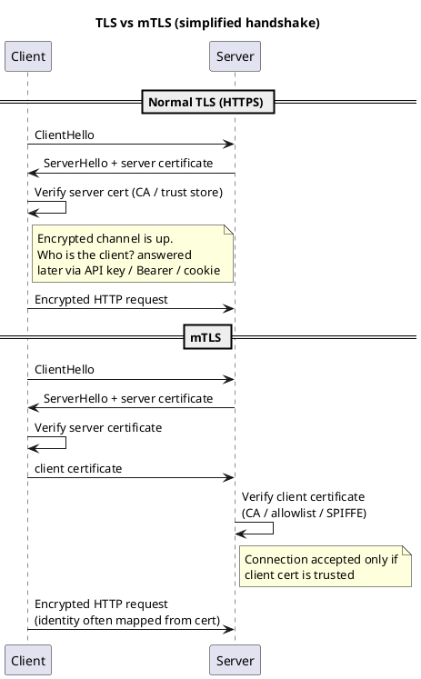

#### Authentication flows (how each works)

The diagrams below show **authentication** only. **Authorization** (scopes, **RBAC** (Role-Based Access Control), row ownership) still runs in your **API** after identity is known.

| Mechanism | Primary caller | Human vs machine |
| --- | --- | --- |
| **API key** | Partner server, cron, script | **Machine** (secret on server only) |
| **Bearer JWT** | Mobile, SPA, services after login/token exchange | **User** or **machine** (depends who the token represents) |
| **OAuth / OIDC** | Browser, mobile app, third-party app | **Human** (or delegated app acting for user); **client credentials** = **machine** |
| **Session cookie** | Browser on your domain | **Human** |
| **mTLS** | Microservices, mesh, fixed B2B partner | **Machine** |
| **HMAC / SigV4** | Webhook sender, cloud SDK, your outbound webhooks | **Machine** |
| **Signed URL** | Browser/email link click | **Human** (one-off action via link) |

##### API key

**When to use:** **Machine-to-machine** and **server-side** callers that need a simple, long-lived credential—partner integrations, batch jobs, internal scripts, and developer sandboxes. The secret lives only on **servers** (env vars, secrets manager), never in a browser or mobile binary you do not control.

Static secret issued per integration. Server looks up the key in a store (or validates a prefixed key) and attaches a principal (partner id, environment, quotas).

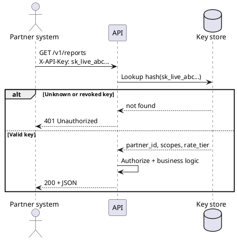

#### Scenarios — why API keys are preferred there

**1. B2B partner REST API**

- **Caller:** Partner’s backend cron or ERP system.
- **Why API key:** Onboarding is one secret per partner; easy to document (`X-API-Key`), rate-limit per key, revoke one partner without affecting others.
- **Why not OAuth user flow:** No human is logging in on each API call—the integration is **system identity**, not “Alice clicked Allow.”

**2. Developer portal / sandbox**

- **Caller:** Developer’s server or `curl` with a test key.
- **Why:** Fast time-to-first-request; keys map to sandbox data and lower quotas.

**3. Internal automation**

- **Caller:** CI pipeline, nightly report job, ops script.
- **Why:** Simple rotation (issue `sk_live_…` / `sk_test_…`); lookup returns `partner_id` + scopes for **authz**.

#### When API keys are a poor fit

| Situation | Better choice | Reason |
| --- | --- | --- |
| **Browser or mobile app** | **OAuth** / **OIDC** | Key in the client **leaks** (devtools, decompile, Referer). |
| **Webhook body must not be forged** | **HMAC** | Key in header does not prove **this exact body** was sent by the vendor. |
| **Per-user “log in as me”** | **OAuth** scopes on user token | API key is usually **one principal per integration**, not per end user. |
| **Instant revoke one session** | Short-lived **JWT** or opaque token | Long-lived key revoke affects **all** calls until rotated. |

##### Bearer token (JWT)

**When to use:** Callers that already obtained a **token from an issuer** (your auth server or an **IdP**) and send it on every API request—typical for **user-facing apps** (mobile, SPA via **BFF**), **microservices** after token exchange, and **machine clients** using **client-credentials** JWTs. The API validates **cryptographically** (or via introspection for opaque tokens) without a password on each call.

**JWT** (JSON Web Token): client sends `Authorization: Bearer <jwt>`. **API** (or gateway) verifies signature, **`iss`** (issuer), **`aud`** (audience), **`exp`** (expiry), and reads claims (**`sub`** (subject) = user id, `tenant_id`, scopes).

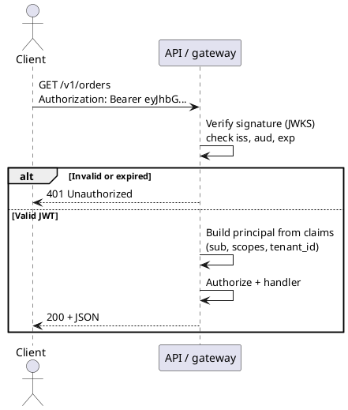

**JWT vs opaque:** JWT avoids a **DB** (database) hit per request but is harder to revoke instantly; opaque tokens need introspection/session lookup but revoke cleanly.

#### Scenarios — why Bearer JWT is preferred there

**1. Mobile / SPA calling your resource API**

- **Flow:** User logs in via **OAuth** → app holds **short-lived access JWT** → `Authorization: Bearer` on `/v1/orders`.
- **Why JWT:** API verifies with **JWKS** locally—no session DB round-trip per request; claims carry `sub`, `tenant_id`, scopes for **authz**.

**2. API gateway → microservices**

- **Flow:** Gateway validates user JWT once, forwards identity (headers or internal JWT).
- **Why:** Same token format end-to-end; services trust the same **iss** / **aud**.

**3. Service account (client credentials)**

- **Flow:** Worker exchanges client id/secret for an **access JWT** with service scopes.
- **Why:** **Machine identity** with **expiry**—better than a forever API key when you already run an **IdP** or internal token service.

#### When Bearer JWT is a poor fit

| Situation | Better choice | Reason |
| --- | --- | --- |
| **Inbound vendor webhook** | **HMAC** | Vendor does not issue you a user JWT; they sign the **request**. |
| **One-click download link in email** | **Signed URL** | No `Authorization` header in a plain link click. |
| **Must revoke access in under one minute globally** | Opaque token + session store, or token blocklist | Valid JWT works until **`exp`** unless you add revocation infrastructure. |
| **First-party admin on one domain only** | **Session cookie** | Simpler browser UX; HttpOnly cookie hides session id. |

##### OAuth 2.0 (Open Authorization) / OIDC (OpenID Connect) (authorization code + PKCE)

**When to use:** **Human users** (or their delegated third-party app) who must **log in**, **consent** to scopes, and obtain **short-lived access tokens**—consumer mobile/SPA, “Sign in with Google,” and **Connect my GitHub account** flows. For **machine-only** traffic with no user, use **client credentials** (still OAuth family) or **API key** / **mTLS** instead of authorization code.

User logs in at an **IdP** (Identity Provider); your app never sees the password. **Recommended:** authorization **code + PKCE** (Proof Key for Code Exchange), **backend/BFF** holds **refresh_token**, **your API** accepts **IdP** access **JWT** and validates with **JWKS** (JSON Web Key Set). Do not mint your own JWT unless you have a strong reason.

**End-to-end (request order)**

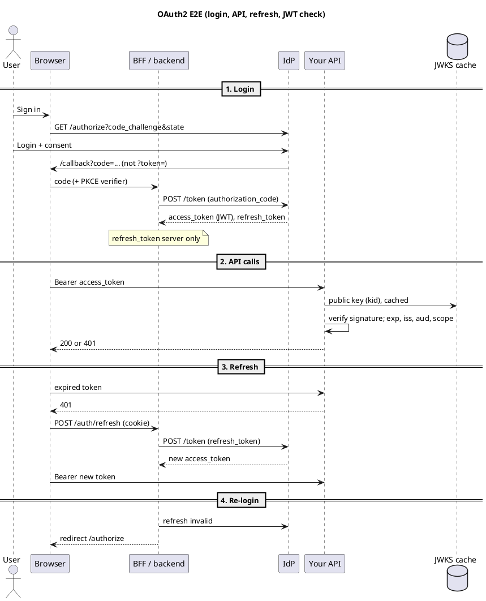

#### 1. Login — get tokens from IdP

1. App creates **PKCE**: random **`code_verifier`**; **`code_challenge`** = **SHA-256** (Secure Hash Algorithm 256-bit) hash of verifier on `/authorize` only.
2. User authenticates at IdP; redirect **`/callback?code=…&state=…`** — **code**, not access token in the URL (avoid legacy `?token=` implicit flow).
3. **Backend/BFF** `POST /token` with `code` + `code_verifier` → **`access_token`** (often JWT), **`refresh_token`**, `expires_in`.
4. Store **`refresh_token` on the server** (session/**Redis** (Remote Dictionary Server)); browser gets **HttpOnly** session cookie or short-lived access token — **not** refresh in `localStorage`.

| Token | Sent to your `/v1/*` API? | Who uses it |
| --- | --- | --- |
| **Authorization code** | No | One-time; exchanged at `/token` |
| **Access token** | **Yes** (`Authorization: Bearer`) | Every API request until `exp` |
| **Refresh token** | **No** | **Backend/BFF → IdP only** when refreshing |
| **ID token** (OIDC) | Usually no on resource API | Client **UI** (User Interface); API uses **access** token |

**PKCE:** stops someone who steals `code` from exchanging it without the **verifier**. Verifier only in `POST /token` body; challenge in `/authorize` URL. Generated in **browser** (`sessionStorage`) or **server** (session).

#### 2. API requests — validate Bearer JWT

```http
GET /v1/orders
Authorization: Bearer <IdP access_token>
```

Your API (middleware) for **JWT** access tokens — **usually no IdP HTTP call per request**:

1. Parse JWT; read header **`kid`**, **`alg`**
2. Load IdP **JWKS** (public keys) — **cache** `/.well-known/jwks.json`
3. **Verify signature**
4. Check **`exp`** (expired → **401**), **`iss`** (your IdP), **`aud`** (your API), **`scope`**
5. Use **`sub`** as user id → then **your** authorization (ownership, RBAC) → **403** if denied

| When | Calls IdP? |
| --- | --- |
| Login + **refresh** | **Yes** (`/authorize`, `POST /token`) |
| Each **JWT** API request | **No** — local JWKS verify |
| **Opaque** access token | **Yes** — introspection (or cache briefly) |

#### 3. Refresh — new access token without re-login

When **`exp`** passes (or **401**), **backend/BFF** (not your orders API) calls:

`POST /token` with `grant_type=refresh_token` → new **access_token**.

Browser calls **`/auth/refresh`** with session cookie; never sends **refresh_token** to `api.example.com`. If refresh fails (`invalid_grant`) → redirect to **login** again.

#### BFF (Backend for Frontend) vs your API (two roles, one server is OK)

| | **BFF / auth backend** | **Your API (resource server)** |
| --- | --- | --- |
| Runs on | **Your server** (not in the browser) | **Your server** |
| Job | OAuth callback, **refresh**, cookies | Business routes `/v1/orders` |
| Talks to IdP | **Yes** | **No** (validates JWT via JWKS) |
| Holds refresh token | **Yes** | **No** |

Monolith: same deployable can do both `/auth/*` and `/v1/*`.

#### Key terms

| Term | Meaning |
| --- | --- |
| **IdP** | Identity Provider — logs user in; issues tokens (Auth0, Azure AD, Keycloak, …) |
| **OIDC** | OpenID Connect — OAuth2 plus standard user profile (**ID token**) |
| **PKCE** | Proof Key for Code Exchange — protects authorization `code` exchange |
| **JWKS** | JSON Web Key Set — IdP public keys URL; verify JWT **signature** |
| **`kid`** | Key ID — which JWKS public key signed the JWT |
| **`iss`** | Issuer — who minted the token (IdP URL) |
| **`aud`** | Audience — token intended for your API |
| **`exp`** | Expiration time — token invalid after this instant |
| **`sub`** | Subject — stable user id in your handlers |
| **`state`** | Random value — anti-**CSRF** (Cross-Site Request Forgery) on OAuth redirect |

#### Scenarios — why OAuth / OIDC is preferred there

**1. Consumer app (mobile or SPA)**

- **Need:** Real user identity, password handled by **IdP**, optional social login, refresh without re-entering password.
- **Why authorization code + PKCE:** No long-lived secret in the browser; **`code`** is useless without **verifier**; **refresh_token** stays on **BFF/server**.
- **Why not API key:** Cannot put a static secret in the app binary or JS bundle.

**2. Third-party app accessing user data (“Connect account”)**

- **Need:** User sees consent screen; you issue token with **limited scopes** (`read:orders` not `write:payments`).
- **Why OAuth:** Standard **delegation** model; user can revoke access at the IdP.
- **Why not session cookie:** The third party is not on your domain—they need a **Bearer** token, not your site’s cookie.

**3. Enterprise SSO**

- **Need:** Employees use corporate **IdP** (Azure AD, Okta); your app trusts **OIDC** tokens and **`sub`**.
- **Why OIDC:** Standard **ID token** + userinfo for profile; same flow as consumer OIDC with stricter tenant policies.

**4. Machine-to-machine (no user)**

- **Grant:** **Client credentials** → access token for `orders:sync` scope.
- **Why still “OAuth”:** Central token issuance, expiry, audit—when you already operate an IdP. If you only need a simple partner script, an **API key** may be enough.

#### When OAuth is a poor fit

| Situation | Better choice | Reason |
| --- | --- | --- |
| **Stripe/GitHub pushing events to you** | **HMAC** webhook | No user in the loop; provider signs **POST**. |
| **Single-domain admin app** | **Session cookie** | Simpler; no token in JS if HttpOnly. |
| **Partner server with no user UI** | **API key** or **mTLS** | No consent screen needed; static or cert identity. |
| **Anonymous public read** | None + rate limits | Login adds friction with no benefit. |

#### Avoid

- **`/callback?token=`** access token in URL — use **`?code=`** + server exchange.
- **Minting your own JWT** when IdP already issued an access JWT — extra keys, refresh, two token types; default **pass IdP token to API**.
- **Refresh token** in browser `localStorage` — **XSS** (Cross-Site Scripting) risk; keep on **server**.

See [HTTP status codes](/high-level-design/api-design/http-codes/) for **401** vs **403**.

##### Session cookie

**When to use:** **Human users in a browser** on **your site** (or same-site **BFF**) where the server owns login state—traditional web apps, internal admin panels, and server-rendered dashboards. The browser sends the cookie automatically; the server maps session id → user in **Redis**/**DB**. Not for third-party integrators or native mobile apps calling a cross-origin API without cookie support.

After password/**OIDC** login, server creates a **session** server-side and sets an **HttpOnly** cookie. Browser sends cookie automatically on same-site or configured domain; **API** loads session from Redis/**DB**.

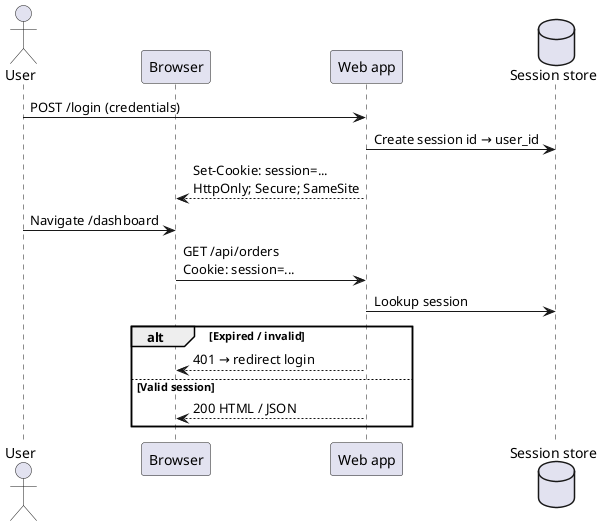

#### Scenarios — why session cookies are preferred there

**1. Server-rendered web app (same origin)**

- **Flow:** `POST /login` → `Set-Cookie: session=…; HttpOnly; Secure; SameSite` → later `GET /api/orders` sends cookie automatically.
- **Why:** No token handling in JavaScript; **XSS** cannot read HttpOnly session id; familiar server-side session invalidation on logout.

**2. Admin panel on `admin.yourcompany.com`**

- **Why:** Small team, one domain, **CSRF** tokens for `POST`/`PUT`/`DELETE`; **RBAC** in session after login.

**3. BFF + SPA on same site**

- **Flow:** SPA calls **same-origin** `/api/*`; BFF validates session cookie and may call downstream services with a service token.
- **Why:** Refresh and secrets stay server-side; SPA never stores **refresh_token** in `localStorage`.

#### When session cookies are a poor fit

| Situation | Better choice | Reason |
| --- | --- | --- |
| **Public API for partners** | **API key** or **OAuth** Bearer | Partners cannot send your domain’s cookies from their servers. |
| **Mobile app → `api.example.com`** | **OAuth** + Bearer JWT | Cross-origin cookie rules and **third-party cookie** limits break simple cookie auth. |
| **Webhook from vendor** | **HMAC** | No browser, no cookie jar. |

##### mTLS (mutual TLS)

**When to use:** **Machine-to-machine** between services (or fixed **B2B** partners) where **both sides present X.509 certificates** at connection time—**Kubernetes** mesh, internal east-west traffic, and high-trust bank/partner links. Identity is the **cert subject/SAN** (or SPIFFE id), not a user password or OAuth login.

Trust is established in the **TLS handshake** via client certificate. HTTP may still run, but many meshes map cert identity to a service account without a separate Bearer token.

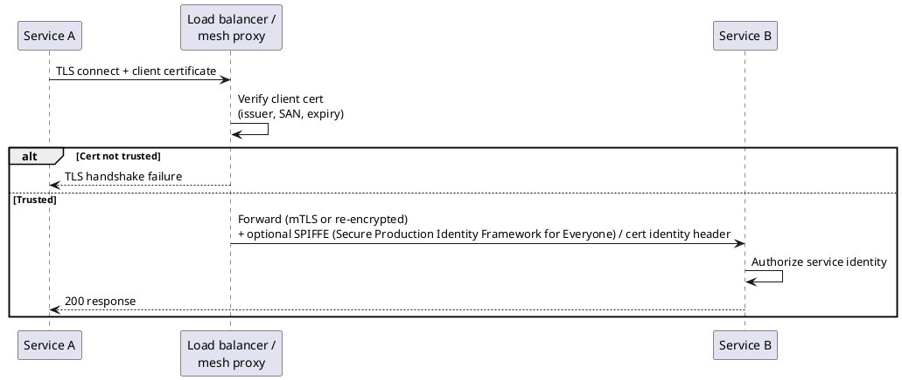

#### Scenarios — why mTLS is preferred there

**1. Service mesh (Istio, Linkerd)**

- **Flow:** Sidecar terminates mTLS; forwards to app with identity header (`SPIFFE://…`).
- **Why:** Default **encrypted + authenticated** east-west traffic without every app implementing Bearer validation.

**2. Internal microservice A → B**

- **Why:** Network policy + cert identity = “only `payments-service` may call `ledger-service`” before HTTP even runs.

**3. Regulated B2B (fixed partner)**

- **Why:** Contractual **client cert** per partner org; rotation via PKI; stronger than shared API key alone for high-value channels.

#### When mTLS is a poor fit

| Situation | Better choice | Reason |
| --- | --- | --- |
| **Public mobile / browser users** | **OAuth** / session | Users do not install client certificates. |
| **Millions of SaaS customers calling your cloud API** | **SigV4** / API keys | Per-customer client certs at edge do not scale like **IAM** keys. |
| **Quick partner onboarding** | **API key** | Faster than cert issuance and PKI lifecycle. |

##### HMAC (Hash-based Message Authentication Code) / request signing (webhooks and vendor APIs)

**When to use:** **Machine-to-machine** integrations where one **server sends HTTP to another** and you must prove **(a)** the sender knows a shared secret and **(b)** the **exact request** (especially **POST body**) was not tampered with—inbound **webhooks**, payment callbacks, cloud **SigV4** APIs, and **outbound webhooks** you sign for customers. Not for human login; not for browsers holding the signing secret.

Sender and receiver share a **secret** (a symmetric key both sides already know). Sender hashes a canonical string (method, path, timestamp, body); receiver recomputes and compares. Proves the request was crafted by someone who knows the secret and (with timestamp) limits replay.

**How they get the same secret (out of band — never in the webhook body)**

The secret is **not** sent on each `POST`. It is agreed or issued **once**, before traffic starts, through a channel that is **not** the signed webhook:

| How | Typical flow |
| --- | --- |
| **Provider dashboard** | You register a webhook URL (e.g. Stripe, GitHub). The provider generates a **signing secret** and shows it once; you copy it into your app config or **secrets manager**. They keep a copy; every delivery is signed with that key. |
| **You issue to a partner** | During B2B onboarding you generate a random secret (or key pair’s HMAC secret), send it over **email + separate channel**, contract, or secure portal — same idea as provisioning an **API key**. Partner stores it; your server stores the same value. |
| **Cloud IAM / API keys** | **AWS** SigV4 uses an **access key ID** (public identifier) + **secret access key** created in IAM; both are known to the caller and implied by the signature algorithm. |
| **Rotation** | Provider lets you roll to a new secret; you run **two** secrets briefly, then retire the old one. |

```text
  [One-time setup — not the webhook request]
  Provider ──► "whsec_abc123…" ──► Your env / Vault / K8s Secret
  Partner  ◄── onboarding portal ──► Same value in their config

  [Every delivery]
  Provider:  signature = HMAC-SHA256(secret, canonical_request)
  Your API:  recompute with secret from env → must match X-Signature
```

**Security notes:** Treat the secret like a password (env vars, not git). **TLS** still encrypts the wire; HMAC proves **who** sent the payload and that it was not tampered with. If the secret leaks, anyone can forge valid signatures until you rotate.

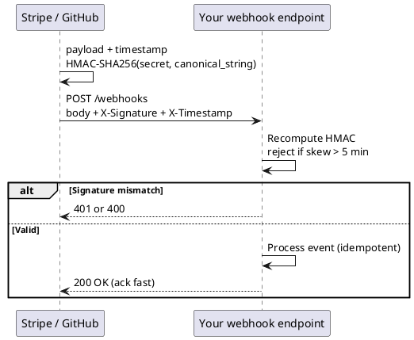

#### What HMAC proves (and what TLS alone does not)

| Layer | Guarantees |
| --- | --- |
| **TLS** | Channel is encrypted; you are talking to *some* server with a valid cert. |
| **HMAC / request signature** | This **exact** HTTP message (method, path, headers, body, often timestamp) was produced by a party that knows the **shared secret** — and was not modified in transit *after* signing. |

TLS does **not** tell your webhook handler “Stripe sent this body.” Anyone who can reach your URL over HTTPS could `POST` fake `payment.succeeded` events. HMAC closes that gap: only someone with the signing secret can produce a signature your code accepts.

#### Algorithms and where they show up

All of these are **request signing**: build a **canonical string** from parts of the request, run a keyed hash, send the result in a header (or query). The receiver rebuilds the same string and compares (usually with a **constant-time** compare).

| Algorithm / scheme | Typical canonical input | Who uses it | Why that shape |
| --- | --- | --- | --- |
| **HMAC-SHA256** | `timestamp + "." + raw_body`, or vendor-specific header list | **Stripe**, **GitHub**, **Slack**, many SaaS webhooks | Fast, widely supported in every language; 256-bit security is enough; simple for “sign the POST body.” |
| **HMAC-SHA512** | Same idea, longer digest | Some security-heavy or legacy integrations | Stronger hash; less common for webhooks because SHA-256 HMAC is already standard. |
| **AWS Signature Version 4 (SigV4)** | Canonical request: method, path, sorted signed headers, **SHA256 hash of body**, region, service, datetime; then nested HMAC chain with **derived signing key** | **S3**, **API Gateway**, **Lambda** invoke URLs, most **AWS** APIs | One algorithm for **all** AWS services; binds signature to **credential scope** (which service/region), **clock**, and **exact** headers AWS requires; supports **temporary** credentials (STS). |
| **Custom “sign these N headers”** | e.g. `Date`, `Host`, `Content-Digest`, path | Older payment gateways, some telco/**B2B** APIs | Legacy contracts; harder for clients but pins more than body alone. |

**Canonical string matters:** If sender signs `POST\n/webhooks\n1730000000\n{...}` and you verify `POST/webhooks/1730000000{...}` (missing newline), validation fails even with the right secret. Libraries must follow the **vendor’s doc** byte-for-byte.

**Replay protection:** Webhooks often include **`X-Timestamp`** (or similar). Reject requests outside a skew window (e.g. ±5 minutes) so an attacker who captures one signed request cannot replay it forever. Combine with **idempotency** (`event_id`) so duplicate deliveries are safe.

#### Scenarios — why HMAC is preferred there

**1. Inbound webhooks (Stripe, GitHub, Shopify, …)**

- **Direction:** Their servers → **your** public HTTPS URL. There is **no logged-in user** in your session — it is **machine → machine**.
- **Why HMAC:** You need to know the event really came from the vendor, not a random client on the internet. A static **API key in a header** would work for auth but is often sent in cleartext in logs; signatures bind to **body + time** so tampering breaks verification.
- **Why not OAuth:** OAuth proves **a user delegated access** to a client. Webhooks are the **provider pushing** to you; the “client” is your endpoint, and trust is **contract + shared secret**, not a user consent screen.
- **Operational pattern:** Return **2xx quickly**, verify signature **before** heavy work, process async; use **idempotency keys** on `event_id` because vendors **retry** on timeouts.

**2. Payment and billing providers**

- **Why stricter signing:** Money movement triggers **chargebacks, fraud review, and compliance**. Providers want **integrity** (amount, currency, customer id in body were not altered) and **authenticity** (only their infrastructure signed it).
- **Often paired with:** IP allowlists (weak alone), **event IDs**, dashboard to **rotate** signing secrets after leaks, separate **test vs live** secrets.
- **Why not session cookies:** Your checkout page’s user session does not exist on the server-to-server webhook call.

**3. Cloud control-plane APIs (AWS SigV4 and similar)**

- **Caller:** Your **CI** job, **Terraform**, backend worker — holds **access key + secret** (or role via STS).
- **Why SigV4 instead of a single HMAC header:** Requests vary (GET vs POST, many headers, regions). SigV4 standardizes **what** is signed across hundreds of services and supports **short-lived** credentials without issuing a new long-term secret per call.
- **Why not mTLS alone:** AWS’s public API is used by millions of customers; per-customer client certs at AWS’s edge is not the model — **per-account keys + signature** scale operationally.

**4. Outbound webhooks you send to customers**

- **You** are the sender; **customer** verifies **your** HMAC with a secret you gave them at onboarding.
- **Why:** Same trust problem in reverse — they must not act on forged “invoice.paid” events. Symmetric secret is simple for **B2B** integrations where both sides are servers.

**5. Partner / internal job callbacks**

- Cron or queue worker calls `POST /internal/jobs/complete` with HMAC.
- **Why preferred over IP-only:** IPs change (cloud NAT); **secret + signature** survives if the route is accidentally exposed past the firewall.

#### When HMAC is a poor fit (use something else)

| Situation | Better choice | Reason |
| --- | --- | --- |
| **Human in browser or mobile app** | **OAuth** / **OIDC**, session cookie | Secret in the app **leaks**; users need identity and consent, not a shared integration key. |
| **Per-user revoke “now”** | Short-lived **JWT** + refresh, or opaque token + session store | HMAC secret is **long-lived**; revoking means rotating integration secret for **all** traffic from that sender. |
| **Public read-only JSON API** | **API key** or no auth + rate limits | No body integrity requirement; signing every `GET` adds little if there is no secret action. |
| **High-trust fixed partner on private network** | **mTLS** | Identity at TLS layer; no per-request canonical string — good when both sides run certs. |
| **One-off file download** | **Signed URL** | User clicks link; no custom headers on each request. |

#### Integration auth vs user login (why it is “not a substitute”)

| | **HMAC / integration signing** | **User login (OAuth, session)** |
| --- | --- | --- |
| **Who is authenticated** | A **system** (Stripe, your worker, AWS principal) | A **person** (or their delegated app) |
| **Credential** | Long-lived **shared secret** or cloud key | Tokens tied to **user id**, scopes, consent |
| **Typical question** | “Did **our vendor** send this webhook?” | “May **this user** see order 42?” |
| **Authorization** | Usually implicit (“this integration may post events”) | **RBAC**, ownership, scopes on each API call |

Use HMAC (or SigV4) for **trust between two backends**. Use OAuth/session for **end-user identity and permission**. You will often use **both** on one product: users log in via OIDC; Stripe webhooks hit `/webhooks/stripe` with HMAC.

#### Quick comparison to neighbors in this doc

| Mechanism | Proves | Best when |
| --- | --- | --- |
| **API key in header** | Caller knows a static secret | Simple partner `GET`s; easy to leak in logs if not careful |
| **HMAC / SigV4** | Secret + **exact request** unchanged | Webhooks, cloud APIs, tamper-sensitive `POST`s |
| **Bearer JWT** | Token issued by **IdP**; claims for user/tenant | User-facing and microservice APIs with expiry |
| **mTLS** | Client cert at handshake | Service mesh, fixed partners with cert lifecycle |
| **Signed URL** | Possession of time-limited link | Downloads, email links, not general CRUD |

##### Signed URL (time-limited)

**When to use:** **One-off or time-boxed access** where the client cannot send custom headers—email links, “Download your export,” **S3** pre-signed URLs, **CDN** edge authorization. Anyone with the full URL can perform the allowed action until **expiry**; security is **secrecy of the URL** + short lifetime, not ongoing session or API key.

Server pre-signs a URL (query params: expiry, signature, sometimes method); receiver validates signature and clock. Authentication is **possession of URL**, not `Authorization: Bearer`.

#### Scenarios — why signed URLs are preferred there

**1. Email “download your invoice PDF”**

- **Why:** User clicks link in mail client—no login header, no API key in the browser.
- **Why not Bearer JWT:** JWT in URL leaks via **Referer**, browser history, and server logs.

**2. S3 / object storage direct download**

- **Why:** Browser or app **GETs** CDN/S3 directly; signature covers method, path, expiry, headers—offloads bytes from your API.

**3. Password reset / magic link**

- **Why:** Single-use or short TTL proves intent to access account flow without storing long-lived credentials in the link (often one-time token + expiry).

**4. Upload to bucket (presigned PUT)**

- **Why:** Client uploads large file **directly** to storage; your API only mints the URL after **authz** check.

#### When signed URLs are a poor fit

| Situation | Better choice | Reason |
| --- | --- | --- |
| **General REST CRUD API** | **Bearer** / **API key** | Every call would need new URL; headers are standard. |
| **Long-lived API integration** | **API key** or **OAuth** | URLs expire; partners need stable auth. |
| **High-sensitivity action without leak risk** | Session + **POST** with **CSRF** | URLs get copied, forwarded, logged. |

#### When to use which strategy (scenarios)

| Scenario | Recommended authn | Why |
| --- | --- | --- |
| Public REST API + developer portal | **API key** (partner) + **OAuth** (user-linked) | Keys are simple for servers; OAuth for “connect my account” with consent |
| Mobile / SPA consumer app | **OIDC** (auth code + **PKCE**) → **Bearer JWT** | No long-lived secrets in the client; standard login UX |
| Server cron / worker → internal API | **Client credentials** JWT or **mTLS** | No user; machine identity; short-lived tokens or certs |
| Microservices inside a cluster | **mTLS** (mesh) ± **service JWT** | Strong default identity at the network layer |
| Browser-only admin on one domain | **Session cookie** (+ **CSRF** (Cross-Site Request Forgery) protection) | Simple; cookies not exposed to JS if HttpOnly |
| Legacy internal tool | **HTTP Basic** over **HTTPS** only | Easy but rotate passwords; prefer **SSO** (Single Sign-On)/OIDC for new work |
| Receive events from Stripe/GitHub | **HMAC signature** on webhook | Verify sender; respond 2xx quickly |
| Let user download export file once | **Signed URL** | No API key in the browser for a one-off GET |
| High-trust B2B (fixed partners) | **mTLS** or **IP allowlist + API key** | Contractual trust; certs bound to partner org |
| Third-party app reads user’s data | **OAuth scopes** on access token | User consent + least privilege per scope |

**Quick decision hints**

- **Human user in a browser or app?** → OAuth/OIDC or session cookie, not a static API key in the client.
- **Machine calling machine?** → Client credentials, mTLS, or scoped API key stored in secrets manager.
- **Prove the HTTP request was not tampered with?** → HMAC signing (webhooks), not just TLS.
- **Only need encryption + “is this really api.example.com”?** → Normal **TLS** is enough; add Bearer/API key for **who** the client is.

#### Mechanisms at a glance (reference table)

| Mechanism | How the client proves identity | Typical use |
| --- | --- | --- |
| **API key** | Static secret in header (`X-API-Key`, `Authorization: ApiKey …`) | Partner integrations, internal jobs, dev sandboxes |
| **HTTP Basic** | `Authorization: Basic base64(user:pass)` | Legacy internal tools only—always over **HTTPS** |
| **Bearer token (JWT or opaque)** | `Authorization: Bearer <token>` | Mobile, **SPA** (via **BFF**), microservices |
| **OAuth 2.0 / OIDC** | Token from token endpoint, then Bearer | User login, third-party apps, client credentials for machines |
| **Session cookie** | `Cookie: session=…` after login | Traditional web apps, same-site or **BFF** |
| **mTLS** | Client **X.509** certificate in **TLS** handshake | Service mesh, regulated **B2B** |
| **HMAC / request signing** | Signature over canonical request | Webhooks, **AWS**-style APIs |
| **Signed URLs** | Time-limited query token | One-off downloads, email links |

#### Authorization models (how you decide “allowed or denied”)

**Authentication** only establishes **who** (or which integration) is calling. **Authorization** decides **what** they may do on **this** resource. Models differ in **where rules live** (token, role table, resource record, policy service) and **how fine-grained** they are.

| Model | Granularity | Rules live in | Typical question |
| --- | --- | --- | --- |
| **Scopes** | Coarse capabilities on the token | IdP / token claims | “Does this token include `orders:write`?” |
| **RBAC** | Role → permission mapping | DB / config | “Is this user an `admin`?” |
| **ABAC** | Attributes (tenant, owner, time, …) | Code or policy engine | “Does `resource.owner_id == sub`?” |
| **ACL** | Per-object grant list | Row on each resource | “Is user A on doc 9’s share list?” |
| **Row-level / tenant** | Every row in a tenant | Query + **RLS** | “Can this `tenant_id` see this row?” |
| **Policy engine** | Central reusable policies | OPA / Cedar / IAM | “Does policy `allow` this input document?” |
| **Layered** | Coarse at edge, fine in app | Multiple layers | “Scope OK at gateway; does user **own** order 12?” |

Most production APIs combine **scopes or RBAC** at the boundary with **ownership / tenant checks** in handlers or **RLS** in the database.

---

##### Scope-based authorization

**When to use:** **OAuth** APIs, public developer platforms, and any token that already carries **capabilities** (`orders:read`, `billing:write`). Best for **coarse** “may call this class of operation” checks before the handler runs—especially when third-party apps receive **delegated** access with a fixed scope set.

**Example:** Token includes `scope: "orders:read reports:read"`. Middleware rejects `DELETE /v1/orders/9` if `orders:write` is missing → **403**.

```http
GET /v1/orders
Authorization: Bearer eyJhbG...
# JWT claims: "scope": "orders:read profile:read"
```

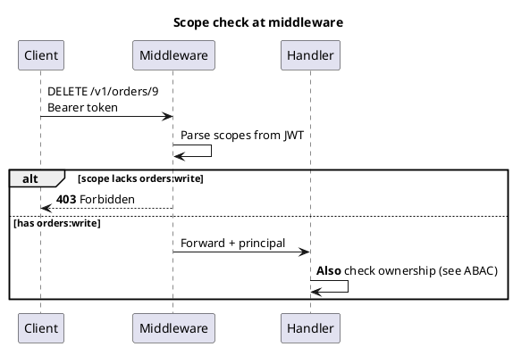

#### Scenarios — why scopes are preferred there

**1. “Connect my GitHub” / third-party app**

- User consents to `repo:read` only; your API never grants `repo:delete` on that token.
- **Why scopes:** Standard OAuth model; users and auditors understand capability names.

**2. Partner API key with attached scopes**

- Key record: `partner_id=acme`, `scopes=["reports:read"]`.
- **Why:** Same pattern as OAuth without full IdP—lookup key → scopes → allow route family.

**3. API gateway route policies**

- Route `/v1/admin/*` requires scope `admin:*` at the gateway.
- **Why:** Block entire surface area before traffic hits fragile admin services.

#### When scope-only authz is not enough

| Gap | Why scopes fail | Add |
| --- | --- | --- |
| **“Read my orders” vs “read order #12 I don’t own”** | `orders:read` does not encode **which** rows | **Resource ownership** or **tenant filter** in handler/DB |
| **Sharing one document with user B** | Scopes are global to the token | **ACL** on the document |
| **“Manager may approve if amount under $10k”** | Scopes are not conditional on resource fields | **ABAC** or policy engine |

---

##### RBAC (Role-Based Access Control)

**When to use:** **Admin panels**, internal tools, and **SaaS** products where users fit **named roles** (`admin`, `editor`, `viewer`) and permissions change by **role assignment**, not by editing every resource. Rules are maintained in a **role → permission** table.

**Example:** `billing_viewer` may `GET /v1/invoices` but not `POST /v1/invoices/{id}/refund`. Refund requires `billing_admin`.

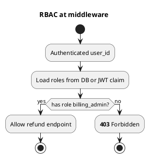

#### Scenarios — why RBAC is preferred there

**1. Company admin dashboard**

- Roles: `org_admin`, `member`, `billing_viewer`. Hundreds of users; few role types.
- **Why RBAC:** Easy to explain in UI (“Invite as Editor”); permissions centralized in one matrix.

**2. Internal ops / support tools**

- Support role may impersonate read-only; only `superadmin` may change production flags.
- **Why:** Audit logs tie actions to **role**; onboarding is “grant role” not per-endpoint keys.

**3. Service accounts**

- Machine principal `reporting-worker` has role `internal_readonly`.
- **Why:** Same model for humans and jobs; rotate by changing role binding.

#### When RBAC is a poor fit

| Situation | Better choice | Reason |
| --- | --- | --- |
| **Per-document sharing (“share with alice@…”)** | **ACL** | Roles do not express arbitrary one-off grants on one object. |
| **Third-party OAuth with variable consent** | **Scopes** | Industry standard for delegated capability lists. |
| **Rule: “owner OR same department OR admin”** | **ABAC** / policy engine | RBAC roles multiply combinatorially (`admin_dept_A`, …). |

---

##### ABAC (Attribute-Based Access Control)

**When to use:** Rules depend on **multiple attributes**: resource owner, `tenant_id`, department, classification, time window, IP, order state. Common in **multi-tenant SaaS** (“user may edit if `order.tenant_id == token.tenant_id` and `order.status == draft`”).

**Example:**

```text
allow if:
  subject.sub == resource.owner_id
  OR subject.roles contains "admin"
  AND resource.tenant_id == subject.tenant_id
```

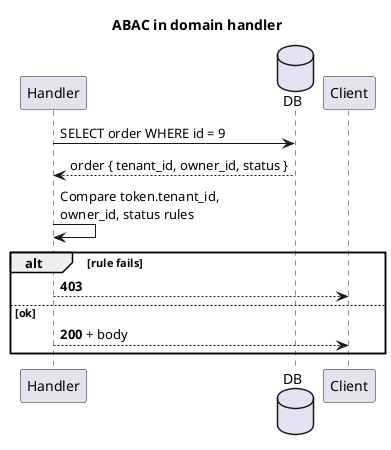

#### Scenarios — why ABAC is preferred there

**1. Multi-tenant SaaS CRUD**

- Every query must match `tenant_id` from the JWT, never from the client body alone.
- **Why ABAC:** Prevents cross-tenant data leaks with one consistent rule.

**2. Workflow state machines**

- “Cancel allowed only if `status == pending` and caller is owner or `fulfillment_admin`.”
- **Why:** Permissions depend on **resource state**, not just role name.

**3. Gradual replacement of hard-coded `if` chains**

- Policy engine (below) is ABAC at scale; inline checks are ABAC in application code.

#### When ABAC in code becomes painful

| Situation | Better choice | Reason |
| --- | --- | --- |
| **Dozens of services need identical rules** | **OPA / Cedar** | Duplicate ABAC logic drifts between teams. |
| **Simple public API with 3 scopes** | **Scopes only** | ABAC adds complexity without benefit. |
| **“Who can read file X?” list on the file** | **ACL** | Natural model is explicit grants on the object. |

---

##### ACL (Access Control List) per resource

**When to use:** **Shared resources** where access is **per object**: documents, folders, boards, tickets shared with specific users or groups. Each resource stores (or links to) a list of `(principal, permission)`.

**Example:** Document `doc-9` has ACL: `alice:read`, `bob:read,write`. Charlie gets **403** even with global `documents:read` scope if not on the ACL.

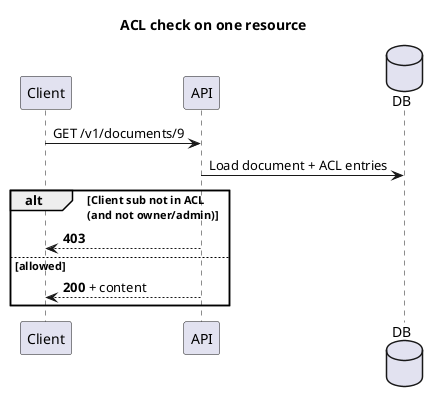

#### Scenarios — why ACLs are preferred there

**1. Google Drive–style sharing**

- Owner shares one file with external email; others in the org have no access.
- **Why ACL:** Grant is **on the object**; no custom role per collaborator.

**2. Support ticket visible to requester + assigned agent**

- Ticket row: ACL or join table `ticket_id, user_id, level`.
- **Why:** Fine-grained without giving `support` role access to all tickets.

#### When ACLs are a poor fit

| Situation | Better choice | Reason |
| --- | --- | --- |
| **Uniform “all admins see everything in org”** | **RBAC** | ACL on every row is heavy to maintain. |
| **API-wide “this key may only call /reports”** | **Scopes** at gateway | Route-level, not per row. |
| **Millions of objects with same tenant rule** | **Row-level tenant** + RBAC | ACL per row does not scale for “everyone in tenant T.” |

---

##### Row-level security and multi-tenant filtering

**When to use:** **Every** query in a **SaaS** database must be constrained to the caller’s **tenant** / **org** (and often user). Implement in application queries (`WHERE tenant_id = ?`) and/or **RLS** (Row-Level Security) in **Postgres** so even a buggy ORM query cannot cross tenants.

**Example (application):**

```sql
SELECT * FROM orders
WHERE id = $1 AND tenant_id = $current_tenant_from_jwt;
```

**Example (Postgres RLS):** Policy `tenant_id = current_setting('app.tenant_id')` on `orders`.

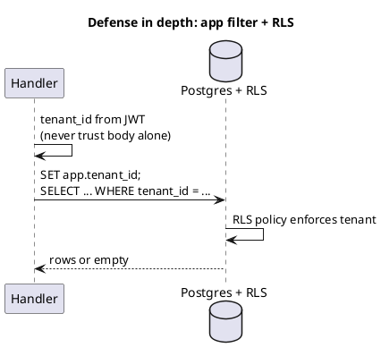

#### Scenarios — why row-level / RLS is preferred there

**1. B2B SaaS with many tenants on one schema**

- **Why:** One missed `WHERE tenant_id` in a new endpoint causes a critical breach; RLS is a safety net.

**2. Read replicas + ad-hoc SQL tools**

- Analyst tools connect with a role subject to RLS so raw SQL cannot scan all tenants.

**3. Microservices sharing one database (discouraged but real)**

- RLS limits blast radius if one service forgets a filter.

#### When RLS alone is not enough

| Situation | Still need | Reason |
| --- | --- | --- |
| **“User 5 may edit only **their** orders”** | Handler **ownership** check | RLS on tenant does not distinguish users within tenant. |
| **Complex business rules** | Domain logic or policy engine | RLS expresses row predicates, not full workflows. |
| **No Postgres / document store** | App-level filters | RLS is a relational DB feature; Mongo needs query filters in code. |

---

##### Policy engine (OPA, Cedar, IAM-style)

**When to use:** Many services, **gRPC** + HTTP, admin tools, and **compliance** need **one language** for policies; rules change often; security team owns policy repos separately from app releases.

**Example (conceptual):** API sends JSON to OPA: `{ "user", "action", "resource" }` → `allow` / `deny`.

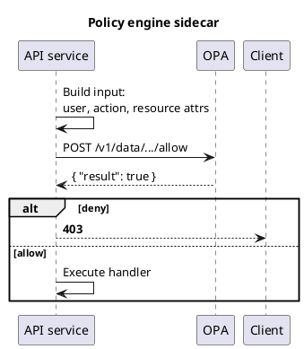

#### Scenarios — why a policy engine is preferred there

**1. Kubernetes admission + API + batch jobs**

- Same Rego/Cedar policy: “images from approved registry,” “user may delete namespace X.”
- **Why:** One audit surface; policies versioned in git.

**2. Large bank / regulated environment**

- **Why:** Security reviews policies without reading every microservice’s `if` statements.

**3. Dynamic attributes from multiple systems**

- Attributes pulled from HR (department), CMDB (env), and request—ABAC too scattered to hard-code.

#### When a policy engine is overkill

| Situation | Better choice | Reason |
| --- | --- | --- |
| **Single monolith, small team** | RBAC + tenant checks in code | Operational cost of OPA cluster and policy CI. |
| **Three scopes and two roles** | Scopes + RBAC | Simpler to debug. |
| **Latency-sensitive hot path** | Cache policy decisions; or in-process rules | Extra network hop to OPA on every request unless optimized. |

---

##### Layered authorization (gateway + app + database)

**When to use:** Almost **all** non-trivial APIs. **Coarse** checks early (reject cheaply); **fine** checks where the resource lives (ownership, state, ACL).

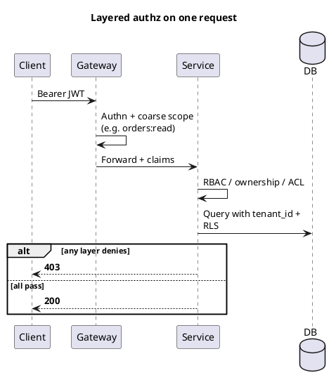

**Rule of thumb:** Gateway knowing `orders:read` does **not** prove the caller may read **order 12**. Always enforce **resource-level** rules in the service or **RLS**.

---

#### Where authorization checks run in the stack

**When to use each layer:** Push **cheap, stable** rules outward (rate limits, JWT validity, route/scopes). Keep **context-rich** rules inward (ownership, state machines, ACL on one document). **Never** rely on the edge alone for “may this user touch **this** row?”

| Layer | Best for (authz) | Not sufficient alone for |
| --- | --- | --- |
| **CDN / WAF** | Rate limits, geo block, bot rules | Per-user row access |
| **API gateway** | Route ↔ scope/key, JWT validation, quotas | Resource ownership |
| **Service middleware** | Roles, scopes, tenant from token | Business rules needing DB state |
| **Domain / handler** | Ownership, ACL, workflow state | — (primary place for fine authz) |
| **Database (RLS)** | Tenant isolation safety net | OAuth scopes, role names |

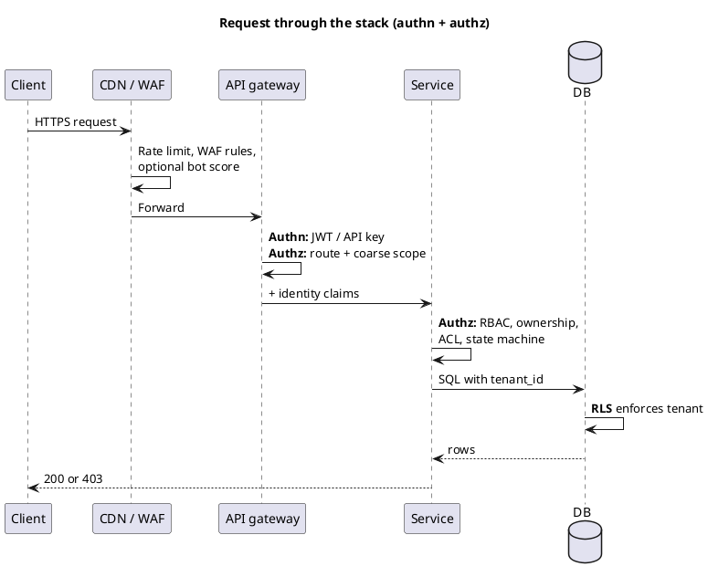

---

##### CDN / WAF (edge)

**When to use:** **Abuse prevention** and **global** policies—rate limiting per IP/API key fingerprint, geo restrictions, blocking known bad paths, DDoS mitigation. Sometimes **JWT validation at edge** (e.g. Cloudflare API shield) to drop invalid tokens before origin load.

**Example:** Block `POST` from countries you do not serve; cap 1000 req/min per API key id at edge.

#### Scenarios — why edge checks help

**1. Public API under scraper attack**

- **Why:** Origin CPU saved; bad traffic never hits app servers.

**2. Static or cacheable GET responses**

- **Why:** CDN serves cached body; authz for **public** cache keys only.

#### When edge is not enough

| Limitation | Reason |
| --- | --- |
| Cannot know **order.owner_id** without origin | Edge lacks your database |
| **Per-user** row rules | Needs service or **RLS** |
| Treating WAF as sole **authz** | Attackers who pass IP limits still need app-level **403** |

---

##### API gateway

**When to use:** Central **JWT validation**, **API key** lookup, **mTLS** termination, **route-level** authorization (“key X may only hit `/v1/reports/*`”), quotas, and request routing to microservices.

**Example (Kong/Apigee/Envoy):** Plugin requires `scope: admin` for `/v1/admin/*`; forwards `X-User-Id`, `X-Tenant-Id` headers to upstream.

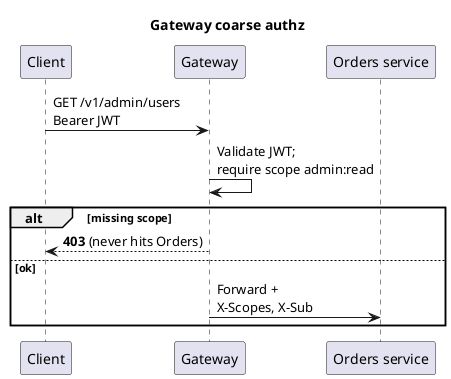

#### Scenarios — why gateway authz is preferred there

**1. Many microservices, one front door**

- **Why:** One place to enforce TLS, JWT, and “this partner key cannot call `/v1/payments`.”

**2. Legacy services without auth middleware**

- **Why:** Gateway adds authz until services are upgraded.

#### When gateway-only authz fails

| Situation | Still required upstream | Reason |
| --- | --- | --- |
| `GET /v1/orders/12` with `orders:read` | **Ownership** check in Orders service | Scope does not mean user owns order 12 |
| Compromised gateway config | Service-level checks | Misroute could expose internal paths |
| Fine ACL per document | Handler + DB | Gateway does not load document ACL |

---

##### Service middleware

**When to use:** Immediately after **authn** in each service—load **principal**, enforce **roles** and **scopes**, attach `tenant_id` to request context, reject before controller logic runs.

**Example (pseudocode):**

```text
@app.middleware
def authz(req):
  user = verify_jwt(req)
  if "orders:write" not in user.scopes: raise 403
  req.state.principal = user
```

#### Scenarios — why middleware authz

**1. Consistent 403 for missing scope across all routes**

- **Why:** Controllers stay thin; forget one check → still caught if middleware is route-aware.

**2. Map API key → partner_id + scopes**

- **Why:** Same pattern as JWT for B2B keys.

#### When middleware is not enough

| Gap | Add in handler |
| --- | --- |
| Resource-specific rules | `order.owner_id == user.sub` |
| State-dependent rules | `status == pending` |
| ACL on shared doc | Load ACL table |

---

##### Domain / handler (resource-level)

**When to use:** **Always** for rules that need **this row’s** data—ownership, sharing, workflow state, amount limits, “cannot delete org with active subscription.” This is the **source of truth** for business authorization.

**Example:** `DELETE /v1/orders/9` → load order → verify `order.user_id == jwt.sub` OR `admin` role → verify `order.status != shipped` → then delete.

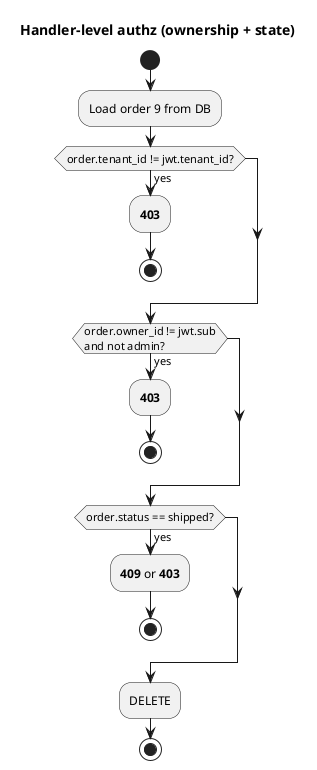

#### Scenarios — why handler authz is mandatory

**1. “Users manage only their own profile”**

- `PATCH /v1/users/me` vs `PATCH /v1/users/{id}`—handler ensures `{id} == sub` unless admin.

**2. Idempotent webhook processing**

- Authn was HMAC; authz is “do we accept this event type for this merchant id.”

#### When handler-only authz is risky

| Risk | Mitigation |
| --- | --- |
| New endpoint forgets check | Middleware scopes + **RLS** backstop |
| Duplicated logic across services | Policy engine or shared authz library |
| Direct DB access bypasses API | **RLS** on database |

---

##### Database (RLS and views)

**When to use:** **Tenant isolation** and **last-line defense** when application code might bug or a tool connects directly to the DB. **RLS** policies filter rows by `tenant_id` (or user) set per connection/session.

**Example:** `SET app.current_tenant = 't-42'` before queries; policy on `orders` allows rows only where `tenant_id = current_setting('app.current_tenant')`.

#### Scenarios — why database-layer authz

**1. Multi-tenant Postgres SaaS**

- **Why:** Even if one service ships without `WHERE tenant_id`, RLS returns zero rows for other tenants.

**2. BI read-only role**

- Analysts run SQL with RLS—cannot exfiltrate other tenants.

#### When DB-layer authz is not enough

| Limitation | Reason |
| --- | --- |
| **Scope names** (`orders:write`) | Not stored in SQL—belongs in token/middleware |
| **“Admin may delete any row in tenant”** | RLS must combine role signal from session variable |
| **NoSQL / event stores** | Use app filters or separate authorization service |

---

#### Choosing model + layer (quick guide)

| You need… | Model | Layer |
| --- | --- | --- |
| Third-party “Connect account” with limited powers | **Scopes** | Gateway + middleware |
| Internal admin roles | **RBAC** | Middleware + handler for exceptions |
| SaaS tenant isolation | **Row-level** + **ABAC** | Handler + **RLS** |
| Share one file with external user | **ACL** | Handler |
| Same rules on HTTP, gRPC, jobs | **Policy engine** | Sidecar or library + handler |
| “May user X touch **this** order?” | **ABAC** / ownership | **Handler** (required) |

#### Common combinations in real APIs

| Product type | Typical authn | Typical authz (model + layers) |
| --- | --- | --- |
| **Public REST + developer portal** | API keys + OAuth | Gateway: key → routes; token **scopes**; handler: **tenant** + ownership |
| **Mobile app** | OIDC → Bearer JWT | Middleware: **scopes**; handler: `sub` owns resource; DB: **RLS** on `tenant_id` |
| **Internal microservices** | mTLS / service JWT | Gateway: service identity; handler: “on behalf of” user header + **RBAC** |
| **B2B webhook receiver** | HMAC | Handler: merchant id in payload matches registered id; idempotency (not user RBAC) |
| **Admin dashboard** | Session / **SSO** | **RBAC** in middleware; sensitive actions audited; optional **ABAC** (env=prod) |
| **Document collaboration** | OAuth + Bearer | **Scopes** coarse; per-doc **ACL** in handler; search index filtered by ACL |

**Principles**

- **Least privilege** — short-lived access tokens, narrow scopes, separate read vs write credentials where possible.
- **Secrets not in URLs** — query strings leak via logs, Referer, and browser history; use `Authorization` header (except deliberate short-lived signed URLs).
- **401 vs 403** — unauthenticated vs authenticated-but-denied; align with your [HTTP status codes](/high-level-design/api-design/http-codes/) page.
- **Validate tokens at the boundary** — signature, issuer, audience, expiry; for opaque tokens, introspect or look up in a session store.

**Avoid**

- Long-lived tokens in browsers without refresh or rotation strategy.
- Performing **only** gateway auth without **resource-level** checks (defense in depth).
- Putting **tenant id** only in the body/query without binding it to the authenticated principal.
- Using JWT for everything without rotation (stolen token valid until `exp` unless you add revocation/blocklist).

---

### 3. API versioning and backward compatibility

Versioning tells clients **which contract** they are speaking. You do not need a version in the URL if you can evolve compatibly—but you need a **policy** either way.

**Strategies**

| Approach | Pros | Cons |
| --- | --- | --- |
| **URL path** (`/v1/users`, `/v2/users`) | Obvious in logs and easy to route. | Proliferation of paths; copy-paste between versions. |
| **Header** (`API-Version: 2024-01-01` or `Accept: application/vnd.myapi.v2+json`) | Clean URLs. | Harder to discover from address bar; must document. |

**Backward compatibility**

- **Additive** response fields and **new** endpoints are safe; **removing** or **tightening** behavior is not.
- **Deprecation** — communicate with `Deprecation` / `Sunset` ([RFC 9745](https://www.rfc-editor.org/rfc/rfc9745.html)) headers, docs, and a dated removal plan.
- **Dual-run** critical clients on `v1` and `v2` behind feature flags before turning down `v1`.

**Avoid**

- Silent semantic changes (“`status` used to mean X, now means Y”) under the same version.
- Unbounded support for many minor versions without a retirement calendar.

---

### 4. Request validation and error model design

Validate **as early as possible** (gateway or first middleware), then again at the **domain** layer so invariants cannot be bypassed by a different client.

**Layers**

1. **Syntax** — valid JSON, correct `Content-Type`, size limits.
2. **Schema** — types, required fields, string formats (email, **UUID** (Universally Unique Identifier)), ranges.
3. **Domain** — “end date after start date”, “tenant may not access this org”, inventory rules.

**Error model**

- One **stable envelope** everywhere (e.g. [RFC 7807](https://www.rfc-editor.org/rfc/rfc7807) Problem Details: `type`, `title`, `status`, `detail`, `instance`).
- **Machine-readable `type` or `code`** per error class so clients branch without parsing English prose.
- **Field-level errors** for validation (`errors: [{ "field": "...", "message": "..." } ]`) while keeping top-level `status` aligned with HTTP.

Map HTTP status to outcome: **400** for malformed input, **422** (or strict **400**) for well-formed but invalid business validation—**pick one convention** per API and document it (see [HTTP status codes](/high-level-design/api-design/http-codes/)).

**Avoid**

- Different error JSON per endpoint.
- Returning **200** with `{ "success": false }` for failures (breaks caches, monitors, and middleware).

---

### 5. Pagination, filtering, sorting, and search

**Pagination**

| Style | Use when | Watch out |
| --- | --- | --- |
| **Offset / page** (`?page=2&limit=50`) | Admin **UIs** (User Interfaces), small tables, total count needed. | Inconsistent pages if data shifts during iteration; expensive `OFFSET` at scale. |
| **Cursor** (`?after=opaque`) | High-churn feeds, mobile infinite scroll. | Reversible “previous page” is harder; define cursor stability (tie-breaker). |

Always cap **`limit`** server-side. Return **`next` / `prev` links** or cursors in the body, not only implicit math.

**Filtering and sorting**

- Prefer **explicit** query params (`?status=open&owner_id=eq:42`) or a small documented subset; avoid arbitrary **SQL** (Structured Query Language)-like strings unless you have a safe parser.
- **Sort** should require a **stable tie-breaker** (e.g. `sort=-created_at,id`) so pagination does not shuffle rows.
- **Search** — for heavy or structured queries, **`POST /search`** with a JSON body is often clearer than megabyte query strings; document idempotency and caching implications.

**Avoid**

- Unbounded queries that scan full tables by default.
- Sorting only by non-unique columns without a secondary key.

---

### 6. Documentation and developer experience (DX)

Treat **documentation** as part of the product: onboarding time predicts adoption. **DX** (Developer Experience) covers docs, examples, and try-it flows.

**Deliver**

- **Reference** — OpenAPI (or equivalent) with **realistic examples** and all auth flows described.
- **Guides** — authentication, pagination, error handling, idempotency, and webhooks in prose.
- **Changelog** — breaking vs additive per release; link to migration guides.
- **Try-it** — sandbox keys, mock server from OpenAPI, or a minimal Postman/Bruno collection.

**DX details**

- Consistent **base URL** per environment; obvious error when the wrong host is used.
- **Request IDs** — accept `X-Request-Id` from clients or generate one; return it in the response for support correlation.
- **Rate limits** — document limits and how to read `429` + `Retry-After` (when you add them under Reliability).

**Avoid**

- Docs that lag the deployed API (generate from the same source as production or fail CI).
- Examples that use admin-only fields or internal-only headers without labeling them.

---

### 7. Browser-side persistence: cookies, storage APIs, and when to use them

Web **APIs** and **SPAs** persist state in the **browser** in several mechanisms. Choices affect **security** (especially **XSS**), **lifetime**, whether data is sent **automatically** on **HTTP** requests, and **cross-site** behavior. This matters for **OAuth** (**PKCE** verifiers), session handling, and what you tell integrators never to stash in `localStorage`.

#### Mechanisms compared

| Mechanism | Typical lifetime | Sent on HTTP requests automatically? | JS readable (`document.cookie`) / script access | Common API / web use cases |
| --- | --- | --- | --- | --- |
| **HTTP Cookie** (including `HttpOnly`) | Until `Max-Age` / `Expires` or session cookie | **Yes** — browser attaches **`Cookie`** header to matching requests (domain, path, `Secure`, `SameSite`) | **`HttpOnly` → No** script access — mitigates **XSS** reading the session cookie; non-HttpOnly cookies are script-readable | Server **session ids**, BFF **opaque session**, “remember preferences” rarely (prefer safer patterns for auth) |
| **`sessionStorage`** | **Per tab**: cleared when tab/window is closed | No | Yes | OAuth **PKCE `code_verifier`** for same-origin round-trip; **wizard** state that must not leak to other tabs |
| **`localStorage`** | Until explicitly cleared | No | Yes | Non-sensitive UX prefs (**theme**, last-viewed benign id); **avoid** secrets, JWTs, **refresh tokens** |
| **`IndexedDB` / Cache API** | Persisted across restarts until cleared | No | Yes (async APIs) | **Offline** **PWAs** (Progressive Web Apps), large client-side caches — still **hostile to XSS**: treat as attacker-readable |
| **In-memory** (JS variables only) | Tab until full reload/navigation loses SPA | No | Yes (until GC) | **Short-lived access token** to reduce persistence footprint; cleared on reload |

#### Cookie attributes that matter (`Set-Cookie`)

| Attribute | Effect |
| --- | --- |
| **`HttpOnly`** | JavaScript cannot read cookie — reduces token theft via XSS (**use for session/session id** tied to server auth). |
| **`Secure`** | Sent only over **HTTPS**. |
| **`SameSite`** (Same-Site cookie policy; `Lax` / `Strict` / `None`) | **`Lax`** — cookie not sent on **cross-site** `POST`; still sent on some top-level navigations; common default posture. **`Strict`** — narrower; less cross-navigation cookie use. **`None`** requires **`Secure`** — for intentional cross-site cookie use (risky; document carefully). Helps limit **CSRF** for cookie-based auth when combined with other controls. |
| **`Path` / `Domain`** | Limits which URLs receive the cookie. |

**Cookies vs `Authorization: Bearer`** — Bearer in JS/header is flexible but **readable by XSS**. Cookie-based sessions with **`HttpOnly`** hide the opaque id from scripts; combine with **`SameSite`**, CSRF tokens for unsafe methods, or use **SPA + BFF** so refresh stays server-side.

#### When to use what (quick rules)

| Need | Prefer |
| --- | --- |
| Long-lived secrets (**refresh tokens**), pairing user to server session without JS reading id | **`HttpOnly` + `Secure` + `SameSite`** cookie toward **your origin** only; secrets only on server |
| Value must survive **OAuth redirect on same SPA origin** (`code_verifier`) | **`sessionStorage`** (or server session if callback hits BFF) |
| Persist benign UI prefs across visits | **`localStorage`** OK; **never** store secrets |
| Largest offline data / blobs | **IndexedDB** (still not for untrusted-sensitive secrets unless you accept device compromise model) |
| Minimize XSS window for short access token | **Memory** variable; renew often; **CSP** (Content Security Policy) + sanitization |

**Avoid**

- **Refresh tokens**, **opaque session secrets**, **API keys**, or raw **JWTs** meant for confidentiality in **`localStorage`/`sessionStorage`** — any XSS leaks them broadly.
- Relying on cookies for **`api.example.com`** from a page on **`evil.com`** — cross-origin cookie rules and **third‑party cookie** deprecation make “cookie everywhere” brittle; explicit **Bearer** toward API or **BFF same-origin cookie** patterns are clearer.

---

## Reliability and Performance

### 1. Caching strategy and cache invalidation

Cache what is expensive to compute or fetch and safe to serve slightly stale; skip caching per-user secrets or anything where staleness would break a business rule (e.g. an in-flight payment status). The right layer and invalidation strategy follow from two facts about the data: **how often it changes** and **how stale a client can tolerate it being**.

**Where to cache**

| Layer | Good for | Watch out |
| --- | --- | --- |
| **Client** (`Cache-Control`, `ETag`) | Static assets, rarely-changing reference data | Client controls freshness — you cannot force a purge |
| **CDN** (Content Delivery Network) / edge | Public, cacheable **GETs** shared across users | Wrong `Vary` / auth handling leaks per-user data across users |
| **API gateway / reverse proxy** | Hot read endpoints in front of a slower origin | One more place invalidation has to reach |
| **Application cache** (Redis, Memcached) | Computed aggregates, joined/denormalized views | Extra infra to run, monitor, and keep coherent across instances |
| **Database** (query cache, materialized view) | Expensive aggregate queries with a known refresh cadence | Refresh lag is itself a staleness source to document |

Each layer only exists to short-circuit the one behind it — a hit returns immediately, a miss falls through to the next, slower layer:

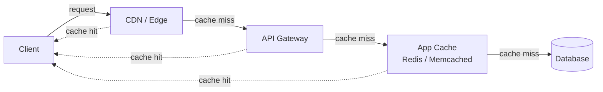

**HTTP-native caching**

- **`Cache-Control: max-age=…, s-maxage=…`** — the primary **TTL** (Time To Live) signal; `s-maxage` lets shared caches (CDN) hold longer than the browser does.
- **`ETag`** / **`If-None-Match`** — revalidate cheaply: the server returns **304 Not Modified** with no body when the resource hash is unchanged.
- **`Last-Modified`** / **`If-Modified-Since`** — coarser revalidation when a hash is impractical to compute.
- **`Vary`** — tells a shared cache to key its stored responses by a request header too, not just the URL. `Vary: Authorization` makes the cache key `(URL, Authorization value)`, so a request with `Bearer A` and one with `Bearer B` get two separate stored entries. Without it, a cache keyed only on the URL will serve one user's cached response to a different user. Downside: since every user's `Authorization`/`Cookie` value is different, `Vary`-ing on them means the shared cache basically stops getting cross-user hits at all — for personal responses, `Cache-Control: private` (browser-only, no shared cache stores it) is usually the more honest fix than relying on `Vary`.
- **`stale-while-revalidate`** — serve the stale copy immediately while refreshing in the background; hides origin latency, at the cost of briefly serving old data on every refresh cycle.

**Invalidation strategies**

| Strategy | How it works | Trade-off |
| --- | --- | --- |
| **TTL expiration** | Entry expires after a fixed window; no explicit invalidation needed | Zero invalidation machinery, at the cost of a staleness window that exists even right after a write |
| **Cache-aside, invalidate-on-write** | App deletes/updates the cache key synchronously right after the write commits | Cache stays close to correct, at the cost of every write path having to remember the cache exists |
| **Write-through** | Write goes to cache and store together, in the same request | Reads are always fresh, at the cost of write latency = cache write + store write |
| **Event-driven invalidation** | A domain event (e.g. `order.updated`) fans out to purge affected keys | Decouples writers from cache topology, at the cost of an async delivery path that can lose or delay the purge |
| **Versioned keys** (`cache:v3:order:123`) | Bump a version/namespace on schema or logic change instead of purging | Avoids a purge stampede, at the cost of old versions lingering until their own TTL |

**Event-driven invalidation, concretely** — the writer publishes a domain event (e.g. `ProductPriceChanged{id}`) to a broker (Kafka, SNS/SQS, Redis pub-sub) instead of purging any cache itself. One or more independent consumers subscribe to that event and purge their own cache/CDN/search-index entries. The write path never has to know which caches exist downstream — a new consumer can start subscribing later without any change to the write path.

**Versioned keys, concretely** — two variants:

- **Global bump** (`v3:…` → `v4:…`) when a *code/logic* change, not a data change, makes old entries wrong — e.g. fixing a computed-field bug. New reads use the new prefix; old entries just age out via TTL, no bulk purge needed, and old/new app versions can coexist safely during a rolling deploy.
- **Per-entity version** (`order:{id}:{updated_at}`), derived from the row's own version or timestamp — a write changes `updated_at`, so the next read computes a different key automatically. This needs **no explicit delete at all**: the key itself encodes staleness.

The most commonly tested pattern is cache-aside reads paired with invalidate-on-write:

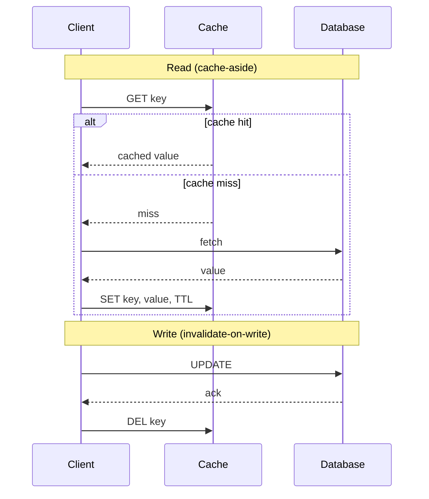

**Where this breaks**

- **Cache stampede** — a hot key expiring under high concurrency sends every in-flight request to the origin at once.

  - **Request coalescing (single-flight)** — the first miss takes a lock (in-process mutex, or a distributed lock via `SET key val NX PX 5000` in Redis); it alone fetches from the origin while every other concurrent request blocks on that same in-flight result. Net effect: exactly one origin call per key, regardless of concurrency.
  - **Jittered TTL** — `60s + random(0, 10s)` instead of a fixed `60s`, so keys populated around the same moment don't all expire in the same instant and stampede together.
  - **`stale-while-revalidate`** — keep serving the stale value to everyone while exactly one background job refreshes it; from the client's side there is never a "miss" to stampede on at all.
  - **Cache warming** — proactively refresh known hot keys (top-N products, homepage data) before they'd expire under load, so the risk never materializes for your hottest keys in the first place.

  ```mermaid
  sequenceDiagram
      participant C1 as Client 1
      participant C2 as Client 2
      participant C3 as Client 3
      participant Ca as Cache
      participant DB as Database

      Note over C1,DB: key just expired — no coalescing
      C1->>Ca: GET key (miss)
      C2->>Ca: GET key (miss)
      C3->>Ca: GET key (miss)
      C1->>DB: fetch
      C2->>DB: fetch
      C3->>DB: fetch
      Note over DB: 3x simultaneous load for one key
  ```

- **Invalidation message loss** — event-driven purge depends on delivery; a dropped message leaves a stale entry with nothing to correct it until the next unrelated write or TTL. That's why you still put a **backstop TTL** on entries even when you have active invalidation — a TTL you're not relying on to do the invalidating, only to cap how stale things can get if the active path fails. Example: purge normally lands within ~200ms via Kafka, but every entry also carries a 6-hour TTL, so a consumer that's down for an hour still can't leave anyone more than 6 hours stale.
- **Multi-instance / multi-region incoherence** — this only bites when each server keeps its own in-process cache instead of a shared one. Deleting a key on server A does nothing to server B or C — each holds its own copy in memory and keeps serving it until its own TTL expires.

  - **Accept the staleness window** — keep local TTLs short enough that being wrong for a few seconds is tolerable; no coordination needed.
  - **Move to one shared cache tier** — every instance reads/writes the same Redis/Memcached cluster, so one `DEL` invalidates everyone at once, at the cost of a network hop on every access.
  - **Pub/sub invalidation broadcast** — keep local in-process caches for speed, but broadcast a purge message on write; each instance deletes the key from its own memory on receipt. This reintroduces the message-loss risk above, so pair it with a backstop TTL too.
  - **Multi-region specifically** — cross-region replication/purge takes real time, not zero. Mitigate with read-your-own-writes region pinning, shorter TTLs at edge/CDN layers, or an explicit CDN purge call (which itself takes seconds to fan out globally) — or simply document the bound ("cross-region reads may lag writes by up to N seconds") instead of engineering it away.

**Avoid**

- Caching a mutable, per-user response at a shared layer without a correct `Vary` — this is how one user's cached response gets served to another.
- Relying on TTL alone for data with a hard consistency requirement ("did the payment go through") — the TTL window is exactly the window where the cached answer can be wrong.
- Deleting a key on invalidation with no stampede protection — every request that misses at the same instant recomputes cold and can take the origin down.
- No invalidation strategy at all ("cache everything with a TTL and hope") — silently means every write has an undocumented staleness window somewhere downstream.

---

### 2. Rate limiting and throttling

Rate limit to protect shared capacity from any one caller and to keep usage fair across tenants. The right algorithm and granularity follow from two facts: **how bursty legitimate traffic is allowed to be**, and **what you're protecting** (your own backend, or a slower downstream dependency you call on their behalf).

**Algorithms**

| Algorithm | How it works | Trade-off |
| --- | --- | --- |
| **Fixed window counter** | Count requests in a fixed bucket (e.g. per minute); reset to 0 at each boundary | Simple to reason about and cheap to store, at the cost of allowing up to 2x the limit in a burst that straddles a window boundary |
| **Sliding window log** | Store every request's timestamp, count how many fall inside the trailing window | Exact limit enforcement, at the cost of storing and scanning a timestamp per request |
| **Sliding window counter** | Weighted blend of the current and previous fixed-window counts | Smooths out the boundary-burst problem, at the cost of being an approximation rather than an exact count |
| **Token bucket** | A bucket holds tokens up to a capacity and refills at a fixed rate; each request consumes one token and is rejected if the bucket is empty | Allows controlled bursts up to the bucket size while still enforcing a steady average rate — the usual default |
| **Leaky bucket** | Requests queue and drain out at a fixed rate; a full queue rejects new requests | Smooths bursts into a steady output rate, at the cost of added latency for anything sitting in the queue |

**Each algorithm's decision flow**

The behavior that actually matters for each algorithm — where it resets abruptly, where it stays smooth, where it rejects — is easier to follow as a flow than described in prose:

:::::group-container

::::group-item[Fixed window]{active}

```diagramsnet
<mxfile>
  <diagram id="fixed-window" name="Fixed Window Counter">
    <mxGraphModel dx="800" dy="600" grid="1" gridSize="10" guides="1" tooltips="1" connect="1" arrows="1" fold="1" page="1" pageScale="1" pageWidth="900" pageHeight="320" math="0" shadow="0">
      <root>
        <mxCell id="0" />
        <mxCell id="1" parent="0" />
        <mxCell id="2" value="Request arrives" style="rounded=1;whiteSpace=wrap;html=1;fillColor=#dae8fc;strokeColor=#6c8ebf;" vertex="1" parent="1">
          <mxGeometry x="40" y="60" width="160" height="60" as="geometry" />
        </mxCell>
        <mxCell id="3" value="Increment counter&#10;(current fixed window)" style="rounded=1;whiteSpace=wrap;html=1;fillColor=#dae8fc;strokeColor=#6c8ebf;" vertex="1" parent="1">
          <mxGeometry x="260" y="60" width="180" height="60" as="geometry" />
        </mxCell>
        <mxCell id="4" value="count &#8804; limit?" style="rhombus;whiteSpace=wrap;html=1;fillColor=#fff2cc;strokeColor=#d6b656;" vertex="1" parent="1">
          <mxGeometry x="500" y="45" width="140" height="90" as="geometry" />
        </mxCell>
        <mxCell id="5" value="Allow" style="rounded=1;whiteSpace=wrap;html=1;fillColor=#d5e8d4;strokeColor=#82b366;" vertex="1" parent="1">
          <mxGeometry x="700" y="30" width="140" height="50" as="geometry" />
        </mxCell>
        <mxCell id="6" value="429 Reject" style="rounded=1;whiteSpace=wrap;html=1;fillColor=#f8cecc;strokeColor=#b85450;" vertex="1" parent="1">
          <mxGeometry x="700" y="110" width="140" height="50" as="geometry" />
        </mxCell>
        <mxCell id="7" value="Counter resets to 0 at a fixed clock boundary, independent of when requests actually arrived — a burst right before and another right after the reset can total close to 2x the limit." style="rounded=1;whiteSpace=wrap;html=1;fillColor=#f5f5f5;strokeColor=#666666;align=left;spacing=8;" vertex="1" parent="1">
          <mxGeometry x="260" y="190" width="420" height="90" as="geometry" />
        </mxCell>
        <mxCell id="8" style="edgeStyle=orthogonalEdgeStyle;rounded=0;html=1;" edge="1" parent="1" source="2" target="3">
          <mxGeometry relative="1" as="geometry" />
        </mxCell>
        <mxCell id="9" style="edgeStyle=orthogonalEdgeStyle;rounded=0;html=1;" edge="1" parent="1" source="3" target="4">
          <mxGeometry relative="1" as="geometry" />
        </mxCell>
        <mxCell id="10" value="yes" style="edgeStyle=orthogonalEdgeStyle;rounded=0;html=1;" edge="1" parent="1" source="4" target="5">
          <mxGeometry relative="1" as="geometry" />
        </mxCell>
        <mxCell id="11" value="no" style="edgeStyle=orthogonalEdgeStyle;rounded=0;html=1;" edge="1" parent="1" source="4" target="6">
          <mxGeometry relative="1" as="geometry" />
        </mxCell>
      </root>
    </mxGraphModel>
  </diagram>
</mxfile>
```

::::

::::group-item[Sliding window log]

```diagramsnet
<mxfile>
  <diagram id="sliding-window-log" name="Sliding Window Log">
    <mxGraphModel dx="800" dy="600" grid="1" gridSize="10" guides="1" tooltips="1" connect="1" arrows="1" fold="1" page="1" pageScale="1" pageWidth="1160" pageHeight="320" math="0" shadow="0">
      <root>
        <mxCell id="0" />
        <mxCell id="1" parent="0" />
        <mxCell id="2" value="Request arrives" style="rounded=1;whiteSpace=wrap;html=1;fillColor=#dae8fc;strokeColor=#6c8ebf;" vertex="1" parent="1">
          <mxGeometry x="40" y="60" width="160" height="60" as="geometry" />
        </mxCell>
        <mxCell id="3" value="Append timestamp&#10;to the request log" style="rounded=1;whiteSpace=wrap;html=1;fillColor=#dae8fc;strokeColor=#6c8ebf;" vertex="1" parent="1">
          <mxGeometry x="260" y="60" width="200" height="60" as="geometry" />
        </mxCell>
        <mxCell id="4" value="Count log entries in&#10;[now &#8722; window, now]" style="rounded=1;whiteSpace=wrap;html=1;fillColor=#dae8fc;strokeColor=#6c8ebf;" vertex="1" parent="1">
          <mxGeometry x="520" y="60" width="220" height="60" as="geometry" />
        </mxCell>
        <mxCell id="5" value="count &#8804; limit?" style="rhombus;whiteSpace=wrap;html=1;fillColor=#fff2cc;strokeColor=#d6b656;" vertex="1" parent="1">
          <mxGeometry x="800" y="45" width="140" height="90" as="geometry" />
        </mxCell>
        <mxCell id="6" value="Allow" style="rounded=1;whiteSpace=wrap;html=1;fillColor=#d5e8d4;strokeColor=#82b366;" vertex="1" parent="1">
          <mxGeometry x="1000" y="30" width="140" height="50" as="geometry" />
        </mxCell>
        <mxCell id="7" value="429 Reject" style="rounded=1;whiteSpace=wrap;html=1;fillColor=#f8cecc;strokeColor=#b85450;" vertex="1" parent="1">
          <mxGeometry x="1000" y="110" width="140" height="50" as="geometry" />
        </mxCell>
        <mxCell id="8" value="The trailing window boundary moves continuously with &#8220;now,&#8221; so the count is always exact — never off by a fixed-boundary trick — at the cost of storing one entry per request." style="rounded=1;whiteSpace=wrap;html=1;fillColor=#f5f5f5;strokeColor=#666666;align=left;spacing=8;" vertex="1" parent="1">
          <mxGeometry x="260" y="190" width="480" height="90" as="geometry" />
        </mxCell>
        <mxCell id="9" style="edgeStyle=orthogonalEdgeStyle;rounded=0;html=1;" edge="1" parent="1" source="2" target="3">
          <mxGeometry relative="1" as="geometry" />
        </mxCell>
        <mxCell id="10" style="edgeStyle=orthogonalEdgeStyle;rounded=0;html=1;" edge="1" parent="1" source="3" target="4">
          <mxGeometry relative="1" as="geometry" />
        </mxCell>
        <mxCell id="11" style="edgeStyle=orthogonalEdgeStyle;rounded=0;html=1;" edge="1" parent="1" source="4" target="5">
          <mxGeometry relative="1" as="geometry" />
        </mxCell>
        <mxCell id="12" value="yes" style="edgeStyle=orthogonalEdgeStyle;rounded=0;html=1;" edge="1" parent="1" source="5" target="6">
          <mxGeometry relative="1" as="geometry" />
        </mxCell>
        <mxCell id="13" value="no" style="edgeStyle=orthogonalEdgeStyle;rounded=0;html=1;" edge="1" parent="1" source="5" target="7">
          <mxGeometry relative="1" as="geometry" />
        </mxCell>
      </root>
    </mxGraphModel>
  </diagram>
</mxfile>
```

::::

::::group-item[Sliding window counter]

```diagramsnet
<mxfile>
  <diagram id="sliding-window-counter" name="Sliding Window Counter">
    <mxGraphModel dx="800" dy="600" grid="1" gridSize="10" guides="1" tooltips="1" connect="1" arrows="1" fold="1" page="1" pageScale="1" pageWidth="1060" pageHeight="320" math="0" shadow="0">
      <root>
        <mxCell id="0" />
        <mxCell id="1" parent="0" />
        <mxCell id="2" value="Previous window count&#10;(frozen)" style="rounded=1;whiteSpace=wrap;html=1;fillColor=#dae8fc;strokeColor=#6c8ebf;" vertex="1" parent="1">
          <mxGeometry x="40" y="30" width="200" height="60" as="geometry" />
        </mxCell>
        <mxCell id="3" value="Current window count&#10;(still growing)" style="rounded=1;whiteSpace=wrap;html=1;fillColor=#dae8fc;strokeColor=#6c8ebf;" vertex="1" parent="1">
          <mxGeometry x="40" y="130" width="200" height="60" as="geometry" />
        </mxCell>
        <mxCell id="4" value="Weighted estimate =&#10;current + previous &#215; (1 &#8722; elapsed/window)" style="rounded=1;whiteSpace=wrap;html=1;fillColor=#dae8fc;strokeColor=#6c8ebf;" vertex="1" parent="1">
          <mxGeometry x="300" y="70" width="280" height="80" as="geometry" />
        </mxCell>
        <mxCell id="5" value="estimate &#8804; limit?" style="rhombus;whiteSpace=wrap;html=1;fillColor=#fff2cc;strokeColor=#d6b656;" vertex="1" parent="1">
          <mxGeometry x="640" y="65" width="140" height="90" as="geometry" />
        </mxCell>
        <mxCell id="6" value="Allow" style="rounded=1;whiteSpace=wrap;html=1;fillColor=#d5e8d4;strokeColor=#82b366;" vertex="1" parent="1">
          <mxGeometry x="840" y="50" width="140" height="50" as="geometry" />
        </mxCell>
        <mxCell id="7" value="429 Reject" style="rounded=1;whiteSpace=wrap;html=1;fillColor=#f8cecc;strokeColor=#b85450;" vertex="1" parent="1">
          <mxGeometry x="840" y="130" width="140" height="50" as="geometry" />
        </mxCell>
        <mxCell id="8" value="Blends the two counts into a smooth estimate instead of snapping to 0 at the boundary — an approximation, but it avoids the fixed-window's boundary-burst problem." style="rounded=1;whiteSpace=wrap;html=1;fillColor=#f5f5f5;strokeColor=#666666;align=left;spacing=8;" vertex="1" parent="1">
          <mxGeometry x="300" y="200" width="480" height="90" as="geometry" />
        </mxCell>
        <mxCell id="9" style="edgeStyle=orthogonalEdgeStyle;rounded=0;html=1;" edge="1" parent="1" source="2" target="4">
          <mxGeometry relative="1" as="geometry" />
        </mxCell>
        <mxCell id="10" style="edgeStyle=orthogonalEdgeStyle;rounded=0;html=1;" edge="1" parent="1" source="3" target="4">
          <mxGeometry relative="1" as="geometry" />
        </mxCell>
        <mxCell id="11" style="edgeStyle=orthogonalEdgeStyle;rounded=0;html=1;" edge="1" parent="1" source="4" target="5">
          <mxGeometry relative="1" as="geometry" />
        </mxCell>
        <mxCell id="12" value="yes" style="edgeStyle=orthogonalEdgeStyle;rounded=0;html=1;" edge="1" parent="1" source="5" target="6">
          <mxGeometry relative="1" as="geometry" />
        </mxCell>
        <mxCell id="13" value="no" style="edgeStyle=orthogonalEdgeStyle;rounded=0;html=1;" edge="1" parent="1" source="5" target="7">
          <mxGeometry relative="1" as="geometry" />
        </mxCell>
      </root>
    </mxGraphModel>
  </diagram>
</mxfile>
```

::::

::::group-item[Token bucket]

```diagramsnet
<mxfile>
  <diagram id="token-bucket" name="Token Bucket">
    <mxGraphModel dx="800" dy="600" grid="1" gridSize="10" guides="1" tooltips="1" connect="1" arrows="1" fold="1" page="1" pageScale="1" pageWidth="820" pageHeight="340" math="0" shadow="0">
      <root>
        <mxCell id="0" />
        <mxCell id="1" parent="0" />
        <mxCell id="2" value="Refill timer:&#10;+1 token/sec, up to capacity" style="rounded=1;whiteSpace=wrap;html=1;fillColor=#dae8fc;strokeColor=#6c8ebf;" vertex="1" parent="1">
          <mxGeometry x="40" y="30" width="220" height="60" as="geometry" />
        </mxCell>
        <mxCell id="3" value="Token bucket" style="shape=cylinder3;whiteSpace=wrap;html=1;boundedLbl=1;backgroundOutline=1;size=15;fillColor=#ffe6cc;strokeColor=#d79b00;" vertex="1" parent="1">
          <mxGeometry x="320" y="20" width="140" height="90" as="geometry" />
        </mxCell>
        <mxCell id="4" value="Request arrives" style="rounded=1;whiteSpace=wrap;html=1;fillColor=#dae8fc;strokeColor=#6c8ebf;" vertex="1" parent="1">
          <mxGeometry x="40" y="170" width="200" height="60" as="geometry" />
        </mxCell>
        <mxCell id="5" value="Token available?" style="rhombus;whiteSpace=wrap;html=1;fillColor=#fff2cc;strokeColor=#d6b656;" vertex="1" parent="1">
          <mxGeometry x="320" y="155" width="160" height="90" as="geometry" />
        </mxCell>
        <mxCell id="6" value="Consume 1 token &#8594; forward request (Allow)" style="rounded=1;whiteSpace=wrap;html=1;fillColor=#d5e8d4;strokeColor=#82b366;" vertex="1" parent="1">
          <mxGeometry x="560" y="140" width="220" height="60" as="geometry" />
        </mxCell>
        <mxCell id="7" value="429 Reject" style="rounded=1;whiteSpace=wrap;html=1;fillColor=#f8cecc;strokeColor=#b85450;" vertex="1" parent="1">
          <mxGeometry x="560" y="230" width="160" height="50" as="geometry" />
        </mxCell>
        <mxCell id="8" value="Requests can burst up to whatever is currently in the bucket; once it's empty, everything is rejected until the next refill." style="rounded=1;whiteSpace=wrap;html=1;fillColor=#f5f5f5;strokeColor=#666666;align=left;spacing=8;" vertex="1" parent="1">
          <mxGeometry x="40" y="270" width="440" height="60" as="geometry" />
        </mxCell>
        <mxCell id="9" style="edgeStyle=orthogonalEdgeStyle;rounded=0;html=1;" edge="1" parent="1" source="2" target="3">
          <mxGeometry relative="1" as="geometry" />
        </mxCell>
        <mxCell id="10" value="bucket state" style="edgeStyle=orthogonalEdgeStyle;rounded=0;html=1;" edge="1" parent="1" source="3" target="5">
          <mxGeometry relative="1" as="geometry" />
        </mxCell>
        <mxCell id="11" style="edgeStyle=orthogonalEdgeStyle;rounded=0;html=1;" edge="1" parent="1" source="4" target="5">
          <mxGeometry relative="1" as="geometry" />
        </mxCell>
        <mxCell id="12" value="yes" style="edgeStyle=orthogonalEdgeStyle;rounded=0;html=1;" edge="1" parent="1" source="5" target="6">
          <mxGeometry relative="1" as="geometry" />
        </mxCell>
        <mxCell id="13" value="no" style="edgeStyle=orthogonalEdgeStyle;rounded=0;html=1;" edge="1" parent="1" source="5" target="7">
          <mxGeometry relative="1" as="geometry" />
        </mxCell>
      </root>
    </mxGraphModel>
  </diagram>
</mxfile>
```

::::

::::group-item[Leaky bucket]

```diagramsnet
<mxfile>
  <diagram id="leaky-bucket" name="Leaky Bucket">
    <mxGraphModel dx="800" dy="600" grid="1" gridSize="10" guides="1" tooltips="1" connect="1" arrows="1" fold="1" page="1" pageScale="1" pageWidth="860" pageHeight="400" math="0" shadow="0">
      <root>
        <mxCell id="0" />
        <mxCell id="1" parent="0" />
        <mxCell id="2" value="Requests arrive (bursty)" style="rounded=1;whiteSpace=wrap;html=1;fillColor=#dae8fc;strokeColor=#6c8ebf;" vertex="1" parent="1">
          <mxGeometry x="40" y="30" width="200" height="60" as="geometry" />
        </mxCell>
        <mxCell id="3" value="Queue full?" style="rhombus;whiteSpace=wrap;html=1;fillColor=#fff2cc;strokeColor=#d6b656;" vertex="1" parent="1">
          <mxGeometry x="40" y="140" width="160" height="90" as="geometry" />
        </mxCell>
        <mxCell id="4" value="Queue (bounded)" style="shape=cylinder3;whiteSpace=wrap;html=1;boundedLbl=1;backgroundOutline=1;size=15;fillColor=#ffe6cc;strokeColor=#d79b00;" vertex="1" parent="1">
          <mxGeometry x="300" y="20" width="140" height="100" as="geometry" />
        </mxCell>
        <mxCell id="5" value="Drain timer:&#10;fixed rate" style="rounded=1;whiteSpace=wrap;html=1;fillColor=#dae8fc;strokeColor=#6c8ebf;" vertex="1" parent="1">
          <mxGeometry x="300" y="180" width="180" height="60" as="geometry" />
        </mxCell>
        <mxCell id="6" value="Dequeue &#8594; forward request (Allow)" style="rounded=1;whiteSpace=wrap;html=1;fillColor=#d5e8d4;strokeColor=#82b366;" vertex="1" parent="1">
          <mxGeometry x="560" y="180" width="220" height="60" as="geometry" />
        </mxCell>
        <mxCell id="7" value="429 Reject" style="rounded=1;whiteSpace=wrap;html=1;fillColor=#f8cecc;strokeColor=#b85450;" vertex="1" parent="1">
          <mxGeometry x="40" y="270" width="160" height="50" as="geometry" />
        </mxCell>
        <mxCell id="8" value="Bursts get absorbed into the queue; output still drains at a constant rate regardless of how bursty the input was. A full queue rejects anything new, at the cost of added latency for whatever's waiting." style="rounded=1;whiteSpace=wrap;html=1;fillColor=#f5f5f5;strokeColor=#666666;align=left;spacing=8;" vertex="1" parent="1">
          <mxGeometry x="300" y="280" width="480" height="90" as="geometry" />
        </mxCell>
        <mxCell id="9" style="edgeStyle=orthogonalEdgeStyle;rounded=0;html=1;" edge="1" parent="1" source="2" target="3">
          <mxGeometry relative="1" as="geometry" />
        </mxCell>
        <mxCell id="10" value="no (space available)" style="edgeStyle=orthogonalEdgeStyle;rounded=0;html=1;" edge="1" parent="1" source="3" target="4">
          <mxGeometry relative="1" as="geometry" />
        </mxCell>
        <mxCell id="11" value="yes" style="edgeStyle=orthogonalEdgeStyle;rounded=0;html=1;" edge="1" parent="1" source="3" target="7">
          <mxGeometry relative="1" as="geometry" />
        </mxCell>
        <mxCell id="12" style="edgeStyle=orthogonalEdgeStyle;rounded=0;html=1;" edge="1" parent="1" source="4" target="5">
          <mxGeometry relative="1" as="geometry" />
        </mxCell>
        <mxCell id="13" style="edgeStyle=orthogonalEdgeStyle;rounded=0;html=1;" edge="1" parent="1" source="5" target="6">
          <mxGeometry relative="1" as="geometry" />
        </mxCell>
      </root>
    </mxGraphModel>
  </diagram>
</mxfile>
```

::::

:::::

**Where to enforce**

| Layer | Good for | Watch out | Used in practice |
| --- | --- | --- | --- |
| **CDN / edge** | Blocking abuse-scale traffic before it reaches your infra | Coarse — usually keyed by IP, not by account or API key | Cloudflare Rate Limiting Rules, AWS WAF rate-based rules, Akamai App & API Protector, Fastly |
| **API gateway** | One shared enforcement point for per-key/per-tenant quotas, before any backend does work | If the gateway runs as multiple instances, they all need to share one counter store | Kong (rate-limiting plugin), Envoy (local/global rate limit filter), AWS API Gateway usage plans, Apigee, Tyk, NGINX (`limit_req`/`limit_conn`) |
| **Service / application** | Fine-grained limits tied to business rules (e.g. "5 password resets per hour per account") | Enforcing the same key again here duplicates work the gateway may have already done | Redis (`INCR`/`EXPIRE`, or a Lua script) as the shared counter; language-level libraries on top of it — Bucket4j (Java), resilience4j `RateLimiter` (Java), Guava `RateLimiter` (single-instance only), `express-rate-limit` (Node), `django-ratelimit` (Python) |

**HTTP-native signaling**

- **`429 Too Many Requests`** — the status clients should branch on, distinct from a generic `4xx`/`5xx`.
- **`Retry-After`** — tells the client exactly when to try again instead of making it guess (and possibly guess too aggressively).
- **`RateLimit-Limit` / `RateLimit-Remaining` / `RateLimit-Reset`** (or the vendor-prefixed `X-RateLimit-*` equivalents) — let a well-behaved client back off *before* it gets a 429 at all, by watching how much budget it has left.

**Where this breaks**

- **Distributed enforcement** — this only bites when the gateway or service runs as more than one instance and each instance counts requests in its own local memory. The real limit then becomes `(per-instance limit × instance count)`, not the number you configured, because no single instance ever sees the full picture. Fix by moving the counter to a shared store (Redis `INCR` + `EXPIRE`, or a dedicated rate-limiting service), at the cost of a network round trip on every request and that store now needing to be fast and available.
- **Synchronized reset stampede** — if every client's window resets on the same wall-clock boundary (e.g. daily quotas at midnight UTC), everyone who was throttled retries at the same instant, which looks exactly like the cache stampede pattern above. Mitigate by staggering each client's own window start (e.g. from their first request) instead of aligning everyone to the same clock boundary.
- **Non-atomic counter updates** — a naive "read count, check limit, write count+1" done as three separate steps lets two concurrent requests both read the old count before either writes, so more requests get through than the configured limit under load. Use an atomic increment (`INCR` in Redis, or a Lua script for check-and-increment in one step) instead of a manual read-then-write.

**Avoid**

- A single global limit with no per-key granularity — one noisy or abusive caller exhausts the budget that every other caller was relying on.
- Returning `429` with no `Retry-After` — the client has no signal for when to retry, so it either hammers immediately or backs off far more than necessary.
- Rate-limiting the gateway and the service independently on the same key without coordinating the numbers — a caller can get a confusing mix of "allowed at the gateway, rejected at the service" for what looks like the same request pattern.

---

3. Idempotency and retry semantics
4. Timeouts, retries, and circuit breaking
5. Consistency and concurrency control

## Architecture and Delivery
1. Webhooks and asynchronous APIs
2. Testing and quality strategy
3. Monitoring, logging, and tracing

## Governance and Compliance
1. API governance and lifecycle management
2. Multi-tenancy, privacy, and compliance
