# Cache eviction policies

Eviction picks **which** entry to drop when the cache is full. It is separate from **write** patterns (cache-aside, write-through, and so on).

> **Abbreviations:** **LRU** (Least Recently Used), **FIFO** (First In, First Out), **LFU** (Least Frequently Used), **CDN** (Content Delivery Network), **API** (Application Programming Interface), **TTL** (Time To Live), **KV** (Key-Value store), **CI** (Continuous Integration), **CMS** (Content Management System), **SaaS** (Software as a Service), **DMCA** (Digital Millennium Copyright Act), **AWS** (Amazon Web Services), **SLRU** (Segmented LRU), **W-TinyLFU** (Window Tiny Least Frequently Used).

| Policy | Rule |
| --- | --- |
| **LRU** (Least Recently Used) | Evict the **least recently used** entry (by read/write touch time). |
| **FIFO** (First In, First Out) | Evict the **oldest inserted** entry (queue order), regardless of recent use. |
| **LFU** (Least Frequently Used) | Evict the **least frequently used** entry (by access count or frequency score). |

## LRU (Least Recently Used)

**Use when**

- Workloads have **strong temporal locality**: recently touched data is likely needed again soon (session state, hot keys, API responses for trending entities).
- You want a **simple default** that behaves well for many general-purpose caches (**Redis** (Remote Dictionary Server) with LRU-ish policies, in-process caches, **CDN** secondary eviction in some setups).

**Avoid when**

- **Scan** or **one-off** traffic pollutes recency: a crawler or batch job touches many keys once and evicts genuinely hot items (consider **W-TinyLFU** (Window Tiny Least Frequently Used) or **SLRU** (Segmented LRU) variants, or separate caches by workload).
- You need **strict fairness** by arrival time (FIFO may be clearer for bounded queues of jobs).

**Real-world examples**

- **Product catalog pages** (e-commerce, travel): shoppers bounce between a small set of SKUs or hotel IDs; keeping “last touched” listings in an in-process or Redis cache tracks real interest better than FIFO.
- **Session / cart state** at the edge of a busy retail site: recently active sessions stay resident under memory pressure.
- **API gateway** caching JSON for `GET /users/{id}` on a social app: the users you just looked up are the ones clients ask for again in the next seconds.

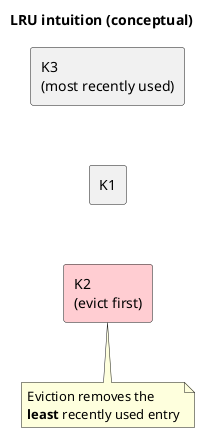

## FIFO (First In, First Out)

**Use when**

- You want **predictable age-out**: oldest entries leave first (streaming buffers, fixed-size audit windows, simple ring buffers).
- **Implementation cost** must be minimal and access patterns do not justify LRU metadata.

**Avoid when**

- **Popularity** matters: a very old but **heavily used** entry can be evicted while a young cold entry stays (bad hit rate vs LRU/LFU for typical web/API traffic).

**Real-world examples**

- **Bounded audit / debug ring buffer** in a payment service: when the buffer is full, drop the **oldest** event first so you always retain a contiguous window of “most recent” incidents.
- **Streaming video segment buffer** on a client or relay: segments are consumed in arrival order; the oldest undelivered chunk is dropped if memory is tight (time alignment matters more than “popularity” of a chunk).
- **Simple job queue** with fixed worker memory: jobs are processed strictly in submission order; FIFO eviction matches business “first come” semantics.

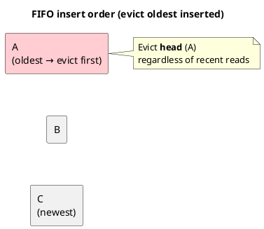

## LFU (Least Frequently Used)

**Use when**

- A stable set of **“hot” keys** dominates traffic (catalog staples, configuration, reference data) and you want them to **outlive** occasional spikes on rare keys.
- You can tune **frequency aging** so old popularity does not block new hot keys forever.

**Avoid when**

- Traffic **shifts quickly** (news, launches): yesterday’s hot keys keep priority and **hurt** new hot data unless the policy decays counts.
- **One-hit wonders** inflate counts (LFU with decay or TinyLFU-style filters helps; plain LFU alone can be brittle).

**Real-world examples**

- **CDN cache tier** for a handful of assets that dominate bytes worldwide (framework JS on a popular SaaS, default avatar images, root `favicon.ico`): millions of hits per minute justify keeping them over one-off marketing campaign URLs.
- **DNS or internal service registry** “popular names” cache: `api.stripe.com`-style stable names stay hot; long tail of internal hostnames should not evict them (often implemented with TinyLFU / windowed LFU in practice).
- **Read-through cache** for **ISO country list**, **currency codes**, or **public holiday calendars** updated rarely but read on every checkout: frequency tracks true business value.

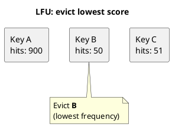

## Eviction policy comparison (at a glance)

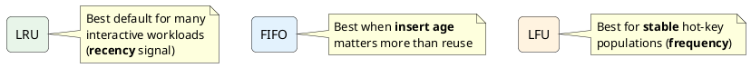

---

# Cache strategies in **API** (Application Programming Interface) design

| Strategy | Idea |
| --- | --- |
| **Cache Aside** | Read: cache first; on miss load DB and **fill** cache. Write: update DB; cache updated separately or expires. |
| **Write Through** | Writes go to **cache and DB** together (or cache first with durable backing). |
| **Write Back** | Writes land in **cache** first; DB persistence is **async/batched** (buffered). |
| **Write Around** | Writes go **straight to DB**; cache is **not** updated on write (reads repopulate or TTL clears). |

## 1) Cache Aside (lazy loading)

**Use when**

- **Read-heavy** workloads with acceptable **eventual** consistency if TTL/invalidation is right.
- The dataset is **large** and you only want hot subsets in cache.
- You prefer **simple failure modes**: if cache is down, you can still read the database.

**Avoid when**

- You must guarantee **no stale reads** after a write without a disciplined invalidation story.
- **Thundering herd** on popular keys is likely unless you add **singleflight**, **probabilistic early refresh**, or **request coalescing**.

**Real-world examples**

- **Redis + PostgreSQL** for `GET /v1/articles/{slug}` on a news site: cache miss loads the row, then `SETEX` for 2 minutes; editors rely on purge or shorter TTL for corrections.
- **Elasticsearch / OpenSearch** query cache pattern: application caches expensive aggregation results keyed by query hash; DB (or search cluster) fills the cache on miss.
- **Mobile app home feed** backed by DynamoDB: only the top of the feed is cached per user; cold users do not fill RAM with unbounded rows.

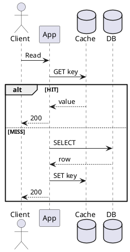

## 2) Write Through

**Use when**

- Reads **immediately** after writes must see fresh data from cache **without** extra invalidation logic.
- Write volume is **moderate** and both cache and DB can keep up.

**Avoid when**

- **Write-heavy** paths would overload the cache or add latency to every write.
- Cached values are **expensive** to keep in sync for rarely read data (wastes memory and write amplification).

**Real-world examples**

- **Distributed session store** (Redis) written on every login attribute change **and** replicated to the DB or durable log so the next read from any app server hits fresh session flags (role, MFA state).
- **Inventory “available to promise”** in a warehouse WMS where the UI reads from cache for speed but every stock adjustment updates cache + relational DB in one transaction so pickers never see a committed DB state that the cache contradicts.
- **Feature flag snapshot** served at the edge: when an admin toggles a flag, write-through keeps CDN/KV and origin authoritative store aligned before the control plane returns success.

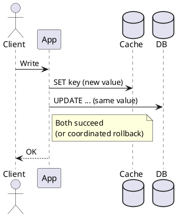

## 3) Write Back (write behind)

**Use when**

- **Burst writes** or **ingest** where batching flushes to disk/DB improves throughput and cost.
- Short **loss windows** are tolerable with **battery-backed buffers**, **replicated queues**, or strict durability trade-offs you accept by design.

**Avoid when**

- You need **strong durability** per write before acknowledging to the user (payments, inventory commits) unless durability is solved elsewhere (WAL, replicated log).
- **Recovery complexity** is unacceptable: crashes between cache acknowledge and DB flush need replay and idempotency.

**Real-world examples**

- **Time-series / metrics ingestion** (Datadog-like agents, Prometheus remote write buffers): samples are accepted into a local WAL-backed buffer and **batched** to the backend; throughput matters more than per-point synchronous DB fsync.
- **Game leaderboards** or **like counters** where clients see approximate counts quickly and a worker flushes aggregates to MySQL/Redis every *N* seconds (with idempotent merge).
- **Search index builders** that buffer document updates in memory or Kafka before bulk commit to Elasticsearch—conceptually write-behind from the API’s perspective.

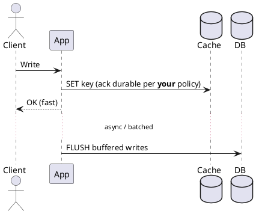

## 4) Write Around

**Use when**

- Writes are **frequent** but reads of the same records are **rare** (avoid polluting cache with write-only garbage).
- You want the cache to hold only **read-optimized** projections populated by **read path**.

**Avoid when**

- Readers expect **low latency** immediately after their own write without waiting for TTL expiry or explicit invalidation.
- You forget to **invalidate** related read keys; clients can see **stale** data longer than intended.

**Real-world examples**

- **Append-only event log** (user actions, security audit): millions of writes per hour, almost no reads through the same hot cache path; analytics reads from warehouse instead.
- **IoT sensor** posting temperature every second to TimescaleDB/Influx: you do not want each write to populate a “latest reading” cache key unless something actually **reads** that key on a dashboard.
- **Ad impression tracking** fire-and-forget to DB: the reporting API caches **aggregated** rollups rebuilt on a schedule, not every raw impression row on write.

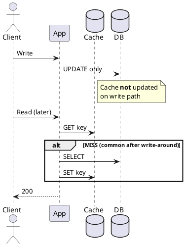

## API cache strategy comparison

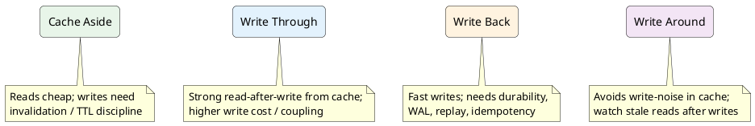

---

# Cache invalidation strategies

| Strategy | Idea |
| --- | --- |
| **Invalidation** | Remove or mark entries **invalid** so the next read refetches. |
| **Expiration (TTL)** | Entries die after a **fixed lifetime** (time-based). |
| **Lazy expiration** | Expiry is checked **on access** (common: TTL + optional background sweep). |
| **Manual invalidation** | Application or ops **explicitly** deletes keys or purges CDN objects on events. |

## Invalidation (explicit delete)

**Use when**

- You know **exactly** which keys changed (user profile update, CMS publish) and want **immediate** consistency for those keys.
- You integrate with **CDN purge-by-tag/URL** after deploys.

**Avoid when**

- You cannot enumerate affected keys (complex derived data) without **heavy coupling**—TTL or versioned keys may be simpler.

**Real-world examples**

- User updates **shipping address**: delete `user:123:profile` in Redis and optionally **purge-by-tag** `user-123` on the CDN for HTML or JSON that embedded the old address.
- **Headless CMS publish** webhook: remove `article:{slug}` and `listing:homepage` keys so the next API request refetches from the database or origin (same pattern as commerce catalog updates).
- **E-commerce sale starts**: invalidate all `price:*` keys tied to a promotion ID when pricing rules change at a known instant.

## Expiration (**TTL** — Time To Live)

**Use when**

- Staleness is **bounded** and predictable (“good enough” for many dashboards and lists).
- You want **automatic** cleanup without wiring every write path.

**Avoid when**

- **Correctness** requires updates visible **before** TTL elapses (combine with invalidation or shorter TTL + validators).

**Real-world examples**

- **“Trending repositories”** on a developer portal: cache GitHub-style JSON for 60 seconds; freshness within a minute is acceptable for discoverability.
- **Weather or traffic widget** on a city homepage: 5–15 minute TTL matches how often upstream data actually refreshes.
- **Public read-only API** with rate limits: short `max-age` (e.g. 30s) caps load on origin without manual purges for every tiny change.

## Lazy expiration (check on read)

**Use when**

- You want **low background CPU**: expunge entries when touched, optionally with periodic sweeps for unused keys.
- Most caches (Redis TTL behavior, many app caches) align with this mental model.

**Avoid when**

- **Unbounded** cold keys never get read again and linger until memory pressure—add **maxmemory** eviction or passive cleanup jobs if that matters.

**Real-world examples**

- **Redis `EXPIRE` on keys**: TTL is decremented logically; many deployments rely on access-driven expiry checks plus occasional active expiry in the background.
- **Browser HTTP cache**: on navigation, the browser may check whether a stored response is still fresh or needs revalidation—work happens when the resource is **used**, not on a global timer for every tab.
- **Application session cache**: “sliding window” sessions extended on each request; idle sessions expire after 30 minutes of **no** access.

## Manual invalidation (ops / admin / runbooks)

**Use when**

- **Incidents**, bad deploys, or legal takedowns need a **human-triggered** purge beyond app logic.
- You run **global** or **prefix** purges on CDNs with clear blast-radius controls.

**Avoid when**

- Manual steps become the **normal** update path (error-prone, slow)—automate purges from CI/CMS or use **content hashing**.

**Real-world examples**

- **Bad deploy** cached a broken `index.html` pointing at missing JS: on-call runs **purge by URL** or **purge everything** on Cloudflare/AWS CloudFront, then rolls forward a fix.
- **DMCA / legal takedown**: compliance team purges specific asset URLs or a **path prefix** from the CDN immediately.
- **Security incident** (accidentally cached authenticated JSON at the edge): emergency **purge by cache-tag** or host-wide purge per runbook, then fix `Cache-Control` / auth rules.

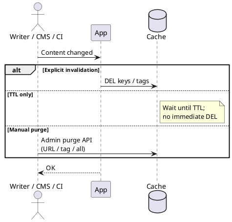

---

# CDN Caching strategies

| Strategy | Idea |
| --- | --- |
| **Edge caching** | Responses stored at **CDN PoPs** near users; shared across clients. |
| **Origin caching** | Caching at the **origin** (reverse proxy, app gateway, object store gateway) to shield databases or app workers. |

## Edge caching

**Use when**

- You serve **static assets**, **cacheable GETs**, or **public** JSON/HTML with correct `Cache-Control` / validators.
- You need **lower latency** and **origin offload** globally.

**Avoid when**

- Responses are **personalized per user** without a safe `Vary` / cache key story—risk of **cross-user leakage**.
- Responses must **never** be stored (`no-store`, auth tokens in URL, highly sensitive payloads).

**Real-world examples**

- **JavaScript/CSS/fonts** for `https://app.example.com` served from CloudFront, Fastly, or Cloudflare with long TTL on **content-hashed** filenames.
- **Public marketing site** images and video segments: first viewer in a region pays origin latency; subsequent viewers in that PoP get edge hits.
- **Software download mirrors** (apt/yum, container image layers): same object requested globally; edge caches cut origin egress bills.

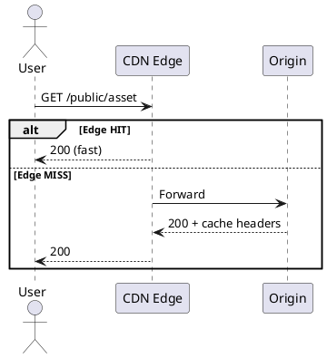

## Origin caching

**Use when**

- The **database** or **microservice mesh** is the bottleneck and a **local** reverse proxy or API gateway cache helps **all** edges equally.
- You want one place to enforce **authorization** before caching **shared** fragments.

**Avoid when**

- You duplicate cache layers **without** clear responsibility—debugging staleness gets harder (document who sets TTL and who purges).

**Real-world examples**

- **nginx `proxy_cache`** in front of a Node or Java monolith: shields the app from repeated identical `GET`s for heavy HTML fragments while the CDN still caches full pages.
- **API gateway** (Kong, Apigee, AWS API Gateway) caching `GET /reports/summary?range=7d` for 30s so dozens of regional edges do not each hammer the same Snowflake-backed microservice.
- **Read replica + local cache** pattern: connection pooler or sidecar caches **prepared statement metadata** or small reference blobs at the data center, below the CDN layer.

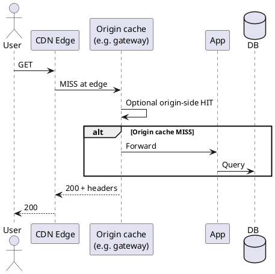

---

# CDN and HTTP caching headers (overview)

These headers control **whether**, **how long**, and **how** intermediaries and browsers reuse responses. Detailed behavior for the main ones appears later in this page (Cloudflare flow, `Cache-Control`, `ETag`, and so on).

| Header | Role (short) |
| --- | --- |
| **Cache-Control** | Primary **policy** knob: TTL, privacy, revalidation, stale extensions. |
| **Pragma** | Legacy **`no-cache`** hint for HTTP/1.0 clients; prefer `Cache-Control`. |
| **Expires** | Absolute HTTP-date expiry; prefer `Cache-Control` for modern freshness. |
| **Last-Modified** | Time-based **validator** for conditional requests. |
| **ETag** | Stronger **validator** (opaque fingerprint of the representation). |
| **Vary** | Expands the **cache key** with request headers (e.g. `Accept-Encoding`). |
| **Cache-Tag** | CDN metadata for **group purge** (e.g. Cloudflare). |
| **CF-Cache-Status** | **Diagnostic** header from Cloudflare (hit/miss/revalidated), not a control knob from origin. |

### When to use / avoid (header level)

| Header | Prefer when | Avoid / watch out when |
| --- | --- | --- |
| **Cache-Control** | Always design freshness here for greenfield APIs and static sites. | Conflicting directives (`no-store` + long `max-age`) confuse operators; test real CDN behavior. |
| **Pragma** | Interop with very old clients/proxies that ignore `Cache-Control` only. | As the **sole** mechanism for modern caching policy—it is too coarse. |
| **Expires** | Simple static hosting where absolute dates are easy to keep consistent. | Clock skew and duplication with `Cache-Control`—keep them aligned or drop `Expires`. |
| **Last-Modified** | Large files or simple origins where filesystem mtime is trustworthy. | Sub-second updates or clustered origins with skew; prefer `ETag`. |
| **ETag** | Any cacheable resource where **byte identity** matters and bandwidth savings help. | Dynamic HTML where computing ETags costs as much as sending the body—profile first. |
| **Vary** | Correctness requires different bodies for different request headers. | Long `Vary` lists or cookie participation → **cache fragmentation** and low hit ratio. |
| **Cache-Tag** | CMS/product with **many related URLs** purged together. | Tag cardinality explosions without governance—purges become wide or slow. |
| **CF-Cache-Status** | Debugging CDN behavior in staging/production. | Treating it as **security** or app logic—it is observability only. |

**Real-world examples (headers in the wild)**

- **`Cache-Control`**: `public, max-age=31536000, immutable` on `app.a1b2c3.js` from Vite/webpack builds; `private, no-store` on online banking account pages.
- **`Pragma: no-cache`**: legacy corporate intranet pages still served to old embedded browsers; modern stacks keep it only as a belt-and-suspenders alongside `Cache-Control`.
- **`Expires`**: cheap shared hosting where the stack sets a fixed “expiry midnight” for static files without a full CDN rule engine.
- **`Last-Modified` / `ETag`**: npm registry or Git LFS serving large tarballs—clients send `If-None-Match` and save bandwidth on unchanged packages.
- **`Vary: Accept-Encoding`**: gzip vs Brotli variants of the same path; **`Vary: Accept-Language`** on a single URL that serves different locale HTML (careful: key explosion).
- **`Cache-Tag`**: newspaper purges `story:88421` so article, AMP page, and JSON-LD snippet all drop together after a correction.
- **`CF-Cache-Status`**: SRE compares `HIT` vs `MISS` across regions after a deploy to confirm purge rules worked.

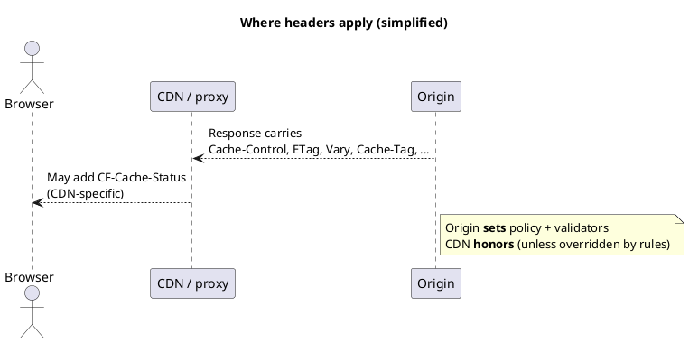

# How cloudflare Caches Static content and invalidates it
Cloudflare sits between the client and your origin server. For static assets (CSS, JS, images, fonts, videos, and sometimes HTML), it stores copies at edge data centers so repeated requests do not hit origin every time.

The basic lifecycle is:
1. First request reaches Cloudflare edge.
2. If the object is not cached at that edge, Cloudflare fetches from origin (cache miss).
3. Cloudflare stores the object with TTL and metadata derived from response headers and cache rules.
4. Next requests are served directly from edge (cache hit) until expiry or purge.

**Real-world examples**

- A **Next.js or Astro marketing site** on Cloudflare Pages: hashed assets under `_astro/*` get long edge TTL; HTML may get shorter `s-maxage` so copy updates propagate quickly.
- **Game launcher** or **desktop app** downloading versioned binaries: first download in Australia hits your origin in the US; the next thousand users in Sydney hit the local PoP.
- **Crisis traffic spike** (viral blog post): edge absorbs the burst so origin CPU stays flat after the first wave of PoP fills.

## Request flow for static content
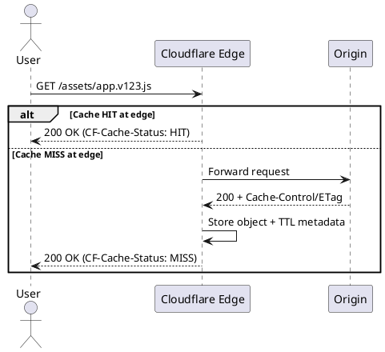

## How Cloudflare decides cacheability
Cloudflare uses a combination of:
1. Cache rules/page rules configured on Cloudflare
2. Origin headers (especially `Cache-Control`, `Expires`, validators)
3. File type and request method (typically `GET`/`HEAD` for edge caching)
4. Cache key settings (URL path, query string behavior, headers/cookies if configured)

When "Origin Cache Control" behavior is enabled (common default), Cloudflare respects origin caching directives. If you override with Cloudflare cache rules, Cloudflare behavior can differ from browser behavior intentionally.

## Headers that matter the most
These are the key headers to design for fast and safe cache updates:

### 1) `Cache-Control` (most important)
`Cache-Control` is an **HTTP response header**. It is **set by your origin** (or by an edge proxy/CDN that **overwrites** response headers). The **browser** and **shared caches** (CDN, corporate proxy) **read** it; they do not invent `max-age` themselves unless you use APIs like `fetch(..., { cache: '...' })` for that single request, which is separate from normal document/subresource caching.

**What it accomplishes overall:** it tells every cache along the path **whether** a response may be stored, **for how long** it can be served without checking the server again, and **when** a cache must revalidate. That controls freshness, bandwidth, origin load, and how quickly users see updates after a deploy.

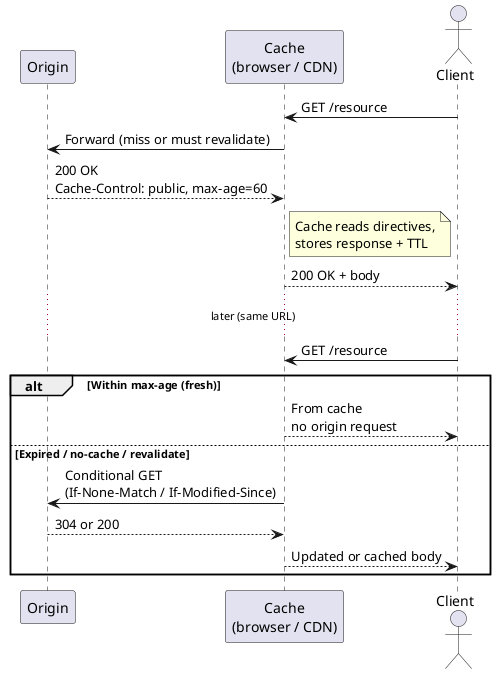

#### Directive groups (structure)

Think of `Cache-Control` as **several knobs** you can combine. They are not mutually exclusive; one response often has **one from column A, one from column B, etc.**

| Group | Directives | Role |
| --- | --- | --- |
| **A. Shared vs private scope** | `public` \| `private` | Whether **shared** caches (CDN, proxy) may keep the response for many users, or only the **browser** should treat it as a private cache entry. |
| **B. Freshness (TTL)** | `max-age`, `s-maxage` | How long the response stays **fresh** before becoming **stale**—for the **browser** vs **shared** caches (`s-maxage` overrides shared-cache freshness only). |
| **C. Storage ban** | `no-store` | **Do not persist** this response in caches at all (strongest “don’t keep” rule). Overrides normal TTL behavior for storage. |
| **D. Revalidation rules** | `no-cache`, `must-revalidate` | **When** the cache must talk to the origin: `no-cache` = validate **before every use** (even while “fresh” by age); `must-revalidate` = once **stale**, do not serve without **successful** revalidation. |
| **E. Stale extensions** | `stale-while-revalidate`, `stale-if-error` | What is allowed **after** expiry: briefly serve **stale** while refreshing, or serve stale on **origin errors** (CDN-heavy; browser support varies). |
| **F. Client hint (fresh window)** | `immutable` | While **fresh**, bytes at this URL will not change—clients **may** skip **optional** reload revalidation (pair with **hashed** URLs). |

**Mnemonic pipeline (order you reason about them):**  
`[A: public or private]` → `[B: max-age / s-maxage]` → `[C: no-store?]` → `[D: no-cache / must-revalidate]` → `[E: stale-*]` → `[F: immutable]`

**Conflicting or overlapping directives (precedence, not “left-to-right”)**  
HTTP does not use CSS-style specificity. **The order of directives in the header value does not matter.** For common clashes, use this table:

| Combination | Effective outcome |
| --- | --- |
| **`no-store`** + anything else (`max-age`, `public`, `immutable`, …) | **`no-store` wins:** the response **must not** be stored. TTL and hints do not create a usable cache entry. |
| **`no-cache`** + **`immutable`** | **`no-cache` wins:** cache **must** successfully **revalidate with the origin** before using the stored response. **`immutable` is effectively useless** here—remove it or drop `no-cache`. |
| **`no-cache`** + large **`max-age`** | **`no-cache` dominates serving:** you still **revalidate before use**. `max-age` does **not** mean “serve for N seconds with no origin round-trip.” It can still affect **freshness / staleness bookkeeping** for extensions like `stale-while-revalidate` where applicable—**verify with your CDN** if you mix these. |
| **`private`** + **`public`** | **Invalid / contradictory in practice.** Do not emit both. If you see it, treat as a bug at the origin; for **shared caches**, assume **`private`** (do **not** store for cross-user reuse) until fixed. |
| **`must-revalidate`** + **`stale-while-revalidate`** | **No single “winner”:** the spec defines how **stale** responses may be used; `stale-while-revalidate` can allow a **brief stale** window while refreshing, while **`must-revalidate`** tightens what is allowed **without** successful revalidation. **CDN and browser behavior can differ**—treat this as “test, don’t guess.” |
| **`immutable`** + **`must-revalidate`** | Usually **harmless but odd:** `immutable` is a **fresh-window** hint; **`must-revalidate`** applies once **stale**. They target different phases; still prefer a clean policy per resource type. |

Below, directives are listed **by group** (same detail as before).

##### A) Shared vs private scope

- **`public`** — **Set on:** response from origin (or CDN). **Used by:** any cache. **Accomplishes:** marks the response as safe to store in **shared** caches (CDN, proxy), not only in the end user’s browser. Use when the bytes are the same for every client (or you already partition with `Vary` correctly).

- **`private`** — **Set on:** response from origin. **Used by:** shared caches must not store it for reuse across users; the **browser** may still cache in its private cache (unless other directives forbid it). **Accomplishes:** reduces the risk of one user’s response being served to another from a CDN. Use for personalized HTML/API payloads.

##### B) Freshness lifetime (TTL)

- **`max-age=<seconds>`** — **Set on:** response from origin. **Used by:** primarily the **browser** (and any cache that does not treat `s-maxage` as overriding shared-cache TTL). **Accomplishes:** for that many seconds after the response was generated, the browser may treat the copy as **fresh** and reuse it **without** contacting the server. After that, the entry becomes **stale** and rules like `no-cache`, `must-revalidate`, or revalidation with `ETag` apply. Shorter `max-age` → users see updates sooner but more requests hit the network; longer → fewer requests but staler content.

- **`s-maxage=<seconds>`** — **Set on:** response from origin. **Used by:** **shared** caches (CDN, proxy), not the private browser cache definition in the same way as `max-age`. **Accomplishes:** lets you give the CDN a **different** TTL than the browser. Typical pattern: short `s-maxage` on HTML (CDN can update quickly) + long `max-age` on hashed static files, or the reverse depending on your strategy.

##### C) Storage ban

- **`no-store`** — **Set on:** response from origin. **Used by:** browsers and intermediaries that comply. **Accomplishes:** the response must **not** be written to persistent cache; sensitive or one-off responses stay off disk. Strongest “don’t keep this” signal for normal HTTP caching.

##### D) Revalidation rules

- **`no-cache`** — **Set on:** response from origin. **Used by:** all caches that honor HTTP semantics. **Accomplishes:** the cache **may** store the response, but must **revalidate** with the origin before serving it (for example via conditional `GET` with `If-None-Match` / `If-Modified-Since`). Useful when you want **local storage for bandwidth** but not “serve blindly without checking.” (Despite the name, it does not mean “do not cache.”)

- **`must-revalidate`** — **Set on:** response from origin. **Used by:** caches once the object is **stale**. **Accomplishes:** after expiry, the cache must not serve a stale copy without successful revalidation with the origin (unlike some lenient behaviors). Tightens behavior when offline or origin-down scenarios matter.

##### E) Stale extensions

- **`stale-while-revalidate=<seconds>`** — **Set on:** response from origin. **Used by:** caches that support it (many browsers and CDNs). **Accomplishes:** after freshness expires, the cache may **still serve the old copy** for up to that window **while** it fetches a fresh one in the background. Users get fast responses; content may be briefly outdated. Great for read-heavy assets where slight staleness is OK.

- **`stale-if-error=<seconds>`** — **Set on:** response from origin. **Used by:** some CDNs/proxies more than all browsers. **Accomplishes:** if the origin errors or times out, the cache may serve a **stale** copy for up to that period instead of failing the user. Improves availability at the cost of serving older content during outages.

##### F) Client hint (optional, while fresh)

- **`immutable`** — **Set on:** response from origin (usually with long `max-age`). **Used by:** browsers. **Accomplishes:** hints that the resource **will not change** for the life of the TTL (perfect for **content-hashed** filenames like `app.a1b2c3.js`). The browser can skip **optional** revalidation on reload in some cases. Only honest if the URL truly changes when content changes.

#### Making sense of `no-cache` vs `must-revalidate` vs `immutable`

Caches think in two phases for a stored response:

1. **Fresh** — inside `max-age` (and similar) → the cache **may** serve the stored body **without** talking to the origin.
2. **Stale** — after freshness expires → different rules apply; some caches could still serve stale copies in limited cases unless you forbid that.

**`no-cache` (misleading name)** — **“Do not use the cache without checking the origin first.”**  
It applies in the **fresh** phase too: you **still store** the response, but before serving it you **must revalidate** (e.g. conditional `GET` → often `304`). So users often **see a network request every time** even though the body might not download again. It does **not** mean “don’t cache.”

**`must-revalidate`** — **“After the response becomes stale, do not serve it without successful revalidation.”**  
It does **not** force checks **while** the object is still fresh. It tightens behavior **only after expiry**: no “I’ll serve something stale anyway” shortcuts; if the origin cannot be reached, the cache may have to fail the request instead of inventing freshness.

**`immutable`** — **“While this URL is fresh, the bytes won’t change, so optional checks are pointless.”**  
It is a **hint** for clients (especially on reload) to skip **extra** revalidation when you already have a long-lived, content-addressed URL. It does **not** override `no-cache`: if both appear, **`no-cache` still wins** (you must validate with the origin before use).

**Quick comparison**

| Directive | Main effect |
| --- | --- |
| `no-cache` | Must **revalidate with origin before serving**, even if the stored copy is still “fresh” by age. |
| `must-revalidate` | Once **stale**, must **not** serve without successful revalidation; stricter than default stale behavior. |
| `immutable` | While **fresh**, content won’t change; clients **may** skip **optional** reload revalidation (use with hashed filenames). |

**Typical combos**

- **Hashed static asset:** long `max-age` + `immutable` (no `no-cache`) → very few requests, no confusion on reload.
- **HTML that must stay fresh-ish:** often `no-cache` or short `max-age` + validators → frequent **cheap** checks (`304`).
- **CDN strictness after TTL:** `max-age` + `must-revalidate` → once expired, no casual stale serving without a successful validation.

### 2) `ETag`
An **`ETag`** (entity tag) is an **opaque string** the origin puts on a **specific representation** of a resource (this version of the bytes for this URL + content negotiation). It means: “if the tag matches later, the body is still the same.”

**Where it is set:** almost always **on the origin** (your app, API gateway, or static file server). The server computes or looks up a value when it builds the response, then sends:

```http
ETag: "686897696a7c876b7e"
```

**Weak vs strong (short version):** `W/"..."` is a **weak** ETag (same “meaning” but bytes might differ slightly—rare for static files). A **strong** ETag (quoted, no `W/`) promises byte-for-byte equality for that variant.

**Where it is stored:**

| Layer | What is stored |
| --- | --- |
| **Origin** | Usually **not** stored as “the ETag table” unless you design it that way. Common patterns: **hash of file contents**, **revision id**, **DB row version**, or **last-modified + size**. Many frameworks compute ETag on the fly from the response body. |
| **Browser / CDN** | The ETag is kept **with the cached HTTP response** (same cache entry as the body and headers). It is metadata used for the **next** conditional request. |

So: the tag is **not** “stored in the browser” as a separate cookie-like thing—it is **part of the cache entry** for that resource.

**When it is used:**

1. **First response:** client gets `200` + body + `ETag`.
2. Later, when the cache entry is **stale** or **`no-cache`** forces a check, the client or CDN sends a **conditional** request:

   ```http
   GET /docs/guide HTTP/1.1
   If-None-Match: "686897696a7c876b7e"
   ```

3. **Origin** compares the current representation’s ETag to `If-None-Match`:
   - **Unchanged** → **`304 Not Modified`** (no body, or minimal). Cache keeps using the stored body; freshness may be refreshed per `Cache-Control`.
   - **Changed** → **`200`** with a **new body** and usually a **new `ETag`**.

**Why it exists:**

- **Bandwidth:** avoid re-downloading large unchanged files.
- **Origin CPU:** hashing or streaming can be cheaper than sending the full payload.
- **Correctness:** safer than time-based guesses when clocks, multiple servers, or fast updates make `Last-Modified` fuzzy.

**When you must change ETag:** whenever the **bytes** of that cached representation change. If you forget, clients may keep showing old content after a “successful” `304` path—so deploys and CMS updates must bump the tag (or the URL, e.g. content-hashed filenames).

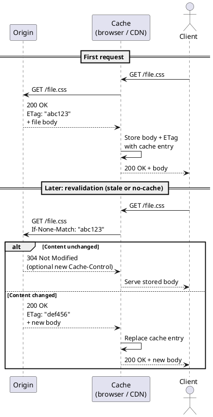

### 3) `Last-Modified`
**Set on:** response from origin. **Stored with:** the cache entry (like `ETag`). **Used when:** the cache sends **`If-Modified-Since`** with the saved date; origin answers **`304`** if the resource was not modified after that time, else **`200`** with a new body and usually a new `Last-Modified`.

Less precise than `ETag` (second resolution, clock skew across servers), but simple for static files and a useful fallback when you do not emit ETags.

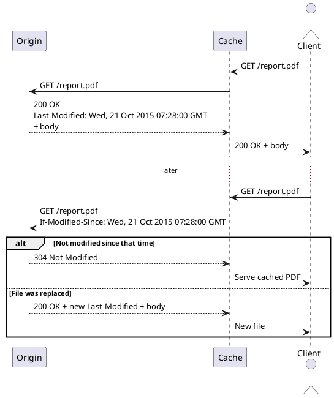

### 4) `Expires`
**Set on:** response from origin (`Expires: <HTTP-date>`). **Used by:** caches as an **absolute** expiration time on the clock (HTTP/1.0 style).

**Accomplishes:** same general idea as freshness deadline, but expressed as a **fixed date** instead of “seconds from now.” If both `Cache-Control` with `max-age` / `s-maxage` and `Expires` are present, modern caches prefer **`Cache-Control`** for freshness; keep `Expires` aligned or omit it to avoid confusion.

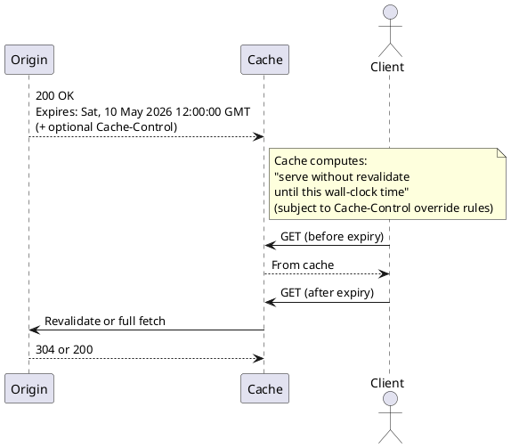

### 5) `Vary`
Controls cache key variance by request headers (for example `Vary: Accept-Encoding`).

Normally a cache (browser or CDN) picks one cached copy per URL (plus maybe query string, depending on rules).

`Vary` tells the cache: “the correct response depends on these request headers, so keep separate cache entries for different values of those headers.”

Example: `Vary: Accept-Encoding`
One client sends `Accept-Encoding: gzip` → cache stores `gzip` response.
Another sends `Accept-Encoding: br` → cache stores `brotli` response.
Same path, two cached objects — correct, because the body encoding differs.
Without Vary, a cache might wrongly serve gzip bytes to a client that asked for brotli.

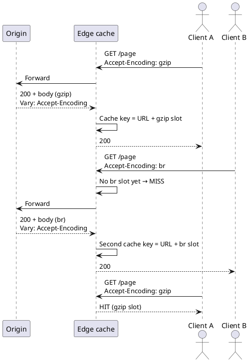

### 6) `Cache-Tag` (Cloudflare purge-by-tag workflows)
**Set on:** response from origin (Cloudflare documents **`Cache-Tag`** on the response; your origin or Workers attach comma-separated tags). **Stored with:** the edge cache entry as **purge metadata**, not something the browser relies on for day-to-day lookups.

**Used when:** you publish related assets (many URLs) and want **one API call** to drop all of them after a CMS or deploy event—without listing every URL.

Attach logical tags (for example `post:123`, `tenant:acme`) so you can purge related objects instantly by tag using Cloudflare API.
This is one of the fastest and cleanest invalidation patterns for grouped content updates.

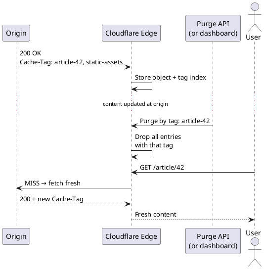

### 7) `CF-Cache-Status` (response diagnostic header)
**Set on:** added by **Cloudflare** on the **response to the client** (not something you send from origin). **Used by:** you, when debugging—read the header in DevTools or logs.

Returned by Cloudflare to show cache result (`HIT`, `MISS`, `EXPIRED`, `REVALIDATED`, etc.).
This is observability, not a control header, but essential for debugging.

```plantuml
@startuml
actor User
participant "Cloudflare Edge" as Edge
participant Origin

User -> Edge: GET /asset

alt Object fresh at edge
  Edge --> User: 200\nCF-Cache-Status: HIT
else Not in edge cache
  Edge -> Origin: GET
  Origin --> Edge: 200
  Edge --> User: 200\nCF-Cache-Status: MISS
else Stale; revalidated
  Edge -> Origin: Conditional request
  Origin --> Edge: 304 or 200
  Edge --> User: 200\nCF-Cache-Status: REVALIDATED\n(or EXPIRED then updated)
end
@enduml
```

## Fast invalidation patterns when content changes
Cloudflare supports multiple invalidation strategies, each with different blast radius and speed.

1. **Content-hash versioning (best for static assets)**
   - Example: `/app.9f31c2.js` instead of `/app.js`
   - New deploy produces new filename; no hard purge required.
   - Old files can stay cached safely, and HTML points to new files.

2. **Purge by URL**
   - Remove specific object(s), e.g. `/images/banner.jpg`
   - Good for targeted fixes.

3. **Purge by tag**
   - Purge all objects sharing `Cache-Tag` values.
   - Best for CMS-like updates affecting many pages/assets.

4. **Purge by prefix/host (if configured/available)**
   - Useful for section-wide updates, but broader blast radius.

5. **Purge everything**
   - Last resort only; causes temporary origin load spikes and lower hit ratio.

## Update and invalidation flow
```plantuml
@startuml
actor "Deploy/CMS" as Deploy
participant "Origin App" as Origin
participant "Cloudflare API" as CFAPI
participant "Cloudflare Edge" as Edge
actor User

Deploy -> Origin: Publish new content
alt Hashed static files
  Origin -> Origin: Generate new file names (app.abc123.js)
  note right: No purge needed for immutable assets
else Same URL content updated
  Deploy -> CFAPI: Purge by URL/Tag
  CFAPI -> Edge: Invalidate matching cached objects
end

User -> Edge: GET updated resource
Edge -> Origin: Re-fetch on MISS or revalidation
Origin --> Edge: Fresh response with validators
Edge --> User: Fresh content (CF-Cache-Status: MISS/REVALIDATED)
@enduml
```

## Practical header recipes
### A) Immutable build assets (JS/CSS/images with hashed filenames)
Use:
`Cache-Control: public, max-age=31536000, immutable`

Why: very high hit ratio and zero ambiguity; updates happen via new filenames.

### B) Frequently updated HTML
Use:
`Cache-Control: public, max-age=0, s-maxage=60, stale-while-revalidate=30`
plus `ETag` or `Last-Modified`.

Why: CDN can serve briefly cached HTML, quickly revalidate, and refresh fast after updates.

### C) API JSON that changes often
Use shorter shared TTLs:
`Cache-Control: public, max-age=0, s-maxage=30, stale-while-revalidate=15`
with validators and optional purge-by-tag for immediate updates.

## Common mistakes to avoid
1. Long TTL on non-versioned files (users see stale content after deploy).
2. Missing validators (`ETag`/`Last-Modified`) causing expensive full responses.
3. Overusing `Vary` and fragmenting cache keys.
4. Using `no-store` everywhere and losing CDN benefits.
5. Frequent "purge everything" operations causing origin traffic spikes.

## Recommended strategy
For most systems:
1. Version all static assets with content hashes.
2. Use `Cache-Control` + validators correctly.
3. Use `Cache-Tag` for grouped invalidation.
4. Keep purges targeted (URL/tag), avoid global purge.
5. Monitor `CF-Cache-Status`, hit ratio, and origin offload continuously.
