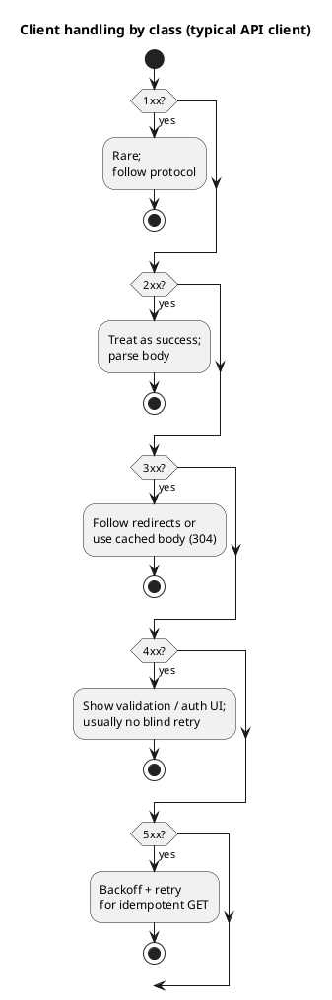
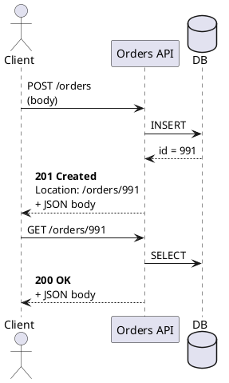
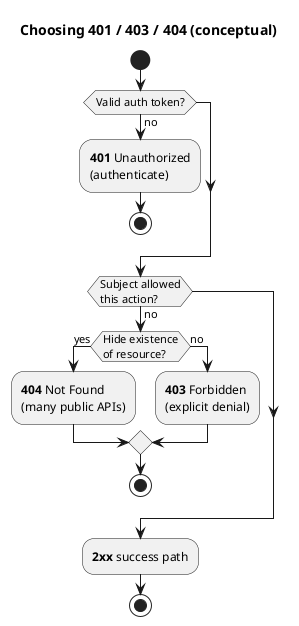
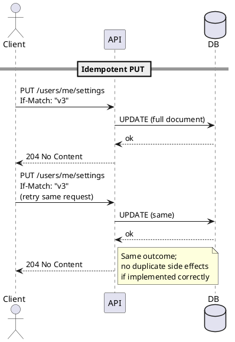
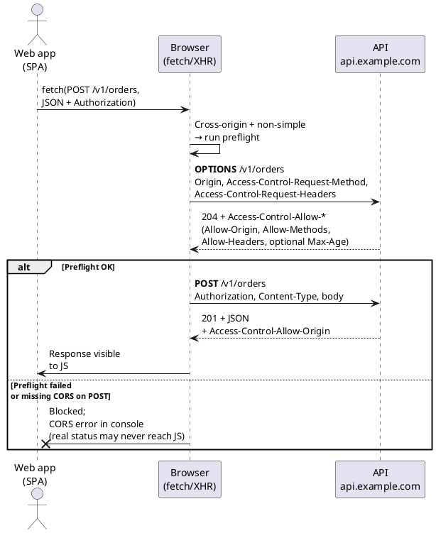
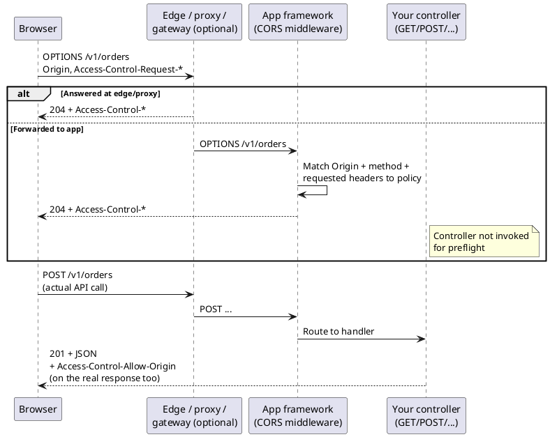

# HTTP (Hypertext Transfer Protocol) response status codes

Status codes tell the **client what happened** and drive **retries**, **caching**, and **UI** (User Interface) behavior. For machine clients (mobile apps, microservices), prefer **stable semantics** over clever overloads: if two outcomes need different handling, use different codes (or distinct problem types in the body).

> **Abbreviations:** **HTTP**, **JSON** (JavaScript Object Notation), **REST** (Representational State Transfer), **API** (Application Programming Interface), **RFC** (Request for Comments), **CORS** (Cross-Origin Resource Sharing), **ETag** (entity tag), **RBAC** (Role-Based Access Control), **UI**, **SPA** (Single-Page Application), **TLS** (Transport Layer Security), **OAuth** (Open Authorization), **CDN** (Content Delivery Network), **S3** (Amazon Simple Storage Service), **SEO** (Search Engine Optimization).

The first digit is the **class** ([RFC 9110](https://www.rfc-editor.org/rfc/rfc9110)):

| Class | Range | Meaning (for APIs) |
| --- | --- | --- |
| **Informational** | `1xx` | Protocol housekeeping; rare in typical **JSON** **REST** over **HTTP/1.1** or **HTTP/2**. |
| **Success** | `2xx` | Request understood and accepted; response body semantics depend on the code. |
| **Redirection** | `3xx` | Resource lives elsewhere or **not modified**; clients must follow rules for method/body. |
| **Client error** | `4xx` | Fix the **request**, auth, or permissions; usually **do not** retry the same payload blindly. |
| **Server error** | `5xx` | Origin failed; **safe** retries with backoff may be appropriate for idempotent reads. |



---

## Informational (`1xx`)

**In practice:** Most JSON APIs never return these to application code; the stack handles them.

| Code | Name | When it appears |
| --- | --- | --- |
| **100** | Continue | Client sent `Expect: 100-continue`; server allows body upload. |
| **101** | Switching Protocols | WebSocket upgrade path (not a “JSON 200” style response). |

**Real-world:** Large file uploads to S3-compatible APIs using `100-continue`; **WebSocket** handshakes returning `101`.

---

## Success (`2xx`)

| Code | Meaning | Use for |
| --- | --- | --- |
| **200** | OK | Default success: **GET** with body, **PUT**/**PATCH** that returns updated resource, **POST** when returning the created/processed entity without needing `201` semantics. |
| **201** | Created | **POST** created a new resource; include **`Location`** when the new URL is stable and meaningful. |
| **202** | Accepted | Work **queued** (async job, webhook fan-out); body often has **job id** + poll URL. |
| **204** | No Content | Success with **no** response body: **DELETE**, or **PUT**/**PATCH** where the client already has the final state. |
| **206** | Partial Content | **Range requests** for large downloads (video, firmware); include `Content-Range`. |

**Avoid**

- **201** without a clear **new** resource (confuses caches and clients that branch on “created”).
- **204** when the client needs the server’s final representation (use **200** + body instead).

**Real-world examples**

- **200**: `GET /users/42` returns profile JSON.
- **201**: `POST /orders` returns order JSON and `Location: /orders/991`.
- **202**: `POST /exports` starts CSV generation; client polls `GET /exports/jobs/7` until **200** with a download URL.
- **204**: `DELETE /sessions/current` — session gone; nothing to return.



---

## Redirection (`3xx`)

Redirects matter for **browsers** and **HATEOAS**; service-to-service clients often **disable auto-follow** or require explicit configuration.

| Code | Typical use | Client note |
| --- | --- | --- |
| **301** | Permanent move (URL changed forever). | Historically **GET**-oriented; changing method caused pain—prefer **308** for “same method forever” when you control clients. |
| **302** | Temporary redirect (found elsewhere). | Some stacks historically turned **POST** into **GET** on follow—do not rely on that for APIs; prefer **303** or **307**. |
| **303** | After **POST**, see other resource (**GET** the `Location`). | Common in HTML forms; useful for **PRG pattern** (Post/Redirect/Get). |
| **304** | **Not Modified** | Conditional **GET** (`If-None-Match` / `If-Modified-Since`); **empty body**; client keeps cached representation. |
| **307** | Temporary redirect; **preserve method**. | Safer default than **302** for APIs when you must redirect **POST**. |
| **308** | Permanent redirect; **preserve method**. | SEO + API versioning moves (`/v1/...` → `/v2/...`) with same verb semantics. |

**Real-world examples**

- **304**: Mobile app `GET /config` with **`ETag`** (entity tag)—server returns no body when unchanged, saving bandwidth.
- **308**: API gateway permanently moves `/legacy/foo` to `/v2/foo` for all methods.

---

## Client error (`4xx`)

The client (or caller) should change something: credentials, URL, body, or timing.

| Code | Meaning | Use for |
| --- | --- | --- |
| **400** | Bad Request | Malformed JSON, wrong types, missing required field **before** domain rules (generic “cannot parse / validate shape”). |
| **401** | Unauthorized | **Not authenticated** (missing/invalid token). |
| **403** | Forbidden | **Authenticated** but **not allowed** (**RBAC**, tenant isolation). |
| **404** | Not Found | No resource at that identifier **or** you intentionally hide existence (**404 vs 403** is a product/security choice). |
| **405** | Method Not Allowed | `GET` on a URL that only allows `POST`; send **`Allow`** header. |
| **409** | Conflict | Version conflict, duplicate unique key, illegal state transition (e.g. cancel shipped order). |
| **412** | Precondition Failed | **`If-Match`** ETag / version precondition failed. |
| **413** | Payload Too Large | Body over limit; client must chunk or use upload URL. |
| **415** | Unsupported Media Type | Wrong `Content-Type` (e.g. XML to a JSON-only endpoint). |
| **422** | Unprocessable Content (RFC 9110) | Shape is valid JSON but **business validation** failed (date in past, unsupported country). |
| **428** | Precondition Required | Server requires conditional headers (optimistic locking policy). |
| **429** | Too Many Requests | Rate limit; include **`Retry-After`** when possible. |
| **451** | Unavailable For Legal Reasons | Geo or compliance block. |

**401 vs 403 (mnemonic)**

- **401** — “**Who** are you?” (authenticate)
- **403** — “I know **who** you are; you still **cannot** do this.” (authorize)

**404 vs 403 (privacy)**

- Public APIs sometimes return **404** for private resources so attackers cannot probe “exists but forbidden.”
- Admin consoles often return **403** for clearer operator UX.

**Real-world examples**

- **409**: Two tabs checkout the last inventory unit; second `POST /checkout` gets **409** with `INSUFFICIENT_STOCK`.
- **422**: `POST /bookings` with valid JSON but `endDate` before `startDate`.
- **429**: API gateway throttles a misconfigured client; exponential backoff respects `Retry-After`.



---

## Server error (`5xx`)

Indicates the **server** failed after accepting a valid request. Clients **may** retry **idempotent** reads; for **POST**, retries need **idempotency keys** or deduplication to avoid duplicates.

| Code | Meaning | Use for |
| --- | --- | --- |
| **500** | Internal Server Error | Unexpected bug, uncaught exception—**log correlation id**; avoid using as generic “any error.” |
| **501** | Not Implemented | Feature not built (prefer **404** or **405** if the route should not exist). |
| **502** | Bad Gateway | Gateway/proxy got invalid response from upstream. |
| **503** | Service Unavailable | Overload, maintenance; use **`Retry-After`** when known. |
| **504** | Gateway Timeout | Upstream too slow; client may retry with backoff. |
| **507** | Insufficient Storage | Rare in HTTP APIs; more common in WebDAV-style systems. |

**Real-world examples**

- **502**: Load balancer cannot reach app pods during a rollout.
- **503**: Database failover in progress; maintenance window.
- **504**: `GET` through API gateway waits for a microservice that hangs.

---

## Error response bodies

For **4xx**/**5xx**, return a **consistent JSON shape** (or [RFC 7807 Problem Details](https://www.rfc-editor.org/rfc/rfc7807)):

- `type` — URI identifying the problem category (stable for clients).
- `title` — short human summary.
- `status` — repeat the HTTP code.
- `detail` — specific explanation (avoid leaking secrets).
- `instance` — optional correlation id or request id.

This complements the status code: the code drives **transport** behavior; the body drives **product** behavior.

---

# HTTP request methods

Methods describe **intent**. **Safe** methods should not change server state; **idempotent** methods should leave the server in the same state if repeated.

| Method | Typical intent | Safe | Idempotent |
| --- | --- | --- | --- |
| **GET** | Read resource(s) | Yes | Yes |
| **HEAD** | Same as GET without body | Yes | Yes |
| **POST** | Create resource, **or** trigger action / RPC | No | **No** (unless designed with idempotency keys) |
| **PUT** | **Replace** entire resource at URL | No | Yes |
| **PATCH** | **Partial** update | No | Not guaranteed (depends on patch semantics) |
| **DELETE** | Remove resource | No | Yes |
| **OPTIONS** | **CORS** (Cross-Origin Resource Sharing) preflight or discovery | Yes | Yes |

**Nuances (API design)**

- **POST** is not only “insert row”: it is also used for **search** (`POST /search` with complex body), **actions** (`POST /orders/9/cancel`), and **OAuth** token endpoints—document whether each POST is **safe to retry**.
- **PUT** vs **POST** for create: **POST** to collection (`/items`) with server-assigned id → **201**; **PUT** to known URL (`/items/client-uuid`) can be **idempotent create-or-replace**.
- **PATCH**: Prefer **JSON Merge Patch** ([RFC 7396](https://www.rfc-editor.org/rfc/rfc7396)) or **JSON Patch** ([RFC 6902](https://www.rfc-editor.org/rfc/rfc6902)) and document conflict behavior (**409** / **412**).



---

# Related concepts

## Preflight requests (**CORS** `OPTIONS`)

A **preflight** is an extra **`OPTIONS`** request the **browser** sends **before** the “real” request, when that real request is **cross-origin** and **not “simple”**. The browser waits for a successful **CORS** response on preflight; only then does it send `GET` / `POST` / `PUT` / … with your **JSON** body and `Authorization` header.

This is **not** your **REST** error model: your **API** may return **200** **JSON** from `OPTIONS`, but browsers primarily care about **`Access-Control-*` response headers**, not the body. If preflight fails, your JavaScript never sees the actual **401**/**422** from the API—the request is **blocked** at the network layer and DevTools shows a **CORS** error.

### Is “preflight” only for CORS?

**In browser / Fetch terminology, yes:** the word **preflight** ([Fetch spec](https://fetch.spec.whatwg.org/#cors-preflight-fetch)) names the **CORS-specific** `OPTIONS` round-trip the user agent performs before certain cross-origin requests. When developers say “the preflight,” they mean that mechanism—not every HTTP `OPTIONS` on the internet.

**Nuances**

| Question | Answer |
| --- | --- |
| Is every **`OPTIONS`** request a CORS preflight? | **No.** `OPTIONS` is a normal method: tools (`curl`), proxies, or WebDAV-style stacks may call it for **discovery** (`Allow: …`) or other behavior without `Origin` / `Access-Control-Request-*`. |
| Does **every** cross-origin browser request use a preflight? | **No.** **Simple** requests (safelisted method + headers + `Content-Type`) skip preflight; the browser still checks **`Access-Control-Allow-Origin`** on the **actual** response. |
| Is preflight only a **browser** thing? | **Yes.** Non-browser clients do not perform CORS preflight. |

So: **preflight ⊂ `OPTIONS`**, and **preflight = CORS preflight** in web API docs. CORS itself is broader (includes responses to simple `GET` without a prior `OPTIONS`).

### Browser-enforced vs “application” (server) role

**Preflight and CORS are browser-enforced** for code running in a normal web context (pages using `fetch`, `XMLHttpRequest`, some Web APIs). The browser decides whether to send the preflight, whether to send the real request after `OPTIONS`, and whether your page’s JavaScript is **allowed to read** the cross-origin response body and headers. That enforcement lives in the **user agent**, not in your Node/Java/Go process as a mandatory gate.

Your **API / gateway “application”** does not enforce CORS on the internet the way a firewall enforces rules. It **opts in** by returning `Access-Control-*` headers so cooperating browsers permit front-end access. **Any client that is not a browser** (curl, Postman, mobile native apps, server-to-server calls, malware) can call your API **without** sending `Origin` or honoring preflight; those requests are unaffected by CORS. Real API security still comes from **authentication, authorization, TLS, rate limits**, and input validation—not from CORS alone.

**Summary**

| Layer | Role |
| --- | --- |
| **Browser** | Enforces preflight + same-origin policy for **web page** scripts; blocks JS from reading disallowed cross-origin responses. |
| **Server** | Publishes **policy** via `Access-Control-*` so allowed origins can use the API from a browser. Does not stop arbitrary non-browser clients. |

### Same-origin vs cross-origin

Browsers apply CORS when the request’s **origin** (scheme + host + port) differs from the resource’s origin—for example:

- Page: `https://app.example.com`
- API: `https://api.example.com` → **cross-origin** (different host)
- Page: `https://app.example.com:3000` vs API `https://app.example.com:443` → **cross-origin** if ports differ

Same host and scheme and port → **same-origin**; typical navigation and `fetch` to your own origin do **not** need CORS preflight for normal cases.

### “Simple” requests (no preflight)

If the request is cross-origin **and** the browser classifies it as **simple**, it is sent **immediately**—no `OPTIONS` first.

Roughly, a simple request is:

| Constraint | Allowed (typical) |
| --- | --- |
| **Method** | `GET`, `HEAD`, or `POST` only |
| **Headers** | Only [CORS-safelisted](https://fetch.spec.whatwg.org/#cors-safelisted-request-header) headers (e.g. `Accept`, `Accept-Language`, `Content-Language`, and `Content-Type` with values below) |
| **`Content-Type`** (for `POST`) | `application/x-www-form-urlencoded`, `multipart/form-data`, or `text/plain` only |

**Examples that stay simple**

- `GET https://api.example.com/public/status` from `https://app.example.com` with no extra headers.
- `POST` form `application/x-www-form-urlencoded` with no custom headers.

**Examples that trigger preflight** (non-simple)

- **`Authorization`** (Bearer token), **`X-Request-Id`**, **`X-CSRF-Token`**, or any custom header not in the safelist.
- **`Content-Type: application/json`** on `POST`/`PATCH` (JSON APIs almost always preflight).
- Methods **`PUT`**, **`PATCH`**, **`DELETE`**, etc.

So: **most SPAs calling a JSON API with a Bearer token preflight on almost every call.**

### What the browser sends on preflight

The browser issues:

```http
OPTIONS /v1/orders HTTP/1.1
Host: api.example.com
Origin: https://app.example.com
Access-Control-Request-Method: POST
Access-Control-Request-Headers: authorization, content-type
```

Meaning: “If I later send **POST** from origin `https://app.example.com` with these headers, is that allowed?”

The server (or API gateway) should respond with **`204` or `200`** and **no required body**, but **must** include CORS headers, for example:

```http
HTTP/1.1 204 No Content
Access-Control-Allow-Origin: https://app.example.com
Access-Control-Allow-Methods: GET, POST, PUT, PATCH, DELETE, OPTIONS
Access-Control-Allow-Headers: Authorization, Content-Type, X-Request-Id
Access-Control-Max-Age: 86400
```

- **`Access-Control-Allow-Origin`**: which page origins may read the response. Cannot be `*` when the browser sends **credentials** (cookies / client certs); must echo a specific origin.
- **`Access-Control-Allow-Methods`**: methods allowed for the actual request.
- **`Access-Control-Allow-Headers`**: which request headers the real call may include (must cover everything listed in `Access-Control-Request-Headers`).
- **`Access-Control-Max-Age`**: how long (seconds) the browser may **cache this preflight result** so it does not repeat `OPTIONS` on every click (see below).

If **`Allow-Origin`** is missing, wrong, or **`Allow-Headers`** omits `authorization`, the preflight **fails** and the real request is never sent.

### After preflight succeeds

The browser then sends the **actual** request (`POST`, body, `Authorization`, etc.). That response also needs **`Access-Control-Allow-Origin`** (and, if credentials are used, **`Access-Control-Allow-Credentials: true`**) or the browser will hide the response body from JavaScript even though the server “succeeded.”



### Preflight cache (`Access-Control-Max-Age`)

Browsers cache a **successful** preflight outcome keyed roughly by **URL + origin + method + requested headers**. While the cache entry is valid (up to `Max-Age`, capped per browser), the browser may **skip** the `OPTIONS` round-trip and send `POST`/`PUT` directly.

- **Higher `Max-Age`** (e.g. 86400): fewer `OPTIONS` calls, faster repeat visits.
- **Zero or omitted**: preflight may repeat often (still subject to browser defaults).

Changing CORS policy on the server does not invalidate clients instantly; operators may need to wait out **`Max-Age`** or test in a fresh profile during CORS migrations.

### How this differs from “normal” `OPTIONS`

Many APIs implement **`OPTIONS`** for discovery (e.g. listing methods on a resource). **CORS preflight** is a **browser-enforced contract**: the request comes from the browser with **`Origin`** and **`Access-Control-Request-*`**; the response must carry **`Access-Control-Allow-*`**. You can satisfy both by returning the same `Allow` header **and** CORS headers on `OPTIONS`.

### How `OPTIONS` is handled on the server

An **`OPTIONS`** request is ordinary HTTP: it hits your **TLS terminator**, then often a **CDN**, **reverse proxy**, **API gateway**, and finally your **application**—unless an earlier layer answers it and stops the chain.

**Typical pattern (preflight)**

1. A layer matches **`OPTIONS`** (globally, per path prefix, or per route).
2. It returns **`204 No Content`** or **`200 OK`** with an **empty or ignored body**.
3. It adds **`Access-Control-*`** headers from **static config** or a small allowlist function (allowed origins, methods, headers, optional `Max-Age`).
4. The request **never** reaches heavy handlers (no DB query for the business operation). That keeps preflight cheap and fast.

**Where it is implemented in real systems**

| Layer | What it does |
| --- | --- |
| **CDN / edge** (Cloudflare, Fastly, CloudFront) | Transform rules or workers respond to `OPTIONS` at the edge so origin never sees them. |
| **Reverse proxy** (nginx, HAProxy, Envoy) | `if ($request_method = OPTIONS) { ... return 204; }` plus `add_header Access-Control-*`. |
| **API gateway** (Kong, AWS API Gateway, Apigee) | Built-in CORS plugin adds headers on `OPTIONS` (and sometimes on real methods). |
| **Application framework** (Express `cors`, Spring `CorsFilter`, ASP.NET CORS, FastAPI `CORSMiddleware`, etc.) | Middleware runs **before** your controller; for allowed origins it short-circuits with `204` + headers. |



**Discovery `OPTIONS`** (optional): the same verb can return **`Allow: GET, POST, HEAD`** (and a body listing capabilities). CORS preflight does not require `Allow`, but adding it is fine. The **browser** still requires **`Access-Control-Allow-*`** for cross-origin use.

**Common mistakes**

- **No route for `OPTIONS`** → proxy returns **404/405** without CORS headers → preflight fails.
- **Requiring `Authorization` on `OPTIONS`** → browser often does **not** send your Bearer token on the preflight; the request fails before the real `POST`. CORS middleware should allow **unauthenticated** `OPTIONS` while still enforcing auth on `POST`/`GET`.
- **Only adding CORS on `OPTIONS`** but forgetting **`Access-Control-Allow-Origin`** on **GET/POST** responses → preflight passes but the real response is still blocked from JS.

### Checklist for API teams

1. **Gateway or app** responds to `OPTIONS` on API routes (or delegates to a CDN/gateway that does).
2. **`Access-Control-Allow-Headers`** includes every header your SPA sends (`Authorization`, `Content-Type`, tracing headers).
3. **`Allow-Methods`** includes `OPTIONS` plus real verbs (`PATCH`, `DELETE`, …).
4. **`Allow-Origin`** matches your front-end origins in non-prod and prod (avoid reflecting arbitrary `Origin` unless you understand the security model).
5. **Credentials**: if cookies cross subdomains, you need `Allow-Credentials: true` and a **specific** `Allow-Origin` (not `*`).

## CORS

**Cross-Origin Resource Sharing** lets `https://app.example.com` call `https://api.example.com`. Misconfigured CORS surfaces as **browser** failures (no response to JS), not always as **4xx** JSON. Configure allowed origins, methods, and headers explicitly; avoid `*` with credentials. See [Preflight requests](#preflight-requests-cors-options) for how the browser validates cross-origin calls before your `POST` runs.

## Webhooks

**Inbound HTTP callbacks** (Stripe, GitHub): your server returns **2xx** quickly and processes async; use **429**/`Retry-After` if overloaded so senders backoff. Verify signatures (HMAC) before trusting body.

## WebSockets

Upgrade from HTTP (`101`); after upgrade, traffic is **frames**, not classic request/response status codes per message—different observability and error model.

## WebRTC

Signaling may use HTTP/JSON, but media is peer-to-peer; status codes apply to the **signaling** HTTP API, not to each media packet.

## Patterns similar to CORS preflight

CORS preflight is one of several **“extra steps before the main payload”** patterns in HTTP stacks. They differ in **who** runs them (browser vs any client) and **what** is being negotiated.

| Pattern | Who drives it | What happens (short) |
| --- | --- | --- |
| **DNS lookup** | Resolver (OS / browser / DoH) | Hostname → IP (cached TTL); must succeed before TCP. |
| **TCP handshake** | Client OS + server | SYN / SYN-ACK / ACK; reliable byte stream before TLS or HTTP. |
| **TLS handshake** | Client + server | Certificates, key agreement, **ALPN** (`h2` vs `http/1.1`) before encrypted HTTP. |
| **HTTP/2 / HTTP/3 setup** | Stack | HTTP/2: `SETTINGS` frames; HTTP/3: QUIC + TLS 1.3 **before** request streams. |
| **`Expect: 100-continue`** | Client (often SDKs) | Client may wait for **`100 Continue`** before uploading a large body (e.g. object storage); extra **application-level** round-trip. |
| **WebSocket upgrade** | Page + browser | HTTP request with `Upgrade: websocket` → **`101 Switching Protocols`**, then **frames** (not REST JSON per hop). |
| **`401` + `WWW-Authenticate`** | Server challenge; client retries | Client may send **another** request with `Authorization` (Basic/Digest); shape is *challenge → retry*, not CORS. |
| **Service Worker `fetch`** | Browser | SW can **short-circuit** the network, synthesize a response, or modify the outgoing request. |
| **HSTS** | Browser policy | Internal **upgrade to HTTPS** (or hard fail) before the visible request URL is hit—another browser-only gate. |

Only **CORS preflight** uses **`OPTIONS`** with **`Origin`** / **`Access-Control-Request-*`** to decide whether **cross-origin JavaScript** may see the response.

---

## End-to-end workflow (browser → origin, composite)

The diagram below is **intentionally complete**: a real call only follows **one path** through it. For example, a **simple** cross-origin `GET` skips **preflight** but still needs **`Access-Control-Allow-Origin`** on the response; a **browser cache hit** can skip DNS/TLS entirely; **`curl`** skips CORS and Service Workers.

```plantuml
@startuml
skinparam defaultTextAlignment center
title End-to-end: from user action to your SPA receiving a response (composite)

start

partition "1. Browser policy (optional)" {
  if (HSTS / mixed-content rules?) then (upgrade or block)
    note right: Browser may force HTTPS\nor block insecure subresources
  endif
  if (Service Worker\nintercepting fetch?) then (yes)
    :SW may respond without network\nor call fetch() onward;
    if (SW satisfied request?) then (yes)
      stop
    endif
  endif
}

partition "2. HTTP cache (same-origin or credentialed rules)" {
  if (GET/HEAD and cache entry\nfresh enough?) then (serve)
    :Return cached representation\nto JS / document;
    if (must-revalidate /\nno-cache / stale?) then (network)
    else (done)
      stop
    endif
  endif
}

partition "3. Name & transport" {
  :DNS: resolve hostname → IP\n(cached or recursive resolver);
  :TCP: three-way handshake;
  :TLS: handshake + cert verify +\nALPN (HTTP/2 vs 1.1);
  if (HTTP/2) then (yes)
    :SETTINGS / WINDOW_UPDATE\n(stream setup);
  endif
}

partition "4. CORS preflight (browser only)" {
  if (Cross-origin fetch\nand non-simple?) then (yes)
    :HTTP OPTIONS\nOrigin + Access-Control-Request-*;
    if (Valid 204/200 +\nAccess-Control-Allow-*?) then (yes)
      :Preflight OK;
    else (no)
      :Preflight failed;\nno real request sent;
      stop
    endif
  endif
}

partition "5. Main HTTP request" {
  if (Expect: 100-continue?) then (yes)
    :Send headers; wait for 100 Continue;
  endif
  :Send method, path, query,\nrequest headers, body;
}

partition "6. Proxies and redirects (0..n hops)" {
  :Receive status + response headers;
  if (HTTP 407\nProxy-Authenticate?) then (yes)
    :Client sends credentials\nto proxy; retry;
  endif
  note right
    Browsers may follow 301/302/303/307/308
    (method and body rules differ);
    new host may repeat DNS and TLS
  end note
  if (Follow redirect\nsame logical fetch?) then (yes)
    :Issue redirected request;\nmerge into same workflow;
  endif
}

partition "7. Application outcome (status class)" {
  if (1xx informational?) then (yes)
    :e.g. 100 Continue;
  elseif (2xx success?) then (yes)
    :Body represents result\n201 Created etc.;
  elseif (3xx already handled?) then (yes)
    :Or not followed by client;
  else (4xx or 5xx)
    :Error semantics\nproblem details in body;
  endif
}

partition "8. Browser exposes response to JS" {
  if (Same-origin OR\nAccess-Control-Allow-Origin\nallows this response?) then (yes)
  else (no)
    :Response not exposed\nto JavaScript (CORS);
    stop
  endif
  if (Set-Cookie present?) then (yes)
    :Update cookie jar\nSameSite Secure rules;
  endif
  if (Cache-Control / ETag /\nLast-Modified?) then (yes)
    :Store or update\nHTTP cache entry;
  endif
  :Deliver status + decoded body\nto fetch or XHR promise;
}

stop

@enduml
```



### How to read this with your other notes

- **Early `stop` in the diagram** means the flow ended there for that request: Service Worker satisfied the fetch from cache, HTTP cache served without network, or CORS blocked (preflight failure or response not exposed to JavaScript).
- **DNS, TCP, TLS** apply to any HTTP user agent, not only browsers.
- **CORS, Service Workers, HSTS** are browser-side gates for normal web pages.
- **CDN** is not its own swimlane; each hop uses the same HTTP semantics between browser and origin.

- **Preflight** is only the **CORS** block (4); it does not replace **TLS** (3) or **DNS** (3).
- **Status codes** (7) describe the **main** response after redirects settle; **401** on the main call is visible to JS only if **CORS** (8) also allows exposing the response.
- **Caching** appears twice: **browser HTTP cache** (2) before the network, and **cache headers** on the response (8); **CDNs** behave similarly but sit **between** browser and origin (not drawn as a separate swimlane here—same HTTP semantics at each hop).

---

## Quick reference card (copy mindset)

| I want to… | Prefer |
| --- | --- |
| Return a list or entity | **200** + body |
| Create with server id | **201** + `Location` + body |
| Queue async work | **202** + job metadata |
| Save bandwidth on unchanged GET | **304** + validators |
| Tell client to log in | **401** |
| Tell client “not allowed” | **403** (or **404** if hiding existence) |
| Validation failed (business rules) | **422** (or **400** with strict generic policy) |
| Version / state conflict | **409** or **412** |
| Rate limit | **429** + `Retry-After` |
| Bug / upstream outage | **5xx** + correlation id in body |
