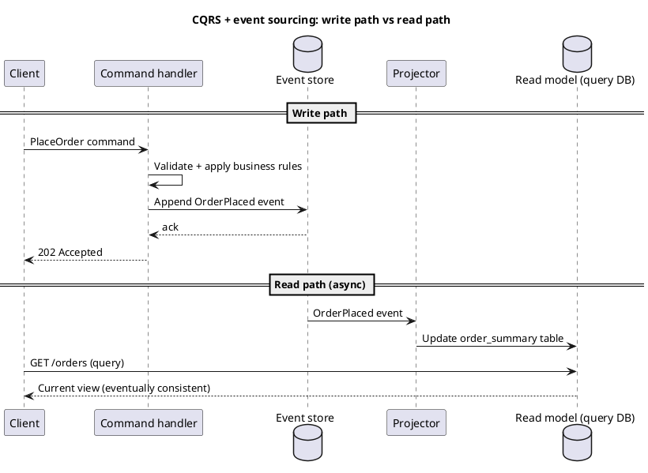

# Architecture styles

This page maps the major **architectural styles** used to structure a backend system: how components are decomposed, how they talk to each other, and how they are deployed and scaled. It is a level above [API Design Concepts](/learnings/api-design-concepts/), which covers how one HTTP interface behaves — this page covers how the *system behind* that interface is shaped. Most real products **combine** several of these styles rather than picking exactly one; the goal here is to know what each style optimizes for, what it costs, and when to reach for it.

> **Abbreviations:** **SOA** (Service-Oriented Architecture), **ESB** (Enterprise Service Bus), **FaaS** (Function as a Service), **CQRS** (Command Query Responsibility Segregation), **BFF** (Backend for Frontend), **N-tier** (multi-tier), **SLA** (Service Level Agreement), **DR** (Disaster Recovery), **IaC** (Infrastructure as Code).

## 1. Monolithic architecture

A **monolith** ships the entire application — UI, business logic, and data access — as **one deployable unit**, usually against **one database**. This is the default starting point for most products: one codebase, one build, one deploy pipeline.

```blockdiag
blockdiag {
  Client -> "Load balancer" -> "Monolith\n(UI + business logic + data access)" -> Database;
}
```

:::success[Advantages]
- **Simple to build and reason about** — one codebase, one language, one set of tests, one deploy.
- **Easy transactions** — a single database means **ACID** transactions across the whole write path, no distributed coordination.
- **Cheap to operate early** — one thing to deploy, monitor, and scale; no service mesh or gateway needed.
:::

:::warn[Disadvantages]
- **Scales as a unit** — a CPU-heavy report endpoint forces you to scale the whole app, not just that path.
- **Deploy risk grows with size** — one bad change can take down everything; release cadence slows as teams collide on the same codebase.
- **Technology lock-in** — hard to adopt a new language or datastore for just one feature.
:::

| Use when | Poor fit when |
| --- | --- |
| New product, small team, unproven domain boundaries | Multiple teams need to ship independently at high frequency |
| Strong consistency across most operations | Different parts of the system have wildly different scaling profiles |
| Low operational budget (no platform team yet) | Regulatory or org requirement to isolate blast radius per domain |

**Avoid**

- Treating "monolith" as an excuse to skip internal module boundaries — a monolith with no internal seams becomes a **big ball of mud**, which is what makes a later split to microservices painful.
- Splitting into microservices *before* you understand your domain boundaries "because monoliths don't scale" — most monoliths fail on **organization**, not load.

---

## 2. Layered (N-tier) architecture

**Layered architecture** organizes code *within* a deployable (monolith or single service) into horizontal layers — typically **presentation**, **business logic**, and **data access** — where each layer only calls the layer below it. This is a **code-organization pattern**, not a deployment topology; it is usually the internal structure of a monolith or of one microservice.

```blockdiag
blockdiag {
  orientation = portrait
  Presentation -> Business -> "Data access" -> Database;
}
```

**Hexagonal / clean architecture** is a variant that inverts the dependency: business logic sits at the center and depends on **ports** (interfaces), while presentation and data access are **adapters** plugged in from the outside — making the business logic testable without a real database or HTTP framework.

:::success[Advantages]
- **Clear separation of concerns** — swap the database or the web framework without rewriting business rules.
- **Testable in isolation** — business logic tested without spinning up HTTP or a real DB.
:::

:::warn[Disadvantages]
- **Layer leakage** — under deadline pressure, teams reach straight from presentation to data access, and the layering becomes decorative.
- **Extra indirection** for genuinely simple **CRUD** (Create, Read, Update, Delete) features — hexagonal ports/adapters can be overkill for a five-endpoint service.
:::

| Use when | Poor fit when |
| --- | --- |
| Business rules are non-trivial and must be unit-tested without infrastructure | The service is a thin pass-through to a database (layering adds no value) |
| You expect to swap a framework, ORM, or datastore later | Team is small and the extra indirection slows delivery more than it helps |

**Avoid**

- Letting the presentation layer import data-access models directly — that's the leak that eventually makes layers pointless.

---

## 3. Microservices architecture

**Microservices** split a system into **independently deployable services**, each owning its **own data** and business capability, communicating over the network (HTTP, gRPC, or async messaging). The unit of scaling, deployment, and team ownership is the **service**, not the app.

```d2
direction: right
client: "Client"
gateway: "API Gateway"
orders: "Orders Service"
inventory: "Inventory Service"
payments: "Payments Service"
ordersdb: "Orders DB"
inventorydb: "Inventory DB"
paymentsdb: "Payments DB"

client -> gateway
gateway -> orders
gateway -> inventory
gateway -> payments
orders -> ordersdb
inventory -> inventorydb
payments -> paymentsdb
```

:::success[Advantages]
- **Independent deploys** — teams ship their service without coordinating a monolith-wide release.
- **Scale per bottleneck** — scale the `payments` service without over-provisioning `inventory`.
- **Technology freedom per service** — a service can use the language/datastore that fits its workload.
:::

:::warn[Disadvantages]
- **Distributed systems tax** — network calls fail, retries and timeouts everywhere, no cross-service transactions (see [sagas](#5-event-driven-architecture) below).
- **Operational overhead** — service discovery, per-service CI/CD, distributed tracing, and a platform team to run all of it.
- **Data consistency is now your problem** — joins across services don't exist; you either duplicate data or accept eventual consistency.
:::

| Use when | Poor fit when |
| --- | --- |
| Multiple teams need independent release cadence | Small team, one deploy pipeline is still fast enough |
| Clear domain boundaries (bounded contexts) already exist | Domain boundaries are still unclear — you'll draw the wrong lines and pay to redraw them |
| Different services have very different scaling/reliability needs | You can't yet operate the platform tax (tracing, gateway, on-call per service) |

**Avoid**

- **Distributed monolith** — services that must deploy together and share a database are microservices in name only, with all the network cost and none of the independence.
- Drawing service boundaries around **technical layers** (a "database service", a "validation service") instead of **business capabilities** — this forces chatty synchronous calls for every use case.
- Synchronous call chains four services deep — one slow downstream service now determines the latency (and availability) of every caller above it.

---

## 4. Service-Oriented Architecture (SOA)

**SOA** predates microservices and shares the goal of decomposing a system into services, but typically centers on a shared **ESB** (Enterprise Service Bus) for routing, transformation, and orchestration between services — often to integrate large, heterogeneous, sometimes legacy systems (mainframes, packaged enterprise software) rather than to let small teams ship independently.

```d2
direction: right
client: "Client / Consumer"
esb: "Enterprise Service Bus (ESB)"
crm: "CRM Service"
billing: "Billing Service"
inventory: "Inventory Service"
legacy: "Legacy Mainframe Adapter"

client -> esb
esb -> crm
esb -> billing
esb -> inventory
esb -> legacy
```

| | **SOA** | **Microservices** |
| --- | --- | --- |
| Integration | Centralized **ESB** does routing/transformation/orchestration | Services talk **directly** (or via lightweight broker); no central orchestrator |
| Sharing | Services often share a **common data model** and infrastructure | Each service owns its **own** data and schema |
| Governance | Centralized, heavyweight, often enterprise-wide | Decentralized; each team governs its own service |
| Typical scale | Enterprise integration across many legacy systems | Product teams shipping independently at web scale |

:::success[Advantages]
- **Good at integrating legacy systems** — the ESB absorbs protocol and format differences (SOAP, flat files, mainframe calls) so consumers see one contract.
- **Centralized policy enforcement** — security, logging, transformation rules live in one place.
:::

:::warn[Disadvantages]
- **The ESB becomes a bottleneck** — both operationally (single point of failure/scaling) and organizationally (one team owns all integration logic, becoming a queue for every other team's change).
- **Heavyweight tooling and governance** slow down iteration compared to microservices' decentralized model.
:::

| Use when | Poor fit when |
| --- | --- |
| Integrating many existing/legacy enterprise systems that can't change | Building a new product where teams should own their own release cycle |
| Centralized governance is a hard requirement (regulated enterprise IT) | You want microservices-style team autonomy — the ESB re-centralizes it |

**Avoid**

- Adopting a heavyweight ESB for a **greenfield** product with no legacy integration burden — you inherit SOA's central bottleneck without needing its legacy-integration benefit.

---

## 5. Event-driven architecture

**Event-driven architecture** decouples components by having producers publish **events** ("`OrderPlaced`", "`PaymentFailed`") to a **broker** (Kafka, SNS/SQS, EventBridge, RabbitMQ) instead of calling consumers directly. Producers don't know who — or how many — consumers exist; consumers subscribe to the events they care about.

```d2
direction: right
orders: "Order Service (producer)"
broker: "Event broker (Kafka / SNS / EventBridge)"
inventory: "Inventory Service (consumer)"
notifications: "Notification Service (consumer)"
analytics: "Analytics Service (consumer)"

orders -> broker: "OrderPlaced event"
broker -> inventory
broker -> notifications
broker -> analytics
```

### Event sourcing and CQRS

Two patterns commonly ride on top of an event-driven backbone:

- **Event sourcing** — instead of storing current state, you store the **sequence of events** that produced it (`OrderPlaced`, `OrderShipped`, `OrderCancelled`); current state is derived by replaying events. Gives a full audit trail and the ability to rebuild any past state.
- **CQRS** (Command Query Responsibility Segregation) — separate the **write model** (accepts commands, appends events) from the **read model** (a denormalized view optimized for queries, kept up to date by projecting events). Often paired with event sourcing, but usable independently.

A one-line description of what this shows: the write path appends an event and returns immediately; the read model catches up asynchronously via a projector.



**Sagas** — when a business process spans multiple services with no shared transaction (e.g. "reserve inventory, charge payment, ship order"), a **saga** coordinates the steps via events and defines **compensating actions** ("release inventory") to undo prior steps if a later one fails, since there is no distributed rollback.

:::success[Advantages]
- **Loose coupling** — producers and consumers don't know about each other; add a new consumer without touching the producer.
- **Natural fit for async workflows** — notifications, analytics pipelines, cache invalidation, and cross-service workflows that don't need an immediate response.
- **Event sourcing gives a full audit log** for free — useful for compliance, debugging, and time-travel debugging.
:::

:::warn[Disadvantages]
- **Eventual consistency** — the read model lags the write model by some delay; UX and support teams must account for "why don't I see my order yet."
- **Harder to trace** — a bug means following an event through a broker and several consumers instead of a single call stack; needs distributed tracing and event schemas from day one.
- **Event sourcing has a real cost** — replay logic, schema evolution for old events, and snapshotting for long event streams are non-trivial to build correctly.
:::

| Use when | Poor fit when |
| --- | --- |
| Multiple services need to react to the same fact (order placed → billing, shipping, analytics) | Caller needs an immediate, strongly consistent answer ("is this seat still available *right now*") |
| Cross-service workflows with no shared database (sagas) | Team has no experience operating a broker, schema registry, or dead-letter queues |
| You need a durable audit trail of everything that happened (event sourcing) | The domain is simple CRUD with no fan-out to other systems |

**Avoid**

- **Choreography with no map** — dozens of services reacting to each other's events with no central documentation becomes impossible to reason about ("where does this field get set?"). Keep an event catalog.
- Using events for calls that need a **synchronous answer** — don't publish an event and poll for a reply when a direct request/response call is simpler and clearer.
- Skipping **schema versioning** on events — a producer changing an event's shape silently breaks every consumer that assumed the old shape.

:::note
The API-contract slice of this style — how you *expose* webhooks and async APIs to clients — belongs in [API Design Concepts](/learnings/api-design-concepts/#hmac-hash-based-message-authentication-code--request-signing-webhooks-and-vendor-apis). This page is about the internal system shape; that page is about the wire format.
:::

---

## 6. Serverless / Function-as-a-Service (FaaS)

**Serverless** runs your code as short-lived **functions** (AWS Lambda, Azure Functions, Cloud Functions) triggered by events — an HTTP request, a queue message, a file upload, a schedule — with the cloud provider managing servers, scaling, and patching entirely. You pay per invocation/duration, not for idle capacity.

```d2
direction: right
client: "Client"
apigw: "API Gateway"
authfn: "Auth Function (Lambda)"
orderfn: "Create Order Function (Lambda)"
db: "Managed DB (DynamoDB / Aurora Serverless)"
queue: "Managed Queue (SQS / EventBridge)"
notifyfn: "Notify Function (Lambda)"

client -> apigw
apigw -> authfn
apigw -> orderfn
orderfn -> db
orderfn -> queue
queue -> notifyfn
```

:::success[Advantages]
- **No server management** — no patching, no capacity planning, no idle-fleet cost; scales to zero when unused.
- **Pay per use** — cheap for spiky or low-traffic workloads compared to always-on instances.
- **Fast to wire event-driven glue** — a function triggered by a queue message or an S3 upload is a few lines of config, not a new deployable service to run.
:::

:::warn[Disadvantages]
- **Cold starts** — a function with no recent traffic can add hundreds of milliseconds to a few seconds of latency on first invocation.
- **Execution time and resource limits** — most FaaS platforms cap run duration and memory; long-running or stateful workloads don't fit.
- **Vendor lock-in** — triggers, IAM, and deployment are tightly coupled to one cloud provider's specifics.
- **Harder local dev/debugging** — simulating the full event/trigger graph locally is harder than running a normal server.
:::

| Use when | Poor fit when |
| --- | --- |
| Spiky, unpredictable, or low-volume traffic where idle server cost is wasteful | Sustained high-throughput traffic where always-on instances are cheaper per request |
| Event-driven glue code (resize an image on upload, process a queue message) | Long-running processes (video encoding, long WebSocket sessions, big batch jobs) |
| Small team wants zero infra to operate | Latency-sensitive path that cannot tolerate cold starts |

**Avoid**

- Building a **monolith made of tightly-coupled functions** that all deploy together and share a database — this is a distributed monolith with the operational quirks of serverless and none of the independence.
- Chaining many functions synchronously (function A calls function B calls function C) — cold starts and cost compound; prefer async triggers or move that logic into one function/service.

---

## 7. Other notable styles

Briefly, for completeness — these show up less often but are worth recognizing by name:

| Style | What it is | Typical use |
| --- | --- | --- |
| **Micro-kernel (plug-in) architecture** | A minimal **core system** plus independently loadable **plug-ins** that extend it | IDEs, browsers with extensions, CMS platforms (WordPress plugins) |
| **Cell-based / space-based architecture** | The system is replicated into independent **cells**, each self-contained (app + cache + data), sized to a fixed capacity, to bound blast radius and remove shared bottlenecks | High-scale systems needing predictable scaling and strong failure isolation (e.g. large e-commerce during peak load) |
| **Micro-frontends** | The **microservices** idea applied to the UI layer — independently built/deployed frontend fragments composed into one page | Large web apps with many independent frontend teams |
| **Peer-to-peer (P2P)** | No central server; nodes act as both client and server, communicating directly | File sharing, some blockchain and messaging systems |

---

## Choosing an architecture style

| Style | Deployment unit | Coupling | Scales by | Main risk |
| --- | --- | --- | --- | --- |
| **Monolith** | Whole app | Tight (in-process) | Scaling the whole app | Blast radius, deploy risk at scale |
| **Layered / hexagonal** | (Internal structure, not a topology) | Tight within the unit, layered | N/A — inherits its host's | Layer leakage over time |
| **Microservices** | Per service | Loose (network) | Per service | Distributed systems complexity |
| **SOA** | Per service, via ESB | Loose, but centralized via ESB | Per service (ESB can bottleneck) | Central ESB becomes a bottleneck |
| **Event-driven** | Per producer/consumer | Very loose (async) | Per consumer | Eventual consistency, hard to trace |
| **Serverless** | Per function | Very loose (event-triggered) | Automatic, per invocation | Cold starts, vendor lock-in, limits |

**Quick decision hints**

- **Small team, unproven domain?** → Start with a **monolith**, structured in clear **layers** (or hexagonal) internally, so a future split is a refactor, not a rewrite.
- **Multiple teams, clear domain boundaries, need independent releases?** → **Microservices**.
- **Integrating legacy/enterprise systems you don't own?** → **SOA** with an ESB, or a modern **API gateway** doing the same job with less ceremony.
- **Many things need to react to the same fact, or you need a cross-service workflow with no shared transaction?** → **Event-driven** (with sagas for the workflow, CQRS/event sourcing if you need an audit trail or fast reads).
- **Spiky or low traffic, glue code, no appetite to run servers?** → **Serverless**.
- **Real systems are hybrids** — a common production shape is: a few **microservices**, each internally **layered**, communicating mostly over **events**, with **serverless functions** for glue (image resize, scheduled jobs, webhook receivers) and an **API gateway** in front of all of it.

---

[← API Design Concepts](/learnings/api-design-concepts/)
