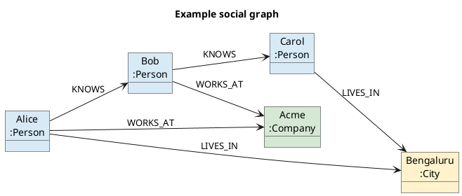
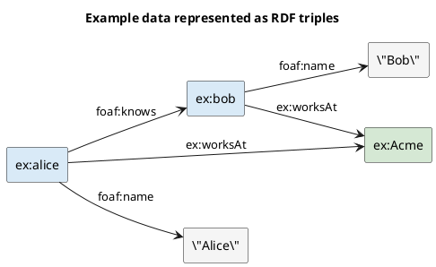

These notes compare common data models, explain where each one fits, and introduce declarative queries, MapReduce, property graphs, and triple stores.

## Relational and document models

### Relational model

In the **relational model**, data is organized into **relations**, called tables in SQL. Each relation is an unordered collection of **tuples**, called rows in SQL.

Relations work well when data has a regular structure and relationships can be represented using foreign keys and joins.

### Why NoSQL databases became popular

Different applications have different requirements. Common reasons for using a non-relational database include:

- A need for greater scalability, very large datasets, or high write throughput.
- Specialized query operations that are not well supported by the relational model.
- A need for a more flexible or expressive data model.

:::note
**NoSQL** does not mean that relational databases cannot scale. The correct choice depends on the data shape, access patterns, consistency needs, and operational requirements.
:::

### Object-relational mismatch

Object-oriented application code usually represents data as objects. These objects often map naturally to JSON documents, but not always to tables, rows, and columns.

This difference creates an **object-relational mismatch**: the application needs a translation layer between its objects and the relational database. Object-relational mapping tools such as **Active Record** and **Hibernate** reduce the boilerplate required for this translation.

### Document model

A self-contained structure such as a résumé can fit naturally in one JSON document. Document databases such as **MongoDB** and **CouchDB** support this model.

In a relational database, the same résumé may be normalized into separate tables for the person, positions, education, and contact details. Those tables are then connected using foreign keys.

```diagramsnet
<mxfile>
  <diagram id="data-model-shapes" name="Relational and document shapes">
    <mxGraphModel dx="1000" dy="600" grid="1" gridSize="10" guides="1" tooltips="1" connect="1" arrows="1" fold="1" page="1" pageScale="1" pageWidth="827" pageHeight="1169" math="0" shadow="0">
      <root>
        <mxCell id="0" />
        <mxCell id="1" parent="0" />
        <mxCell id="2" value="Relational model" style="rounded=1;whiteSpace=wrap;html=1;fillColor=#dae8fc;strokeColor=#6c8ebf;fontStyle=1;" vertex="1" parent="1"><mxGeometry x="70" y="40" width="220" height="50" as="geometry" /></mxCell>
        <mxCell id="3" value="Person table" style="rounded=1;whiteSpace=wrap;html=1;fillColor=#dae8fc;strokeColor=#6c8ebf;" vertex="1" parent="1"><mxGeometry x="120" y="135" width="120" height="50" as="geometry" /></mxCell>
        <mxCell id="4" value="Education table" style="rounded=1;whiteSpace=wrap;html=1;fillColor=#dae8fc;strokeColor=#6c8ebf;" vertex="1" parent="1"><mxGeometry x="30" y="245" width="130" height="50" as="geometry" /></mxCell>
        <mxCell id="5" value="Positions table" style="rounded=1;whiteSpace=wrap;html=1;fillColor=#dae8fc;strokeColor=#6c8ebf;" vertex="1" parent="1"><mxGeometry x="200" y="245" width="130" height="50" as="geometry" /></mxCell>
        <mxCell id="6" value="Document model" style="rounded=1;whiteSpace=wrap;html=1;fillColor=#d5e8d4;strokeColor=#82b366;fontStyle=1;" vertex="1" parent="1"><mxGeometry x="500" y="40" width="220" height="50" as="geometry" /></mxCell>
        <mxCell id="7" value="Résumé document&#xa;person&#xa;education [ ]&#xa;positions [ ]" style="rounded=1;whiteSpace=wrap;html=1;fillColor=#d5e8d4;strokeColor=#82b366;align=left;spacingLeft=20;" vertex="1" parent="1"><mxGeometry x="520" y="135" width="180" height="160" as="geometry" /></mxCell>
        <mxCell id="8" value="foreign key" style="endArrow=classic;html=1;" edge="1" parent="1" source="3" target="4"><mxGeometry relative="1" as="geometry" /></mxCell>
        <mxCell id="9" value="foreign key" style="endArrow=classic;html=1;" edge="1" parent="1" source="3" target="5"><mxGeometry relative="1" as="geometry" /></mxCell>
        <mxCell id="10" value="embedded" style="endArrow=classic;html=1;" edge="1" parent="1" source="6" target="7"><mxGeometry relative="1" as="geometry" /></mxCell>
      </root>
    </mxGraphModel>
  </diagram>
</mxfile>
```

The document model has good **data locality** for one-to-many tree structures because related information can be stored together. Relational databases are usually a better fit when many-to-one and many-to-many relationships are common and joins are important.

## Choosing between document and relational models

### Relationships and joins

Consider relationships such as many people living in one region or working in one industry. In a relational model, records can refer to a shared row using a foreign key, and a join retrieves the related data.

Document databases are optimized for self-contained documents, so join support may be limited or implemented differently. If the database cannot perform the required join, application code may need multiple queries, which adds complexity.

:::note
Modern document databases differ in their support for joins and references. Check the database and version instead of assuming that all document databases behave the same way.
:::

### Application-code complexity

The best model is often the one that makes the application code simpler:

- A document-shaped application can read one document without joining several tables.
- A highly connected application benefits from foreign keys and database joins.
- Emulating joins with several application requests can add latency and consistency problems.
- Other concerns—such as fault tolerance, concurrency, and consistency—also affect the choice.

### Schema-on-read vs. schema-on-write

Document databases are often called **schemaless**, but this can be misleading. The data still has a structure; the database simply may not enforce it.

| Approach | Meaning | Similar idea |
| --- | --- | --- |
| **Schema-on-read** | Application code interprets and validates the structure when reading data. | Dynamic runtime checking |
| **Schema-on-write** | The database checks written data against an explicit schema. | Static type checking |

### Handling schema changes

Suppose an older document contains `name`, while new documents contain `first_name` and `last_name`.

With schema-on-read, old documents can remain unchanged. The application handles both versions when reading:

```js title="Read old and new name formats"
const firstName = user.first_name ?? user.name?.split(" ")[0];
```

With a relational schema, a migration can add the new columns and update existing rows. Future writes then follow the new schema.

Schema-on-read is useful when:

- Records are heterogeneous and do not all have the same structure.
- Data comes from an external system whose format the application does not control.
- A third-party webhook payload must be stored even when its fields evolve.

### Data and storage locality

A document database can store an entire document together, which may improve performance when the application usually reads most of that document.

The same locality can become a disadvantage:

- Reading one small field may still require loading a large document.
- Some storage engines may rewrite a large portion of a document during an update.
- Large documents can make frequently updated data expensive.

### Convergence of the models

The boundary between relational and document databases is becoming less strict:

- PostgreSQL and other relational databases support JSON data.
- Some document databases support references, lookup operations, or client-side joins.

The models remain different, but many databases now borrow useful features from each other.

## Imperative vs. declarative query languages

### Imperative queries

An **imperative** query describes the operations to perform and the order in which to perform them. For example, code can loop through every animal and add sharks to a result list.

### Declarative queries

A **declarative** query describes the required result and its conditions, but not the exact steps used to produce it.

```sql title="Declarative SQL query"
SELECT name
FROM animals
WHERE family = 'shark';
```

The database is free to choose indexes, join orders, and other execution details. This gives the query optimizer more opportunities to improve performance.

Declarative languages also appear outside databases. **CSS selectors** and **XPath** specify which HTML elements to select, while imperative JavaScript can loop through DOM elements to find the same result.

## MapReduce query model

**MapReduce** is a programming model for processing large amounts of data across multiple machines. Datastores such as MongoDB and CouchDB have provided it as a way to run read-only processing across many documents.

It sits between fully declarative and fully imperative approaches: the developer supplies `map` and `reduce` functions, while the framework decides where, when, and in what order to run them.

```diagramsnet
<mxfile>
  <diagram id="map-reduce-flow" name="MapReduce flow">
    <mxGraphModel dx="1000" dy="500" grid="1" gridSize="10" guides="1" tooltips="1" connect="1" arrows="1" fold="1" page="1" pageScale="1" pageWidth="827" pageHeight="1169" math="0" shadow="0">
      <root>
        <mxCell id="0" />
        <mxCell id="1" parent="0" />
        <mxCell id="2" value="Input records" style="rounded=1;whiteSpace=wrap;html=1;fillColor=#f5f5f5;strokeColor=#666666;" vertex="1" parent="1"><mxGeometry x="30" y="115" width="130" height="60" as="geometry" /></mxCell>
        <mxCell id="3" value="Map&#xa;emit key-value pairs" style="rounded=1;whiteSpace=wrap;html=1;fillColor=#dae8fc;strokeColor=#6c8ebf;" vertex="1" parent="1"><mxGeometry x="210" y="105" width="150" height="80" as="geometry" /></mxCell>
        <mxCell id="4" value="Group by key" style="rounded=1;whiteSpace=wrap;html=1;fillColor=#fff2cc;strokeColor=#d6b656;" vertex="1" parent="1"><mxGeometry x="410" y="115" width="130" height="60" as="geometry" /></mxCell>
        <mxCell id="5" value="Reduce&#xa;combine each group" style="rounded=1;whiteSpace=wrap;html=1;fillColor=#d5e8d4;strokeColor=#82b366;" vertex="1" parent="1"><mxGeometry x="590" y="105" width="150" height="80" as="geometry" /></mxCell>
        <mxCell id="6" style="endArrow=classic;html=1;" edge="1" parent="1" source="2" target="3"><mxGeometry relative="1" as="geometry" /></mxCell>
        <mxCell id="7" style="endArrow=classic;html=1;" edge="1" parent="1" source="3" target="4"><mxGeometry relative="1" as="geometry" /></mxCell>
        <mxCell id="8" style="endArrow=classic;html=1;" edge="1" parent="1" source="4" target="5"><mxGeometry relative="1" as="geometry" /></mxCell>
      </root>
    </mxGraphModel>
  </diagram>
</mxfile>
```

### How map and reduce work

1. The **map** function processes each input and emits a key-value pair.
2. The framework groups all values that have the same key.
3. The **reduce** function combines each group into a smaller result.

Map and reduce functions should be **pure functions**: they use only their input, do not run additional database queries, and have no side effects. This lets the framework run them on any machine, in different orders, and retry them after failures.

### Drawbacks

- MapReduce is a low-level model for distributed execution.
- Coordinating map and reduce functions is often harder than writing one query.
- A declarative query gives the optimizer more freedom to improve execution.

## Graph-like data models

Graph models are useful when many-to-many relationships are common and connections are as important as the data itself. A graph contains:

- **Vertices:** Nodes or entities.
- **Edges:** Relationships between vertices.

Examples include:

- **Social graph:** People are vertices; friendships are edges.
- **Web graph:** Pages are vertices; hyperlinks are edges.
- **Transport network:** Junctions are vertices; roads or railway lines are edges.

Graph algorithms include shortest-path search and PageRank. A graph can also contain different types of vertices and edges. For example, a social application might connect people, locations, events, check-ins, posts, and comments in one graph.

The following sample graph will be used in the queries below. It mixes people, a company, and a city in the same graph:



### Property graphs

A property graph contains:

- A unique identifier and key-value properties for each vertex.
- A unique identifier, tail vertex, head vertex, label, and properties for each edge.

Any vertex can connect to another vertex. Applications can follow incoming and outgoing edges, filter by relationship labels, and extend the graph with new vertex or edge types.

**Cypher**, created for Neo4j, is a declarative query language for property graphs.

#### Example Cypher queries

Create part of the sample graph:

```cypher title="Create vertices and relationships"
CREATE (alice:Person {name: 'Alice'}),
       (bob:Person {name: 'Bob'}),
       (acme:Company {name: 'Acme'}),
       (alice)-[:KNOWS]->(bob),
       (alice)-[:WORKS_AT]->(acme),
       (bob)-[:WORKS_AT]->(acme);
```

Find Alice's direct friends:

```cypher title="Find direct friends"
MATCH (:Person {name: 'Alice'})-[:KNOWS]->(friend:Person)
RETURN friend.name;
```

Find people who work at the same company as Alice:

```cypher title="Find colleagues"
MATCH (:Person {name: 'Alice'})-[:WORKS_AT]->(company)<-[:WORKS_AT]-(colleague)
RETURN colleague.name, company.name;
```

Find the shortest chain of `KNOWS` relationships from Alice to Carol:

```cypher title="Find a shortest path"
MATCH path = shortestPath(
  (:Person {name: 'Alice'})-[:KNOWS*]-(:Person {name: 'Carol'})
)
RETURN path;
```

:::tip
In Cypher, parentheses represent vertices, square brackets represent relationships, and arrows show relationship direction.
:::

### Triple stores

A **triple store** represents information as three-part statements:

> **subject → predicate → object**  
> Jim → likes → bananas

The subject acts like a graph vertex. The object can be:

- A value, where the predicate and object form a property of the subject.
- Another vertex, where the predicate acts as the edge between them.

**SPARQL** is a declarative query language for triple stores that use the RDF data model. SPARQL predates Cypher, although both support graph-style pattern matching.

The same sample facts can be visualized as RDF triples. Literal values such as `"Alice"` describe a subject, while resource objects such as `ex:Acme` connect two subjects:



#### Example SPARQL queries

Find the names of people Alice knows:

```sparql title="Find people Alice knows"
PREFIX ex:   <https://example.com/>
PREFIX foaf: <http://xmlns.com/foaf/0.1/>

SELECT ?friendName
WHERE {
  ex:alice foaf:knows ?friend .
  ?friend foaf:name ?friendName .
}
```

Find all people who work at Acme:

```sparql title="Find Acme employees"
PREFIX ex:   <https://example.com/>
PREFIX foaf: <http://xmlns.com/foaf/0.1/>

SELECT ?personName
WHERE {
  ?person ex:worksAt ex:Acme ;
          foaf:name ?personName .
}
ORDER BY ?personName
```

:::note
Cypher matches property-graph patterns, while SPARQL matches RDF triple patterns. Both examples ask for relationships by describing the shape of the required result.
:::

## Comparing the models

| Model | Best fit | Main trade-off |
| --- | --- | --- |
| **Document** | Mostly self-contained, tree-shaped data | Cross-document relationships can be harder |
| **Relational** | Regular data with joins and constraints | Object-shaped data may need translation and normalization |
| **Graph** | Highly connected data and relationship traversal | Less natural for simple document or tabular workloads |

Document and graph databases often do not enforce one fixed schema, which can help applications adapt to changing requirements. Each model also has its own query approaches, including SQL, aggregation pipelines, Cypher, SPARQL, Datalog, and MapReduce.

No single model fits every problem. Some domains need specialized storage and queries—for example, genome sequence matching or scientific analysis across hundreds of petabytes. At that scale, custom data models may be necessary to keep queries practical and hardware costs under control.
