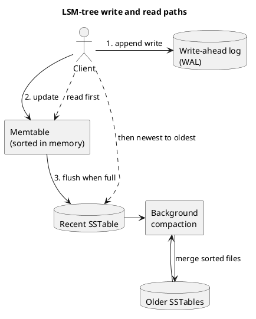
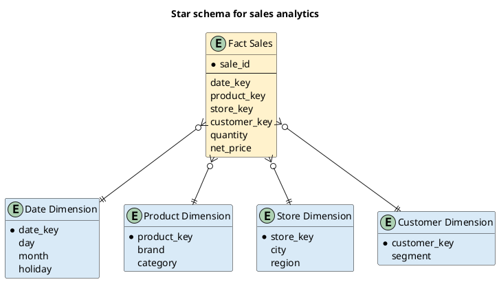

These notes explain how databases store and retrieve data. The goal is not to build a storage engine, but to understand its main trade-offs well enough to choose one for a workload.

## Quick mental model

Storage engines are commonly discussed along two dimensions:

- **Workload:** Transaction processing (**OLTP**) or analytics (**OLAP**).
- **Index structure:** Log-structured storage, such as an **LSM-tree**, or page-oriented storage, such as a **B-tree**.

| Workload or structure | Optimized for |
| --- | --- |
| OLTP | Many small, low-latency reads and writes |
| OLAP | Scans and aggregates over many records |
| LSM-tree | High write throughput and sequential disk writes |
| B-tree | Predictable reads and in-place page updates |

:::tip[Revision path]
Remember the progression: **append-only log → hash index → sorted SSTables → LSM-tree**. B-trees take a different approach based on fixed-size pages.
:::

## Logs and indexes

In this chapter, a **log** means an append-only sequence of records. Appending is fast, but finding a key by scanning the complete log takes $O(n)$ time for $n$ records.

An **index** is an additional data structure derived from the primary data. It helps the database locate records without scanning everything.

- Adding or removing an index changes query performance, not the underlying logical data.
- An index speeds up reads but adds work to every write.
- Databases do not index everything by default because each index consumes storage and must be maintained.

:::note[Core trade-off]
Indexes improve reads, but every additional index usually slows writes.
:::

## Hash indexes

A hash index is useful for key-value data. An in-memory hash map stores each key and the byte offset of its latest value in an append-only file on disk.

```diagramsnet
<mxfile>
  <diagram id="hash-index" name="Hash index lookup">
    <mxGraphModel dx="1000" dy="500" grid="1" gridSize="10" guides="1" tooltips="1" connect="1" arrows="1" fold="1" page="1" pageScale="1" pageWidth="827" pageHeight="1169" math="0" shadow="0">
      <root>
        <mxCell id="0" />
        <mxCell id="1" parent="0" />
        <mxCell id="2" value="Lookup key: user-42" style="rounded=1;whiteSpace=wrap;html=1;fillColor=#f5f5f5;strokeColor=#666666;" vertex="1" parent="1"><mxGeometry x="40" y="115" width="150" height="60" as="geometry" /></mxCell>
        <mxCell id="3" value="In-memory hash map&#xa;user-42 → offset 8192" style="rounded=1;whiteSpace=wrap;html=1;fillColor=#dae8fc;strokeColor=#6c8ebf;" vertex="1" parent="1"><mxGeometry x="250" y="100" width="190" height="90" as="geometry" /></mxCell>
        <mxCell id="4" value="Append-only data file&#xa;read value at offset 8192" style="shape=cylinder3;whiteSpace=wrap;html=1;boundedLbl=1;backgroundOutline=1;size=15;fillColor=#d5e8d4;strokeColor=#82b366;" vertex="1" parent="1"><mxGeometry x="510" y="90" width="190" height="110" as="geometry" /></mxCell>
        <mxCell id="5" value="O(1) average lookup" style="rounded=1;whiteSpace=wrap;html=1;fillColor=#fff2cc;strokeColor=#d6b656;fontStyle=1;" vertex="1" parent="1"><mxGeometry x="285" y="255" width="150" height="55" as="geometry" /></mxCell>
        <mxCell id="6" style="endArrow=classic;html=1;" edge="1" parent="1" source="2" target="3"><mxGeometry relative="1" as="geometry" /></mxCell>
        <mxCell id="7" value="byte offset" style="endArrow=classic;html=1;" edge="1" parent="1" source="3" target="4"><mxGeometry relative="1" as="geometry" /></mxCell>
        <mxCell id="8" style="endArrow=classic;html=1;dashed=1;" edge="1" parent="1" source="3" target="5"><mxGeometry relative="1" as="geometry" /></mxCell>
      </root>
    </mxGraphModel>
  </diagram>
</mxfile>
```

Only keys and offsets need to stay in memory; the larger values remain on disk.

### Segments, compaction, and merging

The active log is closed when it reaches a size limit, becoming an immutable **segment**. New writes go to a new segment.

- **Compaction** discards overwritten values and retains only the latest value for each key.
- **Merging** combines several compacted segments into fewer files.
- To find a key, check segment indexes from newest to oldest.
- Keeping the segment count small limits the number of lookups.

Deletion is represented by appending a **tombstone**. During compaction, the tombstone tells the engine to remove older values for that key.

### Implementation concerns

| Concern | Common approach |
| --- | --- |
| File format | Use a compact binary format rather than CSV |
| Crash recovery | Rebuild the in-memory map, often from an on-disk snapshot |
| Partial record after a crash | Use checksums to detect and ignore corruption |
| Concurrent access | Use one sequential writer; immutable segments allow concurrent readers |
| Deleted record | Append a tombstone and remove old values during compaction |

### Limitations

- The hash table must fit in memory. A very large number of keys becomes expensive.
- On-disk hash maps perform poorly because they require random access and resizing is costly.
- Range queries are inefficient because keys are not kept in sorted order.

## SSTables and LSM-trees

A **Sorted String Table (SSTable)** is a segment whose key-value pairs are sorted by key. Sorting provides three important benefits:

1. Segments can be merged efficiently using an approach similar to merge sort.
2. A **sparse index** can keep only some keys in memory because nearby keys are also nearby on disk.
3. Range queries can scan a continuous sorted region.

### Write and read paths

An **LSM-tree** uses SSTables together with an in-memory sorted structure:



#### Write path

1. Append the write to a **write-ahead log (WAL)** for crash recovery.
2. Add the key to a sorted in-memory structure, called a **memtable**. Balanced trees such as red-black trees or AVL trees can maintain this order.
3. When the memtable reaches a threshold, flush it to disk as an SSTable.
4. Merge and compact SSTables in the background.
5. Remove the old WAL after its memtable has been safely flushed.

#### Read path

1. Check the memtable.
2. Check SSTables from newest to oldest.
3. Use each SSTable's sparse index to narrow the disk search.

A lookup for a missing key would otherwise check every SSTable. A **Bloom filter** avoids many of these reads by answering either:

- **Definitely not present**—skip that SSTable.
- **Possibly present**—check the SSTable because false positives are possible.

### Compaction strategies

- **Size-tiered compaction:** Merge SSTables of a similar size into a larger SSTable.
- **Leveled compaction:** Organize SSTables into levels with limited overlap of key ranges. Data moves to higher levels as it is compacted.

Both strategies reduce duplicate versions and tombstones, but differ in their read, write, and space amplification.

## B-trees

A **B-tree** is a widely used index in relational and non-relational databases. Like an SSTable, it keeps keys sorted, which supports key lookups and range scans.

Unlike an LSM-tree, a B-tree divides storage into fixed-size **pages**—commonly 4 KiB—and reads or writes one page at a time. Pages refer to other pages using disk addresses.

```blockdiag
blockdiag {
  orientation = portrait
  default_node_color = "#dae8fc"
  root [label = "Root page\n1–999"];
  left [label = "Branch page\n1–499"];
  right [label = "Branch page\n500–999"];
  l1 [label = "Leaf\n1–249"];
  l2 [label = "Leaf\n250–499"];
  l3 [label = "Leaf\n500–749"];
  l4 [label = "Leaf\n750–999"];
  root -> left, right;
  left -> l1, l2;
  right -> l3, l4;
}
```

The number of child references in a page is the **branching factor**. A high branching factor keeps the tree shallow.

### Lookup and insertion

To find a key:

1. Start at the root page.
2. Choose the child whose range contains the key.
3. Repeat until reaching the leaf that contains the value or row reference.

To update a key, find its leaf, change the value, and write the page back. To insert into a full page, split it into two pages and update the parent. The tree remains balanced with depth $O(\log N)$ for $N$ keys.

### Reliability and concurrency

A page split changes multiple pages. A crash between those writes could leave the tree inconsistent.

- A **WAL**, also called a redo log, records each change before it is applied to the tree. Recovery replays the log.
- **Latches**—lightweight locks—protect pages while concurrent threads modify the tree.
- Some databases use **copy-on-write**: write modified pages to new locations, then create updated parent pages that point to them.

### Common optimizations

- **Key abbreviation:** Interior pages store only enough key information to separate ranges. Smaller keys increase the branching factor.
- **Sequential leaf layout:** Place nearby leaf pages close together on disk to make range scans faster, although this is difficult to maintain as the tree changes.
- **Linked leaves:** B+ tree variants link leaf pages so a range scan can continue without returning to the root.

## LSM-tree vs. B-tree

| Area | LSM-tree | B-tree |
| --- | --- | --- |
| Write pattern | Mostly sequential writes plus compaction | WAL plus page updates, which may be random |
| Reads | May check the memtable and several SSTables | Usually follows one path from root to leaf |
| Range queries | Efficient because SSTables are sorted | Efficient because leaf keys are sorted |
| Write throughput | Often higher | Often lower for write-heavy workloads |
| Read latency | Can vary during compaction | Usually more predictable |
| Key versions | May exist in several files until compaction | Normally one current location per key |
| Space | Good compression; compaction removes fragmentation | Partially empty pages can waste space |

Benchmarks depend on the workload, dataset, hardware, cache, and engine configuration. Neither structure is always faster.

### Write amplification

**Write amplification** means that one logical database write causes multiple physical disk writes over time.

- B-trees write to the WAL and to tree pages; page splits add more writes.
- LSM-trees write to the WAL and later rewrite data during repeated compaction.
- It matters especially on SSDs because extra writes consume bandwidth and contribute to flash wear.

### LSM-tree advantages

- Sequential SSTable writes can sustain high write throughput.
- Compaction can produce compact files and remove fragmentation.
- Sorted files often compress well.
- The design fits storage devices that internally convert random writes into sequential operations.

### LSM-tree disadvantages

- Compaction competes with reads and writes for disk bandwidth and can cause latency spikes.
- If compaction cannot keep up with incoming writes, unmerged SSTables accumulate and may fill the disk.
- Reads may consult multiple structures and versions of a key.
- B-trees can be simpler for strong transactional isolation because a key normally has one location.

## Other indexing structures

### Primary and secondary indexes

- A **primary index** identifies the main record: a row, document, or graph vertex.
- A **secondary index** provides another way to find records and may contain duplicate keys.

A non-unique secondary key can map to a list of row identifiers, called a **posting list**, or become unique by including the row identifier in the index key. Both B-trees and LSM-trees can support secondary indexes.

### Where the indexed value is stored

An index value can contain the actual row or a pointer to a row stored elsewhere.

- **Heap file:** Stores rows in no particular order. Indexes point to row locations, avoiding a full copy in every secondary index.
- **Clustered index:** Stores the complete row with the index key. In MySQL InnoDB, the primary key is clustered and secondary indexes refer to that primary key.
- **Covering index:** Stores selected extra columns with the index entry so a query can be answered without fetching the complete row.

If a heap row grows and no longer fits in place, the engine can update every index to its new location or leave a forwarding pointer at the old location.

### Multi-column indexes

A **concatenated index** combines fields in a fixed order. An index on `(last_name, first_name)` efficiently finds:

- Everyone with a particular last name.
- A person with a particular last-name and first-name combination.

It generally cannot efficiently find everyone with only a particular first name because `last_name` is the leading column.

### Multi-dimensional and spatial indexes

A normal one-dimensional index cannot directly search latitude and longitude as one rectangular area. Common solutions include:

- Convert the coordinates into one value using a **space-filling curve**, then use a B-tree.
- Use a specialized spatial structure such as an **R-tree**, as supported by PostGIS.

### Full-text and fuzzy indexes

Exact indexes do not naturally handle synonyms, grammatical variations, nearby terms, or misspellings.

Full-text systems such as Lucene maintain a term dictionary and can support fuzzy searches based on **edit distance**. An edit distance of one means one character was inserted, removed, or replaced. Lucene uses compact automata, including Levenshtein automata, to search terms efficiently.

## In-memory databases

An in-memory database keeps its working data structures in RAM. This can support structures that are awkward to maintain on disk, such as Redis sets and priority queues.

### Durability choices

- A cache such as Memcached may accept data loss after restart.
- A durable in-memory database can write changes to a disk log, take snapshots, replicate to other machines, or use persistent-memory hardware.
- Disk files remain useful for backup, inspection, and offline analysis even when live data is kept in memory.

Examples include Redis, SAP HANA, Oracle TimesTen, and SingleStore (formerly MemSQL).

:::note
An in-memory database is not fast only because it avoids disk reads. A disk-backed database may serve reads from the operating-system cache. In-memory engines also avoid converting data into page-oriented on-disk formats for every access.
:::

## Transaction processing and analytics

In this context, **transaction processing** means low-latency application reads and writes. It does not necessarily imply that every operation has full ACID guarantees.

| Characteristic | OLTP | OLAP |
| --- | --- | --- |
| Main users | Application and end users | Business analysts |
| Access pattern | Read or update a few records by key | Scan many records and aggregate |
| Returned data | Individual records | Summaries and statistics |
| Typical priority | Low latency and availability | High scan and aggregation throughput |
| Example | Update a customer's order | Revenue by store for January |

### Data warehouses and ETL

Large analytical queries can scan much of an OLTP database and harm interactive request latency. A **data warehouse** provides a separate, analysis-oriented copy of data from several operational systems.

```d2
direction: right
oltp1: "Orders DB\n(OLTP)"
oltp2: "Payments DB\n(OLTP)"
oltp3: "Customers DB\n(OLTP)"
extract: "Extract"
transform: "Transform\nclean + reshape"
warehouse: "Load into\nData warehouse"
analytics: "Reports and\nOLAP queries"

oltp1 -> extract
oltp2 -> extract
oltp3 -> extract
extract -> transform -> warehouse -> analytics
```

**ETL** means:

1. **Extract** data using periodic dumps or a continuous stream of changes.
2. **Transform** it into an analysis-friendly shape.
3. **Load** it into the warehouse.

Warehouses commonly use SQL and relational schemas, but their storage engines are optimized for analytical rather than transactional access.

## Schemas for analytics

### Star schema

A **star schema**, also called dimensional modeling, places a fact table at the center and surrounds it with dimension tables.



- Each **fact-table** row represents an event, such as a sale, page view, or click.
- Measures such as quantity and price describe the event.
- Foreign keys answer the **who, what, where, and when** by referring to dimensions.
- Dimension tables hold descriptive attributes such as product category or whether a date was a holiday.

A **snowflake schema** normalizes dimensions into additional sub-dimensions. For example, the product dimension may refer to separate brand and category tables. Star schemas are often easier for analysts, while snowflake schemas reduce repeated dimension data.

Fact tables can contain hundreds of columns and extremely large numbers of rows.

## Column-oriented storage

Analytical queries often scan many rows but use only a few columns. A row store reads complete rows, including fields the query does not need. A column store keeps values from each column together, so it reads only the selected columns.

```svgbob
Row-oriented                 Column-oriented

+----+------+-------+        +----+----+----+
| 1  | Tea  |  120  |        | 1  | 2  | 3  |  IDs
+----+------+-------+        +----+----+----+
| 2  | Rice |  250  |        |Tea |Rice|Milk|  Products
+----+------+-------+        +----+----+----+
| 3  | Milk |  180  |        |120 |250 |180 |  Prices
+----+------+-------+        +----+----+----+
 read full rows              read one needed column
```

:::note
The term **column family** in Cassandra or HBase does not mean the same thing as analytical column-oriented storage. Within a column family, those systems generally store a row's selected columns together.
:::

### Compression and vectorized processing

Values in one column usually have the same type and repeat often, making them easier to compress.

- **Bitmap encoding** creates a bitmap for each distinct value, with one bit per row.
- **Run-length encoding** compresses long sequences of repeated bits or values.
- Sorting by a low-cardinality column creates longer runs and improves compression.
- **Vectorized processing** applies one CPU instruction to batches of values, using SIMD and CPU caches efficiently.
- Bitwise `AND` and `OR` can filter compressed bitmaps directly.

### Sort order

Columns cannot be sorted independently because the value at position $k$ in each file must still belong to the same logical row. The engine sorts complete rows using chosen sort keys.

For example, sorting by `(date_key, product_id)` makes a recent date range easy to scan and groups the same product together within a day. Replicas can store the same dataset in different sort orders to support different query patterns.

### Writes to column stores

Compression and sorting make in-place writes difficult. Inserting a row into the middle of sorted column files could require rewriting many files.

A common solution resembles an LSM-tree:

1. Collect writes in an in-memory sorted structure.
2. Write accumulated data to disk in batches.
3. Merge those batches into the column files.

## Materialized views and data cubes

Analytical queries frequently compute `COUNT`, `SUM`, `MIN`, `AVG`, and `MAX`. Recomputing a common aggregate from raw data every time is expensive.

- A **virtual view** stores a query definition and runs the underlying query when used.
- A **materialized view** stores the query result on disk and must be refreshed when source data changes.
- An **OLAP cube** is a materialized grid of aggregates grouped by dimensions such as date, product, store, promotion, and customer.

Data cubes make supported summaries extremely fast because they are precomputed. Their limitation is flexibility: a cube cannot answer a question that was not represented by its dimensions or stored measures.

## Revision checklist

- Why does an index improve reads but slow writes?
- How do segments, compaction, merging, and tombstones work?
- Why do sorted SSTables enable sparse indexes and range scans?
- What roles do the WAL, memtable, SSTables, and Bloom filter play in an LSM-tree?
- How does a B-tree lookup work, and why can page splitting be risky?
- When would an LSM-tree be preferable to a B-tree, and vice versa?
- How do primary, secondary, clustered, and covering indexes differ?
- Why should OLTP and OLAP workloads often be separated?
- Why are column stores effective for analytical queries?
- What is gained and lost by precomputing a materialized view or data cube?
