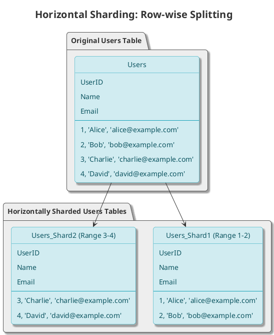
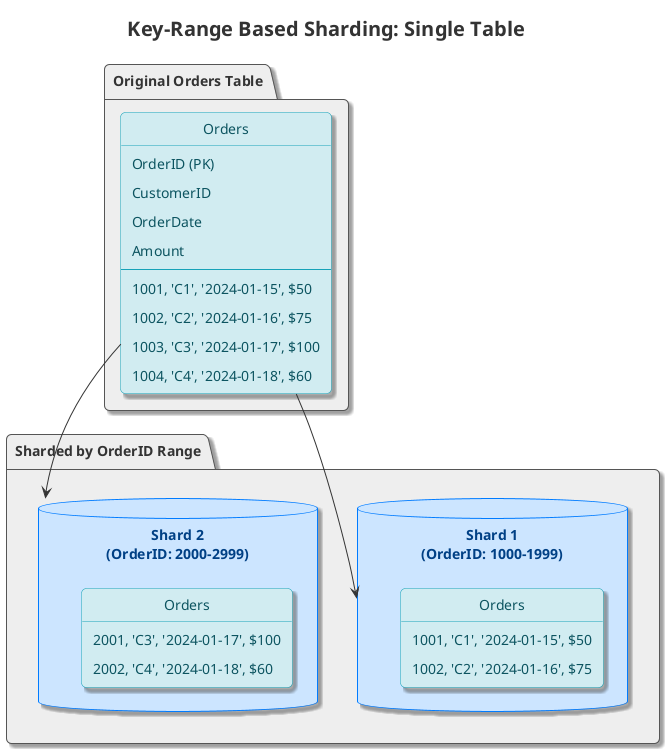
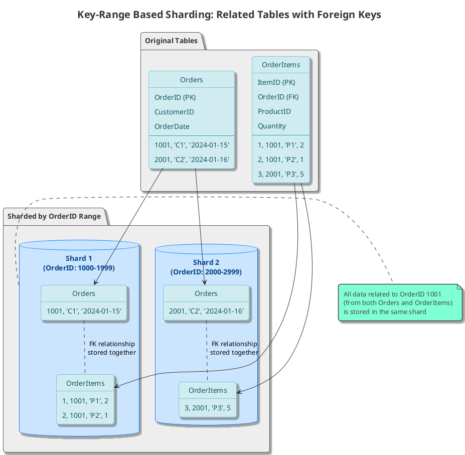
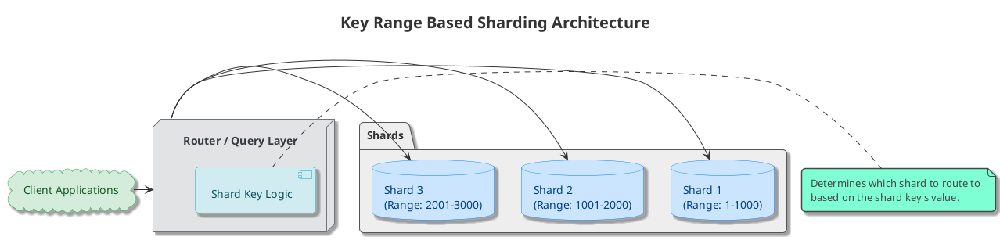
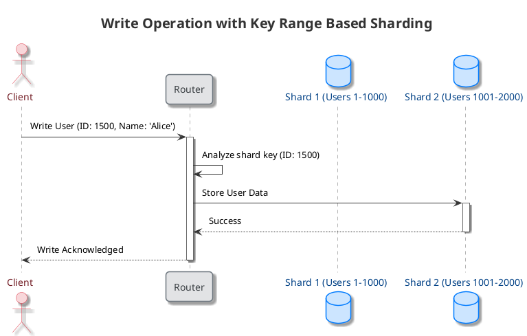
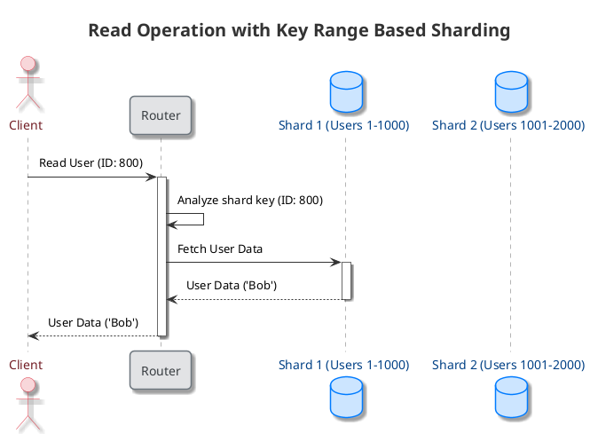
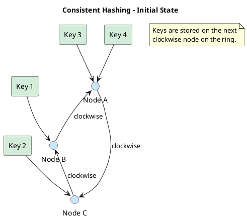
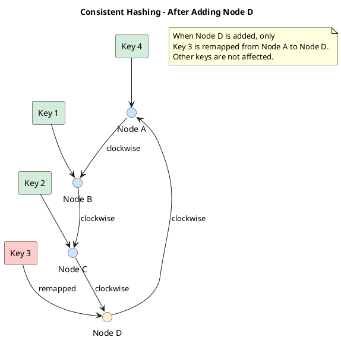

Increasing the data, concurrent read / write traffic to the data puts scalability pressure on databases, which in turn increases the latency and impacts throughput.

At some point a single node isn't enough to handle the load.

The goal is to have all nice properties as range queries, secondary indices, and transactions with the ACID properties while we distribute data over many nodes, it's challenging to provide single-node like properties over a distributed database.

One solution is to use NoSQL database, however the historical codebases are usually built around relational db and migrating from relational is difficult problem. 

Data partitioning enables us to use multiple nodes where each node manages some part of the data.

## Sharding

Sharding is the approach in which we split a large dataset into smaller chunks stored in different nodes across the network.

Goal is to distribute the data in an evenly across nodes so that each nodes will get evenly distributed queries.

It's of two types:
1. Vertical sharding
2. Horizontal sharding

## Vertical sharding

In Vertical sharding we split the table into multiple tables, and place them into multiple individual servers.

Often, if the table itself very large, eg. it contains contains columns with very wide texts or blob *(binary large object)*. In this case such columns could be split into different table.

Eg. Let's say we have an `Employee` table, which contains following columns - `EmployeeID`, `Name`, `Picture`.

We can split `Employee` table into two tables
1. `Employee` table - `EmployeeID`, `Name`
    
2. `EmployeePicture` table - `EmployeeID`, `Picture`

```plantuml
@startuml
!theme vibrant
skinparam backgroundColor #FFFFFF
skinparam shadowing true
skinparam roundcorner 10
skinparam padding 5

skinparam package {
    borderColor #555555
    backgroundColor #EEEEEE
    fontColor #333333
    fontSize 14
}

skinparam database {
    borderColor #007bff
    backgroundColor #cce5ff
    fontColor #004085
}

skinparam cloud {
    borderColor #28a745
    backgroundColor #d4edda
    fontColor #155724
}

skinparam node {
    borderColor #6c757d
    backgroundColor #e2e3e5
    fontColor #383d41
}

skinparam component {
    borderColor #17a2b8
    backgroundColor #d1ecf1
    fontColor #0c5460
}

skinparam actor {
    borderColor #dc3545
    backgroundColor #f8d7da
    fontColor #721c24
}

skinparam object {
    borderColor #17a2b8
    backgroundColor #d1ecf1
    fontColor #0c5460
}

skinparam participant {
    borderColor #6c757d
    backgroundColor #e2e3e5
    fontColor #383d41
}

skinparam arrow {
    color #333333
}

skinparam title {
    fontColor #333333
    fontSize 20
}
left to right direction


package "Original Employee Table" {
    object "Employee" as original_e {
        +EmployeeID
        +Name
        +Picture
    }
}

package "Vertical Sharding" {
    object "Employee" as new_e {
        +EmployeeID
        +Name
    }
    object "EmployeePicture" as ep {
        +EmployeeID
        +Picture
    }
}

original_e --> new_e
original_e --> ep

@enduml
```

:::tip[Advantages]

:::
:::caution[Cons]

:::

## Horizontal sharding
Some tables in databases becomes too big, that it impacts the `read/write` latencies.

Horizontal sharding / partitioning, partitions a table into multiple tables by splitting the data **row-wise**.

For example, a `Users` table can be split into multiple smaller tables (shards), with each shard containing a subset of the users.

It's of two types
1. Key-range based sharding
2. Hash based sharding

### Key-range based sharding

In this case each database node is assigned a range of keys *(partition key)*, and based on these keys the data in a table is split into multiple tables.

sometimes, there multiple tables which are bound by foreign key relationships, in such cases all the data in other tables which is related to the partition key are also stored in same shard.

Here's a visual representation of the architecture:

#### Write Operation

When a client wants to write data, the router first determines the correct shard based on the shard key and then sends the write request to that shard.

#### Read Operation

Similarly, for a read operation, the router identifies the correct shard to fetch the data from.

:::tip[Advantages]
- **Efficient Range Queries**: Since data is sorted by the shard key, queries for a range of keys are very efficient as they can be directed to a minimal number of shards.
:::
:::caution[Disadvantages]
- **Hotspots**: If the shard key is not chosen carefully, it can lead to uneven data distribution and hotspots. For example, if you shard by timestamp, all the new data will go to the last shard, creating a hotspot.
- **Re-sharding**: Re-sharding can be complex and may require significant data movement.
:::

### Hash-based sharding

Here a hash function is used to identify which shard a key *(partition key)* will belong to.

Idea here is to use the hash function to generate a hash value of a key and take the modulo of it with total number of shards to get the shard number.

$$
\text{Shard number} = \text{hash}(\textcolor{#FF9800}{\text{key}}) \textcolor{#4CAF50}{\bmod} \textcolor{#FF9800}{\text{total\_shards}}
$$

## Consistent hashing

Consistent hashing assigns each server hash in an abstract circle, irrespective of number of servers in the table.

To determine which server a key is stored on, we move clockwise from the key's position on the ring and pick the first server we encounter.

The main advantage of consistent hashing is that it minimizes the number of keys that need to be remapped when a server is added or removed.

For example, if we add a new server, `Node D`, only the keys that fall between the new node and the next node clockwise need to be moved.

This reduces the amount of data that needs to be moved between servers, making scaling easier.

## Avoid hash mod n

## Partitioning and secondary indexes

key-value data model partitioning in which the records are retrieved with primary keys. But what if we have to access data with secondary indexes.

Secondary indexes are the records that aren’t identified by primary keys but are just a way of searching for some value.

We can partition with secondary indexes in the following ways.

### Partition secondary indexes by document
