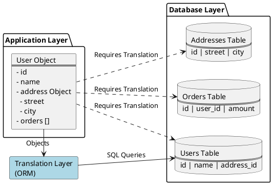
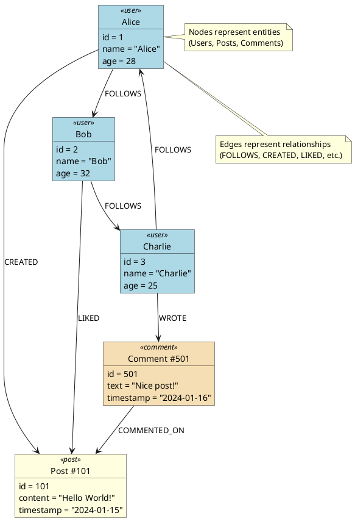
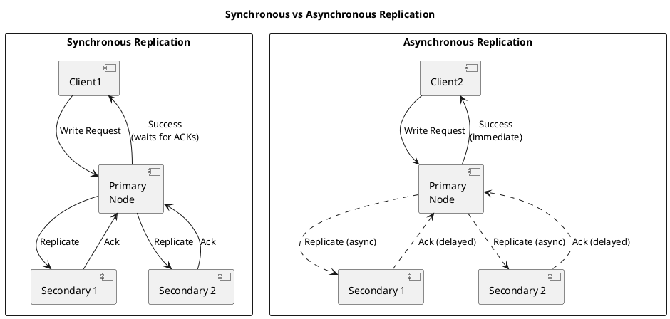

A database is an organized collection of data that can be managed and accessed easily. Databases are created to make it easier to store, retrieve, modify, and delete data in connection with different data-processing procedures.

There are two basic types of databases:

1. SQL (relational databases)
2. NoSQL (non-relational databases)

## Relational databases
Relational databases adhere to particular schemas before storing the data.

This model organizes data into one or more relations (also called tables), with a unique key for each tuple (instance). Each entity of the data consists of instances and attributes, where instances are stored in rows, and the attributes of each instance are stored in columns. Since each tuple has a unique key, a tuple in one table can be linked to a tuple in other tables by storing the primary keys in other tables, generally known as foreign keys.

A Structure Query Language (SQL) is used for manipulating the database. This includes insertion, deletion, and retrieval of data.

Relational databases provide (ACID) properties to maintain the integrity of the database.

**Examples** - MySQL,Oracle Database,Microsoft SQL Server,IBM DB2,Postgres,SQLite

### Pros
- range queries
- secondary indexes
- transactions with the ACID properties

### Drawback
**Impedance mismatch** - there is a difference between how the data is structured in relational model as compared to in-memory data structures (like Objects). 

SQL Operations on structured data is aligned with relational algebra, due to which tables can only take simple values that can't be structure or list. Which is simple to work with in Object in-memory representation, to make these compatible we needed to add one more translation layer.

So, the impedance mismatch requires translation between two representations.

## NoSQL databases
A NoSQL database is designed for a variety of data models to access and manage data. 

### Pros
1. Simple design - Can directly store the objects or lists, this avoids the impedance mismatch.

2. Horizontal scaling - As usually NoSQL databases can run in distributed system of large number of clusters with auto replications and failover. It makes it easy to scale up if the user rises.

3. Availability - Node replacement can be performed without application downtime. Most of the non-relational databases’ variants support data replication.

4. Cost - these are usually open source and freely available as compared to many RDBMS with high licence costs and proprietary hardware requiremnts. 

### Drawbacks of NoSQL databases
1. Lack of standardization - NoSQL doesn’t follow any specific standard, like how relational databases follow relational algebra. Porting applications from one type of NoSQL database to another might be a challenge.

2. Consistency - NoSQL databases provide different products based on the specific trade-offs between consistency and availability when failures can happen. We won’t have strong data integrity, like primary and referential integrities in a relational database. Data might not be strongly consistent but slowly converging using a weak model like eventual consistency.

## Choosing the right database

| Relational Database | Non-relational Database |
|---------------------|-------------------------|
| If the data to be stored is structured | If the data to be stored is unstructured |
| If ACID properties are required | If there's a need to serialize and deserialize data |
| If the size of the data is relatively small and can fit on a node | If the size of the data to be stored is large |

### Key-value database

Key-value databases use key-value methods like hash tables to store data in key-value pairs.

the key serves as a unique or primary key, and the values can be anything ranging from simple scalar values to complex objects.

examples - Amazon DynamoDB, Redis, and Memcached DB

### Document database
A document database is designed to store and retrieve documents in formats like `XML, JSON, BSON`, and so on. 

These documents are composed of a **hierarchical tree data** structure that can include maps, collections, and scalar values. Documents in this type of database may have varying structures and data.

Examples - MongoDB and Google Cloud Firestore.

use case - Document databases are suitable for unstructured catalog data, like JSON files or other complex structured hierarchical data.
For example, 
1. in e-commerce applications, a product has thousands of attributes.
2. it’s also a good option for content management applications, such as blogs and video platforms.

### Graph database
Graph databases use the graph data structure to store data, where 
- nodes represent entities, and 
- edges show relationships between entities. 

Examples - Neo4J, OrientDB, and InfiniteGraph

Use case: Graph databases can be used in social applications and provide interesting facts and figures among different kinds of users and their activities.

### Columnar database
Columnar databases organize data by columns instead of rows. This design makes it much faster and more efficient to retrieve specific fields, especially useful when running analytics or summarizing large datasets. As a result, they are well-suited for systems where data is read frequently but updated less often. 

Examples - Amazon Redshift and Google BigQuery

use case - These databases shine in analytical tasks that involve processing large amounts of data, such as aggregations or trend analysis.

### Wide-column database

Wide-column databases, also called column-family databases, store data in tables with rows and dynamic columns. Unlike traditional relational databases where all rows have the same columns, wide-column databases allow each row to have its own set of columns, which can vary in number and type.

Data is stored in column families, where each column family contains rows with related columns. This structure makes it highly efficient for queries that need to access specific columns across many rows.

Examples - Apache Cassandra, HBase, and Google Bigtable

Use case - Wide-column databases are ideal for handling massive amounts of data with high write and read throughput requirements. They excel in:
1. Time-series data (IoT sensor data, logs, metrics)
2. User profile data where different users may have different attributes
3. Real-time analytics and recommendation engines
4. Applications requiring horizontal scalability across multiple data centers

**Difference from Columnar databases:**
While columnar databases store each column’s data together on disk to accelerate analytical queries and aggregations, wide-column databases, such as Apache Cassandra and HBase which organize data in rows grouped into column families, making them more suitable for write-heavy workloads and flexible, semi-structured data use cases.

| Aspect | Wide-Column Database | Columnar Database |
|--------|---------------------|-------------------|
| **Primary Use** | Transactional workloads (OLTP) with high write throughput | Analytical workloads (OLAP) with complex queries |
| **Schema Flexibility** | Dynamic - each row can have different columns | Fixed schema - all rows have same columns |
| **Data Organization** | Groups columns into column families, stored row-wise within families | Pure column-oriented storage across entire table |
| **Read Pattern** | Optimized for reading specific rows or range of rows | Optimized for reading specific columns across all rows |
| **Write Pattern** | High write throughput, distributed writes | Batch writes, less frequent updates |
| **Scalability** | Horizontal scaling across nodes (distributed) | Vertical scaling or data warehousing clusters |
| **Query Type** | Point lookups, range scans by row key | Aggregations, analytics, complex joins |
| **Examples** | Cassandra, HBase, Bigtable | Redshift, BigQuery, Snowflake |

## Data replication

Replication refers to keeping multiple copies of the data at various nodes (preferably geographically distributed) to achieve availability, scalability, and performance.

:::tip[Advantages]
- Keeps data geographically close to your users, thus reducing access latency.
- Allows the system to continue working even if some of its parts have failed, thus increasing availability.
- Scales out the number of machines that can serve read queries, thus increasing read throughput.
:::

Replication is relatively simple if the replicated data doesn’t require frequent changes. The main problem in replication arises when we have to maintain changes in the replicated data over time.

Additional complexities that could arise due to replication are as follows:

:::caution
- How do we keep multiple copies of data consistent with each other?
- How do we deal with failed replica nodes?
- Should we replicate synchronously or asynchronously?
- How do we deal with replication lag in case of asynchronous replication?
- How do we handle concurrent writes?
- What consistency model needs to be exposed to the end programmers?
:::

### Replication types
1. Synchronous replication - the primary node waits for acknowledgments from secondary nodes to confirm that the data has been updated
2. Asynchronous replication - the primary node doesn’t wait for acknowledgments from the secondary nodes and reports success to the client after updating itself.

Synchronous replication keeps secondary nodes up-to-date with the primary as it's advantage, but if a secondary node fails to acknowledge due to network issues, the primary cannot respond to clients until it receives acknowledgment, causing high latency.

Asynchronous replication allows the primary node to continue operating even if all secondary nodes are down, but if the primary fails, uncopied writes are lost.

## Data replication models
Following algorithms are followed for replicating changes across nodes:
- Single leader or primary-secondary, or master-slave replication
- Multi-leader replication
- Peer-to-peer or leaderless replication

### Single leader/primary-secondary replication
Data is distributed across multiple nodes, and one of the node is selected as primary node and it's responsible to sync it's data with all secondary servers. Primary-secondary replication is appropriate when our workload is read-heavy.

To better scale with increasing readers, we can add more followers and distribute the read load across available followers.

Replication with this approach introduces inconsistency when using asynchronous replication, if in case the primary node fails before the data is synced, the replicas will see inconsistent data.

:::tip
In an automatic approach, when secondary nodes find out that the primary node has failed, they appoint the new primary node by conducting an election known as a leader election.

A leader is typically assigned based on a factor, such as choosing the processor with the highest identifier.
:::

#### Primary-secondary replication methods
- Statement-based replication (SBR)
- Write-ahead log (WAL) shipping
- Logical (row-based) replication

##### Statement-based replication
In this approach when the primary node executes the mysql statement and the same command is then written to a log file. This log file is then sent to secondary nodes for execution.

For any nondeterministic functions like `NOW()` might result in different writes in secondary nodes.

##### Write-ahead log (WAL) shipping
In this technique when a transaction happens it's first recorded into a log file, only then it's operations are executed on the primary database followed by transmitting the changes to secondary databases.
Entry in the transactional log can include details such as the transaction ID, operation type, affected table, and new values.

Example - `“Row #123 changed coins from 100 → 120”`.

And this change is propagated to the replicas.

##### Logical (row-based) replication
changes made to the database are captured at the level of individual rows and then replicated to the secondary nodes.

For example, when `UPDATE` or `INSERT` operations are performed, the entire affected row is captured on the primary node, containing all the column values of that row.

This captured change is then executed on the replicas.
Most flexible and compatible with various schema types.

### Drawbacks of Asynchronous primary-secondary replication
:::caution
- There is a chance that the new master may not receive all the writes from the old master (assuming it is still down). Hence, those write changes will be discarded, which could impact other listening applications and end clients.

- If the user attempts to read the data immediately after writing, the new data may not have been replicated yet. However, to the user, it will look as though the data they submitted was lost.
:::

### Multi leader replication
There are multiple primary nodes which can process writes and send the updates to all other primary nodes and secondary nodes to replicate.

This type of replication is used in databases, along with external tools such as the Tungsten Replicator for MySQL

### Drawback of multi leader

Since all primary nodes concurrently handle write requests, they may modify the same data, potentially creating a conflict between them.

### Handle conflicts

#### Conflict avoidance
A simple stratey handle conflict is to avoid the conflict in the first place. Conflicts can be avoided if the application can verify all the writes to a given record are always routed through same leader.

it's hard to implement correctly, what if the user moves to a different location, then writes won't go to same leader.

#### Last write wins (LWW)
Using their local clock, all nodes assign a timestamp to each update.

When a conflict occurs, the update with the latest timestamp is selected.

It's also difficult coz, clock synchronization is a challenging problemt in distributed systems.

This is used in cassandra db.

### Peer-to-peer/leaderless replication

In primary-secondary replication, we had single point of failure. Also even though we achieved the read scalability, but it failed to provide write scalability.

The peer-to-peer replication model resolves these problems by eliminating the need for a single primary node. All nodes have equal weight and can accept both read and write requests.

## Quorum
Quorum is the minimal number of replicas on which a distributed operation(commit/abort) must be completed before considering an operation as success.

Also Quorum in a distributed system is simply the minimum number of votes by replicas required to perform considering an operation as success (like a Read or a Write).

In a distributed system with multiple copies of data (Replicas), you need a way to agree on the truth without needing every single server to be online perfectly at the same time.

1. The Variables
  - $N$ (Replication Factor): The total number of nodes that hold a copy of your data.3 (e.g., $N=3$ means 3 servers have this data).
  - $W$ (Write Quorum): How many nodes must say "I successfully saved this data"$(ACK)$ for the write to be considered a success.
  - $R$ (Read Quorum): How many nodes you must contact to ask for data before you return a result to the user.

2. The Golden Rule: $R + W > N$

    To guarantee Strong Consistency (meaning you always read the latest data), you must follow this mathematical rule:

    $$R + W > N$$

    *Why does this work?* It guarantees an **overlap**. If you write to enough nodes and read from enough nodes, statistically, at least one node in your "Read group" must have been part of the "Write group."

3. Why not just require "All" nodes?

    You can set $W=N$ *(Write to All)*. This gives you perfect consistency, but it destroys **Availability**.
    If you require $W=3$ *(all 3 nodes must write)*, and one node crashes, your entire database stops accepting writes.

    Quorums allow you to tolerate failure. With $N=3$ and $W=2$, you can lose 1 server and still keep working perfectly.

4. What if reads are not consistent ? The **"Sloppy Quorum"** Trap
    :::note
    A **Sloppy Quorum** is a configuration where the database accepts read/write votes from any healthy nodes in the cluster, even if they are not the "official owners" of that data.

    It is a mechanism designed to prioritize **High Availability** over Consistency. Just for the math R+W > N
    :::
    *The Scenario:* Imagine you have $N$ nodes, with $W = 2$, and selected following 2 nodes in ring : A and B. You try to Write to them, but Node A is down.
    - **Strict Quorum** would say: "Write Failed. I cannot reach 2 nodes."
    - **Sloppy Quorum** says: "*Node A* is down, so I will write to **Node D** (next available node in the ring) just to keep the data safe."

    Sloppy Quorum relies entirely on a feature called **Hinted Handoff**. When a "substitute" node (Node D) accepts a write meant for Node A, it stores the data in a separate folder with a sticky note (a "Hint") that says:

    *"This data belongs to Node A. Please deliver it to them as soon as they come back online."*

    Why the read misses Node D (The Inconsistency) ?

    When you come back 1 second later to READ the data $(R=3)$:
    Your client calculates: "This data belongs to the 1 o'clock range."

    Your client knows the "Home" nodes for 1 o'clock are A, B, and C.
    It sends a Read request to A, B, and C.

    **Node A:** Is down (Timeout).

    **Node B:** Has the new data.

    **Node C:** Might be slow or have old data.

    Crucially: The client does not know to check Node D. Node D is the "neighbor," and the client generally doesn't knock on neighbors' doors for data; it goes to the specific addresses where the data should be.

    :::note
    The Fix (Hinted Handoff)

    The inconsistency is resolved when Node A comes back online.

    Node D notices Node A is alive.

    Node D "hands off" the data to Node A.

    Node A writes it to disk.

    Now, when you read from Node A, B, or C, everyone has the correct data.
    :::

### Quorum reconcilation

When the coordinator polls $R$ nodes and finds they have more than 1 values, how does it fix the stale nodes?

:::tip
A coordinator is a piece of client code / or some server, that performs the selection of nodes to read/write data. The coordinator may employ some strategies if it finds there is mismatch in data.
:::

If the coordinator finds a mismatch (e.g., Node A has v1, Node B has v2), it triggers one of the following strategies to resolve the conflict and propagate the truth.

1. Read repair ("Lazy" fix) - most common
During the read request, system realizes *while reading* that some nodes are out of date and fixes them on the fly

2. Active Anti-Entropy ("Background fix")
Read Repair only fixes data that people are actually reading. But what about "cold" data that hasn't been touched in months?

To fix this, systems use Active Anti-Entropy (AAE) using **Merkle Trees**. The system narrows down exactly which specific row is different and repairs only that row.

3. Conflict Resolution (The "Tie-Breaker")
When the coordinator sees different data from different nodes, it needs a rule to decide which version is the "Truth" before it can repair the others.

    a. **Last-Write-Wins (LWW)** - Physical Time - *most common*
    
      Rule : Whichever piece of data has the highest timestamp is the Truth.
      Risk : If server clocks drift (NTP issues), you might overwrite newer data with older data.
    
    b. **Vector Clocks** - Logical Time
      Used when you cannot trust wall clocks or need to handle concurrent edits.
      :::note
      Mechanism: Data isn't just a value; it's a list of version counters: `[NodeA: 1, NodeB: 2]`.

      Scenario:

      Data X: `[NodeA: 1]`

      Data Y: `[NodeA: 1, NodeB: 1]`

      Logic: Since **Data Y** contains everything in **Data X** plus more, Y is the newer version. The system auto-resolves to Y.

      **Conflict**: If you have `[NodeA: 2]` and `[NodeB: 2]` (siblings), the system cannot decide. It returns both versions to the client application and asks the Application Developer to merge them logicially.
      :::
    
    c. **CRDTs** (Conflict-free Replicated Data Types)
      Mechanism: The data structure itself is designed so that it is mathematically impossible to have a conflict. used in Redis enterprise.
