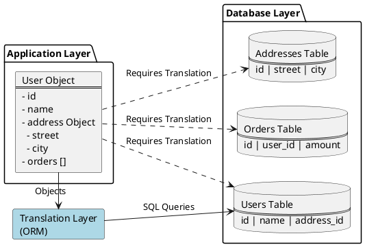
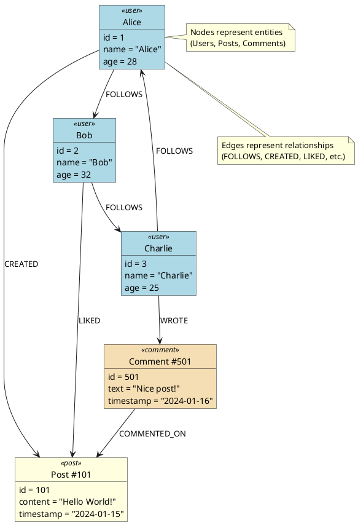

A database is an organized collection of data that can be managed and accessed easily. Databases are created to make it easier to store, retrieve, modify, and delete data in connection with different data-processing procedures.

There are two basic types of databases:

1. SQL (relational databases)
2. NoSQL (non-relational databases)

## Relational databases
Relational databases adhere to particular schemas before storing the data.

This model organizes data into one or more relations (also called tables), with a unique key for each tuple (instance). Each entity of the data consists of instances and attributes, where instances are stored in rows, and the attributes of each instance are stored in columns. Since each tuple has a unique key, a tuple in one table can be linked to a tuple in other tables by storing the primary keys in other tables, generally known as foreign keys.

A Structure Query Language (SQL) is used for manipulating the database. This includes insertion, deletion, and retrieval of data.

Relational databases provide (ACID) properties to maintain the integrity of the database.

**Examples** - MySQL,Oracle Database,Microsoft SQL Server,IBM DB2,Postgres,SQLite

### Drawback
**Impedance mismatch** - there is a difference between how the data is structured in relational model as compared to in-memory data structures (like Objects). 

SQL Operations on structured data is aligned with relational algebra, due to which tables can only take simple values that can't be structure or list. Which is simple to work with in Object in-memory representation, to make these compatible we needed to add one more translation layer.

So, the impedance mismatch requires translation between two representations.

## NoSQL databases
A NoSQL database is designed for a variety of data models to access and manage data. 

### Pros
1. Simple design - Can directly store the objects or lists, this avoids the impedance mismatch.

2. Horizontal scaling - As usually NoSQL databases can run in distributed system of large number of clusters with auto replications and failover. It makes it easy to scale up if the user rises.

3. Availability - Node replacement can be performed without application downtime. Most of the non-relational databases’ variants support data replication.

4. Cost - these are usually open source and freely available as compared to many RDBMS with high licence costs and proprietary hardware requiremnts. 

### Drawbacks of NoSQL databases
1. Lack of standardization - NoSQL doesn’t follow any specific standard, like how relational databases follow relational algebra. Porting applications from one type of NoSQL database to another might be a challenge.

2. Consistency - NoSQL databases provide different products based on the specific trade-offs between consistency and availability when failures can happen. We won’t have strong data integrity, like primary and referential integrities in a relational database. Data might not be strongly consistent but slowly converging using a weak model like eventual consistency.

## Choosing the right database

| Relational Database | Non-relational Database |
|---------------------|-------------------------|
| If the data to be stored is structured | If the data to be stored is unstructured |
| If ACID properties are required | If there's a need to serialize and deserialize data |
| If the size of the data is relatively small and can fit on a node | If the size of the data to be stored is large |

### Key-value database

Key-value databases use key-value methods like hash tables to store data in key-value pairs.

the key serves as a unique or primary key, and the values can be anything ranging from simple scalar values to complex objects.

examples - Amazon DynamoDB, Redis, and Memcached DB

### Document database
A document database is designed to store and retrieve documents in formats like `XML, JSON, BSON`, and so on. 

These documents are composed of a **hierarchical tree data** structure that can include maps, collections, and scalar values. Documents in this type of database may have varying structures and data.

Examples - MongoDB and Google Cloud Firestore.

use case - Document databases are suitable for unstructured catalog data, like JSON files or other complex structured hierarchical data.
For example, 
1. in e-commerce applications, a product has thousands of attributes.
2. it’s also a good option for content management applications, such as blogs and video platforms.

### Graph database
Graph databases use the graph data structure to store data, where 
- nodes represent entities, and 
- edges show relationships between entities. 

Examples - Neo4J, OrientDB, and InfiniteGraph

Use case: Graph databases can be used in social applications and provide interesting facts and figures among different kinds of users and their activities.

### Columnar database
Columnar databases organize data by columns instead of rows. This design makes it much faster and more efficient to retrieve specific fields, especially useful when running analytics or summarizing large datasets. As a result, they are well-suited for systems where data is read frequently but updated less often. 

Examples - Amazon Redshift and Google BigQuery

use case - These databases shine in analytical tasks that involve processing large amounts of data, such as aggregations or trend analysis.

### Wide-column database

Wide-column databases, also called column-family databases, store data in tables with rows and dynamic columns. Unlike traditional relational databases where all rows have the same columns, wide-column databases allow each row to have its own set of columns, which can vary in number and type.

Data is stored in column families, where each column family contains rows with related columns. This structure makes it highly efficient for queries that need to access specific columns across many rows.

Examples - Apache Cassandra, HBase, and Google Bigtable

Use case - Wide-column databases are ideal for handling massive amounts of data with high write and read throughput requirements. They excel in:
1. Time-series data (IoT sensor data, logs, metrics)
2. User profile data where different users may have different attributes
3. Real-time analytics and recommendation engines
4. Applications requiring horizontal scalability across multiple data centers

**Difference from Columnar databases:**
While columnar databases store each column’s data together on disk to accelerate analytical queries and aggregations, wide-column databases, such as Apache Cassandra and HBase which organize data in rows grouped into column families, making them more suitable for write-heavy workloads and flexible, semi-structured data use cases.

| Aspect | Wide-Column Database | Columnar Database |
|--------|---------------------|-------------------|
| **Primary Use** | Transactional workloads (OLTP) with high write throughput | Analytical workloads (OLAP) with complex queries |
| **Schema Flexibility** | Dynamic - each row can have different columns | Fixed schema - all rows have same columns |
| **Data Organization** | Groups columns into column families, stored row-wise within families | Pure column-oriented storage across entire table |
| **Read Pattern** | Optimized for reading specific rows or range of rows | Optimized for reading specific columns across all rows |
| **Write Pattern** | High write throughput, distributed writes | Batch writes, less frequent updates |
| **Scalability** | Horizontal scaling across nodes (distributed) | Vertical scaling or data warehousing clusters |
| **Query Type** | Point lookups, range scans by row key | Aggregations, analytics, complex joins |
| **Examples** | Cassandra, HBase, Bigtable | Redshift, BigQuery, Snowflake |
