## DNS

it's internet phone book, translates human-friendly domain names to IP addresses.
Client find the server via DNS

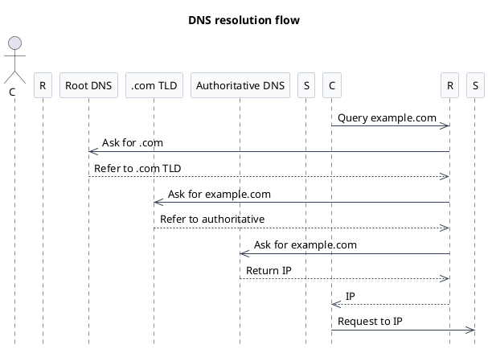

## API
its a contract, set of rules, it defines one piece of software can ask for services from another piece of software.

### Types
types -
REST - treat everything as resources, like userProfile, each resource get unique URL. And it's stateless, meaning each request from client contains all the information server needs to fulfill that request. This helps with it's scalability. it's usually used fro public web APIs.
RPC - it's like calling a function on a remote server, almost as if you were calling a local function. it's less about resources and more about actions, often with a focus on specific operations or commands. usually used for internal service communication within a larger system. so the tight coupling might be ok or even desirable in this context.
Graphql - it gives the client way more control over the data it receives. instead of fixed endpoints in REST, client can specify exactly what data it needs in a single request. this flexibility is great for mobile apps. minimizing the data transfer is the key here. it uses a strong type system to define the data that can be queried, making it easier for clients to understand and work with the API. 

### Summary
in summary, when designing APIs, REST is good for public APIs it's simple and easy to scale, RPC is great for internal efficient calls, and GraphQL is ideal for scenarios where clients need flexibility in data retrieval.

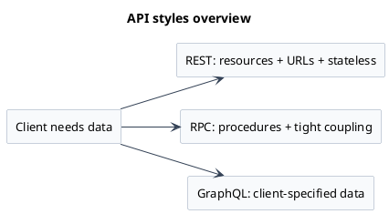

## Database

it stores the data that APIs use.
There are two main types of databases: SQL and NoSQL.

### SQL (Relational DB)
SQL or relational DB - are the google sheets on steroids. They store data in tables with rows and columns, and we define the structured schema upfront. They also have the ACID properties.
A - Atomicity - ensures either all the transactions succeeds or none do.
C - Consistency - ensures all data is in a valid state before and after the transaction by enforcing constraints.
I - Isolation - concurrent transactions don't mess each other up.
D - Durability - ensures that once a transaction is committed, it remains so, even in the event of an application crash.

examples - MySQL, PostgreSQL, OracleDB, MS SQL Server(MSSQL)

### NoSQL
NoSQL -
these are more flexible. They break away from the rigid and predefined structure of SQL tables, they are designed to work with data that is semi-structured or unstructured. It's more like storing collections of data, key-value pairs or other structures without forcing everything into a table.
types
- Document databases (e.g., MongoDB, CouchDB) - store data in JSON-like documents.
- Key-value stores (e.g., Redis, DynamoDB, memcached) - store data as a collection of key-value pairs. caching and session management are common use cases or the things that need speed.
- Column-family stores (e.g., Cassandra, HBase) - store data in columns rather than rows. This is optimized for handling massive amounts of writes and read data based on specific keys. activity feeds, time series data, big data stuff.
- Graph databases (e.g., Neo4j, ArangoDB) - store data in graph structures with nodes and edges. These are needed in cases where the relationships between the data points are just as important as the data itself. the nodes contains the data and the edges represent the relationships. social networks, friends connections, recommendation systems, and fraud detection, or anywhere the connection matter.

### Summary
in summary, think of the social media feed, tons of likes and comments. each interaction is a piece of data that needs to be stored and retrieved efficiently. A relational database might struggle with this due to sheer volume of writes and lack of rigid structure, this is where cassandra which is designed to handle high write and read throughput comes in handy. But there's a tradeoff - with many nosql systems built for massive scale, we might lose some of the ACID properties, for higher availability and partition tolerance (CAP theorem). So, if we need strong consistency and complex queries, SQL is the way to go. But if we need flexibility and scalability, NoSQL is the better choice.

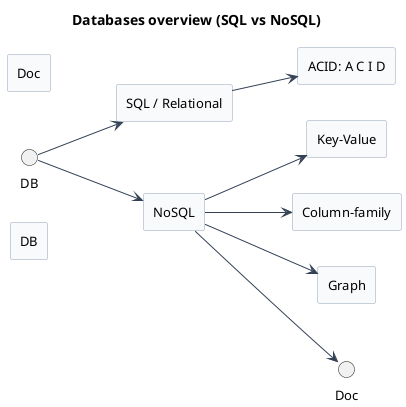

### KV Stores

the key value databases like redis and memcached primarily operate from the computer's main memory for storage, allowing extremely fast read and write operations. this is why they are popular choices for the caching needs, keeping the frequently used data readily available in the memory and also used for managing the user sessions.

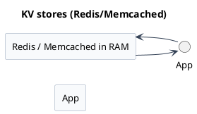

## Scalability

### Approaches
When application gets popular, to handle more load we need to scale the system. There are two main approaches to scaling:
1. Vertical Scaling - basically upgrading the existing hardware to handle more load (e.g., adding more CPU, RAM, faster disks). this is simpler, but there's a limit coz we can only add so much power to a single machine. and it also becomes a single point of failure. which is not good for high availability.
2. Horizontal Scaling - adding more machines to distribute the load (e.g., sharding the database, using load balancers). Most of the large applications today uses horizontal scaling to ensure high availability and reliability. we simply add more servers to handle the increased traffic and data. This helps with much better fault tolerance, as if one server goes down, others can still handle the requests. however it introduces more complexity, now we have to manage all these machines, keeping data consistent across them, and coordinate the tasks in way ensuring that the load is balanced properly. Load balancers are used to distribute the incoming traffic evenly to the individual servers, it sits in front of the application servers and smartly routes the requests to the appropriate server based on the some strategy which usually uses current load and health of the servers. Load balancers helps with preventing bottlenecks and improving availability ( if one server goes down, the load balancer knows not to send traffic to it).

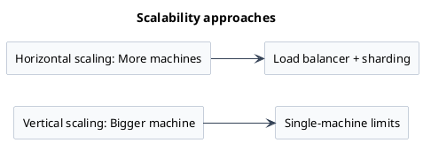

## Load balancers

### Algorithms
Algorithms used by load balancers to distribute the traffic:
1. Round Robin - distributes requests to servers in circular order sequence like server 1, server 2, server 3, server 1, server 2, server 3 and so on.
2. Least Connections - sends the requests to the server with the fewest active connections, trying to keep everyone equally busy.
3. IP Hash - uses the client's IP address to determine which server will handle the request consistently. this could be important for some applications which maintains the state on the server ( session stickiness).

### High availability
We also need redundant load balancers to ensure high availability. If one load balancer fails, another can take over without disrupting the service.

### Tools
we can use software load balancers like HAProxy or NGINX to achieve this. or managed service from cloud ones like AWS Elastic Load Balancing (AWS ELB) or Google Cloud Load Balancing or Azure Load Balancer.

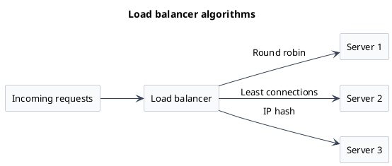

## Caching

Caching creates a high speed storage layer that stores the frequently accessed data. It reduces latency and improves overall performance. It's like keeping the most used work tools close at hand for quick access.

### Levels
Caching can happen at lots of levels:
1. Browser level - browsers cache static assets like images, CSS, and JavaScript files to reduce load times on subsequent visits.
2. DNS level - DNS servers cache IP address mappings for domain names, speeding up the resolution process for frequently accessed domains.
3. Application level - applications can implement their own caching mechanisms to store frequently accessed data in memory.
4. Database level - databases can cache query results to speed up response times for repeated queries.
5. CDN level - Content Delivery Networks (CDNs) cache static assets at edge locations closer (geographically closer) to users, reducing latency.

### Strategies
Caching strategies:
1. Cache Aside - the application code is required to check the data from the cache if it's available there before querying the database, otherwise it will fetch the data from the database and store it in the cache for future requests.
2. Write Through - when application is writing data, data is written to the cache and database at the same time, it guarantees the consistency between the cache and database, this might make the write operations a bit slower as we are waiting for both writes to complete.
3. Write Back - data is written to the cache first and then asynchronously (or in batches) written to database. This prioritizes the write speed. in case the cache fails then there is risk of losing data, here we are trading off consistency for performance.
4. Write Around - writes are sent directly to the database, bypassing the cache. This can be useful for infrequently accessed data. The cache is only updated when the data is read following the cache aside pattern usually.

### Eviction policies
Cache eviction policies: when cache is full and new data has to come in, then something has to go.
1. Least Recently Used (LRU) - removes the least recently accessed items first.
2. First In First Out (FIFO) - removes the oldest items first, regardless of how often they are accessed. simply but not always optimal. (optimal when the access pattern is strictly sequential, eg. video streaming, live sports, online gaming)
3. Least Frequently Used (LFU) - removes the least frequently accessed items first. it evicts the data which have been accessed the least number of times, ensuring the hottest data stays in the cache.

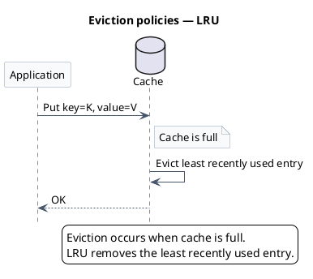

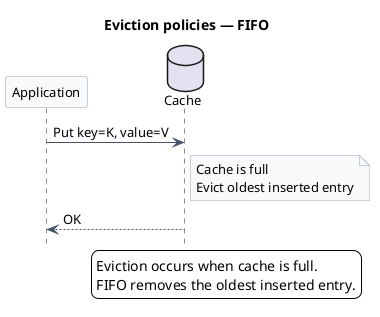

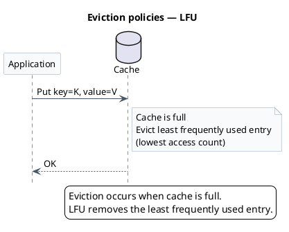

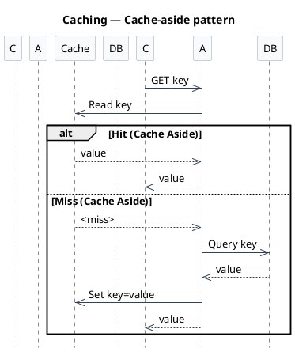

### CDN

it is basically a geographically distributed network of servers which specialize in storing static content images, videos, and other web assets. CDNs cache content at edge locations closer to users, reducing latency and improving load times.

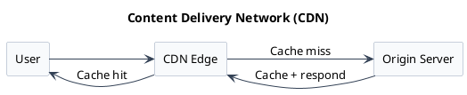

## Data partitioning and sharding

in cases where the sheer volume of data becomes very huge, like when databases become huge like GBs or terabytes, eventually a single database cannot hold it all, storage limits, query performance takes a hit. This is where data partitioning and sharding comes in, basically dividing the massive data into smaller independent chunks called shards and spread those shards across multiple databases or servers. so now each server only handles the portion of overall data. 

to divide the data we can use different strategies like:

1. Horizontal Partitioning - splits the data by rows, eg. users from A-M in one shard, N-Z in another. it uses some key like username of id.
2. Vertical Partitioning - splits the data by columns, eg. frequently accessed user profile information in one shard, less accessed text blobs in another. common for general scaling.

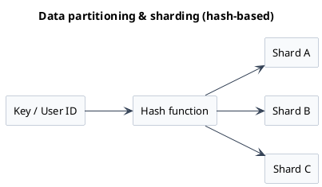

## Replication

Sharding helps manage huge datasets, but to manage availability and reliability we need to maintain multiple identical copies of the data servers. so that if one server fails, others can take over without data loss or downtime.

By having redundancy we improve the overall system reliability and availability. also it can improve the read performance as we can distribute the read requests across multiple servers.

Common replication strategies:
1. Single leader (master-slave) - there's one main database which handles all the writes(master) and there will be multiple replicas of it (slaves) which can handle read requests. the changes made to the master are asynchronously replicated to the slaves. writes go to one place and reads can be distributed.
2. Multi leader - here writes can be made to any replica, this improves the write availability but can lead to conflicts if same data is modified concurrently. Avoiding conflicts becomes more complex in this setup. replication can be synchronous where the primary waits for confirmation from all replicas before marking write as done - very safe but slower. Asynchronous where the primary sends the update but doesn't wait for confirmation, here there's a small window where data can be inconsistent. the primary might also choose to wait for confirmation from atleast one replica it's balance of safety and performance. 

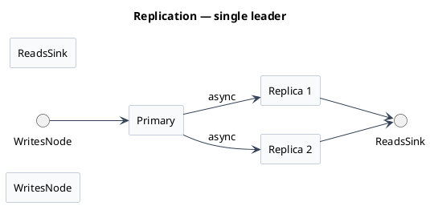

## Reverse proxy

It acts as an intermediary between clients and servers, they act as an gateway for requests coming into the system. They can perform key functions like load balancing, SSL encryption and decryption, cache static content, layer of security, filtering requests, and hiding the infrastructure details from clients.
Tools like Nginx, HAProxy, and Apache HTTP Server are commonly used as reverse proxies.

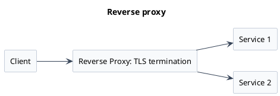

## Distributed messaging

How do services communicate with each other in a microservices architecture, especially if they don't need immediate answers. eg. sending a order confirmation email. This is where distributed messaging systems like Kafka, RabbitMQ, and AWS SQS come into play. They provide reliable asynchronous channels, they can publish a message like `order 123 confirmed` in the queue or topic, without knowing or caring which service is gonna consume it. This decouples the services and allows them to scale independently. 
This makes the system more resilient, as if serviceB (which usually consumes the message from the queue) is down, serviceA can still publish the message and it will be processed later when serviceB is back up. or also in cases if serviceB is slower then also serviceA can continue to publish messages without waiting for serviceB to process them immediately.

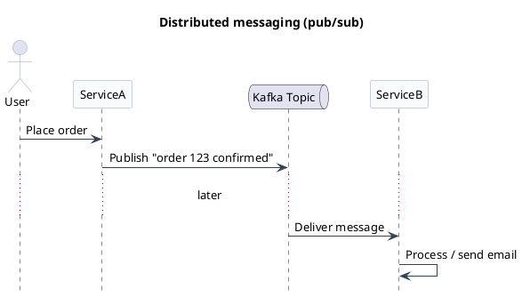

## Microservices

Microservices is a architectural style where we break a large application into smaller and independent services. Each service focusses on one specific business capability like inventory service, user management service, payment service, etc. they also communicate with each other over the network often using APIs (RPCs or REST) or for asynchronous communication they rely on messaging system.

This architectural style helps with modularity, we can develop, deploy and scale each service independently. eg. a change to payment service dosen't require the deployment of user management service. This also helps with the fault isolation, suppose if the user service has a bug, it is less likely to bring down the entire application, only the user related functionality will be affected.

This architectural style also adds complexity in managing all these different pieces, as we need to monitor and manage inter-service communication, data consistency, and deployment orchestration.

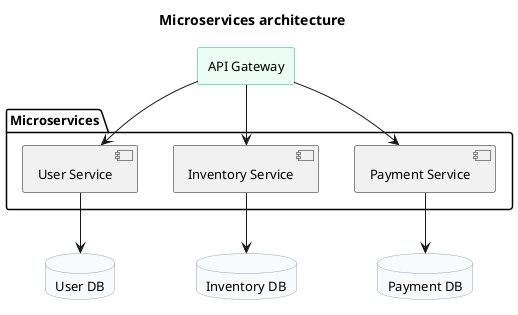

## Related building blocks and operational concepts
### Notification systems
 Notification systems - Systems specifically needeed to send notifications or alerts to users or other systems. eg. push notifications, emails, or sms are often built using messaging queues intenally.

### Full text search
 Full text search - things like Elasticsearch or Apache Solr are often used to provide full text search capabilities. They index the content and allow for fast and flexible search queries. they are specialized databases to quickly search through the large amounts of text data, like product description or articles. Much faster than performing LIKE queries in relational databases.

### Distributed coordination services
 Distributed coordination services - They are critical to manage the state and agreement between distributed system. Examples include Apache ZooKeeper and etcd. They help with 
1. service discovery - finding out which services are running
2. distributed locking - ensuring only one service performs a critical operation at a time
3. leader election - deciding which server is incharge
4. managing configuration - storing and distributing configuration data across services providing reliable source of truth
5. heartbeats - simpler mechanism to check if services are alive and healthy. This periodically sends out the pulse or heartbeat signals, if the monitoring systems stops receiving the heartbeats from a service, then that service triggers the alerts or failover actions.
6. checksums - are digital fingerprints of data, they are used to verify the integrity of data. it works by calculating a value based on the content of the data, and after the transmission the checksum of the received data is compared to the original checksum to ensure they match. if they don't match means the data got corrupted during transmission. This is used in distributed systems to ensure data consistency and integrity across different nodes.
### CAP Theorem
 7. CAP Theorem - CAP stands for Consistency, availability, and Partition Tolerance. It states that in any distributed system that shares data we can only strongly guarantee only two of these properties at a time, especially when network partitions occur. 
 - Consistency - every one sees the same data at same time. meaning every read gets the absolute latest write.
 - Availability - every request receives a response, either success or failure. even if the data is not the absolute latest data and is slightly stale or inconsistent.
 - Partition Tolerance - the system continues to operate despite network breakdowns partially, and some servers can't communicate with others, but the overall system remains functional. network partitions can happen due to cable being cut, switches fail.

In CAP, we can only choose two if the network is partitioned, and since in real world we can't avoid network partition as cables can be cut or switches can fail, we always have to design for network partition, we have to choose between consistency and availability.

A CP system prioritizes consistency over availability, meaning it will ensure that all reads will get most recent data, if there's a partition then it might refuse to make a part of system unavailable to avoid returning inconsistent data. This is often seen in systems like traditional databases where strong consistency is required, but it might lead to downtime during network issues.

An AP system prioritizes availability, meaning even during a partition it will keep responding to requests even if it had to return slightly older data from the nodes it can reach. Many NoSQL databases lean towards this side, they aim for eventual consistency. Eventual consistency is an idea which says that if you stop making changes to data, then eventually all the replicas will converge to the same state. So it tradeoffs temporary inconsistency for higher availability.

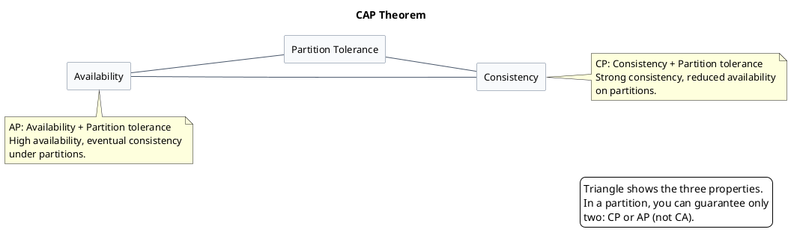

### Failover
 8. Failover - when things do fail like server crash and network partitions we need failover. Failover is the automatic process of switching to a redundant system or component when the primary one fails. Like switching to a standby database replica, or redirecting traffic via load balancers to healthy server to minimizing downtime and keep service running.

### Consistent hashing
 9. Consistent hashing - it is a technique often used in distributed cache and databases. especially when using horizontal scaling ( sharding ) it helps to distribute data or requests across a set of servers. the clever part is how it handles adding or removing servers without having to move all the data around. In simple hashing, adding one server might need to redistribute the data across all servers. In consistent hashing only small fraction of keys needs to be moved making scaling up or down smoother.

### API Idempotency
 10. API Idempotency - Usually in distributed systems a network partition might cause to retry a request, we want to ensure that doing some thing multiple times has the same result as doing it once. eg. a submit payment button, if the network hiccups and the browser retries the request automatically then you don't want to accidentally charge more than once. so the payment processing operation on the server needs to be idempotent, it needs to recognize that it already processed that particular transaction and just return the original success response rather than processing it again. This is often achieved by using unique identifiers for each request, like a transaction ID, so the server can check if it has already processed that request. GET request in REST is naturally idempotent, but PUT POST and DELETE requests need to be designed to be idempotent if they are going to be retried safely.

### Rate limiting
 11. Rate limiting - that is how a system controls the amount of incoming requests to prevent abuse or overloading. It helps to ensure fair usage and protect the system from being overwhelmed by too many requests at once. often implemented at API gateway or load balancer level. Rate limiting can be implemented using various algorithms like:

- Token Bucket
- Leaky Bucket
- Fixed Window
- Sliding Window

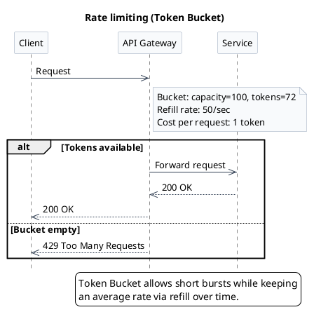

### Monitoring and logging
 12. Monitoring and logging - it involves gathering metrics about a system. health and performance, CPU usage, memory, request latency, error rates, and more. Prometheus usually collects these metrics and Grafana visualizes them. This helps in identifying issues, understanding system behavior, and making informed decisions about scaling or optimizing the system.
 Logging records of errors and events that can happen within the system, which is crucial for debugging and maintaining system reliability.

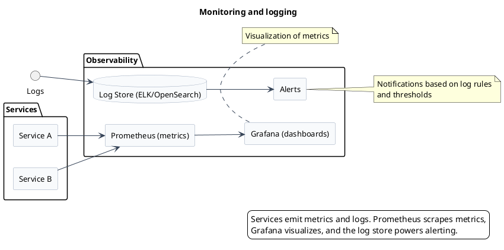

## Principles guiding design choices
What are the key principles guiding the design choices in distributed systems?

### Core abilities
There are core abilities
1. scalability - can the system grow to handle increased load. This is achieved through horizontal scaling, load balancing, and efficient data partitioning.
2. maintainability - how easy it is to understand, modify and operate over time.
3. efficiency - is about making good use of resources.
4. resilience - planning for failures and ensuring the system can recover gracefully.

Build systems that expect components to fail and can gracefully handle it, build not for perfection but for resilience. Build for failures not against it.

### How to measure
How to measure against these goals ? what metrics matter ?

1. availability - what percentage of time the system is operational. it is usually measured in counts of nines like 99.9% uptime.
2. reliability - does the system consistently do what it is supposed to do without failure.
3. fault tolerance - how well does the system handle the component failures.
4. redundancy - are the backup parts functioning and available when needed.
5. throughput - how much work can it do per second.
6. latency - how long it takes to process a request.

measuring these helps us to understand how close are we to our design goals.

## API design principles
API design principles:

1. clarity on the operation over CRUD 
2. choosing the right protocols - like HTTP for REST and GraphQL, gRPC for RPC
3. data formats - json
4. picking the right architectural style - REST, RPC, GraphQL

### Best practices
best practices for API design:

1. pagination of results
2. allowing filtering and sorting of results
3. making sure the read operations(GET calls) are idempotent
4. thinking about the backward compatibility so that we don't break the clients when we update the API.
5. implementing rate limiting and solid security measures.
6. good documentation

## Common trade-offs
trade offs in system design:

1. consistency vs availability - the CAP theorem states that a distributed system can only guarantee two of the three: consistency, availability, and partition tolerance.
2. SQL vs NoSQL - strong consistency vs flexiblity and scalability.
3. caching strategies - perfomance vs consistency vs complexity vs potential data loss in write back.
4. microservices - modularity and independent scaling vs operational complexity
5. security choices - trade-offs between usability and protection against threats.
6. performance choices - balancing speed and resource consumption.

## Conclusion
the right answer to designing a system entirely depends on specific requirements, constraints and priorities of the system that we are building. Why we are making a certain choice, what are the trade-offs we are willing to accept, and how does it align with the overall goals of the system. the context is everything.
