## DNS

DNS (Domain Name System) is the internet's phone book. It translates human-friendly domain names into IP addresses, allowing clients to find servers on the internet.

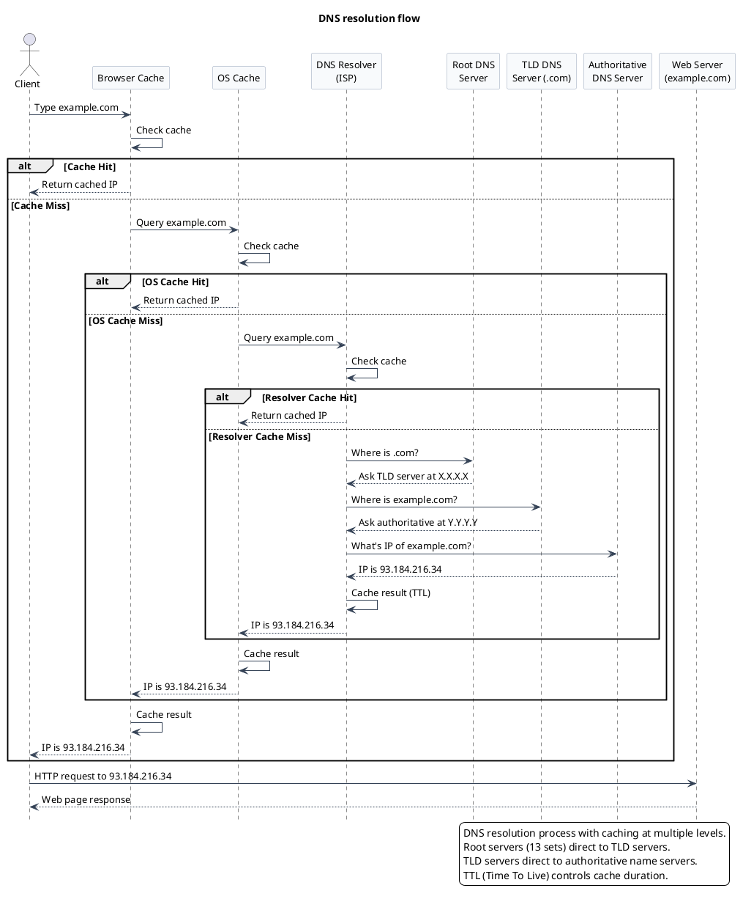

:::note[OS Cache Explained]
The **OS Cache** (Operating System Cache) is a DNS caching layer maintained by your operating system (Windows, macOS, or Linux).

When you visit a website, your computer first checks the OS-level DNS cache before querying external DNS servers. This cache stores recent DNS lookups, mapping domain names to IP addresses. If you revisit the same site, your OS can instantly return the IP address without contacting any DNS servers.
:::

## API

An **API** (Application Programming Interface) is a contract or set of rules that defines how one piece of software can request services from another.

### Types

#### REST (Representational State Transfer)

Treats everything as resources (e.g., `userProfile`), with each resource having a unique URL. REST is stateless—each request contains all information the server needs to fulfill it, enhancing scalability. Commonly used for public web APIs.

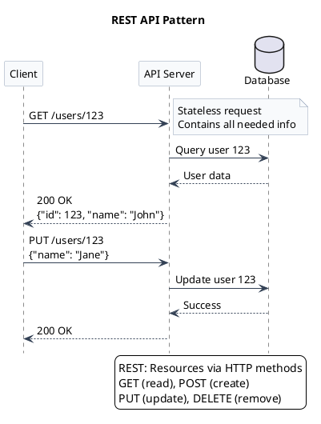

#### RPC (Remote Procedure Call)

Enables calling functions on a remote server as if they were local. Focuses on actions and operations rather than resources. Typically used for internal service communication where tight coupling is acceptable or desirable.

**How it works**: Client uses generated code (stub) that serializes the function call and parameters into binary format (Protocol Buffers), sends it over HTTP/2, and the server deserializes it to execute the function.

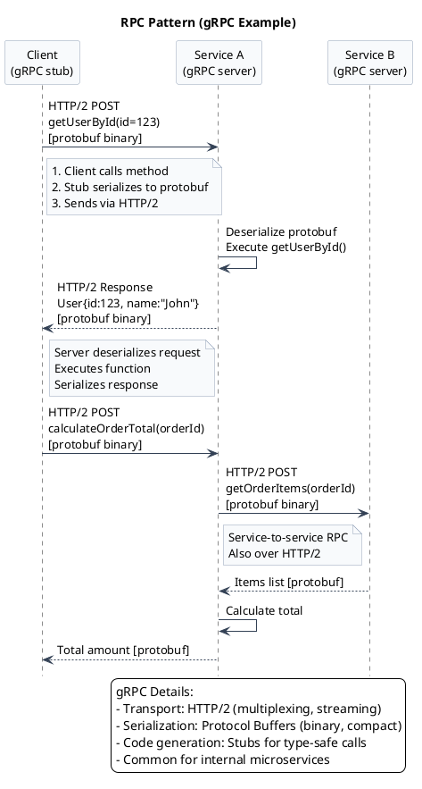

#### GraphQL

Gives clients fine-grained control over data retrieval. Instead of fixed REST endpoints, clients specify exactly what data they need in a single request. Uses a strong type system, making it ideal for mobile apps where minimizing data transfer is crucial.

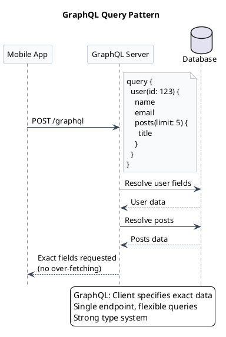

### Summary

:::tip[API Selection Guide]
- **REST**: Best for public APIs—simple, scalable, and widely adopted
- **RPC**: Ideal for internal, efficient service-to-service calls
- **GraphQL**: Perfect when clients need flexible data retrieval (mobile apps)
:::

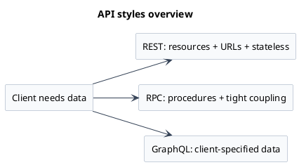


## Database

Databases store the data that APIs use and serve. There are two main categories: **SQL** (relational) and **NoSQL** (non-relational).

### SQL (Relational DB)

SQL databases are like spreadsheets on steroids. They store data in tables with rows and columns using a predefined schema. They guarantee **ACID** properties:

- **A**tomicity: Ensures all transactions succeed or none do
- **C**onsistency: Validates all data before and after transactions by enforcing constraints
- **I**solation: Prevents concurrent transactions from interfering with each other
- **D**urability: Guarantees committed transactions persist even after crashes

**Examples**: MySQL, PostgreSQL, Oracle DB, MS SQL Server (MSSQL)

### NoSQL

NoSQL databases offer flexibility beyond rigid table structures. They handle semi-structured or unstructured data efficiently.

#### Types

**Document Databases** (MongoDB, CouchDB)
- Store data in JSON-like documents
- Flexible schema for evolving data models

**Key-Value Stores** ([Redis](/high-level-design/tools/redis), DynamoDB, Memcached)
- Simple key-value pair storage
- Ideal for caching, session management, and high-speed operations

**Column-Family Stores** (Cassandra, HBase)
- Store data in columns rather than rows
- Optimized for massive write/read workloads
- Use cases: activity feeds, time-series data, big data analytics

**Graph Databases** (Neo4j, ArangoDB)
- Store data as nodes (entities) and edges (relationships)
- Perfect when relationships are as important as the data itself
- Use cases: social networks, recommendation systems, fraud detection


### Summary

:::note[Real-World Example: Social Media Feed]
Consider a social media platform with millions of likes and comments. Each interaction requires efficient storage and retrieval.

A relational database might struggle with:
- High volume of concurrent writes
- Semi-structured interaction data

Cassandra (column-family NoSQL) excels here with massive write/read throughput.
:::

:::caution[The Trade-off: CAP Theorem]
Many NoSQL systems sacrifice some **ACID** properties for higher availability and partition tolerance.

**Choose SQL when**: You need strong consistency and complex queries

**Choose NoSQL when**: You need flexibility, horizontal scalability, and can tolerate eventual consistency
:::

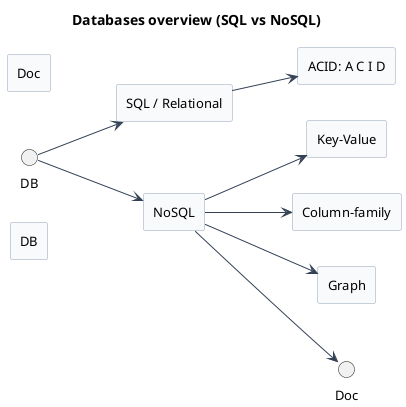


### Key-Value Stores

Key-value databases like Redis and Memcached operate primarily in main memory (RAM), enabling extremely fast read and write operations.

**Primary Use Cases**:
- **Caching**: Keep frequently accessed data in memory
- **Session Management**: Store user session data for quick retrieval
- **Real-time Analytics**: Process high-velocity data streams

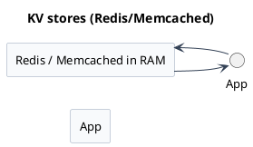

## Scalability

### Approaches

As applications grow in popularity, they need to scale to handle increased load. There are two fundamental approaches:

#### Vertical Scaling (Scale Up)

Upgrade existing hardware: add more CPU, RAM, or faster storage.

**Pros**:
- Simpler to implement
- No application changes needed

**Cons**:
- Physical hardware limits
- Single point of failure
- Limited high availability

#### Horizontal Scaling (Scale Out)

Add more machines to distribute the load across multiple servers.

**Pros**:
- Nearly unlimited scaling potential
- Better fault tolerance
- High availability (if one server fails, others continue)

**Cons**:
- Increased complexity
- Data consistency challenges
- Requires load balancing and coordination

:::tip[Modern Approach]
Most large-scale applications use **horizontal scaling** with load balancers to distribute traffic intelligently across multiple servers based on current load and health status.
:::

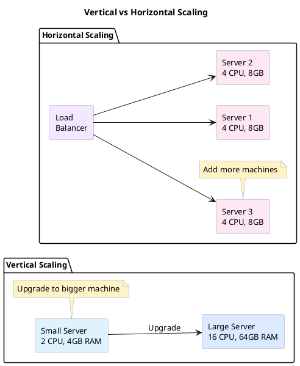


## Load Balancers

### Algorithms

Load balancers use various algorithms to distribute traffic:

**Round Robin**
- Distributes requests in circular sequence: Server 1 → Server 2 → Server 3 → Server 1...
- Simple and fair distribution

**Least Connections**
- Routes to the server with fewest active connections
- Keeps all servers equally busy

**IP Hash**
- Uses client IP address to consistently route to the same server
- Enables session stickiness for stateful applications

### High Availability

:::caution[Redundancy Required]
Deploy **redundant load balancers** to avoid single points of failure. If one fails, another takes over seamlessly.
:::

### Tools

**Self-Managed**:
- HAProxy
- NGINX

**Cloud-Managed**:
- AWS Elastic Load Balancing (ELB)
- Google Cloud Load Balancing
- Azure Load Balancer

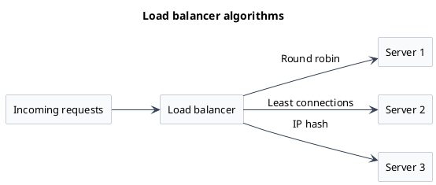

## Caching

Caching creates a high-speed storage layer for frequently accessed data, reducing latency and improving performance—like keeping your most-used tools within arm's reach.

### Caching Levels

Caching occurs at multiple layers:

**Browser Cache**
- Stores static assets (images, CSS, JavaScript)
- Reduces load times on repeat visits

**DNS Cache**
- Caches IP address mappings for domain names
- Speeds up DNS resolution

**Application Cache**
- In-memory storage for frequently accessed data
- Reduces database queries

**Database Cache**
- Caches query results
- Speeds up repeated queries

**CDN (Content Delivery Network)**
- Caches static assets at edge locations globally
- Delivers content from geographically closest servers

### Caching Strategies

#### Cache Aside (Lazy Loading)

Application checks cache first. On miss, fetch from database and populate cache.

**Pros**: Simple, only caches what's needed
**Cons**: Cache miss penalty, potential stale data

#### Write Through

Writes go to both cache and database simultaneously.

**Pros**: Strong consistency between cache and database
**Cons**: Slower writes (waiting for both operations)

#### Write Back (Write Behind)

Writes go to cache first, then asynchronously to database.

**Pros**: Fast writes, reduced database load
**Cons**: Risk of data loss if cache fails before database sync

:::caution[Trade-off]
Write Back prioritizes **performance** over **consistency**
:::

#### Write Around

Writes bypass cache, going directly to database. Cache populated only on reads.

**Pros**: Prevents cache pollution with infrequently accessed data
**Cons**: Cache misses on recently written data

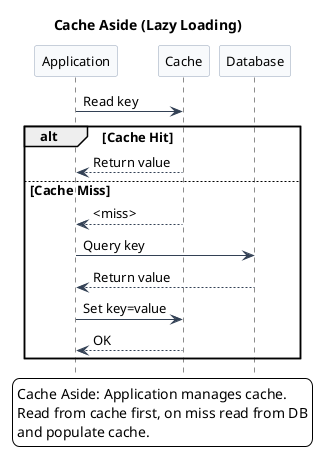

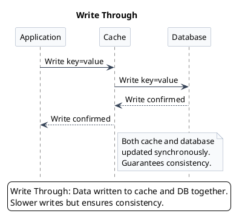

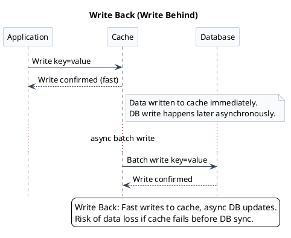

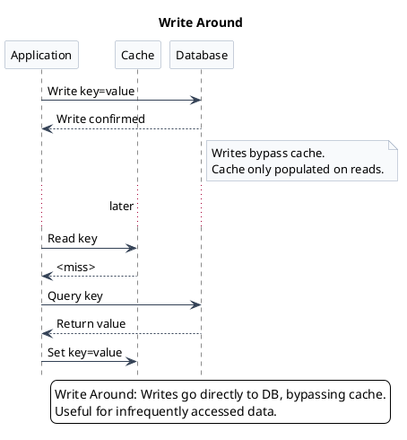

### Cache Eviction Policies

When cache is full, eviction policies determine what gets removed:

**LRU (Least Recently Used)**
- Removes least recently accessed items
- Good general-purpose strategy
- Assumes recent access predicts future access

**FIFO (First In First Out)**
- Removes oldest items regardless of access frequency
- Simple but not always optimal
- Best for sequential access patterns (video streaming, live sports)

**LFU (Least Frequently Used)**
- Removes items with lowest access count
- Keeps "hottest" data in cache
- Good for workloads with clear access patterns

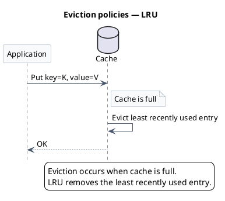

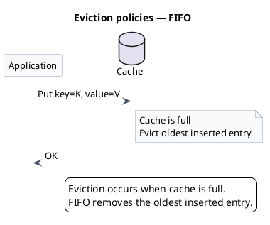

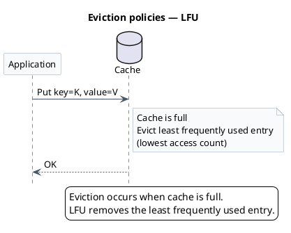


### CDN (Content Delivery Network)

A geographically distributed network of servers that cache static content (images, videos, web assets) at edge locations worldwide.

**Benefits**:
- Reduced latency by serving from geographically closest server
- Improved load times
- Reduced load on origin server
- Better global user experience

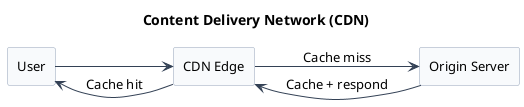

## Data Partitioning and Sharding

When databases grow to terabytes, a single database can't handle it all. Storage limits are reached and query performance degrades.

**Solution**: Divide data into smaller independent chunks (**shards**) distributed across multiple servers.

### Partitioning Strategies

**Horizontal Partitioning (Sharding)**
- Splits data by **rows**
- Example: Users A-M in Shard 1, N-Z in Shard 2
- Uses partition key (user ID, username)
- Most common scaling approach

**Vertical Partitioning**
- Splits data by **columns**
- Example: User profiles in Shard 1, user activity logs in Shard 2
- Separates frequently vs infrequently accessed data
- Optimizes for different access patterns

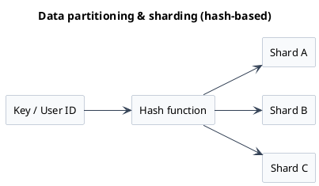


## Replication

Sharding handles large datasets, but **replication** ensures availability and reliability by maintaining multiple identical copies of data. If one server fails, others take over without data loss or downtime.

**Benefits**:
- Improved system reliability and availability
- Better read performance (distribute reads across replicas)
- Fault tolerance

### Replication Strategies

#### Single Leader (Master-Slave)

**Architecture**:
- One primary (master) handles all writes
- Multiple replicas (slaves) handle reads
- Changes replicated asynchronously to replicas

**Pros**: Simple, writes centralized
**Cons**: Write bottleneck at primary

#### Multi-Leader

**Architecture**:
- Writes accepted by any replica
- Changes replicated to other replicas

**Pros**: Higher write availability
**Cons**: Complex conflict resolution for concurrent writes

### Synchronization Modes

**Synchronous**
- Primary waits for all replicas to confirm
- Very safe, but slower

**Asynchronous**
- Primary doesn't wait for confirmation
- Fast, but small window of potential inconsistency

**Semi-Synchronous**
- Wait for at least one replica
- Balances safety and performance

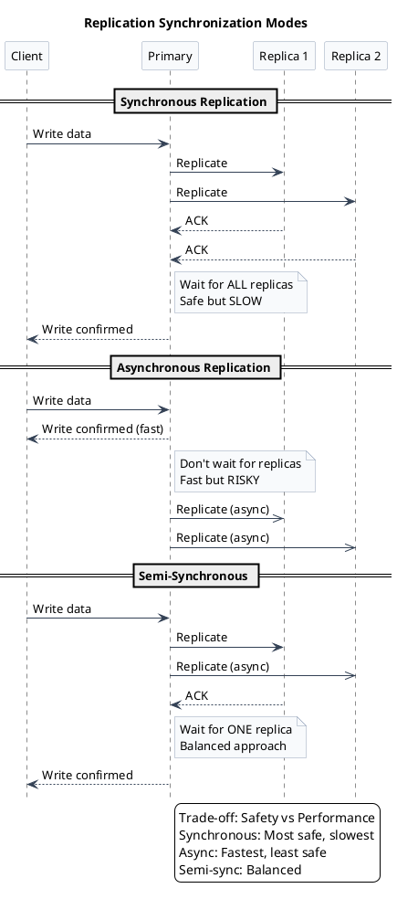

```plantuml
@startuml
title Replication — single leader
left to right direction
skinparam backgroundColor #ffffff
skinparam Shadowing false
skinparam DefaultFontName Arial
skinparam DefaultFontSize 13
skinparam ArrowColor #334155
skinparam rectangleBorderColor #94a3b8
skinparam rectangleBackgroundColor #f8fafc
rectangle WritesNode as Writes
rectangle Primary
rectangle Replica1 as "Replica 1"
rectangle Replica2 as "Replica 2"
rectangle ReadsSink as Reads
WritesNode --> Primary
Primary --> Replica1 : async
Primary --> Replica2 : async
Replica1 --> ReadsSink
Replica2 --> ReadsSink
@enduml
```

## Reverse Proxy

A reverse proxy acts as an intermediary gateway between clients and backend servers.

### Key Functions

- **Load Balancing**: Distribute requests across servers
- **SSL/TLS Termination**: Handle encryption/decryption [TLS-Termination](/high-level-design/protocols/http/#tls-termination)
- **Caching**: Cache static content
- **Security**: Filter malicious requests, hide infrastructure
- **Compression**: Compress responses before sending to clients

### Popular Tools

- NGINX
- HAProxy
- Apache HTTP Server
- Envoy

```plantuml
@startuml
title Reverse proxy
left to right direction
skinparam backgroundColor #ffffff
skinparam Shadowing false
skinparam DefaultFontName Arial
skinparam DefaultFontSize 13
skinparam ArrowColor #334155
skinparam rectangleBorderColor #94a3b8
skinparam rectangleBackgroundColor #f8fafc
rectangle Client
rectangle ReverseProxy as "Reverse Proxy: TLS termination"
rectangle Service1 as "Service 1"
rectangle Service2 as "Service 2"
Client --> ReverseProxy
ReverseProxy --> Service1
ReverseProxy --> Service2
@enduml
```


## Distributed Messaging

Enables asynchronous communication between services in microservices architectures when immediate responses aren't required.

**Example**: Sending order confirmation emails

### How It Works

Services publish messages (e.g., `order 123 confirmed`) to queues/topics without knowing which service consumes them. This **decouples** services, allowing independent scaling.

### Benefits

**Resilience**
- If consumer service is down, producer continues publishing
- Messages processed when consumer recovers

**Asynchronous Processing**
- Producer doesn't wait for consumer
- Handles different processing speeds

**Scalability**
- Add more consumers to handle load
- Services scale independently

### Popular Tools

- **Apache Kafka**: High-throughput, distributed streaming
- **RabbitMQ**: Feature-rich message broker
- **AWS SQS**: Managed cloud queue service
- **Redis Streams**: Lightweight pub/sub

```plantuml
@startuml
title Message Queue Patterns
left to right direction
skinparam backgroundColor #ffffff
skinparam Shadowing false
skinparam DefaultFontName Arial
skinparam DefaultFontSize 13
skinparam rectangleBorderColor #94a3b8
skinparam rectangleBackgroundColor #f8fafc
skinparam queueBorderColor #10b981
skinparam queueBackgroundColor #ecfdf5
package "Point-to-Point (Queue)" {
  rectangle "Producer" as P1
  queue "Task Queue" as Q1
  rectangle "Consumer 1" as C1
  rectangle "Consumer 2" as C2
  P1 --> Q1 : Send task
  Q1 --> C1 : One consumer
  Q1 --> C2 : gets message
  note bottom of Q1
    Each message consumed once
    Load balancing
  end note
}
package "Pub/Sub (Topic)" {
  rectangle "Publisher" as P2
  queue "Topic" as T1
  rectangle "Subscriber A" as S1
  rectangle "Subscriber B" as S2
  rectangle "Subscriber C" as S3
  P2 --> T1 : Publish event
  T1 --> S1 : All subscribers
  T1 --> S2 : receive copy
  T1 --> S3 : of message
  note bottom of T1
    Broadcast to all
    Event distribution
  end note
}
@enduml
```

```plantuml
@startuml
title Distributed messaging (pub/sub)
skinparam backgroundColor #ffffff
skinparam Shadowing false
skinparam DefaultFontName Arial
skinparam DefaultFontSize 13
skinparam sequenceArrowColor #334155
skinparam sequenceParticipantBorderColor #94a3b8
skinparam sequenceActorBorderColor #94a3b8
skinparam sequenceParticipantBackgroundColor #f8fafc
hide footbox
actor User
participant ServiceA
queue "Kafka Topic" as Kafka
participant ServiceB
User -> ServiceA: Place order
ServiceA -> Kafka: Publish "order 123 confirmed"
... later ...
Kafka -> ServiceB: Deliver message
ServiceB -> ServiceB: Process / send email
@enduml
```

## Microservices

An architectural style that breaks large applications into smaller, independent services, each focused on a specific business capability.

**Examples**: Inventory service, user management service, payment service

### Communication

**Synchronous**: REST APIs, gRPC
**Asynchronous**: Message queues (Kafka, RabbitMQ)

### Advantages

**Modularity**
- Develop, deploy, and scale services independently
- Changes to one service don't require redeploying others

**Fault Isolation**
- Bugs in one service don't crash the entire application
- Graceful degradation of functionality

**Technology Diversity**
- Each service can use different tech stacks
- Choose best tool for each job

### Trade-offs

:::caution[Increased Complexity]
Microservices introduce operational overhead:
- Inter-service communication management
- Distributed data consistency
- Deployment orchestration (Kubernetes, Docker Swarm)
- Monitoring and observability across services
:::

```plantuml
@startuml
title Microservices architecture
skinparam backgroundColor #ffffff
skinparam Shadowing false
skinparam DefaultFontName Arial
skinparam DefaultFontSize 13
skinparam rectangleBorderColor #10b981
skinparam rectangleBackgroundColor #ecfdf5
skinparam databaseBackgroundColor #f8fafc
skinparam databaseBorderColor #94a3b8
rectangle "API Gateway" as APIGW
package "Microservices" {
	[User Service]
	[Inventory Service]
	[Payment Service]
}
database "User DB" as UDB
database "Inventory DB" as IDB
database "Payment DB" as PDB
APIGW --> [User Service]
APIGW --> [Inventory Service]
APIGW --> [Payment Service]
[User Service] --> UDB
[Inventory Service] --> IDB
[Payment Service] --> PDB
@enduml
```

## Related Building Blocks and Operational Concepts

### Notification Systems

Systems for sending alerts to users or other systems.

**Types**: Push notifications, emails, SMS
**Implementation**: Often built using message queues internally
**Tools**: Firebase Cloud Messaging, AWS SNS, Twilio

### Full-Text Search

Specialized search engines for querying large text datasets.

**Purpose**: Fast, flexible search through product descriptions, articles, logs
**Advantage**: Much faster than SQL `LIKE` queries
**Tools**: Elasticsearch, Apache Solr, Algolia

### Distributed Coordination Services

Critical for managing state and agreement in distributed systems.

**Tools**: Apache ZooKeeper, etcd, Consul

#### Key Functions

**Service Discovery**
- Track which services are running and where

**Distributed Locking**
- Ensure only one service performs critical operations
- Prevent race conditions

**Leader Election**
- Determine which server is primary/coordinator

**Configuration Management**
- Centralized, reliable source of truth
- Distribute config changes to all services

**Heartbeats**
- Periodic health checks
- Detect service failures
- Trigger alerts or failover

**Checksums**
- Digital fingerprints for data integrity
- Verify data hasn't been corrupted during transmission
- Compare checksums before and after transfer
### CAP Theorem

States that distributed systems can guarantee only **two of three** properties when network partitions occur:

**C — Consistency**
- Every read gets the most recent write
- All nodes see the same data simultaneously

**A — Availability**
- Every request receives a response (success or failure)
- System remains operational even with stale data

**P — Partition Tolerance**
- System continues operating despite network failures
- Some servers can't communicate, but system functions

:::note[Real-World Reality]
Network partitions are inevitable (cables cut, switches fail). Since **P** is mandatory, systems must choose between **C** and **A**.
:::

#### CP Systems (Consistency + Partition Tolerance)

**Prioritize**: Strong consistency

**Trade-off**: May become unavailable during partitions

**Examples**: Traditional RDBMS, MongoDB (with strong consistency settings), HBase

**Use case**: Financial transactions, inventory management

#### AP Systems (Availability + Partition Tolerance)

**Prioritize**: High availability

**Trade-off**: May serve stale data during partitions

**Examples**: Cassandra, DynamoDB, Couchbase

**Concept**: **Eventual Consistency** — all replicas converge to the same state once updates stop

**Use case**: Social media feeds, product catalogs, user profiles

```plantuml
@startuml
title CAP Theorem
skinparam backgroundColor #ffffff
skinparam ArrowColor #475569
skinparam rectangleBorderColor #64748b
skinparam rectangleBackgroundColor #f8fafc
skinparam Shadowing false
skinparam DefaultFontName Arial
skinparam DefaultFontSize 13
left to right direction
rectangle C as "Consistency"
rectangle A as "Availability"
rectangle P as "Partition Tolerance"
C --- A
A --- P
P --- C
note right of C
CP: Consistency + Partition tolerance
Strong consistency, reduced availability
on partitions.
end note
note bottom of A
AP: Availability + Partition tolerance
High availability, eventual consistency
under partitions.
end note
legend right
Triangle shows the three properties.
In a partition, you can guarantee only
two: CP or AP (not CA).
endlegend
@enduml
```

### Failover

Automatic switching to redundant systems when primary components fail.

**Examples**:
- Switch to standby database replica
- Redirect traffic to healthy servers via load balancer
- Promote backup to primary role

**Goal**: Minimize downtime and maintain service availability

**Types**:
- **Active-Passive**: Standby idles until needed. There will be sets of servers which are kept in standby mode until needed.
- **Active-Active**: Multiple systems handle load simultaneously. All the servers will handle all requests, if one goes down the load balancer will redirect the requests to other servers. complex consistency strategies are needed here. 

### Circuit Breaker Pattern

A fault tolerance mechanism that prevents applications from repeatedly attempting operations likely to fail, protecting systems from cascading failures.

**Analogy**: Like an electrical circuit breaker in your home—when something goes wrong, it "trips" to prevent further damage.

#### How It Works

The Circuit Breaker operates in three states:

**1. Closed (Normal Operation)**
- All requests flow through normally
- System monitors for failures (error rates, timeouts, response times)
- Tracks failure metrics against threshold

**2. Open (Failure Mode)**
- Threshold exceeded (e.g., 50% failure rate or 5 consecutive failures)
- Circuit "trips open"
- Requests **fail fast** without calling the downstream service
- Prevents resource exhaustion (no blocked threads or connections)
- Waits for timeout period (e.g., 30 seconds) before testing recovery

**3. Half-Open (Testing Recovery)**
- After timeout expires, circuit enters half-open state
- Allows limited test requests through (e.g., 3 requests)
- **If successful** → return to Closed state
- **If still failing** → return to Open state

```plantuml
@startuml
title Circuit Breaker Pattern
skinparam backgroundColor #ffffff
skinparam Shadowing false
skinparam DefaultFontName Arial
skinparam DefaultFontSize 13
skinparam stateBorderColor #334155
skinparam stateBackgroundColor #f8fafc
skinparam stateArrowColor #334155
[*] --> Closed : Initial state
Closed : Requests flow normally
Closed : Monitor failures
Closed --> Open : Threshold exceeded\n(e.g., 5 failures)
Open : Requests fail fast
Open : No calls to service
Open : Wait timeout period
Open --> HalfOpen : After timeout\n(e.g., 30 seconds)
HalfOpen : Allow limited requests
HalfOpen : Test if service recovered
HalfOpen --> Closed : Success threshold met\n(e.g., 3 successes)
HalfOpen --> Open : Still failing
note right of Open
  Prevents cascading failures
  Fast fail to protect system
end note
legend right
Circuit Breaker protects against:
- Cascading failures
- Resource exhaustion
- Slow degrading services
endlegend
@enduml
```

#### Real-World Example

**Scenario**: E-commerce application calling Payment Service

**Without Circuit Breaker**:
```
User → Service A → Payment Service (slow/failing)
                 ↓
            Threads blocked
                 ↓
         Resource exhaustion
                 ↓
         Service A crashes too
```

**With Circuit Breaker**:
```
User → Service A → Circuit Breaker → Payment Service
                        ↓
                 After 5 failures
                        ↓
                  Circuit OPENS
                        ↓
              Service A stays healthy
              Returns fallback response
```

#### Key Benefits

**Prevents Cascading Failures**
- Isolates failing services from the rest of the system
- Stops the domino effect across microservices

**Fail Fast**
- Immediate error response instead of waiting for timeouts
- Better user experience (quick feedback vs hanging requests)

**Resource Protection**
- Frees up threads, connections, and memory
- Prevents thread pool exhaustion

**Automatic Recovery Testing**
- Periodically checks if downstream service recovered
- No manual intervention needed

**Graceful Degradation**
- System continues operating with reduced functionality
- Can return cached data or default responses

#### Configuration Parameters

**Failure Threshold**: How many failures trigger opening?
- Example: 5 consecutive failures or 50% error rate within a time window

**Timeout Period**: How long to wait before testing recovery?
- Example: 30 seconds, 1 minute
- Gives downstream service time to recover

**Success Threshold**: How many successes in half-open to close?
- Example: 3 consecutive successful requests

**Request Volume Threshold**: Minimum requests before calculating error rate
- Example: Need at least 10 requests in window before opening circuit

#### Common Use Cases

**External API Calls**
- Third-party payment gateways
- Shipping APIs
- Authentication services
- Weather APIs

**Database Connections**
- Protecting against database outages
- Preventing connection pool exhaustion

**Microservice Communication**
- Service-to-service calls
- Preventing cascading failures across distributed systems

#### Fallback Strategies

When circuit is open, implement graceful degradation:

**Cached Data**: Return last known good value
```java
return circuitBreaker.execute(
    () -> paymentService.getBalance(),
    fallback: () -> cache.getLastBalance()
);
```

**Default Response**: Return sensible default
```java
return DEFAULT_SHIPPING_ESTIMATE; // "3-5 business days"
```

**Queue Request**: Store for later processing
```java
messageQueue.enqueue(paymentRequest);
return "Your payment is being processed";
```

**Alternative Service**: Route to backup service
```java
if (primaryCircuit.isOpen()) {
    return secondaryPaymentService.process();
}
```

**User Message**: Clear error explaining temporary unavailability
```java
return "Payment service temporarily unavailable. Please try again in a moment.";
```

#### Implementation

Popular libraries:

**Java**: Resilience4j, Hystrix (maintenance mode)

**.NET**: Polly

**Node.js**: Opossum

**Python**: pybreaker
```python
// paymentservice.py
breaker = pybreaker.CircuitBreaker(
    fail_max=5,
    reset_timeout=30
)

@breaker
def call_payment_service():
    return payment_service.process()
```

:::tip[Best Practice: Combine Patterns]
Circuit Breaker works best when combined with:
- **Retry Logic**: For transient failures (with exponential backoff)
- **Timeout**: Don't wait forever for responses
- **Bulkhead**: Isolate resources for different services
- **Rate Limiting**: Control request volume to prevent overload
:::

:::caution[Monitoring Required]
Always monitor circuit breaker state changes and failures:
- Log when circuit opens/closes
- Alert on frequent state transitions
- Track fallback execution rates
- Monitor downstream service health
:::

### Consistent Hashing

A technique for distributing data across servers that minimizes redistribution when servers are added or removed.

**Problem with Simple Hashing**:
- Adding/removing one server → rehash all keys → massive data movement

**Consistent Hashing Solution**:
- Only a small fraction of keys need rebalancing
- Smoother scaling operations

**Use Cases**:
- Distributed caches (Memcached, Redis clusters)
- Distributed databases (Cassandra, DynamoDB)
- Load balancing

:::tip[Key Benefit]
Minimizes data movement during cluster topology changes
:::

```plantuml
@startuml
title Consistent Hashing Ring
skinparam backgroundColor #ffffff
skinparam Shadowing false
skinparam DefaultFontName Arial
skinparam DefaultFontSize 13
skinparam noteBorderColor #94a3b8
skinparam noteBackgroundColor #f8fafc
circle "Hash Ring\n(0-360°)" as Ring
rectangle "Server A\n(90°)" as SA #dbeafe
rectangle "Server B\n(180°)" as SB #fce7f3
rectangle "Server C\n(270°)" as SC #fef3c7
rectangle "Key1 (45°)" as K1 #ecfdf5
rectangle "Key2 (120°)" as K2 #ecfdf5
rectangle "Key3 (200°)" as K3 #ecfdf5
rectangle "Key4 (300°)" as K4 #ecfdf5
Ring --> SA
Ring --> SB
Ring --> SC
K1 --> SA : Clockwise\nnext server
K2 --> SB
K3 --> SC
K4 --> SA
note bottom of Ring
  When adding Server D at 315°:
  Only Key4 moves to D
  Other keys stay on same servers
end note
legend right
Consistent Hashing Benefits:
- Minimal redistribution on add/remove
- Balanced load distribution
- Virtual nodes for uniformity
endlegend
@enduml
```

### API Idempotency

Ensures performing an operation multiple times has the same effect as performing it once.

**Why It Matters**:
Network failures may cause automatic request retries. Without idempotency, duplicate requests could cause unintended effects.

**Example**: Payment Processing
- User clicks "Pay"
- Network hiccup causes retry
- Without idempotency: double charge ❌
- With idempotency: same result ✅

**Implementation**:
- Use unique identifiers (transaction ID, idempotency key)
- Server checks if request already processed
- Return original response for duplicate requests

**HTTP Method Idempotency**:
- **Naturally Idempotent**: `GET`, `PUT`, `DELETE`
- **Needs Design**: `POST` (use idempotency keys)

:::tip[Best Practice]
Include an `Idempotency-Key` header in requests that modify state
:::

### Rate Limiting

Controls incoming request volume to prevent abuse and overload.

**Benefits**:
- Prevents DDoS attacks
- Ensures fair usage
- Protects backend resources
- Maintains service quality

**Implementation Level**: API Gateway or Load Balancer

#### Algorithms

**Token Bucket**
- Bucket holds tokens (request capacity)
- Tokens refill at constant rate
- Request consumes token; rejected if bucket empty
- Allows bursts up to bucket capacity

```plantuml
@startuml
title Token Bucket Algorithm
skinparam backgroundColor #ffffff
skinparam Shadowing false
skinparam DefaultFontName Arial
skinparam DefaultFontSize 13
skinparam sequenceArrowColor #334155
skinparam sequenceParticipantBorderColor #94a3b8
skinparam sequenceParticipantBackgroundColor #f8fafc
skinparam noteBackgroundColor #f8fafc
skinparam noteBorderColor #94a3b8
hide footbox
participant Client
participant "Token Bucket" as Bucket
participant Service
note over Bucket
Bucket State:
Capacity: 10 tokens
Current: 7 tokens
Refill: 2 tokens/sec
end note
Client -> Bucket: Request 1 (costs 1 token)
Bucket -> Bucket: Check tokens: 7 available
note right of Bucket: Token available ✓
Bucket -> Service: Forward request
Service --> Bucket: 200 OK
Bucket --> Client: 200 OK
note over Bucket: Tokens: 7 → 6
...Time passes (0.5 sec)...
note over Bucket: Refill: +1 token\nTokens: 6 → 7
Client -> Bucket: Burst of 8 requests
Bucket -> Bucket: Check tokens: 7 available
note right of Bucket
First 7 requests: Pass ✓
8th request: REJECT ❌
end note
Bucket -> Service: Forward 7 requests
Service --> Bucket: 200 OK
Bucket --> Client: 7× 200 OK
Bucket --> Client: 1× 429 Too Many Requests
note over Bucket: Tokens: 7 → 0
legend right
Token Bucket allows bursts up to capacity
while maintaining average rate via refill.
Good for: API rate limiting, traffic shaping
endlegend
@enduml
```

**Leaky Bucket**
- Requests added to queue (bucket)
- Processed at constant rate (leak)
- Overflow requests dropped
- Smooths traffic spikes

```plantuml
@startuml
title Leaky Bucket Algorithm
skinparam backgroundColor #ffffff
skinparam Shadowing false
skinparam DefaultFontName Arial
skinparam DefaultFontSize 13
skinparam sequenceArrowColor #334155
skinparam sequenceParticipantBorderColor #94a3b8
skinparam sequenceParticipantBackgroundColor #f8fafc
skinparam noteBackgroundColor #f8fafc
skinparam noteBorderColor #94a3b8
hide footbox
participant Client
participant "Leaky Bucket\nQueue" as Queue
participant "Rate Limiter" as Limiter
participant Service
note over Queue
Queue State:
Capacity: 5 requests
Current: 2 queued
Leak rate: 1 req/sec
end note
Client -> Queue: Request 1
Queue -> Queue: Add to queue (2→3)
note right of Queue: Queue size: 3/5 ✓
Queue --> Client: Request queued
Client -> Queue: Request 2
Queue -> Queue: Add to queue (3→4)
note right of Queue: Queue size: 4/5 ✓
Queue --> Client: Request queued
Client -> Queue: Request 3
Queue -> Queue: Add to queue (4→5)
note right of Queue: Queue size: 5/5 (FULL) ✓
Queue --> Client: Request queued
Client -> Queue: Request 4 (burst)
Queue -> Queue: Queue full!
note right of Queue: OVERFLOW ❌
Queue --> Client: 429 Too Many Requests
...Time: 1 second passes...
Queue -> Limiter: Leak 1 request
note right of Queue
Process at constant rate
Queue: 5 → 4
end note
Limiter -> Service: Forward request
Service --> Limiter: 200 OK
Limiter --> Queue: Processing complete
...Time: 1 second passes...
Queue -> Limiter: Leak 1 request
note right of Queue: Queue: 4 → 3
Limiter -> Service: Forward request
Service --> Limiter: 200 OK
legend right
Leaky Bucket processes requests at constant rate.
Smooths traffic bursts, enforces steady flow.
Good for: Network traffic shaping, video streaming
endlegend
@enduml
```

**Fixed Window**
- Count requests in fixed time windows (e.g., per minute)
- Reset counter at window boundary
- Simple but can allow traffic spikes at boundaries

```plantuml
@startuml
title Fixed Window Algorithm
skinparam backgroundColor #ffffff
skinparam Shadowing false
skinparam DefaultFontName Arial
skinparam DefaultFontSize 13
skinparam sequenceArrowColor #334155
skinparam sequenceParticipantBorderColor #94a3b8
skinparam sequenceParticipantBackgroundColor #f8fafc
skinparam noteBackgroundColor #f8fafc
skinparam noteBorderColor #94a3b8
hide footbox
participant Client
participant "Fixed Window\nCounter" as Counter
participant Service
note over Counter
Window: 00:00:00 - 00:00:59
Limit: 5 requests/minute
Current count: 0
end note
== Window 1: 00:00:00 - 00:00:59 ==
Client -> Counter: Request @ 00:00:10
Counter -> Counter: Count: 0 → 1
note right of Counter: 1/5 ✓
Counter -> Service: Forward
Service --> Counter: 200 OK
Counter --> Client: 200 OK
Client -> Counter: Request @ 00:00:20
Counter -> Counter: Count: 1 → 2
note right of Counter: 2/5 ✓
Counter -> Service: Forward
Service --> Counter: 200 OK
Counter --> Client: 200 OK
Client -> Counter: 3 more requests @ 00:00:30
Counter -> Counter: Count: 2 → 5
note right of Counter: 5/5 ✓ (LIMIT REACHED)
Counter -> Service: Forward 3 requests
Service --> Counter: 200 OK
Counter --> Client: 3× 200 OK
Client -> Counter: Request @ 00:00:50
Counter -> Counter: Count: 5 (at limit)
note right of Counter: LIMIT EXCEEDED ❌
Counter --> Client: 429 Too Many Requests
== Window 2: 00:01:00 - 00:01:59 ==
note over Counter
Window resets!
Count: 5 → 0
New window starts
end note
Client -> Counter: Request @ 00:01:00
Counter -> Counter: Count: 0 → 1
note right of Counter
1/5 ✓
Fresh window
end note
Counter -> Service: Forward
Service --> Counter: 200 OK
Counter --> Client: 200 OK
note over Counter
⚠️ Boundary Issue:
5 requests @ 00:00:59
+ 5 requests @ 00:01:00
= 10 requests in 1 second!
end note
legend right
Fixed Window: Simple but allows boundary bursts.
Window resets at fixed intervals.
Good for: Simple rate limiting, low complexity
endlegend
@enduml
```

**Sliding Window**
- Tracks requests over sliding time window
- More accurate than fixed window
- Prevents boundary spike issues

```plantuml
@startuml
title Sliding Window Algorithm
skinparam backgroundColor #ffffff
skinparam Shadowing false
skinparam DefaultFontName Arial
skinparam DefaultFontSize 13
skinparam sequenceArrowColor #334155
skinparam sequenceParticipantBorderColor #94a3b8
skinparam sequenceParticipantBackgroundColor #f8fafc
skinparam noteBackgroundColor #f8fafc
skinparam noteBorderColor #94a3b8
hide footbox
participant Client
participant "Sliding Window\nLog" as Window
participant Service
note over Window
Current time: 00:00:30
Window size: 60 seconds
Limit: 5 requests/minute
Log: [timestamps of requests]
end note
Client -> Window: Request @ 00:00:30
Window -> Window: Check last 60s\n(00:00:00 - 00:00:30)
note right of Window
Count in window: 0
0 < 5 ✓
end note
Window -> Window: Add timestamp: 00:00:30
Window -> Service: Forward request
Service --> Window: 200 OK
Window --> Client: 200 OK
Client -> Window: 4 more requests\n@ 00:00:35, 00:00:40\n00:00:45, 00:00:50
Window -> Window: Add timestamps
note right of Window
Requests in last 60s: 5
5/5 ✓ (LIMIT REACHED)
end note
Window -> Service: Forward 4 requests
Service --> Window: 200 OK
Window --> Client: 4× 200 OK
Client -> Window: Request @ 00:00:55
Window -> Window: Check window\n(00:00:00 - 00:00:55)
note right of Window
Count: 5 requests
00:00:30, 00:00:35,
00:00:40, 00:00:45,
00:00:50
5 ≥ 5 ❌ LIMIT EXCEEDED
end note
Window --> Client: 429 Too Many Requests
...Time passes: 30 seconds...
Client -> Window: Request @ 00:01:20
Window -> Window: Check window\n(00:00:20 - 00:01:20)
note right of Window
Old requests expired:
× 00:00:30 (outside window)
✓ 00:00:35, 00:00:40,
  00:00:45, 00:00:50
Count: 4/5 ✓
end note
Window -> Window: Add timestamp: 00:01:20
Window -> Service: Forward request
Service --> Window: 200 OK
Window --> Client: 200 OK
note over Window
✓ No boundary issue
Window slides continuously
More accurate rate limiting
end note
legend right
Sliding Window: Most accurate, prevents boundary bursts.
Tracks exact timestamps within rolling window.
Good for: Strict rate limiting, API quotas
Trade-off: Higher memory (stores timestamps)
endlegend
@enduml
```

:::note[Rate Limit Response Headers]
When rate limit is exceeded, return **HTTP 429 Too Many Requests** with these headers:

**Standard Headers**:
- `Retry-After`: Seconds until client can retry (e.g., `60`)
- `X-RateLimit-Limit`: Maximum requests allowed in window (e.g., `100`)
- `X-RateLimit-Remaining`: Requests remaining in current window (e.g., `0`)
- `X-RateLimit-Reset`: Unix timestamp when limit resets (e.g., `1638360000`)

**Example Response**:
```http
HTTP/1.1 429 Too Many Requests
Retry-After: 60
X-RateLimit-Limit: 100
X-RateLimit-Remaining: 0
X-RateLimit-Reset: 1638360000
Content-Type: application/json

{
  "error": "Rate limit exceeded",
  "message": "Too many requests. Please try again in 60 seconds."
}
```
:::

### Monitoring and Logging

#### Monitoring

Collects metrics about system health and performance.

**Key Metrics**:
- CPU and memory usage
- Request latency (P50, P95, P99)
- Error rates and types
- Throughput (requests/sec)
- Database connection pool stats

**Popular Stack**:
- **Prometheus**: Metrics collection and storage
- **Grafana**: Visualization and dashboards
- **AlertManager**: Alert routing and notification

#### Logging

Records events, errors, and system activities for debugging and auditing.

**Log Levels**: DEBUG, INFO, WARN, ERROR, FATAL

**Structured Logging**: Use JSON format for machine-readable logs

**Popular Stack**:
- **ELK Stack**: Elasticsearch, Logstash, Kibana
- **EFK Stack**: Elasticsearch, Fluentd, Kibana
- **OpenSearch**: Open-source alternative to Elasticsearch

:::tip[Observability]
Combine **metrics**, **logs**, and **traces** for complete system observability
:::

```plantuml
@startuml
title Monitoring and logging
skinparam backgroundColor #ffffff
skinparam componentStyle rectangle
skinparam ArrowColor #334155
skinparam Shadowing false
skinparam DefaultFontName Arial
skinparam DefaultFontSize 13
skinparam componentBorderColor #94a3b8
skinparam componentBackgroundColor #f8fafc
skinparam databaseBorderColor #94a3b8
skinparam databaseBackgroundColor #f8fafc
left to right direction
package "Services" {
	component "Service A" as S1
	component "Service B" as S2
}
package "Observability" {
	component Prom as "Prometheus (metrics)"
	component Graf as "Grafana (dashboards)"
	database Store as "Log Store (ELK/OpenSearch)"
	component Alerts as "Alerts"
}
S1 --> Prom
S2 --> Prom
Prom --> Graf
Logs --> Store
Store --> Alerts
note bottom of Graf
Visualization of metrics
end note
note right of Alerts
Notifications based on log rules
and thresholds
end note
legend right
Services emit metrics and logs. Prometheus scrapes metrics,
Grafana visualizes, and the log store powers alerting.
endlegend
@enduml
```

## Principles Guiding Design Choices

Key principles that guide distributed system design:

### Core Abilities

**Scalability**
- Can the system grow to handle increased load?
- Achieved through horizontal scaling, load balancing, partitioning

**Maintainability**
- How easy to understand, modify, and operate over time?
- Clear code, documentation, modular architecture

**Efficiency**
- Optimal use of resources (CPU, memory, network, storage)
- Cost-effectiveness at scale

**Resilience**
- Gracefully handle failures
- Design for failures, not against them

:::caution[Design Philosophy]
**Build for failure, not perfection**. Assume components will fail and design systems to handle failures gracefully.
:::

### Measurement Metrics

Key metrics to evaluate system design:

**Availability**
- Percentage of time system is operational
- Measured in "nines": 99.9% ("three nines"), 99.99% ("four nines")
- 99.9% = ~8.76 hours downtime/year
- 99.99% = ~52.56 minutes downtime/year

**Reliability**
- System consistently performs as expected without failure
- Mean Time Between Failures (MTBF)

**Fault Tolerance**
- System's ability to continue operating despite component failures

**Redundancy**
- Availability of backup components when needed

**Throughput**
- Amount of work processed per unit time (requests/sec, transactions/sec)

**Latency**
- Time to process a single request
- Measured as percentiles: P50 (median), P95, P99

:::tip[SLAs, SLOs, SLIs]
- **SLA** (Service Level Agreement): Contract with customers
- **SLO** (Service Level Objective): Internal target goals
- **SLI** (Service Level Indicator): Actual measurements
:::

## API Design Principles

### Core Principles

**Operation Clarity**
- Use clear, intent-revealing names over generic CRUD
- Example: `POST /orders/123/cancel` vs `DELETE /orders/123`

**Protocol Selection**
- **HTTP/REST**: Browser-based, public APIs
- **gRPC**: High-performance internal services
- **GraphQL**: Flexible client-driven queries

**Data Formats**
- **JSON**: Human-readable, universal support
- **Protocol Buffers**: Compact, efficient (gRPC)
- **XML**: Legacy systems

### Best Practices

**Pagination**
- Limit result sets for performance
- Patterns: offset/limit, cursor-based, page numbers

**Filtering and Sorting**
- Allow clients to query specific data
- Example: `/users?status=active&sort=created_at`

**Idempotency**
- Ensure safe request retries
- `GET`, `PUT`, `DELETE` are naturally idempotent
- Add idempotency keys for `POST`

**Versioning**
- Maintain backward compatibility
- Strategies: URL versioning (`/v1/users`), header versioning

**Security**
- Authentication (OAuth 2.0, JWT)
- Rate limiting
- Input validation
- HTTPS only

**Documentation**
- OpenAPI/Swagger specifications
- Interactive API explorers
- Code examples in multiple languages

:::tip[RESTful URL Design]
- Use nouns for resources: `/users`, `/orders`
- Use HTTP methods for actions: `GET`, `POST`, `PUT`, `DELETE`
- Nest related resources: `/users/123/orders`
:::

## Common Trade-offs

System design involves balancing competing concerns:

### Consistency vs Availability

**CAP Theorem**: Choose 2 of 3 (Consistency, Availability, Partition Tolerance)

- **CP Systems**: Strong consistency, possible downtime
- **AP Systems**: High availability, eventual consistency

### SQL vs NoSQL

| SQL | NoSQL |
|-----|-------|
| Strong consistency | Flexibility |
| ACID guarantees | Horizontal scalability |
| Complex joins | Simpler data models |
| Structured schema | Schema-less |

### Caching Strategies

| Strategy | Performance | Consistency | Complexity | Risk |
|----------|-------------|-------------|------------|------|
| Cache Aside | Medium | Medium | Low | Low |
| Write Through | Low (writes) | High | Medium | Low |
| Write Back | High | Low | High | Data loss |
| Write Around | Low (first read) | Medium | Low | Low |

### Microservices vs Monolith

**Microservices**:
- ✅ Modularity, independent scaling
- ❌ Operational complexity, distributed debugging

**Monolith**:
- ✅ Simple deployment, easier debugging
- ❌ Tight coupling, harder to scale

### Security vs Usability

**More Security** → More friction for users
**Less Security** → Better UX but higher risk

**Balance**: Multi-factor authentication, rate limiting, clear error messages

### Performance vs Cost

**Higher Performance** → More expensive infrastructure
**Cost Optimization** → Potential performance trade-offs

**Balance**: Caching, efficient algorithms, right-sized resources

:::note[Context is Key]
There's no universal "best" architecture. The right choice depends on:
- Business requirements
- Scale expectations
- Team expertise
- Budget constraints
- Regulatory requirements
:::

## Conclusion

The "right" system design depends entirely on your specific context:

- **Requirements**: What must the system do?
- **Constraints**: Budget, team size, timeline, regulations
- **Priorities**: Performance, reliability, cost, time-to-market

:::tip[Design Decision Framework]
For every choice, ask:
1. **Why** are we making this choice?
2. **What** trade-offs are we accepting?
3. **How** does it align with our goals?
:::

**Remember**: Context is everything. A design that works for a startup with 1,000 users will differ vastly from one serving 100 million users.

**Start simple, evolve as needed.** Premature optimization is the root of much wasted effort.
