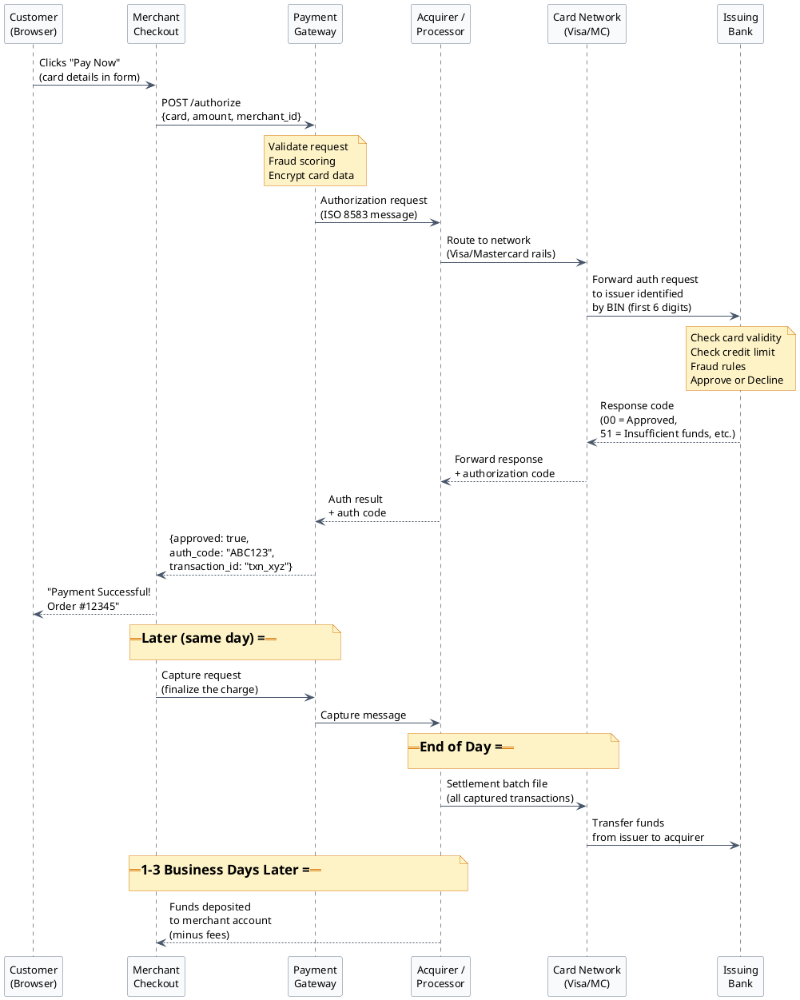
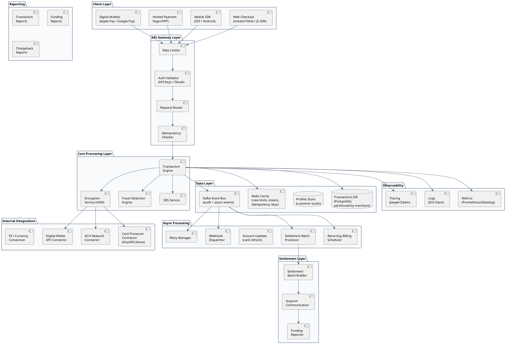
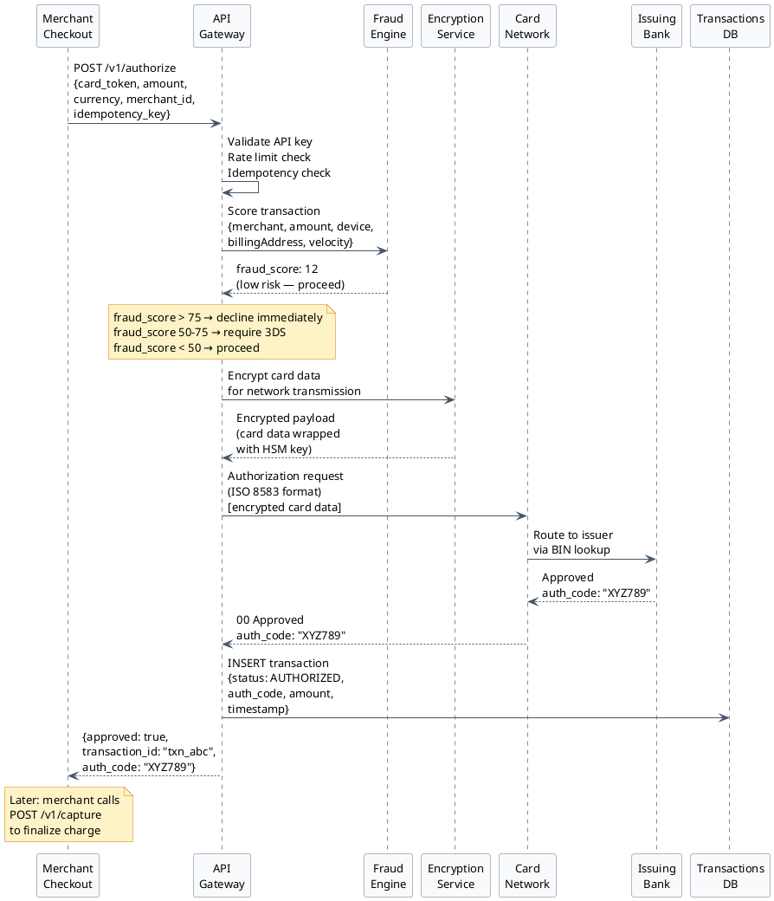
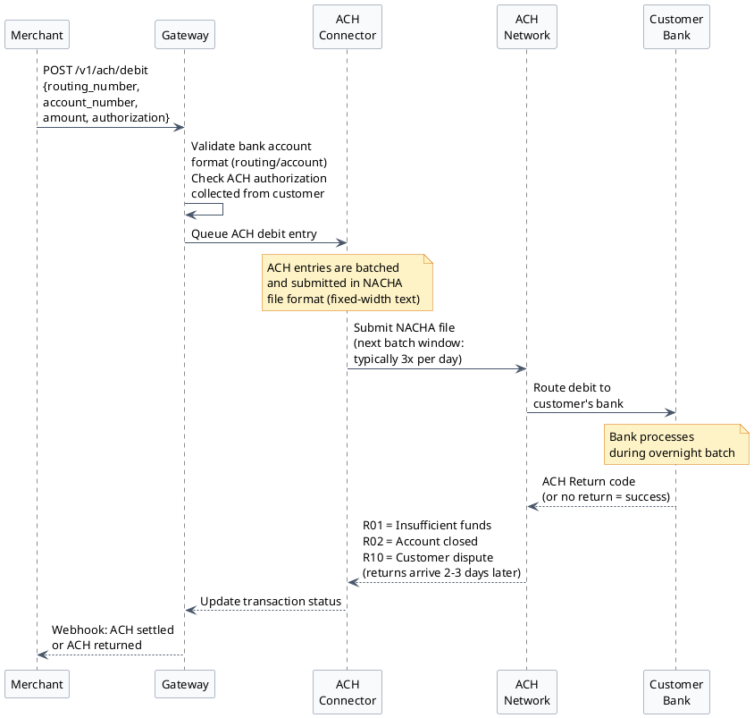
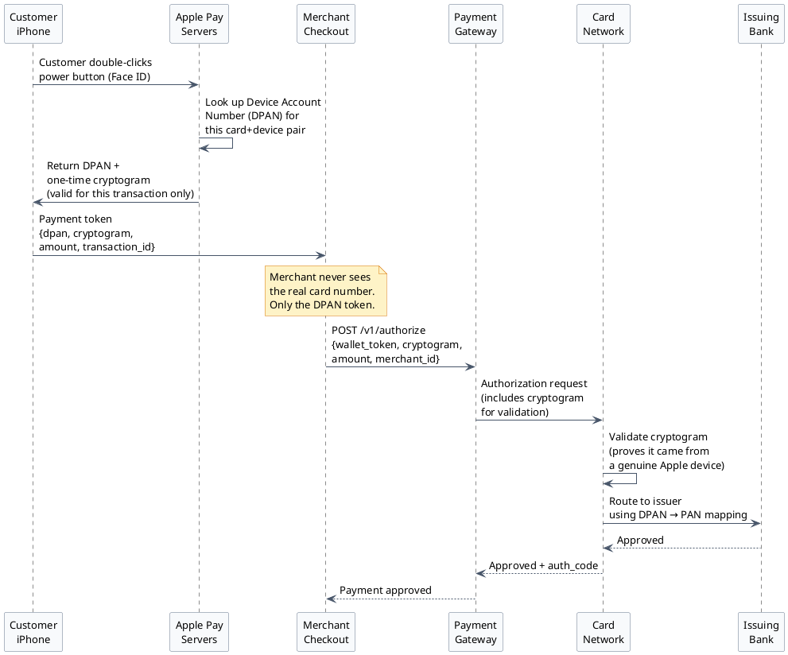
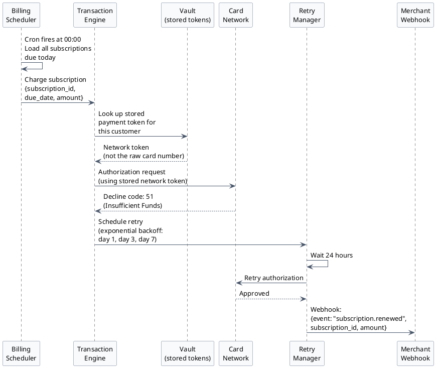
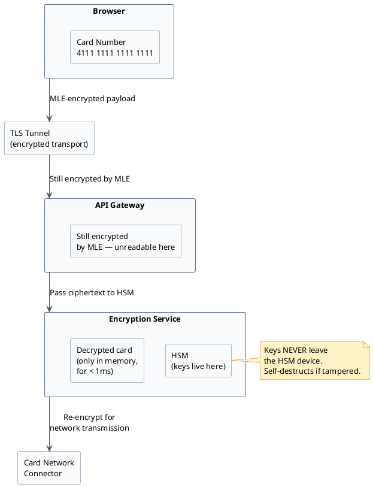
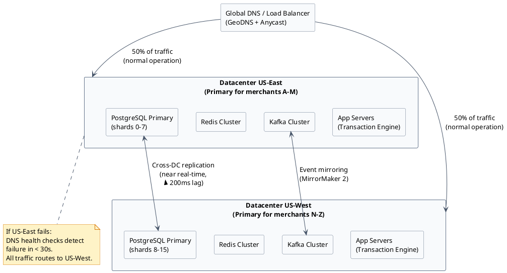
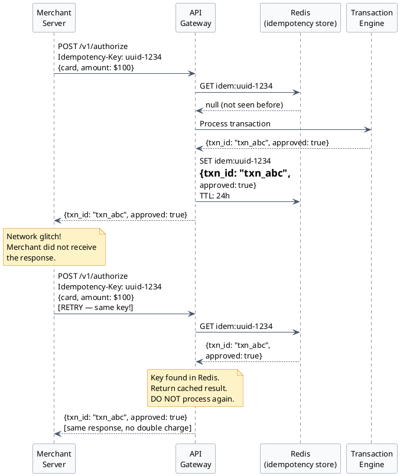

# Payment Gateway — Complete System Design Overview

:::note
This is the **master overview document** for the Payment Gateway system design series. If you have never worked with payments before, start here. Every concept is explained from scratch. After reading this document you will have a complete mental model of the entire system before diving into any subsystem.
:::

---

## Page 1 — What Is a Payment Gateway?

### The Physical Store Analogy

Before thinking about software, imagine buying a coffee at a café with your credit card.

1. You hand your card to the cashier.
2. The cashier swipes it on a card terminal (the little machine on the counter).
3. The terminal connects — over a phone line or internet — to a system that checks whether your bank will approve a $5 charge.
4. A few seconds later: "Approved." The terminal prints a receipt.
5. Money does **not** move at that exact moment. Your bank has simply said "yes, we'll honour this charge." The café collects all its transactions at the end of the day and sends them in one batch to get paid.

Now imagine doing the same thing on a website. You type your card number into a checkout form. There is no physical terminal. Something needs to play the role of that terminal — securely accept your card details, talk to the banking system, and tell the merchant whether the charge was approved. That "something" is the **Payment Gateway**.

---

### The Three Terms You Will Hear Constantly

| Term | One-line definition |
|------|---------------------|
| **Payment Gateway** | The software layer that accepts card data from a merchant's website and routes it into the banking system. Think of it as the digital card terminal. |
| **Payment Processor** | The company that handles the technical communication between the gateway and the card networks (Visa, Mastercard). Often the acquirer and processor are the same company. |
| **Payment Service Provider (PSP)** | A company that bundles gateway + processor + merchant account into one product. Stripe, Square, and Adyen are PSPs — they let a merchant start accepting payments without setting up a separate bank relationship. |

:::tip[Why does the terminology feel confusing?]
In the early days these were three completely separate businesses. Today many companies offer all three services under one roof, so the terms are used interchangeably in conversation. When reading technical documentation, treat them as distinct layers even if one vendor provides all of them.
:::

---

### The Six Parties in Every Card Transaction

Every single card payment — whether for a $2 app purchase or a $2,000 airline ticket — involves exactly these parties:

```
Customer → Merchant → Payment Gateway → Acquirer → Card Network → Issuer
```

Let's explain each one.

**1. Customer (Cardholder)**
The person paying. They have a card — credit, debit, or prepaid — issued by their bank. They do not need to understand any of what follows; they just click "Pay."

**2. Merchant**
The business receiving the payment. Could be an e-commerce site, a mobile app, or a subscription service. Merchants sign a contract with an acquirer to be allowed to accept card payments. Without that contract, the card networks will not process payments for you.

**3. Payment Gateway**
Software (usually a cloud service) that sits between the merchant's checkout page and the banking system. It does three things: validates the request, protects the card data (encryption), and routes the transaction to the right processor.

**4. Acquiring Bank (Acquirer)**
The merchant's bank. Examples: Fiserv, Wells Fargo, Chase Paymentech. The acquirer sponsors the merchant's ability to accept cards. It communicates with the card network on the merchant's behalf. At the end of the process, the acquirer deposits the payment into the merchant's bank account.

**5. Card Network**
Visa, Mastercard, American Express, Discover. These are **not banks** — they own and operate the communication rails that connect every issuing bank to every acquiring bank in the world. They set the rules that everyone must follow (including the security rules). They earn a small fee on every transaction.

**6. Issuing Bank (Issuer)**
The customer's bank. Examples: Chase, Bank of America, Citibank. The issuer decided to give the customer a credit card. When an authorization request arrives, the issuer checks: Does the card exist? Is it not expired? Has the customer not exceeded their credit limit? Any fraud signals? Then it sends back "Approved" or "Declined."

---

### Money Flow — The Full Authorization Sequence

The diagram below shows exactly what happens when a customer clicks "Pay Now." Read it top to bottom.



:::note[Key insight: authorization ≠ money moving]
When the customer sees "Payment Successful," **no money has moved yet.** The issuer has only promised to pay. The actual transfer of funds happens during nightly settlement — a batch process where hundreds of millions of transactions are processed together. This is why a hotel can "authorize" $500 on check-in but only charge you the actual amount at checkout.
:::

---

### Why Can't Merchants Connect Directly to Card Networks?

This is a fair question. Why not cut out the gateway and acquirer and just talk to Visa directly?

Card networks only connect to **licensed financial institutions** — banks and regulated processors. The technical certification process alone (connecting directly to Visa's network) takes 12–18 months and costs millions of dollars. You must maintain a dedicated leased line, pass annual security audits, post a multi-million dollar cash reserve with the network, and comply with hundreds of pages of technical specifications.

For a merchant, even a large one, this makes no economic sense. That is exactly why the payment gateway and acquirer exist as intermediaries — they handle all of that so merchants do not have to.

---

## Page 2 — The Full System Architecture

### Architecture Philosophy

A production payment gateway handles 5,000 transactions per second at peak. Each transaction must be processed in under 3 seconds end-to-end. A single failure can cost merchants thousands of dollars per minute. The architecture must be:

- **Highly available** — 99.99% uptime (less than 53 minutes of downtime per year)
- **Low latency** — sub-3-second p99 authorization
- **Secure** — card data encrypted at every layer, never stored in plain text
- **Idempotent** — retrying a request must never cause a double charge
- **Auditable** — every action must be logged for regulatory compliance

### Scale Targets

| Metric | Target |
|--------|--------|
| Peak throughput | 5,000 transactions per second |
| Daily transaction volume | 50 million transactions/day |
| Authorization latency | < 3 seconds at p99 |
| System availability | 99.99% (< 53 min downtime/year) |
| Data retention | 7 years (regulatory requirement) |
| Disaster recovery RPO | < 5 minutes |
| Disaster recovery RTO | < 15 minutes |

### Full System Architecture Diagram



### Layer-by-Layer Explanation

**Client Layer**
The entry points through which merchants integrate with the gateway. A merchant does not have to build a checkout form from scratch — they embed the gateway's JavaScript SDK which renders secure card input fields directly in the browser. This keeps raw card numbers off the merchant's servers entirely (crucial for PCI compliance).

**API Gateway Layer**
Every inbound request passes through here before touching any business logic. Rate limiting blocks a merchant that accidentally fires 10,000 requests/second. Auth validation checks that the API key is valid and belongs to an active merchant account. The idempotency checker catches retry storms.

**Core Processing Layer**
The heart of the system. The Transaction Engine orchestrates the entire authorization flow. The Encryption Service wraps every call that touches card data, using an HSM (Hardware Security Module) to perform the actual cryptographic operations. The Fraud Detection Engine scores every transaction in real time (typically < 50ms).

**External Integrations**
These connectors speak the language each external network requires — ISO 8583 binary format for card networks, NACHA file format for ACH, REST APIs for digital wallets. Each connector implements circuit breaker logic so a slow Visa network does not cascade into a full system outage.

**Data Layer**
The persistence backbone. PostgreSQL stores the authoritative transaction records, partitioned by merchant_id so queries for one merchant never compete with another's data. Redis provides sub-millisecond access for hot data. Kafka is the backbone for all asynchronous communication and event replay.

**Async Processing**
Jobs that do not need to complete synchronously. Settlement must happen once per day; recurring billing fires on a schedule; webhooks notify merchants of transaction outcomes asynchronously; the Account Updater refreshes stored card numbers when cards are reissued by the bank.

---

## Page 3 — The Four Core Flows

### Flow 1: Card Authorization (The Most Common Path)

This is the flow triggered every time a customer enters card details and clicks "Pay." It must complete in under 3 seconds.



:::tip[Auth vs Auth+Capture]
Most e-commerce transactions use **auth+capture in one step** (the merchant wants the money immediately). But businesses like hotels, car rentals, and gas stations use **auth-only first** because they do not know the final amount at check-in. The capture happens at checkout when the final total is known.
:::

---

### Flow 2: Bank Transfer (ACH / eCheck)

ACH (Automated Clearing House) is the US bank-to-bank transfer network. Unlike cards, ACH is a **batch system** — it does not process in real time.



:::caution[ACH is not real-time]
When you submit an ACH debit, you are essentially trusting the customer's bank account is valid and has funds. You find out 1-3 business days later whether it worked. Returns can arrive up to **60 days later** for unauthorized transactions. This is why many merchants require ACH mandates (explicit written authorization) and restrict ACH to known, trusted customers.
:::

---

### Flow 3: Digital Wallet (Apple Pay / Google Pay)

Digital wallets do something clever: they never send the actual card number to the merchant. They send a **token** — a one-time-use cryptographic object.



:::note[Why is this more secure than typing a card number?]
If a hacker intercepts the Apple Pay token, it is useless to them. The cryptogram is tied to this specific transaction — it cannot be replayed. The DPAN is a surrogate number that maps back to the real card only inside the card network's secure systems. Contrast this with typing a card number into a form, which a hacker could copy and use on another website.
:::

---

### Flow 4: Recurring Billing (Subscriptions)

Recurring billing is the backbone of SaaS, streaming services, and subscription boxes. The challenge: charge a stored payment method on a schedule, handle declines gracefully, and retry without annoying customers.



:::tip[Smart retry logic]
Not all decline codes should be retried. Code `54` (expired card) should never be retried — you need the customer to update their card. Code `51` (insufficient funds) is worth retrying. Code `41` (stolen card) should immediately cancel the subscription and alert the merchant. A production billing system maintains a retry decision table mapping every possible decline code to an action.
:::

---

## Page 4 — Security Foundation

### PCI DSS — The Rules That Govern Everyone

**PCI DSS** stands for **Payment Card Industry Data Security Standard**. It is a set of security requirements that Visa, Mastercard, and the other card networks jointly mandate for anyone who handles card data. It was created in 2004 after a series of massive breaches exposed hundreds of millions of card numbers.

Think of PCI DSS as a building code — just as a building code tells architects what safety requirements a structure must meet, PCI DSS tells software engineers and system architects exactly how card data must be handled.

**The four compliance levels — determined by transaction volume:**

| Level | Who qualifies | Annual audit requirement |
|-------|--------------|--------------------------|
| Level 1 | > 6 million Visa transactions/year | Annual on-site audit by a Qualified Security Assessor (QSA) — an independent certified expert |
| Level 2 | 1M–6M transactions/year | Annual self-assessment questionnaire (SAQ) + quarterly network scans |
| Level 3 | 20K–1M e-commerce transactions/year | Annual SAQ + quarterly network scans |
| Level 4 | < 20K e-commerce transactions/year | Annual SAQ recommended |

**The most critical rules for developers:**

- **Never store CVV after authorization.** The 3-digit security code on the back of the card. You may transmit it during authorization but you must delete it immediately after. Even storing it encrypted is prohibited.
- **Never store the card number (PAN) in plain text.** If you store it at all, it must be encrypted with a key stored in an HSM, or replaced with a token.
- **Never log card numbers.** A common developer mistake. Your application logs must mask or truncate card numbers before writing to disk.
- **Encrypt data in transit.** All communication involving card data must use TLS 1.2 or higher.

:::danger[The consequences of a PCI breach]
A Level 1 merchant that suffers a card data breach faces: fines from card networks of $5,000–$100,000/month until compliant, liability for all fraudulent charges on every exposed card, mandatory forensic investigation (costing $100K+), and potential loss of the ability to accept card payments permanently. Several major retailers have gone bankrupt after breaches.
:::

---

### Encryption in Layers

Think of card data security as a series of nested envelopes — each layer adds protection against a different type of attack.

**Layer 1: TLS (Transport Layer Security)**

The "S" in HTTPS. When your browser connects to `https://checkout.example.com`, TLS creates an encrypted tunnel between the browser and the server. Anyone intercepting the network traffic sees only scrambled bytes. This is table stakes — every website does this.

**Layer 2: Message-Level Encryption (MLE)**

Even inside the TLS tunnel, the card number travels as readable data through multiple systems (load balancers, API gateways, logging infrastructure). MLE encrypts the card data itself — before it leaves the browser — using the gateway's public key. Only the gateway's HSM (which holds the matching private key) can decrypt it.

The analogy: TLS is a sealed delivery truck. MLE is a locked box inside the truck. Even a dishonest driver cannot open the box.

**Layer 3: HSM (Hardware Security Module)**

An HSM is a physical, tamper-proof device (it looks like a rack-mounted server) that performs cryptographic operations in a secure enclave. Critically: **encryption keys never leave the HSM**. If you ask it to decrypt something, it decrypts inside the device and hands you the plaintext. An attacker who compromises the application server cannot extract the keys — the HSM will self-destruct its keys if it detects physical tampering.



**Layer 4: Tokenization**

After the card is authorized once, the raw card number is replaced with a **token** — a random string like `tok_4xKQp2nR8s`. The token is stored in the merchant's database. If their database is breached, the attacker has a list of useless tokens with no way to reverse-engineer the card numbers from them.

Only the gateway's **secure vault** can look up which card a token refers to. The vault lives in a PCI Level 1 certified environment with access controls that even the gateway's own application engineers cannot bypass.

---

### 3D Secure (3DS) — The OTP You Get on Your Phone

Have you ever bought something online, been redirected to a "Verified by Visa" page, and had to enter a one-time password (OTP) sent to your phone? That is **3D Secure** (3DS).

The "3 Domains" are: the merchant's domain, the gateway/processor domain, and the card network/issuer domain.

**Why does 3DS exist?**

For card-not-present transactions (online purchases), there is no way to verify the physical card is present. 3DS is the online equivalent of the chip-and-PIN you use at a physical terminal.

**3DS2 — The Modern Version**

The original 3DS was clunky — it redirected you to a separate page that broke the checkout experience and had terrible mobile support. 3DS2 (released ~2019) is dramatically smarter:

- It sends over 100 data points to the issuer's fraud system silently in the background: device fingerprint, browser history, shipping address history, time of day, transaction amount, etc.
- If the issuer's system is confident the transaction is genuine (say, you buy from the same merchant every month from the same laptop), it approves **frictionlessly** — no OTP, the customer never even notices 3DS ran.
- Only for high-risk transactions does it trigger the visible challenge (OTP/biometric).

**The Liability Shift — This Is Why Merchants Care**

This is the critical business reason merchants implement 3DS:

- Without 3DS: If a fraudster uses a stolen card on your website, the merchant pays back the chargeback **and** loses the goods.
- With 3DS: If the transaction passed 3DS (even frictionlessly) and fraud occurs, the **issuing bank** pays the chargeback. The merchant keeps the money.

This is called the **liability shift**. It is one of the most important concepts in payment fraud management.

---

## Page 5 — Scalability & Reliability Design

### Active-Active Datacenter Architecture

A 99.99% uptime requirement means you cannot afford a datacenter outage. The solution is running two fully independent datacenters simultaneously — both serving live traffic at all times.



**How merchant assignment works:**

Each merchant is assigned a "home" datacenter using consistent hashing on their merchant ID. Merchant ID `mer_A3k...` hashes to US-East. This means all database writes for that merchant go to US-East as primary, which avoids write conflicts between datacenters. Reads can be served from either DC using replication.

When US-East goes down: DNS health checks detect the failure in ~30 seconds. Traffic automatically reroutes to US-West. The cross-DC replication ensures US-West has all data within a 200ms lag — transactions created up to 200ms before the outage might need to be re-submitted.

---

### Database Design

**PostgreSQL with Range Partitioning by merchant_id:**

A single unpartitioned table with 50 million rows per day would become unmanageable within weeks. PostgreSQL's table partitioning splits one logical table into many physical tables.

```
transactions (parent table)
├── transactions_p0  (merchant_id hash 0-3999)
├── transactions_p1  (merchant_id hash 4000-7999)
├── transactions_p2  (merchant_id hash 8000-11999)
...
└── transactions_p15 (merchant_id hash 60000-65535)
```

When merchant "ABC Corp" queries their transactions, PostgreSQL knows to only scan `transactions_p4` — it never touches the other 15 partitions. This is called **partition pruning** and makes queries orders of magnitude faster.

**Redis for hot data:**

| What is stored | Key structure | TTL |
|----------------|--------------|-----|
| Rate limit counters | `rl:{merchant_id}:{minute}` | 2 minutes |
| Idempotency results | `idem:{idempotency_key}` | 24 hours |
| Session tokens | `sess:{token}` | 30 minutes |
| Fraud velocity counters | `vel:{card_hash}:{hour}` | 2 hours |
| Circuit breaker state | `cb:{processor}:state` | 60 seconds |

**Kafka event bus:**

Every state change in the system publishes a Kafka event. This serves two purposes:
1. **Decoupling**: downstream services (webhook dispatcher, settlement processor, reporting) consume events asynchronously without direct coupling to the transaction engine
2. **Audit log**: Kafka retains events for 7 years (required by financial regulations), providing a complete reconstruction of every transaction's lifecycle

---

### Circuit Breaker Pattern (Handling Processor Outages)

If Visa's authorization network is experiencing degraded performance and taking 30 seconds to respond, a naive implementation would stack up thousands of waiting requests, consuming all connection pool slots and crashing the gateway. The circuit breaker prevents this.

```plantuml
@startuml
skinparam backgroundColor #ffffff
skinparam Shadowing false
skinparam DefaultFontName Arial
skinparam DefaultFontSize 13
skinparam ArrowColor #475569
skinparam rectangleBorderColor #64748b
skinparam rectangleBackgroundColor #f8fafc
skinparam classBackgroundColor #f8fafc
skinparam classBorderColor #64748b
skinparam interfaceBackgroundColor #ecfdf5
skinparam interfaceBorderColor #10b981
skinparam noteBackgroundColor #fef3c7
skinparam noteBorderColor #d97706

[*] --> CLOSED : System starts

state CLOSED {
  : All requests pass through to processor.\nSuccess/failure tracked in rolling window.
}
state OPEN {
  : Requests rejected immediately.\nReturns error without calling processor.\nTimer starts (e.g. 60 seconds).
}
state HALF_OPEN {
  : Allow 1 test request through.\nIf success: reset to CLOSED.\nIf failure: back to OPEN.
}

CLOSED --> OPEN : Failure rate > threshold\n(e.g. 50% of last 100 requests\nfailed or timed out)
OPEN --> HALF_OPEN : Timer expires\n(try again)
HALF_OPEN --> CLOSED : Test request succeeded
HALF_OPEN --> OPEN : Test request failed
@enduml
```

**The three states:**

- **CLOSED (normal)**: All requests pass through. Failures are counted in a rolling window.
- **OPEN (tripped)**: A threshold of failures was exceeded. All requests are rejected immediately with an error — no call is made to the processor. This protects the processor from being overwhelmed and gives it time to recover.
- **HALF-OPEN (testing)**: After a cooldown period, one request is allowed through. If it succeeds, the circuit closes again. If it fails, it opens again.

:::tip[Why fail fast instead of waiting?]
If the circuit is OPEN and a customer tries to pay, it is better to tell them immediately "payment system temporarily unavailable, please try again" than to make them wait 30 seconds for a timeout. The customer can retry in a few minutes. Keeping them waiting achieves nothing.
:::

---

### Idempotency — Preventing Double Charges

This is one of the most critical reliability properties of any payment system. Networks are unreliable. A merchant's server might send a payment request, the network might drop the response, and the server retries. Without idempotency, the customer would be charged twice.



**The rule**: Every payment request must include a unique `Idempotency-Key` header. The key is typically a UUID generated by the merchant's server before the request. The gateway stores the result in Redis for 24 hours. Any retry with the same key returns the cached result immediately.

:::danger[What happens without idempotency?]
Without idempotency keys, a merchant experiencing network timeouts will create duplicate charges every time their server retries. This leads to: customer complaints, chargebacks, potential merchant account suspension, and complete loss of customer trust. Idempotency is non-negotiable.
:::

---

### Capacity Planning

Let us work through the math to understand why certain design choices (sharding, caching, partitioning) are necessary.

**Throughput:**
- 5,000 TPS × ~1 KB per request = **5 MB/s inbound data**
- 5,000 TPS × ~500 bytes per response = **2.5 MB/s outbound data**
- Network bandwidth needed: ~100 Mbps (very manageable — bandwidth is not the bottleneck)

**Storage:**
- 50 million transactions/day × 2 KB per record = **100 GB/day**
- 100 GB/day × 365 days × 7 years retention = **255 TB total** (before replication)
- With 3× replication across DCs: ~765 TB
- With audit logs (Kafka): add another 50%

**Compute:**
- Each transaction requires: fraud score (50ms) + encryption (5ms) + network call to issuer (1,500ms) + DB write (10ms)
- Critical path time: ~1,600ms per transaction
- At 5,000 TPS: need 5,000 × 1.6 = 8,000 concurrent worker threads
- With connection pooling and async I/O: ~200 application server pods (40 threads each)

**Database connections:**
- PostgreSQL max recommended connections per instance: ~500
- At 5,000 TPS with connection reuse: need ~250 connections
- With PgBouncer (connection pooler): can serve 5,000 concurrent app threads with 250 actual DB connections

---

### Subsystem Documentation Map

This series covers the following subsystems in detail. After reading this overview, you have the complete mental model. Each doc below is a deep-dive into one component.

| Document | What It Covers |
|----------|---------------|
| `00-overview.md` | *(This document)* Full system overview, all four core flows, security, scalability |
| `01-payment-ecosystem.md` | The payment industry from scratch — parties, authorization, settlement, chargebacks |
| `02-api-gateway.md` | Rate limiting design, auth validation, idempotency implementation, request routing |
| `03-transaction-engine.md` | Core authorization logic, state machine, retry handling, timeout management |
| `04-fraud-detection.md` | Rule engine, ML model integration, velocity checks, 3DS decision logic |
| `05-encryption-and-vault.md` | HSM architecture, tokenization, key rotation, PCI scope reduction |
| `06-card-processor-integration.md` | ISO 8583 format, processor connectors, circuit breakers, failover |
| `07-settlement.md` | Settlement batch design, acquirer file formats, reconciliation |
| `08-recurring-billing.md` | Subscription engine, retry logic, account updater, dunning management |
| `09-ach-integration.md` | NACHA file format, return handling, ACH authorization flows |
| `10-observability.md` | Metrics, distributed tracing, alerting, SLO/SLA tracking |
| `11-data-model.md` | Full database schema, partitioning strategy, archival policy |

:::success[You are now ready to read any subsystem doc]
With the full mental model from this overview, every subsystem document should make immediate sense. You understand why each component exists, what problem it solves, and how it fits into the whole. Start with `01-payment-ecosystem.md` for a deeper understanding of the industry context, or jump directly to the subsystem most relevant to your work.
:::

---

[← Payment Gateway HLD](/learnings/payment-gateway/hld/)
