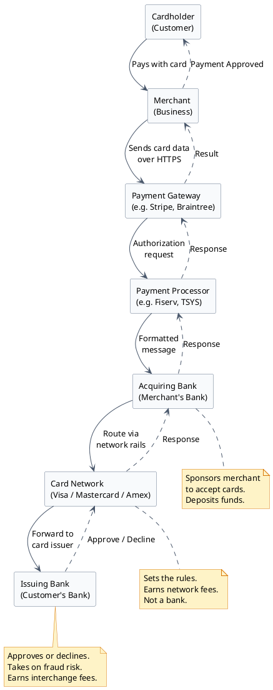
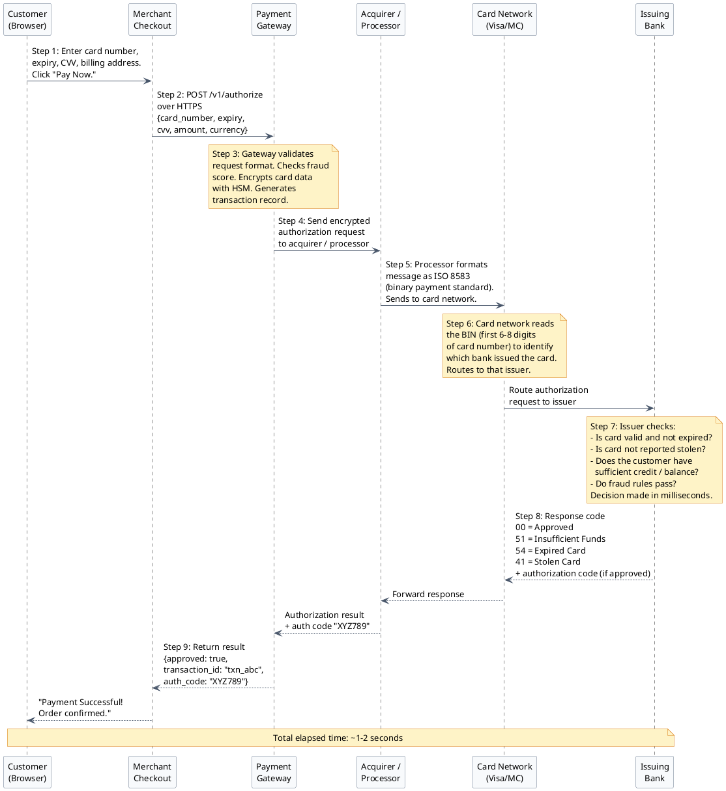
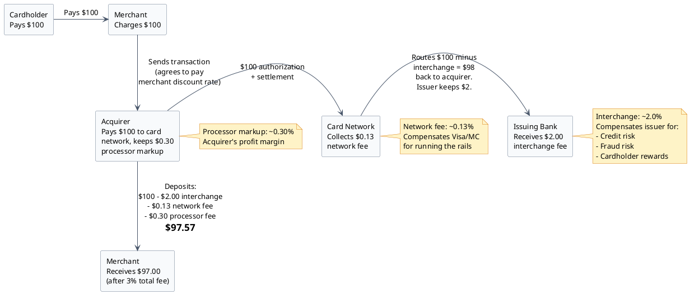
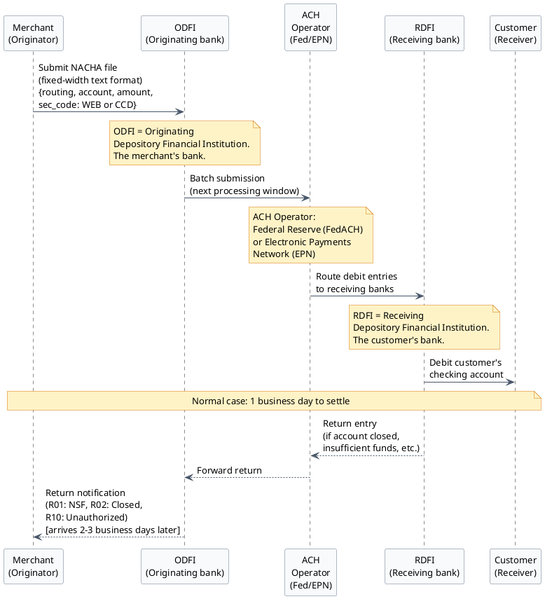
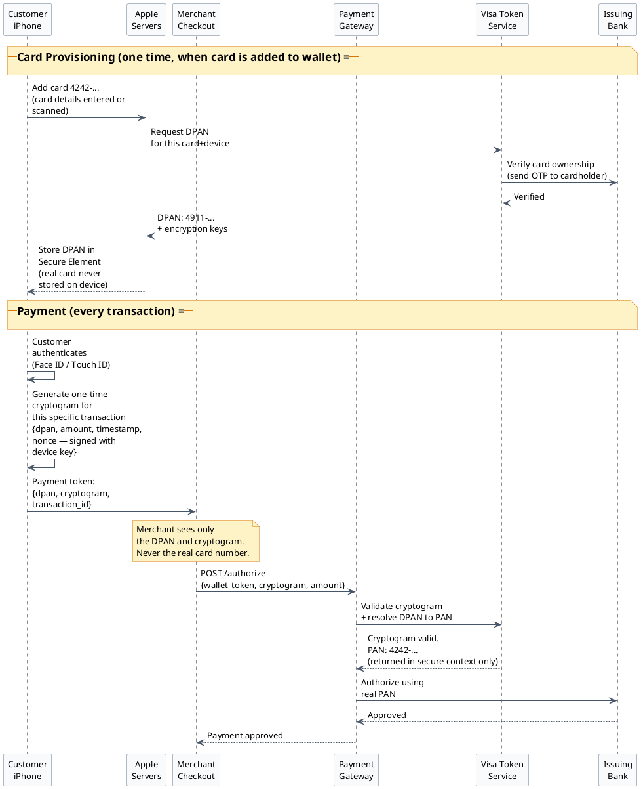
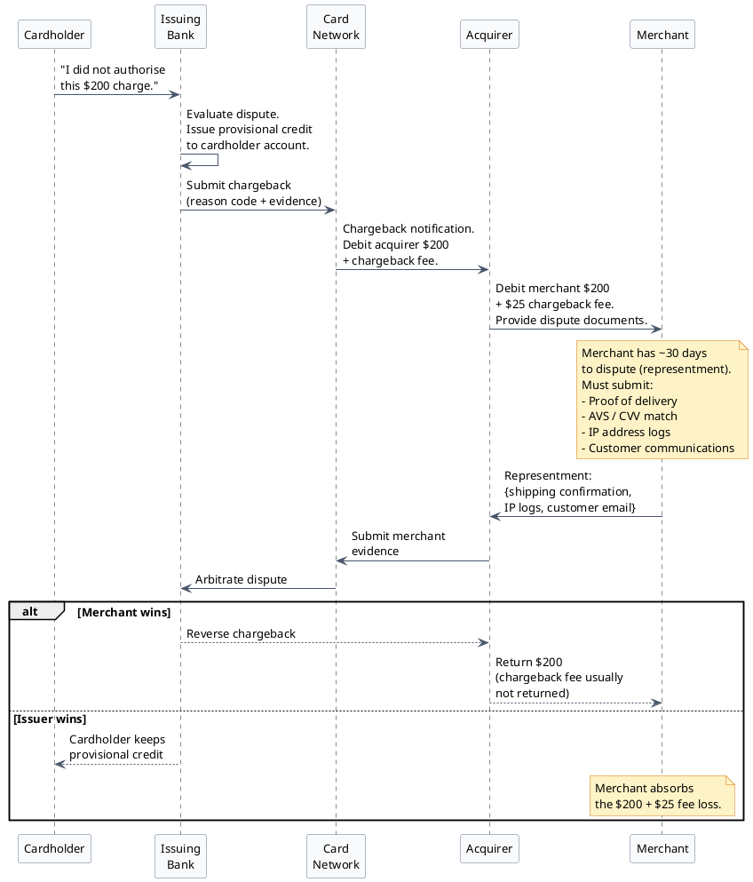

# Payment Ecosystem — From Scratch

:::note
This document is a ground-up explanation of the payment industry for developers with zero payments background. No prior knowledge is assumed. Read this before any technical system design document — the vocabulary and mental models here are used everywhere else in this series.
:::

---

## Section 1: The Parties

Every card payment involves multiple organisations working together. Most developers assume payments are a two-party interaction — the customer and the merchant. The reality involves at least six distinct parties, each playing a specific role that the others cannot replace.

Here is the full picture before we explain each one:



---

### The Cardholder

The customer — the person holding the card and making the purchase. They have a card issued by their bank (the issuing bank). Their only job in the transaction is to present their card details and, optionally, authenticate themselves (e.g., enter a PIN or approve an OTP).

The cardholder has no direct interaction with most of the parties below. They see the merchant's website and their bank's app. Everything in between is invisible to them.

---

### The Merchant

The business accepting payment. A merchant can be a global e-commerce platform, a local coffee shop with an online store, or a SaaS company charging monthly subscriptions.

To accept card payments, a merchant must sign a **Merchant Services Agreement** with an acquiring bank. This agreement grants them a **Merchant ID (MID)** — a unique identifier that travels with every transaction, telling the card network and issuer which business is charging the customer. Without a MID, a business simply cannot process card payments.

:::caution[Merchants cannot connect to card networks directly]
Card networks only work with licensed financial institutions. Getting direct access requires 12–18 months of technical certification, millions of dollars in infrastructure, and a regulatory licence. Even large retailers do not connect directly. They use an acquirer and processor to do it for them.
:::

---

### The Issuing Bank (Issuer)

The cardholder's bank — the institution that issued their card. Examples: Chase, Bank of America, Citibank, Barclays, HDFC Bank.

The issuer's role in every transaction:
- Decides whether to **approve or decline** the charge based on: card validity, available credit or balance, fraud rules, and real-time risk models.
- Bears the **credit risk** for credit card transactions (if the customer does not pay their bill, the issuer loses money).
- Bears the **fraud risk** for most transactions (if a stolen card is used, the issuer typically reimburses the cardholder and absorbs the loss — this is why issuers care so much about fraud detection).
- Earns **interchange fees** on every approved transaction as compensation for taking on this risk.

---

### The Acquiring Bank (Acquirer)

The merchant's bank. Examples: Wells Fargo, JPMorgan Chase (as acquirer), Worldpay, Fiserv.

The acquirer's role:
- Sponsors the merchant's access to the card networks.
- Receives the authorization request from the processor and routes it to the card network.
- At the end of the settlement process, **deposits the payment into the merchant's bank account** (minus fees — typically 1 business day to 3 business days after the transaction).
- Bears risk if the merchant goes bankrupt after receiving payments (the acquirer has to return money to cardholders who were charged for goods never delivered).

---

### The Card Network

Visa, Mastercard, American Express, Discover. These are the **rails** — the global infrastructure that connects every issuing bank to every acquiring bank.

What card networks are **not**: they are not banks. Visa does not issue your card (your bank does). Visa does not hold your money (your bank does). Visa provides the plumbing and sets the rules.

What card networks **do**:
- Maintain the global messaging infrastructure that routes authorization requests and responses in milliseconds.
- Set the rules that all issuers and acquirers must follow (including PCI DSS, 3DS requirements, chargeback rules).
- Earn a small **network fee** (separate from interchange) on every transaction.
- Publish the interchange fee tables that determine how much the acquirer must pay the issuer on each transaction.

:::note[Amex is different]
American Express operates as both the card network AND the issuing bank for most of its cards. This is called a "closed loop" network — Amex collects both the interchange fee and the interest income, which is why Amex historically charged higher merchant fees than Visa/Mastercard.
:::

---

### The Payment Gateway

Software (almost always a cloud service) that acts as the secure intermediary between a merchant's website and the banking system. Think of it as the digital equivalent of a card terminal at a physical store.

What the gateway does:
- Provides the merchant with an **API** (or hosted checkout form) to accept card data.
- Validates the request format and the merchant's credentials.
- **Encrypts the card data** before it goes anywhere else (using HSM-backed encryption).
- Runs the transaction through a **fraud detection engine**.
- Routes the encrypted authorization request to the right processor.
- Returns the approval/decline result to the merchant.
- Stores a **token** (a surrogate for the card number) so the merchant can charge the card again later without ever handling raw card data.

Examples of payment gateways: Stripe, Braintree, Adyen, Square, PayPal.

---

### The Payment Processor

The technical layer that speaks the card network's language. The processor formats the gateway's authorization request into the **ISO 8583** binary message format that Visa/Mastercard understand, sends it over the network, and translates the response back.

In many cases the acquirer and the processor are the same company (e.g., Fiserv is both a processor and an acquirer). In others, the acquirer contracts a third-party processor. The distinction matters for system design: the processor is the **technical integration point** while the acquirer is the **financial relationship**.

---

## Section 2: How Authorization Works — Step by Step

Authorization is the process of asking the issuing bank: "Will you approve a charge of $X on this card?" Nothing about this process moves money. It is purely a question and answer.

The entire sequence takes **1–2 seconds** for a typical online transaction.



---

### Step-by-Step Breakdown

**Step 1 — Customer enters card details**
The customer types their 16-digit card number, expiry date, and CVV into the checkout form. If the merchant uses a gateway-hosted JavaScript SDK (recommended), the card data is captured directly by the gateway's secure script — the merchant's server never sees the raw numbers.

**Step 2 — Merchant sends to gateway**
The merchant's checkout code calls the gateway's API with the card token (if using hosted fields) or card data. The request travels over HTTPS.

**Step 3 — Gateway validates and encrypts**
The gateway validates the request structure, runs the transaction through a fraud scoring engine (checking velocity, device fingerprints, address mismatches, etc.), and encrypts the card data using the HSM before it moves further. This step typically takes 30–100ms.

**Step 4 — Gateway sends to processor**
The encrypted authorization request is forwarded to the acquirer's processor.

**Step 5 — Processor formats the message (ISO 8583)**
ISO 8583 is the international standard for financial transaction messages — think of it as a very specific telegram format defined by the industry. It uses fixed-length binary fields. Field 2 is the card number. Field 4 is the transaction amount. Field 37 is the retrieval reference number. There are over 100 defined fields. The processor translates the gateway's structured API request into this legacy binary format.

**Step 6 — Card network routes to issuer using the BIN**
The BIN (Bank Identification Number) is the first 6–8 digits of the card number. For example, cards starting with `4` are Visa. Cards starting with `5` are Mastercard. Within Visa, `411111` maps to a specific issuing bank. The card network maintains a global BIN table and uses it to route the authorization request to the correct issuing bank in milliseconds.

**Step 7 — Issuer makes the decision**
The issuer's authorization system (running 24/7, often processing thousands of decisions per second) evaluates the transaction against rules and models. This is the single most important decision point in the entire flow. The issuer either approves or declines.

**Step 8 — Response travels back**
The response code travels back through the same chain: Issuer → Card Network → Processor → Gateway. Common response codes: `00` (Approved), `51` (Insufficient Funds), `54` (Expired Card), `14` (Invalid Card Number), `41` (Lost Card), `43` (Stolen Card), `05` (Do Not Honor — catch-all decline).

**Step 9 — Merchant receives result**
The gateway returns a structured response to the merchant's server, which displays the result to the customer.

:::tip[The authorization code is proof of approval]
When an authorization is approved, the issuer returns an **authorization code** (e.g., "XYZ789"). This 6-character alphanumeric string is the issuer's binding commitment to pay. If a dispute arises later, the merchant presents this code as evidence that the issuer approved the transaction. Merchants should always store this code alongside every transaction record.
:::

---

## Section 3: Authorization vs Capture vs Settlement

This is the concept that confuses most developers new to payments. When a customer clicks "Pay Now" and sees "Payment Successful," **no money has moved.** The merchant has received a promise, not cash. Let us walk through the complete lifecycle.

```plantuml
@startuml
skinparam backgroundColor #ffffff
skinparam Shadowing false
skinparam DefaultFontName Arial
skinparam DefaultFontSize 13
skinparam ArrowColor #475569
skinparam rectangleBorderColor #64748b
skinparam rectangleBackgroundColor #f8fafc
skinparam classBackgroundColor #f8fafc
skinparam classBorderColor #64748b
skinparam interfaceBackgroundColor #ecfdf5
skinparam interfaceBorderColor #10b981
skinparam noteBackgroundColor #fef3c7
skinparam noteBorderColor #d97706

concise "Customer's Card" as CC
concise "Merchant's Account" as MA
concise "Settlement Batch" as SB

@0
CC is "Hold: -$100\n(funds reserved,\nnot transferred)"
MA is "No funds\nreceived yet"
SB is "Empty"

@+1
CC is "Hold: -$100\n(still reserved)"
MA is "No funds\nreceived yet"
SB is "Capture queued:\n$100 for txn_abc"

note over CC, SB : T+1 hour:\nMerchant ships order.\nSends CAPTURE request.\nFinalises the charge.

@+8
CC is "Hold released.\nFunds transferred\nout in batch."
MA is "Awaiting\nfunding"
SB is "Batch file sent\nto card network.\n$100 included."

note over CC, SB : T+end of day:\nSettlement batch runs.\nAll captured transactions\nbundled into one file\nand sent to card network.

@+58
CC is "Transaction\ncomplete."
MA is "$97.20 deposited\n($100 minus 2.8% fee)"
SB is "Settled"

note over CC, SB : T+2 business days:\nAcquirer deposits funds\nminus merchant discount rate.

@enduml
```

---

### Authorization — The Hold

**What it is:** The issuer places a temporary hold on the customer's available credit or balance. The customer can see the pending charge on their bank app immediately.

**What it is not:** A transfer of money. The money is still in the customer's account — it is simply earmarked and unavailable for other purchases.

**How long it lasts:** Authorization holds typically expire after 7 days (credit cards) or 3 days (debit cards) if no capture is submitted. If the merchant never captures, the hold evaporates and the customer's funds are released.

**Real-world example:** When a hotel checks you in, they authorize $500 on your card to cover the room plus potential incidentals. They do not know your final bill yet. The hold reserves the funds. At checkout, they capture the actual amount ($350 for a 3-night stay). The hold releases and only $350 is captured.

---

### Capture — The Commitment

**What it is:** The merchant's instruction to the payment system: "We have delivered the goods/service. Please process the charge." A captured transaction is queued for settlement.

**Auth + Capture together:** Most e-commerce transactions authorize and capture simultaneously (the merchant is ready to ship and wants the money). This is called an **auth-capture** or **sale** transaction.

**Capture only:** Used when auth was done separately (hotel, car rental, fuel dispensers). The capture amount can be less than the authorized amount but typically cannot exceed it without the issuer's permission.

---

### Settlement — The Batch

**What it is:** Once per day (typically at night), the processor bundles all of a merchant's captured transactions into a **settlement file** and sends it to the card network. The card network orchestrates the actual inter-bank transfer: the issuing banks pay the acquiring bank the sum of all settled transactions.

**Why batch and not real-time?** Historically, inter-bank transfers ran on batch mainframe systems overnight. The infrastructure was built for this pattern decades ago. Visa/Mastercard are modernising toward real-time settlement, but batched overnight settlement remains the dominant model for most card transactions as of 2026.

---

### Funding — The Deposit

**What it is:** The acquirer receives the funds from the card network and deposits them into the merchant's bank account, minus the **merchant discount rate** (the fees).

**Timeline:** Typically 1–3 business days after settlement. The specific timing depends on the merchant's contract with the acquirer.

:::note[Merchant discount rate explained]
The "merchant discount rate" is the total fee the merchant pays on each transaction. It is composed of:
- **Interchange fee**: goes to the issuing bank (~1.5–2.5% for credit, ~0.5% for debit)
- **Network fee**: goes to Visa/Mastercard (~0.13%)
- **Processor/acquirer markup**: the processor's profit (~0.1–0.5%)
- **Gateway fee**: flat per-transaction fee ($0.05–$0.30)

A merchant paying "2.9% + $0.30" (Stripe's standard rate) is actually paying a bundled price that covers all of the above.
:::

---

## Section 4: Transaction Types

Not every payment is a simple "charge the card." The payment ecosystem defines several distinct transaction types, each with different behaviour and use cases.

| Transaction Type | What It Does | When to Use |
|-----------------|--------------|-------------|
| **AUTH_ONLY** | Reserves funds on the card without capturing. No money moves. | Hotels, car rentals, gas stations — when final amount is unknown at the time of purchase. |
| **AUTH_CAPTURE** | Authorizes and immediately captures in one step. Money will move at settlement. | Standard e-commerce where goods are in stock and ready to ship. |
| **CAPTURE** | Finalizes a previously issued AUTH_ONLY. Queues funds for settlement. | Merchant ships order and now knows the exact amount to charge. |
| **VOID** | Cancels an authorization or capture **before** it is settled. Free — no interchange fee. | Customer cancels before shipment; merchant discovers fraud before settlement. |
| **REFUND** | Returns money to the customer **after** settlement has occurred. Takes 1–5 business days. | Customer returns goods after payment was settled. Merchant loses interchange fees. |
| **CREDIT** | Sends money to a customer's card without any prior charge. | Payout platforms, refunds on cards where original transaction no longer exists. Considered high-risk; requires special acquirer approval. |

:::tip[Always VOID instead of REFUND when possible]
A void is free. A refund costs the merchant the interchange fee — they paid 2.5% to charge the customer and pay another 2.5% to give it back. If the settlement has not run yet (i.e., same business day), always void the transaction rather than refunding it. This is why payment systems expose a time-sensitive void window.
:::

:::caution[CREDIT transactions are high-risk]
An unrestricted credit transaction (sending money to a card without a prior charge) can be used for money laundering. Acquirers require special approval for this capability and monitor it closely. Most merchants never need it.
:::

---

## Section 5: Card Types and Their Differences

All cards look the same physically but behave very differently in the payment network.

### Credit Cards

The issuer extends a line of credit to the cardholder. The customer spends now and repays later. Key characteristics:
- **Higher interchange fees** (~1.5–2.5%) because the issuer is extending credit and taking on default risk.
- Authorization holds can last up to 7 days.
- Chargeback rights are stronger — consumers can dispute transactions up to 120 days after statement date.
- Rewards cards (cashback, points) carry even higher interchange fees because the issuer funds the rewards program from that fee.

### Debit Cards

Funds are debited directly from the cardholder's bank account. No credit extended. Key characteristics:
- **Lower interchange fees** (~0.05–0.5%) because there is no credit risk. The Durbin Amendment (US, 2011) capped debit interchange at $0.21 + 0.05% for banks with > $10B in assets.
- Authorization holds on debit cards are capped at **3 business days** — a hotel cannot hold your bank account funds for a week.
- Two processing networks: signature debit (processed through Visa/MC rails, higher fees) and PIN debit (processed through separate PIN networks like STAR, Pulse — lower fees).

### Prepaid Cards

A card loaded with a fixed amount of funds. No bank account attached, no credit extended. Key characteristics:
- Used for gift cards, government benefit disbursements, payroll cards.
- Same interchange fee structure as debit cards.
- Cannot be charged more than the loaded balance — no overdraft.
- Higher fraud risk because they are often purchased with cash and have no identity verification.

### Corporate / Purchasing Cards

Cards issued to employees for business purchases. Key characteristics:
- Different (often higher) interchange rates.
- Require **Level 2 and Level 3 data** for lower interchange rates — fields like customer code, sales tax amount, item descriptions, commodity codes. Merchants who pass this enhanced data get a discounted interchange rate.
- Used heavily in B2B payments where detailed line-item data is needed for expense reporting.

:::note[Why do interchange rates vary so much?]
Interchange is risk-based pricing. A premium rewards credit card has higher interchange than a basic debit card because the issuer takes on more risk (credit exposure, fraud liability, rewards cost). A card-present transaction (physical swipe/chip/tap) has lower interchange than a card-not-present transaction (online) because the physical card reduces fraud risk. There are over 300 interchange categories defined by Visa alone.
:::

---

## Section 6: Interchange Fees — The Economics of Payments

Interchange is the single largest cost in accepting card payments and the most misunderstood. Let us trace exactly who pays whom and why.

### The Flow of Fees on a $100 Transaction



### Why Does Interchange Exist?

Interchange compensates the issuing bank for three costs it bears:

1. **Credit risk**: For credit cards, the issuer has extended credit. If the cardholder does not pay their bill, the issuer loses the $100 — not the merchant, not the acquirer. The interchange fee is partial compensation for that risk.

2. **Fraud risk**: If a stolen card is used at a merchant and the transaction goes through, the issuer reimburses the cardholder. In most cases the issuer absorbs that loss. The interchange fee offsets fraud losses.

3. **Rewards cost**: Premium rewards cards (1% cashback, airline miles) cost the issuer money on every transaction. A portion of the interchange fee funds the rewards program. This is why rewards cards have higher interchange rates than basic cards.

:::caution[Merchants cannot negotiate interchange directly]
Interchange rates are set by Visa and Mastercard — they are non-negotiable. What merchants CAN negotiate is the processor markup and gateway fee portions of their merchant discount rate. When a payment processor advertises "competitive rates," they are competing on their markup, not on interchange. Interchange is the same for everyone.
:::

### Interchange vs. Merchant Discount Rate

| Component | Who Sets It | Who Receives It | Typical Amount |
|-----------|-------------|-----------------|----------------|
| Interchange fee | Visa / Mastercard | Issuing bank | 0.05% – 2.5% |
| Network fee (assessment) | Visa / Mastercard | Card network | ~0.13% |
| Processor markup | Your payment processor | Acquirer / processor | 0.1% – 0.5% |
| Gateway fee | Your gateway | Gateway provider | $0.05 – $0.30 flat |
| **Merchant discount rate** | Negotiated with processor | Distributed above | **~2.5% – 3.5% total** |

---

## Section 7: PCI DSS — The Security Rules

### Background

In the early 2000s, a series of massive card data breaches exposed the payment industry's security gaps. In 2004, Visa, Mastercard, American Express, Discover, and JCB jointly created the **PCI Security Standards Council** and published the **Payment Card Industry Data Security Standard (PCI DSS)**.

PCI DSS is a set of technical and operational security requirements that apply to **any organisation that stores, processes, or transmits cardholder data**. This includes merchants, payment gateways, processors, and any third-party service provider in the chain.

Compliance is not optional — it is a contractual requirement embedded in every merchant services agreement. Violating PCI DSS can result in fines, increased transaction fees, and termination of the ability to accept card payments.

### The Four Compliance Levels

| Level | Transaction Volume | Annual Audit Requirement |
|-------|--------------------|--------------------------|
| Level 1 | > 6 million Visa/MC transactions per year, OR any organisation that has suffered a breach | Full on-site audit by a **Qualified Security Assessor (QSA)** — an independent, certified external auditor. Also requires quarterly network vulnerability scans by an **Approved Scanning Vendor (ASV)**. |
| Level 2 | 1 million – 6 million transactions/year | Annual Self-Assessment Questionnaire (SAQ) + quarterly ASV scans |
| Level 3 | 20,000 – 1 million e-commerce transactions/year | Annual SAQ + quarterly ASV scans |
| Level 4 | < 20,000 e-commerce transactions/year | Annual SAQ recommended; quarterly ASV scans recommended |

### The 12 PCI DSS Requirements (Summary)

PCI DSS v4.0 (current as of 2024) organises its requirements into 12 high-level categories:

| # | Requirement | Plain-English Summary |
|---|-------------|----------------------|
| 1 | Install and maintain network security controls | Firewalls between the card data environment and the internet |
| 2 | Apply secure configurations to all system components | No default passwords; disable unnecessary services |
| 3 | Protect stored account data | Encrypt stored PANs; **never store CVV at all** |
| 4 | Protect cardholder data with strong cryptography during transmission | TLS 1.2+ for all transmissions |
| 5 | Protect all systems against malware | Antivirus on all systems that could be affected by malware |
| 6 | Develop and maintain secure systems and software | Patch management; secure coding practices |
| 7 | Restrict access to system components by business need to know | Role-based access control |
| 8 | Identify users and authenticate access to system components | Unique IDs; MFA for admin access |
| 9 | Restrict physical access to cardholder data | Data centre physical security |
| 10 | Log and monitor all access to system components | Audit logs; real-time alerts |
| 11 | Test security of systems and networks regularly | Penetration testing; vulnerability scanning |
| 12 | Support information security with organisational policies | Written security policies; incident response plan |

### The Critical Rule for Developers

:::danger[Never store CVV — ever, under any circumstances]
The CVV (the 3-digit code on the back of the card, or 4-digit for Amex) **must never be stored after the authorization request is submitted** — not in a database, not in a log file, not in a temporary variable that gets logged, not encrypted. The PCI DSS prohibition is absolute.

If your application logs entire request bodies (a common development practice), you **must** mask the CVV field before writing to the log. Many compliance breaches have occurred because a developer enabled verbose request logging and forgot that CVV was in the request body.
:::

### SAQ A vs. SAQ D

The Self-Assessment Questionnaire (SAQ) has multiple variants depending on how the merchant interacts with card data. Two matter most for developers:

**SAQ A — Redirect / Hosted Checkout (~22 questions)**
Applies to merchants who fully outsource card data handling to a PCI-certified gateway. The merchant's website never receives, processes, transmits, or stores card data — it only redirects the customer to the gateway's hosted page (or uses a gateway JavaScript widget that handles input directly). This is the simplest path. The merchant has minimal PCI obligations.

**SAQ D — Full card data handling (~329 questions)**
Applies to merchants whose systems directly receive and process card data — e.g., building a custom payment form that posts card numbers to their own server before forwarding to the gateway. This requires answering all 329 questions across all 12 requirement categories. It is a significant compliance burden that most merchants avoid by using SAQ A-eligible integration patterns.

:::tip[Use hosted fields to stay in SAQ A scope]
The single most impactful architectural decision for PCI compliance is using the gateway's **hosted fields / hosted payment page** rather than building your own card input form. With hosted fields, the card data is captured by the gateway's JavaScript running in an iframe on the gateway's domain — it never touches the merchant's server. This keeps the merchant in SAQ A scope, which is dramatically simpler to satisfy.
:::

---

## Section 8: ACH and Bank Transfers

### What Is ACH?

**ACH (Automated Clearing House)** is the US domestic inter-bank transfer network operated by **Nacha** (formerly NACHA — National Automated Clearing House Association). It processes direct deposits, bill payments, business-to-business transfers, and consumer bank debit transactions.

Unlike card networks, ACH does not process in real time. It is a **batch processing system** that runs at scheduled windows throughout the day (typically 3–6 times per business day) and settles on the next business day.

### How ACH Works



### ACH vs. Card Payments — Key Differences

| Property | ACH (Bank Transfer) | Card Payment |
|----------|---------------------|--------------|
| Processing speed | 1–3 business days | ~1–2 seconds |
| Cost | ~$0.25 flat fee | ~1.5–3% of amount |
| Return window | Up to 60 days (unauthorized) | 60–120 days (chargeback) |
| Best for | Large amounts, known customers | Any amount, any customer |
| Reversal risk | High — returns arrive days later | Lower — disputes have process |
| Requires | Bank routing + account number | Card number, expiry, CVV |

### SEC Codes — Types of ACH Transactions

ACH entries are classified by **SEC (Standard Entry Class) codes** which define the type of transaction and the required authorization:

| SEC Code | Meaning | Authorization Required |
|----------|---------|----------------------|
| WEB | Internet-initiated debit | Online authorization (click-through agreement) |
| CCD | Corporate credit or debit | Written authorization |
| PPD | Prearranged payment and deposit | Written or oral authorization |
| TEL | Telephone-initiated | Oral authorization |
| IAT | International ACH transaction | Special rules apply |

:::caution[ACH returns can arrive up to 60 days later for unauthorized transactions]
For most return codes (insufficient funds, account closed), the return arrives 2–3 business days after submission. However, for Return Code **R10 (Customer Advises Not Authorized)**, the RDFI has up to **60 days** from the settlement date to return the entry. This means a merchant can receive a reversal two months after they thought the payment succeeded. ACH is not suitable for high-risk merchants or one-time anonymous customer transactions for this reason.
:::

:::tip[ACH is ideal for recurring billing of known customers]
Insurance companies, utilities, SaaS platforms, and subscription services are the primary users of ACH. They have a relationship with the customer, have collected a written ACH authorization, and process recurring payments of consistent amounts. The low cost ($0.25 vs. 2.5%) becomes significant at scale — on a $1,000 monthly subscription, ACH saves $24.75 per month per customer compared to a credit card.
:::

---

## Section 9: Digital Wallets — Apple Pay, Google Pay, Samsung Pay

### The Core Problem Digital Wallets Solve

When you type your card number into an online form, that number exists — in transit and briefly in memory — across many systems. A single compromised system in that chain could expose your card number to attackers who could then use it on any other website.

Digital wallets solve this by ensuring **the real card number never leaves the wallet provider's secure servers during a purchase.**

### Device Account Numbers (DPAN) and Tokenisation

When you add a card to Apple Pay or Google Pay, the wallet provider performs a process called **card provisioning**:

1. You add your Visa card ending in 4242 to Apple Pay.
2. Apple communicates with Visa's token service and your issuing bank.
3. Visa generates a **Device Account Number (DPAN)** — a different 16-digit number that is unique to your device and your card (e.g., the DPAN might be `4911 2233 4455 6677`). This is also called a **Device Primary Account Number**.
4. This DPAN is stored in a secure chip on your iPhone called the **Secure Element**. Your real card number (`4242...`) is never stored on the device.



### The Cryptogram — Why Tokens Cannot Be Reused

Every Apple Pay / Google Pay transaction generates a **one-time cryptogram** — a short cryptographic signature tied to:
- The DPAN
- The transaction amount
- The merchant's identity
- A timestamp and random nonce

This cryptogram can only be used once. If an attacker intercepts the cryptogram, it is completely useless — it cannot be replayed for a different amount, a different merchant, or even the same transaction a second time. The card network's token service validates the cryptogram before processing.

Contrast this with a raw card number: if someone intercepts your card number, expiry, and CVV, they can use it at any online merchant anywhere in the world.

:::success[Digital wallets are more secure than card numbers]
For online purchases, using Apple Pay or Google Pay is objectively more secure than typing a card number. The DPAN + cryptogram model means:
1. The merchant never sees your real card number.
2. The token cannot be used at another merchant.
3. The cryptogram cannot be replayed.
4. Authentication (Face ID/Touch ID) verifies it is you.

This is why Apple Pay and Google Pay transactions have significantly lower fraud rates than standard card-not-present transactions.
:::

### What Changes for Merchants and Developers

From a technical perspective, digital wallet transactions flow through the same card authorization infrastructure as regular card transactions. The gateway resolves the DPAN back to a real PAN and processes a standard authorization. Merchants do not need to build separate integration logic for the actual authorization.

What merchants do need to implement:
- **Apple Pay**: Register a merchant identifier with Apple, host a domain verification file, and implement the Apple Pay JavaScript SDK on the checkout page.
- **Google Pay**: Implement the Google Pay JavaScript API. Register with Google as a merchant.
- Both: The checkout page renders the wallet payment button, handles the returned payment token, and passes it to the gateway API.

---

## Section 10: Chargebacks — The Merchant's Nightmare

### What Is a Chargeback?

A **chargeback** is a forced reversal of a transaction initiated by the cardholder's bank (the issuer), not by the merchant. It is a consumer protection mechanism — if a customer believes a charge was unauthorised, or if they did not receive the goods/services they paid for, they can dispute the charge with their bank.

When a chargeback is issued:
1. The issuer reverses the transaction amount from the acquirer.
2. The acquirer takes the money back from the merchant.
3. The merchant loses the revenue AND the goods (if already shipped) AND pays a **chargeback fee** ($15–$100 per dispute) to the acquirer.
4. The merchant has an opportunity to **dispute** the chargeback (called a "representment") by submitting evidence.



### Chargeback Reason Codes

Card networks define specific reason codes for chargebacks. Key categories:

| Category | Description | Example Reason Codes |
|----------|-------------|---------------------|
| Fraud | Cardholder claims they did not authorise the transaction | Visa: 10.4 (Card Absent Fraud) |
| Authorisation | Transaction processed without proper authorisation | Visa: 11.3 (No Authorisation) |
| Consumer dispute | Goods not received, not as described, cancelled subscription | Visa: 13.1 (Merchandise/Services Not Received) |
| Processing errors | Duplicate transaction, incorrect amount | Visa: 12.6 (Duplicate Processing) |

### The 1% Rule — Why Chargeback Rate Matters

Card networks track every merchant's **chargeback ratio** (chargebacks in a given month ÷ total transactions in that month). If this ratio exceeds 1%, the merchant is placed in a **chargeback monitoring programme**.

Consequences of high chargeback rates:
- Monthly fines from the card network ($50–$100 per chargeback over the threshold)
- Mandatory remediation programme with strict milestones
- If the ratio stays high for 6+ months: **merchant account termination** — the merchant can no longer accept Visa or Mastercard. Getting back on is extremely difficult.

:::danger[1% is the industry cliff]
A merchant processing 10,000 transactions per month can absorb 99 chargebacks before hitting the 1% threshold. At transaction 100, they are in a monitoring programme. The economics deteriorate rapidly — each chargeback costs $25–$100 in fees plus the revenue loss. A 2% chargeback rate on a $1M/month business means $20,000/month in disputed revenue plus $20,000–$50,000 in fees.
:::

### 3DS2 Liability Shift — The Most Important Fraud Rule

For card-not-present (online) transactions, the normal rule is: **if fraud occurs, the merchant pays the chargeback**. The issuer reimburses the cardholder and deducts the money from the acquirer, who deducts it from the merchant.

**3D Secure 2 (3DS2) changes this.**

When a merchant implements 3DS2 and the transaction passes 3DS authentication (whether the customer sees a challenge or it passes frictionlessly), the liability for fraud chargebacks **shifts from the merchant to the issuing bank**.

This is called the **liability shift**:

| Transaction Type | Fraud Occurs | Who Pays the Chargeback? |
|-----------------|--------------|--------------------------|
| No 3DS | Stolen card used | Merchant |
| 3DS2 frictionless (issuer-approved) | Stolen card used | **Issuing Bank** |
| 3DS2 challenge (customer authenticated) | Stolen card used | **Issuing Bank** |
| 3DS2 attempted but issuer unavailable | Stolen card used | **Issuing Bank** |

:::success[3DS2 is a win-win for low-risk merchants]
For most e-commerce merchants, 3DS2 is a net positive:
- Most transactions (80–90%) pass frictionlessly — no customer friction.
- Fraud chargebacks shift liability to the issuer.
- The issuer's fraud models may be better than the merchant's, resulting in fewer declines of legitimate transactions.
- The merchant pays no chargeback fees on fraud transactions that had 3DS2 liability shift.

The trade-off: 3DS2 adds a small amount of latency (~100ms) to the authorization flow, and a small percentage of transactions (5–15%) will trigger a visible challenge (OTP/biometric) which adds friction. For high-value, high-fraud categories (electronics, digital goods), this trade-off strongly favours enabling 3DS2.
:::

---

:::note[Next Steps]
Now that you understand the payment ecosystem — the parties, the flows, the economics, and the rules — you are ready to explore the technical architecture that powers it. Return to the overview document for the full system architecture, or proceed to the specific subsystem documentation relevant to your work.
:::

---

[← Payment Gateway HLD](/learnings/payment-gateway/hld/)
