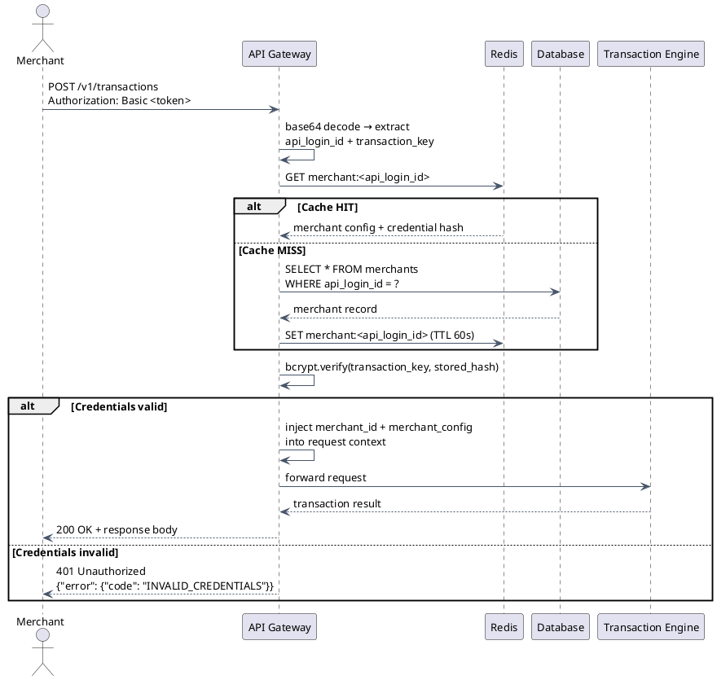
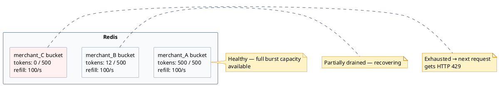
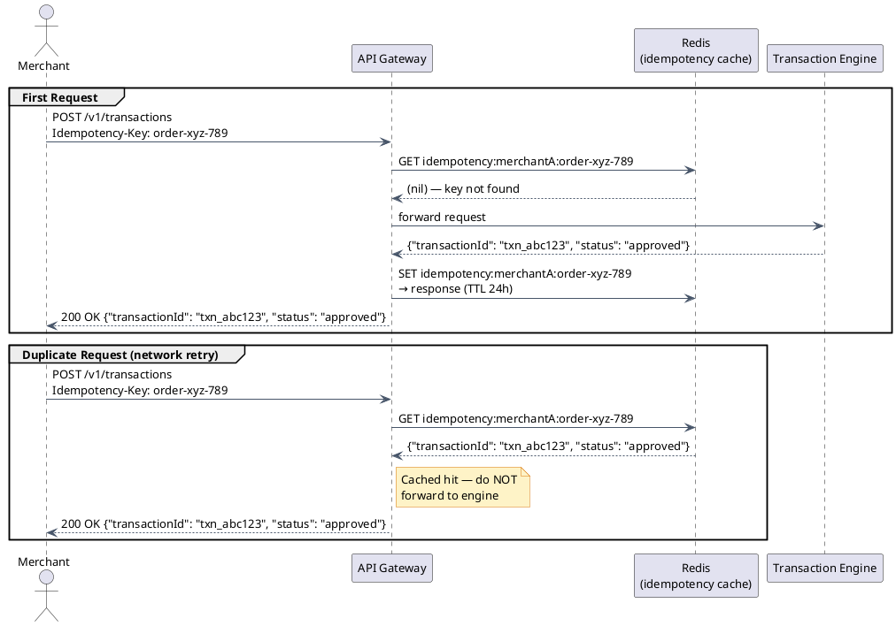

# API Gateway & Ingress Layer

Every payment system needs a front door — a single, hardened entry point that all merchant requests pass through before touching any backend service. That front door is the **API Gateway**.

---

## Section 1: What is an API Gateway and Why Payments Need One

Imagine a payment backend with five services: a transaction engine, a fraud scorer, a customer vault, a subscription billing engine, and a reporting service. Without a gateway, a merchant's integration would have to know about all five, authenticate to each one separately, and handle rate limiting — or rather, the total absence of it — on its own.

That approach breaks immediately in production:

- One compromised API key can hammer the transaction engine at full speed until the database collapses
- A single developer mistake on the merchant side can retry a failed request 10,000 times in a second
- Every service has to implement its own auth validation — duplicate code, divergent behavior, harder audits

The **API Gateway** solves this by sitting at the **edge of the system**: a single entry point that every merchant request hits first.

```
Merchant Application
        │
        ▼
  ┌──────────────┐
  │  API Gateway │  ◄── single entry point
  └──────┬───────┘
         │
    ┌────┴────┐
    ▼         ▼
Transaction  Customer
  Engine      Vault
```

The gateway owns the following responsibilities so that backend services don't have to:

| Responsibility | What it does |
|---|---|
| TLS termination | Decrypts HTTPS traffic at the edge; internal traffic can use lighter auth |
| Authentication | Validates every API credential before the request moves further |
| Rate limiting | Caps requests per merchant to prevent abuse or runaway retries |
| Idempotency | Detects duplicate payment requests and returns the cached result |
| Request routing | Sends requests to the correct backend based on merchant configuration |
| Request ID injection | Stamps every request with a unique trace ID for end-to-end observability |
| Abuse protection | Blocks IPs showing attack patterns before they reach application logic |

---

## Section 2: Authentication Flow

Every API request to the payment gateway carries an `Authorization` header using HTTP Basic Auth:

```
Authorization: Basic base64(api_login_id:transaction_key)
```

The `api_login_id` identifies the merchant. The `transaction_key` is the secret credential. Together, base64-encoded, they form the auth token. This is a simple scheme — what makes it secure is HTTPS (TLS), the fact that the transaction key is stored as a hash (never plaintext), and strict key rotation policies.

The gateway validates credentials in two stages:

1. **Redis lookup (hot path):** Merchant credentials are cached in Redis with a short TTL. Most requests never touch the database.
2. **DB fallback (cold path):** On a Redis miss (first request after TTL, cache eviction), the gateway reads from the database and re-warms the cache.



:::caution[Security: Never log the transaction key]
The transaction key must be scrubbed from all logs before the request is recorded. The API gateway must redact the `Authorization` header — and any field named `transaction_key`, `secret`, or `password` — before writing to any log sink. A leaked transaction key in a log aggregator is a critical security incident.
:::

---

## Section 3: Rate Limiting

### Why rate limiting matters in payments

Payment APIs are a natural target for two types of abuse:

1. **Runaway retries:** A merchant's broken retry loop fires 10,000 requests per second instead of 10. Without a cap, this takes down the transaction engine.
2. **Compromised key abuse:** An attacker with a stolen API key tries to brute-force card numbers by making thousands of small authorization attempts.

Rate limiting is the mechanism that caps how many requests any single merchant can send per unit of time.

### Token Bucket Algorithm

The gateway uses a **token bucket** per `merchant_id`, stored in Redis.

The mental model: each merchant has a bucket. Tokens fill into the bucket at a fixed rate. Each request spends one token. If the bucket is empty, the request is rejected.

```
Refill rate:   100 tokens / second
Max burst:     500 tokens  (bucket capacity)
Cost per req:  1 token
```

- A merchant sending 100 req/s can sustain this indefinitely — tokens refill as fast as they drain.
- A merchant sending 1,000 req/s for 500ms uses up all 500 burst tokens. The next request is rejected. Tokens refill at 100/s afterward.
- A merchant that sends nothing for 5 seconds accumulates the full 500 tokens, enabling a legitimate burst.



When a bucket hits zero, the gateway returns:

```
HTTP 429 Too Many Requests
Retry-After: 3
```

The `Retry-After` value tells the merchant exactly how many seconds to wait before retrying, enabling well-behaved clients to back off gracefully.

---

## Section 4: Idempotency

### The problem: double charges

Consider this sequence:

1. Merchant sends `POST /v1/transactions` for $29.99
2. Gateway forwards to the Transaction Engine
3. Transaction Engine charges the card — success
4. Network timeout: the response never makes it back to the merchant
5. Merchant's code retries the same request
6. Customer gets charged $29.99 **twice**

This is the most common and most damaging class of payment integration bug. The solution is **idempotency keys**.

### How it works

The merchant generates a UUID per order and sends it in every request for that order:

```
Idempotency-Key: order-xyz-789
```

The gateway stores the mapping:

```
(merchant_id, idempotency_key) → full response body
TTL: 24 hours
```

**First request:** Key is not in Redis. Forward to Transaction Engine, store the response, return it to the merchant.

**Duplicate request (retry):** Same key, same merchant. Hit is found in Redis. Return the stored response immediately — no processor call, no second charge.



:::note[Merchant implementation guidance]
The idempotency key must be generated **once per order** on the merchant side — not once per HTTP request. If the merchant generates a new UUID on every retry, idempotency is bypassed entirely and duplicate charges are back. The correct pattern is: generate the key when the order is created, persist it with the order record, reuse it on every retry attempt for that order.
:::

---

## Section 5: Request Routing

Not all merchants use the same backend system. A payment gateway typically has:

- A **legacy transaction engine** — the original processing system, battle-tested but hard to change
- A **new transaction service** — a modern microservice rewrite, being rolled out gradually

The API gateway reads `processing_system_id` from the merchant's config and routes accordingly:

```
merchant_config.processing_system_id = "legacy"  →  Legacy Transaction Engine
merchant_config.processing_system_id = "modern"  →  New Transaction Service
```

This means migrating a merchant from the old system to the new one is a **one-line config change** — no merchant-side code change, no downtime, no coordinated deploy.

:::tip[Strangler Fig Pattern]
This routing approach is a well-known migration pattern called the **Strangler Fig**. The idea: don't try to rewrite the entire old system at once. Build the new system in parallel. Route one merchant at a time to the new system. Validate. Route the next merchant. When all merchants are on the new system, the old one has been "strangled" out of existence — retired without a flag-day cutoff.

It's called Strangler Fig after the tropical vine that grows around a host tree, eventually replacing it entirely.
:::

---

## Section 6: API Design

The payment API is REST over HTTPS with JSON bodies. No SOAP, no binary protocols, no custom framing. Every request is stateless.

### Versioning

URLs are versioned: `/v1/transactions`, `/v2/transactions`.

Old versions are supported for **18 months** after a deprecation notice. This gives merchants time to migrate without breaking their integration overnight.

### Full API Contract

| Endpoint | Method | Description |
|---|---|---|
| `/v1/transactions` | POST | Create transaction (auth, auth+capture, credit) |
| `/v1/transactions/{id}` | GET | Get transaction details |
| `/v1/transactions/{id}/capture` | POST | Capture an auth-only transaction |
| `/v1/transactions/{id}/void` | POST | Void a transaction before settlement |
| `/v1/transactions/{id}/refund` | POST | Refund a transaction after settlement |
| `/v1/customers` | POST | Create a customer profile |
| `/v1/customers/{id}/payment-methods` | POST | Add a card to a customer profile |
| `/v1/customers/{id}/payment-methods/{pm}/charge` | POST | Charge a stored card |
| `/v1/subscriptions` | POST | Create a subscription |
| `/v1/subscriptions/{id}` | PATCH | Update a subscription |

### Request Body: POST /v1/transactions

```json
{
  "type": "authCapture",
  "amount": 2999,
  "currency": "USD",
  "idempotencyKey": "order-xyz-789",
  "card": {
    "number": "4111111111111111",
    "expiryMonth": 12,
    "expiryYear": 2027,
    "cvv": "123"
  },
  "billingAddress": {
    "zip": "94102",
    "country": "US"
  },
  "customerIp": "203.0.113.42"
}
```

A few design notes:
- `amount` is in the smallest currency unit (cents for USD, pence for GBP). Never floating point — floating point arithmetic on money is a well-known source of bugs.
- `currency` is an [ISO 4217](https://en.wikipedia.org/wiki/ISO_4217) code.
- `customerIp` is used downstream for fraud scoring.
- `idempotencyKey` in the body is a convenience alias for the `Idempotency-Key` header. Header takes precedence.

### Error Response Format

```json
{
  "error": {
    "code": "CARD_DECLINED",
    "message": "The card was declined by the issuing bank",
    "declineCode": "insufficient_funds",
    "transactionId": "txn_abc123"
  }
}
```

`code` is machine-readable. `message` is human-readable. `declineCode` is the processor's sub-reason. `transactionId` is always present when a transaction record was created, even on failure — it enables support lookup.

### Error Codes by Category

| HTTP Status | Category | Example Codes |
|---|---|---|
| 401 | Auth errors | `INVALID_CREDENTIALS`, `API_KEY_REVOKED`, `ACCOUNT_SUSPENDED` |
| 402 | Card errors | `CARD_DECLINED`, `CARD_EXPIRED`, `INSUFFICIENT_FUNDS`, `DO_NOT_HONOR` |
| 422 | Validation errors | `INVALID_CARD_NUMBER`, `MISSING_REQUIRED_FIELD`, `INVALID_AMOUNT` |
| 429 | Rate limit | `RATE_LIMIT_EXCEEDED`, `DAILY_LIMIT_REACHED` |
| 502/503 | Processor errors | `PROCESSOR_UNAVAILABLE`, `PROCESSOR_TIMEOUT`, `NETWORK_ERROR` |

---

## Section 7: DDoS & Abuse Protection

Per-merchant rate limiting (Section 3) handles organic abuse within the application. The gateway also needs to defend against network-level attacks before they consume any application resources.

| Protection | Mechanism | Threshold |
|---|---|---|
| IP-based rate limiting | Separate token bucket per source IP at the load balancer | 200 req/s per IP before throttling |
| SYN flood protection | TCP SYN cookies at the load balancer — prevents half-open connection exhaustion | Built into load balancer config |
| Request size limit | Reject requests larger than 64KB | Card data is always under 1KB; 64KB is generous for any legitimate payment request |
| Bot detection | Track authentication failures per IP in a sliding window | 10 failures in 60 seconds → temporary IP block (5 minutes) |

The request size limit deserves a note: a card authorization payload is a few hundred bytes at most. A 64KB request is almost certainly malformed, a fuzzing attempt, or an injection probe. Rejecting it at the edge is free — the application layer never sees it.

---

## Section 8: Tradeoffs

:::success[Advantages of a dedicated API Gateway layer]
- **Centralized auth:** No individual backend service needs credential validation logic. One change to auth policy applies everywhere immediately.
- **Rate limiting once:** Enforcement happens in one place. No need to re-implement per service.
- **Zero duplicate charges:** The idempotency cache runs before any processor call. The Transaction Engine never sees a duplicate request.
- **Routing flexibility:** Migrate merchants between processing systems one at a time, with no merchant-side changes and no downtime.
- **Unified observability:** Every request gets a trace ID injected at the edge. End-to-end tracing across all backend services works out of the box.
:::

:::caution[Disadvantages]
- **Extra network hop:** The gateway adds ~1–2ms of latency per request. For most payment flows, this is invisible. For ultra-low-latency use cases, it matters.
- **Single point of failure:** If the gateway goes down, no merchant can process payments. Minimum deployment: 3 instances behind a load balancer, with health checks and automatic failover. SLA depends on this.
- **Redis dependency:** Both rate limiting and idempotency require Redis. If Redis is unavailable, the gateway must decide: fail open (allow all requests, lose deduplication) or fail closed (reject all requests, hard outage). Most implementations fail open for rate limiting and fail closed for idempotency, since a missed rate limit is recoverable but a missed dedup can cause a double charge.
:::

---

[← Payment Gateway HLD](/learnings/payment-gateway/hld/)
