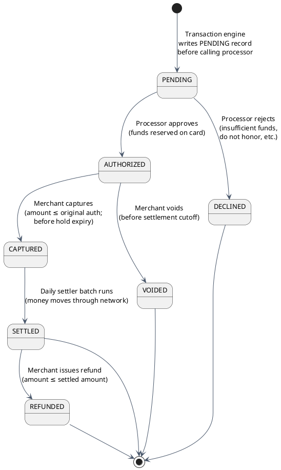
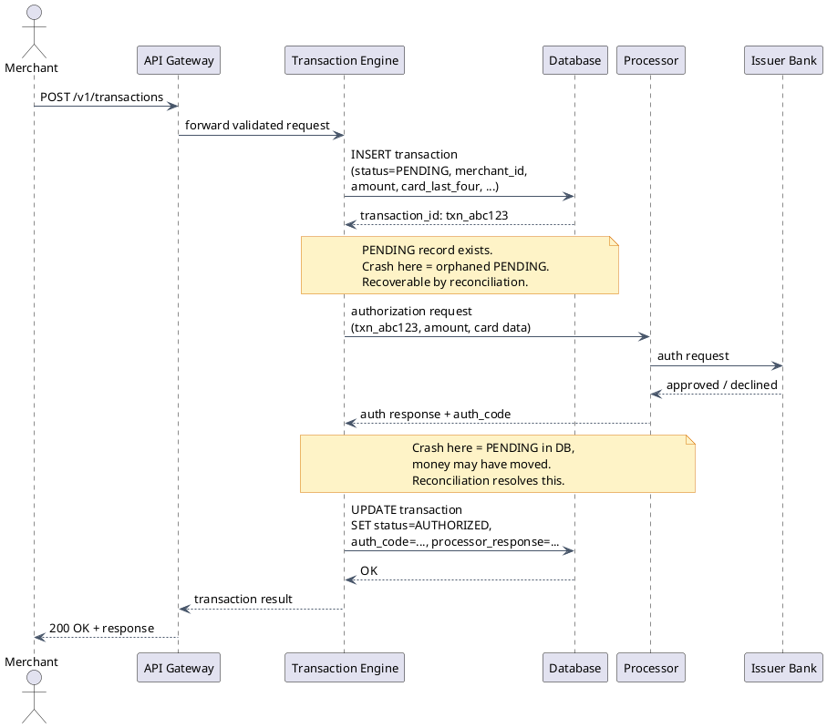
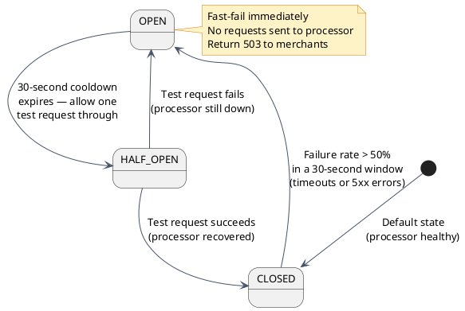

# Transaction Processing Engine

The Transaction Processing Engine is the core of the payment gateway. Once the API Gateway has authenticated the request and checked the idempotency cache, the request lands here. This is where the actual payment happens — the card gets authorized, money gets reserved, and eventually settled.

---

## Section 1: What the Transaction Engine Does

At a high level, the engine performs these steps for every payment request:

1. Load merchant configuration from cache
2. Check for duplicate transactions (database-level safety net)
3. Write a `PENDING` record to the database — **before calling the processor**
4. Call the card processor (Visa/Mastercard/Amex network)
5. Update the database record with the result
6. Return the response to the API gateway

Steps 3 and 4 are ordered deliberately. The PENDING write must come first. Why this matters is the most important design decision in the entire engine — covered in detail in Section 4.

---

## Section 2: Transaction Types Explained

Not all payments are the same operation. A hotel reservation has different mechanics than an online checkout. The engine supports these transaction types:

| Type | When to Use | What Happens |
|---|---|---|
| `authOnly` | You don't know the final amount at checkout time (hotels, car rentals, restaurants with variable tips) | Reserves funds on the cardholder's card without moving money. A "hold" is placed on their available balance. |
| `authCapture` | Standard e-commerce — you know the exact amount at checkout | Authorizes and captures in a single step. Most common type. The transaction is queued for settlement immediately. |
| `capture` | Finalizing an earlier `authOnly` | Locks in the final amount and queues for settlement. Must happen within the auth hold expiry window (7 days for Visa credit). |
| `void` | Cancelling a transaction before the daily settlement batch runs | Releases the hold immediately. No money moves. No cost. The cardholder sees the pending charge disappear. |
| `refund` | Returning money after the transaction has already settled | Creates a new credit transaction back to the cardholder's card. Takes 1–5 business days to appear. The original charge is not reversed — a new credit is added. |
| `credit` | Sending money to a card without a prior charge | High-risk operation. Used for payouts, winnings, or rebates. Disabled by default for most merchants — requires explicit enablement and underwriting. |

The critical distinction: **void** vs **refund**.

- A **void** happens before settlement. The pending charge is cancelled. The cardholder's held funds are released immediately. No fees.
- A **refund** happens after settlement. Money already moved. The refund creates a new credit transaction back through the network. There is a processing cost, and it takes days.

Merchants who can catch a needed reversal before the daily settlement cutoff should always prefer a void.

---

## Section 3: The Transaction State Machine

Every transaction moves through a defined set of states. Understanding this state machine is essential for debugging, building merchant dashboards, and writing settlement logic.



### State Descriptions

| State | Meaning | Settlement State (SS) |
|---|---|---|
| `PENDING` | Written to DB before the processor call. A safety marker. Not yet sent to the network. | — |
| `AUTHORIZED` | Processor approved. Funds are reserved ("held") on the cardholder's card. Money has NOT moved yet. | 0 |
| `CAPTURED` | Merchant has finalized the amount. Transaction is queued for the next settlement batch. | 1 |
| `SETTLED` | The settlement batch ran. Money has moved through the card network from issuer to acquirer to merchant. | 2 |
| `VOIDED` | Transaction was cancelled before settlement. The hold is released. No money moved. | — |
| `DECLINED` | Processor rejected the authorization. No hold, no charge. The cardholder is unaffected. | — |
| `REFUNDED` | A credit was issued back to the cardholder after settlement. Both the original charge and the credit appear on their statement. | — |

The `SS` (Settlement State) flag is what the daily settlement batch queries. It selects all records with `SS = 1` (CAPTURED) and moves them through the network.

---

## Section 4: Write-Before-Call — The Most Critical Design Decision

### What happens without it

Consider a simpler implementation that doesn't pre-write the PENDING record:

1. Call the processor
2. Processor approves — card is charged
3. **Gateway crashes before writing to the database**
4. No record exists anywhere in the system

The customer's card was charged. The merchant never sees the transaction. The money is gone with no trail. This is **silent money loss** — the worst class of payment system bug because it's invisible until the customer disputes the charge.

### The PENDING record pattern

The correct sequence:

```
1. Write PENDING record → assigns a transaction_id
2. Call the processor
3. Update record with result (AUTHORIZED or DECLINED)
```



### Crash recovery via reconciliation

If the engine crashes **between** the processor call and the DB update, the PENDING record exists but has no result. An operations process handles this:

1. Every 5 minutes, query the DB for all transactions in `PENDING` state older than 5 minutes
2. For each, call the processor's inquiry API: "Did transaction `txn_abc123` succeed?"
3. Update the DB based on the processor's answer

This is called **reconciliation**. The PENDING record is the anchor that makes it possible.

:::danger[Non-negotiable: always write PENDING before calling the processor]
Never call the processor before the PENDING record is committed to the database. This is the one rule in the transaction engine that cannot be traded off against latency, throughput, or simplicity. A crash between a successful processor call and a missing DB write means money moved with no record — and there is no automated way to detect it.
:::

---

## Section 5: Duplicate Transaction Detection

### Why it exists

The API Gateway's idempotency cache (covered in the API layer doc) is the first line of defense against duplicate charges. The transaction engine's duplicate detection is the **second line** — the safety net for cases where:

- The merchant didn't send an `Idempotency-Key`
- The idempotency key's 24-hour TTL expired but the merchant is still retrying
- A bug caused the gateway cache to be bypassed

### How it works

For every incoming request, the engine computes a deduplication key:

```
dedup_key = hash(merchant_id + amount + card_last_four + time_window_bucket)
```

The `time_window_bucket` is a 2-minute time bucket (e.g., `2026-08-02T14:22:00` — truncated to the 2-minute mark). This means two identical requests within the same 2-minute window share the same dedup key.

Before inserting the PENDING record, the engine checks the DB:

- **Key found:** Return the existing transaction result. No processor call.
- **Key not found:** Proceed normally.

### Race condition handling

What if two identical requests arrive simultaneously, both pass the initial key check, and both try to insert?

The database schema has a **UNIQUE index** on the dedup key column. One insert succeeds. The other hits a unique constraint violation. The "losing" request catches the exception, reads the record created by the "winning" request, and returns its result. The outcome is correct — one charge, two responses with the same transaction ID.

The duplicate window is **configurable per merchant**. Consider the tradeoff:

- **Window too short (e.g., 30 seconds):** A slow retry that arrives after the window misses the cache. Potential duplicate charge.
- **Window too long (e.g., 30 minutes):** A customer who genuinely makes the same purchase twice within 30 minutes gets an incorrect "duplicate detected" rejection.

Most merchants use 2–5 minutes. High-frequency merchants (e.g., subscription billing platforms making many identical small charges to different cards) need careful tuning.

:::note[Layer separation]
The `Idempotency-Key` header (API layer) and the engine's dedup detection serve different purposes. The idempotency key is explicit and controlled by the merchant — it's reliable when used correctly. The engine's dedup is implicit and heuristic — it catches what the idempotency key misses. They work together; neither is a substitute for the other.
:::

---

## Section 6: Processor Routing & Circuit Breaker

### Multiple processors

A payment gateway connects to multiple card networks and acquiring banks. The routing decision looks like:

- **Card type → network:** Visa cards route to the Visa network. Mastercard to the Mastercard network. Amex to American Express.
- **Merchant config → acquirer:** The merchant's processing agreement determines which acquiring bank's connection is used. Some large merchants have multiple acquirers for redundancy.

This routing happens inside the engine, transparently to the merchant.

### Circuit Breaker

Without a circuit breaker, a slow or failing processor causes a different kind of failure:

- Each request to the failing processor waits for the timeout (typically 10–30 seconds)
- At 5,000 transactions per second, 5,000 threads are blocked waiting
- Thread pool is exhausted in seconds
- The entire gateway stops processing — including requests to processors that are working fine

The **circuit breaker** prevents this by short-circuiting requests to a known-failing processor:



| State | Behavior | Transition |
|---|---|---|
| **CLOSED** | All requests flow to the processor. Failure rate is monitored. | → OPEN when failure rate exceeds threshold |
| **OPEN** | Requests are immediately rejected with 503. No network call is made. | → HALF-OPEN after cooldown period |
| **HALF-OPEN** | One test request is allowed through. All others still fail fast. | → CLOSED on success; → OPEN on failure |

The circuit breaker trades a brief guaranteed outage (fast-fail during OPEN) for preventing a catastrophic cascade (thread pool exhaustion bringing down the entire gateway).

---

## Section 7: Full Processing Sequence

Every transaction passes through these 8 steps in order. Each step is a named stage in the engine's pipeline — failures are tagged with the step name for observability.

```
Step 1: LoadMerchantConfig
  └─ Read merchant settings from Redis cache (DB fallback on miss)
  └─ Needed for: processor routing, rate limits, enabled transaction types, fraud thresholds

Step 2: ThrottleTestTraffic
  └─ Sandbox (test mode) transactions are rate-limited separately from live traffic
  └─ Prevents sandbox abuse from consuming processor sandbox quotas

Step 3: CheckDuplicateTransaction
  └─ Compute dedup key, check DB
  └─ Short-circuit: return existing result if duplicate found
  └─ This is the idempotency gate at the engine level

Step 4: InsertPendingRecord
  └─ Write PENDING transaction to DB
  └─ Assigns transaction_id
  └─ MUST succeed before Step 5 executes

Step 5: CallProcessor
  └─ Route to correct processor based on card type + merchant config
  └─ Send authorization request via circuit-breaker-wrapped call
  └─ Handle response: approved, declined, timeout, error

Step 6: UpdateTransactionRecord
  └─ Update DB: status, auth_code, processor_response_code, processor_message
  └─ Set settlement state: SS=1 (CAPTURED) for authCapture, SS=0 (AUTHORIZED) for authOnly

Step 7: InsertLineItems
  └─ Optional: store per-item details (product name, quantity, unit price)
  └─ Used for enhanced data reporting, Level II/III card processing, dispute evidence

Step 8: PostAuthFraudCheck
  └─ Re-score the transaction with post-authorization signals
  └─ If fraud score exceeds threshold: place transaction in REVIEW queue
  └─ Merchant can approve or void; if no action within N hours, auto-void
```

Steps 1–4 happen before any processor call. Steps 5–8 happen after. A failure in steps 1–3 returns an error to the merchant; the processor is never called. A failure in steps 6–8 after a successful step 5 goes through the reconciliation process (see Section 4).

---

## Section 8: Authorization Hold Expiry

When `authOnly` is used, the card network places a **hold** on the cardholder's available balance. That hold has an expiry:

| Network | Card Type | Hold Duration |
|---|---|---|
| Visa | Credit | 7 days |
| Visa | Debit | 3 days |
| Mastercard | Credit | Varies by MCC (merchant category code); typically 7–30 days |
| Amex | Credit | Typically 7 days |

After expiry, the hold is automatically released by the issuing bank — the cardholder's available balance returns to normal. The **merchant's authorization code is no longer guaranteed**.

If the merchant captures after the expiry:
- The processor may still process the capture request
- The issuing bank may approve it if sufficient funds exist at capture time
- But the hold is gone, and the funds are not reserved — approval is best-effort, not guaranteed

**System behavior:** The engine must track `auth_expiry_timestamp` on every `AUTHORIZED` record. A background job scans for uncaptured auths approaching expiry (e.g., within 24 hours) and sends alerts to the merchant via webhook or dashboard notification. This lets the merchant decide: capture now, or abandon the transaction.

---

## Section 9: Tradeoffs

### Auth-Only, then Capture

:::success[Auth-Only then Capture — Advantages]
- Capture only the **actual final amount** — essential when the amount isn't known at authorization time (tip-adjusted restaurant bills, hotel incidentals, car rental fuel charges)
- If fulfillment fails (item out of stock, booking cancelled), void instead of refund — faster and free
- Standard pattern for hospitality, automotive, and marketplace businesses
:::

:::caution[Auth-Only then Capture — Disadvantages]
- **Hold expiry risk:** 7-day Visa credit window. Merchants must capture within the window or lose the guarantee. Requires operational monitoring.
- **More complex merchant integration:** Two separate API calls per transaction instead of one. Error handling must cover the case where auth succeeds but capture fails.
- **Capture can fail after hold expires:** Even if the processor accepts the late capture, funds aren't guaranteed. The merchant may successfully charge a card that has insufficient funds now, and face a chargeback.
:::

### Auth+Capture in One Step

:::success[Auth+Capture — Advantages]
- **Simplest merchant integration:** One API call, one webhook, done. Works for 95% of standard e-commerce use cases.
- Faster to implement and reason about — no hold expiry tracking needed, no capture step to build
- Settlement queue entry is immediate on authorization approval
:::

:::caution[Auth+Capture — Disadvantages]
- **No review window before charging:** If fraud is detected post-auth, a refund is required instead of a free void. Refunds have processing costs and take 1–5 business days.
- **Amount cannot be reduced without a refund:** If you charge $30 but should have charged $25, you must refund $5 — creating two transactions on the cardholder's statement. With authOnly+capture, you just capture $25.
- **More expensive mistake recovery:** Any correction after settlement goes through the refund path. Voids are free; refunds are not.
:::

---

[← Payment Gateway HLD](/learnings/payment-gateway/hld/)
