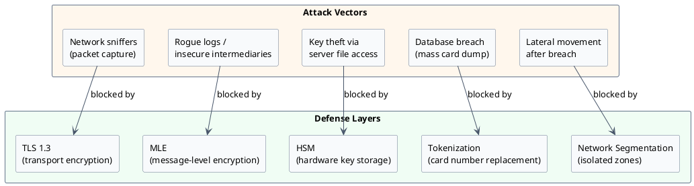
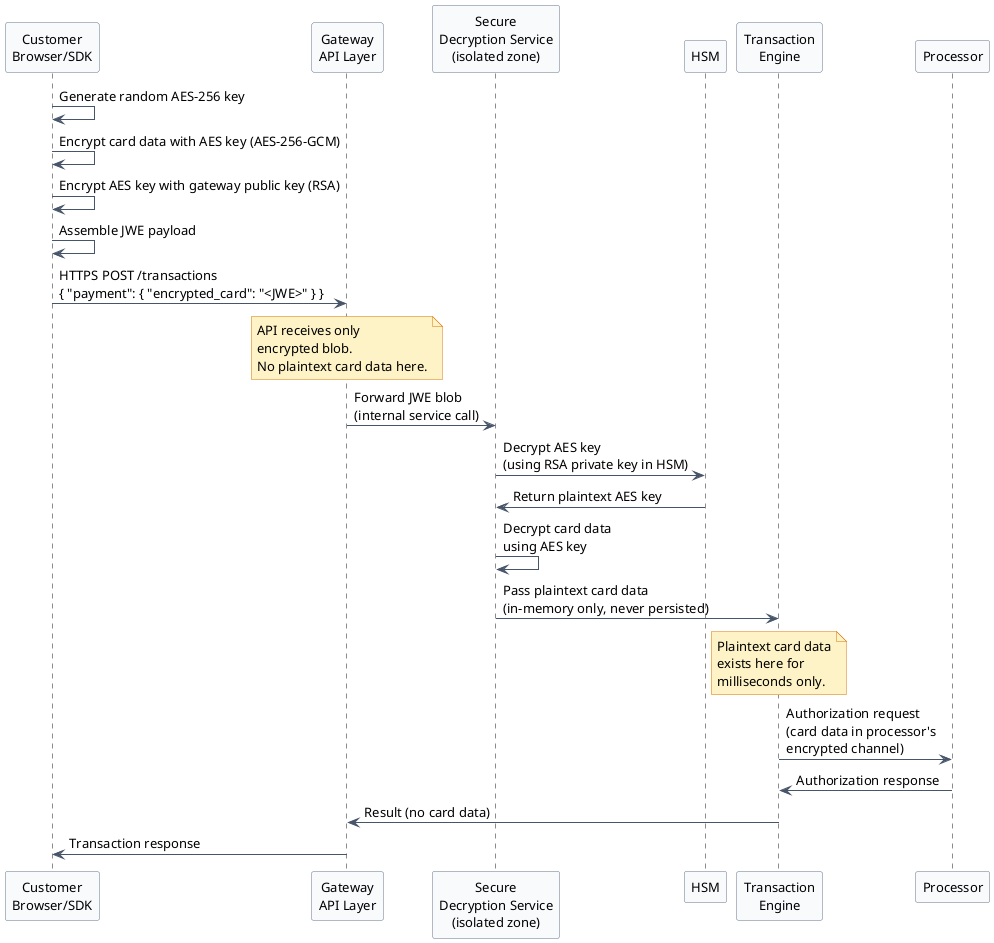
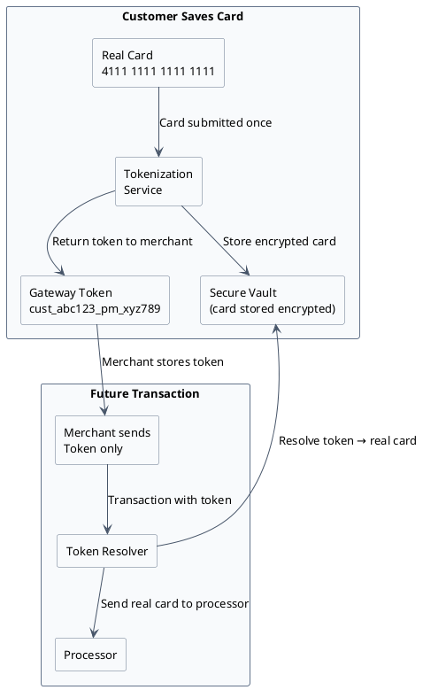
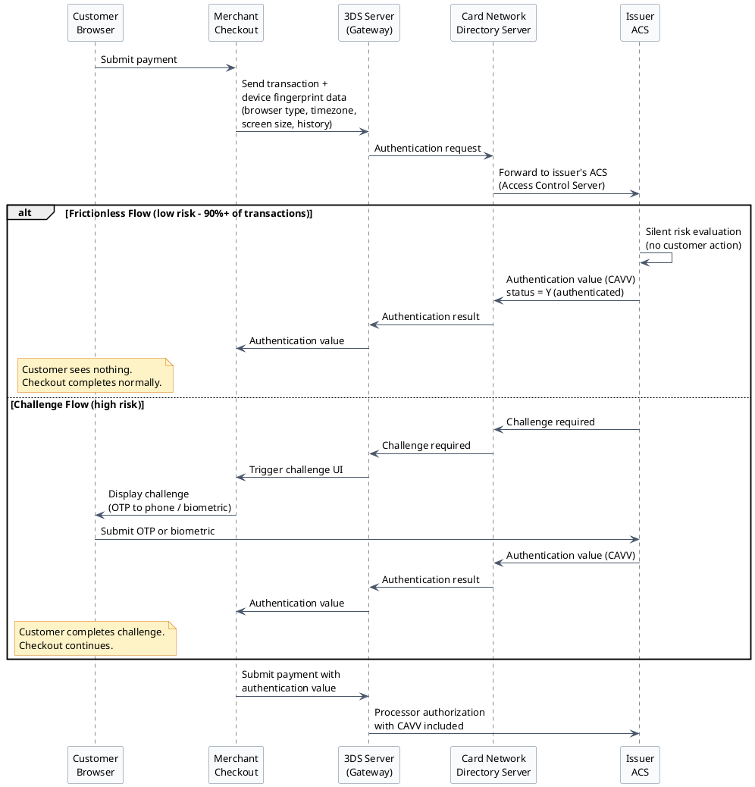

# Security, Encryption & PCI DSS

This document explains the security stack for a payment gateway from first principles. If you have never built a payment system before, start here before reading any architecture diagrams — the "why" matters as much as the "how."

---

## Section 1: Why Payment Data Is So Sensitive

Most sensitive data — passwords, social security numbers, health records — is sensitive in context. A stolen password is painful, but you can reset it. A stolen medical record is damaging, but monetizing it takes effort.

Card numbers are different. They are **universally reusable currency**.

- A card number (PAN), expiry date, and CVV are all a fraudster needs to make purchases anywhere online.
- Unlike passwords, card numbers are semi-permanent. The cardholder cannot change their PAN the way they reset a password — they must wait for their bank to issue a new physical card, which takes days.
- A single database breach can expose millions of cards that fraudsters can sell or use **immediately** on any e-commerce site worldwide.
- The damage scales linearly: 1 million stolen cards × $50 average fraudulent transaction = $50 million in potential fraud from one breach.

This is why payments have the most heavily regulated security requirements of any software domain.

---

## Section 2: PCI DSS Explained Simply

**PCI DSS** stands for **Payment Card Industry Data Security Standard**. It is a rulebook created jointly by Visa, Mastercard, American Express, and Discover in 2004 to standardize how card data must be protected.

:::note
PCI DSS is not a law — it is a contractual requirement. If you accept card payments, your merchant agreement obligates you to comply. Violation can result in fines from card networks and, ultimately, loss of the ability to accept card payments.
:::

**Who must comply:** Any entity that stores, processes, or transmits cardholder data — merchants, payment processors, gateways, hosting providers.

### The 12 Requirements (6 Goals)

| Goal | Requirements |
|---|---|
| Build and maintain a secure network | 1. Install and maintain firewalls. 2. No vendor-supplied default passwords. |
| Protect cardholder data | 3. Protect stored data (never store CVV; encrypt PAN at rest). 4. Encrypt data in transit. |
| Maintain a vulnerability management program | 5. Use and regularly update antivirus software. 6. Develop and maintain secure systems (patch regularly). |
| Implement strong access control | 7. Restrict access to cardholder data by business need. 8. Assign unique IDs to each person with computer access (no shared accounts). 9. Restrict physical access to cardholder data. |
| Monitor and test networks | 10. Track and monitor all access to network resources and cardholder data. 11. Regularly test security systems and processes (quarterly scans, annual pen test). |
| Maintain an information security policy | 12. Maintain a written policy that addresses information security. |

### Compliance Levels

The level determines HOW you prove compliance.

| Level | Who It Applies To | Compliance Requirement |
|---|---|---|
| Level 1 | More than 6 million transactions/year, OR any entity that has suffered a breach | Annual on-site audit by a QSA (Qualified Security Assessor) |
| Level 2 | 1 million–6 million transactions/year | Annual SAQ + quarterly network scans |
| Level 3 | 20,000–1 million e-commerce transactions/year | Annual SAQ + quarterly network scans |
| Level 4 | Fewer than 20,000 e-commerce or fewer than 1 million total transactions/year | Annual SAQ |

**SAQ** = Self-Assessment Questionnaire. The simpler your card data handling, the shorter the questionnaire.

- **SAQ A** (22 requirements): The simplest. For merchants using a **fully hosted checkout** — card data never touches their server. The gateway's checkout page handles everything.
- **SAQ D** (329 requirements): The hardest. For merchants whose servers directly handle raw card numbers.

**The developer takeaway:** Your primary job when designing merchant integrations is to keep merchants on SAQ A. Every architecture decision that prevents card data from touching the merchant's server reduces their compliance burden by an order of magnitude.

:::danger
**CVV must NEVER be stored after authorization.** Not in a database. Not in logs. Not in a cache. Not anywhere. This is PCI DSS Requirement 3.2.

If your application writes the full request body to a log file and that request contains a CVV, you are in violation — even if no one reads that log. Strip CVV from logs before writing. Violation leads to fines and loss of card acceptance privileges.
:::

---

## Section 3: Defense in Depth — Multiple Security Layers

No single security control is sufficient. The industry uses a **layered defense** model: even if an attacker defeats one layer, they encounter the next. Think of it as nested envelopes.

```
Layer 1: TLS             — encrypts data in transit (the outer envelope)
Layer 2: MLE             — encrypts card data inside the payload (envelope inside envelope)
Layer 3: HSM             — protects encryption keys in tamper-proof hardware
Layer 4: Tokenization    — replaces card numbers with meaningless tokens
Layer 5: Network segmentation — sensitive services in isolated network zones
```

Each layer addresses a different attack vector:



---

## Section 4: TLS — Transport Layer Security

Every HTTPS connection uses TLS. The "S" in HTTPS stands for SSL/TLS (SSL was the predecessor; TLS replaced it, but the term SSL is still commonly used colloquially).

**What TLS does:** It creates an encrypted tunnel between the client (browser or SDK) and the server. Even if an attacker intercepts packets on the network (a "man in the middle"), they see only encrypted ciphertext — unreadable without the session keys.

**Modern requirements:**
- TLS 1.2 is the minimum acceptable version for PCI DSS.
- TLS 1.3 is preferred — it is faster (fewer round trips to establish the connection) and removes insecure cipher suites.
- TLS 1.0 and 1.1 are prohibited.

**What TLS does NOT protect against:**

TLS secures the wire, not the application. Once the encrypted packet arrives at the server and is decrypted, the plaintext card number exists in the server's memory and can appear in:

- Application log files if you log request bodies
- Error tracking tools (Sentry, Datadog) if they capture request payloads
- Database query logs if you insert card data and log SQL
- Audit trails if your middleware logs all API calls

This is exactly why TLS alone is not enough. You need Message Level Encryption as a second layer.

---

## Section 5: Message Level Encryption (MLE)

Message Level Encryption (MLE) encrypts the card data **before** it is placed inside the HTTPS connection. Think of it as putting a locked safe inside a locked truck — the truck (TLS) protects from outside, the safe (MLE) protects from inside.

The industry standard for MLE in payment systems is **JWE (JSON Web Encryption)**, defined in RFC 7516.

### How MLE Works Step by Step

1. **Key distribution:** The gateway generates an asymmetric key pair (RSA or EC). The public key is distributed as a certificate (often called an SMC certificate — Secure Message Certificate). Merchants embed this public key in their frontend SDK at SDK initialization time.

2. **Encryption at the edge:** When the customer enters their card number and clicks "Pay," the SDK runs entirely in the browser or mobile app. Before sending anything over the network, the SDK encrypts the card data using the gateway's public key.

3. **Hybrid encryption:** The SDK generates a random AES-256 key. It uses that AES key to encrypt the card data (AES-256-GCM). It then uses the gateway's RSA public key to encrypt the AES key. The final JWE payload contains both the encrypted AES key and the encrypted card data. (Why hybrid? RSA is asymmetric — secure for key exchange — but too slow to encrypt bulk data. AES is symmetric and fast, but requires a secure channel to exchange the key. Combining them gives you both security and performance.)

4. **Opaque transit:** The encrypted blob travels across the network inside HTTPS. Even if TLS were somehow broken, the attacker would still need the gateway's private key to decrypt the JWE.

5. **Isolated decryption:** At the gateway, the encrypted blob arrives at a **dedicated secure service** that lives in an isolated network zone. This service alone has access to the private key (via the HSM — covered in the next section). It decrypts the payload and extracts the plaintext card number.

6. **Minimal exposure window:** The plaintext card data exists in memory for milliseconds — just long enough to forward it to the payment processor. It is never written to disk, never logged, never passed to other services.

### MLE Sequence Diagram



---

## Section 6: HSM — Hardware Security Module

An HSM is a physical hardware device purpose-built to securely generate, store, and use cryptographic keys. The defining property: **keys are generated inside the hardware and never leave it in usable form**.

All cryptographic operations — encrypting, decrypting, signing — happen **inside the device**. Your application sends data in, gets data out, but never touches the key material directly.

### Why Not Store Keys in a File?

Any process with filesystem access can read a file. An attacker who compromises your server — through a code vulnerability, a misconfiguration, or a rogue employee — can read `/etc/ssl/private/gateway.key`.

With an HSM:
- The key is generated inside the hardware, never exported
- Even if someone has root access to the server, they cannot extract the key
- The PKCS#11 interface lets applications use the key without ever seeing it
- Physical tamper detection: if someone tries to open the HSM enclosure, it detects the intrusion and zeroes all key material

### HSM Certifications

HSMs are certified to **FIPS 140-2** (Federal Information Processing Standard — a US government cryptographic module standard):
- Level 2: Tamper-evident seals
- Level 3: Tamper-responsive (active zeroing of keys on intrusion detection)
- Level 4: Complete physical security envelope

Payment gateways use Level 3 or Level 4 HSMs.

### Deployment

- Active-active clusters in **two separate datacenters** for high availability
- Keys synchronized between cluster members (the sync protocol itself is encrypted)
- PKCS#11 is the standard API that applications use to communicate with HSMs — a portable interface that works across HSM vendors (Thales, Entrust, AWS CloudHSM, etc.)

:::note[Key Hierarchy]
Keys are organized in a hierarchy to limit blast radius. Each level wraps the level below it.

```
Master Key (MK)
    └── Wrapping Keys (WK)
            └── Data Encryption Keys (DEK)
                    └── Encrypted card data
```

- **Master Key:** Lives in HSM hardware. Never leaves. Used only to encrypt/decrypt Wrapping Keys.
- **Wrapping Keys:** Encrypt and decrypt DEKs. Can be rotated without re-encrypting all card data.
- **Data Encryption Keys (DEKs):** The keys that actually encrypt card data in the vault. Rotated regularly.

If a DEK is somehow compromised, the attacker can only decrypt the small subset of card data encrypted with that DEK. The master key and all other DEKs remain safe. This is called **key compartmentalization**.
:::

---

## Section 7: Tokenization

Tokenization replaces a real card number (called the PAN — Primary Account Number) with a surrogate value called a **token**. The token is stored by the merchant; the real card is stored encrypted in a secure vault that only the gateway controls.

```
Real Card: 4111 1111 1111 1111  →  Token: cust_abc123_pm_xyz789
```

If the merchant's database is breached, the attacker gets tokens — meaningless strings that cannot be used to make purchases. There is no mathematical relationship between the token and the real card number.

### Two Types of Tokens

**Gateway Tokens (CIM-style — Customer Information Manager):**
- An opaque, random identifier like `cust_abc123_pm_xyz789`
- Meaningful only within THIS gateway's vault
- Card networks have no idea what it is
- Used for: one-click checkout (customer saves card for future purchases), recurring billing (subscription charges)
- The gateway resolves the token to the real card at transaction time

**Network Tokens (EMV Payment Tokens):**
- Issued by the card network's tokenization service (Visa Token Service = VTS; Mastercard = MDES)
- Looks like a real 16-digit card number but uses a special BIN range that indicates "this is a token"
- Card networks recognize it during routing and resolve it to the real account
- Comes with a **dynamic cryptogram (TAVV — Token Authentication Verification Value)**: a one-time code computed for each specific transaction
- Even if someone intercepts the token AND the TAVV, they cannot reuse it — the TAVV is valid for only that one transaction
- **Key benefit:** When a cardholder gets a new card (expired or reissued), Visa automatically updates the token mapping. Subscriptions keep working with no customer action required.

### Tokenization Flow



---

## Section 8: 3D Secure (3DS2)

3D Secure is an additional authentication protocol that verifies the customer is the actual cardholder — not just someone who stole their card number. The name "3D" refers to the **three domains** involved:

1. **Merchant domain** — the website or app where the purchase happens
2. **Acquirer domain** — the merchant's bank / payment processor
3. **Issuer domain** — the cardholder's bank (the one that issued the card)

### The Evolution: 3DS1 vs 3DS2

**3DS1 (old, avoid):** The customer was redirected to a bank-hosted page, entered a static password or OTP, and was redirected back. Conversion rates dropped 20–30% because the experience was jarring and unfamiliar. Many customers abandoned checkout.

**3DS2 (modern):** API-based, risk-adaptive. Over 90% of transactions are authenticated invisibly without any customer action — called the **frictionless flow**. Only high-risk transactions trigger a challenge.

### How 3DS2 Works



### Why Merchants Use 3DS2

**Liability shift** is the main reason. Without 3DS2, if a fraudulent transaction goes through, the merchant bears the chargeback loss. With 3DS2 authentication, liability shifts to the issuer — the merchant is protected. The issuer authenticated the cardholder; if that authentication was somehow fraudulent, it is the issuer's problem.

Other reasons:
- Frictionless flow means minimal checkout friction for the 90%+ of legitimate customers
- Required by EU PSD2 (Payment Services Directive 2) regulation for Strong Customer Authentication (SCA) for European transactions

:::caution[3DS2 Tradeoffs]
- The challenge flow adds friction. Some customers abandon checkout when prompted for an OTP — especially on mobile or in countries where SMS delivery is unreliable.
- Even frictionless 3DS2 adds approximately 200ms to the checkout flow — an extra round trip to the issuer's ACS.
- Integration complexity: your checkout flow must handle both frictionless (transparent) and challenge (UI required) paths gracefully.
- Not all issuers globally support 3DS2 yet — smaller international banks may still fall back to 3DS1 or no authentication.
:::

---

## Section 9: PCI Scope Reduction Strategies

As a developer building merchant integrations, your most impactful security decision is how much of the card data flow the merchant is exposed to. Less exposure = shorter SAQ = lower compliance burden = faster merchant onboarding.

| Integration Type | How It Works | PCI Scope | SAQ Level |
|---|---|---|---|
| **Hosted Checkout** | Merchant redirects to gateway's own checkout page. Merchant server sees only a transaction result token. | Minimal — merchant never touches card data | SAQ A (22 requirements) |
| **Hosted Fields / iFrame** | Gateway renders card input fields inside an iFrame on the merchant's page. Merchant controls the UI layout; gateway controls the card capture. | Low — card fields are cross-origin iFrames; merchant's JavaScript cannot access them | SAQ A-EP |
| **JavaScript SDK (Accept.js)** | Merchant's page includes gateway's JavaScript. JS encrypts card data in-browser before form submit. Merchant server receives only an encrypted payload or payment nonce. | Medium — merchant hosts the JS, must secure their web environment | SAQ A-EP |
| **Raw API (Server-side PAN)** | Merchant's server receives card data and passes it to the gateway API. | Full — merchant's server is in scope | SAQ D (329 requirements, QSA audit) |

**Design recommendation:** Always architect merchant integrations toward hosted checkout or hosted fields as the default option. Only offer raw API access to Level 1 merchants who have completed a QSA audit and have a legitimate need for server-side card handling (e.g., phone orders, custom hardware terminals).

---

[← Payment Gateway HLD](/learnings/payment-gateway/hld/)
