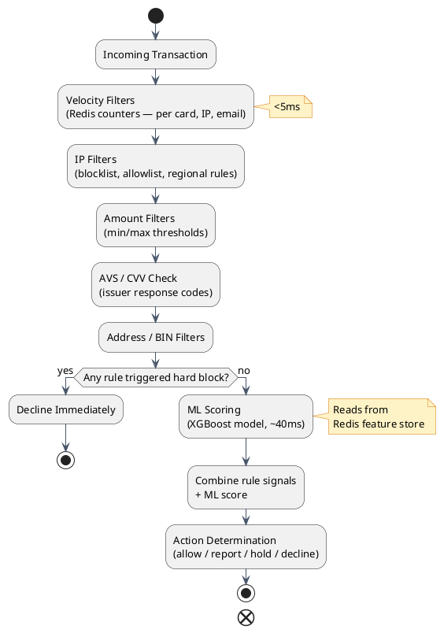

# Fraud Detection System

Fraud detection is one of the most operationally complex parts of a payment gateway. This document explains the architecture, the rules, the machine learning layer, and the difficult tradeoffs — from the perspective of a developer building the system for the first time.

---

## Section 1: Why Fraud Detection Is Hard

In a physical store, a fraudster needs a counterfeit card or a stolen physical card to commit fraud. Both require physical proximity and effort. Online fraud — called **Card Not Present (CNP) fraud** — requires only three pieces of data:

- Card number (PAN)
- Expiry date
- CVV

All three can be stolen in bulk from a single data breach and sold on the dark web for cents per card. Fraudsters buy lists of 100,000 stolen cards, write scripts to test them automatically across many merchants, and drain valid ones quickly — often within hours of purchase.

**The core tension:**

The fraud detection system must make a decision on every single transaction in under 50 milliseconds (it runs as a synchronous step in the checkout flow). That decision has asymmetric costs:

- **Too strict:** You decline a legitimate customer. They are frustrated, abandon the cart, may never return. The merchant loses revenue. At scale, a 1% false positive rate on a merchant doing $10 million/month means $100,000 of blocked legitimate revenue per month.
- **Too lenient:** Fraud goes through. The cardholder disputes the charge. The merchant gets a chargeback — they lose the revenue AND pay a chargeback fee ($25–$50 per dispute). Chargebacks above 0.9% of transaction volume result in fines from Visa/Mastercard.

There is no perfect answer. The system must find the right balance for each merchant's risk profile.

---

## Section 2: Two-Layer Architecture

The fraud engine has two layers that run in sequence on every transaction:

- **Layer 1: Rules Engine** — Fast (under 5ms), deterministic, merchant-configurable, fully explainable. Think: hardcoded conditions that always apply.
- **Layer 2: ML Scoring** — Adaptive (around 40ms), learns from patterns, harder for fraudsters to game. Think: a model that scores how suspicious the transaction looks.

The combined output determines the action taken.



---

## Section 3: Rules Engine Filters in Detail

### Velocity Filters

Velocity means "how often is this entity transacting in a given time window." Fraudsters testing stolen cards create telltale velocity spikes.

**Transaction velocity per merchant:**
- Daily limit: maximum N transactions or maximum $X total per merchant per day (configurable per merchant profile)
- Hourly limit: maximum N transactions per hour — catches burst attacks that stay under the daily limit by spreading across hours

**IP velocity (card testing detection):**
- Maximum 3 transactions from the same IP address in any 5-minute window
- Card testing is the act of running small or $0.01 charges to verify which stolen cards are still valid before selling them or using them for large purchases. A fraudster running 1,000 cards through a script from one IP will hit this immediately.

**Implementation — Redis sorted sets:**

```
Key:   velocity:{merchant_id}:{ip}:{window_start_minute}
Value: sorted set of transaction timestamps
Query: ZCOUNT key (now - 5 minutes) now
```

Redis sorted set operations are O(log N) — fast enough for real-time use. The time window slides forward with each transaction.

### Amount Filters

**Minimum amount:** Block transactions below $0.50.

This stops micro-authorization card testing, where fraudsters test cards with $0.01 or $1.00 transactions to see which are valid without triggering fraud alerts. Merchants selling physical goods will never have legitimate transactions this small.

**Maximum amount:** Block transactions above a configurable threshold.

A merchant selling $50 software licenses does not expect $5,000 transactions. Configuring a maximum amount for each merchant profile catches anomalous large charges that are likely account takeover.

### IP-Based Filters

**IP blocklist:** A manually maintained list of IP addresses or CIDR ranges known to originate fraud. Maintained by the gateway's fraud operations team, supplemented by threat intelligence feeds.

**IP allowlist (server-to-server):** For merchants integrating via server-to-server API (not hosted checkout), whitelist the merchant's known server IP ranges. Even if a fraudster steals the merchant's API key, they cannot use it without coming from the allowed IP range. This is a significant attack surface reduction.

**Regional IP filter:** A merchant can configure "only accept transactions from US IP addresses." Relevant for merchants with no international business — eliminates attacks originating overseas.

### Address Verification System (AVS)

When a customer enters their billing address, the gateway sends the ZIP code (and optionally the street address) to the issuing bank as part of the authorization request. The issuer compares it against the address on file for the card.

**AVS response codes:**

| Code | Meaning |
|---|---|
| Y | Full match — both street and ZIP match |
| Z | ZIP match only |
| A | Street address match only |
| N | No match — neither matches |
| U | Unavailable — issuer does not support AVS |
| R | Retry — system unavailable |

**Gateway action:** Configurable per merchant. A common configuration:
- Y → allow
- Z or A → allow but flag for review
- N → decline or hold for review
- U → allow (many international banks don't support AVS)

AVS is not foolproof. Fraudsters who buy complete card data from breaches often have the billing address too. But it catches lazy attackers.

### CVV Verification

CVV (Card Verification Value — the 3- or 4-digit code on the card) is sent to the issuer with the authorization request. The issuer compares it against the value stored on the card account.

**CVV response codes:**

| Code | Meaning |
|---|---|
| M | Match |
| N | No match |
| P | Not processed |
| U | Not supported by issuer |

:::danger
CVV must be discarded immediately after receiving the authorization response. It must never be stored in a database, written to a log file, or held in a cache. This is PCI DSS Requirement 3.2.

If your request logging middleware captures the full request body, you must strip CVV before writing to any log sink. No exceptions.
:::

---

## Section 4: Actions

Fraud detection does not just output allow or decline. There are five possible actions, giving the system granular control:

| Action | What Happens | When to Use |
|---|---|---|
| **Allow** | Transaction proceeds normally | Risk score is low, no rules triggered |
| **Report Only** | Transaction proceeds, but flagged for analyst review | Slight signals present but not strong enough to block |
| **Auth and Hold** | Authorize the transaction (funds reserved on card), but delay capture pending merchant review | Medium-risk transaction worth reviewing before fulfilling |
| **Do Not Auth Hold** | Do not authorize. Hold the order record without reserving funds. | Suspicious transaction — merchant wants to review before deciding to re-auth |
| **Decline** | Reject immediately, no authorization attempt | High-risk transaction or hard rule triggered |

**Why Auth-and-Hold instead of just Decline?**

Consider a $500 order that looks suspicious but not certain. If you decline, the customer may be legitimate and now has a poor experience. If you authorize and hold, you reserve the funds on the card (preventing the customer from spending that $500 elsewhere). If the merchant's review team approves the order within 7 days, they capture immediately. If they determine it is fraud, they void the authorization — the funds are released back to the cardholder, no chargeback occurs, and the fraudster gets nothing.

The 7-day limit is important: authorization holds expire (typically 7 days for card-not-present). If the merchant does not capture or void before expiry, the authorization lapses and must be re-requested — which introduces a new risk (the card may have been cancelled by then if reported stolen).

---

## Section 5: ML Scoring Layer

Rules are valuable but static. A smart fraudster learns the rules — avoid the IP velocity limit by rotating IPs, keep transactions just under the max amount, use correct billing addresses. Machine learning adapts automatically to emerging patterns.

### Features Used by the Model

The model receives a feature vector assembled in real time from multiple sources:

**Velocity features (from Redis):**
- Number of transactions from this card in the past 1 hour, 24 hours, 7 days
- Number of transactions from this IP in the past 1 hour
- Number of transactions from this email address in the past 24 hours
- Number of unique cards used from this IP today

**Amount anomaly:**
- How far is this transaction amount from the typical transaction size for this card?
- Is this amount unusually large relative to this merchant's average order value?

**Geographic features:**
- Country of the card BIN (the first 6 digits of the card number identify the issuing bank and country)
- Country of the IP address (geolocation lookup)
- Country of the shipping address
- Mismatch between these three is a strong fraud signal

**Temporal features:**
- Hour of day and day of week (fraud patterns vary by time)
- Time since customer account was created (very new accounts with high-value orders are suspicious)
- Time since this card was first used at this merchant

**Historical features (pre-computed daily):**
- Has this card been involved in chargebacks before? How many?
- Has this email address been associated with fraud at other merchants on the gateway?
- What is the chargeback rate for transactions with this card BIN?
- Is this a high-risk BIN (prepaid, gift card, foreign-issued)?

**Device features:**
- Is this a known device for this returning customer?
- Was this device seen for the first time today?
- Is the device fingerprint consistent with the claimed browser/OS?

### Model Architecture

The industry standard for real-time fraud scoring on tabular features is **gradient boosted trees** — specifically XGBoost or LightGBM. These models:

- Handle mixed feature types (numeric amounts, categorical countries, boolean flags) naturally
- Are interpretable enough to produce feature importance scores (useful for explaining decisions)
- Train quickly on labeled data (chargebacks provide ground-truth fraud labels)
- Are fast at inference — scoring a single transaction takes under 5ms

The model outputs a score from **0.0** (very likely legitimate) to **1.0** (very likely fraud).

### Configurable Thresholds

Thresholds are set per merchant, not globally:

```
Score < 0.30   →  Allow
Score 0.30–0.70  →  Hold for review (Auth and Hold or Do Not Auth Hold)
Score > 0.70   →  Decline
```

A merchant selling physical electronics uses more conservative thresholds (lower tolerance for fraud) than a merchant selling digital downloads where fraud is harder to execute after delivery.

### Real-Time Feature Store

Velocity features must be read in milliseconds. They are stored in Redis as sorted sets (for time-windowed counts) and hash maps (for running totals). Every completed transaction updates the feature store atomically.

Historical features — chargeback rates, BIN risk scores, customer lifetime patterns — are pre-computed daily in a batch pipeline and loaded into a fast-read store (Redis or a purpose-built feature store like Feast or Tecton). These features do not need real-time updates since they represent historical trends.

---

## Section 6: The Precision-Recall Tradeoff

This is the central operational challenge of fraud detection. Understanding it is essential for setting thresholds and evaluating model performance.

**Precision:** Of all transactions your model flags as fraud, what percentage were actually fraud?
- Low precision = many false positives = many legitimate customers incorrectly declined.

**Recall:** Of all actual fraud transactions, what percentage did your model catch?
- Low recall = many false negatives = fraud slips through.

**You cannot maximize both simultaneously.** Moving the threshold lower catches more fraud (higher recall) but also flags more legitimate transactions (lower precision). Moving it higher reduces false positives (higher precision) but misses more fraud (lower recall).

### Concrete Example

- 1 million transactions per day
- 0.1% fraud rate = 1,000 fraudulent transactions per day
- Average order value: $50

If the model flags the top 1% of transactions (10,000 transactions):
- Scenario A: The model is good, catching 900 of 1,000 fraud cases
  - Recall: 90% (caught 900 / 1,000 fraud)
  - Precision: 9% (900 true fraud / 10,000 flagged)
  - False positives: 9,100 legitimate customers blocked
  - Blocked legitimate revenue: 9,100 × $50 = **$455,000 per day**
- Scenario B: The model is poor, catching only 500 of 1,000 fraud cases
  - Recall: 50%
  - Precision: 5%
  - False positives: 9,500
  - Blocked legitimate revenue: **$475,000 per day**

This is why model quality matters enormously — not just for catching fraud, but for protecting legitimate revenue.

:::note[Where to Set the Threshold]
The right threshold depends on what the merchant sells and how quickly fraud can be monetized.

**Digital goods (software licenses, gift cards, gaming credits):** Fraud is immediately monetizable — the fraudster uses or sells the product within minutes of purchase. Set an aggressive threshold. Accept a higher false positive rate because the cost of fraud is immediate and irreversible.

**Physical goods requiring shipping (furniture, appliances, electronics):** Fraud requires receiving a physical package — the fraudster must provide a real address, creating a recovery window. A relaxed threshold protects conversion rate while manual review catches the high-risk cases before shipment.
:::

---

## Section 7: 3D Secure Integration in Fraud Context

3DS2 (covered in depth in the security document) is a complement to fraud detection, not a replacement. The two systems are most effective when they work together.

**How the fraud engine determines when to trigger 3DS2:**

| Fraud Score Range | Action |
|---|---|
| Low risk (< 0.20) | Skip 3DS2 entirely — no point adding latency for a clearly safe transaction |
| Medium risk (0.20–0.50) | Request frictionless 3DS2 — issuer authenticates silently, liability shifts to issuer |
| High risk (0.50–0.80) | Request 3DS2 challenge — customer must prove identity (OTP or biometric) |
| Very high risk (> 0.80) | Decline regardless of 3DS2 outcome — the risk is too high to proceed even with authentication |

**Why not always trigger 3DS2?** Every 3DS2 request adds approximately 200ms to the checkout flow. At scale, adding 200ms to every transaction has a measurable impact on conversion rates (studies show a 0.1% drop in conversion per 100ms of added latency). Reserve 3DS2 for transactions that warrant it.

**Liability shift value:** When 3DS2 frictionless authentication succeeds, the liability for fraud chargebacks shifts to the issuing bank. For a merchant doing $1 million/month with a 0.2% chargeback rate, this represents $2,000/month in avoided chargeback losses per merchant — significant at gateway scale with thousands of merchants.

---

## Section 8: Exemptions

Not every transaction needs to run through the full fraud detection stack.

**ARB Recurring Charges (Automatic Recurring Billing):**
The customer explicitly authorized a subscription during signup. The recurring charge uses the same card and billing terms the customer agreed to. Velocity and IP checks are irrelevant (there is no customer IP for a server-initiated charge). These charges run through a simplified path: verify the recurring authorization token is valid, check the card is not blocked, proceed.

**eCheck / ACH Payments:**
Bank account transfers operate through the ACH network, not the card network. The fraud model for ACH is entirely different — based on bank routing number risk, account verification, return rates, and NACHA return codes. The card-based ML model and AVS/CVV checks do not apply. ACH has its own risk engine.

**Card-Present Transactions:**
When the customer physically inserts or taps their card with an EMV chip, the chip generates a cryptogram that proves physical card possession. The card networks' own fraud detection handles most of the risk. The gateway's card-not-present fraud engine adds little value and can simply pass through.

---

## Section 9: Feedback Loop

The fraud engine improves over time through a feedback loop. The key insight: **chargebacks are ground-truth fraud labels**.

When a cardholder disputes a transaction with their bank ("I didn't make this purchase"), the bank initiates a chargeback. The gateway receives the chargeback notification — this is a definitive label that the transaction was fraudulent.

**The training pipeline:**

1. Chargeback data arrives daily via card network dispute files
2. Chargebacks are matched to the original transaction records
3. Transaction records are labeled: `fraud = 1`
4. Non-disputed transactions are labeled: `fraud = 0`
5. A new model is trained on the past 90 days of labeled data
6. The new model is evaluated: does it outperform the current model on a holdout set?
7. If yes, the new model is promoted to production
8. Repeat weekly or monthly

**What to monitor:**

- **Chargeback rate per merchant:** Rising rate signals fraud is getting through. Investigate the merchant's transaction profile.
- **Chargeback rate per card BIN:** Some BIN ranges (specific banks, prepaid cards) have chronically high fraud rates. Consider adjusting BIN-level risk scores.
- **Chargeback rate per region:** Fraud patterns shift geographically over time. A new breach affecting cards from a specific country will show up as a regional spike.
- **False positive rate:** Monitor how often legitimate transactions are blocked. Use customer service data — "I was charged but didn't get my order" complaints are often false positives.

---

## Section 10: Tradeoffs

:::success[Advantages of the Rules + ML Hybrid Approach]
- **Rules provide speed and transparency:** Under 5ms, deterministic, and you can explain exactly why a transaction was blocked. Merchants can configure rules for their specific business needs.
- **ML catches subtle patterns:** No static rule would catch a fraudster who carefully varies their IP, amount, and timing. ML learns the combination of signals that indicate fraud.
- **Layered defense:** Each layer compensates for the other's weaknesses. Rules stop obvious attacks fast. ML handles sophisticated attacks.
- **Together they outperform either alone:** Industry studies show hybrid models achieve better precision-recall than pure rules or pure ML.
:::

:::caution[Challenges]
- **ML models decay:** Fraudsters adapt. A model trained 6 months ago may miss attack patterns that emerged last month. Without regular retraining on fresh chargeback data, model accuracy degrades.
- **False positives harm real customers:** An overly aggressive system costs the merchant revenue and creates a poor customer experience. The fraud team must continuously monitor and tune thresholds.
- **Rules can be gamed:** Once fraudsters learn the specific rules (through trial and error, or through insider information), they adjust their behavior to stay just below every threshold. Rules need regular review.
- **ML is a black box:** When a merchant asks "why was my customer's transaction declined?", gradient boosted trees cannot give a clean human-readable answer. You can report the top contributing features, but explaining to a merchant that "IP velocity score contributed 0.23 to the fraud score" is not actionable for them.
- **Cold start problem:** New merchants have no transaction history. The ML model has no historical features for them. For the first weeks, rules carry most of the weight while the model builds up data.
:::

---

[← Payment Gateway HLD](/learnings/payment-gateway/hld/)
