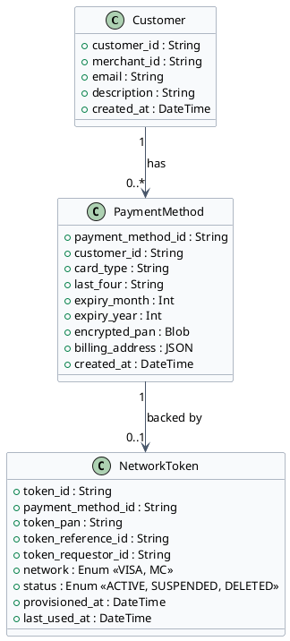
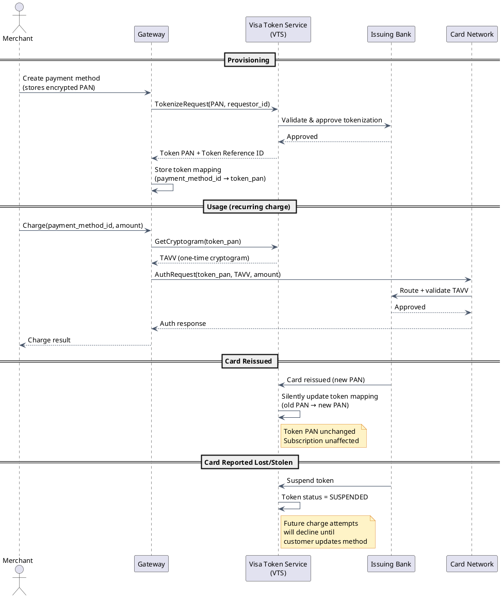
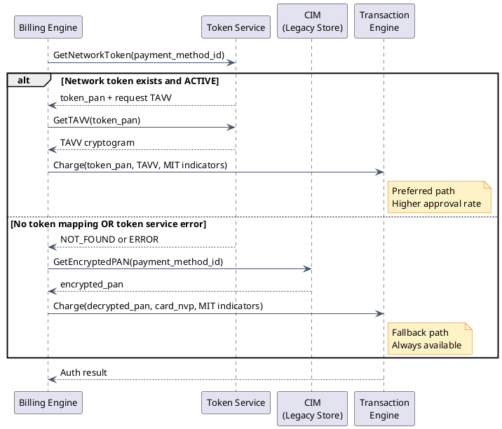

# Stored Credentials & Tokenization

## Why Store Payment Credentials?

Picture a customer checking out on an e-commerce site. Without stored credentials they must type their 16-digit card number, expiry, CVV, and billing address every single time. Research consistently shows that **60–80% of shoppers abandon checkout** when that friction is present — especially on mobile.

Stored credentials solve this by remembering the card on the customer's behalf. Three concrete scenarios drive the need:

1. **One-click checkout** — A returning customer's saved card is charged immediately. Amazon's "Buy Now" button is the canonical example.
2. **Recurring billing** — A subscription (Netflix, SaaS tools, gym membership) charges the customer's card on a schedule without the customer being present at all.
3. **Installment payments** — A large purchase is split into equal future charges (e.g., buy a $1,200 laptop, pay $400/month for 3 months).

The problem is obvious: if you store raw card numbers in a database, you become a treasure chest for attackers. You also inherit **PCI DSS Level 1** compliance obligations — the most stringent tier, requiring annual on-site audits, quarterly network scans, and significant ongoing cost.

The solution is **tokenization**: instead of storing the real card number (called a PAN — Primary Account Number), you store an opaque token. The token is meaningless on its own. If an attacker steals your database, they get a list of tokens that cannot be used anywhere.

---

## Customer Profile Hierarchy

The gateway organises stored credentials in a two-level hierarchy:

```
Customer Profile
  ├── customer_id:        "cust_123"        ← what the merchant stores
  ├── email:              "alice@example.com"
  ├── description:        "Alice Johnson"
  │
  └── Payment Methods []
        ├── payment_method_id:  "pm_456"    ← what the merchant stores
        ├── card_type:          "visa"       (display only)
        ├── last_four:          "4242"       (display only — never the full PAN)
        ├── expiry:             "12/2027"    (display only)
        ├── encrypted_pan:      [AES-256-GCM encrypted blob]  ← never returned to merchant
        └── billing_address:    { street, city, zip, country }
```

The merchant stores **only** `customer_id` and `payment_method_id` in their own database. They never see or touch the actual card number again. When they want to charge Alice, they send `payment_method_id: "pm_456"` to the gateway — the gateway resolves the token to the encrypted PAN, decrypts it inside a secure enclave, and submits it to the card network.

### Class Diagram



---

## How the Encrypted Card is Stored

The encryption architecture uses **envelope encryption** — a two-key layered approach:

```
PAN (plaintext)
  │
  ▼  AES-256-GCM encrypt with DEK
Encrypted PAN (ciphertext stored in DB)

DEK (Data Encryption Key)
  │
  ▼  Wrapped (encrypted) by master key inside HSM
Wrapped DEK (stored alongside ciphertext)

Master Key
  └── Lives only inside the HSM (Hardware Security Module)
      Never exported, never touches application memory
```

**Why two keys?**

If you used the master key directly to encrypt every PAN, rotating the master key would require re-encrypting every single PAN — a massive, risky operation. With envelope encryption:

- **DEK rotation**: generate a new DEK, re-encrypt all PANs with the new DEK. The master key in the HSM never moves.
- **Master key rotation**: unwrap each DEK with the old master key, re-wrap it with the new master key. No PAN ciphertext changes at all.

Even with full database access, an attacker sees only an AES-256-GCM encrypted blob. Without the DEK, the blob is computationally indistinguishable from random noise.

---

## Gateway Token vs Network Token

There are two fundamentally different types of tokens in payment systems. Confusing them is a very common source of bugs and architecture mistakes.

### Gateway Token

A **gateway token** (`pm_xyz789`) is an internal opaque identifier owned entirely by the payment gateway. The card networks (Visa, Mastercard) have no idea it exists.

- **At charge time**: the gateway looks up the token, retrieves the encrypted PAN, decrypts it inside the HSM, and submits a normal card transaction to the card network — just as if the customer typed the number right now.
- **Limitation**: if the customer's physical card is reissued (expired, lost, or the bank re-issues proactively), the stored PAN becomes invalid. The next subscription charge fails. The customer must manually update their payment method.

### Network Token (EMV Payment Tokenization)

A **network token** is issued directly by **Visa Token Service (VTS)** or **Mastercard MDES**. It is a 16-digit number in a special reserved BIN range that the card networks themselves recognise and route.

- **At charge time**: the gateway requests a **TAVV** (Token Authentication Verification Value) — a one-time cryptogram tied to this specific transaction. The token PAN + TAVV are submitted together. The card network validates the cryptogram and routes to the issuer.
- **Key benefit**: when the customer's physical card is reissued, **Visa/Mastercard silently update the token's underlying PAN mapping**. The existing network token continues to work. Subscriptions survive card reissuance without any action from the customer or merchant.

### Comparison

| Dimension | Gateway Token | Network Token |
|---|---|---|
| Who issues it | Payment gateway | Visa / Mastercard |
| Card network recognises it? | No | Yes |
| Automatic card update on reissue | No | Yes |
| Approval rate impact | Baseline | +2–5% lift |
| Dynamic cryptogram per transaction | No | Yes (TAVV) |
| PCI scope reduction | Reduced | Maximum reduction |

---

## Network Token Lifecycle



---

## The Migration Problem: CIM → Network Tokens

Real-world payment systems don't start fresh. A mature gateway typically has **millions of customer profiles** stored with encrypted PANs in a legacy Customer Information Manager (CIM) system. The goal is to migrate all of them to network tokens for higher approval rates — but a hard cutover is too risky.

### Strangler Fig / Additive Overlay Pattern

The migration uses an **additive overlay**: the new token path is activated incrementally, profile by profile. The old CIM path remains available as a fallback at all times.

**Write path** (new/updated payment methods):
- When a payment method is created or updated, the gateway syncs asynchronously to the network token service and provisions a token.
- The mapping (payment_method_id → token_pan) is stored alongside the existing CIM data.

**Read path** (charge time):
- Check if a network token mapping exists AND is active for this payment_method_id.
- If yes: request TAVV, charge using network token.
- If no mapping OR token service returns an error: fall back to CIM card NVP (the legacy encrypted PAN path).

**Background backfill**:
- A batch job iterates all profiles that don't yet have a network token mapping and provisions tokens for them.
- Rate-limited to avoid overwhelming the VTS API.



:::tip[Why additive overlay is safer than hard cutover]
A hard cutover risks breaking all active subscriptions if any bug exists in the new path. With additive overlay, the new path is activated profile by profile. If a bug surfaces, only newly migrated profiles are affected. The fallback always catches failures. No single incident can break all subscriptions simultaneously.
:::

---

## Account Updater

For profiles that don't yet have network tokens, **Account Updater** provides a batch alternative to keep stored cards current.

Visa and Mastercard run a service where the gateway submits truncated card data (BIN + last four digits + expiry) and receives back updates: new card number, new expiry date, or notification that the account is closed.

**How it works:**
1. Gateway assembles a batch of all stored profiles lacking network tokens.
2. Batch submitted to Visa/Mastercard Account Updater (weekly run).
3. Responses processed: updated PANs re-encrypted and stored, closed accounts flagged.
4. Subscriptions that would have failed due to expired cards now succeed.

**Limitation vs network tokens**: Account Updater is a **batch process** (runs weekly). A card reissued on Monday won't be updated until the following batch run. Network tokens update in real-time. Additionally, not all issuing banks participate in Account Updater, while Visa/Mastercard network tokenization has near-universal issuer support.

---

## Tradeoffs

:::success[Stored credentials benefits]
- One-click checkout dramatically increases conversion; industry studies show 40%+ lift in completed purchases.
- Subscriptions and installment plans are impossible without stored credentials.
- Network tokens auto-update on card reissue, eliminating involuntary churn from expired cards.
- Higher issuer approval rates (issuers trust network tokens more than raw PANs).
:::

:::caution[Risks and costs]
- Storing credentials creates an ongoing PCI DSS compliance obligation. Annual Level 1 audits are expensive and operationally demanding.
- A security breach of the profile store — even with encryption — is a massive liability and reputational risk.
- Network token provisioning adds latency (100–300ms) on first payment method storage; must be async.
- If you switch payment processors, your gateway tokens are worthless. Token portability requires a formal migration agreement with both processors.
:::

---

[← Payment Gateway HLD](/learnings/payment-gateway/hld/)
