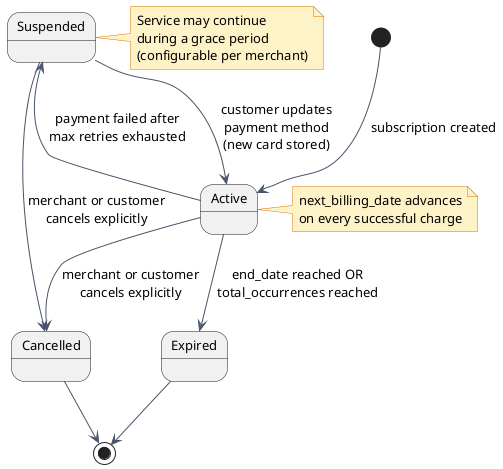
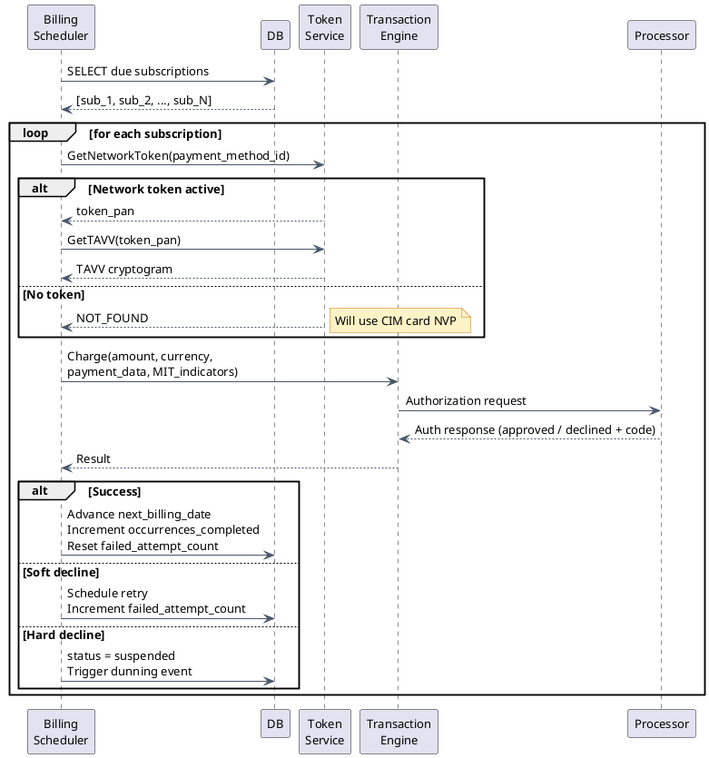
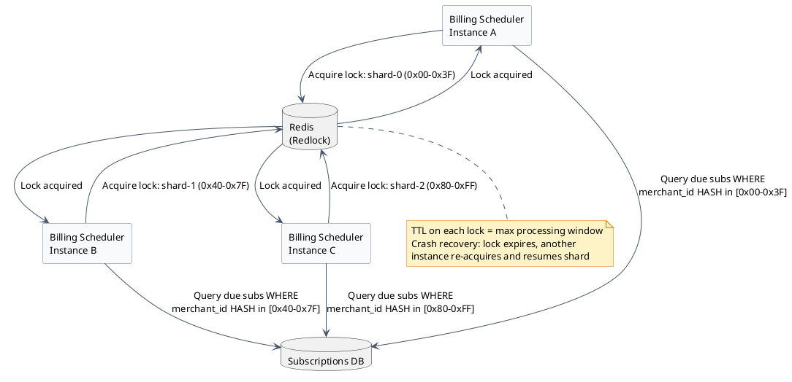

# Recurring Billing Engine

## What is Recurring Billing?

Recurring billing means charging a customer automatically on a schedule — without them taking any action at the time of the charge. The customer signed up once, agreed to a pricing plan, and now the system charges their stored payment method every month (or week, or year) on their behalf.

Examples:
- Netflix charges your card on the 14th of every month.
- A SaaS product charges your card on your annual renewal date.
- An insurance company debits your account on the 1st of every month.
- A gym charges your card on the day you first signed up, every month thereafter.

The central challenge of recurring billing is that **no customer is present at charge time**. You cannot ask for a CVV. You cannot trigger a 3D Secure authentication challenge. You are relying entirely on stored credentials and the cardholder's original consent to the recurring agreement.

This changes the fraud model, the decline handling, the retry logic, and the regulatory requirements — all of which this document covers.

---

## Subscription Data Model

A subscription record captures everything the billing engine needs to know: who to charge, how much, how often, and what state it's in.

| Field | Type | Purpose |
|---|---|---|
| `subscription_id` | String | Primary identifier |
| `merchant_id` | String | Which merchant owns this subscription |
| `customer_id` | String | Links to the customer profile |
| `payment_method_id` | String | Which stored card/account to charge |
| `amount` | Decimal | Amount to charge each cycle |
| `currency` | String | ISO 4217 currency code |
| `interval_unit` | Enum | `days` or `months` |
| `interval_length` | Int | e.g., `1` + `months` = monthly billing |
| `start_date` | Date | When billing begins |
| `next_billing_date` | Date | **The field the billing engine queries** |
| `end_date` | Date? | null = indefinite; set for fixed-term plans |
| `total_occurrences` | Int? | null = unlimited; set for instalment plans |
| `occurrences_completed` | Int | How many successful charges so far |
| `trial_amount` | Decimal? | Discounted amount for trial period |
| `trial_occurrences` | Int? | How many times trial amount applies |
| `status` | Enum | `active`, `suspended`, `cancelled`, `expired` |
| `failed_attempt_count` | Int | Consecutive failures in current retry window |
| `last_failed_date` | Date? | Date of most recent failed charge attempt |

### Subscription State Machine



---

## The Billing Engine (ARBTGen)

The billing engine is a scheduled job — named **ARBTGen** (Automated Recurring Billing Transaction Generator) in many systems. It runs on a fixed schedule (commonly once per day at a configurable time, or multiple times per day for higher volume).

**Core loop:**

```sql
SELECT * FROM subscriptions
WHERE next_billing_date <= CURRENT_DATE
  AND status = 'active'
```

For each subscription returned:

1. Look up `payment_method_id` → check if a network token mapping exists.
2. Build the charge request:
   - If network token active: request TAVV from the token service, use token PAN + TAVV.
   - Otherwise: fall back to the CIM stored card (encrypted PAN path).
3. Add **MIT (Merchant-Initiated Transaction) indicators** to the request (covered in the next section).
4. Submit to the Transaction Engine.
5. Process the result:
   - **Success**: advance `next_billing_date` by the interval, increment `occurrences_completed`, reset `failed_attempt_count`.
   - **Soft decline**: schedule a retry according to network retry rules, increment `failed_attempt_count`.
   - **Hard decline**: update status to `suspended`, trigger dunning notifications.
   - **End condition**: if `end_date` reached or `total_occurrences` completed, set status to `expired`.



---

## MIT (Merchant-Initiated Transaction) Framework

When a merchant charges a stored card without the customer present, **Visa and Mastercard require specific fields** on the authorization request to declare that this charge was pre-authorized by the customer. Without these fields, the issuer may treat the charge as unauthorized and decline it, or the customer can successfully dispute it as an unauthorized transaction.

**Required fields on every recurring charge:**

| Field | Value | Why it matters |
|---|---|---|
| `storedCredentialIndicator` | `"recurring"` | Tells the issuer this is a standing agreement |
| `originalNetworkTransactionId` | Transaction ID from the FIRST transaction | Proves the customer consented |

The `originalNetworkTransactionId` is the **consent anchor** — the transaction ID from the very first charge when the customer was physically present (or authenticated via 3DS). That first transaction proves the cardholder agreed to be charged on a recurring basis. Every subsequent recurring charge references it, forming a chain of trust that issuers can verify.

:::note[Why the original transaction ID matters]
Issuers receive thousands of recurring charges every day. Without the original transaction ID, they have no way to verify that the cardholder ever consented. The ID lets the issuer look up the original authorization, confirm it was a customer-present transaction, and trust that the recurring charges are legitimate. Missing or wrong original transaction IDs are a leading cause of recurring charge declines.
:::

---

## Soft vs Hard Declines

Not all declines are equal. Before scheduling a retry, the billing engine must classify the decline:

### Soft Declines — transient, retry is appropriate

| Code | Meaning | Suggested wait |
|---|---|---|
| R51 | Insufficient funds | 1–3 days |
| R05 | Do not honor (temporary) | 30 days |
| R61 | Exceeds frequency limit | Wait for limit reset |

The issuer is saying "not right now" — the account is valid, the card is active, something temporary is in the way.

### Hard Declines — permanent, do NOT retry

| Code | Meaning | Action |
|---|---|---|
| R54 | Card expired | Suspend, request updated payment method |
| R41 | Lost card | Suspend immediately |
| R43 | Stolen card | Suspend immediately |
| R62 | Account closed | Suspend, mark account closed |
| R14 | Invalid card number | Suspend, data corrupted |

The issuer is saying "this card cannot and will never work for this purpose." Retrying wastes money and violates card network rules.

:::danger
Retrying a hard decline is not just wasteful — it is a **card network compliance violation**. Visa and Mastercard charge additional per-transaction fees for prohibited retry attempts. Persistent violators can be placed on a restricted merchant list. Always check the decline code before scheduling any retry.
:::

---

## Retry Schedule & Network Rules

Visa and Mastercard publish retry rules in their operating regulations. These are **not suggestions** — exceeding them results in per-transaction fees applied on every non-compliant retry.

**Key limits (as of current network rules):**

- **Visa**: maximum 15 retry attempts within any 30-day period for a given card/amount combination.
- **Mastercard**: maximum 10 retry attempts within 30 days.
- **R51 (Insufficient Funds)**: minimum 1 day between retries.
- **R05 (Do Not Honor)**: minimum 30 days between retries (Mastercard rule).

**Example retry schedule for a monthly subscription (soft decline — insufficient funds):**

| Day | Event |
|---|---|
| Day 0 | Initial billing attempt → declined (R51, insufficient funds) |
| Day 3 | First retry |
| Day 7 | Second retry |
| Day 14 | Third retry |
| Day 21 | Fourth retry → still declined |
| Day 21+ | Suspend subscription, trigger dunning |

---

## Dunning

**Dunning** is the process of systematically collecting an overdue payment. In the context of recurring billing, it encompasses the retry logic plus the communication layer.

**Automated dunning flow:**

1. Retry attempts follow the schedule above.
2. After each failed attempt, an automated email goes to the customer: "Your payment failed — please update your payment method."
3. After maximum retries are exhausted, the merchant receives a webhook: "Subscription suspended — customer X, subscription Y, failed 5 times."
4. **Grace period**: the merchant can configure a grace period (e.g., 7 days) during which the customer retains access even though payment has failed. This prevents immediately cutting off service for a temporary insufficient-funds situation.
5. If the customer updates their payment method during the grace period, the subscription resumes immediately and a charge is attempted.

---

## SCA (Strong Customer Authentication) & EU Compliance

The EU's **PSD2 regulation** requires Strong Customer Authentication (two-factor authentication) for online card payments. This creates a challenge for recurring billing: how do you do 2FA when the customer isn't present?

**The exemption path:**

1. The **first** subscription charge must use **3DS2** (3D Secure version 2) and include the `recurring` flag and fixed amount in the authentication request.
2. The issuer authenticates the customer (2FA) and returns an **authentication reference** (a unique ID for that 3DS2 session).
3. The gateway stores this authentication reference alongside the original network transaction ID.
4. All **subsequent** recurring charges include this reference and are **exempt from SCA** — the issuer trusts that the original 3DS2 consent covers all future charges of the same amount/frequency.

If the amount changes (e.g., a price increase), a new SCA challenge is required.

---

## Distributed Job Design

The simplest billing engine implementation is a cron job running on a single server. This is adequate for small volume but has an obvious flaw: it is a **single point of failure**. If that server is down at billing time, no subscriptions are charged that day.

### Distributed Scheduler with Redis Redlock

A production-grade design uses multiple billing scheduler instances competing for distributed locks:

1. Multiple scheduler instances start up across different servers/pods.
2. At the billing window, each instance attempts to acquire a **Redis distributed lock** (using the Redlock algorithm) for a shard of subscriptions.
3. Subscriptions are **partitioned by merchant_id hash range** — e.g., instance A handles merchant IDs 0x00–0x3F, instance B handles 0x40–0x7F, etc.
4. The instance that wins the lock for a shard processes all due subscriptions in that shard.
5. If an instance crashes mid-processing, the lock expires after a TTL, and another instance can re-acquire and continue.



**Benefits of this design:**
- No single point of failure — any instance can handle any shard.
- Horizontal scale — add more instances to process more shards in parallel.
- Safe concurrency — distributed locks prevent double-charging a subscription.

---

## Tradeoffs

:::success[Recurring billing advantages]
- Enables subscription businesses — without recurring billing, every renewal requires manual customer action.
- Significantly improves revenue predictability and reduces churn from payment friction.
- Network token path with MIT indicators achieves higher approval rates than ad-hoc charges.
- Dunning automation recovers a large percentage of revenue that would otherwise be lost to temporary card failures.
:::

:::caution[Recurring billing challenges]
- MIT compliance requires correct implementation of original transaction ID storage from day one. Missing this field causes declines and disputes.
- Retry rule compliance (Visa/Mastercard) requires per-network logic — what is valid for Visa may violate Mastercard rules.
- Distributed job design is significantly more complex than a single cron job, but necessary for reliability at scale.
- SCA (EU) adds a requirement that the first transaction must be properly authenticated, or all subsequent recurring charges can be declined by EU issuers.
:::

---

[← Payment Gateway HLD](/learnings/payment-gateway/hld/)
