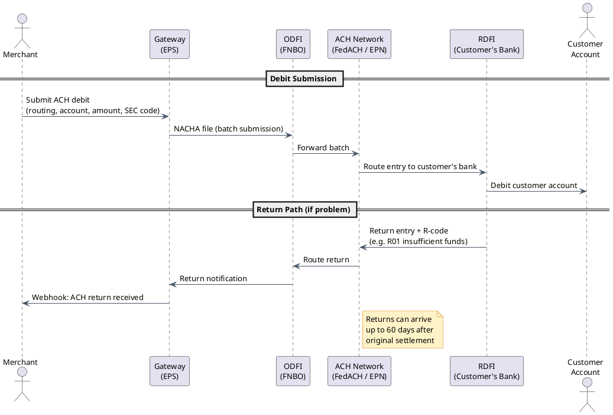
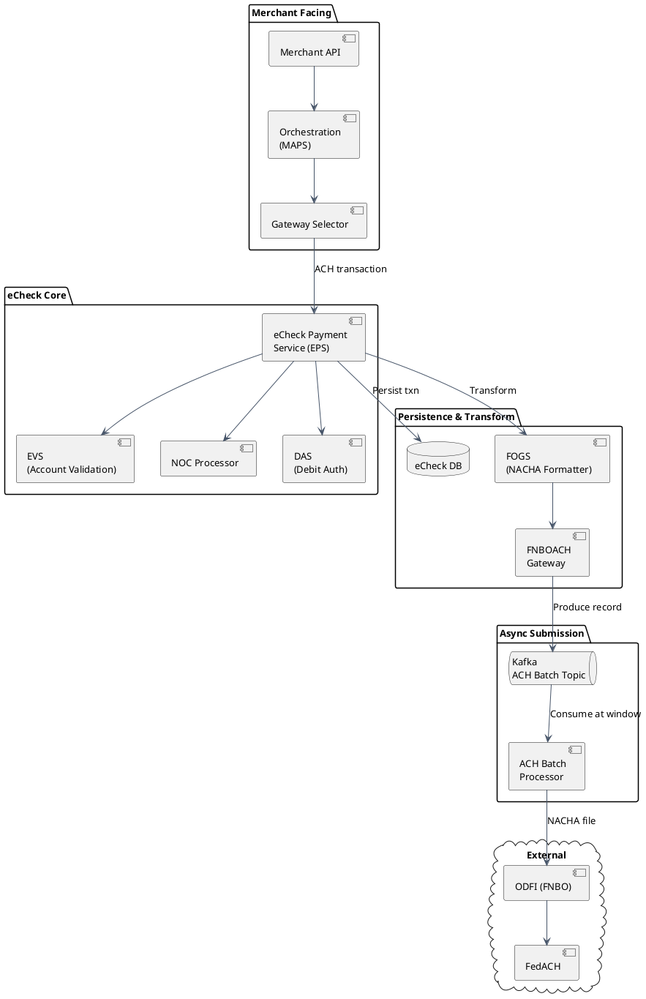
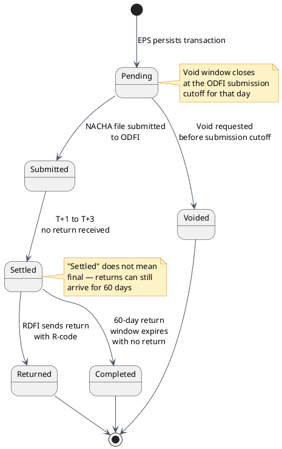

# ACH / eCheck Payments

## What is ACH?

**ACH** stands for **Automated Clearing House** — the US's bank-to-bank electronic transfer network. It is the infrastructure behind nearly every direct deposit, bill payment, and business-to-business transfer in the United States.

**Who operates it:**
- **NACHA** (National Automated Clearing House Association): the rule-making body. Sets all regulations, return code standards, and compliance thresholds.
- **FedACH**: operated by the Federal Reserve, processes approximately 60% of ACH volume.
- **EPN** (Electronic Payments Network) / **TCH** (The Clearing House): the private-sector alternative, processes the remaining ~40%.

**Scale**: approximately 30 billion transactions per year, representing trillions of dollars.

**The single most important thing to understand about ACH**: it is **not real-time**. Card payments get an authorization response in 2–3 seconds. ACH does not. A payment submitted today does not clear for **1–3 business days**. Returns (the ACH equivalent of chargebacks) can arrive up to **60 days later**. This fundamentally changes how you design fraud detection, settlement accounting, and risk management.

---

## ACH vs Card Payments

| Dimension | Card | ACH / eCheck |
|---|---|---|
| Authorization | Real-time (2–3 seconds) | None — every submission is "accepted" initially |
| Settlement | T+1 to T+2 | T+1 to T+3 (NACHA clearing windows) |
| Cost | 1.5–3% of transaction | $0.25–$0.75 flat fee |
| Fraud detection | CVV, AVS, 3DS, velocity rules | Bank account validation only |
| Return window | 60–120 days (chargebacks) | 60 days for unauthorized returns |
| Best for | One-time purchases, retail | High-volume recurring, B2B, large amounts |

The cost difference is dramatic. For a $500 recurring payment: cards cost $7.50–$15; ACH costs $0.25–$0.75. At scale, this difference is millions of dollars per year, which is why most SaaS and insurance companies strongly prefer ACH for high-volume recurring billing.

---

## The Four ACH Parties

Every ACH transaction involves exactly four parties:

1. **Originator**: the merchant or business initiating the transaction. They have a contract with their ODFI to originate ACH entries.

2. **ODFI** (Originating Depository Financial Institution): the gateway's banking partner — in many payment gateway architectures this is **FNBO** (First National Bank of Omaha) or a similar bank. The ODFI is the entity that actually submits batch files to the ACH network. The gateway aggregates transactions and submits to the ODFI; the ODFI submits to FedACH/EPN.

3. **ACH Network** (FedACH or EPN): routes the batch to the correct receiving bank based on the routing number.

4. **RDFI** (Receiving Depository Financial Institution): the customer's bank. It debits or credits the customer's account and processes any returns.



---

## NACHA File Format

All ACH transactions are submitted as **fixed-width text files** where every single record is exactly **94 characters wide**. This format dates to the 1970s and has not changed structurally.

**File structure (outermost to innermost):**

```
File Header Record (1 per file)
  └── Batch Header Record (1 per batch)
        └── Entry Detail Records (1 per transaction)
              └── Addenda Records (optional, additional info)
        └── Batch Control Record (1 per batch — totals)
  └── File Control Record (1 per file — totals)
```

Each record type is identified by its first character (1 = File Header, 5 = Batch Header, 6 = Entry Detail, 7 = Addenda, 8 = Batch Control, 9 = File Control).

### SEC Codes

Every batch has an SEC (Standard Entry Class) code that determines the transaction type, rules, and required authorization:

| Code | Use Case | Notes |
|---|---|---|
| PPD | Consumer recurring or one-time debit | Most common for subscriptions and bill pay |
| CCD | B2B payments | Corporate credit or debit |
| WEB | Internet-initiated consumer debit | Requires account verification since March 2021 (NACHA rule) |
| TEL | Telephone-authorized consumer debit | Verbal authorization required, recorded |

The SEC code is not cosmetic — it determines which return codes apply, what authorization documentation you must keep, and which NACHA rules govern the transaction.

---

## eCheck Service Architecture

The following component architecture shows how ACH transactions flow through a payment gateway from the merchant API to the FedACH network:

```
Merchant API
  ↓
Orchestration Layer (MAPS)
  ↓
Gateway Selector (card vs ACH routing)
  ↓
eCheck Payment Service (EPS)
  ↓
Validation Services:
  ├── EVS (Electronic Verification Service)      ← validates bank account before first debit
  ├── NOC Processor (Notification of Change)     ← handles bank routing/account updates
  └── DAS (Debit Authorization Service)          ← verifies merchant ACH origination agreement
  ↓
DB Persist (eCheck Transaction + Batch records)
  ↓
FOGS (Format & Output Generation Service — transforms to NACHA format)
  ↓
FNBOACH Gateway (ODFI submission point)
  ↓
Kafka (ACH batch topic — decouples ingestion from submission schedule)
  ↓
ACH Batch Processor (assembles NACHA files at scheduled windows)
  ↓
ODFI → FedACH
```



---

## Why Kafka for ACH?

FedACH does not accept transactions one by one in real-time. It operates on **fixed submission windows** — batches are submitted at set times throughout the business day (e.g., 08:00, 12:00, 16:00, 20:00 ET). Transactions submitted after a window wait for the next one.

**Without Kafka (synchronous design):**
- The EPS service would have to hold transactions in memory or a polling table, waiting up to hours for the next submission window.
- Throughput of the API is coupled to the batch schedule — a slow batch processor could back-pressure the payment API.
- A crash between windows risks losing uncommitted transactions.

**With Kafka (decoupled design):**
- EPS writes a record to the Kafka ACH batch topic and **returns a response immediately** (fast, non-blocking).
- The ACH Batch Processor is a separate consumer that reads from Kafka on its own schedule, assembles NACHA files, and submits at the appropriate window.
- If the batch processor crashes, records are safe in Kafka. On restart, it replays from the last committed offset — no transactions lost.
- The two systems (ingestion and submission) scale independently.

:::caution[Known gap: Kafka idempotency disabled]
The Kafka producer for ACH has idempotency disabled (`enable.idempotence=false`). In a crash-and-retry scenario, the producer can write duplicate records to the topic. The ACH Batch Processor **must deduplicate by transaction ID** before building the NACHA file, or the same debit could appear twice in a batch — resulting in double-charging a customer. This is a known technical debt item. The correct fix is enabling producer idempotency and using exactly-once semantics in the consumer.
:::

---

## ACH State Machine

An ACH transaction moves through fewer states than a card transaction, but the timing is different — state transitions happen over days, not seconds.



:::note[Why declined ACH requests return HTTP 201]
An eCheck "decline" (e.g., the account fails validation at submission time) is still a valid resource creation — the EPS processed the request and created a transaction record, even though that record has a declined status. The response is HTTP 201 Created with `status: "declined"` in the body. This follows the same convention as card declines in the gateway. Developers coming from REST APIs often expect HTTP 4xx for any rejected payment — but in the payment gateway world, HTTP status reflects whether the API request was valid, not whether the payment was approved.
:::

---

## R-Codes (Return Codes)

When an RDFI cannot process an ACH entry, it returns it with an R-code explaining why. The billing engine must handle each R-code correctly.

| Code | Meaning | Retryable? | Required Action |
|---|---|---|---|
| R01 | Insufficient funds | Yes | Retry after delay (1+ day) |
| R02 | Account closed | No | Remove stored account, notify customer |
| R03 | No account / unable to locate | No | Invalid account data — do not retry |
| R07 | Authorization revoked by customer | No | **STOP ALL entries immediately** |
| R10 | Customer advises not authorized | No | **STOP ALL entries, merchant must provide proof** |
| R16 | Account frozen | No | Contact customer; do not retry |
| R20 | Non-transaction account | Sometimes | Savings account debit limit reached |

:::danger
**R07 (Authorization Revoked) and R10 (Customer Advises Not Authorized) require immediate, permanent cessation of all future debits to that account.**

Receiving one of these returns and continuing to debit the account is a **NACHA rules violation**. Penalties include per-transaction fines and, in severe cases, loss of ACH origination privileges (which would prevent you from processing any ACH transactions at all).

These returns must trigger: (1) immediate account blacklist update, (2) cancellation of any pending or scheduled entries for that account, (3) notification to the merchant.
:::

### NACHA Return Rate Thresholds

NACHA monitors return rates across all originators. Exceeding these thresholds triggers an investigation and can lead to suspension:

| Return category | Threshold |
|---|---|
| Overall return rate | Below 15% |
| Administrative returns (R02, R03, R04) | Below 3% |
| Unauthorized returns (R05, R07, R10, R29) | **Below 0.5%** |

The unauthorized threshold is the critical one. At 0.5%, even a small volume of R07/R10 returns on a high-volume ACH originator can trigger a NACHA investigation.

---

## EVS (Electronic Verification Service)

**EVS** validates that a bank account exists and is capable of receiving debits before the first debit is attempted. This is required by NACHA for all **WEB SEC code** transactions since March 2021.

Why it matters: without verification, a merchant could submit debits against non-existent or incorrect accounts, accumulating R03 returns and potentially exceeding the administrative return rate threshold.

**Three verification methods:**

1. **Database lookup** (instant): check the routing number + account number combination against a database of known-invalid accounts. Catches obvious invalids (closed accounts that have been reported, obviously malformed numbers) immediately. Low overhead, but limited — only catches accounts that are already known to be invalid.

2. **Micro-deposits** (2–3 days): the gateway sends two small random deposits ($0.01 and $0.03, for example) to the account. The customer logs in and confirms the exact amounts. Confirms the account exists and the customer has access. High reliability, but adds 2–3 days before the first debit.

3. **Open banking via Plaid/Finicity** (instant): the customer authenticates directly to their bank through a Plaid or Finicity widget. The service returns verified account and routing numbers, plus the account type and ownership confirmation. Instant and highly reliable. Preferred method for WEB transactions where a good user experience matters.

---

## NOC (Notification of Change)

A **NOC** is sent by an RDFI when a transaction was processed successfully, but some account information has changed and should be updated for future transactions.

**Common NOC codes:**

| Code | Meaning |
|---|---|
| C01 | Incorrect DFI Account Number (routing number changed) |
| C02 | Incorrect Individual Identification / Account Number |
| C03 | Incorrect Individual Name / Receiving Company Name |
| C07 | Incorrect Individual Identification Number and Incorrect Account Number |

**Merchant obligation**: NACHA rules require merchants to update their stored account data **within 6 banking days** of receiving a NOC.

**Consequence of ignoring a NOC**: if you continue to submit entries with the old (incorrect) data after a NOC, the RDFI can return future entries as unauthorized (R10). This rapidly degrades your unauthorized return rate and triggers NACHA compliance review.

The NOC Processor component in the EPS architecture automates this: it receives NOC records from the ODFI, parses them, and updates the stored account data in the gateway's database automatically.

---

## Real-Time Payments Addition

ACH is a 50-year-old batch system. Two newer networks address the demand for instant bank-to-bank payments:

**RTP (Real-Time Payments)** — launched in 2017 by The Clearing House:
- Available 24 hours a day, 7 days a week, 365 days a year.
- Settlement in seconds.
- Maximum transaction limit: $1 million.
- Push payments only (payer initiates, recipient receives).
- Adoption: most major US banks now participate.

**FedNow** — launched July 2023 by the Federal Reserve:
- Same characteristics as RTP (24/7, instant, push payments).
- Federal Reserve backing provides broader participation mandate.
- Maximum: $500,000 per transaction (configurable lower per bank).
- Growing adoption, expected to match RTP coverage within a few years.

**Coexistence model**: ACH will not be replaced by RTP or FedNow. They serve different use cases:

| Use case | Best network |
|---|---|
| High-volume recurring billing (payroll, subscriptions) | ACH — lower cost, batch efficiency |
| Insurance premium collection | ACH |
| Instant vendor payment, B2B settlement | RTP / FedNow |
| Consumer P2P (splitting a bill, etc.) | RTP / FedNow |
| Same-day urgent B2B payment | Same-Day ACH or RTP |

A mature payment gateway will eventually support all three networks and route intelligently based on merchant configuration, transaction urgency, and cost targets.

---

## Tradeoffs

:::success[ACH advantages]
- Dramatically lower cost than cards — $0.25–$0.75 flat fee vs 1.5–3% of transaction value. At scale, this is millions in annual savings.
- No card network dependency — no Visa/Mastercard interchange, no card scheme fee increases.
- Large transaction sizes are practical (no percentage fee means no penalty for large amounts).
- Better fit for B2B payments where the customer is another business with a known bank account.
- Returns are visible and actionable — R-codes provide specific reasons, enabling automated handling.
:::

:::caution[ACH challenges]
- **No real-time authorization** — you don't know if a payment will succeed until 1–3 days later. Fraud is discovered after the fact.
- **60-day return window for unauthorized entries** — financial exposure lasts two months after settlement.
- **NACHA compliance is non-trivial** — return rate monitoring, NOC processing within 6 days, retry rules, EVS requirements for WEB transactions. Each is a compliance obligation.
- **Not suitable for anonymous one-time purchases** — bank account debit requires knowing the customer's identity and having their authorization. Cannot be used for guest checkout.
- **Batch submission windows** add latency to the processing pipeline. Same-day ACH exists but requires earlier submission cutoffs.
:::

---

[← Payment Gateway HLD](/learnings/payment-gateway/hld/)
