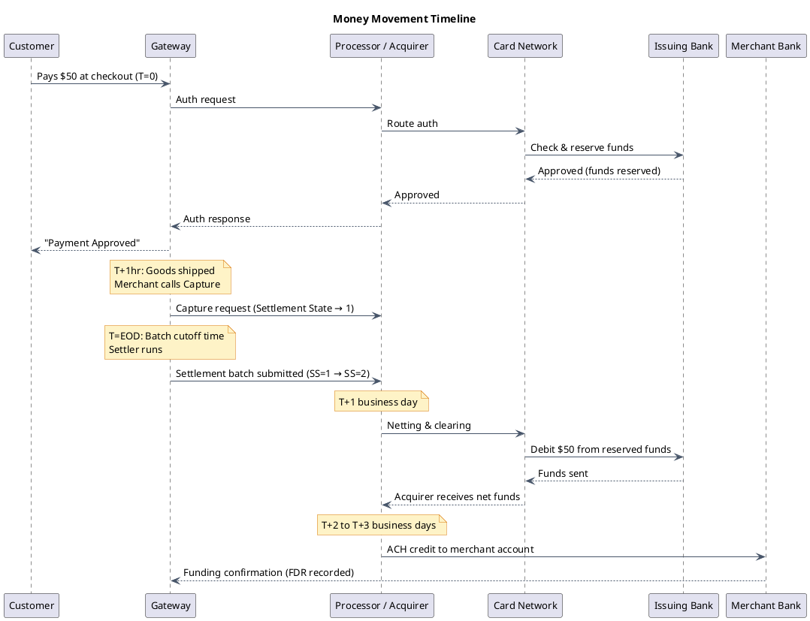
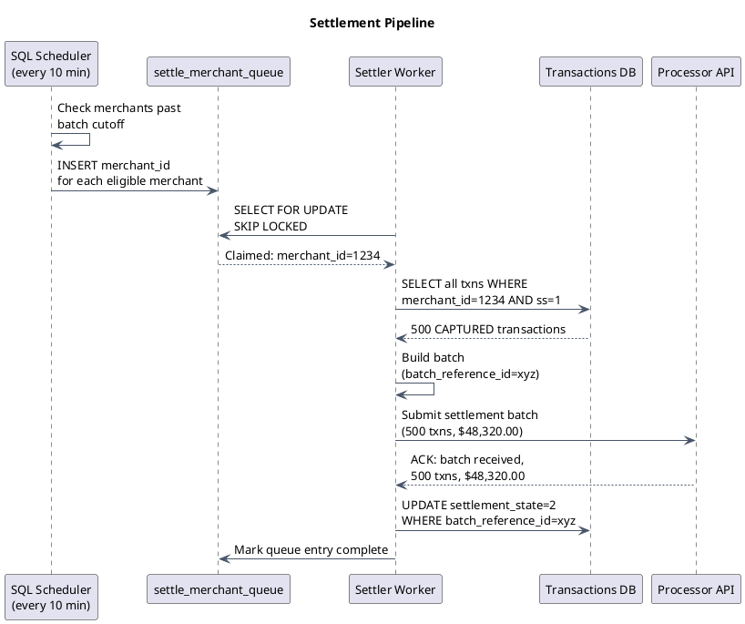
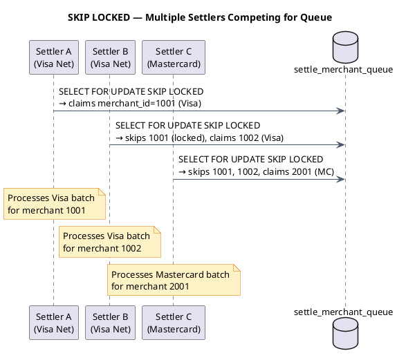

# Settlement, Funding & Reconciliation

When a customer pays at checkout, the transaction feels instant. But the actual movement of money is a multi-day pipeline involving banks, card networks, and processors. This file explains how that pipeline works — and how a payment gateway orchestrates it.

---

## Section 1: Why Settlement Exists — The Money Movement Gap

Authorization and settlement are two separate events.

**Authorization** (at checkout) is a *promise*. The issuing bank says: "Yes, this cardholder has funds — I will reserve $50." No money has moved yet. The gateway records the transaction, the card shows a pending charge, and the merchant is told "approved."

**Settlement** is the *actual transfer*. It is the process where the reserved funds are collected from the issuing bank and eventually deposited into the merchant's bank account.

Here is the full timeline from a single purchase:



:::note[Authorization is not a charge]
A customer's card shows a "pending" charge immediately. But the issuing bank has only *reserved* funds — not sent them anywhere. The pending charge disappears and becomes a real charge only after settlement completes.
:::

**Why the delay?** Card network clearing happens in nightly batches. ACH transfers between banks also run on business day cycles. The 2-3 day funding delay is a structural feature of the banking system, not a gateway limitation.

---

## Section 2: The Settlement Pipeline Step by Step

Each merchant has a **batch cutoff time** — a configurable time of day (e.g., 4:00 PM local time) after which all captured transactions are packaged and submitted to the processor. Transactions captured before the cutoff go into today's batch. Transactions after the cutoff roll into the next day's batch.

The pipeline works as follows:

1. A SQL scheduler job runs every 10 minutes and checks which merchants have passed their cutoff time.
2. Those merchants are enqueued in the `settle_merchant_queue` table.
3. Processor-specific **Settler worker** services continuously poll the queue, claiming jobs using `SELECT ... FOR UPDATE SKIP LOCKED`. Only one settler can claim each job.
4. The settler queries all transactions for that merchant where `settlement_state = 1` (CAPTURED, eligible for settlement).
5. The settler builds a batch file and transmits it to the processor — either via an online API call (modern processors) or a file upload (legacy batch processors).
6. The processor acknowledges receipt and returns a confirmation.
7. The settler updates all transactions in the batch to `settlement_state = 2` (Settled).
8. The settler marks the queue entry as complete.



:::tip[Why every 10 minutes?]
Running the scheduler frequently means merchants near their cutoff time are picked up quickly, reducing settlement lag. A 10-minute granularity is a practical balance between responsiveness and database polling overhead.
:::

---

## Section 3: Settlement States Explained

Every transaction carries a `settlement_state` (SS) field that tracks exactly where it is in the settlement lifecycle. This is the single source of truth for settler workers and reconciliation jobs.

| SS | Name | Meaning |
|---|---|---|
| 0 | Not settled | Auth-only, declined, or voided — not eligible for settlement |
| 1 | Settle | CAPTURED — eligible, waiting for the settler to pick it up |
| 2 | Settled | Successfully settled; batch confirmed by processor |
| 3 | Processor error | Processor returned a hard error for this batch |
| 4 | Out of balance | Batch totals submitted do not match processor's totals |
| 9 | DB error | Database error occurred during settlement update |
| 10 | Communication error | Could not reach the processor at all |
| 11 | Batch count mismatch | Transaction count sent differs from processor's count |
| 12 | Retryable error | General error that is safe to retry automatically |
| 14 | Settler service error | Internal settler logic crashed |
| 15 | Pending (eCheck) | ACH-specific pending state while NACHA processes |

Most error states (SS=10, SS=12, SS=14) can be retried automatically by the settler on the next scheduler cycle. SS=3 (processor error) requires investigation before retry — the processor may have a data issue with specific transactions.

:::danger
SS=4 (Out of Balance) must NEVER be auto-retried. This state means the dollar total or transaction count the settler submitted does not match what the processor received. Auto-retrying would re-submit the entire batch, causing duplicate transactions and double-charging customers. SS=4 requires manual investigation by the operations team to identify the discrepancy before any retry is attempted.
:::

---

## Section 4: The Settler Worker Design

A single settler would become a bottleneck at scale. The system runs **multiple settler instances**, typically one fleet per processor type (e.g., Visa Net settlers, Mastercard settlers, ACH settlers). They all compete for entries in the same `settle_merchant_queue`.

**SKIP LOCKED** is the key to safe concurrency. In PostgreSQL:

```sql
SELECT merchant_id, batch_id
FROM settle_merchant_queue
WHERE status = 'PENDING'
LIMIT 1
FOR UPDATE SKIP LOCKED;
```

When worker A locks row 1, worker B does not wait — it skips row 1 and tries row 2. This eliminates distributed locking overhead and prevents double-processing without coordination.

**Idempotency** protects against crashes. Each batch is assigned a `batch_reference_id` before submission. If the settler crashes after sending the batch but before writing SS=2, the next settler run re-checks with the processor: "Did you already receive batch_reference_id=xyz?" If yes, it skips re-submission and just writes SS=2.



---

## Section 5: Terminal vs Host Capture

There are two models for how authorization data gets captured before settlement:

**Host Capture** — the gateway holds the authorization. When settlement time comes, the gateway sends both the authorization and capture data to the processor in the settlement batch. This is standard for e-commerce. The merchant does not manage any batch locally.

**Terminal Capture** — the merchant's point-of-sale terminal stores the batch locally throughout the day. When the merchant "closes the batch" (end of business day), the terminal sends all authorizations directly to the processor. The gateway may or may not be involved in the final submission.

Most online/e-commerce integrations use host capture. Brick-and-mortar retail (grocery stores, gas stations, restaurants) often use terminal capture because the POS device manages the transaction record locally and has direct connectivity to the processor.

For the gateway, terminal capture means the settlement flow is different: the gateway does not initiate settlement; it receives the batch close notification and records the outcome.

---

## Section 6: Funding — How Merchants Get Paid

Settlement is not the same as funding. After the gateway settles with the processor, a separate funding pipeline moves money to the merchant's bank account.

**The funding timeline:**

1. **T+1 (business day):** The card network runs netting and clearing. It calculates what each issuing bank owes and sends net instructions. Acquirers receive funds from the card network.
2. **T+2 or T+3:** The acquirer reconciles receipts and initiates an ACH credit to the merchant's bank account. The gateway records this in the **Funding Detail Report (FDR)**.
3. The merchant sees the deposit in their bank account.

**Factors that affect funding timing:**

- **Business days only.** Weekends and federal holidays do not count. A settlement on Friday typically funds on Tuesday or Wednesday.
- **Merchant risk tier.** High-risk merchants (travel, adult content, nutraceuticals) may have 5-7 business day holds while the acquirer verifies chargebacks are not incoming.
- **Rolling reserve.** Some merchants are required to maintain a reserve — for example, 6% of monthly volume held for 180 days. This protects the acquirer if the merchant closes and chargebacks arrive. The reserve is funded from each settlement before the merchant receives the remainder.

---

## Section 7: The Four Reporting Types

The gateway produces four key financial reports, each serving a distinct audience:

| Report | What it shows |
|---|---|
| **FDR** — Funding Detail Report | Per-transaction detail of what was funded. Each row is one transaction with its amount, fees, adjustments. Matches one-to-one with individual transactions. |
| **DDR** — Deposit Detail Report | Per-deposit summary. One row per ACH deposit that hit the merchant's bank account. Rolls up all funded transactions into a single deposit line. |
| **TEDR** — Transaction Exception & Dispute Report | Returns, refund failures, eCheck NSF failures, and other transaction-level exceptions. |
| **CRDR** — Chargeback & Retrieval Dispute Report | Chargebacks received from card networks, dispute reason codes, merchant representment status, and final arbitration outcome. |

**FDR and DDR must balance.** The sum of all FDR rows for a given funding cycle must equal the total deposit amount shown in the corresponding DDR row. If they don't match, a reconciliation failure has occurred and requires investigation before the next funding cycle.

---

## Section 8: Reconciliation

Reconciliation is the process of verifying that every dollar recorded by the gateway actually moved through the processor and appeared in the merchant's bank account. Three sources of truth must agree:

1. **Gateway transaction records** — what the gateway believes it settled (SS=2 transactions)
2. **Processor settlement file** — what the processor confirmed receiving
3. **Bank deposit statement** — what actually hit the merchant's account

**The reconciliation algorithm:**

- Match each gateway batch record against the processor's settlement confirmation file (by `batch_reference_id`).
- **Missing transaction:** A transaction in the gateway is not in the processor's file → needs manual investigation. Did the submission fail silently?
- **Phantom transaction:** A record in the processor's file is not in the gateway → major alert. Could indicate fraud or a system error — money moved that the gateway has no record of.
- **Amount mismatch:** Totals must match within a $0.01 rounding tolerance (some processors truncate vs. round).

:::note[Why reconciliation matters]
A 0.01% discrepancy on $100M/day of volume equals $100,000 unaccounted for. Every cent must be traceable. Financial regulations (PCI DSS, SOX for public companies) require complete reconciliation records for auditing. Reconciliation failures must be logged, triaged, and resolved within 24 hours.
:::

---

## Section 9: Chargebacks

A **chargeback** occurs when a cardholder contacts their bank and says: "I did not authorize this charge" (or "the goods were never delivered," etc.). The issuing bank immediately reverses the transaction — the funds are taken back from the merchant without their consent.

**The chargeback lifecycle:**

1. Customer disputes transaction with issuing bank.
2. Issuing bank reverses funds and debits the merchant's acquirer account.
3. Gateway receives a chargeback notification and records it in the CRDR.
4. Merchant has 7–30 days (varies by card network and reason code) to submit **representment** — evidence that the transaction was valid (shipping confirmation, signed receipt, communication history).
5. If the merchant wins: funds are returned, chargeback is reversed.
6. If the merchant loses: the merchant absorbs the loss plus a chargeback fee of $15–$50 per incident.

**Why chargeback rates matter:**

Card networks monitor each merchant's chargeback rate (chargebacks ÷ total transactions). Exceeding 1% triggers placement on a **monitoring program**, which brings higher interchange fees and additional scrutiny. Persistent high rates can result in the merchant losing their ability to accept card payments entirely.

The CRDR tracks: chargeback received date, reason code, disputed amount, merchant response submitted, and final arbitration outcome.

---

## Section 10: Tradeoffs

:::success[Pull-based settler (queue-based)]
- Settler workers scale independently of transaction volume — add more workers during peak settlement windows (e.g., end of month) without touching the transaction pipeline.
- SKIP LOCKED prevents double-processing without the complexity of a distributed locking service (no ZooKeeper, no Redis locks required).
- Failed workers do not leave locks behind — the queue entry stays in PENDING until another worker claims it.
:::

:::caution[Challenges]
- Out-of-balance (SS=4) requires manual intervention and cannot be automated — it adds operational overhead and requires 24/7 on-call coverage for financial operations.
- Settlement timing depends entirely on processor availability. If the processor's API is degraded, batches pile up in the queue and merchants experience funding delays.
- Financial reconciliation failures require a complete audit trail — every state transition of every transaction must be persisted and queryable for potential regulatory review.
:::

---

[← Payment Gateway HLD](/learnings/payment-gateway/hld/)
