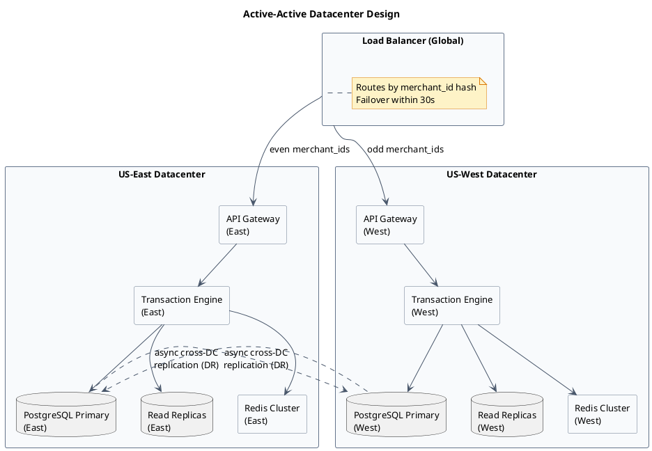
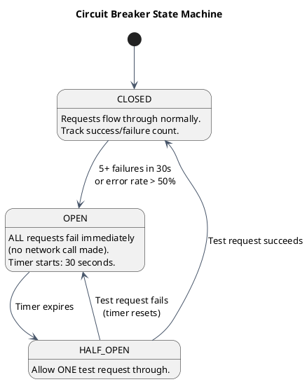
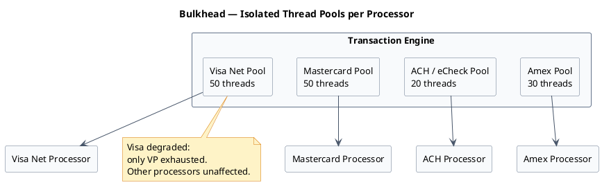

# Scalability & Reliability Design

A payment gateway cannot afford downtime. A 1-minute outage during peak hours can mean thousands of failed transactions and lost revenue for merchants. This file covers how a production-grade gateway is designed to handle high volume, survive failures, and stay consistent when things go wrong.

---

## Section 1: Scale Targets

Before designing anything, define what the system must handle. These targets drive every architectural decision — partitioning strategy, replication factor, cache sizing, thread pool depth.

| Metric | Target |
|---|---|
| Peak TPS | 5,000 transactions/second |
| Daily volume | 50 million transactions |
| p99 auth latency | < 3 seconds |
| Availability | 99.99% (< 53 minutes downtime/year) |
| Transaction durability | 0 lost transactions |
| Storage growth | ~100 GB/day raw, ~36 TB/year |

:::note[What 99.99% means in practice]
99.99% availability allows only 52.6 minutes of downtime per year — across all planned and unplanned outages. Achieving this requires active-active datacenters, automatic failover, and zero single points of failure in the critical path.
:::

5,000 TPS is the *peak* — not the average. Systems must be designed for peak, not average. A flash sale at 9:00 AM can spike traffic 10x in under a minute.

---

## Section 2: Active-Active Datacenter Design

The standard approach for high availability is **active-passive**: one primary datacenter handles all traffic, a standby datacenter sits idle waiting for the primary to fail. This wastes half the hardware and makes failover a disruptive "switch."

A payment gateway uses **active-active**: both datacenters serve live traffic simultaneously.

**How merchant affinity works:**

Each merchant is assigned a "home" datacenter using consistent hashing on `merchant_id`. For example, `merchant_id % 2 == 0` → US-East, `merchant_id % 2 == 1` → US-West. All requests for that merchant are routed to their home DC by the load balancer.

**Benefits of affinity:**
- Merchant config, session data, and cached data stay warm in one DC — no cross-DC lookups on the hot path.
- Cache hit rates are higher because one DC owns the hot data for each merchant.
- Cross-DC writes (which are expensive and require coordination) are rare.

**Failover:** If a merchant's home DC becomes unavailable, the load balancer detects this within 30 seconds (via health check) and reroutes to the other DC. The other DC may have a cache miss on first request, but the database replica will have the data.

**Database topology per DC:** Each datacenter has its own primary database (active) and read replicas. Cross-DC async replication keeps the standby DC's database current for disaster recovery. Async replication means the standby may lag by a few seconds — this is acceptable for disaster recovery but not for real-time consistency.

---

## Section 3: Database Design for Scale

The `transactions` table is the highest-write, highest-read table in the system. At 50M rows/day it needs careful design.

**Partitioning strategy — hash on `merchant_id`:**

The table is partitioned into 16 physical partitions based on `hash(merchant_id) % 16`. Each partition is a separate physical table with its own indexes and storage.

Why hash partitioning instead of date/range partitioning? Because date partitioning creates a **hot partition** — every new transaction goes to "today's" partition, concentrating all writes in one place. Hash partitioning distributes writes across all 16 partitions evenly.

**Indexes on the transactions table:**
- `(merchant_id, settlement_state)` — used by the settler to find all SS=1 transactions for a given merchant
- `(created_at)` — used for time-range reporting queries (always run on read replicas)
- `UNIQUE (merchant_id, idempotency_key)` — prevents duplicate inserts at the database level

**Read/write separation:** All settlement queries, fraud rules, and reporting queries run on read replicas. Only real-time authorization writes and live transaction lookups hit the primary.

**Other storage tiers:**

| Store | Technology | Used for |
|---|---|---|
| Primary DB | PostgreSQL | Transactions, merchants, subscriptions, batches |
| Cache | Redis (cluster) | Rate limiting, idempotency keys, merchant config, hot data |
| Event bus | Kafka | ACH records, async events, audit log, TMS overlay |
| Search | Elasticsearch (optional) | Full-text transaction search, fraud investigation |

---

## Section 4: Redis Usage Patterns

Redis is used for all data that must be accessed in milliseconds and does not need durable storage (it can be rebuilt from the database if Redis is lost). Each key namespace has its own TTL and eviction policy.

```plantuml
@startuml
skinparam backgroundColor #ffffff
skinparam Shadowing false
skinparam DefaultFontName Arial
skinparam DefaultFontSize 13
skinparam ArrowColor #475569
skinparam rectangleBorderColor #64748b
skinparam rectangleBackgroundColor #f8fafc
skinparam classBackgroundColor #f8fafc
skinparam classBorderColor #64748b
skinparam interfaceBackgroundColor #ecfdf5
skinparam interfaceBorderColor #10b981
skinparam noteBackgroundColor #fef3c7
skinparam noteBorderColor #d97706

title Redis Key Namespaces

rectangle "Redis Cluster" as REDIS {

  rectangle "merchant:{id}:config\n→ JSON blob\nTTL: 5 min | LRU eviction" as MC
  rectangle "idempotency:{merchant_id}:{key}\n→ cached response JSON\nTTL: 24h | no eviction" as IK
  rectangle "ratelimit:{merchant_id}\n→ token count + refill timestamp\nTTL: sliding | no eviction" as RL
  rectangle "dedup:{merchant_id}:{hash}\n→ transaction_id\nTTL: 2 min | no eviction" as DD
  rectangle "circuit:{processor}\n→ CLOSED / OPEN / HALF-OPEN\nTTL: 30s when OPEN" as CB

}

note right of MC : Cache-aside pattern:\nmiss → load from DB\n→ write to Redis
note right of IK : Prevents duplicate\nAPI call replays
note right of RL : Token bucket algorithm
note right of DD : Catches duplicate\nsubmissions within 2 min
note right of CB : Circuit breaker state\nper processor
@enduml
```

**Key design decisions:**

- `merchant:{id}:config` uses LRU eviction so low-traffic merchant configs are evicted under memory pressure, while active merchants stay hot.
- `idempotency:{merchant_id}:{key}` uses no eviction — idempotency keys must survive for the full 24h to prevent replay attacks. Sized explicitly.
- `circuit:{processor}` has a 30-second TTL *only when in OPEN state* — this is the automatic reset timer. CLOSED state has no TTL (it persists until a failure triggers transition).

---

## Section 5: Kafka for Async Decoupling

Some operations in the gateway do not need to happen synchronously in the authorization path. Kafka decouples these from the real-time flow.

| Topic | Producer | Consumer | Purpose |
|---|---|---|---|
| `ach-batch-records` | eCheck service | ACH batch processor | ACH submission decoupled from ingestion — batch processor groups records for NACHA files |
| `transaction-events` | Transaction Engine | TMS overlay, webhook service, audit log | Async processing of every transaction state change |
| `webhook-outbox` | Transaction Engine | Webhook delivery service | Reliable webhook delivery with retry logic |
| `token-provisioning` | Profile store | Network token service | Async network token provisioning — does not block card auth |

**Why Kafka instead of a database queue?**

A database queue (polling a table with `SELECT FOR UPDATE SKIP LOCKED`) works well for settlement because the consumer needs transactional guarantees with the same database. For cross-service async messaging, Kafka is better because:

- **Retained messages:** If the webhook service crashes and restarts, it reads from its last committed offset. No messages are lost.
- **Partitioned consumers:** Multiple consumers can process the `transaction-events` topic in parallel, each owning a partition.
- **Immutable audit log:** Kafka topics are append-only. The full event history is preserved for a configurable retention period (e.g., 7 days), giving an immutable audit trail of all state changes.

---

## Section 6: Circuit Breaker for Processor Calls

Without a circuit breaker, a slow or degraded processor causes cascading failure. If the processor takes 30 seconds to respond instead of 300ms, threads pile up waiting. The thread pool exhausts. The gateway cannot process transactions for *any* processor — not just the degraded one.

A **circuit breaker** wraps all outbound processor calls and tracks failure rate. It has three states:

**What happens in OPEN state?** The gateway returns an error immediately — in milliseconds — without touching the processor. Threads are freed. The gateway continues processing for other processors. The circuit breaker state is stored in Redis (`circuit:{processor}`) with a 30-second TTL so the HALF-OPEN test automatically occurs.

:::tip[Fail fast, recover automatically]
The circuit breaker is one of the most impactful reliability patterns in distributed systems. It converts a slow failure (threads waiting 30 seconds, then failing) into a fast failure (fail in 1ms). Fast failures are much cheaper than slow ones.
:::

---

## Section 7: Bulkhead Isolation

Even with a circuit breaker per processor, a problem remains: if all processor calls share the same thread pool, a slow Visa processor could consume all 100 threads, leaving none available for Mastercard — even though Mastercard is perfectly healthy.

The **bulkhead pattern** solves this by giving each processor its own dedicated thread pool.

**Pool sizing formula:** `pool_size = expected_concurrent_requests_per_processor × max_timeout_seconds`. For example, if the Visa processor handles 1,000 concurrent requests at peak and times out in 5 seconds, the pool needs at least 50 threads (1,000 / 5 = 200 requests/second × 5 seconds in-flight = 1,000 thread-seconds... but at steady state, 50 threads at 300ms each handle ~166 req/s). Size generously and monitor thread pool saturation.

---

## Section 8: Idempotency Everywhere

In a distributed system, any operation can fail after executing but before the caller receives the response. The caller retries — and without idempotency, the operation executes twice. For payments, that means double charges.

Every layer of the gateway enforces idempotency independently:

| Layer | Mechanism | Scope |
|---|---|---|
| API layer | Idempotency key in Redis (24h TTL) | Prevents duplicate API calls from the same merchant |
| Transaction engine | `UNIQUE INDEX (merchant_id, idempotency_key)` on transactions table | Prevents duplicate DB inserts if API layer Redis misses |
| Settler | `batch_reference_id` sent to processor | Processor deduplicates re-submitted batches |
| Subscription billing | `UNIQUE INDEX (subscription_id, billing_date)` | Prevents double-billing a subscriber in the same cycle |
| ACH | Stored procedure returns a duplicate status code | Prevents duplicate NACHA entries |

**Defense in depth:** Each layer is independent. If the Redis idempotency check fails (Redis is down), the database unique index catches the duplicate. If the transaction engine crashes after sending to the processor, the batch_reference_id prevents the processor from double-settling.

:::note[Idempotency key design]
A good idempotency key is unique per operation but deterministic: `merchant_id + order_id + "auth"`. This allows a client to safely retry the same operation. A random UUID per retry would defeat the purpose — each retry would be treated as a new operation.
:::

---

## Section 9: Load Shedding

Under extreme load — a Black Friday flash sale, a sudden viral product — the gateway may receive more requests than it can process. Load shedding is the deliberate dropping of lower-priority work to protect higher-priority work.

**Shedding priority (highest to lowest):**

1. **Never shed:** Authorization requests, settlement jobs, fraud checks. These are the core business function.
2. **First to shed:** Reporting queries. A merchant's transaction history report can be delayed by minutes without harm.
3. **Second to shed:** Non-critical async jobs. TMS (transaction management system) overlay, account updater, analytics pipelines.

**Implementation:** Each incoming request carries a priority header (`X-Request-Priority: HIGH/LOW`). The API gateway routes HIGH-priority requests to a dedicated thread pool that is never shared with LOW-priority work. Under load, LOW-priority requests are queued with a short timeout; if the queue is full, they return HTTP 429 (rate limited) immediately rather than waiting and consuming threads.

---

## Section 10: Capacity Math

Sizing decisions require concrete math. Assumptions without numbers lead to systems that are either over-provisioned (wasted cost) or under-provisioned (outage during peak).

**Bandwidth:**
- 5,000 TPS × 1 KB average request = 5 MB/s inbound per datacenter
- Response payloads average 500 bytes → 2.5 MB/s outbound
- With two DCs: 10 MB/s total inbound → comfortably within datacenter network capacity

**Storage:**
- 50M transactions/day × 2 KB per row = 100 GB/day raw
- With 3× replication (primary + 2 replicas): 300 GB/day
- 1 year: ~110 TB total. Requires multiple database nodes. Justifies 16-partition table from day one.

**Redis:**
- Merchant config: 100 KB/config × 500,000 merchants = 50 GB (with LRU, only hot configs stay in memory — practical usage ~5 GB)
- Active idempotency keys: 1 KB × 5M active per day = 5 GB
- Rate limit buckets: negligible (few bytes per merchant)
- Total Redis: ~10-15 GB across the cluster

**Kafka:**
- Transaction events: 5 MB/s × 86,400 seconds/day = ~432 GB/day per topic
- With 7-day retention: ~3 TB per topic
- 4 major topics: ~12 TB total Kafka storage

:::tip[Interview tip]
Always show capacity math when designing distributed systems. It justifies partitioning decisions, replication factors, and hardware sizing. The right answer to "why 16 partitions?" is: "We store 100 GB/day. A single disk handles ~500 GB comfortably. With 7-day hot data that's 700 GB — so we need at least 2 nodes. We use 16 to give room for growth and even distribution."
:::

---

## Section 11: Tradeoffs

:::success[Active-active over primary-backup]
- Both datacenters serve traffic simultaneously — hardware is fully utilized, not sitting idle as a hot standby.
- Failover is transparent to merchants: the load balancer re-routes in 30 seconds with no manual intervention.
- Merchants in each region get lower latency by being routed to the nearest DC.
:::

:::caution[Active-active challenges]
- **Cross-DC consistency:** For shared state (e.g., a merchant's account balance), you must choose between availability and strong consistency. Active-active typically chooses availability — updates may lag across DCs by seconds.
- **Routing complexity:** Merchant affinity hashing adds a layer of routing logic in the load balancer. Getting this wrong sends requests to the wrong DC and causes cache misses.
- **Data sovereignty:** Some merchants' data legally cannot leave certain regions (GDPR, India data localization). Affinity routing must be enforced at the compliance layer, not just for performance.
:::

:::success[Hash partitioning on the transactions table]
- Writes are distributed evenly across all 16 partitions — no single disk is a bottleneck.
- No "hot partition" on today's date; historical and recent data are interleaved by merchant.
- Each partition is independently vacuumed and indexed in PostgreSQL.
:::

:::caution[Hash partitioning challenges]
- **Range queries across merchants** (e.g., "show me all transactions from 9 AM to 10 AM across all merchants") require a scatter-gather query across all 16 partitions. This is expensive and avoided in favor of pre-aggregated reports.
- **Rebalancing is expensive.** Adding a 17th partition requires re-hashing and migrating a fraction of every merchant's data — a multi-hour operation on a live table.
- **Cross-partition joins** are not supported natively in PostgreSQL partitioning. All multi-merchant queries must be done at the application layer.
:::

---

[← Payment Gateway HLD](/learnings/payment-gateway/hld/)
