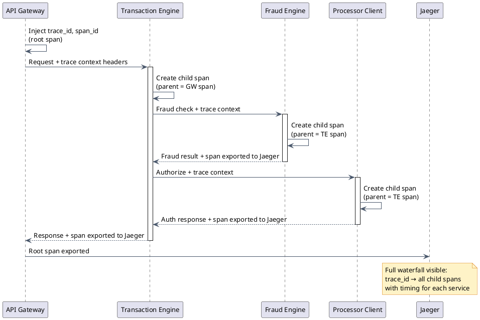

# Observability & Operations

## What is Observability?

Observability is the ability to understand a system's internal state from its external outputs. You cannot attach a debugger to a production payment system — you understand what is happening by examining what the system emits.

Three pillars:

- **Metrics** — what is happening right now (aggregated numbers over time)
- **Logs** — what happened and why (a record of discrete events)
- **Traces** — which path did a request take (timing across services)

In payments, a transaction must be traceable from the customer's click to the bank's approval code, across every service it touched. If a transaction fails and you cannot reconstruct its path, you cannot fix the problem — and you cannot prove to a regulator or a merchant that you handled their money correctly.

---

## Metrics

Metrics tell you whether your system is healthy right now. The goal is to catch degradation before customers notice — or before a small issue becomes a financial incident.

### Per-Subsystem Key Metrics

| Subsystem | Key Metrics |
|---|---|
| API Gateway | Request rate, auth failure rate, rate-limit hit rate, idempotency cache hit rate |
| Transaction Engine | Authorization success rate, p50/p95/p99 latency, processor error rate, PENDING transactions > 5 min |
| Fraud Engine | Fraud hold rate, decline rate per filter, false positive rate (from merchant disputes) |
| Settlement | Settlement success rate, SS=4 (out-of-balance) count, time to settle, settler queue depth |
| Recurring Billing | Billing success rate on first attempt, recovery rate, involuntary churn rate |
| ACH | Return rate by R-code, unauthorized return rate (must stay <0.5%), NACHA file submission latency |

### Critical Business Metrics

These are non-technical metrics that map directly to revenue and risk:

- **Authorization success rate** — industry benchmark is 85–95%. A drop means customers are being declined at checkout.
- **Decline reason distribution** — too many soft declines (insufficient funds vs. processor timeout vs. gateway error) tell very different stories.
- **Chargeback rate per merchant** — alert if >0.5%, critical if >1%. Card networks will place the merchant on a monitoring program.

### Collection Stack

Prometheus scrapes metrics endpoints exposed by each service. Grafana dashboards visualize them. Each service exposes `/metrics` in the Prometheus exposition format. Alertmanager routes critical alerts to PagerDuty.

---

## Logging

Logs are the audit trail. Every significant event in the payment lifecycle must be logged so that any transaction can be reconstructed after the fact.

### Core Rules

- All logs must be **structured JSON** — never free-form text strings. Unstructured logs cannot be reliably parsed for alerting or auditing.
- A **Correlation ID** (`request_id`) is injected by the API gateway and flows through every service. Every log line for a request carries the same `request_id`.
- A **Transaction ID** (`transaction_id`) is created when a transaction record is written and links all downstream logs for that transaction.

### What to Log

- **Request received**: method, endpoint, `merchant_id`, `request_id` — NOT card data
- **Auth decision**: approved/declined, processor response code, latency
- **State transitions**: PENDING → AUTHORIZED, AUTHORIZED → SETTLED, etc.
- **Fraud evaluation result**: which filter triggered, action taken (hold/decline/pass)
- **Settlement events**: batch opened, submitted to processor, confirmation received

:::danger[What NEVER goes in logs]
- Card number (PAN) — even the last 4 digits paired with full context is dangerous
- CVV/CVC — ever, at any time, for any reason. Logging CVV is a PCI DSS violation.
- Full bank account numbers (ACH)
- Transaction signing key / API secret
- Any value tagged as "sensitive" in the request schema
:::

### Log Scrubbing Middleware

A structured log interceptor runs BEFORE emission. It redacts designated fields regardless of which service emits them. Every service inherits this behavior automatically via the shared logging library — no individual service needs to remember to scrub. The scrubber operates on field names (e.g., `card_number`, `cvv`, `account_number`) and replaces values with `[REDACTED]`.

---

## Distributed Tracing

A single payment authorization touches multiple services: API Gateway → Transaction Engine → Fraud Engine → Processor Client → Database. Without tracing, when latency spikes, you cannot tell which service is slow. With tracing, you get a flame chart showing time spent in each service, each database query, and each external call.

### OpenTelemetry Standard

- Inject `trace_id` and `span_id` into every request at the API gateway
- Each service creates **child spans** for its work — a span represents a unit of work with a start time and duration
- Spans are exported to a tracing backend (Jaeger or Grafana Tempo)
- Query: "Show me the trace for `transaction_id=TXN_abc123`" → see full waterfall across all services

### Key Spans to Instrument

- Redis lookup (merchant config cache hit/miss)
- Duplicate check database query
- Fraud rule evaluation
- Processor HTTP call — this is the external latency and typically the dominant contributor
- Database write for PENDING and for response update

### Trace Propagation Flow

---

## Alerting Strategy

Two categories of alerts serve different purposes.

### Symptom-Based Alerts (Preferred)

Alert on what users experience, not on internal causes. These fire when something is actually wrong from a customer or merchant perspective:

- "Authorization success rate dropped below 90%" — customers are being declined, regardless of why
- "p99 latency > 5 seconds" — customers are waiting too long at checkout

Symptom-based alerts are preferred because they directly correspond to SLO violations and avoid alert fatigue from noisy infrastructure signals.

### Cause-Based Alerts (Secondary)

These fire on internal signals and help operators investigate a symptom that is already alerting:

- "Processor X circuit breaker is OPEN" — explains the auth rate drop
- "PENDING transactions > 5 minutes count = 50" — possible money loss situation

### Burn Rate Alerting (for SLO Budgets)

- SLO: 99.99% availability = 52 minutes downtime per year allowed
- If the system is currently burning the error budget 100× faster than allowed → page on-call immediately, even if the overall success rate has not yet crossed the threshold
- Burn rate alerts catch small-but-sustained degradations before they exhaust the error budget

### Critical Alerts Table

| Alert | Threshold | Urgency |
|---|---|---|
| Auth success rate | < 90% for 5 min | P1 — page immediately |
| Auth p99 latency | > 5s for 5 min | P1 |
| PENDING transactions stuck | > 10 records > 10 min | P1 — possible money loss |
| Processor circuit breaker open | Any | P2 |
| Settlement out-of-balance (SS=4) | Any | P1 |
| ARBTGen zero transactions | On any scheduled billing day | P1 |
| ACH unauthorized return rate | > 0.4% | P1 — approaching NACHA limit |
| Fraud decline rate spike | >3× normal in 1h | P2 |

---

## Key Dashboards

Well-designed dashboards let an on-call engineer assess system health in under 30 seconds. Each dashboard focuses on one domain:

- **Transaction Health** — real-time auth success rate, latency histogram, decline reason breakdown by category
- **Processor Health** — per-processor success rate, latency, circuit breaker state (open/closed/half-open)
- **Settlement Dashboard** — batches in progress, SS=4 out-of-balance count, funding pipeline status, time since last successful settlement
- **Fraud Dashboard** — hold rate trend, decline rate by filter, top triggered filters, false positive rate from dispute data
- **Recurring Billing** — today's billing run progress, success/fail counts, retry queue depth, involuntary churn rate this cycle

---

## Incident Runbooks

Runbooks are the first thing an on-call engineer opens when paged. Each runbook answers: what do I look at first, and what actions are safe to take without escalating?

### Processor Down

1. Check circuit breaker state in Redis — is the breaker OPEN?
2. Check the processor's public status page for reported incidents
3. Enable fallback processor if one is configured and healthy
4. Notify merchants of degraded service via status page
5. When processor recovers: manually reset the circuit breaker, monitor auth success rate for 10 minutes before declaring recovery

### Settlement Out-of-Balance (SS=4)

1. Identify which batch is out of balance from the Settlement Dashboard
2. Compare gateway batch totals against the processor-provided settlement file line by line
3. Find the discrepancy transaction(s) — common causes: duplicate capture, partial capture mismatch, void received after batch closed
4. Do NOT re-submit the batch automatically — this risks double-settlement
5. Resolve the discrepancy manually, update the affected records, then requeue the corrected batch

### ARBTGen Silent Failure (Zero Billings on a Scheduled Day)

1. Check ARBTGen application logs for error messages or stack traces
2. Check Redis Redlock — is another (possibly stale) instance holding the distributed lock indefinitely?
3. Check the database: are subscriptions still marked as due (next_billing_date in the past, status = ACTIVE)?
4. If the lock is stale, force-expire it, then restart ARBTGen; monitor the first billing cycle
5. Verify no double-billing: check for duplicate `billing_attempt` records with the same `subscription_id` and billing date

---

## SLA / SLO Design

An SLA (Service Level Agreement) is a contractual commitment to merchants — it has financial penalties for breach. An SLO (Service Level Objective) is an internal reliability target — it is the goal you try to stay within so you never breach the SLA.

| Service | SLO |
|---|---|
| Authorization API | 99.99% success rate, p99 < 3s |
| Settlement pipeline | 99.9% of batches settled within 2h of cutoff |
| Recurring billing | 99.9% of due subscriptions attempted within 1h window |
| Webhook delivery | 99% delivered within 5 minutes |

**Error budget math for Authorization API:**
- 99.99% = 0.01% errors allowed
- Per year: 52 minutes of downtime / errors
- Per month: ~4.3 minutes
- Per week: ~1 minute

This means a single 5-minute outage exhausts the monthly error budget for that week. Burn rate alerting is essential to avoid discovering this at the end of the month.

---

## Tradeoffs

:::success[Structured logging + distributed tracing]
- A single `transaction_id` lets you see the full story across all services — from API gateway receipt to processor response
- Structured JSON makes programmatic alerting and dashboard queries straightforward
- Burn rate alerting catches slow burns (e.g., 2% error rate) before they exhaust the error budget, unlike threshold-only alerting
:::

:::caution[Observability costs]
- Distributed tracing adds approximately 1–2ms overhead per request — acceptable against a 3-second p99 SLO but worth measuring
- Log storage is expensive at scale: 50M transactions/day multiplied by average log volume per transaction can exceed hundreds of GB/day
- Alert tuning is an ongoing process: too many alerts cause fatigue and on-call burnout; too few create silent failures. Getting the thresholds right takes weeks of production data.
:::

---

[← Payment Gateway HLD](/learnings/payment-gateway/hld/)
