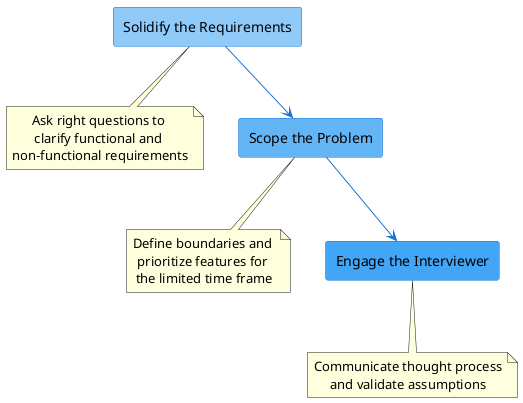

System design is the process of defining the components, data model, their integration & APIs to build a large scale system that meets a specific set of functional and non-functional requirements.

System design aims to build system that are reliable, effective and maintainable.

- **Reliable systems** - system can handle faults, failures and errors
- **Effective systems** - system that meets the functional and non-functional requirements
- **Maintainable systems** - are systems that are easy to scale up and down, also the ability to add new features.

Distributed systems give us guideposts for mature software principles. These include the following:

- **Robustness** - The ability to maintain operations during a crisis

- **Scalability** - The ability to handle increased load by adding resources

- **Availability** - The proportion of time a system is operational and accessible

- **Performance** - The speed and efficiency at which the system responds to requests

- **Extensibility** - The ease of adding new features without major architectural changes

- **Resiliency** - The ability to return to normal operations over an acceptable period of time post-disruption

## How do we tackle a design question?

1. Ask right questions to solidify the requirements
2. Scope the problem, so that they're able to make good attempt solving it within the limited time frame.
3. Communication with the interviewer, we should engage the interviewer to ensure that they understood our thought process.

## 4 Steps for effective system design interview

### Step-1 Understand the problem and establish design scope
:::caution[Time]{icon=seti:clock}
3-10 minutes
:::

In a system design interview, giving out an answer quickly without thinking gives you no
bonus points. Answering without a thorough understanding of the requirements is a huge red
flag as the interview is not a trivia contest. There is no right answer.

So, do not jump right in to give a solution. Slow down. Think deeply and ask questions to
clarify requirements and assumptions. This is extremely important.

As an engineer, we like to solve hard problems and jump into the final design; however, this
approach is likely to lead you to design the wrong system. One of the most important skills as
an engineer is to ask the right questions, make the proper assumptions, and gather all the
information needed to build a system. So, do not be afraid to ask questions.

:::tip[Questions]
- What specific features are we going to build?
- How many users does the product have?
- How fast does the company anticipate to scale up? What are the anticipated scales in 3
months, 6 months, and a year?
- What is the company’s technology stack? What existing services you might leverage to
simplify the design?

- What’s the size of the data right now?

- At what rate is the data expected to grow over time?

- How will the data be consumed by other subsystems or end users?

- Is the data read-heavy or write-heavy?

- Do we need strict consistency of data, or will eventual consistency work?

- What’s the durability target of the data?

- What privacy and regulatory requirements do we require for storing or transmitting user data?

:::

- **Clarify requirements and identify the big components** to help you solve your problem. For example, what efficiencies are you trying to achieve?

- **Understand the scale of your system**. For example, are you solving for hundreds of thousands of users or millions?

- **Understand the constraints of the organization**. For example, are you facing certain latency limitations?

:::note[Data needed for next steps]
1. Critical features or features of interest
2. for QPS: query per seconds - gather the peak usage, number of users
3. data storage estimations

:::

### Step 2 - Propose high-level design and get buy-in
:::caution[Time]{icon=seti:clock}
10-15 minutes
:::
In this step, we aim to develop a high-level design and reach an agreement with the
interviewer on the design. It is a great idea to collaborate with the interviewer during the
process.
- Come up with an initial blueprint for the design. Ask for feedback. Treat your
interviewer as a teammate and work together. Many good interviewers love to talk and get
involved.
- Draw box diagrams with key components on the whiteboard or paper. This might include
clients (mobile/web), APIs, web servers, data stores, cache, CDN, message queue, etc.
- Do `back-of-the-envelope` calculations to evaluate if your blueprint fits the scale
constraints. Think out loud.
:::note
 Communicate with your interviewer if `back-of-the-envelope` is
necessary before diving into it.
:::

:::tip[Example]
Let us use **“Design a news feed system”** to demonstrate how to approach the high-level
design. Here you are not required to understand how the system actually works. 

At the high level, the design is divided into two flows: feed publishing and news feed
building.

- **Feed publishing**: when a user publishes a post, corresponding data is written into
cache/database, and the post will be populated into friends’ news feed.
- **Newsfeed building**: the news feed is built by aggregating friends’ posts in a reverse
chronological order.

:::

### Step 3 - Design deep dive
:::caution[Time]{icon=seti:clock}
10-25 minutes
:::
:::note[Prerequisites]
At this step, you and your interviewer should have already achieved the following objectives:
- Agreed on the overall goals and feature scope
- Sketched out a high-level blueprint for the overall design
- Obtained feedback from your interviewer on the high-level design
- Had some initial ideas about areas to focus on in deep dive based on her feedback
:::

In this step you shall work with the interviewer to identify and prioritize components in the architecture.

In most cases, the interviewer may want you to
dig into details of some system components. By diving deeper into API design, databases, features like authentication, rate-limiting, message queue, cache, CDN, failover strategies, etc whatever we feel is important for improving the HLD from step 2.

Discuss the trade-offs

:::tip[Example]
For `URL shortener`, it is interesting to dive into
the hash function design that converts a long URL to a short one. 

For a `chat system`, how to
reduce latency and how to support online/offline status are two interesting topics.

For `news feed system`, we will investigate two of the most important
use cases:
1. Feed publishing
2. News feed retrieval
And we will try to add more details to the previously proposed HLD, like API design, databases, features like authentication, rate-limiting, message queue, cache, CDN.
:::

### Step 4 - Wrap up
:::caution[Time]{icon=seti:clock}
3-5 minutes
:::
- The interviewer might want you to identify the system bottlenecks and discuss potential
improvements. Never say your design is perfect and nothing can be improved.

-  It could be useful to give the interviewer a recap of your design. This is particularly
important if you suggested a few solutions. Refreshing your interviewer’s memory can be
helpful after a long session

-  Error cases (server failure, network loss, etc.) are interesting to talk about.
- Operation issues are worth mentioning. How do you monitor metrics and error logs?
How to roll out the system?
- How to handle the next scale curve is also an interesting topic. For example, if your
current design supports 1 million users, what changes do you need to make to support 10
million users?

## Trade-offs discussion
A trade-off is a compromise that is made between two desired but incompatible features. Trade-offs are performed mostly between the non-functional requirements in the System Design world.

Remember that there’s no one correct answer to a design problem.

If we give the same problem to two different groups, they might come up with different designs.

These are some of the reasons why such diversity exists in design solutions:

- Different components have different pros and cons. We’ll need to carefully weigh what works for us.
- Different choices have different costs in terms of money and technical complexity. We need to efficiently utilize our resources.
- Every design has its weaknesses. As designers, we should be aware of all of them, and we should have a follow-up plan to tackle them.

We should point out weaknesses in our design to our interviewer and explain why we haven’t tackled them yet.
- An example could be that our current design can’t handle ten times more load, but we don’t expect our system to reach that level anytime soon.
- We have a monitoring system to keep a very close eye on load growth over time so that a new design can be implemented in time.

This is an example where we intentionally had a weakness to reduce system cost.
Something is always failing in a big system. We need to integrate fault tolerance and security into our design.

### Types of trade-offs

You can’t have a perfect app that satisfies all requirements, so you’ll want to get comfortable identifying the most important requirements for your system.

A banking app is a good example of an app that must be secure and will have to accept less flexibility and lower performance.

some common trade-offs revolve around the following:

- Storage
- Security
- Caching
- Availability
- Cost
- Latency
- Consistency
- Data Structure
- Reliability
- Read/Write Throughput

### Demonstrating your understanding of trade-offs
highlight your ability to navigate trade-offs in your interview:

- Consider 2-3 possible solutions.
- Narrate the trade-offs between the solutions.
- Justify your chosen trade-off.

#### Consider 2-3 possible solutions
Instead of jumping to one solution, you can briefly consider 2-3 possible solutions to your problem wherever it makes sense. This gives interviewers an opportunity to see how you weigh trade-offs between each solution and land on the solution that seems to best satisfy your requirements (within your known constraints).

Instead of jumping to one solution, you can briefly consider 2-3 possible solutions to your problem wherever it makes sense. This gives interviewers an opportunity to see how you weigh trade-offs between each solution and land on the solution that seems to best satisfy your requirements (within your known constraints).

At this stage, you can:

- Narrate the trade-offs of each solution.
- Ask clarifying questions as needed.
- Eliminate the solutions that don’t align with the priorities of the system.

:::tip[Example]
For example, let’s say you’ve been asked to design an audio streaming app like Spotify. Based on your requirements, you’ve pitched two solutions with different optimizations:

A solution that provides streaming of high-quality audio at the cost of higher bandwidth requirements.

A solution that provides accessible service to users with varying speeds of internet at the cost of streaming quality.
:::

#### Narrate the trade-offs between the solutions

:::tip[Example]
“While providing high-quality streaming would be an amazing user experience, it would only work for people with access to broadband or 5G internet, which is a small fraction of the world’s population. If accessibility is the bigger priority, then we’ll have to sacrifice some of the quality of the media and stream at a lower bitrate. People who can hear the nuances in the audio won’t be happy with it. However, we’ll reach more people.”
:::

By weighing the pros and cons and narrating your thought process here, you show that you’re considering the implications of your design. You can then ask your interviewers about the priorities of the system. Depending on your interviewer, you might be given more details that will help you make an informed decision.

#### Justify your chosen trade-off

When you land on a solution, you should justify why it’s the solution with the most acceptable trade-offs. Which requirements will you be able to fulfill? Why is this best for solving the problem, given what you know?

:::tip[Example]
Let’s say your interviewer asked you to design YouTube. As you discussed the problem, you could have identified a trade-off you needed to make. For example, you may need to decide between prioritizing the speed of:

Uploading a video, if you optimize storage for write efficiency.

Viewing a video, if you optimize storage for read efficiency.

Now, when you make your decision, justify it. You could say: “I’d compromise uploads for optimal streaming.” Then, explain why:

“There are fewer people uploading videos than watching.”

“The user experience suffers most for delays in viewing videos vs. uploading videos.”

:::

## Talking points for each level

| Level | Talking Points |
|-------|----------------|
| **SWE-I/SWE-II** | • Describe the basic components of the system • Dive deep into 1-2 areas • Discuss trade-offs |
| **Senior Engineer** | • Describe components and their interaction • Describe the complete lifecycle of a request (e.g., from client to server to back-end services) • Drive the conversation toward diving deep into components • Explain and align the trade-offs with the desired product goals and user experience |
| **Staff Engineer** | • Describe components and identify the critical components • Identify potential choke points and bottlenecks • Identify future problems as systems need to scale and offer solutions • Demonstrate an ability to build a solution for immediate needs while keeping in mind potential improvements that will help scale in the future • Describe failover (e.g., talk about recovery paths when machines fail) • Talk about the user experience when failures happen and how that impacts Service Level Agreements (SLAs) • Think about privacy across the product (e.g., GDPR compliance) |
| **Principal/Distinguished Engineer** | • Discuss real-world implications of the solutions deployed • Talk about data center failovers, regional backups, and disaster recovery • Talk about usage patterns (e.g., query patterns, peak loads, handling DDOS attacks, and graceful degradations of the service) • Talk about the negative impact on the company's reputation in case of security breaches and service outages and how to manage those SLA expectations |
| **Technical Project Manager/Project Manager** | • Discuss how scalable systems work (e.g., Facebook storage systems) • Discuss core concepts and building blocks of a distributed system and how they interact with each other at an abstract level • Talk about how budget, stakeholder commitment, and other variables will affect the technologies they choose to use |