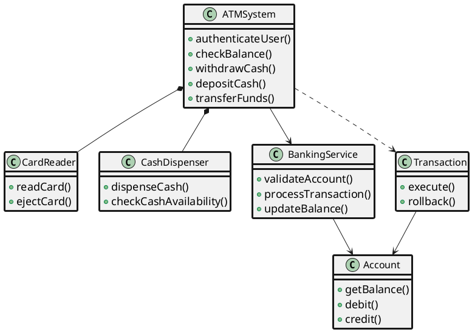
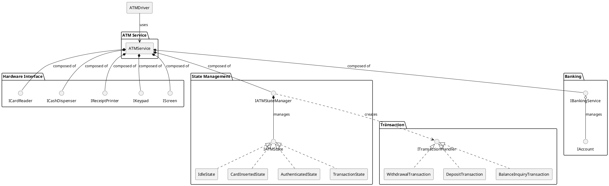
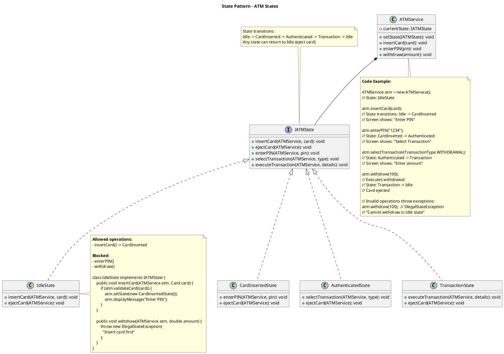
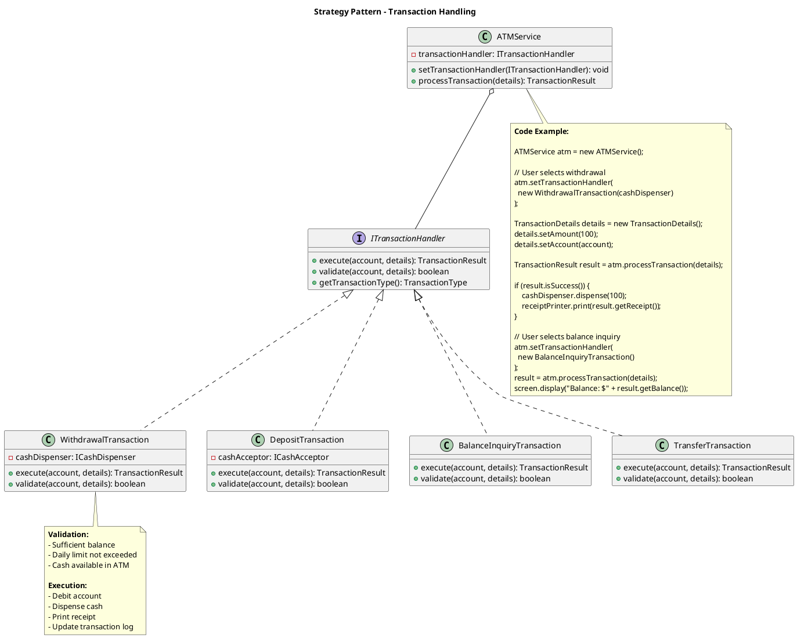
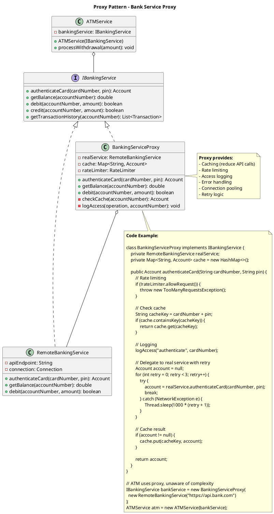

## Problem Statement

Design an ATM system that allows users to perform banking operations like cash withdrawal, deposit, balance inquiry, and fund transfers. The system should authenticate users, communicate with the bank's backend, handle cash dispensing, and maintain transaction logs.

## Requirements

### Functional Requirements
1. Authenticate users with card and PIN
2. Check account balance
3. Withdraw cash with denomination selection
4. Deposit cash and checks
5. Transfer funds between accounts
6. Print transaction receipts
7. Handle multiple account types (Savings, Checking)
8. Change PIN
9. Maintain transaction history
10. Handle insufficient funds and daily limits

### Non-Functional Requirements
1. Secure PIN handling and encryption
2. Handle concurrent user sessions
3. Reliable cash dispensing mechanism
4. Transaction rollback on failures
5. Audit logging for all operations
6. Network resilience for bank communication

## Simplified Class Diagram



## Simplified Overview



## Detailed Class Diagram

```plantuml
@startuml

enum AccountType {
    SAVINGS
    CHECKING
    CREDIT
}

enum TransactionType {
    WITHDRAWAL
    DEPOSIT
    TRANSFER
    BALANCE_INQUIRY
}

enum TransactionStatus {
    PENDING
    SUCCESS
    FAILED
    CANCELLED
}

enum CardStatus {
    ACTIVE
    BLOCKED
    EXPIRED
}

interface ICard {
    + getCardNumber(): String
    + validatePIN(pin: String): boolean
    + isValid(): boolean
    + getStatus(): CardStatus
}

class Card {
    - cardNumber: String
    - pinHash: String
    - expiryDate: Date
    - status: CardStatus
    - failedAttempts: int
    - pinValidator: IPinValidator
    + Card(cardNumber: String, pinHash: String, validator: IPinValidator)
    + validatePIN(pin: String): boolean
    + isValid(): boolean
}

interface IPinValidator {
    + validate(inputPin: String, storedHash: String): boolean
}

class PinValidator {
    + validate(inputPin: String, storedHash: String): boolean
}

interface IAccount {
    + getAccountNumber(): String
    + getBalance(): double
    + debit(amount: double): boolean
    + credit(amount: double): void
}

class Account {
    - accountNumber: String
    - type: AccountType
    - balance: double
    - withdrawalLimitChecker: IWithdrawalLimitChecker
    + Account(accountNumber: String, type: AccountType, checker: IWithdrawalLimitChecker)
    + getBalance(): double
    + debit(amount: double): boolean
    + credit(amount: double): void
}

interface IWithdrawalLimitChecker {
    + canWithdraw(account: IAccount, amount: double): boolean
    + recordWithdrawal(account: IAccount, amount: double): void
}

class DailyWithdrawalLimitChecker {
    - limits: Map<String, Double>
    + canWithdraw(account: IAccount, amount: double): boolean
    + recordWithdrawal(account: IAccount, amount: double): void
}

interface ICustomer {
    + getCustomerId(): String
    + getName(): String
    + getAccounts(): List<IAccount>
}

class Customer {
    - customerId: String
    - name: String
    - email: String
    - accounts: List<IAccount>
    - card: ICard
    + Customer(customerId: String, name: String)
    + getAccounts(): List<IAccount>
}

interface ITransaction {
    + getTransactionId(): String
    + getType(): TransactionType
    + execute(): boolean
    + rollback(): void
    + getStatus(): TransactionStatus
}

abstract class Transaction {
    - transactionId: String
    - type: TransactionType
    - status: TransactionStatus
    - timestamp: DateTime
    + Transaction(type: TransactionType)
    + {abstract} execute(): boolean
    + {abstract} rollback(): void
    + getStatus(): TransactionStatus
}

class WithdrawalTransaction {
    - account: IAccount
    - amount: double
    - cashDispenser: ICashDispenser
    + WithdrawalTransaction(account: IAccount, amount: double, dispenser: ICashDispenser)
    + execute(): boolean
    + rollback(): void
}

class DepositTransaction {
    - account: IAccount
    - amount: double
    + DepositTransaction(account: IAccount, amount: double)
    + execute(): boolean
    + rollback(): void
}

class TransferTransaction {
    - fromAccount: IAccount
    - toAccount: IAccount
    - amount: double
    + TransferTransaction(from: IAccount, to: IAccount, amount: double)
    + execute(): boolean
    + rollback(): void
}

interface ICashDispenser {
    + dispenseCash(amount: double): Map<Integer, Integer>
    + canDispense(amount: double): boolean
}

class CashDispenser {
    - denominations: Map<Integer, Integer>
    - denominationCalculator: IDenominationCalculator
    + CashDispenser(calculator: IDenominationCalculator)
    + dispenseCash(amount: double): Map<Integer, Integer>
    + canDispense(amount: double): boolean
}

interface IDenominationCalculator {
    + calculate(amount: double, available: Map<Integer, Integer>): Map<Integer, Integer>
}

class GreedyDenominationCalculator {
    + calculate(amount: double, available: Map<Integer, Integer>): Map<Integer, Integer>
}

interface ICardReader {
    + readCard(): ICard
    + ejectCard(): void
}

class CardReader {
    + readCard(): ICard
    + ejectCard(): void
}

interface IScreen {
    + displayMessage(message: String): void
    + displayMenu(options: List<String>): void
}

class Screen {
    + displayMessage(message: String): void
    + displayMenu(options: List<String>): void
}

interface IKeypad {
    + getInput(): String
    + getPIN(): String
}

class Keypad {
    + getInput(): String
    + getPIN(): String
}

interface IPrinter {
    + printReceipt(transaction: ITransaction): void
}

class ReceiptPrinter {
    + printReceipt(transaction: ITransaction): void
}

interface IBankService {
    + authenticateUser(cardNumber: String, pin: String): ICustomer
    + getAccount(accountNumber: String): IAccount
    + processTransaction(transaction: ITransaction): boolean
}

class BankAPIService {
    - apiUrl: String
    + authenticateUser(cardNumber: String, pin: String): ICustomer
    + getAccount(accountNumber: String): IAccount
    + processTransaction(transaction: ITransaction): boolean
}

interface IATMService {
    + start(): void
    + authenticateUser(): ICustomer
    + processTransaction(type: TransactionType): void
}

class ATMService {
    - atmId: String
    - cashDispenser: ICashDispenser
    - cardReader: ICardReader
    - screen: IScreen
    - keypad: IKeypad
    - printer: IPrinter
    - bankService: IBankService
    - stateManager: IATMStateManager
    + ATMService(atmId: String, dispenser: ICashDispenser, reader: ICardReader, 
      screen: IScreen, keypad: IKeypad, printer: IPrinter, bank: IBankService, 
      stateManager: IATMStateManager)
    + start(): void
    + authenticateUser(): ICustomer
    + processTransaction(type: TransactionType): void
}

interface IATMStateManager {
    + transitionTo(state: IATMState): void
    + getCurrentState(): IATMState
}

class ATMStateManager {
    - currentState: IATMState
    + transitionTo(state: IATMState): void
    + getCurrentState(): IATMState
}

interface IATMState {
    + insertCard(): void
    + ejectCard(): void
    + enterPIN(): void
    + selectOperation(): void
}

class IdleState {
    + insertCard(): void
    + ejectCard(): void
    + enterPIN(): void
    + selectOperation(): void
}

class AuthenticatedState {
    + insertCard(): void
    + ejectCard(): void
    + enterPIN(): void
    + selectOperation(): void
}

class ATMDriver {
    + {static} main(args: String[]): void
    - setupATM(): IATMService
    - demonstrateWithdrawal(): void
    - demonstrateDeposit(): void
}

ICard <|.. Card
Card --> CardStatus
Card --> IPinValidator
IPinValidator <|.. PinValidator

IAccount <|.. Account
Account --> AccountType
Account --> IWithdrawalLimitChecker
IWithdrawalLimitChecker <|.. DailyWithdrawalLimitChecker

ICustomer <|.. Customer
Customer --> ICard
Customer --> IAccount

ITransaction <|.. Transaction
Transaction --> TransactionType
Transaction --> TransactionStatus

Transaction <|-- WithdrawalTransaction
Transaction <|-- DepositTransaction
Transaction <|-- TransferTransaction

WithdrawalTransaction --> IAccount
WithdrawalTransaction --> ICashDispenser
DepositTransaction --> IAccount
TransferTransaction --> IAccount

ICashDispenser <|.. CashDispenser
CashDispenser --> IDenominationCalculator
IDenominationCalculator <|.. GreedyDenominationCalculator

ICardReader <|.. CardReader
IScreen <|.. Screen
IKeypad <|.. Keypad
IPrinter <|.. ReceiptPrinter

IBankService <|.. BankAPIService

IATMService <|.. ATMService
ATMService --> ICashDispenser
ATMService --> ICardReader
ATMService --> IScreen
ATMService --> IKeypad
ATMService --> IPrinter
ATMService --> IBankService
ATMService --> IATMStateManager

IATMStateManager <|.. ATMStateManager
ATMStateManager --> IATMState

IATMState <|.. IdleState
IATMState <|.. AuthenticatedState

ATMDriver ..> IATMService
ATMDriver ..> ICashDispenser
ATMDriver ..> IBankService

@enduml
```



## Key Design Patterns

1. **[State Pattern](/low-level-design/patterns/behavioural-patterns/#state-pattern)**: ATM states (Idle, CardInserted, Authenticated)
2. **[Strategy Pattern](/low-level-design/patterns/behavioural-patterns/#strategy-pattern)**: Different transaction types
3. **[Singleton Pattern](/low-level-design/patterns/singleton/)**: ATM instance management
4. **[Factory Pattern](/low-level-design/patterns/creational-patterns/#factory-method)**: Create different transaction types
5. **[Proxy Pattern](/low-level-design/patterns/structural-patterns/#proxy)**: BankService as proxy to backend

### Design Pattern Diagrams

#### 1. State Pattern - ATM State Management



#### 2. Strategy Pattern - Transaction Types



#### 3. Proxy Pattern - Banking Service



## Code Snippets

### Cash Withdrawal

:::note
Comprehensive withdrawal process with validations, ATM cash check, account balance verification, bank transaction processing, and receipt printing.
:::

```java title="ATM.java" {4-6,9-11,14-16,24-26,31-32,35,40-42}
public class ATM {
    public void withdrawCash(Account account, double amount) throws ATMException {
        // Validate amount
        if (amount <= 0 || amount % 10 != 0) {
            throw new ATMException("Invalid amount. Must be multiple of 10");
        }
        
        // Check ATM has sufficient cash
        if (!cashDispenser.canDispense(amount)) {
            throw new ATMException("Insufficient cash in ATM");
        }
        
        // Check account balance and limits
        if (!account.canWithdraw(amount)) {
            throw new ATMException("Insufficient funds or daily limit exceeded");
        }
        
        // Create transaction
        WithdrawalTransaction transaction = new WithdrawalTransaction(account, amount);
        
        try {
            // Process with bank
            if (bankService.processTransaction(transaction)) {
                // Dispense cash
                Map<Integer, Integer> denominations = cashDispenser.dispenseCash(amount);
                cashSlot.dispenseCash(denominations);
                
                // Update account
                account.debit(amount);
                transaction.setStatus(TransactionStatus.SUCCESS);
                
                // Print receipt
                printer.printReceipt(transaction);
                
                currentSession.addTransaction(transaction);
                screen.displayMessage("Please collect your cash");
            } else {
                throw new ATMException("Transaction failed");
            }
        } catch (Exception e) {
            transaction.rollback();
            transaction.setStatus(TransactionStatus.FAILED);
            throw new ATMException("Transaction failed: " + e.getMessage());
        }
    }
}
```

### Cash Dispenser Logic

:::note
Greedy algorithm to dispense cash using largest denominations first. Validates exact amount can be dispensed and updates inventory.
:::

```java title="CashDispenser.java" {4-8,11-15,20,24-32}
public class CashDispenser {
    private Map<Integer, Integer> denominations; // denomination -> count
    
    public Map<Integer, Integer> dispenseCash(double amount) throws ATMException {
        Map<Integer, Integer> result = calculateDenominations(amount);
        
        if (result == null) {
            throw new ATMException("Cannot dispense exact amount");
        }
        
        // Deduct from inventory
        for (Map.Entry<Integer, Integer> entry : result.entrySet()) {
            int denom = entry.getKey();
            int count = entry.getValue();
            denominations.put(denom, denominations.get(denom) - count);
        }
        
        totalCash -= amount;
        return result;
    }
    
    private Map<Integer, Integer> calculateDenominations(double amount) {
        Map<Integer, Integer> result = new HashMap<>();
        int remaining = (int) amount;
        
        // Try to dispense using available denominations (100, 50, 20, 10)
        int[] denoms = {100, 50, 20, 10};
        
        for (int denom : denoms) {
            if (remaining >= denom && denominations.get(denom) > 0) {
                int count = Math.min(remaining / denom, denominations.get(denom));
                if (count > 0) {
                    result.put(denom, count);
                    remaining -= denom * count;
                }
            }
        }
        
        return remaining == 0 ? result : null;
    }
}
```

### User Authentication

```java
public class ATM {
    public Customer authenticateUser() throws ATMException {
        screen.displayMessage("Please insert your card");
        Card card = cardReader.readCard();
        
        if (card == null) {
            throw new ATMException("Card read error");
        }
        
        if (card.isExpired()) {
            cardReader.ejectCard();
            throw new ATMException("Card has expired");
        }
        
        if (card.isBlocked()) {
            cardReader.ejectCard();
            throw new ATMException("Card is blocked");
        }
        
        // Get PIN
        screen.displayMessage("Please enter your PIN");
        String pin = keypad.getPIN();
        
        if (!card.validatePIN(pin)) {
            card.incrementFailedAttempts();
            
            if (card.getFailedAttempts() >= 3) {
                card.setStatus(CardStatus.BLOCKED);
                cardReader.ejectCard();
                throw new ATMException("Card blocked due to multiple failed attempts");
            }
            
            cardReader.ejectCard();
            throw new ATMException("Invalid PIN");
        }
        
        // Authenticate with bank
        Customer customer = bankService.authenticateUser(card.getCardNumber(), pin);
        
        if (customer == null) {
            cardReader.ejectCard();
            throw new ATMException("Authentication failed");
        }
        
        card.resetFailedAttempts();
        currentSession = new ATMSession(customer);
        
        return customer;
    }
}
```

### Fund Transfer

```java
public class TransferTransaction extends Transaction {
    private Account fromAccount;
    private Account toAccount;
    
    @Override
    public boolean execute() {
        try {
            // Validate accounts
            if (fromAccount == null || toAccount == null) {
                status = TransactionStatus.FAILED;
                return false;
            }
            
            // Check balance
            if (!fromAccount.canWithdraw(amount)) {
                status = TransactionStatus.FAILED;
                description = "Insufficient funds";
                return false;
            }
            
            // Debit from source
            if (!fromAccount.debit(amount)) {
                status = TransactionStatus.FAILED;
                return false;
            }
            
            // Credit to destination
            toAccount.credit(amount);
            
            status = TransactionStatus.SUCCESS;
            description = "Transfer successful";
            return true;
            
        } catch (Exception e) {
            status = TransactionStatus.FAILED;
            rollback();
            return false;
        }
    }
    
    @Override
    public void rollback() {
        if (fromAccount != null) {
            fromAccount.credit(amount); // Refund
        }
    }
}
```

## Extension Points

1. Add biometric authentication (fingerprint, face recognition)
2. Implement cardless withdrawal using mobile QR codes
3. Add multi-currency support
4. Implement check imaging for deposits
5. Add bill payment functionality
6. Support mini-statement printing
7. Implement dynamic cash optimization
8. Add remote monitoring and maintenance
9. Support contactless card reading (NFC)
10. Implement fraud detection mechanisms
