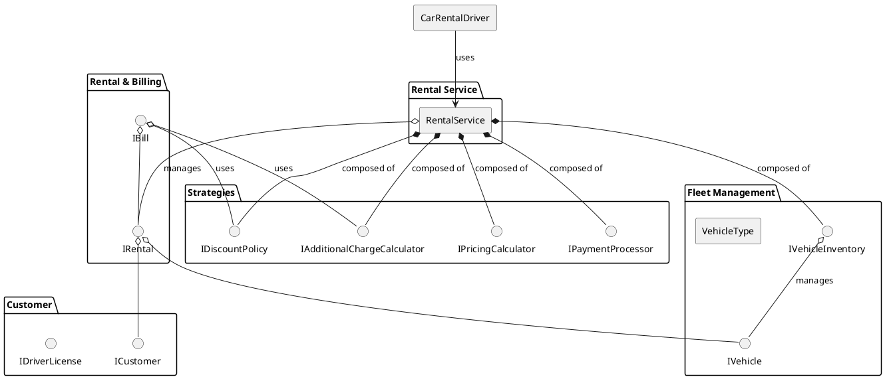
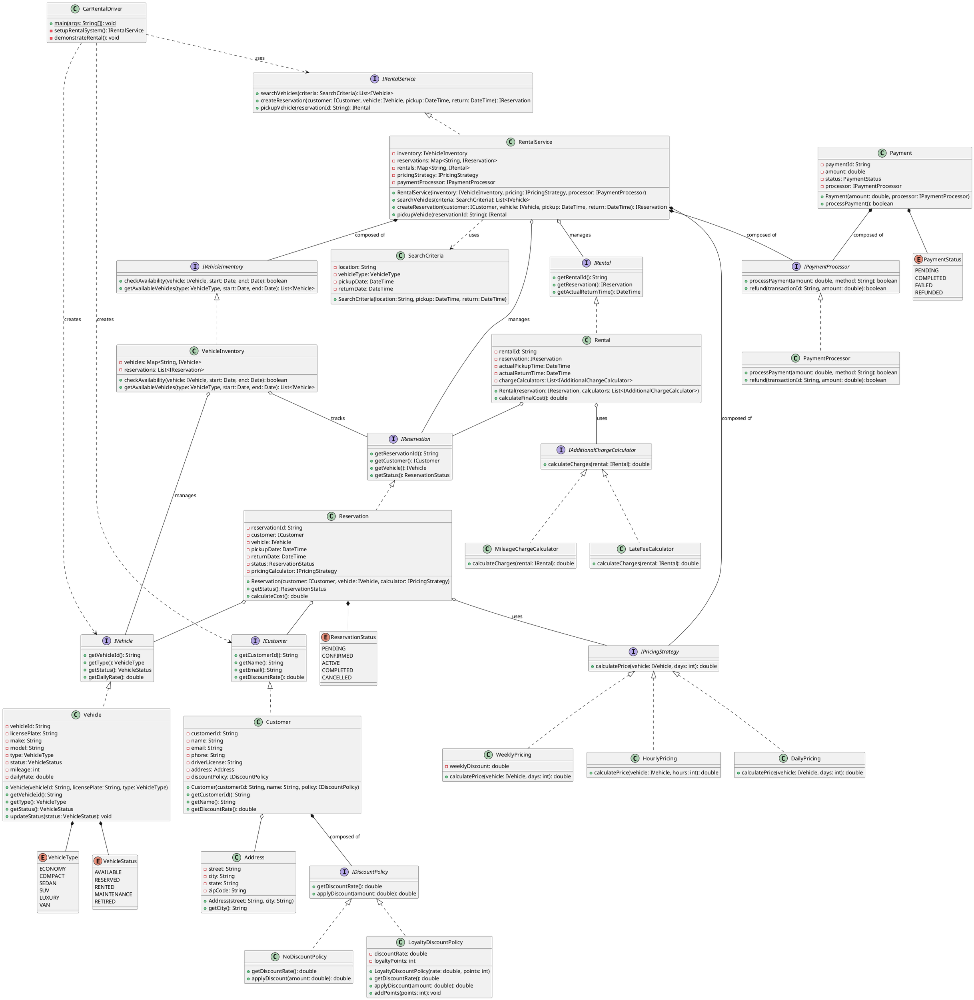
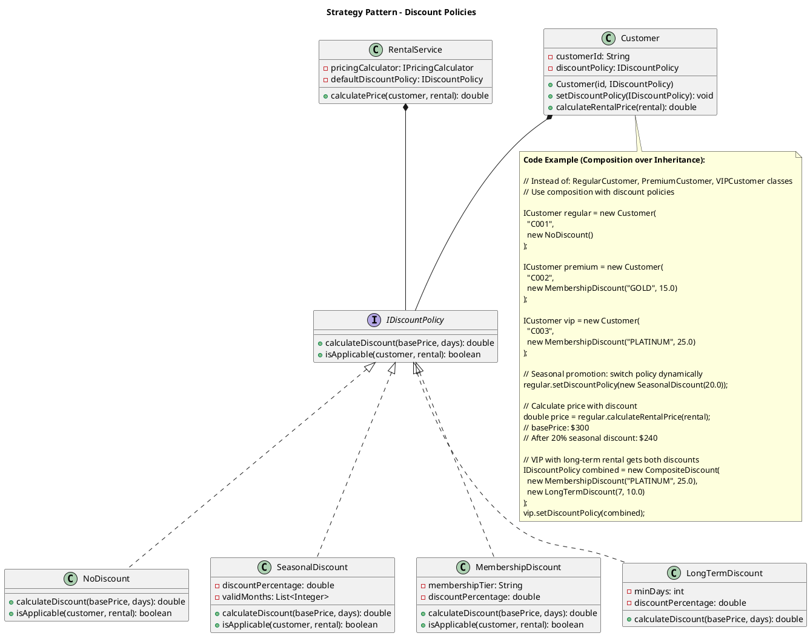
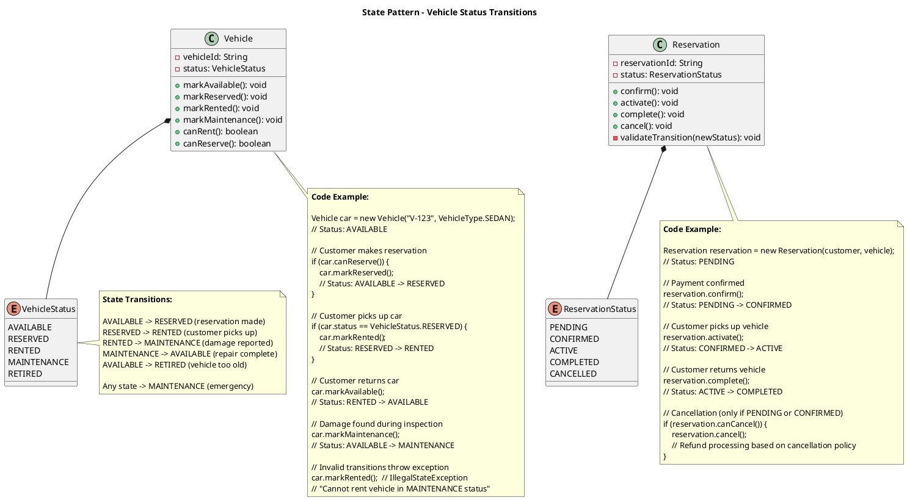
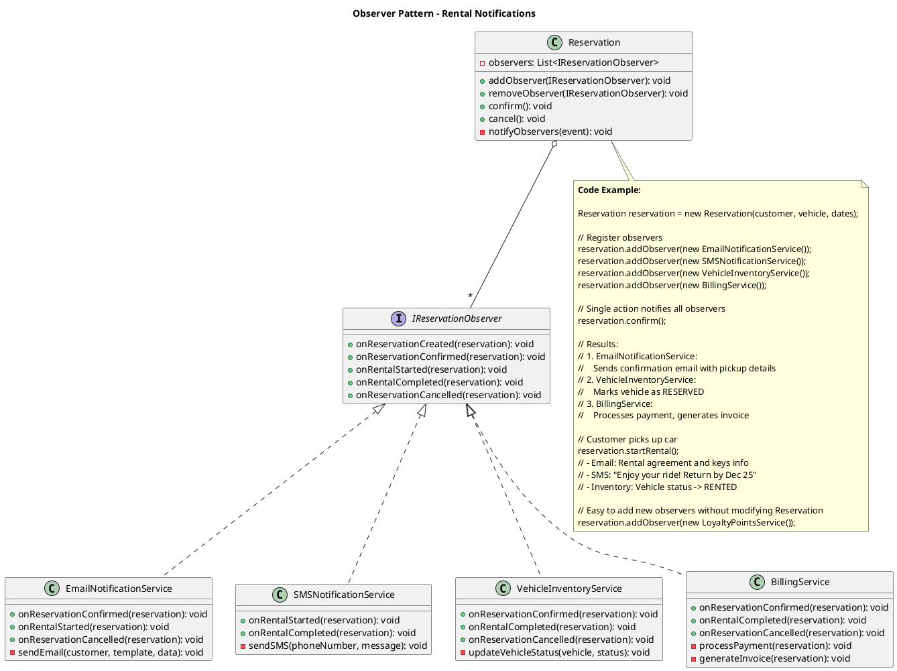

## Problem Statement

Design a car rental system that allows customers to search for available vehicles, make reservations, pick up and return cars, and handle billing. The system should manage vehicle inventory across multiple locations, handle different vehicle types, and support various rental plans.

## Requirements

### Functional Requirements
1. Search vehicles by type, location, and dates
2. Reserve vehicles for specific dates
3. Handle vehicle pickup and return
4. Calculate rental charges based on duration and vehicle type
5. Support different rental plans (hourly, daily, weekly)
6. Manage vehicle inventory across multiple branches
7. Track vehicle maintenance and service schedules
8. Handle insurance options
9. Process payments and generate invoices
10. Support membership and loyalty programs

### Non-Functional Requirements
1. Prevent double-booking of vehicles
2. Handle high availability for search operations
3. Real-time inventory updates
4. Accurate billing calculations
5. Scalable to multiple locations

## Simplified Overview



## Detailed Class Diagram



## Key Design Patterns

1. **[Singleton Pattern](/low-level-design/patterns/singleton/)**: RentalService as central management
2. **[Strategy Pattern](/low-level-design/patterns/behavioural-patterns/#strategy-pattern)**: Different pricing strategies
3. **[Factory Pattern](/low-level-design/patterns/creational-patterns/#factory-method)**: Create customers and reservations
4. **[Observer Pattern](/low-level-design/patterns/behavioural-patterns/#observer-pattern)**: Notifications for reservations
5. **[State Pattern](/low-level-design/patterns/behavioural-patterns/#state-pattern)**: Vehicle and reservation status management

### Design Pattern Diagrams

#### 1. Strategy Pattern - Discount Policies (Composition)



#### 2. State Pattern - Vehicle & Reservation Status



#### 3. Observer Pattern - Reservation Notifications



## Code Snippets

### Create Reservation

:::note
The `synchronized` block ensures atomic reservation creation. Validates dates, checks availability, calculates pricing with discounts, and sends confirmation.
:::

```java title="RentalService.java" {5,7-9,12-14,24-27,31-32,35,38}
public class RentalService {
    public Reservation createReservation(Customer customer, Vehicle vehicle, 
                                        DateTime pickup, DateTime return) 
            throws RentalException {
        synchronized(this) {
            // Validate dates
            if (pickup.isAfter(return)) {
                throw new RentalException("Invalid dates");
            }
            
            // Check availability
            if (!inventory.checkAvailability(vehicle, pickup.toDate(), return.toDate())) {
                throw new RentalException("Vehicle not available for selected dates");
            }
            
            // Create reservation
            Reservation reservation = new Reservation(customer, vehicle);
            reservation.setPickupDate(pickup);
            reservation.setReturnDate(return);
            reservation.setPickupLocation(vehicle.getBranch());
            reservation.setReturnLocation(vehicle.getBranch());
            
            // Calculate estimated cost
            long days = calculateDays(pickup, return);
            double cost = pricingStrategy.calculatePrice(vehicle, (int) days);
            
            // Apply customer discount
            cost = cost * (1 - customer.getDiscountRate());
            reservation.setEstimatedCost(cost);
            
            // Update vehicle status
            vehicle.updateStatus(VehicleStatus.RESERVED);
            reservation.setStatus(ReservationStatus.CONFIRMED);
            
            // Save reservation
            reservations.put(reservation.getReservationId(), reservation);
            
            // Send confirmation
            notificationService.sendReservationConfirmation(reservation);
            
            return reservation;
        }
    }
}
```

### Vehicle Pickup

```java
public class RentalService {
    public Rental pickupVehicle(String reservationId) throws RentalException {
        synchronized(this) {
            Reservation reservation = reservations.get(reservationId);
            
            if (reservation == null) {
                throw new RentalException("Reservation not found");
            }
            
            if (reservation.getStatus() != ReservationStatus.CONFIRMED) {
                throw new RentalException("Reservation is not confirmed");
            }
            
            // Create rental
            Rental rental = new Rental(reservation);
            rental.setActualPickupTime(DateTime.now());
            rental.setStartMileage(reservation.getVehicle().getMileage());
            
            // Update statuses
            reservation.setStatus(ReservationStatus.ACTIVE);
            reservation.getVehicle().updateStatus(VehicleStatus.RENTED);
            
            // Save rental
            rentals.put(rental.getRentalId(), rental);
            
            return rental;
        }
    }
}
```

### Vehicle Return and Invoice Generation

```java
public class RentalService {
    public Invoice returnVehicle(String rentalId, int endMileage) throws RentalException {
        synchronized(this) {
            Rental rental = rentals.get(rentalId);
            
            if (rental == null) {
                throw new RentalException("Rental not found");
            }
            
            // Set return details
            rental.setActualReturnTime(DateTime.now());
            rental.setEndMileage(endMileage);
            
            // Calculate final cost
            double finalCost = calculateFinalCost(rental);
            rental.setTotalCost(finalCost);
            
            // Create invoice
            Invoice invoice = new Invoice(rental);
            
            // Calculate charges
            Reservation reservation = rental.getReservation();
            long actualDays = calculateDays(rental.getActualPickupTime(), 
                                          rental.getActualReturnTime());
            
            // Rental charges
            double rentalCharges = pricingStrategy.calculatePrice(
                reservation.getVehicle(), (int) actualDays);
            invoice.setRentalCharges(rentalCharges);
            
            // Insurance charges
            if (reservation.isInsuranceAdded()) {
                double insuranceCharges = reservation.getInsurance()
                    .calculateCost((int) actualDays);
                invoice.setInsuranceCharges(insuranceCharges);
            }
            
            // Additional charges (mileage, late return, etc.)
            double additionalCharges = calculateAdditionalCharges(rental);
            invoice.setAdditionalCharges(additionalCharges);
            
            // Apply discount
            invoice.applyDiscount(reservation.getCustomer().getDiscountRate());
            
            // Calculate total
            invoice.calculateTotal();
            
            // Update statuses
            reservation.setStatus(ReservationStatus.COMPLETED);
            reservation.getVehicle().updateStatus(VehicleStatus.AVAILABLE);
            reservation.getVehicle().setMileage(endMileage);
            
            return invoice;
        }
    }
    
    private double calculateAdditionalCharges(Rental rental) {
        double charges = 0;
        
        // Late return fee
        DateTime expectedReturn = rental.getReservation().getReturnDate();
        if (rental.getActualReturnTime().isAfter(expectedReturn)) {
            long lateHours = calculateHours(expectedReturn, rental.getActualReturnTime());
            charges += lateHours * 10; // $10 per hour
        }
        
        // Extra mileage fee (if exceeded free limit)
        int mileageDriven = rental.getEndMileage() - rental.getStartMileage();
        int freeMileage = 100 * (int) calculateDays(
            rental.getActualPickupTime(), rental.getActualReturnTime());
        
        if (mileageDriven > freeMileage) {
            charges += (mileageDriven - freeMileage) * 0.5; // $0.50 per extra mile
        }
        
        return charges;
    }
}
```

### Search Vehicles

```java
public class RentalService {
    public List<Vehicle> searchVehicles(SearchCriteria criteria) {
        List<Vehicle> availableVehicles = new ArrayList<>();
        
        // Find branches in location
        List<Branch> matchingBranches = branches.values().stream()
            .filter(b -> b.getAddress().getCity()
                .equalsIgnoreCase(criteria.getLocation()))
            .collect(Collectors.toList());
        
        for (Branch branch : matchingBranches) {
            List<Vehicle> vehicles = inventory.getAvailableVehicles(
                branch,
                criteria.getVehicleType(),
                criteria.getPickupDate().toDate(),
                criteria.getReturnDate().toDate()
            );
            
            // Filter by price range
            vehicles = vehicles.stream()
                .filter(v -> {
                    long days = calculateDays(criteria.getPickupDate(), 
                                            criteria.getReturnDate());
                    double price = v.calculateRentalCost((int) days);
                    return price >= criteria.getMinPrice() 
                        && price <= criteria.getMaxPrice();
                })
                .collect(Collectors.toList());
            
            availableVehicles.addAll(vehicles);
        }
        
        return availableVehicles;
    }
}
```

### Pricing Strategy

```java
public class WeeklyPricing implements PricingStrategy {
    private static final double WEEKLY_DISCOUNT = 0.15; // 15% off
    
    @Override
    public double calculatePrice(Vehicle vehicle, int days) {
        double dailyRate = vehicle.getDailyRate();
        
        if (days >= 7) {
            int weeks = days / 7;
            int remainingDays = days % 7;
            
            double weeklyRate = dailyRate * 7 * (1 - WEEKLY_DISCOUNT);
            double totalCost = (weeks * weeklyRate) + (remainingDays * dailyRate);
            
            return totalCost;
        }
        
        return days * dailyRate;
    }
}
```

## Extension Points

1. Add vehicle features and accessories (GPS, child seats)
2. Implement dynamic pricing based on demand
3. Add one-way rental support (different pickup/return locations)
4. Support corporate accounts and bulk bookings
5. Implement damage assessment and reporting
6. Add roadside assistance services
7. Support electric vehicle charging plans
8. Implement driver rating system
9. Add fuel policy options (full-to-full, prepaid)
10. Support multi-vehicle reservations for group travel
