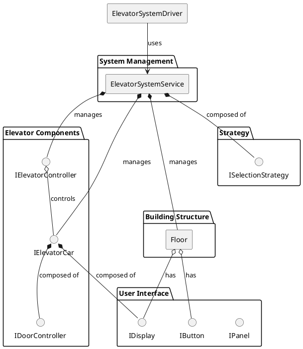
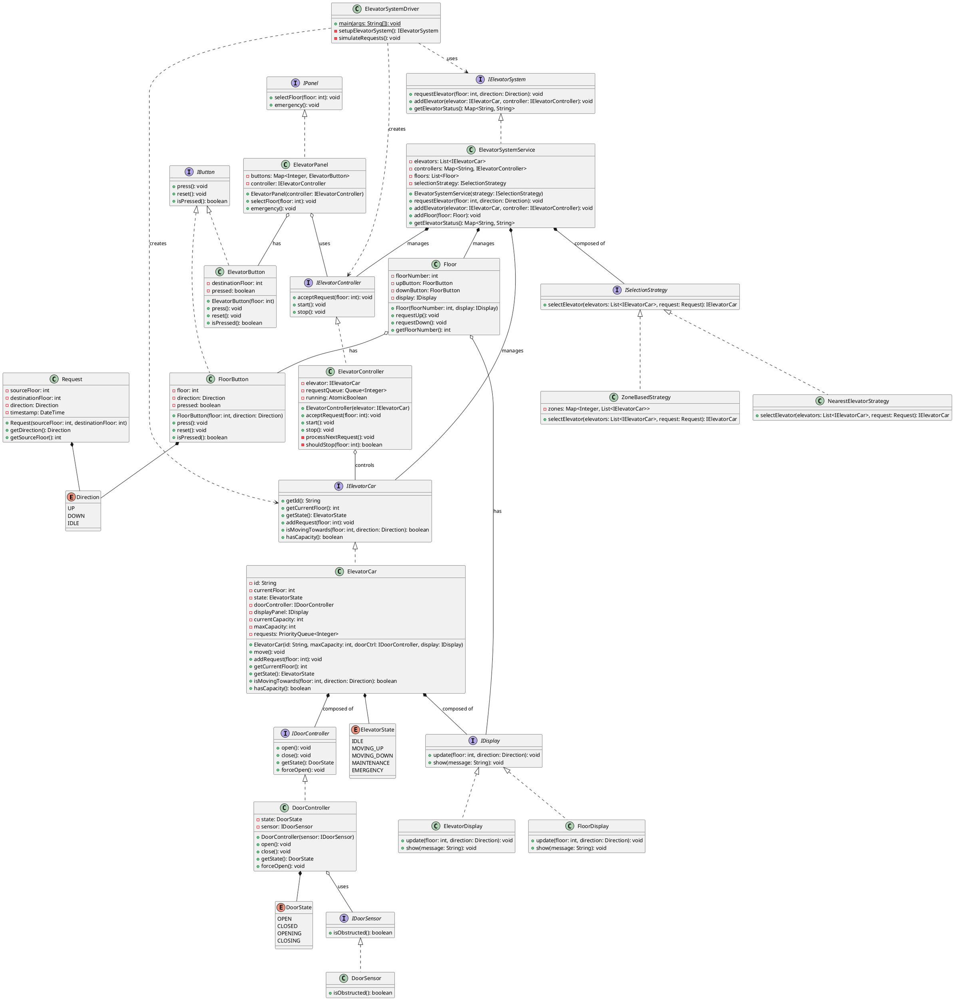
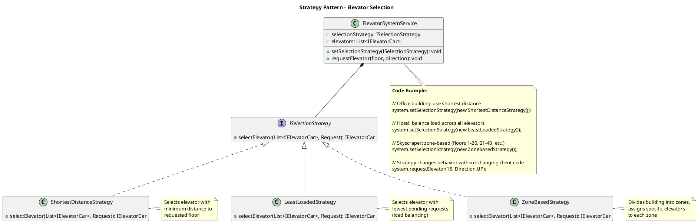
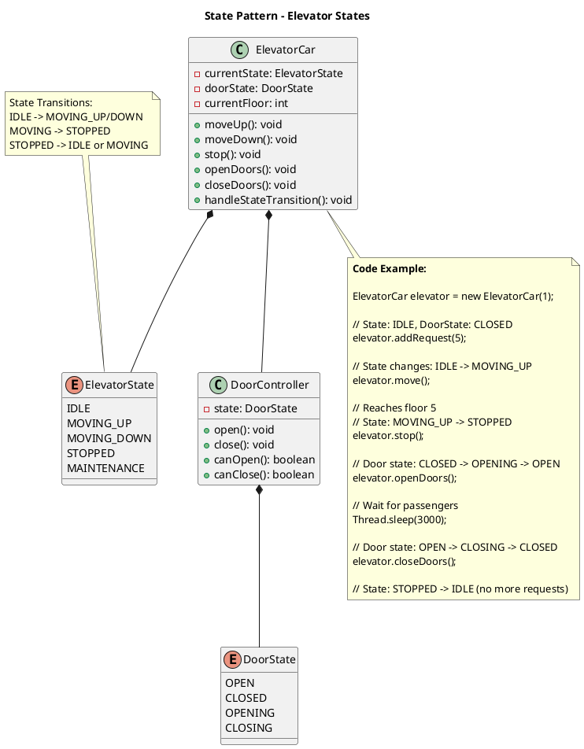
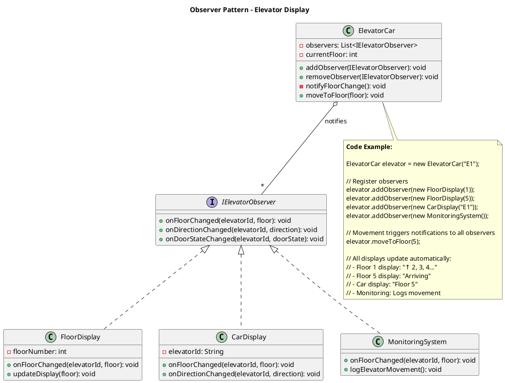

## Problem Statement

Design an elevator control system for a building with multiple elevators. The system should efficiently handle user requests from different floors, optimize elevator movement to reduce wait times, and manage elevator states. Support both internal (inside elevator) and external (floor) requests.

## Requirements

### Functional Requirements
1. Handle multiple elevators in a building
2. Process requests from floors (up/down buttons)
3. Process requests from inside elevator (floor selection)
4. Optimal elevator selection based on proximity and direction
5. Support different elevator states: IDLE, MOVING_UP, MOVING_DOWN, MAINTENANCE
6. Door open/close operations with safety checks
7. Emergency stop functionality
8. Maximum capacity enforcement

### Non-Functional Requirements
1. Minimize average wait time
2. Thread-safe for concurrent requests
3. Efficient scheduling algorithm
4. Real-time status updates
5. Fault-tolerant system

## Simplified Overview



## Detailed Class Diagram



## Key Design Patterns

1. **[Singleton Pattern](/low-level-design/patterns/singleton/)**: ElevatorSystem as single control point
2. **[Strategy Pattern](/low-level-design/patterns/behavioural-patterns/#strategy-pattern)**: Different elevator selection algorithms
3. **[State Pattern](/low-level-design/patterns/behavioural-patterns/#state-pattern)**: Elevator and door state management
4. **[Observer Pattern](/low-level-design/patterns/behavioural-patterns/#observer-pattern)**: Display updates when elevator moves

### Design Pattern Diagrams

#### 1. Strategy Pattern - Elevator Selection Algorithm



#### 2. State Pattern - Elevator State Management



#### 3. Observer Pattern - Display Updates



## Code Snippets

### Elevator Movement Logic

:::note
The `move()` method handles elevator state transitions and floor movements. It processes requests sequentially and updates the display after each move.
:::

```java title="ElevatorCar.java" {3-5,13-21,27}
public class ElevatorCar {
    public void move() {
        if (requests.isEmpty()) {
            state = ElevatorState.IDLE;
            return;
        }
        
        int targetFloor = requests.peek();
        
        if (currentFloor < targetFloor) {
            state = ElevatorState.MOVING_UP;
            currentFloor++;
        } else if (currentFloor > targetFloor) {
            state = ElevatorState.MOVING_DOWN;
            currentFloor--;
        } else {
            // Reached target floor
            requests.poll();
            openDoor();
            // Wait for passengers
            closeDoor();
        }
        
        display.update(currentFloor, getDirection());
    }
    
    public boolean isMovingTowards(int floor, Direction direction) {
        if (state == ElevatorState.IDLE) {
            return true;
        }
        
        if (direction == Direction.UP) {
            return state == ElevatorState.MOVING_UP && currentFloor < floor;
        } else {
            return state == ElevatorState.MOVING_DOWN && currentFloor > floor;
        }
    }
}
```

### Elevator Selection Strategy

:::note
This strategy selects the nearest elevator that is:
1. Moving towards the request floor in the same direction (priority)
2. Idle and closest to the request floor (fallback)
:::

```java title="NearestElevatorStrategy.java" {6-9,12-17,25-32}
public class NearestElevatorStrategy implements ElevatorSelectionStrategy {
    @Override
    public ElevatorCar selectElevator(List<ElevatorCar> elevators, Request request) {
        ElevatorCar bestElevator = null;
        int minDistance = Integer.MAX_VALUE;
        
        for (ElevatorCar elevator : elevators) {
            if (!elevator.hasCapacity()) {
                continue;
            }
            
            // Prefer elevators already moving in the same direction
            if (elevator.isMovingTowards(request.getSourceFloor(), request.getDirection())) {
                int distance = Math.abs(elevator.getCurrentFloor() - request.getSourceFloor());
                if (distance < minDistance) {
                    minDistance = distance;
                    bestElevator = elevator;
                }
            }
        }
        
        // If no suitable elevator found, select nearest idle elevator
        if (bestElevator == null) {
            for (ElevatorCar elevator : elevators) {
                if (elevator.getState() == ElevatorState.IDLE) {
                    int distance = Math.abs(elevator.getCurrentFloor() - request.getSourceFloor());
                    if (distance < minDistance) {
                        minDistance = distance;
                        bestElevator = elevator;
                    }
                }
            }
        }
        
        return bestElevator;
    }
}
```

### Request Processing

```java
public class ElevatorSystem {
    public void requestElevator(int floor, Direction direction) {
        Request request = new Request(floor, -1);
        request.setDirection(direction);
        
        ElevatorCar selectedElevator = selectionStrategy.selectElevator(elevators, request);
        
        if (selectedElevator != null) {
            selectedElevator.addRequest(floor);
            logger.info("Assigned elevator " + selectedElevator.getId() + 
                       " to floor " + floor);
        } else {
            logger.warning("No available elevator for floor " + floor);
        }
    }
}
```

## Extension Points

1. Add predictive algorithms for peak hours
2. Implement energy-saving mode during low usage
3. Add priority handling for VIP floors
4. Support express elevators (skip certain floors)
5. Implement load balancing across elevators
6. Add destination dispatch system (group passengers by destination)
7. Include elevator maintenance scheduling
