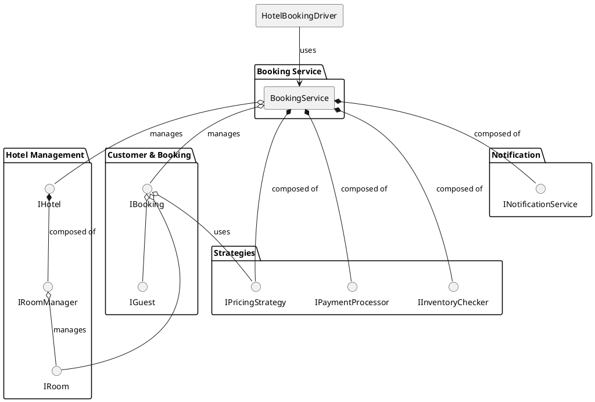
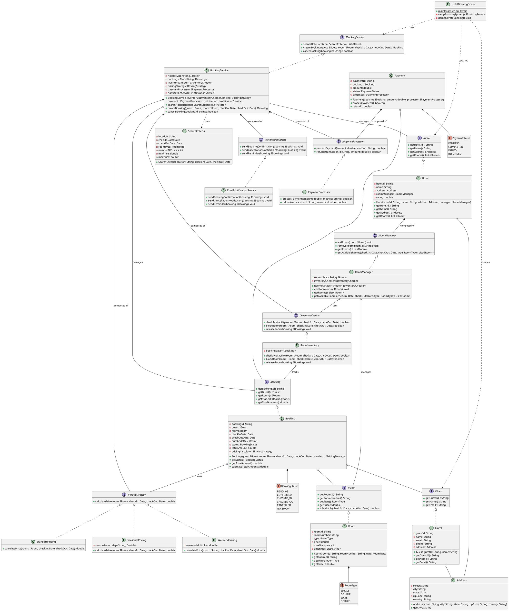
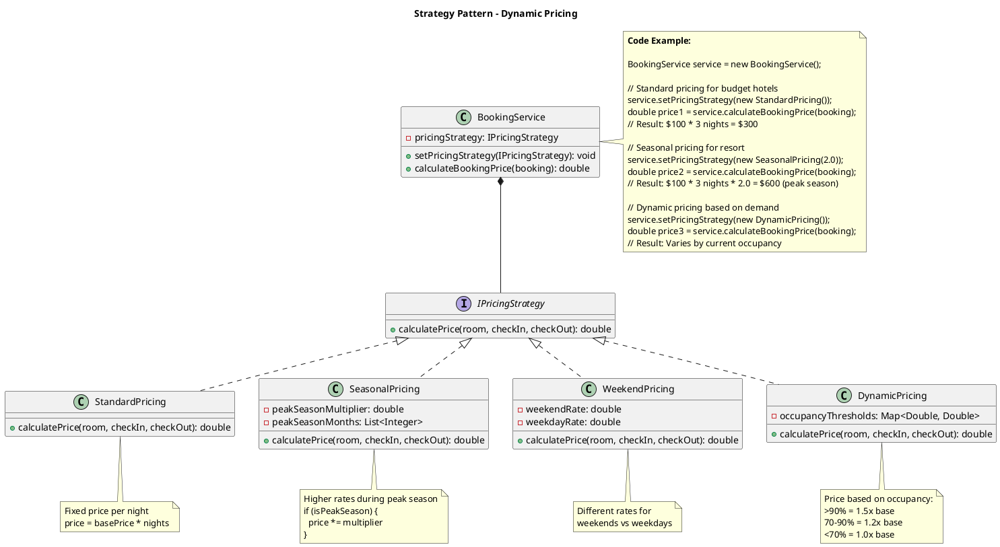
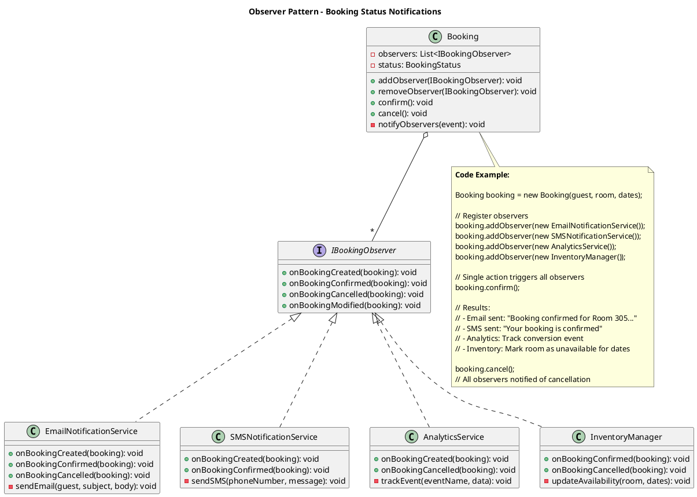
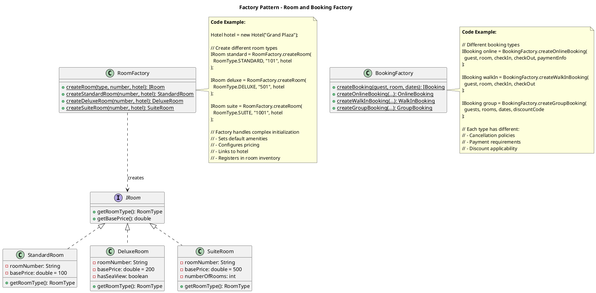
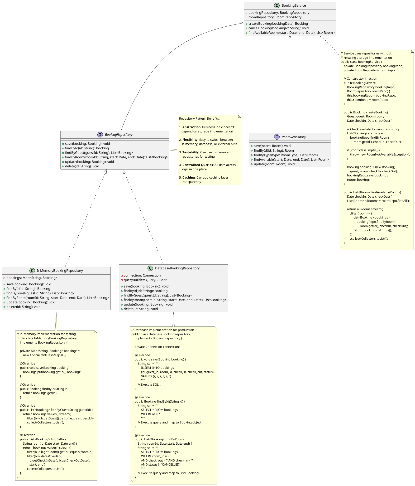

## Problem Statement

Design a hotel booking system that allows customers to search for available rooms, make reservations, manage bookings, and handle payments. The system should support multiple hotels, room types, booking cancellations, and pricing strategies.

## Requirements

### Functional Requirements
1. Search hotels by location, dates, and room type
2. Check room availability for given dates
3. Create, modify, and cancel bookings
4. Support multiple room types (Single, Double, Suite)
5. Handle payment processing
6. Generate booking confirmations
7. Manage customer profiles
8. Support different pricing strategies (seasonal, weekend, holiday)
9. Handle overbooking scenarios
10. Send booking notifications

### Non-Functional Requirements
1. Handle concurrent bookings without double-booking
2. High availability for search operations
3. ACID properties for booking transactions
4. Scalable to handle multiple hotels
5. Fast search response time

## Simplified Overview



## Detailed Class Diagram



## Key Design Patterns

1. **[Strategy Pattern](/low-level-design/patterns/behavioural-patterns/#strategy-pattern)**: Different pricing strategies
2. **[Factory Pattern](/low-level-design/patterns/creational-patterns/#factory-method)**: Create bookings and rooms
3. **[Observer Pattern](/low-level-design/patterns/behavioural-patterns/#observer-pattern)**: Notify users about booking status
4. **[Singleton Pattern](/low-level-design/patterns/singleton/)**: BookingService as central coordinator
5. **Repository Pattern**: Data access for hotels and bookings

### Design Pattern Diagrams

#### 1. Strategy Pattern - Pricing Strategies



#### 2. Observer Pattern - Booking Notifications



#### 3. Factory Pattern - Room & Booking Creation



#### 4. Repository Pattern - Data Access Layer



## Code Snippets

### Create Booking

:::note
The `synchronized` block ensures atomic booking operations, preventing double-booking. The process includes availability check, pricing calculation, room blocking, and notification.
:::

```java title="BookingService.java" {4,7-9,16,20-22,26,29}
public class BookingService {
    public Booking createBooking(Guest guest, Room room, Date checkIn, Date checkOut) 
            throws BookingException {
        synchronized(this) {
            // Check availability
            RoomInventory inventory = inventoryMap.get(room.getHotel().getHotelId());
            if (!inventory.checkAvailability(room, checkIn, checkOut)) {
                throw new BookingException("Room not available for selected dates");
            }
            
            // Create booking
            Booking booking = new Booking(guest, room, checkIn, checkOut);
            
            // Calculate price
            double totalAmount = pricingStrategy.calculatePrice(room, checkIn, checkOut);
            booking.setTotalAmount(totalAmount);
            
            // Block room
            if (!inventory.blockRoom(room, checkIn, checkOut)) {
                throw new BookingException("Failed to block room");
            }
            
            // Save booking
            booking.setStatus(BookingStatus.PENDING);
            bookings.put(booking.getBookingId(), booking);
            
            // Send notification
            notificationService.sendBookingConfirmation(booking);
            
            return booking;
        }
    }
}
```

### Check Room Availability

:::note
The method checks for date overlaps using the `datesOverlap` utility. It ignores cancelled bookings and only considers active/pending bookings.
:::

```java title="RoomInventory.java" {3-13,16}
public class RoomInventory {
    public boolean checkAvailability(Room room, Date checkIn, Date checkOut) {
        for (Booking booking : bookings) {
            if (!booking.getRoom().equals(room)) {
                continue;
            }
            
            if (booking.getStatus() == BookingStatus.CANCELLED) {
                continue;
            }
            
            // Check for overlap
            if (datesOverlap(booking.getCheckInDate(), booking.getCheckOutDate(), 
                           checkIn, checkOut)) {
                return false;
            }
        }
        return true;
    }
    
    private boolean datesOverlap(Date start1, Date end1, Date start2, Date end2) {
        return !(end1.before(start2) || end2.before(start1));
    }
}
```

### Seasonal Pricing Strategy

```java
public class SeasonalPricing implements PricingStrategy {
    private Map<Season, Double> seasonRates;
    
    @Override
    public double calculatePrice(Room room, Date checkIn, Date checkOut) {
        double basePrice = room.getPrice();
        long nights = calculateNights(checkIn, checkOut);
        
        double totalPrice = 0;
        Calendar cal = Calendar.getInstance();
        cal.setTime(checkIn);
        
        for (int i = 0; i < nights; i++) {
            Season season = getSeason(cal.getTime());
            double multiplier = seasonRates.getOrDefault(season, 1.0);
            totalPrice += basePrice * multiplier;
            cal.add(Calendar.DAY_OF_MONTH, 1);
        }
        
        return totalPrice;
    }
    
    private Season getSeason(Date date) {
        Calendar cal = Calendar.getInstance();
        cal.setTime(date);
        int month = cal.get(Calendar.MONTH);
        
        if (month >= 11 || month <= 1) return Season.WINTER;
        if (month >= 2 && month <= 4) return Season.SPRING;
        if (month >= 5 && month <= 7) return Season.SUMMER;
        return Season.FALL;
    }
}
```

### Search Hotels

```java
public class BookingService {
    public List<Hotel> searchHotels(SearchCriteria criteria) {
        List<Hotel> results = new ArrayList<>();
        
        for (Hotel hotel : hotels.values()) {
            if (!matchesLocation(hotel, criteria.getLocation())) {
                continue;
            }
            
            List<Room> availableRooms = hotel.getAvailableRooms(
                criteria.getCheckInDate(),
                criteria.getCheckOutDate(),
                criteria.getRoomType()
            );
            
            if (!availableRooms.isEmpty()) {
                results.add(hotel);
            }
        }
        
        return results;
    }
}
```

## Extension Points

1. Add loyalty programs and rewards
2. Implement dynamic pricing based on demand
3. Add room upgrade options
4. Support group bookings
5. Implement waitlist for fully booked hotels
6. Add review and rating system
7. Support multi-room bookings
8. Implement booking modifications with price adjustments
9. Add integration with payment gateways
10. Support corporate accounts and bulk bookings
