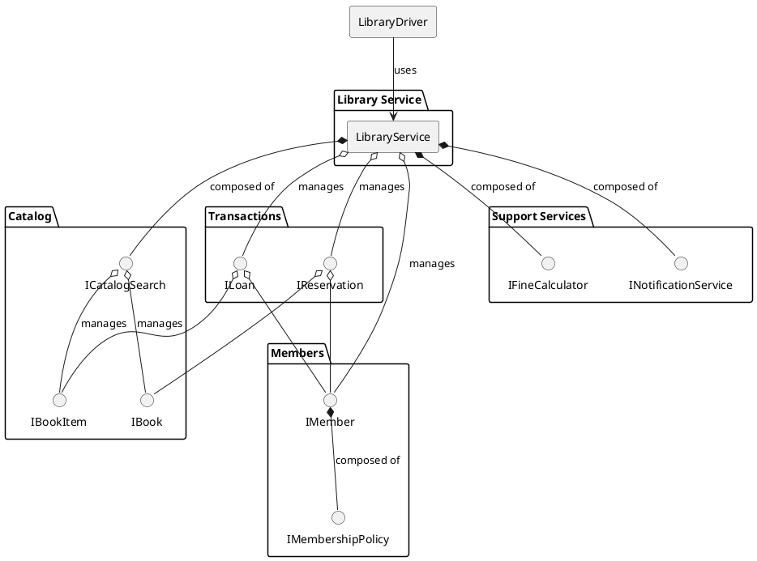
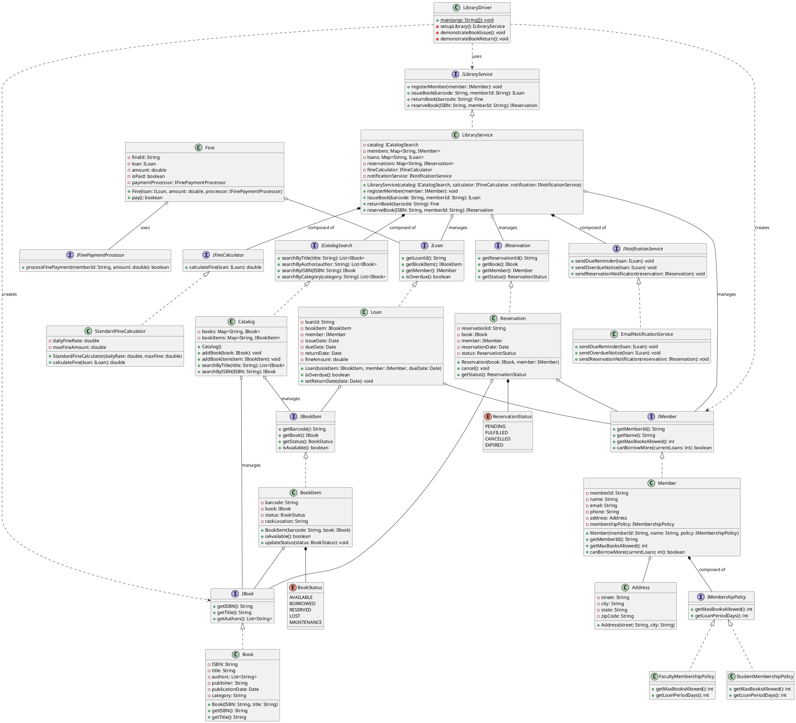
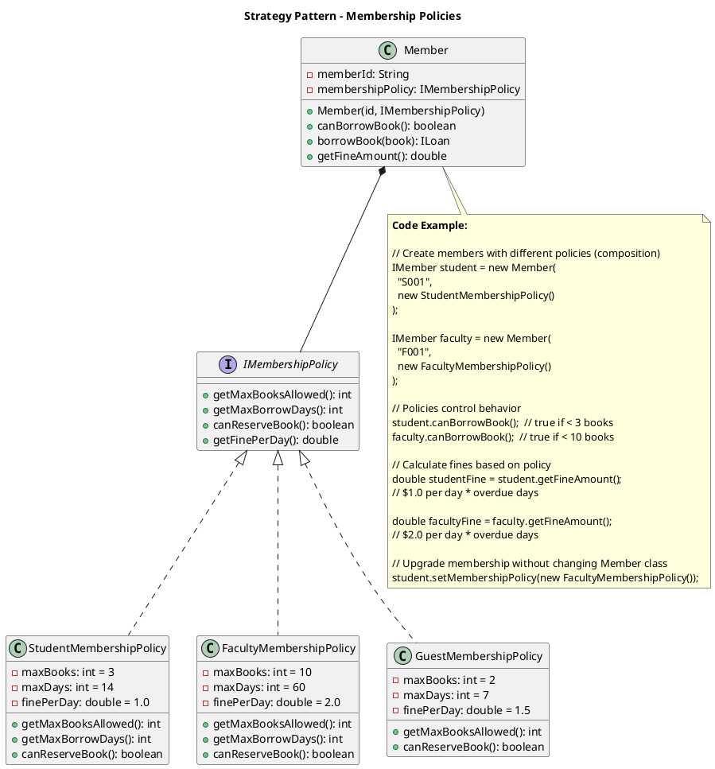
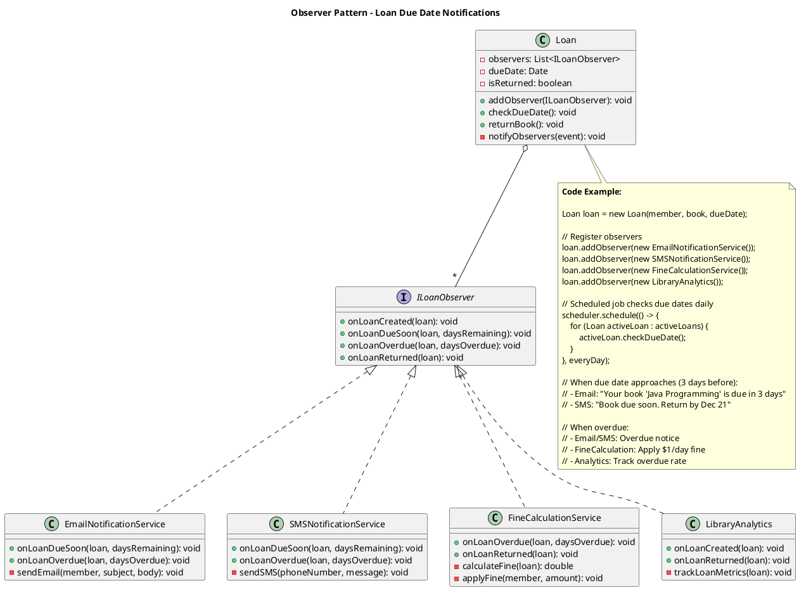
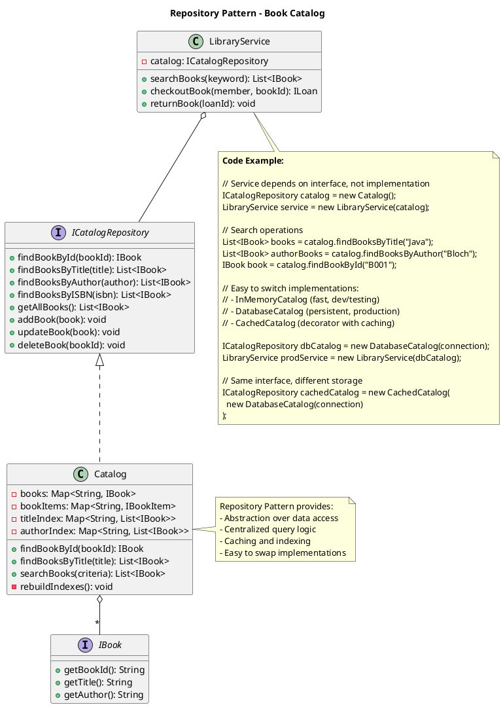

## Problem Statement

Design a library management system that handles book inventory, member management, book borrowing and returning, reservations, and fine calculations. The system should track book copies, manage due dates, and handle multiple branches.

## Requirements

### Functional Requirements
1. Add, update, and remove books from the catalog
2. Register and manage library members
3. Issue books to members
4. Return books and calculate fines
5. Reserve books that are currently borrowed
6. Search books by title, author, ISBN, or category
7. Track book copies across multiple branches
8. Generate reports on popular books and overdue items
9. Support different member types with different borrowing limits
10. Send notifications for due dates and reservations

### Non-Functional Requirements
1. Handle concurrent book checkouts
2. Accurate fine calculations
3. Scalable for large book collections
4. Fast search operations
5. Data consistency for inventory

## Simplified Overview



## Detailed Class Diagram



## Key Design Patterns

1. **[Singleton Pattern](/low-level-design/patterns/singleton/)**: LibrarySystem as central management point
2. **[Factory Pattern](/low-level-design/patterns/creational-patterns/#factory-method)**: Create different member types
3. **[Strategy Pattern](/low-level-design/patterns/behavioural-patterns/#strategy-pattern)**: Different fine calculation strategies
4. **[Observer Pattern](/low-level-design/patterns/behavioural-patterns/#observer-pattern)**: Notifications for due dates
5. **Repository Pattern**: Catalog for book management

### Design Pattern Diagrams

#### 1. Strategy Pattern - Membership Policies (Composition over Inheritance)



#### 2. Observer Pattern - Due Date Notifications



#### 3. Repository Pattern - Catalog Management



## Code Snippets

### Issue Book

:::note
The `synchronized` block prevents race conditions. The method validates member eligibility, checks fines, creates a loan, and updates book status atomically.
:::

```java title="LibrarySystem.java" {4,6-8,15-17,26,31,37}
public class LibrarySystem {
    public Loan issueBook(BookItem bookItem, Member member) throws LibraryException {
        synchronized(this) {
            // Validate member can borrow
            if (!member.canBorrowMore()) {
                throw new LibraryException("Member has reached borrowing limit");
            }
            
            // Check for outstanding fines
            if (hasOutstandingFines(member)) {
                throw new LibraryException("Member has outstanding fines");
            }
            
            // Check book availability
            if (!bookItem.isAvailable()) {
                throw new LibraryException("Book is not available");
            }
            
            // Create loan
            Loan loan = new Loan(bookItem, member);
            
            // Calculate due date based on member type
            int loanPeriod = getLoanPeriod(member.getMemberType());
            Calendar cal = Calendar.getInstance();
            cal.add(Calendar.DAY_OF_MONTH, loanPeriod);
            loan.setDueDate(cal.getTime());
            
            // Update book status
            bookItem.updateStatus(BookStatus.BORROWED);
            
            // Save loan
            loans.put(loan.getLoanId(), loan);
            
            // Check and fulfill reservations
            fulfillPendingReservations(bookItem.getBook());
            
            return loan;
        }
    }
    
    private int getLoanPeriod(MemberType type) {
        switch(type) {
            case STUDENT: return 14;
            case FACULTY: return 30;
            case PREMIUM: return 21;
            default: return 14;
        }
    }
}
```

### Return Book and Calculate Fine

:::note
Handles book return, calculates overdue fines if applicable, updates book status, and automatically fulfills pending reservations.
:::

```java title="LibrarySystem.java" {4,6-9,14-18,24,27}
public class LibrarySystem {
    public Fine returnBook(String barcode) throws LibraryException {
        synchronized(this) {
            // Find loan
            Loan loan = findLoanByBarcode(barcode);
            if (loan == null) {
                throw new LibraryException("No active loan found for barcode: " + barcode);
            }
            
            // Set return date
            loan.setReturnDate(new Date());
            
            // Calculate fine if overdue
            Fine fine = null;
            if (loan.isOverdue()) {
                double fineAmount = fineCalculator.calculateFine(loan);
                fine = new Fine(loan, fineAmount);
                loan.setFine(fineAmount);
            }
            
            // Update book status
            loan.getBookItem().updateStatus(BookStatus.AVAILABLE);
            
            // Check for reservations
            fulfillReservation(loan.getBookItem());
            
            return fine;
        }
    }
    
    private void fulfillReservation(BookItem bookItem) {
        for (Reservation reservation : reservations) {
            if (reservation.getBook().equals(bookItem.getBook()) 
                && reservation.getStatus() == ReservationStatus.PENDING) {
                // Notify member
                notificationService.sendReservationNotification(reservation);
                reservation.setStatus(ReservationStatus.FULFILLED);
                bookItem.updateStatus(BookStatus.RESERVED);
                break;
            }
        }
    }
}
```

### Fine Calculator

```java
public class StandardFineCalculator implements FineCalculator {
    private static final double DAILY_FINE_RATE = 1.0;
    private static final double MAX_FINE = 50.0;
    
    @Override
    public double calculateFine(Loan loan) {
        if (!loan.isOverdue()) {
            return 0.0;
        }
        
        Date returnDate = loan.getReturnDate() != null 
            ? loan.getReturnDate() 
            : new Date();
        
        long overdueDays = calculateOverdueDays(loan.getDueDate(), returnDate);
        double fine = overdueDays * DAILY_FINE_RATE;
        
        // Cap at maximum fine
        return Math.min(fine, MAX_FINE);
    }
    
    private long calculateOverdueDays(Date dueDate, Date returnDate) {
        long diffMillis = returnDate.getTime() - dueDate.getTime();
        return Math.max(0, diffMillis / (1000 * 60 * 60 * 24));
    }
}
```

### Search Books

```java
public class Catalog {
    public List<Book> searchByTitle(String title) {
        return books.values().stream()
            .filter(book -> book.getTitle().toLowerCase()
                .contains(title.toLowerCase()))
            .collect(Collectors.toList());
    }
    
    public List<Book> searchByAuthor(String author) {
        return books.values().stream()
            .filter(book -> book.getAuthors().stream()
                .anyMatch(a -> a.toLowerCase().contains(author.toLowerCase())))
            .collect(Collectors.toList());
    }
    
    public Book searchByISBN(String ISBN) {
        return books.get(ISBN);
    }
}
```

### Reserve Book

```java
public class LibrarySystem {
    public Reservation reserveBook(Book book, Member member) throws LibraryException {
        // Check if book has available copies
        long availableCopies = catalog.getBookItems().stream()
            .filter(item -> item.getBook().equals(book))
            .filter(BookItem::isAvailable)
            .count();
        
        if (availableCopies > 0) {
            throw new LibraryException("Book is available, reservation not needed");
        }
        
        // Check if member already has reservation
        boolean hasReservation = reservations.stream()
            .anyMatch(r -> r.getMember().equals(member) 
                && r.getBook().equals(book)
                && r.getStatus() == ReservationStatus.PENDING);
        
        if (hasReservation) {
            throw new LibraryException("Member already has a reservation for this book");
        }
        
        Reservation reservation = new Reservation(book, member);
        reservations.add(reservation);
        
        return reservation;
    }
}
```

## Extension Points

1. Add digital book lending (e-books)
2. Implement inter-branch book transfers
3. Add book recommendation system
4. Support different loan periods for different book types
5. Implement waiting list when multiple reservations exist
6. Add barcode/RFID scanning integration
7. Support bulk operations for librarians
8. Add analytics and reporting dashboard
9. Implement late fee payment integration
10. Support book renewal with limits
