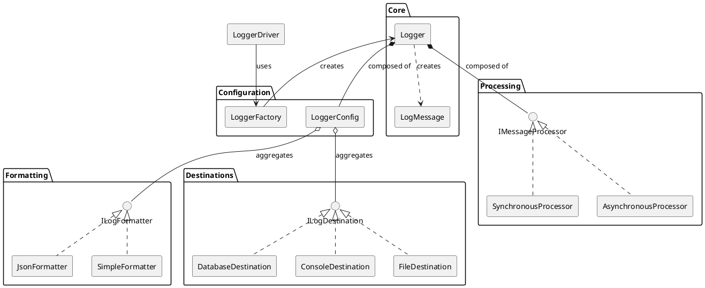
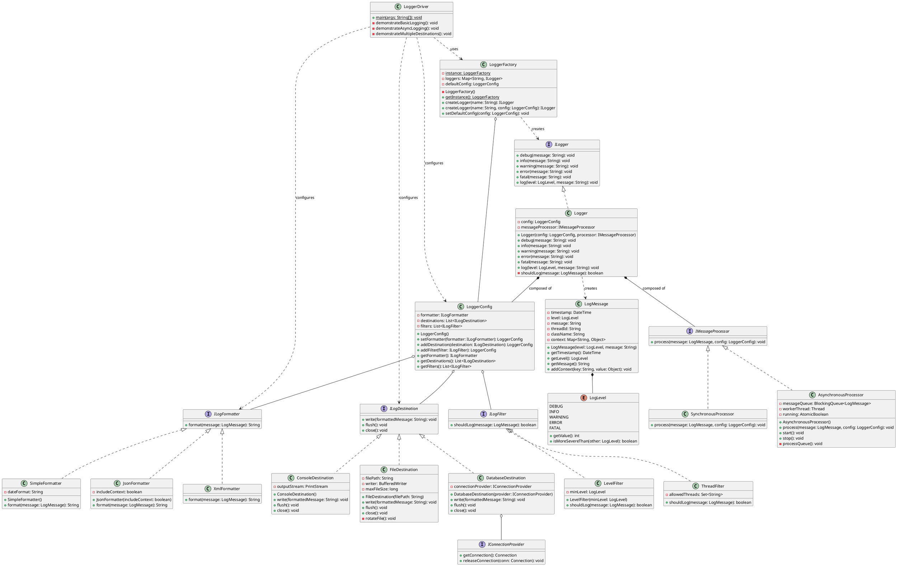
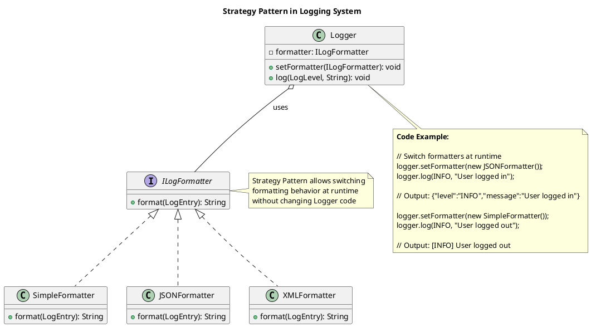
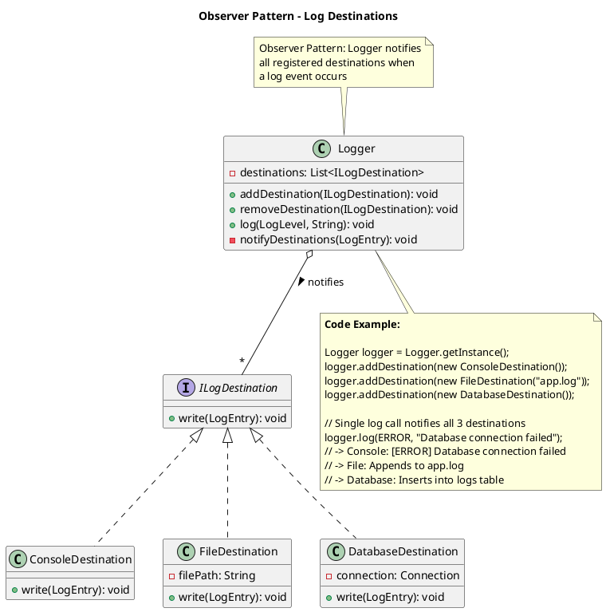
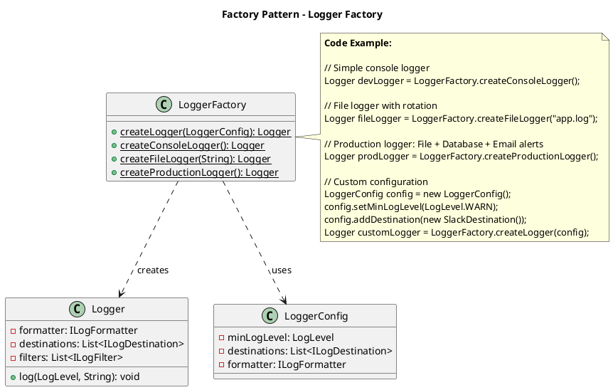

## Problem Statement

Design a flexible and extensible logging system that allows applications to log messages with different severity levels to various destinations (console, file, database, etc.). The system should support log formatting, filtering by log levels, and easy configuration of multiple log destinations.

## Requirements

### Functional Requirements
1. Support multiple log levels: DEBUG, INFO, WARNING, ERROR, FATAL
2. Allow logging to multiple destinations (console, file, remote server)
3. Support custom log message formatting
4. Enable filtering logs based on severity level
5. Thread-safe logging operations
6. Support both synchronous and asynchronous logging
7. Allow runtime configuration of log levels and destinations

### Non-Functional Requirements
1. High performance with minimal overhead
2. Thread-safe for concurrent logging
3. Extensible to add new log destinations
4. Memory efficient for high-volume logging
5. Easy to integrate and use

## Simplified Overview



## Detailed Class Diagram



## Key Design Patterns

1. **[Singleton Pattern](/low-level-design/patterns/singleton/)**: Logger class ensures only one instance exists
2. **[Strategy Pattern](/low-level-design/patterns/behavioural-patterns/#strategy-pattern)**: LogFormatter and LogDestination use strategy pattern for flexible implementations
3. **[Observer Pattern](/low-level-design/patterns/behavioural-patterns/#observer-pattern)**: Multiple destinations can subscribe to log events
4. **[Factory Pattern](/low-level-design/patterns/creational-patterns/#factory-method)**: Can be used to create different types of loggers

### Design Pattern Diagrams

#### 1. Strategy Pattern - Formatters & Destinations



#### 2. Observer Pattern - Multiple Destinations



#### 3. Factory Pattern - Logger Creation



## Code Snippets

### Basic Usage

```java title="LoggerUsageExample.java"
// Configure logger
LoggerConfig config = new LoggerConfig();
config.setMinLogLevel(LogLevel.DEBUG);
config.addDestination(new ConsoleDestination());
config.addDestination(new FileDestination("app.log"));
config.setFormatter(new SimpleFormatter());

// Get logger instance
Logger logger = Logger.getInstance();
logger.setConfig(config);

// Use logger
logger.info("Application started");
logger.error("Error occurred: " + errorMessage);
logger.debug("Debug information: " + debugData);
```

### Custom Log Formatter

:::note
Implement custom formatting logic by implementing the `LogFormatter` interface. Here we format logs as JSON for structured logging.
:::

```java title="JsonFormatter.java" {3-11}
public class JsonFormatter implements LogFormatter {
    @Override
    public String format(LogMessage message) {
        return String.format(
            "{\"timestamp\":\"%s\",\"level\":\"%s\",\"message\":\"%s\",\"thread\":\"%s\"}",
            message.getTimestamp(),
            message.getLevel(),
            message.getMessage(),
            message.getThreadId()
        );
    }
}
```

## Extension Points

1. Add new log destinations (Kafka, Redis, Cloud services)
2. Implement custom formatters (XML, custom protocols)
3. Add log filtering based on custom criteria
4. Implement log rotation and archival strategies
5. Add log aggregation and analysis capabilities
