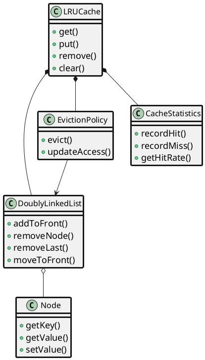
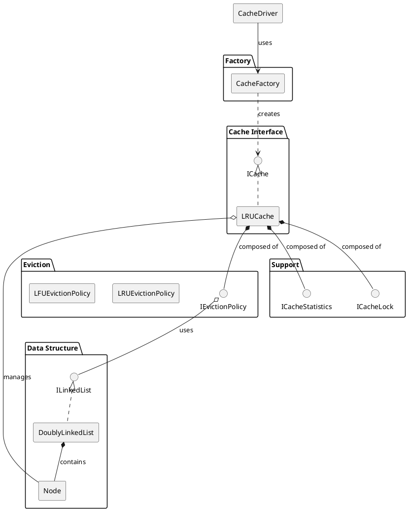
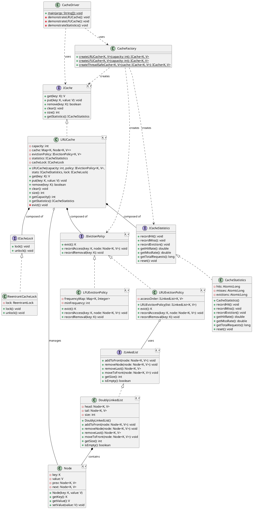
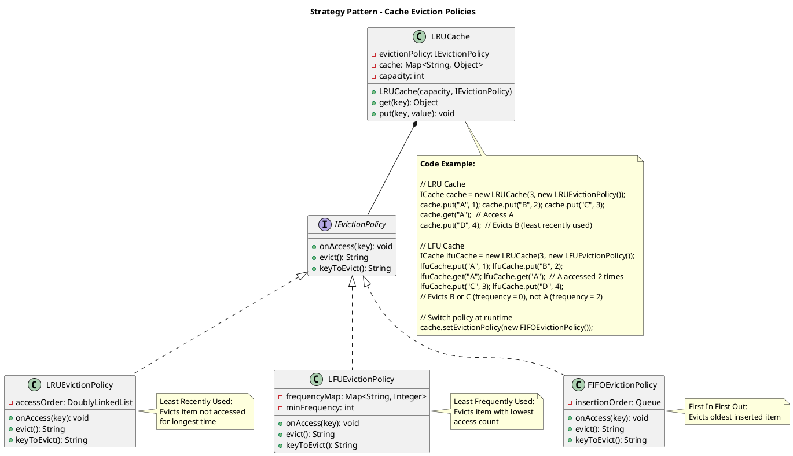
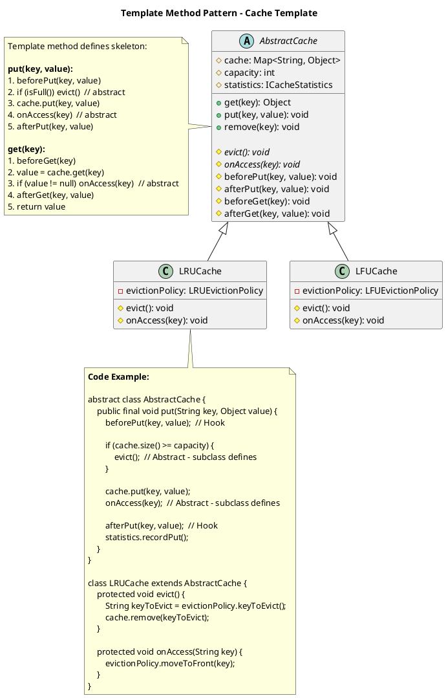

## Problem Statement

Design a data structure that implements a Least Recently Used (LRU) cache with O(1) time complexity for both get and put operations. The cache should have a fixed capacity and evict the least recently used item when the capacity is exceeded.

## Requirements

### Functional Requirements
1. Store key-value pairs with fixed capacity
2. Get value by key in O(1) time
3. Put key-value pair in O(1) time
4. Evict least recently used item when capacity is full
5. Update item's position when accessed (get or put)
6. Support generic key-value types
7. Thread-safe operations for concurrent access

### Non-Functional Requirements
1. O(1) time complexity for get and put
2. O(n) space complexity where n is capacity
3. Thread-safe implementation
4. Memory efficient
5. Support cache statistics (hit rate, miss rate)

## Simplified Class Diagram



## Simplified Overview



## Detailed Class Diagram



## Key Design Patterns

1. **[Strategy Pattern](/low-level-design/patterns/behavioural-patterns/#strategy-pattern)**: Different eviction policies (LRU, LFU, FIFO)
2. **[Singleton Pattern](/low-level-design/patterns/singleton/)**: Cache instance management
3. **[Template Method](/low-level-design/patterns/behavioural-patterns/#template-method-pattern)**: Common cache operations with customizable eviction

### Design Pattern Diagrams

#### 1. Strategy Pattern - Eviction Policies



#### 2. Template Method Pattern - Cache Operations



## Code Snippets

### Core LRU Cache Implementation

:::note
Thread-safe LRU cache using `ReentrantLock`. The cache maintains O(1) access time using a HashMap and doubly linked list combination.
:::

```java title="LRUCache.java" {19-27,36-39,50-52,62-66}
public class LRUCache<K, V> implements Cache<K, V> {
    private final int capacity;
    private final Map<K, Node<K, V>> cache;
    private final DoublyLinkedList<K, V> list;
    private final ReentrantLock lock;
    private final CacheStatistics stats;
    
    public LRUCache(int capacity) {
        this.capacity = capacity;
        this.cache = new HashMap<>();
        this.list = new DoublyLinkedList<>();
        this.lock = new ReentrantLock();
        this.stats = new CacheStatistics();
    }
    
    @Override
    public V get(K key) {
        lock.lock();
        try {
            Node<K, V> node = cache.get(key);
            if (node == null) {
                stats.recordMiss();
                return null;
            }
            
            // Move to front (most recently used)
            list.moveToFront(node);
            stats.recordHit();
            return node.getValue();
        } finally {
            lock.unlock();
        }
    }
    
    @Override
    public void put(K key, V value) {
        lock.lock();
        try {
            Node<K, V> existingNode = cache.get(key);
            
            if (existingNode != null) {
                // Update existing node
                existingNode.setValue(value);
                list.moveToFront(existingNode);
            } else {
                // Create new node
                Node<K, V> newNode = new Node<>(key, value);
                
                if (cache.size() >= capacity) {
                    evict();
                }
                
                cache.put(key, newNode);
                list.addToFront(newNode);
            }
        } finally {
            lock.unlock();
        }
    }
    
    private void evict() {
        Node<K, V> lru = list.removeLast();
        if (lru != null) {
            cache.remove(lru.getKey());
            stats.recordEviction();
        }
    }
    
    @Override
    public boolean remove(K key) {
        lock.lock();
        try {
            Node<K, V> node = cache.remove(key);
            if (node != null) {
                list.removeNode(node);
                return true;
            }
            return false;
        } finally {
            lock.unlock();
        }
    }
}
```

### Doubly Linked List Implementation

:::note
Uses dummy head and tail nodes to simplify edge cases. The most recently used items are at the front (after head), least recently used at the back (before tail).
:::

```java title="DoublyLinkedList.java" {7-11,14-20,23}
public class DoublyLinkedList<K, V> {
    private Node<K, V> head;
    private Node<K, V> tail;
    private int size;
    
    public DoublyLinkedList() {
        // Dummy head and tail
        head = new Node<>(null, null);
        tail = new Node<>(null, null);
        head.next = tail;
        tail.prev = head;
        size = 0;
    }
    
    public void addToFront(Node<K, V> node) {
        node.next = head.next;
        node.prev = head;
        head.next.prev = node;
        head.next = node;
        size++;
    }
    
    public void removeNode(Node<K, V> node) {
        node.prev.next = node.next;
        node.next.prev = node.prev;
        size--;
    }
    
    public Node<K, V> removeLast() {
        if (tail.prev == head) {
            return null;
        }
        Node<K, V> last = tail.prev;
        removeNode(last);
        return last;
    }
    
    public void moveToFront(Node<K, V> node) {
        removeNode(node);
        addToFront(node);
    }
}
```

### Node Class

```java
public class Node<K, V> {
    private K key;
    private V value;
    Node<K, V> prev;
    Node<K, V> next;
    
    public Node(K key, V value) {
        this.key = key;
        this.value = value;
    }
    
    public K getKey() {
        return key;
    }
    
    public V getValue() {
        return value;
    }
    
    public void setValue(V value) {
        this.value = value;
    }
}
```

### Usage Example

```java
// Create cache with capacity 3
LRUCache<Integer, String> cache = new LRUCache<>(3);

// Add items
cache.put(1, "one");
cache.put(2, "two");
cache.put(3, "three");

// Access item (moves to front)
String value = cache.get(1); // Returns "one"

// Add new item (evicts least recently used)
cache.put(4, "four"); // Evicts key 2

// Check statistics
System.out.println("Hit rate: " + cache.getHitRate());
System.out.println("Miss rate: " + cache.getMissRate());
```

## Extension Points

1. Add TTL (Time To Live) for cache entries
2. Implement cache warming strategies
3. Add write-through/write-back cache policies
4. Support cache persistence to disk
5. Implement distributed LRU cache
6. Add cache entry size limits (weighted LRU)
7. Support cache invalidation patterns
8. Add metrics and monitoring integration
