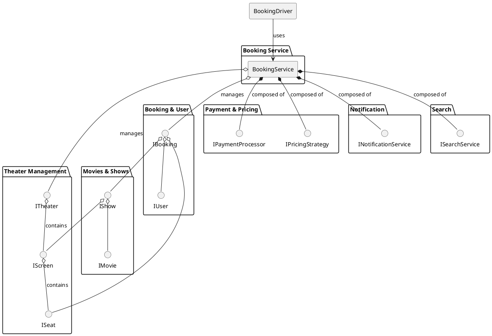
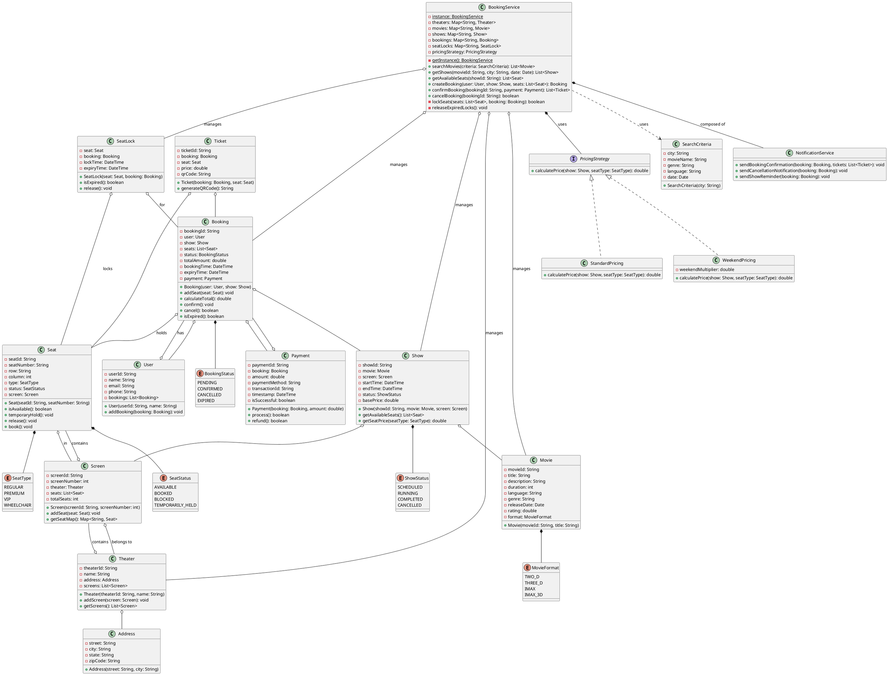
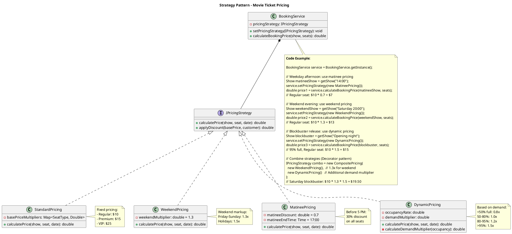
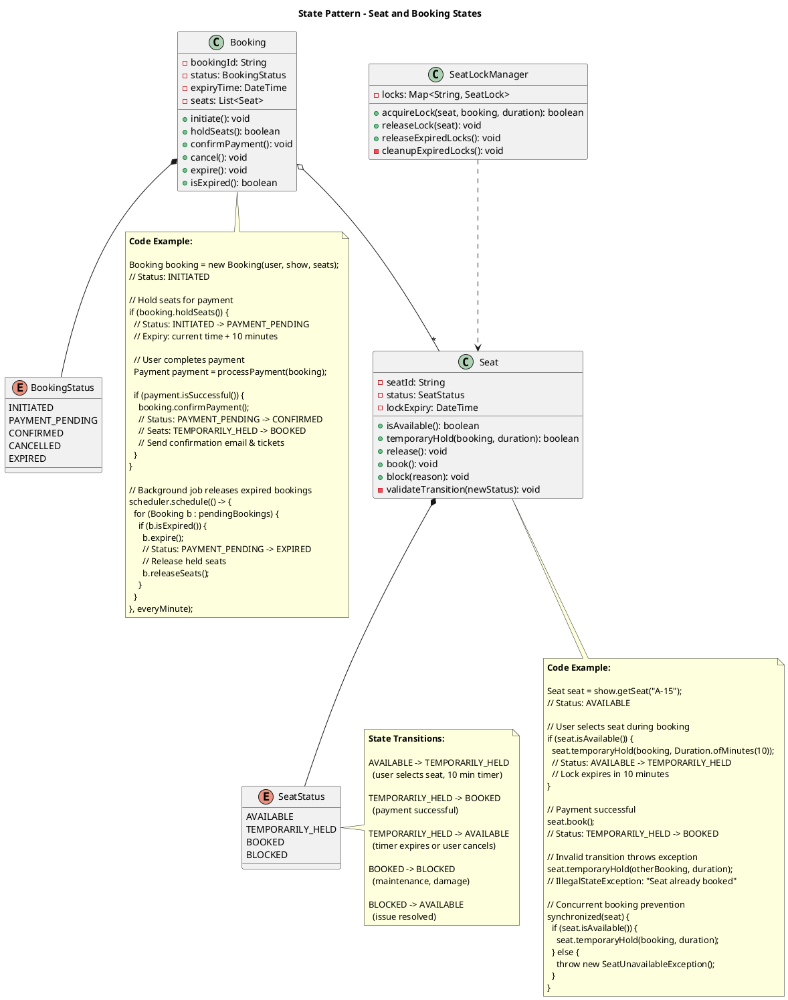
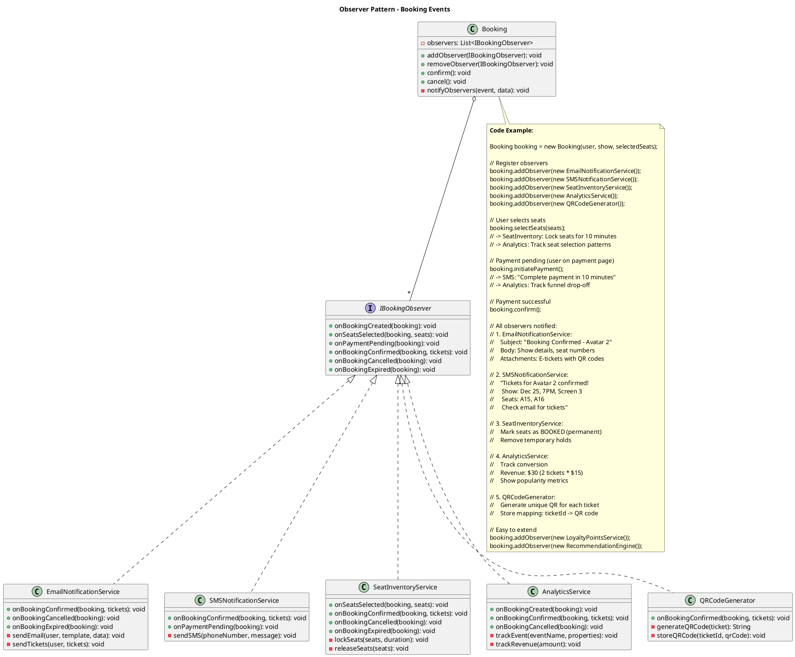

## Problem Statement

Design a movie ticket booking system (like BookMyShow) that allows users to search for movies, view showtimes, select seats, book tickets, and make payments. The system should handle multiple theaters, screens, movies, and prevent double-booking of seats.

## Requirements

### Functional Requirements
1. Browse movies by location, language, and genre
2. View theater locations and showtimes
3. Display seat layout and availability in real-time
4. Select and book seats with temporary hold
5. Support multiple seat types (Regular, Premium, VIP)
6. Process payments and generate tickets
7. Cancel bookings with refund policies
8. Send booking confirmations via email/SMS
9. Support different movie formats (2D, 3D, IMAX)
10. Handle multiple concurrent bookings

### Non-Functional Requirements
1. Prevent double-booking with proper locking
2. Seat hold timeout mechanism (10 minutes)
3. High availability for search operations
4. Fast seat availability checks
5. Scalable to multiple cities and theaters

## Simplified Overview



## Detailed Class Diagram



## Key Design Patterns

1. **[Singleton Pattern](/low-level-design/patterns/singleton/)**: BookingService as central coordinator
2. **[Strategy Pattern](/low-level-design/patterns/behavioural-patterns/#strategy-pattern)**: Different pricing strategies
3. **[Factory Pattern](/low-level-design/patterns/creational-patterns/#factory-method)**: Create bookings and tickets
4. **[Observer Pattern](/low-level-design/patterns/behavioural-patterns/#observer-pattern)**: Notifications for bookings
5. **[State Pattern](/low-level-design/patterns/behavioural-patterns/#state-pattern)**: Seat and booking status management

### Design Pattern Diagrams

#### 1. Strategy Pattern - Dynamic Pricing



#### 2. State Pattern - Seat Locking & Booking



#### 3. Observer Pattern - Booking Notifications



## Code Snippets

### Initialize Screen with Seats

:::note
Dynamically creates seats based on row position. Front rows are REGULAR, middle rows are PREMIUM, back rows are VIP.
:::

```java title="Screen.java" {2,4-5,11-21,23-27,32}
public class Screen {
    public void initializeSeats(int rows, int seatsPerRow) {
        char rowLabel = 'A';
        
        for (int i = 0; i < rows; i++) {
            for (int j = 1; j <= seatsPerRow; j++) {
                String seatNumber = rowLabel + String.valueOf(j);
                SeatType type;
                
                // Premium seats in middle rows
                if (i >= rows/3 && i < 2*rows/3) {
                    type = SeatType.PREMIUM;
                } 
                // VIP seats in back rows
                else if (i >= 2*rows/3) {
                    type = SeatType.VIP;
                } 
                // Regular seats in front
                else {
                    type = SeatType.REGULAR;
                }
                
                Seat seat = new Seat(UUID.randomUUID().toString(), seatNumber);
                seat.setRow(String.valueOf(rowLabel));
                seat.setColumn(j);
                seat.setType(type);
                seat.setStatus(SeatStatus.AVAILABLE);
                seat.setScreen(this);
                
                seats.add(seat);
            }
            rowLabel++;
        }
        
        this.totalSeats = seats.size();
    }
}
```

### Create Booking with Seat Locking

:::note
Implements temporary seat locking with 10-minute expiry. Uses `synchronized` to prevent race conditions. Includes automatic rollback on failure.
:::

```java title="BookingService.java" {4,7-9,13-17,26-28,31-33,37-38,42,46,49-56}
public class BookingService {
    private static final int SEAT_HOLD_DURATION_MINUTES = 10;
    
    public synchronized Booking createBooking(User user, Show show, List<Seat> seats) 
            throws BookingException {
        // Validate show
        if (show.getStatus() != ShowStatus.SCHEDULED) {
            throw new BookingException("Show is not available for booking");
        }
        
        // Check seat availability
        for (Seat seat : seats) {
            if (!seat.isAvailable()) {
                throw new BookingException("Seat " + seat.getSeatNumber() + 
                                         " is not available");
            }
        }
        
        // Create booking
        Booking booking = new Booking(user, show);
        booking.setStatus(BookingStatus.PENDING);
        booking.setBookingTime(DateTime.now());
        booking.setExpiryTime(DateTime.now().plusMinutes(SEAT_HOLD_DURATION_MINUTES));
        
        // Lock seats
        if (!lockSeats(seats, booking)) {
            throw new BookingException("Failed to lock seats");
        }
        
        // Add seats to booking
        for (Seat seat : seats) {
            booking.addSeat(seat);
        }
        
        // Calculate total
        double total = calculateBookingAmount(show, seats);
        booking.setTotalAmount(total);
        
        // Save booking
        bookings.put(booking.getBookingId(), booking);
        
        return booking;
    }
    
    private boolean lockSeats(List<Seat> seats, Booking booking) {
        DateTime expiryTime = DateTime.now().plusMinutes(SEAT_HOLD_DURATION_MINUTES);
        
        for (Seat seat : seats) {
            if (seat.getStatus() != SeatStatus.AVAILABLE) {
                // Rollback previous locks
                rollbackSeatLocks(booking);
                return false;
            }
            
            // Create lock
            SeatLock lock = new SeatLock(seat, booking);
            lock.setExpiryTime(expiryTime);
            seatLocks.put(seat.getSeatId(), lock);
            
            // Update seat status
            seat.setStatus(SeatStatus.TEMPORARILY_HELD);
        }
        
        return true;
    }
    
    private double calculateBookingAmount(Show show, List<Seat> seats) {
        double total = 0;
        for (Seat seat : seats) {
            total += pricingStrategy.calculatePrice(show, seat.getType());
        }
        return total;
    }
}
```

### Confirm Booking and Generate Tickets

```java
public class BookingService {
    public synchronized List<Ticket> confirmBooking(String bookingId, Payment payment) 
            throws BookingException {
        Booking booking = bookings.get(bookingId);
        
        if (booking == null) {
            throw new BookingException("Booking not found");
        }
        
        if (booking.isExpired()) {
            releaseSeats(booking);
            throw new BookingException("Booking has expired");
        }
        
        // Process payment
        if (!payment.process()) {
            throw new BookingException("Payment processing failed");
        }
        
        // Update booking status
        booking.setPayment(payment);
        booking.setStatus(BookingStatus.CONFIRMED);
        
        // Book seats permanently
        for (Seat seat : booking.getSeats()) {
            seat.setStatus(SeatStatus.BOOKED);
            // Remove lock
            seatLocks.remove(seat.getSeatId());
        }
        
        // Generate tickets
        List<Ticket> tickets = new ArrayList<>();
        for (Seat seat : booking.getSeats()) {
            Ticket ticket = new Ticket(booking, seat);
            double price = pricingStrategy.calculatePrice(
                booking.getShow(), seat.getType());
            ticket.setPrice(price);
            ticket.setQrCode(ticket.generateQRCode());
            tickets.add(ticket);
        }
        
        // Send confirmation
        notificationService.sendBookingConfirmation(booking, tickets);
        
        return tickets;
    }
}
```

### Cancel Booking

```java
public class BookingService {
    public synchronized boolean cancelBooking(String bookingId) throws BookingException {
        Booking booking = bookings.get(bookingId);
        
        if (booking == null) {
            throw new BookingException("Booking not found");
        }
        
        if (booking.getStatus() != BookingStatus.CONFIRMED) {
            throw new BookingException("Only confirmed bookings can be cancelled");
        }
        
        // Check cancellation policy (e.g., 2 hours before show)
        DateTime showTime = booking.getShow().getStartTime();
        if (DateTime.now().plusHours(2).isAfter(showTime)) {
            throw new BookingException("Cancellation not allowed within 2 hours of show");
        }
        
        // Process refund
        if (booking.getPayment() != null) {
            booking.getPayment().refund();
        }
        
        // Release seats
        for (Seat seat : booking.getSeats()) {
            seat.setStatus(SeatStatus.AVAILABLE);
        }
        
        // Update booking status
        booking.setStatus(BookingStatus.CANCELLED);
        
        // Send notification
        notificationService.sendCancellationNotification(booking);
        
        return true;
    }
    
    private void releaseSeats(Booking booking) {
        for (Seat seat : booking.getSeats()) {
            seat.setStatus(SeatStatus.AVAILABLE);
            seatLocks.remove(seat.getSeatId());
        }
    }
}
```

### Release Expired Seat Locks (Background Task)

```java
public class BookingService {
    public void releaseExpiredLocks() {
        DateTime now = DateTime.now();
        List<String> expiredLocks = new ArrayList<>();
        
        synchronized(this) {
            for (Map.Entry<String, SeatLock> entry : seatLocks.entrySet()) {
                SeatLock lock = entry.getValue();
                
                if (lock.isExpired()) {
                    // Release seat
                    lock.getSeat().setStatus(SeatStatus.AVAILABLE);
                    expiredLocks.add(entry.getKey());
                    
                    // Update booking status
                    Booking booking = lock.getBooking();
                    if (booking.getStatus() == BookingStatus.PENDING) {
                        booking.setStatus(BookingStatus.EXPIRED);
                    }
                }
            }
            
            // Remove expired locks
            for (String lockId : expiredLocks) {
                seatLocks.remove(lockId);
            }
        }
    }
    
    // This should be called periodically (e.g., every minute)
    public void startLockCleanupTask() {
        ScheduledExecutorService executor = Executors.newSingleThreadScheduledExecutor();
        executor.scheduleAtFixedRate(
            this::releaseExpiredLocks, 
            0, 
            1, 
            TimeUnit.MINUTES
        );
    }
}
```

### Search Movies and Shows

```java
public class BookingService {
    public List<Movie> searchMovies(SearchCriteria criteria) {
        return movies.values().stream()
            .filter(movie -> {
                if (criteria.getMovieName() != null && 
                    !movie.getTitle().toLowerCase()
                        .contains(criteria.getMovieName().toLowerCase())) {
                    return false;
                }
                if (criteria.getGenre() != null && 
                    !movie.getGenre().equalsIgnoreCase(criteria.getGenre())) {
                    return false;
                }
                if (criteria.getLanguage() != null && 
                    !movie.getLanguage().equalsIgnoreCase(criteria.getLanguage())) {
                    return false;
                }
                return true;
            })
            .collect(Collectors.toList());
    }
    
    public List<Show> getShows(String movieId, String city, Date date) {
        return shows.values().stream()
            .filter(show -> show.getMovie().getMovieId().equals(movieId))
            .filter(show -> show.getScreen().getTheater()
                .getAddress().getCity().equalsIgnoreCase(city))
            .filter(show -> isSameDate(show.getStartTime().toDate(), date))
            .filter(show -> show.getStatus() == ShowStatus.SCHEDULED)
            .sorted(Comparator.comparing(Show::getStartTime))
            .collect(Collectors.toList());
    }
    
    private boolean isSameDate(Date date1, Date date2) {
        Calendar cal1 = Calendar.getInstance();
        Calendar cal2 = Calendar.getInstance();
        cal1.setTime(date1);
        cal2.setTime(date2);
        
        return cal1.get(Calendar.YEAR) == cal2.get(Calendar.YEAR) &&
               cal1.get(Calendar.MONTH) == cal2.get(Calendar.MONTH) &&
               cal1.get(Calendar.DAY_OF_MONTH) == cal2.get(Calendar.DAY_OF_MONTH);
    }
}
```

### Pricing Strategy

```java
public class WeekendPricing implements PricingStrategy {
    private static final double WEEKEND_MULTIPLIER = 1.3; // 30% more
    private static final Map<SeatType, Double> SEAT_MULTIPLIERS = Map.of(
        SeatType.REGULAR, 1.0,
        SeatType.PREMIUM, 1.5,
        SeatType.VIP, 2.0
    );
    
    @Override
    public double calculatePrice(Show show, SeatType seatType) {
        double basePrice = show.getBasePrice();
        double seatMultiplier = SEAT_MULTIPLIERS.get(seatType);
        
        // Check if weekend
        Calendar cal = Calendar.getInstance();
        cal.setTime(show.getStartTime().toDate());
        int dayOfWeek = cal.get(Calendar.DAY_OF_WEEK);
        
        double price = basePrice * seatMultiplier;
        
        if (dayOfWeek == Calendar.SATURDAY || dayOfWeek == Calendar.SUNDAY) {
            price *= WEEKEND_MULTIPLIER;
        }
        
        return price;
    }
}
```

## Extension Points

1. Add food and beverage ordering
2. Implement seat recommendations based on preferences
3. Add loyalty programs and discounts
4. Support group bookings with special pricing
5. Implement waitlist for sold-out shows
6. Add movie trailers and reviews integration
7. Support multiple languages for interface
8. Implement dynamic pricing based on demand
9. Add theater facility information (parking, accessibility)
10. Support gift cards and vouchers
