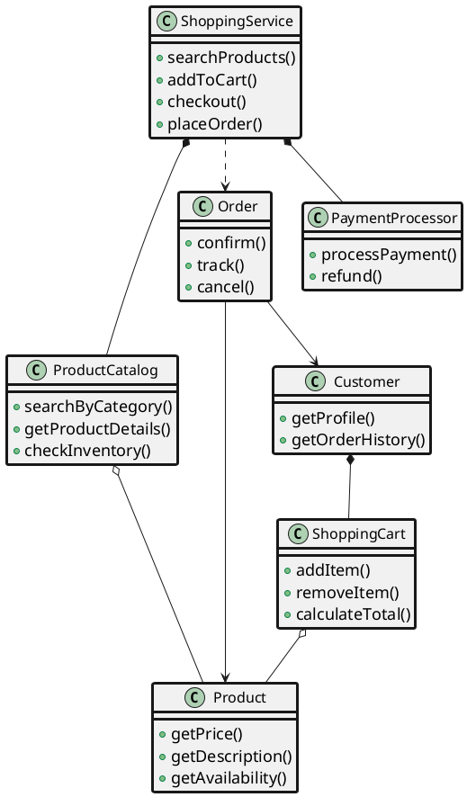
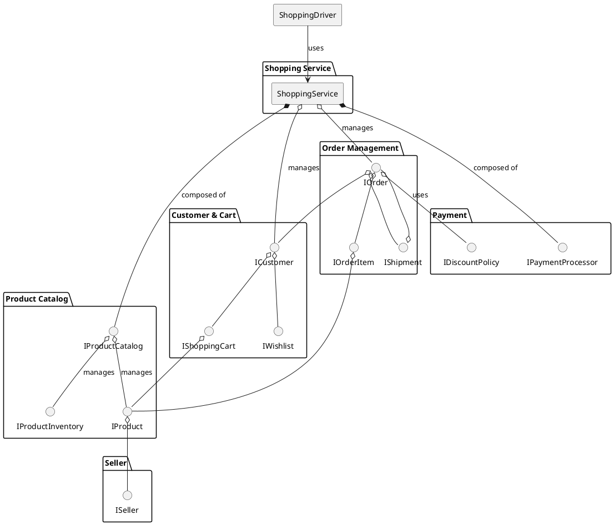
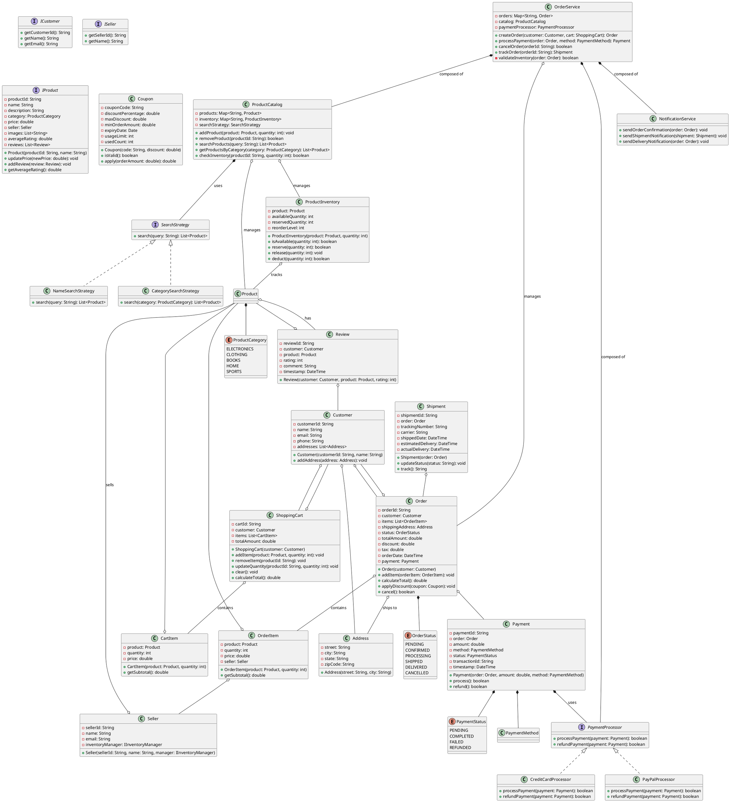
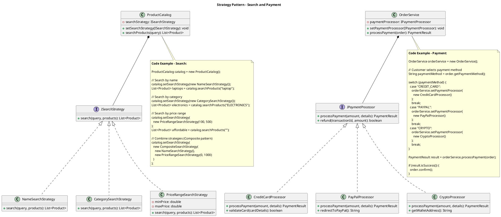
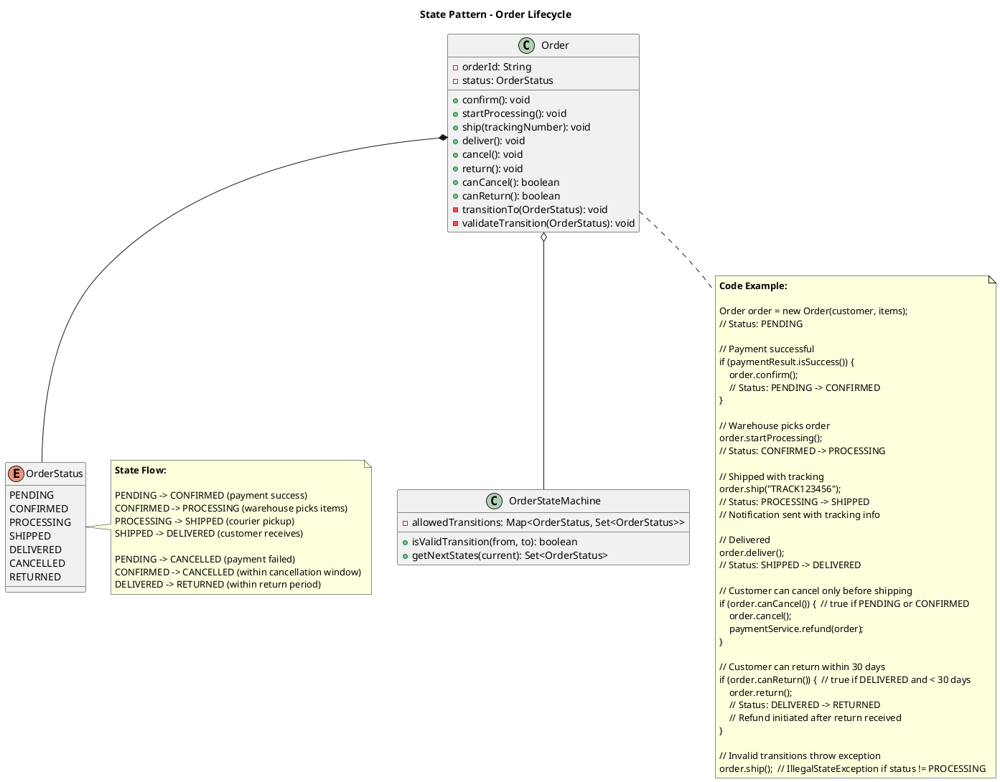
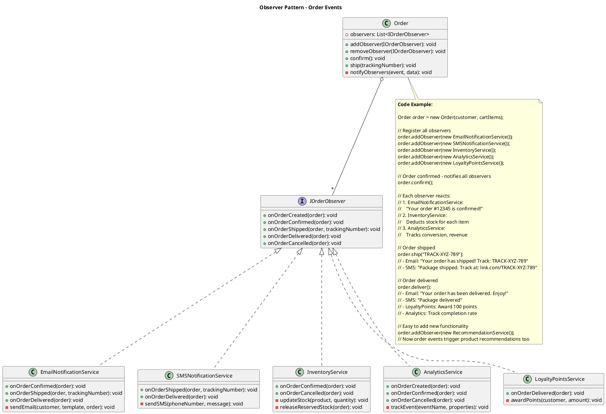

## Problem Statement

Design an online shopping system (e-commerce platform) that allows customers to browse products, add items to cart, place orders, make payments, and track shipments. The system should handle product catalog, inventory management, order processing, and support multiple sellers.

## Requirements

### Functional Requirements
1. Browse and search products by category, name, price
2. Add/remove products from shopping cart
3. Place orders and checkout
4. Multiple payment methods support
5. Order tracking and history
6. Product reviews and ratings
7. Inventory management
8. Support multiple sellers/vendors
9. Wishlist functionality
10. Apply discount coupons and promotions

### Non-Functional Requirements
1. Handle high concurrency for popular products
2. Prevent overselling (inventory consistency)
3. Secure payment processing
4. Fast search and browse operations
5. Scalable to millions of products and users

## Simplified Class Diagram



## Simplified Overview



## Detailed Class Diagram



## Key Design Patterns

1. **[Singleton Pattern](/low-level-design/patterns/singleton/)**: ProductCatalog, OrderService
2. **[Strategy Pattern](/low-level-design/patterns/behavioural-patterns/#strategy-pattern)**: Different search and payment strategies
3. **[Factory Pattern](/low-level-design/patterns/creational-patterns/#factory-method)**: Create orders and payments
4. **[Observer Pattern](/low-level-design/patterns/behavioural-patterns/#observer-pattern)**: Notifications for order updates
5. **[State Pattern](/low-level-design/patterns/behavioural-patterns/#state-pattern)**: Order status management

### Design Pattern Diagrams

#### 1. Strategy Pattern - Search & Payment Strategies



#### 2. State Pattern - Order Status Management



#### 3. Observer Pattern - Order Notifications



## Code Snippets

### Add to Cart

:::note
Checks inventory before adding items. Handles quantity updates for existing items and automatically recalculates cart total.
:::

```java title="ShoppingCart.java" {4-6,9,12-14,17-20,24-27}
public class ShoppingCart {
    public void addItem(Product product, int quantity) throws CartException {
        // Check inventory availability
        if (!catalog.checkInventory(product.getProductId(), quantity)) {
            throw new CartException("Insufficient inventory");
        }
        
        // Check if product already in cart
        CartItem existingItem = findItem(product.getProductId());
        
        if (existingItem != null) {
            // Update quantity
            existingItem.setQuantity(existingItem.getQuantity() + quantity);
        } else {
            // Add new item
            CartItem item = new CartItem(product, quantity);
            item.setPrice(product.getPrice());
            items.add(item);
        }
        
        // Recalculate total
        calculateTotal();
    }
    
    public double calculateTotal() {
        totalAmount = items.stream()
            .mapToDouble(CartItem::getSubtotal)
            .sum();
        return totalAmount;
    }
}
```

### Create Order

:::note
Atomically creates order by reserving inventory for each item. Implements automatic rollback on failure to maintain data consistency.
:::

```java title="OrderService.java" {4,6-8,19-24,27-30,36-37,43,47,50-53}
public class OrderService {
    public Order createOrder(Customer customer, ShoppingCart cart) throws OrderException {
        synchronized(this) {
            if (cart.getItems().isEmpty()) {
                throw new OrderException("Cart is empty");
            }
            
            // Create order
            Order order = new Order(customer);
            order.setOrderDate(DateTime.now());
            
            // Validate and reserve inventory
            for (CartItem cartItem : cart.getItems()) {
                Product product = cartItem.getProduct();
                int quantity = cartItem.getQuantity();
                
                ProductInventory inventory = catalog.getInventory(product.getProductId());
                
                if (!inventory.reserve(quantity)) {
                    // Rollback previous reservations
                    rollbackReservations(order);
                    throw new OrderException("Product unavailable: " + product.getName());
                }
                
                // Create order item
                OrderItem orderItem = new OrderItem(product, quantity);
                orderItem.setPrice(product.getPrice());
                orderItem.setSeller(product.getSeller());
                order.addItem(orderItem);
            }
            
            // Calculate totals
            order.calculateTotal();
            order.setStatus(OrderStatus.PENDING);
            
            // Save order
            orders.put(order.getOrderId(), order);
            
            // Clear cart
            cart.clear();
            
            return order;
        }
    }
    
    private void rollbackReservations(Order order) {
        for (OrderItem item : order.getItems()) {
            ProductInventory inventory = catalog.getInventory(
                item.getProduct().getProductId());
            inventory.release(item.getQuantity());
        }
    }
}
```

### Process Payment

```java
public class OrderService {
    public Payment processPayment(Order order, PaymentMethod method) 
            throws PaymentException {
        if (order.getStatus() != OrderStatus.PENDING) {
            throw new PaymentException("Order not in pending state");
        }
        
        // Create payment
        Payment payment = new Payment(order, order.getTotalAmount(), method);
        
        // Select payment processor
        PaymentProcessor processor = getPaymentProcessor(method);
        
        try {
            // Process payment
            if (processor.processPayment(payment)) {
                payment.setStatus(PaymentStatus.COMPLETED);
                order.setPayment(payment);
                order.setStatus(OrderStatus.CONFIRMED);
                
                // Deduct from inventory
                deductInventory(order);
                
                // Create shipment
                createShipment(order);
                
                // Send confirmation
                notificationService.sendOrderConfirmation(order);
                
                return payment;
            } else {
                payment.setStatus(PaymentStatus.FAILED);
                releaseInventory(order);
                throw new PaymentException("Payment processing failed");
            }
        } catch (Exception e) {
            payment.setStatus(PaymentStatus.FAILED);
            releaseInventory(order);
            throw new PaymentException("Payment error: " + e.getMessage());
        }
    }
    
    private void deductInventory(Order order) {
        for (OrderItem item : order.getItems()) {
            ProductInventory inventory = catalog.getInventory(
                item.getProduct().getProductId());
            inventory.deduct(item.getQuantity());
        }
    }
    
    private void releaseInventory(Order order) {
        for (OrderItem item : order.getItems()) {
            ProductInventory inventory = catalog.getInventory(
                item.getProduct().getProductId());
            inventory.release(item.getQuantity());
        }
    }
}
```

### Apply Coupon

```java
public class Order {
    public void applyDiscount(Coupon coupon) throws OrderException {
        if (!coupon.isValid()) {
            throw new OrderException("Coupon is invalid or expired");
        }
        
        if (totalAmount < coupon.getMinOrderAmount()) {
            throw new OrderException("Order amount below minimum for this coupon");
        }
        
        double discountAmount = coupon.apply(totalAmount);
        this.discount = discountAmount;
        
        // Recalculate total
        calculateTotal();
        
        // Increment usage count
        coupon.incrementUsage();
    }
    
    public double calculateTotal() {
        double subtotal = items.stream()
            .mapToDouble(OrderItem::getSubtotal)
            .sum();
        
        double taxAmount = subtotal * 0.10; // 10% tax
        totalAmount = subtotal - discount + taxAmount;
        
        return totalAmount;
    }
}
```

### Search Products

```java
public class ProductCatalog {
    public List<Product> searchProducts(String query) {
        return products.values().stream()
            .filter(p -> p.getName().toLowerCase().contains(query.toLowerCase())
                      || p.getDescription().toLowerCase().contains(query.toLowerCase()))
            .collect(Collectors.toList());
    }
    
    public List<Product> getProductsByCategory(ProductCategory category) {
        return products.values().stream()
            .filter(p -> p.getCategory() == category)
            .collect(Collectors.toList());
    }
    
    public List<Product> getProductsByPriceRange(double minPrice, double maxPrice) {
        return products.values().stream()
            .filter(p -> p.getPrice() >= minPrice && p.getPrice() <= maxPrice)
            .collect(Collectors.toList());
    }
}
```

### Inventory Management

```java
public class ProductInventory {
    public synchronized boolean reserve(int quantity) {
        if (availableQuantity >= quantity) {
            availableQuantity -= quantity;
            reservedQuantity += quantity;
            return true;
        }
        return false;
    }
    
    public synchronized void release(int quantity) {
        reservedQuantity -= quantity;
        availableQuantity += quantity;
    }
    
    public synchronized boolean deduct(int quantity) {
        if (reservedQuantity >= quantity) {
            reservedQuantity -= quantity;
            return true;
        }
        return false;
    }
    
    public boolean needsReorder() {
        return (availableQuantity + reservedQuantity) <= reorderLevel;
    }
}
```

## Extension Points

1. Add recommendation engine based on browsing history
2. Implement flash sales and limited-time offers
3. Add product comparison feature
4. Support subscription-based products
5. Implement seller dashboard and analytics
6. Add customer support chat system
7. Support international shipping and multi-currency
8. Implement loyalty points and rewards program
9. Add product availability notifications
10. Support bundle deals and combo offers
