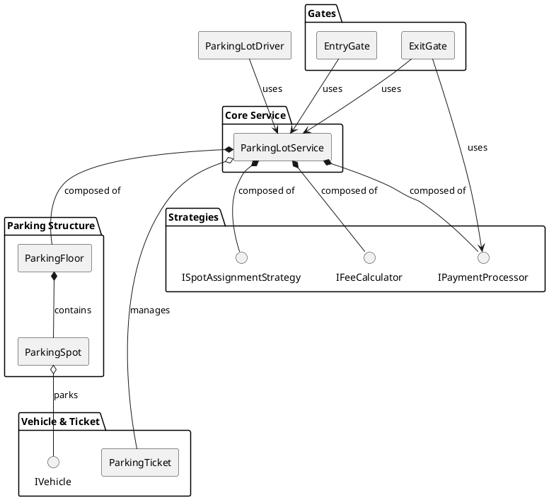
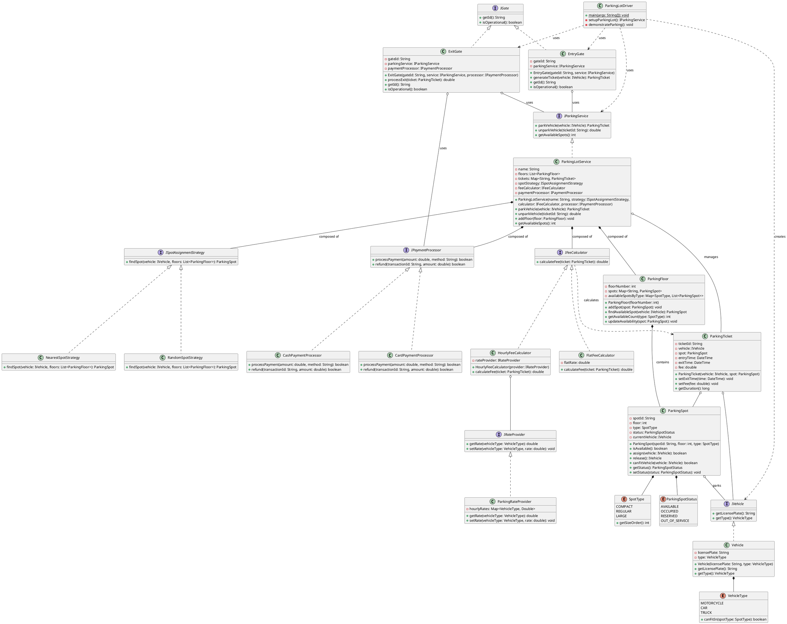
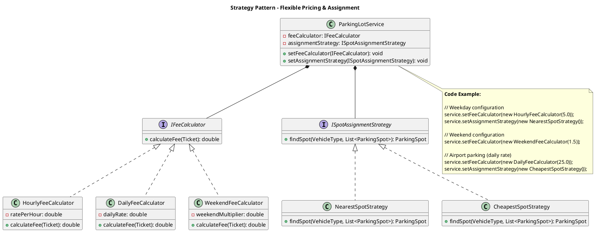
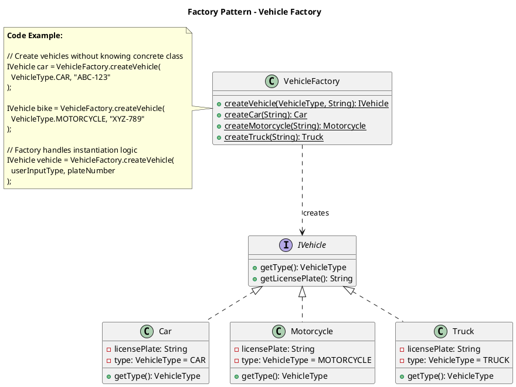
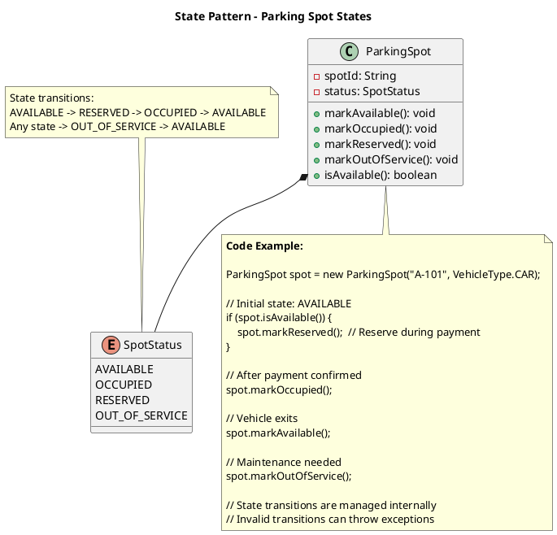

## Problem Statement

Design a parking lot system that can manage multiple levels of parking, different vehicle types (motorcycle, car, truck), and handle parking/unparking operations. The system should efficiently allocate parking spots, calculate fees, and track parking availability.

## Requirements

### Functional Requirements
1. Support multiple vehicle types: Motorcycle, Car, Truck
2. Handle multiple parking levels/floors
3. Different spot sizes: Compact, Regular, Large
4. Assign nearest available spot to vehicles
5. Calculate parking fees based on duration
6. Track spot availability in real-time
7. Generate parking tickets with unique ID
8. Support payment processing
9. Handle entry and exit gates

### Non-Functional Requirements
1. Thread-safe for concurrent parking operations
2. Fast spot lookup (O(1) or O(log n))
3. Scalable to handle thousands of spots
4. High availability
5. Accurate fee calculation

## Simplified Overview



## Detailed Class Diagram



## Key Design Patterns

1. **[Singleton Pattern](/low-level-design/patterns/singleton/)**: ParkingLot ensures single instance
2. **[Factory Pattern](/low-level-design/patterns/creational-patterns/#factory-method)**: Create different vehicle types
3. **[Strategy Pattern](/low-level-design/patterns/behavioural-patterns/#strategy-pattern)**: Different payment methods
4. **[State Pattern](/low-level-design/patterns/behavioural-patterns/#state-pattern)**: Parking spot status management

### Design Pattern Diagrams

#### 1. Strategy Pattern - Fee Calculation & Spot Assignment



#### 2. Factory Pattern - Vehicle Creation



#### 3. State Pattern - Parking Spot Status



## Code Snippets

### Parking a Vehicle

:::note
The `synchronized` block ensures thread-safe vehicle parking, preventing race conditions when multiple vehicles try to park simultaneously.
:::

```java title="ParkingLot.java" {3,5-7,11}
public class ParkingLot {
    public ParkingTicket parkVehicle(Vehicle vehicle) {
        synchronized(this) {
            ParkingSpot spot = findAvailableSpot(vehicle);
            if (spot == null) {
                throw new NoAvailableSpotException("No available spot for " + vehicle.getType());
            }
            
            spot.assignVehicle(vehicle);
            ParkingTicket ticket = new ParkingTicket(vehicle, spot);
            activeTickets.put(ticket.getTicketId(), ticket);
            
            return ticket;
        }
    }
    
    private ParkingSpot findAvailableSpot(Vehicle vehicle) {
        for (ParkingFloor floor : floors) {
            ParkingSpot spot = floor.findAvailableSpot(vehicle);
            if (spot != null) {
                return spot;
            }
        }
        return null;
    }
}
```

### Spot Availability Check

:::note
Different vehicle types have different size requirements. Motorcycles can fit in any spot, cars need compact or larger spots, and trucks require large spots.
:::

```java title="ParkingSpot.java" {2-4,7-14}
public class ParkingSpot {
    public boolean canFitVehicle(Vehicle vehicle) {
        if (status != ParkingSpotStatus.AVAILABLE) {
            return false;
        }
        
        switch(vehicle.getType()) {
            case MOTORCYCLE:
                return true; // Can fit in any spot
            case CAR:
                return type != SpotType.COMPACT;
            case TRUCK:
                return type == SpotType.LARGE;
            default:
                return false;
        }
    }
}
```

### Fee Calculation

:::note
Fee is calculated based on parking duration in hours, using `Math.ceil()` to round up partial hours.
:::

```java title="ParkingTicket.java" {5-6}
public class ParkingTicket {
    public double calculateFee(ParkingRate rate) {
        if (exitTime == null) {
            exitTime = DateTime.now();
        }
        
        long durationMillis = exitTime.getMillis() - entryTime.getMillis();
        double hours = Math.ceil(durationMillis / (1000.0 * 60 * 60));
        
        this.fee = rate.calculateFee(vehicle, hours);
        return this.fee;
    }
}
```

## Extension Points

1. Add reservation system for spots
2. Implement dynamic pricing based on demand
3. Add electric vehicle charging spots
4. Implement valet parking service
5. Add mobile app integration with QR code scanning
6. Support monthly/annual parking passes
7. Add parking spot navigation system
