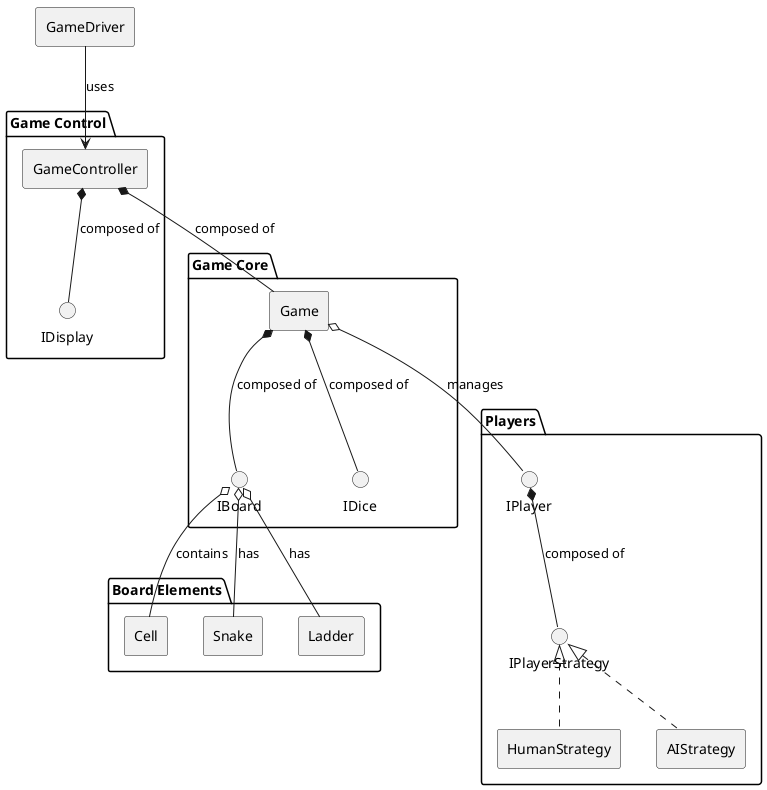
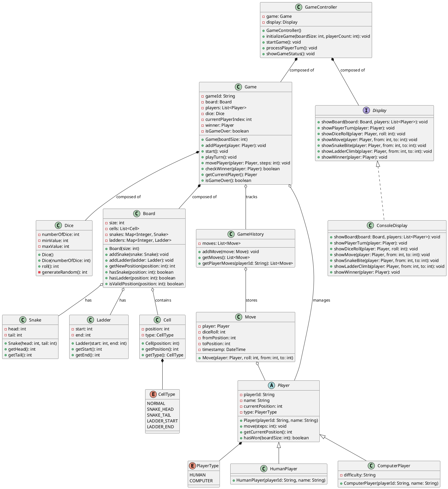
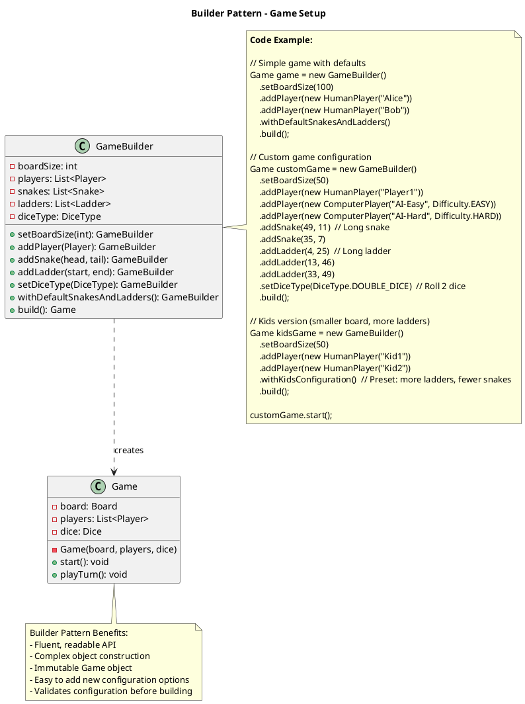
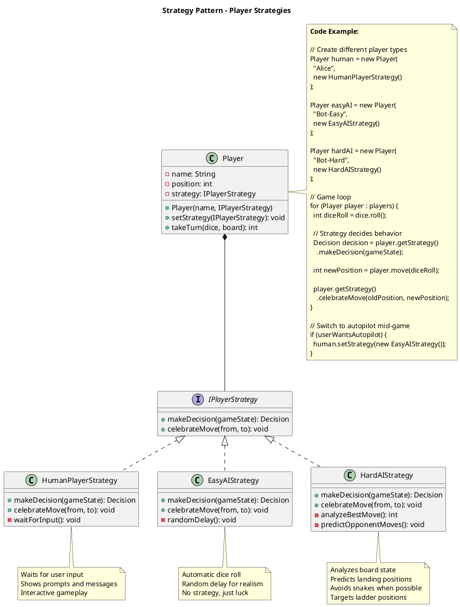
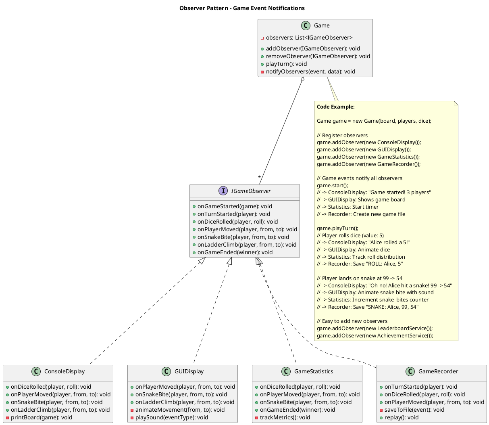

## Problem Statement

Design a Snake and Ladder board game that can be played by multiple players. The system should handle game initialization, player movements, snake and ladder mechanics, dice rolls, turn management, and determine the winner. Support both human and computer players.

## Requirements

### Functional Requirements
1. Initialize game board with configurable size (default 100 cells)
2. Place snakes and ladders at specific positions
3. Support 2-4 players
4. Roll dice (1-6) for each player's turn
5. Move player tokens based on dice roll
6. Handle snake bites (move down)
7. Handle ladder climbs (move up)
8. Determine winner when a player reaches the final cell
9. Handle exact landing on final cell
10. Support both human and AI players

### Non-Functional Requirements
1. Fair random dice generation
2. Clear game state visualization
3. Turn-based sequential gameplay
4. Extensible for different board sizes
5. Support game state persistence

## Simplified Overview



## Detailed Class Diagram



## Key Design Patterns

1. **[Factory Pattern](/low-level-design/patterns/creational-patterns/#factory-method)**: Create different player types
2. **[Strategy Pattern](/low-level-design/patterns/behavioural-patterns/#strategy-pattern)**: Different display strategies
3. **[Observer Pattern](/low-level-design/patterns/behavioural-patterns/#observer-pattern)**: Game state notifications
4. **[Builder Pattern](/low-level-design/patterns/creational-patterns/#builder-pattern)**: Game configuration
5. **[Singleton Pattern](/low-level-design/patterns/singleton/)**: Game controller

### Design Pattern Diagrams

#### 1. Builder Pattern - Game Configuration



#### 2. Strategy Pattern - Player Behavior



#### 3. Observer Pattern - Game Events



## Code Snippets

### Initialize Game Board

:::note
The board validates snake and ladder positions during initialization. Snakes must go down (head > tail) and ladders must go up (start < end).
:::

```java title="Board.java" {14-28,31-35,38-42,45-53}
public class Board {
    private int size;
    private Map<Integer, Snake> snakes;
    private Map<Integer, Ladder> ladders;
    
    public Board(int size) {
        this.size = size;
        this.snakes = new HashMap<>();
        this.ladders = new HashMap<>();
        initializeDefaultSnakesAndLadders();
    }
    
    private void initializeDefaultSnakesAndLadders() {
        // Add snakes (head -> tail)
        addSnake(new Snake(99, 54));
        addSnake(new Snake(70, 55));
        addSnake(new Snake(52, 42));
        addSnake(new Snake(25, 2));
        addSnake(new Snake(95, 72));
        
        // Add ladders (start -> end)
        addLadder(new Ladder(6, 25));
        addLadder(new Ladder(11, 40));
        addLadder(new Ladder(60, 85));
        addLadder(new Ladder(46, 90));
        addLadder(new Ladder(17, 69));
    }
    
    public void addSnake(Snake snake) {
        if (snake.getHead() <= snake.getTail()) {
            throw new IllegalArgumentException("Snake head must be greater than tail");
        }
        snakes.put(snake.getHead(), snake);
    }
    
    public void addLadder(Ladder ladder) {
        if (ladder.getStart() >= ladder.getEnd()) {
            throw new IllegalArgumentException("Ladder start must be less than end");
        }
        ladders.put(ladder.getStart(), ladder);
    }
    
    public int getNewPosition(int position) {
        // Check for snake
        if (snakes.containsKey(position)) {
            return snakes.get(position).getTail();
        }
        
        // Check for ladder
        if (ladders.containsKey(position)) {
            return ladders.get(position).getEnd();
        }
        
        return position;
    }
}
```

### Play Turn

:::note
Handles a complete turn: dice roll, position calculation, board boundary check, player movement, and winner detection. Automatically advances to next player.
:::

```java title="Game.java" {2-4,10,14-15,19-23,26,30-33,37}
public class Game {
    public void playTurn() {
        if (isGameOver) {
            return;
        }
        
        Player currentPlayer = getCurrentPlayer();
        
        // Roll dice
        int diceRoll = dice.roll();
        display.showDiceRoll(currentPlayer, diceRoll);
        
        // Calculate new position
        int currentPosition = currentPlayer.getCurrentPosition();
        int newPosition = currentPosition + diceRoll;
        
        // Check if exceeds board
        if (newPosition > board.getSize()) {
            display.showMove(currentPlayer, currentPosition, currentPosition);
            nextTurn();
            return;
        }
        
        // Move player
        movePlayer(currentPlayer, newPosition);
        
        // Check for winner
        if (checkWinner(currentPlayer)) {
            winner = currentPlayer;
            isGameOver = true;
            display.showWinner(winner);
            return;
        }
        
        // Next player's turn
        nextTurn();
    }
    
    private void movePlayer(Player player, int newPosition) {
        int currentPosition = player.getCurrentPosition();
        
        // Move to new position
        player.setCurrentPosition(newPosition);
        display.showMove(player, currentPosition, newPosition);
        
        // Check for snake or ladder
        int finalPosition = board.getNewPosition(newPosition);
        
        if (finalPosition != newPosition) {
            if (finalPosition < newPosition) {
                // Snake bite
                display.showSnakeBite(player, newPosition, finalPosition);
            } else {
                // Ladder climb
                display.showLadderClimb(player, newPosition, finalPosition);
            }
            player.setCurrentPosition(finalPosition);
        }
        
        // Record move
        history.addMove(new Move(player, dice.getLastRoll(), currentPosition, 
                                player.getCurrentPosition()));
    }
    
    private void nextTurn() {
        currentPlayerIndex = (currentPlayerIndex + 1) % players.size();
    }
    
    private boolean checkWinner(Player player) {
        return player.getCurrentPosition() == board.getSize();
    }
}
```

### Dice Roll

```java
public class Dice {
    private int numberOfDice;
    private int minValue;
    private int maxValue;
    private Random random;
    private int lastRoll;
    
    public Dice() {
        this(1); // Single dice by default
    }
    
    public Dice(int numberOfDice) {
        this.numberOfDice = numberOfDice;
        this.minValue = 1;
        this.maxValue = 6;
        this.random = new Random();
    }
    
    public int roll() {
        int sum = 0;
        for (int i = 0; i < numberOfDice; i++) {
            sum += generateRandom();
        }
        lastRoll = sum;
        return sum;
    }
    
    private int generateRandom() {
        return random.nextInt(maxValue - minValue + 1) + minValue;
    }
    
    public int getLastRoll() {
        return lastRoll;
    }
}
```

### Game Controller

```java
public class GameController {
    private Game game;
    private Display display;
    private Scanner scanner;
    
    public void initializeGame(int boardSize, int playerCount) {
        game = new Game(boardSize);
        display = new ConsoleDisplay();
        scanner = new Scanner(System.in);
        
        // Add players
        for (int i = 0; i < playerCount; i++) {
            System.out.println("Enter name for Player " + (i + 1) + ":");
            String name = scanner.nextLine();
            
            System.out.println("Player type? (1: Human, 2: Computer):");
            int type = scanner.nextInt();
            scanner.nextLine(); // Consume newline
            
            Player player;
            if (type == 1) {
                player = new HumanPlayer("P" + (i + 1), name);
            } else {
                player = new ComputerPlayer("P" + (i + 1), name);
            }
            
            game.addPlayer(player);
        }
    }
    
    public void startGame() {
        display.showBoard(game.getBoard(), game.getPlayers());
        
        while (!game.isGameOver()) {
            Player currentPlayer = game.getCurrentPlayer();
            display.showPlayerTurn(currentPlayer);
            
            if (currentPlayer instanceof HumanPlayer) {
                System.out.println("Press Enter to roll dice...");
                scanner.nextLine();
            } else {
                // Small delay for computer player
                try {
                    Thread.sleep(1000);
                } catch (InterruptedException e) {
                    e.printStackTrace();
                }
            }
            
            game.playTurn();
            showGameStatus();
        }
        
        System.out.println("\nGame Over!");
        display.showWinner(game.getWinner());
    }
    
    private void showGameStatus() {
        System.out.println("\n--- Current Positions ---");
        for (Player player : game.getPlayers()) {
            System.out.println(player.getName() + ": " + 
                             player.getCurrentPosition());
        }
        System.out.println("------------------------\n");
    }
}
```

### Console Display

```java
public class ConsoleDisplay implements Display {
    @Override
    public void showDiceRoll(Player player, int roll) {
        System.out.println(player.getName() + " rolled a " + roll);
    }
    
    @Override
    public void showMove(Player player, int from, int to) {
        if (from == to) {
            System.out.println(player.getName() + " cannot move (would exceed board)");
        } else {
            System.out.println(player.getName() + " moved from " + from + " to " + to);
        }
    }
    
    @Override
    public void showSnakeBite(Player player, int from, int to) {
        System.out.println("🐍 Oh no! " + player.getName() + 
                         " was bitten by a snake at " + from + 
                         " and slid down to " + to);
    }
    
    @Override
    public void showLadderClimb(Player player, int from, int to) {
        System.out.println("🪜 Great! " + player.getName() + 
                         " found a ladder at " + from + 
                         " and climbed up to " + to);
    }
    
    @Override
    public void showWinner(Player player) {
        System.out.println("\n🎉 Congratulations! " + player.getName() + 
                         " has won the game! 🎉");
    }
    
    @Override
    public void showPlayerTurn(Player player) {
        System.out.println("\n>>> " + player.getName() + "'s turn <<<");
    }
    
    @Override
    public void showBoard(Board board, List<Player> players) {
        System.out.println("=== Snake and Ladder Game ===");
        System.out.println("Board Size: " + board.getSize());
        System.out.println("Players: " + players.size());
        System.out.println("=============================\n");
    }
}
```

### Main Game Entry

```java
public class SnakeAndLadderGame {
    public static void main(String[] args) {
        GameController controller = new GameController();
        
        System.out.println("Welcome to Snake and Ladder Game!");
        System.out.println("================================\n");
        
        Scanner scanner = new Scanner(System.in);
        
        System.out.print("Enter board size (default 100): ");
        int boardSize = scanner.nextInt();
        
        System.out.print("Enter number of players (2-4): ");
        int playerCount = scanner.nextInt();
        scanner.nextLine(); // Consume newline
        
        if (playerCount < 2 || playerCount > 4) {
            System.out.println("Invalid number of players. Setting to 2.");
            playerCount = 2;
        }
        
        controller.initializeGame(boardSize, playerCount);
        controller.startGame();
        
        scanner.close();
    }
}
```

## Extension Points

1. Add power-ups and special cells
2. Implement multiplayer over network
3. Add different game modes (timed, race)
4. Support custom board configurations
5. Add player statistics and leaderboards
6. Implement undo/redo functionality
7. Add sound effects and animations
8. Support different dice types (4-sided, 8-sided)
9. Add tournament mode with multiple rounds
10. Implement save/load game state
