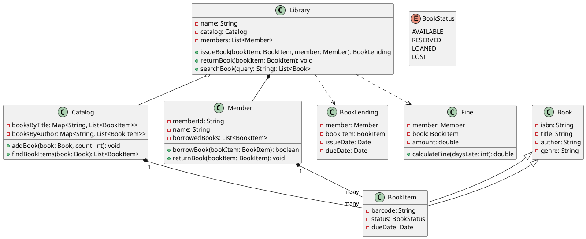

## Problem Statement

Design a library management system to handle books, members, and the process of borrowing and returning books.

## Requirements

- The library has a collection of books. Each book can have multiple copies.
- The system should be able to add new books and new members.
- Members can search for books by title, author, or genre.
- Members can borrow a copy of a book if it's available.
- A member has a limit on the number of books they can borrow at a time.
- The system should track the due date for each borrowed book.
- Members can return books. Overdue returns will incur a fine.
- The system should be able to check the availability of a book.

## Class Diagram



## Code Snippets

### Member

Represents a library member and their interactions.

```java
public class Member {
    private String memberId;
    private String name;
    private List<BookItem> borrowedBooks;
    private static final int MAX_BOOKS_ALLOWED = 5;

    public boolean borrowBook(BookItem bookItem) {
        if (borrowedBooks.size() >= MAX_BOOKS_ALLOWED) {
            System.out.println("Borrowing limit reached.");
            return false;
        }
        if (bookItem.getStatus() == BookStatus.AVAILABLE) {
            borrowedBooks.add(bookItem);
            bookItem.setStatus(BookStatus.LOANED);
            // set due date
            return true;
        }
        return false;
    }

    public void returnBook(BookItem bookItem) {
        borrowedBooks.remove(bookItem);
        bookItem.setStatus(BookStatus.AVAILABLE);
        // check for fines
    }
}
```

### Library

The central class managing the library's operations.

```java
public class Library {
    private Catalog catalog;
    private List<Member> members;

    public BookLending issueBook(BookItem bookItem, Member member) {
        if (member.borrowBook(bookItem)) {
            BookLending lending = new BookLending(member, bookItem);
            // Persist lending details
            return lending;
        }
        return null;
    }

    public void returnBook(BookItem bookItem) {
        Member member = findMemberByBook(bookItem); // helper method
        member.returnBook(bookItem);
        // check for fines
    }
}
```
