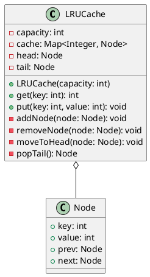

## Problem Statement

Design a Least Recently Used (LRU) cache. It should support `get` and `put` operations in O(1) time complexity.

## Requirements

- The cache has a fixed capacity.
- `get(key)`: Get the value of the key if the key exists in the cache, otherwise return -1. When a key is accessed, it should be marked as recently used.
- `put(key, value)`: Set or insert the value if the key is not already present. When the cache reaches its capacity, it should invalidate the least recently used item before inserting a new item.

## Class Diagram



## Code Snippets

Here are the core data structures and methods for the LRU cache.

### Node

A doubly linked list node to store the key-value pairs.

```java
class Node {
    int key;
    int value;
    Node prev;
    Node next;
}
```

### LRUCache

The main cache class using a HashMap for O(1) lookups and a doubly linked list to maintain the order of usage.

```java
class LRUCache {
    private Map<Integer, Node> cache = new HashMap<>();
    private int capacity;
    private Node head, tail;

    public LRUCache(int capacity) {
        this.capacity = capacity;
        head = new Node();
        tail = new Node();
        head.next = tail;
        tail.prev = head;
    }

    public int get(int key) {
        // ... implementation ...
    }

    public void put(int key, int value) {
        // ... implementation ...
    }
}
```
