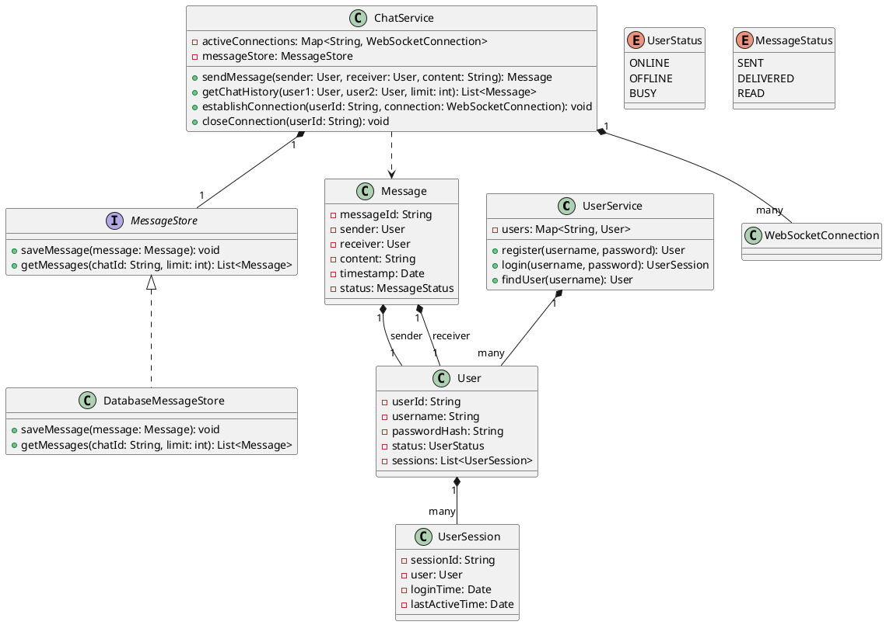

## Problem Statement

Design a one-on-one chat service that allows users to send and receive messages in real-time.

## Requirements

- Users should be able to register and log in.
- Users can search for other users.
- Users can initiate a chat with another user.
- Messages should be sent and received in real-time.
- The service should store chat history.
- Messages can be text.
- The system should support online/offline status for users.

## Class Diagram



## Code Snippets

### User Service

Handles user registration and lookup.

```java
public class UserService {
    private Map<String, User> users = new HashMap<>();

    public User register(String username, String password) {
        if (users.containsKey(username)) {
            throw new IllegalArgumentException("Username already exists.");
        }
        User newUser = new User(UUID.randomUUID().toString(), username, hashPassword(password), UserStatus.OFFLINE);
        users.put(username, newUser);
        return newUser;
    }

    public User findUser(String username) {
        return users.get(username);
    }

    private String hashPassword(String password) {
        // Simple placeholder, use a proper hashing algorithm in production
        return String.valueOf(password.hashCode());
    }
}
```

### Chat Service

Manages sending messages and connections.

```java
public class ChatService {
    private final MessageStore messageStore;
    private final Map<String, WebSocketConnection> activeConnections = new ConcurrentHashMap<>();

    public ChatService(MessageStore messageStore) {
        this.messageStore = messageStore;
    }

    public Message sendMessage(User sender, User receiver, String content) {
        Message message = new Message(UUID.randomUUID().toString(), sender, receiver, content, new Date(), MessageStatus.SENT);
        messageStore.saveMessage(message);

        // If receiver is online, send real-time
        WebSocketConnection receiverConnection = activeConnections.get(receiver.getUserId());
        if (receiverConnection != null) {
            receiverConnection.send(message.toJson()); // Assuming WebSocketConnection has a send method
            message.setStatus(MessageStatus.DELIVERED);
            messageStore.saveMessage(message); // Update status in store
        }
        return message;
    }

    public void establishConnection(String userId, WebSocketConnection connection) {
        activeConnections.put(userId, connection);
        // Update user status to ONLINE
    }

    public void closeConnection(String userId) {
        activeConnections.remove(userId);
        // Update user status to OFFLINE
    }
}
```
