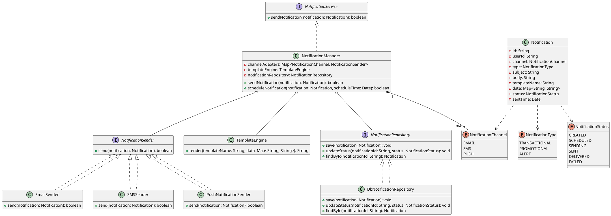

## Problem Statement

Design a flexible notification system that can send various types of notifications (e.g., email, SMS, push notifications) to users.

## Requirements

- The system should support multiple notification channels (Email, SMS, Push).
- Users can subscribe/unsubscribe to different types of notifications.
- The system should allow for scheduling notifications.
- It should handle different notification templates.
- Notifications should be trackable (sent, failed, delivered, read).
- The system should be scalable to handle a large volume of notifications.

## Class Diagram



## Code Snippets

### NotificationManager

The central component to manage and send notifications.

```java
public class NotificationManager implements NotificationService {
    private final Map<NotificationChannel, NotificationSender> channelAdapters;
    private final TemplateEngine templateEngine;
    private final NotificationRepository notificationRepository;

    public NotificationManager(Map<NotificationChannel, NotificationSender> channelAdapters,
                               TemplateEngine templateEngine,
                               NotificationRepository notificationRepository) {
        this.channelAdapters = channelAdapters;
        this.templateEngine = templateEngine;
        this.notificationRepository = notificationRepository;
    }

    @Override
    public boolean sendNotification(Notification notification) {
        notification.setStatus(NotificationStatus.SENDING);
        notificationRepository.save(notification);

        // Render template if present
        if (notification.getTemplateName() != null && !notification.getTemplateName().isEmpty()) {
            String renderedBody = templateEngine.render(notification.getTemplateName(), notification.getData());
            notification.setBody(renderedBody);
        }

        NotificationSender sender = channelAdapters.get(notification.getChannel());
        if (sender != null) {
            boolean success = sender.send(notification);
            notification.setStatus(success ? NotificationStatus.SENT : NotificationStatus.FAILED);
            notification.setSentTime(new Date());
            notificationRepository.updateStatus(notification.getId(), notification.getStatus());
            return success;
        }
        notification.setStatus(NotificationStatus.FAILED);
        notificationRepository.updateStatus(notification.getId(), notification.getStatus());
        return false;
    }

    public boolean scheduleNotification(Notification notification, Date scheduleTime) {
        notification.setStatus(NotificationStatus.SCHEDULED);
        notification.setSentTime(scheduleTime); // Use this field for scheduleTime
        notificationRepository.save(notification);
        // In a real system, this would involve adding the notification to a queue
        // processed by a scheduler service.
        return true;
    }
}
```

### EmailSender

An example implementation for sending emails.

```java
public class EmailSender implements NotificationSender {
    @Override
    public boolean send(Notification notification) {
        System.out.println("Sending email to: " + notification.getUserId());
        System.out.println("Subject: " + notification.getSubject());
        System.out.println("Body: " + notification.getBody());
        // Simulate actual email sending
        return Math.random() > 0.1; // 90% success rate
    }
}
```
