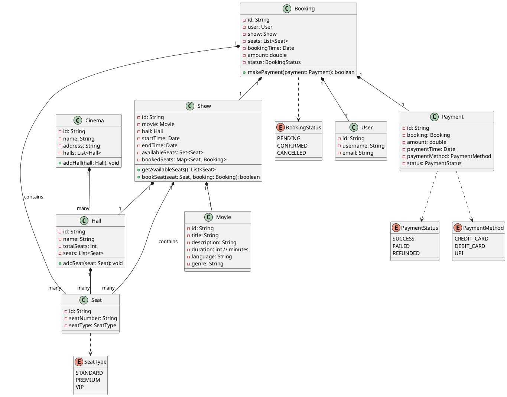

## Problem Statement

Design an online movie ticket booking system where users can view movie listings, select shows, choose seats, and book tickets.

## Requirements

- Users can browse movies currently showing.
- Users can view showtimes for a selected movie at various cinemas.
- Users can select a specific showtime and view the seating layout.
- Users can select available seats.
- The system should prevent multiple users from booking the same seat simultaneously.
- Users can make payments for their selected tickets.
- Users should receive a booking confirmation and an e-ticket.
- The system should manage cinema halls, movies, and show schedules.

## Class Diagram



## Code Snippets

### Show

Manages seat availability and booking for a specific showtime.

```java
public class Show {
    private String id;
    private Movie movie;
    private Hall hall;
    private Date startTime;
    private Date endTime;
    private Set<Seat> availableSeats; // All initially available seats
    private Map<Seat, Booking> bookedSeats; // Seats currently booked or held

    public synchronized boolean bookSeat(Seat seat, Booking booking) {
        if (!availableSeats.contains(seat)) {
            System.out.println("Seat " + seat.getSeatNumber() + " is not available.");
            return false;
        }
        if (bookedSeats.containsKey(seat)) {
            // This seat is already held or booked by another transaction
            System.out.println("Seat " + seat.getSeatNumber() + " is already taken.");
            return false;
        }
        // Temporarily hold the seat (e.g., for 5-10 minutes)
        bookedSeats.put(seat, booking);
        availableSeats.remove(seat); // Or mark as 'held' for a payment window
        System.out.println("Seat " + seat.getSeatNumber() + " held for booking " + booking.getId());
        return true;
    }

    public synchronized void releaseSeat(Seat seat) {
        if (bookedSeats.containsKey(seat)) {
            bookedSeats.remove(seat);
            availableSeats.add(seat);
            System.out.println("Seat " + seat.getSeatNumber() + " released.");
        }
    }
}
```

### Booking

Represents a user's ticket booking.

```java
public class Booking {
    private String id;
    private User user;
    private Show show;
    private List<Seat> seats;
    private Date bookingTime;
    private double amount;
    private BookingStatus status;

    public boolean makePayment(Payment payment) {
        // Integrate with a payment gateway
        // For simplicity, assume payment is always successful
        if (payment.getStatus() == PaymentStatus.SUCCESS) {
            this.status = BookingStatus.CONFIRMED;
            System.out.println("Booking " + this.id + " confirmed.");
            return true;
        } else {
            // Handle failed payment: release seats, notify user
            for (Seat seat : seats) {
                show.releaseSeat(seat);
            }
            this.status = BookingStatus.CANCELLED;
            System.out.println("Booking " + this.id + " cancelled due to payment failure.");
            return false;
        }
    }
}
```
