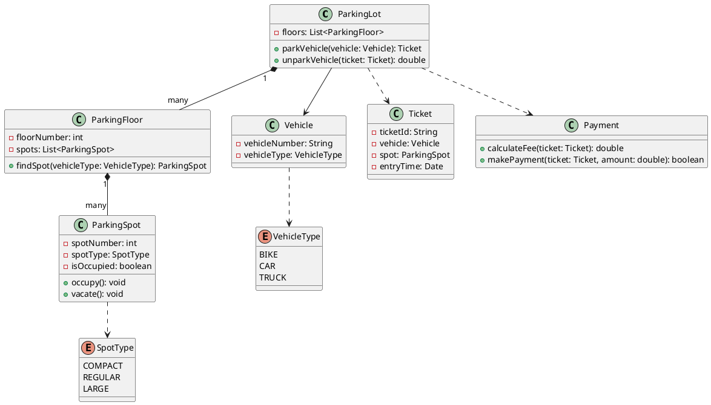

## Problem Statement

Design a parking lot system that can manage parking spaces for different types of vehicles. The system should be able to issue tickets, calculate fees, and handle payments.

## Requirements

- The parking lot has multiple floors.
- Each floor has multiple parking spots.
- Parking spots can be of different types: compact, regular, and large.
- Vehicles can be of different types: car, bike, and truck.
- A bike can park in a compact or regular spot.
- A car can park in a regular spot.
- A truck can park in a large spot.
- The system should not allow a vehicle to park if no suitable spot is available.
- The system should issue a ticket when a vehicle enters the parking lot.
- The ticket should contain the vehicle number, spot number, and entry time.
- The system should calculate the parking fee based on the duration of the stay.
- The system should handle payments and allow the vehicle to exit.

## Class Diagram

