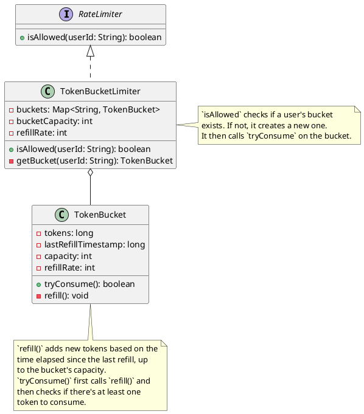

## Problem Statement

Design a rate limiter to control the number of requests a user can make to an API within a certain time window.

## Requirements

- The rate limiter should limit the number of requests per user.
- The configuration (e.g., 100 requests per minute) should be flexible.
- The system should be able to handle a large number of users and requests efficiently.
- When a user exceeds the limit, the system should block their requests and return an appropriate error.

## Class Diagram

This diagram shows a Token Bucket algorithm implementation.



## Code Snippets

### TokenBucket

The core logic for a single user's token bucket.

```java
public class TokenBucket {
    private final long capacity;
    private final int refillRate; // tokens per second
    private long currentTokens;
    private long lastRefillTimestamp;

    public TokenBucket(long capacity, int refillRate) {
        this.capacity = capacity;
        this.refillRate = refillRate;
        this.currentTokens = capacity;
        this.lastRefillTimestamp = System.nanoTime();
    }

    public synchronized boolean tryConsume() {
        refill();
        if (currentTokens >= 1) {
            currentTokens--;
            return true;
        } else {
            return false;
        }
    }

    private void refill() {
        long now = System.nanoTime();
        double elapsedSeconds = (now - lastRefillTimestamp) / 1.0e9;
        long tokensToAdd = (long) (elapsedSeconds * refillRate);
        if (tokensToAdd > 0) {
            currentTokens = Math.min(capacity, currentTokens + tokensToAdd);
            lastRefillTimestamp = now;
        }
    }
}
```

### TokenBucketLimiter

Manages buckets for all users.

```java
public class TokenBucketLimiter implements RateLimiter {
    private final int bucketCapacity;
    private final int refillRate;
    private final ConcurrentMap<String, TokenBucket> buckets = new ConcurrentHashMap<>();

    public TokenBucketLimiter(int bucketCapacity, int refillRate) {
        this.bucketCapacity = bucketCapacity;
        this.refillRate = refillRate;
    }

    @Override
    public boolean isAllowed(String userId) {
        TokenBucket bucket = buckets.computeIfAbsent(userId, k -> new TokenBucket(bucketCapacity, refillRate));
        return bucket.tryConsume();
    }
}
```
